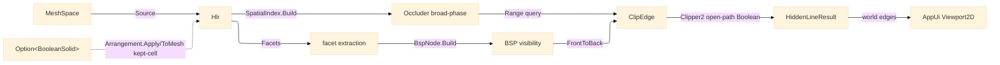

# [RASM_FABRICATION_HIDDEN_LINE]

The hidden-line-removal kernel: a BSP-tree front-to-back visibility solver plus a Clipper2 open-path-Boolean screen clip producing the world-space visible/hidden/silhouette edge sets the AppUi `Render/drafting#PROJECTION` `Viewport2D` consumes BELOW its painter sort. The BSP front-to-back ordering and the silhouette extraction are author-kernel — the property a back-to-front painter sort cannot give, so a concave self-occluding solid resolves correctly. The screen clip rides the `Geometry2D/algebra#POLYGON_ALGEBRA` Clipper2 substrate: each candidate edge is intersected and differenced against the front-to-back occluder screen polygons, the integer-robust Boolean clip replacing the hand-rolled parameter-interval subtraction. For a boolean-combined watertight solid the silhouette arm composes the kernel `Rasm/Meshing/arrangement#ARRANGEMENT` exact arrangement substrate: when the `HiddenLine` policy carries an `Option<BooleanSolid>` watertight operand, `Hlr.Solve` runs `Arrangement.Apply(ArrangementKind.MeshBoolean, model, other, op, policy)` and reads the kept-cell boundary the `Arrangement.ToMesh` re-emits as the watertight `MeshSpace` the same per-facet `Facets`/silhouette pipeline projects — so a true boolean profile drafts an exact outline with NO native CSG asset, NO in-folder CSG kernel, and NO coupling to the `ArrangementStore`/`SimplexStore` internals, while the per-facet HLR kernel stays the pure-managed default for ordinary projection. The kernel composes the kernel `Rasm/Spatial/index#SPATIAL_INDEX` `SpatialIndex` BVH broad-phase for occluder candidate pruning, the kernel `Rasm/Numerics/predicates#ROBUST_PREDICATES` `Predicate.Orient2D` exact orientation for the silhouette view-dot sign floor, and the `Process/owner#FABRICATION_OWNER` `Loop`/`Edge3`/`ProjectionDir`/`FabricationResult` shared vocabulary. It is dispatched by the `Process/owner#FABRICATION_OWNER` `Run` fold's `HiddenLine` policy case; it mints no second `Viewport2D`, no second acceleration structure, and computes no hash.

Wire posture: HOST-LOCAL. The world-space `HiddenLineResult` edge sets cross only the in-process seam to the AppUi `Viewport2D` consumer — a CONSUMPTION seam where AppUi reads and Fabrication produces, the projection-to-sheet owned by AppUi. The `Facet`/`BspNode` interior records are host-local types that never sit between wire and rail.

## [01]-[INDEX]

- [01]-[PROJECTION_HIDDEN_LINE]: owns the BSP front-to-back visibility ordering plus the Clipper2 open-path-Boolean screen clip, the `BooleanSolid` watertight-composition operand and the kernel-arrangement silhouette arm, producing the world-space visible/hidden/silhouette edge sets the AppUi `Viewport2D` consumes.

## [02]-[PROJECTION_HIDDEN_LINE]

- Owner: the `Process/owner#FABRICATION_OWNER` `ProjectionDir` view basis COMPOSED (the type mints on owner#atoms — the seam inversion; this page reads it, never declares it); `BooleanSolid` the watertight-composition operand the `HiddenLine` policy carries (the second `MeshSpace`, the kernel `Rasm/Processing/repair#HEALING` `BooleanOp`, and the model `Context` tolerance the silhouette arm folds the model against through the arrangement seam); `Facet` the projected triangle carrying its world vertices, its native topology vertex indices, its plane, its view-space depth, and its screen-space 2D footprint; `BspNode` the binary space-partition node splitting the facet set by a chosen facet's supporting plane into in-front/behind half-spaces; `Hlr` the static visibility fold sourcing the projected mesh (the raw `model`, or the watertight kept-cell mesh the arrangement re-emits when the policy carries a `BooleanSolid`), building the BSP, resolving silhouette edges, and clipping every candidate edge against the front-to-back occluder set through the Clipper2 screen Boolean.
- Cases: an edge is `Visible` (no occluder facet covers its screen footprint), `Hidden` (covered by a strictly-nearer occluder), or a `Silhouette` (a mesh edge whose two incident facets face opposite the view — the boundary the drafted outline traces); the partition is the three `HiddenLineResult` sets, never three parallel solver passes; the projected mesh is sourced ONCE — the raw `model` for ordinary projection, the `Arrangement.ToMesh` kept-cell boundary for the watertight-solid case — feeding the same `Facets` extraction, never a parallel watertight solver.
- Entry: `public static Fin<FabricationResult> Solve(FabricationPolicy.HiddenLine policy, FabricationInput input)` — `Fin<T>` routes `GeometryFault.DegenerateInput` on an absent model or a degenerate (zero-area) facet set and the composed band-2400 `GeometryFault` the arrangement seam routes on a degenerate boolean operand; the body sources the projected mesh (the watertight arm composing `Arrangement.Apply`/`ToMesh` when the policy carries a `BooleanSolid`, the raw `model` otherwise), extracts facets, builds the BSP over their planes, extracts silhouette edges, broad-phase-prunes occluder candidates per edge through the settled `SpatialIndex`, and Clipper2-clips each edge into its visible and hidden runs.
- Auto: `Hlr.Solve` reads `policy.Watertight` — when it carries a `BooleanSolid`, the projected mesh is the kept-cell boundary `Arrangement.Apply(ArrangementKind.MeshBoolean, model, solid.Other, solid.Op, ArrangementPolicy.Canonical).Bind(a => a.ToMesh(solid.Tolerance))` re-emits (the operand's own `Context` tolerance the `BooleanSolid` carries, not a folder default) (the exact boolean profile the per-facet kernel could not draft from two un-combined operands), else the raw `input.Model`; then it projects every mesh facet to screen space under `ProjectionDir`, builds the `BspNode` tree by picking a splitting facet and partitioning the rest into the plane's positive/negative half-spaces (the front-to-back traversal order a back-to-front painter sort cannot give); silhouette edges are the mesh edges whose two incident facet normals dot the view with opposite sign (the `Predicate.Orient2D`-grounded sign on the projected incident triangles); each candidate edge queries the `SpatialIndex` `Range` for the facets whose screen bound covers it, and `ClipEdge` walks those occluders front-to-back, intersecting the edge against each strictly-nearer occluder's screen polygon through the `Geometry2D/algebra#POLYGON_ALGEBRA` open-path Boolean — the difference runs survive as `Visible` world-space sub-edges, the intersection runs are `Hidden`.
- Receipt: the `HiddenLineResult` carries the visible/hidden/silhouette edge sets directly — the partition IS the evidence the AppUi consumer projects; no separate visibility ledger.
- Packages: `Rasm.Meshing` (`MeshSpace` — composed), `Rhino.Geometry` (`Point3d`/`Vector3d` — composed), `Rasm.Numerics` (`Predicate.Orient2D` — settled), `Rasm.Spatial` (`SpatialIndex` — settled), `Rasm.Meshing` (`Arrangement.Apply`/`ToMesh`, `ArrangementKind.MeshBoolean`, `ArrangementPolicy.Canonical` — the watertight kept-cell arrangement seam, COMPOSED, never an in-folder CSG kernel), `Rasm.Processing` (`BooleanOp` `[SmartEnum<int>]` — the union/difference/intersection the `BooleanSolid` carries), Clipper2 (open-path Boolean for the screen clip, via `Geometry2D/algebra#POLYGON_ALGEBRA`), LanguageExt.Core, BCL inbox.
- Growth: a curved-surface analytic silhouette (widening past facets) is one `Facet`-builder arm over the surface tessellation; the watertight-solid silhouette over a boolean-combined solid is the realized `BooleanSolid` arm — the `Hlr.Solve` mesh-source fold composes the kernel exact arrangement (the `Rasm` `Meshing/arrangement#ARRANGEMENT` `Arrangement` `[Union]` (`MeshBoolean`/`PlanarOverlay`/`CellComplex`) exact-boolean owner over the settled `Meshing/delaunay#TESSELLATION` constrained-Delaunay and `Meshing/offset#STRAIGHT_SKELETON` substrates), reading the kept-cell boundary the arrangement `Apply`/`ToMesh` re-emits, NOT a native CSG asset and NOT an in-folder CSG author-kernel — the per-facet kernel projects the re-emitted watertight mesh unchanged, the boolean composition the one arrangement-seam compose-call; the Fabrication half (the compose-call against the settled `Arrangement.Apply`/`ToMesh` signature) is realized here, the upstream `Rasm/Meshing` arrangement C# owner's realization the deferred cross-package leg the seam aligns against; zero new surface.
- Boundary: the kernel produces world-space EDGE SETS and the AppUi `Viewport2D` owns the projection-to-sheet — Fabrication deepens the substance, never re-mints the frame; the BSP is the visibility owner and a painter back-to-front sort is the AppUi approximation this kernel SUPERSEDES when the `Viewport2D` needs CAD-grade hidden-line; occluder candidate pruning reads the settled `SpatialIndex` and a local BVH is the deleted form; the screen clip rides the one `Geometry2D/algebra#POLYGON_ALGEBRA` Clipper2 owner and a hand-rolled parameter-interval `SpanInside` subtraction is the deleted form; the watertight silhouette composes the kernel `Rasm` `Meshing/arrangement#ARRANGEMENT` exact arrangement and an in-folder CSG author-kernel or a native CSG asset is the rejected form — the silhouette reads the kernel arrangement's exact kept-cell outline through `Arrangement.Apply`/`ToMesh`, never couples the kernel `ArrangementStore`/`SimplexStore` interior, the `BooleanSolid` policy operand the one watertight ingress and the per-facet kernel projecting the re-emitted mesh unchanged; the silhouette view-dot side test reads `Predicate.Orient2D` exact sign and a `double` cross-product at the call site is the named robustness defect; an edge pairs by the ordered `(int,int)` native topology vertex-index key, never a lossy `Point3d` hash — Fabrication mints no hash.

```csharp signature
// --- [RUNTIME_PRELUDE] --------------------------------------------------------------------
using LanguageExt;
using LanguageExt.Common;
using Rasm.Fabrication.Geometry2D;
using Rasm.Fabrication.Process;
using Rasm.Meshing;
using Rasm.Numerics;
using Rasm.Processing;
using Rasm.Spatial;
using Rhino.Geometry;
using static LanguageExt.Prelude;

namespace Rasm.Fabrication.Documentation;

// --- [MODELS] -----------------------------------------------------------------------------
// ProjectionDir is the owner#atoms type (Process/owner) — composed here, never re-declared.
public readonly record struct BooleanSolid(MeshSpace Other, BooleanOp Op, Context Tolerance);

public readonly record struct Facet(Point3d A, Point3d B, Point3d C, int Va, int Vb, int Vc, Vector3d Normal, Loop Screen, double Depth) {
    public bool FacesViewer(Vector3d forward) => Normal * forward < 0.0;

    public Seq<((int Lo, int Hi) Key, Edge3 Edge)> EdgeKeys() =>
        Seq(((Math.Min(Va, Vb), Math.Max(Va, Vb)), new Edge3(A, B)),
            ((Math.Min(Vb, Vc), Math.Max(Vb, Vc)), new Edge3(B, C)),
            ((Math.Min(Vc, Va), Math.Max(Vc, Va)), new Edge3(C, A)));
}

public sealed record BspNode(Facet Splitter, Option<BspNode> Front, Option<BspNode> Back) {
    public static Option<BspNode> Build(Seq<Facet> facets) {
        if (facets.IsEmpty) return None;
        Facet pivot = facets.Head;
        var (front, back) = facets.Tail.Partition(f => SideOf(pivot, f) >= 0);
        return Some(new BspNode(pivot, Build(front.ToSeq()), Build(back.ToSeq())));
    }

    static int SideOf(Facet plane, Facet f) {
        Point3d c = new((f.A.X + f.B.X + f.C.X) / 3.0, (f.A.Y + f.B.Y + f.C.Y) / 3.0, (f.A.Z + f.B.Z + f.C.Z) / 3.0);
        return Math.Sign((c - plane.A) * plane.Normal);
    }

    public Seq<Facet> FrontToBack(Point3d eye) {
        bool eyeFront = (eye - Splitter.A) * Splitter.Normal >= 0.0;
        Seq<Facet> near = (eyeFront ? Front : Back).Match(n => n.FrontToBack(eye), () => Seq<Facet>());
        Seq<Facet> far = (eyeFront ? Back : Front).Match(n => n.FrontToBack(eye), () => Seq<Facet>());
        return near.Add(Splitter).Concat(far);
    }
}

// --- [OPERATIONS] -------------------------------------------------------------------------
public static class Hlr {
    public static Fin<FabricationResult> Solve(FabricationPolicy.HiddenLine policy, FabricationInput input) =>
        input.Model.Match(
            None: () => Fin.Fail<FabricationResult>(GeometryFault.DegenerateInput("hlr:no-model").ToError()),
            Some: raw => Source(raw, policy.Watertight).Bind(model => {
                Seq<Facet> facets = Facets(model, input.View, policy.FacetTolerance);
                if (facets.IsEmpty) return Fin.Fail<FabricationResult>(GeometryFault.DegenerateInput("hlr:no-facets").ToError());
                Option<BspNode> bsp = BspNode.Build(facets);
                Seq<Edge3> silhouette = Silhouette(facets, input.View.Forward);
                BoundingBox[] occluderBounds = facets.Map(static f => f.Screen.Bound()).ToArray();
                return SpatialIndex.Build(SpatialKind.Bvh, occluderBounds, BuildPolicy.Canonical with { LeafSize = policy.SpatialLeaf })
                    .Map(index => {
                        Point3d eye = input.View.Forward.IsZero ? Point3d.Origin : Point3d.Origin - 1e6 * input.View.Forward;
                        Seq<Facet> ordered = bsp.Match(n => n.FrontToBack(eye), () => facets);
                        var (visible, hidden) = silhouette.Concat(MeshEdges(facets))
                            .Fold((Visible: Seq<Edge3>(), Hidden: Seq<Edge3>()), (acc, edge) => {
                                var (vis, hid) = ClipEdge(edge, ordered, index, facets, input.View);
                                return (acc.Visible.Concat(vis), acc.Hidden.Concat(hid));
                            });
                        return (FabricationResult)new FabricationResult.HiddenLineResult(visible, hidden, silhouette);
                    });
            }));

    // The projected mesh is sourced once: the watertight kept-cell boundary the kernel arrangement
    // re-emits for a boolean-combined solid, or the raw model for ordinary projection.
    static Fin<MeshSpace> Source(MeshSpace model, Option<BooleanSolid> watertight) =>
        watertight.Match(
            None: () => Fin.Succ(model),
            Some: solid => Arrangement.Apply(ArrangementKind.MeshBoolean, model, solid.Other, solid.Op, ArrangementPolicy.Canonical)
                .Bind(a => a.ToMesh(solid.Tolerance)));

    static Seq<Facet> Facets(MeshSpace model, ProjectionDir view, double tolerance) {
        Mesh mesh = model.DuplicateNative();
        mesh.Faces.ConvertQuadsToTriangles();
        mesh.FaceNormals.ComputeFaceNormals();
        return toSeq(Enumerable.Range(0, mesh.Faces.Count)).Map(fi => {
            MeshFace face = mesh.Faces[fi];
            Point3d a = mesh.Vertices[face.A], b = mesh.Vertices[face.B], c = mesh.Vertices[face.C];
            Vector3d n = mesh.FaceNormals[fi];
            Point3d pa = view.Project(a), pb = view.Project(b), pc = view.Project(c);
            var screen = new Loop(Arr(pa, pb, pc), Closed: true).AsCcw();
            return new Facet(a, b, c, face.A, face.B, face.C, n, screen, (pa.Z + pb.Z + pc.Z) / 3.0);
        }).Filter(f => f.Screen.Bound().Diagonal.Length > tolerance);
    }

    static Seq<Edge3> Silhouette(Seq<Facet> facets, Vector3d forward) =>
        toSeq(facets.Bind(f => f.EdgeKeys().Map(e => (e.Key, e.Edge, Facet: f)))
            .GroupBy(static t => t.Key)
            .Select(g => {
                var inc = g.ToSeq();
                bool silhouette = inc.Count == 1 ||
                    Math.Sign(inc[0].Facet.Normal * forward) != Math.Sign(inc[1].Facet.Normal * forward);
                return (Edge: inc[0].Edge, Silhouette: silhouette);
            }))
            .Filter(static r => r.Silhouette)
            .Map(static r => r.Edge);

    static Seq<Edge3> MeshEdges(Seq<Facet> facets) =>
        facets.Bind(f => f.EdgeKeys().Map(e => e.Edge));

    static (Seq<Edge3> Visible, Seq<Edge3> Hidden) ClipEdge(Edge3 edge, Seq<Facet> ordered, SpatialIndex index, Seq<Facet> facets, ProjectionDir view) {
        Point3d sa = view.Project(edge.A), sb = view.Project(edge.B);
        double edgeDepth = (sa.Z + sb.Z) / 2.0;
        var bound = new BoundingBox(new[] { sa, sb });
        Seq<int> candidates = (index.Query(new SpatialQuery.Range(bound, None)) as QueryResult.Hits)?.Ids ?? Seq<int>();
        Seq<Loop> occluders = candidates.Filter(fi => facets[fi].Depth < edgeDepth).Map(fi => facets[fi].Screen);
        var runs = PolygonAlgebra.ClipOpenPath(new Edge3(sa, sb), occluders);
        Seq<Edge3> vis = runs.Outside.Map(r => new Edge3(Unproject(edge, sa, sb, r.A), Unproject(edge, sa, sb, r.B)));
        Seq<Edge3> hid = runs.Inside.Map(r => new Edge3(Unproject(edge, sa, sb, r.A), Unproject(edge, sa, sb, r.B)));
        return (vis, hid);
    }

    static Point3d Unproject(Edge3 world, Point3d sa, Point3d sb, Point3d screen) {
        double len = sa.DistanceTo(sb);
        double t = len < 1e-12 ? 0.0 : sa.DistanceTo(screen) / len;
        return world.A + t * (world.B - world.A);
    }
}
```


