# [RASM_FABRICATION_HIDDEN_LINE]

The hidden-line documentation plane consumes the kernel `Rasm.Drawing` visibility engine and produces the screen-run receipt the AppUi drafting surface reads. `Hlr.Solve` lowers the owner#atoms basis and policy into the REAL kernel contract: `ProjectionDir` lowers to a `Camera` (orthographic frame — eye placed one model-diagonal behind the bounds center along the reversed forward axis, screen plane spanned by the basis, the model `Context` threaded from `MeshSpace.Tolerance`), the policy's `FacetTolerance`/`SpatialLeaf` lower into `ViewPolicy` (`Narrow.BroadPhaseInflation` and `Broad.LeafSize` over the `Canonical` rows), and TWO kernel ops fill the three receipt partitions — `ViewOp.HiddenLine` answers the visible and hidden Appel runs, `ViewOp.Silhouette` answers the raw locus the third partition carries, both through the ONE `Fin<DrawingProjection> View.Apply` entry. Boolean pre-combination folds the operand sequence through kernel `Arrangement.Apply(ArrangementOp.MeshBoolean(...))` reading `ArrangementResult.Boolean.Solid`; `BooleanOp` and `ArrangementPolicy` are kernel `Rasm.Meshing` vocabulary, mesh healing stays `Rasm.Processing`'s upstream concern, and this page owns no visibility solver, no Boolean interior, no projection fault arm, and no hash.

Wire posture: HOST-LOCAL. `HiddenLineResult` crosses only as in-process `Seq<Edge3>` partitions of SCREEN-plane runs (`Camera.Project` emits `(u/depth, v/depth, 0)` — the sheet-space coordinates AppUi composes); AppUi owns sheet-space composition, kernel drawing owns analytic visibility, kernel arrangement owns watertight solid composition, and Fabrication owns the fabrication-policy seam.

## [01]-[INDEX]

- [01]-[PROJECTION_HIDDEN_LINE]: owns the `Hlr.Solve` policy lowering into kernel `View.Apply` (camera synthesis, view-policy synthesis, the two-op partition fill), the `BooleanSolid` watertight operand-sequence seam into kernel `Arrangement.Apply`, and the preserved `HiddenLineResult(Seq<Edge3> Visible, Seq<Edge3> Hidden, Seq<Edge3> Silhouette)` receipt projection.

## [02]-[PROJECTION_HIDDEN_LINE]

- Owner: `BooleanSolid` is the watertight operand row carried by `FabricationPolicy.HiddenLine` — the operand sequence folds each `(MeshSpace, BooleanOp)` pair left onto the model under one `ArrangementPolicy`; `Hlr` is the single Fabrication entry lowered by owner#run. `ProjectionDir`, `Edge3`, `FabricationInput`, `FabricationPolicy`, and `FabricationResult` stay owner#atoms vocabulary; `Camera`, `ViewPolicy`, `ViewOp`, `DrawingProjection`, `ProjectedSegment`, `BooleanOp`, `ArrangementOp`, `ArrangementPolicy`, and `ArrangementResult` stay kernel-owned seams.
- Cases: `BooleanSolid` carries `Seq<(MeshSpace Other, BooleanOp Op)> Operands` and `ArrangementPolicy Policy`; `FabricationResult.HiddenLineResult` is the sole receipt. Kernel `ViewOp` owns `Silhouette`/`HiddenLine`/`Section`/`Outline`; this page consumes `HiddenLine` and `Silhouette` — the silhouette locus is a separate kernel solve, never a field the hidden-line result carries — and mints no parallel drawing family or field-rename adapter.
- Entry: `public static Fin<FabricationResult> Solve(FabricationPolicy.HiddenLine policy, FabricationInput input)` sources the mesh from raw `input.Model` or the arrangement fold, synthesizes `Camera` from `input.View` and `ViewPolicy` from the policy scalars, runs `View.Apply` twice (`HiddenLine`, then `Silhouette` over the same camera and policy), and maps the kernel runs into `FabricationResult.HiddenLineResult`.
- Auto: `Source` reads `policy.Watertight`; an absent operand row passes the raw `MeshSpace`, while a present row folds each operand through `Arrangement.Apply(new ArrangementOp.MeshBoolean(current, other, op, policy), HlrOp)`. The generated total `ArrangementResult.Switch` yields `Boolean.Solid`; `Overlay`/`Complex` are impossible for a `MeshBoolean` request and route `HlrOp.InvalidResult()`. `Lower` admits finite positive bounds, facet tolerance, and leaf capacity before deriving the orthographic camera and view policy. The independent hidden-line and silhouette operations convert to `Validation`, join applicatively, and lower once to `Fin`; their `ProjectedSegment` rows project directly into `FabricationResult.HiddenLineResult` as `Edge3(ScreenA, ScreenB)` partitions without sampling, reclassification, or sorting.
- Receipt: `HiddenLineResult(Seq<Edge3> Visible, Seq<Edge3> Hidden, Seq<Edge3> Silhouette)` is the only receipt; AppUi remains insulated at the exact owner#atoms case shape and never sees `DrawingProjection` or `ProjectedSegment`.
- Packages: `Process/owner` (`ProjectionDir`, `Edge3`, `FabricationInput`, `FabricationPolicy.HiddenLine`, `FabricationResult.HiddenLineResult`), kernel drawing (`View.Apply`, `ViewOp`, `Camera`, `ViewPolicy`, `DrawingProjection`, `ProjectedSegment`), kernel arrangement (`Arrangement.Apply`, `ArrangementOp.MeshBoolean`, `ArrangementResult.Boolean`, `BooleanOp`, `ArrangementPolicy`), kernel spatial (`BuildPolicy`), `Rasm.Meshing`, `Rasm.Domain`, Rhino.Geometry, LanguageExt.Core, BCL inbox.
- Growth: a new drafting projection is one kernel `ViewOp` case and one downstream consumer projection; Fabrication stays a hidden-line policy consumer. A new watertight operand is one row in the `BooleanSolid` sequence — the fold absorbs arity. A new receipt column lands first on owner#atoms, then this adapter copies it.
- Boundary: the dead forms stay dead — the in-page `BspNode` tree, the `1e6` eye literal, the per-edge average-depth classifier, the mesh-edge soup, the local `SpatialIndex` visibility walk, a `Silhouette` field read off the hidden-line result (the kernel result carries visible/hidden/histogram — the locus is its own op), a `ProjectedSegment` assigned into an `Edge3` field without the seam projection, a `HealOp` operand on the arrangement request (healing precedes admission in `Rasm.Processing`), and a `Rasm.Processing` attribution for `BooleanOp` (it lives in kernel `Rasm.Meshing`). Kernel `DrawingProjection` owns analytic visibility and faults; kernel arrangement owns watertight Boolean cells; Fabrication never re-authors either interior and never mints a Documentation `FabricationFault` arm.

```csharp signature
// --- [RUNTIME_PRELUDE] ----------------------------------------------------------------------------------------------------------------------------
using LanguageExt;
using Rasm.Domain;
using Rasm.Drawing;
using Rasm.Fabrication.Process;
using Rasm.Meshing;
using Rasm.Numerics;
using Rasm.Spatial;
using Rhino.Geometry;
using static LanguageExt.Prelude;

namespace Rasm.Fabrication.Documentation;

// --- [MODELS] -------------------------------------------------------------------------------------------------------------------------------------
// Watertight projection consumes kernel arrangement output; the operand SEQUENCE folds left onto the model under
// the one ArrangementPolicy — healing is Rasm.Processing's upstream concern and never rides this row.
public readonly record struct BooleanSolid(Seq<(MeshSpace Other, BooleanOp Op)> Operands, ArrangementPolicy Policy);

// --- [OPERATIONS] ---------------------------------------------------------------------------------------------------------------------------------
public static class Hlr {
    static readonly Op HlrOp = Op.Of(name: "fabrication:hidden-line");

    // Two kernel solves fill the three partitions: HiddenLine answers visible+hidden, Silhouette answers the raw
    // locus — the same camera and policy thread both, so the partitions are mutually consistent by construction.
    public static Fin<FabricationResult> Solve(FabricationPolicy.HiddenLine policy, FabricationInput input) =>
        from model in Source(input, policy.Watertight)
        from lowered in Lower(model, input.View, policy)
        from projection in (
            View.Apply(new ViewOp.HiddenLine(model, lowered.Camera, lowered.Policy), HlrOp).ToValidation(),
            View.Apply(new ViewOp.Silhouette(model, lowered.Camera, lowered.Policy), HlrOp).ToValidation())
            .Apply(static (lines, locus) => (Lines: lines, Locus: locus))
            .As()
            .ToFin()
        select (FabricationResult)new FabricationResult.HiddenLineResult(
            Edges(projection.Lines.Visible),
            Edges(projection.Lines.Hidden),
            Edges(projection.Locus.Visible));

    static Fin<MeshSpace> Source(FabricationInput input, Option<BooleanSolid> watertight) =>
        input.Model.Match(
            None: () => Fin.Fail<MeshSpace>(new GeometryFault.DegenerateInput(Kind.Mesh, 0, "model-missing").ToError()),
            Some: model => watertight.Match(
                None: () => Fin.Succ(model),
                Some: solid => solid.Operands.FoldM(model, (current, operand) =>
                    Arrangement.Apply(
                        new ArrangementOp.MeshBoolean(current, operand.Other, operand.Op, solid.Policy),
                        HlrOp)
                    .Bind(static result => result.Switch(
                        boolean: static kept => Fin.Succ(kept.Solid),
                        overlay: static _ => Fin.Fail<MeshSpace>(HlrOp.InvalidResult()),
                        complex: static _ => Fin.Fail<MeshSpace>(HlrOp.InvalidResult()))))));

    // Orthographic frame off the atoms basis: eye one bounds-diagonal behind the center along −Forward (every model
    // point lands at positive depth), screen plane spanned by the basis, the model Context threading the tolerance.
    static Fin<(Camera Camera, ViewPolicy Policy)> Lower(MeshSpace model, ProjectionDir dir, FabricationPolicy.HiddenLine policy) {
        BoundingBox box = model.Native.GetBoundingBox(accurate: false);
        double diagonal = box.Diagonal.Length;
        return from _1 in guard(box.IsValid && double.IsFinite(diagonal) && diagonal > model.Tolerance.Absolute.Value, HlrOp.InvalidResult()).ToFin()
               from _2 in guard(double.IsFinite(policy.FacetTolerance) && policy.FacetTolerance > 0.0 && policy.SpatialLeaf > 0, HlrOp.InvalidResult()).ToFin()
               select (
                   new Camera(
                       Eye: box.Center - (dir.Forward * diagonal),
                       Direction: dir.Forward,
                       Screen: new Plane(box.Center, dir.ScreenU, dir.ScreenV),
                       Perspective: false,
                       Tolerance: model.Tolerance),
                   ViewPolicy.Canonical with {
                       Narrow = IntersectPolicy.Canonical with { BroadPhaseInflation = policy.FacetTolerance },
                       Broad = BuildPolicy.Canonical with { LeafSize = policy.SpatialLeaf },
                   });
    }

    static Seq<Edge3> Edges(Seq<ProjectedSegment> runs) =>
        runs.Map(static s => new Edge3(s.ScreenA, s.ScreenB));
}
```

```mermaid
---
config:
  theme: base
  look: classic
  layout: elk
  flowchart:
    curve: linear
    padding: 25
  themeVariables:
    darkMode: true
    fontFamily: "SF Mono, Menlo, Cascadia Mono, Segoe UI Mono, Consolas, monospace"
    useGradient: false
    dropShadow: "none"
    background: "#282A36"
    primaryColor: "#44475A"
    primaryTextColor: "#F8F8F2"
    primaryBorderColor: "#BD93F9"
    mainBkg: "#44475A"
    nodeBorder: "#BD93F9"
    lineColor: "#FF79C6"
    textColor: "#F8F8F2"
    edgeLabelBackground: "#21222C"
    labelBackgroundColor: "#21222C"
  themeCSS: ".nodeLabel{font-size:13px;font-weight:500}.edgeLabel{font-size:12px;font-weight:500}.edge-thickness-normal{stroke-width:2px}.edge-thickness-thick{stroke-width:3px}.edge-pattern-dashed,.edge-pattern-dotted{stroke-width:1.5px;stroke-dasharray:4 6}.node rect,.node circle,.node polygon,.node path,.node .outer-path{stroke-width:1.5px;filter:none!important}.marker path{transform:scale(.8);transform-origin:5px 5px}.marker circle{transform:scale(.48);transform-origin:5px 5px}.edgeLabel rect{transform-box:fill-box;transform-origin:center;transform:scale(1.1,1.2)}"
---
flowchart LR
    accTitle: Hidden-line plane seams
    accDescr: The owner policy and basis lower into the kernel camera, view policy, and two view ops; the arrangement fold prepares the watertight operand and the screen-run receipt crosses to the app shell and the traveler.
    OwnerRun["owner#run HiddenLine policy"] -->|"Hlr.Solve"| Lower["camera + view-policy lowering"]
    Atoms["owner#atoms ProjectionDir + MeshSpace input"] -->|"basis"| Lower
    Watertight["Option&lt;BooleanSolid&gt; operand fold"] -.->|"Arrangement.Apply MeshBoolean"| Arrangement["ArrangementResult.Boolean.Solid"]
    Arrangement -->|"welded solid"| Lower
    Lower -->|"ViewOp.HiddenLine"| ViewApply["kernel View.Apply"]
    Lower -->|"ViewOp.Silhouette"| ViewApply
    ViewApply -->|"direct Edge3 projection"| Receipt["HiddenLineResult screen runs"]
    Receipt -->|"Visible/Hidden/Silhouette"| AppUi["AppUi Viewport2D consumer"]
    Receipt -.->|"view rows"| Traveler["Run(Document) traveler"]
    classDef primary fill:#44475A,stroke:#FF79C6,color:#F8F8F2
    classDef boundary fill:#282A36,stroke:#BD93F9,color:#F8F8F2
    classDef data fill:#FFB86CBF,stroke:#FFB86C,color:#282A36
    classDef annotation fill:#21222C,stroke:#6272A4,color:#F8F8F2
    class OwnerRun,Atoms primary
    class Lower boundary
    class Watertight,Arrangement,ViewApply data
    class Receipt,AppUi,Traveler annotation
    linkStyle 6 stroke:#50FA7B,color:#F8F8F2
    linkStyle 7 stroke:#8BE9FD,color:#F8F8F2
    linkStyle 8 stroke:#6272A4,color:#F8F8F2,stroke-dasharray:4 6
```


