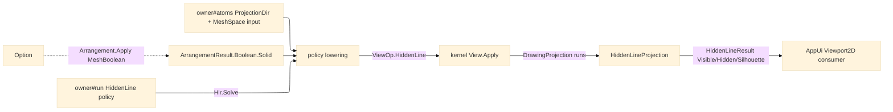

# [RASM_FABRICATION_HIDDEN_LINE]

The hidden-line documentation plane consumes the kernel `DrawingProjection` owner and produces the preserved world-edge receipt the AppUi drafting surface reads. `Hlr.Solve` lowers the owner#atoms `ProjectionDir` and the optional watertight `BooleanSolid` operand into kernel `View.Apply`; Fabrication keeps only the policy lowering, result projection, and receipt insulation. Boolean combination routes through kernel `Arrangement.Apply` and reads `ArrangementResult.Boolean.Solid`; healing belongs to `Rasm.Processing` `HealOp`, so this page owns no visibility solver, no mesh Boolean interior, no projection fault arm, and no hash.

Wire posture: HOST-LOCAL. `HiddenLineResult` crosses only as in-process `Seq<Edge3>` partitions; AppUi owns sheet-space composition, kernel drawing owns analytic visibility, kernel arrangement owns watertight solid composition, and Fabrication owns the fabrication-policy seam.

## [01]-[INDEX]

- [01]-[PROJECTION_HIDDEN_LINE]: owns the `Hlr.Solve` policy lowering into kernel `View.Apply`, the `BooleanSolid` watertight consume seam into kernel `Arrangement.Apply`, and the preserved `HiddenLineResult(Seq<Edge3> Visible, Seq<Edge3> Hidden, Seq<Edge3> Silhouette)` receipt projection.

## [02]-[PROJECTION_HIDDEN_LINE]

- Owner: `BooleanSolid` the watertight operand carried by `FabricationPolicy.HiddenLine`; `HiddenLineProjection` the local receipt adapter over the kernel `DrawingProjection` runs; `Hlr` the single Fabrication entry lowered by owner#run. `ProjectionDir`, `Edge3`, `FabricationInput`, `FabricationPolicy`, and `FabricationResult` stay owner#atoms vocabulary; `DrawingProjection`, `ViewOp`, `ArrangementOp`, `ArrangementResult.Boolean.Solid`, and `HealOp` stay kernel-owned seams.
- Cases: `BooleanSolid` carries the second solid, the `BooleanOp`, and the repair route; `HiddenLineProjection` carries exactly `Visible`, `Hidden`, and `Silhouette`; `FabricationResult.HiddenLineResult` remains byte-identical to owner#atoms. Kernel `ViewOp` owns `HiddenLine`/`Silhouette`/`Section`/`Outline`; this page consumes only the `HiddenLine` case and refuses to mint a parallel drawing family.
- Entry: `public static Fin<FabricationResult> Solve(FabricationPolicy.HiddenLine policy, FabricationInput input)` lowers `input.View` into `ViewOp.HiddenLine`, sources the mesh from raw `input.Model` or `ArrangementResult.Boolean.Solid`, runs `View.Apply`, and maps the kernel runs into `FabricationResult.HiddenLineResult`.
- Auto: `Source` reads `policy.Watertight`; absent operand passes the raw `MeshSpace`, present operand runs `Arrangement.Apply(ArrangementOp.MeshBoolean(...))`, pattern-matches `ArrangementResult.Boolean`, and returns `boolean.Solid`. `Project` copies kernel visible, hidden, and silhouette edge runs into the local adapter without filtering, sampling, reclassifying, clipping, or sorting.
- Receipt: `HiddenLineResult(Seq<Edge3> Visible, Seq<Edge3> Hidden, Seq<Edge3> Silhouette)` is the only receipt; AppUi remains insulated at the exact owner#atoms case shape and never sees `DrawingProjection`.
- Packages: `Process/owner#FABRICATION_OWNER` (`ProjectionDir`, `Edge3`, `FabricationInput`, `FabricationPolicy.HiddenLine`, `FabricationResult.HiddenLineResult`), kernel `Rasm/Drawing/view#VIEW` (`View.Apply`, `ViewOp`, `DrawingProjection`, kernel `GeometryFault.ProjectionFault(EdgeKind, int)` 2436 + `GeometryFault.DegenerateInput` 2400 for a missing model), kernel `Rasm/Meshing/arrangement#ARRANGEMENT` (`Arrangement.Apply`, `ArrangementOp.MeshBoolean`, `ArrangementResult.Boolean.Solid`), `Rasm.Processing` (`BooleanOp`, `HealOp`), `Rasm.Meshing` (`MeshSpace`), LanguageExt.Core, BCL inbox.
- Growth: a new drafting projection is one kernel `ViewOp` case and one downstream consumer projection; Fabrication stays a hidden-line policy consumer. A new watertight preparation strategy is one `HealOp` policy row before arrangement; the arrangement page still emits the `Solid` field. A new receipt column lands first on owner#atoms, then this adapter copies it.
- Boundary: the dead BSP form is the in-page `BspNode` tree, the `1e6` eye literal, the `Predicate.Orient2D` call, the `Arrangement.ToMesh` fiction, the per-edge `average depth` classifier, the mesh-edge soup, and the local `SpatialIndex` visibility walk. Kernel `DrawingProjection` owns analytic visibility and faults; kernel arrangement owns watertight Boolean cells; Fabrication never re-authors either interior and never mints a Documentation `FabricationFault` arm.

```csharp signature
// --- [RUNTIME_PRELUDE] --------------------------------------------------------------------
using LanguageExt;
using LanguageExt.Common;
using Rasm.Drawing;
using Rasm.Fabrication.Process;
using Rasm.Meshing;
using Rasm.Numerics;
using Rasm.Processing;
using static LanguageExt.Prelude;

namespace Rasm.Fabrication.Documentation;

// --- [MODELS] -----------------------------------------------------------------------------
// Watertight projection consumes kernel arrangement output; repair policy stays processing-owned.
public readonly record struct BooleanSolid(MeshSpace Other, BooleanOp Op, HealOp Heal);

public sealed record HiddenLineProjection(Seq<Edge3> Visible, Seq<Edge3> Hidden, Seq<Edge3> Silhouette) {
    public FabricationResult ToResult() => new FabricationResult.HiddenLineResult(Visible, Hidden, Silhouette);
}

// --- [OPERATIONS] -------------------------------------------------------------------------
public static class Hlr {
    public static Fin<FabricationResult> Solve(FabricationPolicy.HiddenLine policy, FabricationInput input) =>
        Source(input, policy.Watertight)
            .Bind(model => View.Apply(ViewOp.HiddenLine(model, input.View), key: null))
            .Map(Project)
            .Map(static projection => projection.ToResult());

    static Fin<MeshSpace> Source(FabricationInput input, Option<BooleanSolid> watertight) =>
        input.Model.Match(
            None: () => Fin.Fail<MeshSpace>(GeometryFault.DegenerateInput(Kind.Mesh, 0, "model-missing").ToError()),
            Some: model => watertight.Match(
                None: () => Fin.Succ(model),
                Some: solid => Arrangement.Apply(
                        ArrangementOp.MeshBoolean(model, solid.Other, solid.Op, solid.Heal),
                        key: null)
                    .Bind(static result => result.Switch(
                        boolean: static kept => Fin.Succ(kept.Solid),
                        planarOverlay: static _ => Fin.Fail<MeshSpace>(
                            GeometryFault.ProjectionFault(EdgeKind.Intersection, -1).ToError()),
                        cellComplex: static _ => Fin.Fail<MeshSpace>(
                            GeometryFault.ProjectionFault(EdgeKind.Intersection, -1).ToError())))));

    static HiddenLineProjection Project(DrawingProjection projection) =>
        new(projection.Visible, projection.Hidden, projection.Silhouette);
}
```


