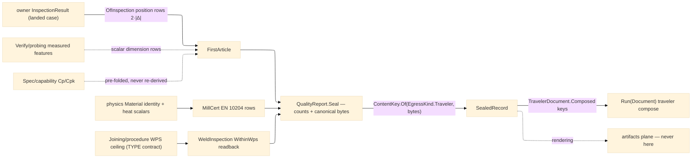

# [RASM_FABRICATION_QUALITY_RECORD]

The as-built quality-record owner: ONE `QualityRecord` `[Union]` — `FirstArticle` (AS9102-shaped characteristic accountability) · `MillCert` (EN 10204 material certificate) · `WeldInspection` (per-joint NDT verdicts + heat-input readback) — three record families as cases over ONE shared row vocabulary (`CharacteristicRow`/`ChemistryRow`/`MechanicalRow`/`WeldInspectionRow` under the `CharacteristicClass`/`Disposition`/`NdtMethod`/`CertType` axes), sealed by ONE `QualityReport.Seal` fold that validates scalars, projects accountability/contradiction counts, and content-keys the canonical record bytes through `ContentKey.Of` under the `traveler` egress family — the record keys are exactly what `TravelerDocument.Composed` carries into the `Run(Document)` fan-in, so shop documentation stays ONE egress family and a `quality-record` `EgressKind` row is the rejected form. Measured features ride the `Process/owner#FABRICATION_OWNER` `InspectionResult` case (the `OfInspection` factory projects position characteristics as true GD&T rows: nominal `0`, tolerance window from the callout, measured `2·|Δ|`); Cp/Cpk arrive PRE-FOLDED from the `Spec/capability` gate; conformance verdicts compose the kernel `ConformanceMetric` `[SmartEnum<int>]` policy rows over `ResidualSample` evidence (`Rasm/Analysis/measure#CONFORMANCE`) — measured-vs-nominal truth is the kernel's, this page RECORDS it.

The record is a MODEL and a ledger of decisions, never a judge with a fault rail: `Documentation/` holds the reserved-EMPTY fault cluster and this page keeps it — incompleteness is RECORDED (unmeasured rows, contradiction counts — a measured-out-of-window row still carrying `conform` is a counted contradiction, because use-as-is/rework/scrap dispositions are MRB authority, never derivable), and only a malformed primitive set (NaN/∞ scalars, empty row sets) routes the kernel band-2400 `GeometryFault.DegenerateInput`. `MillCert` keys the `Process/physics#CUT_PARAMETER` `Material` identity plus heat number; chemistry and mechanical rows are boundary-mapped raw scalars — a `Rasm.Materials` type import in this file is the named seam violation. `WeldInspection` stores the per-joint heat-input readback against the `Joining/procedure` WPS ceiling (TYPE contract — the qualification gate and `EssentialVariable` rows are procedure's; this page records the gate OUTCOME, never re-runs it).

Wire posture: HOST-LOCAL. Sealed records cross only as content keys into the `Run(Document)` traveler compose; the record model never sits between wire and rail; sheet/PDF/annotation RENDERING rides the artifacts-plane seam — a renderer arm here is the named boundary violation.

## [01]-[INDEX]

- [01]-[QUALITY_RECORD]: owns the `CharacteristicClass`/`Disposition`/`NdtMethod`/`CertType` record axes, the shared `CharacteristicRow`/`ChemistryRow`/`MechanicalRow`/`WeldInspectionRow` row vocabulary, the three-case `QualityRecord` `[Union]` with its `OfInspection` evidence factory, the `SealedRecord` receipt, and the ONE `QualityReport.Seal` fold content-keying every record under the `traveler` egress family.

## [02]-[QUALITY_RECORD]

- Owner: `CharacteristicClass` `[SmartEnum<string>]` the AS9102 Form-3 characteristic taxonomy (`dimension`/`gdt`/`finish`/`material`/`process`); `Disposition` `[SmartEnum<string>]` the MRB verdict axis (`conform`/`use-as-is`/`rework`/`scrap`) carrying `Conforming`+`Accepted` columns; `NdtMethod` `[SmartEnum<string>]` (`vt`/`pt`/`mt`/`ut`/`rt`) carrying the `Volumetric` column; `CertType` `[SmartEnum<string>]` the EN 10204 certificate axis (`en10204-2.1`/`-2.2`/`-3.1`/`-3.2`) carrying `WithResults`/`Specific`/`ThirdParty` columns; `CharacteristicRow` the shared accountability row (number, class, callout, nominal/window, `Option<Point3d>` locus, `Option<double>` measured, disposition — `Deviation`/`Accounted`/`Contradicts` projected, never stored); `ChemistryRow`/`MechanicalRow` the certificate scalars; `WeldInspectionRow` the per-joint NDT row with the `WithinWps` heat-input readback; `QualityRecord` the closed three-case record union; `SealedRecord` the content-keyed receipt; `QualityReport` the static surface owning `Seal`.
- Cases: `QualityRecord` — `FirstArticle(UInt128 ComponentKey, Arr<CharacteristicRow>, Option<double> Cp, Option<double> Cpk, Instant SampledAt)` · `MillCert(Material, string HeatNumber, CertType, Arr<ChemistryRow>, MechanicalRow, Instant IssuedAt)` · `WeldInspection(UInt128 ComponentKey, Arr<WeldInspectionRow>, Instant InspectedAt)` (3); `CharacteristicClass` rows 5; `Disposition` rows 4 (`use-as-is` is `Conforming: false, Accepted: true` — an accepted nonconformance, never silently conforming); `NdtMethod` rows 5; `CertType` rows 4 (only `3.2` is `ThirdParty`); the accountability partition (rows/measured/conforming/contradictions) is four counts on ONE receipt, never four report variants.
- Entry: `public static Fin<SealedRecord> QualityReport.Seal(QualityRecord record)` — the ONE entry, a generated total `Switch` over the record cases; `Fin<T>` routes ONLY the kernel `GeometryFault.DegenerateInput` (non-finite scalar, empty row set, blank heat number) — the reserved-empty cluster law: no `FabricationFault` arm mints for Documentation, disposition conflicts and unmeasured rows are COUNTED evidence on the receipt.
- Auto: `Seal` folds per case — `FirstArticle`: scalar admission, accountability counts (`Accounted` = measured or non-conform-dispositioned), contradiction census (`Measured` outside `[Lower,Upper]` while `Verdict.Conforming` — the MRB flag), Cp/Cpk carried as pre-folded `Option`s; `MillCert`: chemistry mass-percent closure recorded (Σ within the admission window — recorded, not thrown), cert-type columns pass through; `WeldInspection`: `WithinWps` readback per joint (`HeatInputKjPerMm ≤ WpsCeilingKjPerMm` — the ceiling arrives from the `Joining/procedure` gate as a row datum), NDT verdict counts. Every case then writes DECLARATION-COMPLETE canonical bytes (invariant culture, declaration-ordered — every carried field of every case and nested row contributes: windows, loci, Cp/Cpk, Charpy/hardness, WPS ceilings, timestamps) and mints `ContentKey.Of(EgressKind.Traveler, bytes)` — the one-hasher law, never a raw `XxHash128` site and never a lossy summary digest. `QualityRecord.OfInspection` projects the landed `InspectionResult` feature pairs into position-class rows (`Class: Geometry`, `Nominal: 0`, `Measured: 2·|measured − nominal|` — the GD&T position convention) matched to planned loci with dispositions defaulting `conform` unless the MRB authority map supplies a row — the factory records, the contradiction census judges nothing but consistency; scalar dimension rows await the `Verify/probing` measured-feature receipts.
- Receipt: `SealedRecord(ContentKey Key, QualityRecord Record, int Rows, int Measured, int Conforming, int Contradictions)` IS the evidence — the counts are the accountability verdict, the key is the traveler-composable identity; no parallel quality ledger.
- Packages: `Process/owner#FABRICATION_OWNER` (`ContentKey`/`EgressKind`/`FabricationResult.InspectionResult` — composed), `Process/physics#CUT_PARAMETER` (`Material` identity — composed), kernel `Rasm/Analysis/measure#CONFORMANCE` (`ConformanceMetric` rows + `ResidualSample` — the measured-vs-nominal truth this page records), NodaTime (`Instant` stamps — the shared-tier law), `Rasm.Numerics` (`GeometryFault` band-2400), Thinktecture.Runtime.Extensions (`[Union]`/`[SmartEnum<string>]`), LanguageExt.Core (`Fin`/`Option`/`Arr`), BCL inbox.
- Growth: a new record family (CoC, calibration cert, PPAP row) is one `QualityRecord` case + one `Seal` arm — the generated dispatch breaks the build until the arm lands; a new NDT method, cert type, disposition, or characteristic class is one row; a new evidence source is one case factory beside `OfInspection`; a new accountability metric is one count column on `SealedRecord`; zero new entrypoints.
- Boundary: the record is a MODEL and rendering rides the artifacts seam — a sheet/PDF/annotation arm here is the deleted form; ONE union over shared rows — three parallel `FaiReport`/`CertReport`/`WeldReport` classes are the deleted form; Cp/Cpk are PRE-FOLDED capability outputs and a page-local Welford/quantile fold is the dual-paradigm defect; conformance truth composes the kernel `ConformanceMetric`/`ResidualSample` rows and a hand-rolled residual comparator is the deleted form; records key through the ONE `ContentKey.Of` under `EgressKind.Traveler` — a new egress row or a second hasher is the rejected form; heat/chemistry/mechanicals are boundary scalars and a `Rasm.Materials` type import is the seam violation; dispositions are MRB authority — a fold that DERIVES `use-as-is`/`rework`/`scrap` is the named over-reach, the contradiction count is the honest form; the fault cluster stays reserved-EMPTY and a Documentation arm on `FabricationFault` is the refused form.

```csharp signature
// --- [RUNTIME_PRELUDE] ----------------------------------------------------------------------------------------------------------------------------
using LanguageExt;
using LanguageExt.Common;
using NodaTime;
using Rasm.Fabrication.Process;      // Material · ContentKey · EgressKind · FabricationResult.InspectionResult — owner#atoms + physics vocabulary
using Rasm.Numerics;
using Rhino.Geometry;
using Thinktecture;
using static LanguageExt.Prelude;

namespace Rasm.Fabrication.Documentation;

// --- [TYPES] --------------------------------------------------------------------------------------------------------------------------------------
[SmartEnum<string>]
public sealed partial class CharacteristicClass {
    public static readonly CharacteristicClass Dimension = new("dimension");
    public static readonly CharacteristicClass Geometry = new("gdt");
    public static readonly CharacteristicClass Finish = new("finish");
    public static readonly CharacteristicClass Material = new("material");
    public static readonly CharacteristicClass Process = new("process");
}

// use-as-is is an ACCEPTED nonconformance: Conforming false, Accepted true — the MRB distinction the counts preserve.
[SmartEnum<string>]
public sealed partial class Disposition {
    public static readonly Disposition Conform = new("conform", conforming: true, accepted: true);
    public static readonly Disposition UseAsIs = new("use-as-is", conforming: false, accepted: true);
    public static readonly Disposition Rework = new("rework", conforming: false, accepted: false);
    public static readonly Disposition Scrap = new("scrap", conforming: false, accepted: false);

    public bool Conforming { get; }
    public bool Accepted { get; }
}

[SmartEnum<string>]
public sealed partial class NdtMethod {
    public static readonly NdtMethod Visual = new("vt", volumetric: false);
    public static readonly NdtMethod Penetrant = new("pt", volumetric: false);
    public static readonly NdtMethod MagneticParticle = new("mt", volumetric: false);
    public static readonly NdtMethod Ultrasonic = new("ut", volumetric: true);
    public static readonly NdtMethod Radiographic = new("rt", volumetric: true);

    public bool Volumetric { get; }
}

[SmartEnum<string>]
public sealed partial class CertType {
    public static readonly CertType Declaration21 = new("en10204-2.1", withResults: false, specific: false, thirdParty: false);
    public static readonly CertType TestReport22 = new("en10204-2.2", withResults: true, specific: false, thirdParty: false);
    public static readonly CertType Inspection31 = new("en10204-3.1", withResults: true, specific: true, thirdParty: false);
    public static readonly CertType Inspection32 = new("en10204-3.2", withResults: true, specific: true, thirdParty: true);

    public bool WithResults { get; }
    public bool Specific { get; }
    public bool ThirdParty { get; }
}

// --- [MODELS] -------------------------------------------------------------------------------------------------------------------------------------
public sealed record CharacteristicRow(
    int Number, CharacteristicClass Class, string Callout, double Nominal, double Lower, double Upper,
    Option<Point3d> Locus, Option<double> Measured, Disposition Verdict) {
    public Option<double> Deviation => Measured.Map(m => m - Nominal);
    public bool Accounted => Measured.IsSome || !Verdict.Conforming;
    public bool Contradicts => Measured.Map(m => (m < Lower || m > Upper) && Verdict.Conforming).IfNone(false);
}

public sealed record ChemistryRow(string Symbol, double MassPct);

public sealed record MechanicalRow(double YieldMpa, double TensileMpa, double ElongationPct, Option<double> CharpyJ, Option<double> HardnessHb);

public sealed record WeldInspectionRow(int Joint, NdtMethod Method, Disposition Verdict, Option<double> HeatInputKjPerMm, Option<double> WpsCeilingKjPerMm) {
    public Option<bool> WithinWps => from hi in HeatInputKjPerMm from cap in WpsCeilingKjPerMm select hi <= cap;
}

[Union(ConversionFromValue = ConversionOperatorsGeneration.None)]
public abstract partial record QualityRecord {
    private QualityRecord() { }

    public sealed record FirstArticle(
        UInt128 ComponentKey, Arr<CharacteristicRow> Characteristics, Option<double> Cp, Option<double> Cpk, Instant SampledAt) : QualityRecord;
    public sealed record MillCert(
        Material Material, string HeatNumber, CertType Cert, Arr<ChemistryRow> Chemistry, MechanicalRow Mechanicals, Instant IssuedAt) : QualityRecord;
    public sealed record WeldInspection(UInt128 ComponentKey, Arr<WeldInspectionRow> Joints, Instant InspectedAt) : QualityRecord;

    // Position characteristics per the GD&T convention: nominal 0, window [0, tol], measured 2·|Δ| — the honest
    // InspectionResult projection; scalar dimension rows enter via the probing receipts. Dispositions are MRB
    // AUTHORITY: the factory records `conform` unless the mrb map supplies an authority row per characteristic —
    // an out-of-window measurement under `conform` is exactly what the Seal contradiction census counts; the
    // factory never judges.
    public static QualityRecord OfInspection(UInt128 componentKey, FabricationResult.InspectionResult measured, double positionTol, Instant at, Map<int, Disposition> mrb = default) =>
        new FirstArticle(
            componentKey,
            measured.Features.Map((i, f) => new CharacteristicRow(
                Number: i + 1, Class: CharacteristicClass.Geometry, Callout: "position", Nominal: 0.0, Lower: 0.0, Upper: positionTol,
                Locus: Some(f.Nominal), Measured: Some(2.0 * f.Nominal.DistanceTo(f.Measured)),
                Verdict: mrb.Find(i + 1).IfNone(Disposition.Conform))).ToArr(),
            Cp: None, Cpk: None, SampledAt: at);
}

public sealed record SealedRecord(ContentKey Key, QualityRecord Record, int Rows, int Measured, int Conforming, int Contradictions);

// --- [OPERATIONS] ---------------------------------------------------------------------------------------------------------------------------------
public static class QualityReport {
    // Reserved-empty cluster law: incompleteness/contradiction is COUNTED evidence; only malformed primitives fail typed.
    public static Fin<SealedRecord> Seal(QualityRecord record) =>
        record.Switch(
            firstArticle: fa =>
                fa.Characteristics.IsEmpty
                || fa.Characteristics.Exists(static r => !double.IsFinite(r.Nominal) || r.Measured.Exists(static m => !double.IsFinite(m)))
                    ? Fin.Fail<SealedRecord>(GeometryFault.DegenerateInput("quality-record:fai").ToError())
                    : Fin.Succ(new SealedRecord(
                        Key(record), record,
                        Rows: fa.Characteristics.Count,
                        Measured: fa.Characteristics.Count(static r => r.Measured.IsSome),
                        Conforming: fa.Characteristics.Count(static r => r.Verdict.Conforming && !r.Contradicts),
                        Contradictions: fa.Characteristics.Count(static r => r.Contradicts))),
            millCert: mc =>
                string.IsNullOrWhiteSpace(mc.HeatNumber) || mc.Chemistry.IsEmpty
                || mc.Chemistry.Exists(static c => !double.IsFinite(c.MassPct) || c.MassPct < 0.0)
                    ? Fin.Fail<SealedRecord>(GeometryFault.DegenerateInput($"quality-record:cert:{mc.HeatNumber}").ToError())
                    : Fin.Succ(new SealedRecord(Key(record), record, Rows: mc.Chemistry.Count, Measured: mc.Cert.WithResults ? mc.Chemistry.Count : 0,
                        Conforming: mc.Chemistry.Count, Contradictions: 0)),
            weldInspection: wi =>
                wi.Joints.IsEmpty
                    ? Fin.Fail<SealedRecord>(GeometryFault.DegenerateInput("quality-record:weld").ToError())
                    : Fin.Succ(new SealedRecord(
                        Key(record), record,
                        Rows: wi.Joints.Count,
                        Measured: wi.Joints.Count(static j => j.HeatInputKjPerMm.IsSome),
                        Conforming: wi.Joints.Count(static j => j.Verdict.Conforming && j.WithinWps.IfNone(true)),
                        Contradictions: wi.Joints.Count(static j => j.Verdict.Conforming && j.WithinWps.Map(static w => !w).IfNone(false)))));

    // Canonical bytes are DECLARATION-COMPLETE: every field every case and every nested row carries, in stable
    // declaration order under the invariant culture — the content key IS the record identity (K9), so two records
    // differing in ANY carried field (window, locus, Cp/Cpk, Charpy/hardness, WPS ceiling, timestamps) digest apart.
    static ContentKey Key(QualityRecord record) => ContentKey.Of(EgressKind.Traveler, CanonicalBytes(record));

    static byte[] CanonicalBytes(QualityRecord record) =>
        System.Text.Encoding.UTF8.GetBytes(record.Switch(
            firstArticle: static fa => string.Create(System.Globalization.CultureInfo.InvariantCulture,
                $"fai|{fa.ComponentKey}|{fa.SampledAt}|{Opt(fa.Cp)}|{Opt(fa.Cpk)}|{string.Join(';', fa.Characteristics.Map(static r =>
                    $"{r.Number}:{r.Class.Key}:{r.Callout}:{r.Nominal:R}:{r.Lower:R}:{r.Upper:R}:{Locus(r.Locus)}:{Opt(r.Measured)}:{r.Verdict.Key}"))}"),
            millCert: static mc => string.Create(System.Globalization.CultureInfo.InvariantCulture,
                $"cert|{mc.Material.Key}|{mc.HeatNumber}|{mc.Cert.Key}|{mc.IssuedAt}|{string.Join(';', mc.Chemistry.Map(static c => $"{c.Symbol}:{c.MassPct:R}"))}|"
                + $"{mc.Mechanicals.YieldMpa:R}:{mc.Mechanicals.TensileMpa:R}:{mc.Mechanicals.ElongationPct:R}:{Opt(mc.Mechanicals.CharpyJ)}:{Opt(mc.Mechanicals.HardnessHb)}"),
            weldInspection: static wi => string.Create(System.Globalization.CultureInfo.InvariantCulture,
                $"weld|{wi.ComponentKey}|{wi.InspectedAt}|{string.Join(';', wi.Joints.Map(static j =>
                    $"{j.Joint}:{j.Method.Key}:{j.Verdict.Key}:{Opt(j.HeatInputKjPerMm)}:{Opt(j.WpsCeilingKjPerMm)}"))}")));

    static string Opt(Option<double> value) =>
        value.Map(static v => v.ToString("R", System.Globalization.CultureInfo.InvariantCulture)).IfNone("-");

    static string Locus(Option<Point3d> locus) =>
        locus.Map(static p => string.Create(System.Globalization.CultureInfo.InvariantCulture, $"{p.X:R},{p.Y:R},{p.Z:R}")).IfNone("-");
}
```


