# [RASM_FABRICATION_QUALITY_RECORD]

The as-built quality-record owner: ONE `QualityRecord` `[Union]` — `FirstArticle` (AS9102-shaped characteristic accountability) · `MillCert` (EN 10204 material certificate) · `WeldInspection` (per-joint NDT verdicts + heat-input readback) · `Conformance` (the CoC declaration over sealed records) — four record families as cases over ONE shared row vocabulary (`CharacteristicRow`/`ChemistryRow`/`MechanicalRow`/`WeldInspectionRow` under the `CharacteristicClass`/`Disposition`/`NdtMethod`/`CertType` axes), sealed by ONE `QualityReport.Seal` fold that admits scalars, projects accountability/contradiction counts, and content-keys the canonical record bytes through `ContentKey.Of` under the `traveler` egress family — the record keys are exactly what `TravelerDocument.Composed` carries into the `Run(Document)` fan-in, so shop documentation stays ONE egress family and a `quality-record` `EgressKind` row is the rejected form. Measured features enter through TWO factory arms on the union: `OfInspection` projects the owner `InspectionResult` case as true GD&T position rows (nominal `0`, tolerance window from the callout, measured `2·|Δ|`, Cp/Cpk carried PRE-FOLDED from an optional `Spec/capability` report — never re-derived), and `OfResiduals` projects the kernel `Rasm/Analysis/measure#CONFORMANCE` `ResidualSample` rows (the probing evidence stream) as dimension-class rows carrying the sample's own tolerance window and locus — measured-vs-nominal truth is the kernel's, this page RECORDS it.

The record is a MODEL and a ledger of decisions, never a judge with a fault rail: `Documentation/` holds the reserved-EMPTY fault cluster and this page keeps it — incompleteness is RECORDED (unmeasured rows, contradiction counts — a measured-out-of-window row still carrying `conform` is a counted contradiction, a conforming weld verdict whose demanded heat-input readback is absent never counts conforming, and a chemistry Σ over 100 mass-% is a counted certificate self-contradiction), and only a malformed primitive set (non-finite scalars, inverted windows, invalid loci, empty row sets) routes the kernel band-2400 `GeometryFault.DegenerateInput`. `MillCert` keys the `Process/physics#CUT_PARAMETER` `Material` identity plus the `HeatNumber` value object — blank heat numbers are unrepresentable past the generated admission; chemistry and mechanical rows are boundary-mapped raw scalars carrying their OPTIONAL spec windows as row data — a `Rasm.Materials` type import in this file is the named seam violation. `WeldInspection` stores the per-joint heat-input readback against the `Joining/procedure` WPS ceiling (TYPE contract — the qualification gate and `EssentialVariable` rows are procedure's; this page records the gate OUTCOME, never re-runs it).

Wire posture: HOST-LOCAL. Sealed records cross only as content keys into the `Run(Document)` traveler compose; the record model never sits between wire and rail; sheet/PDF/annotation RENDERING rides the artifacts-plane seam — a renderer arm here is the named boundary violation.

## [01]-[INDEX]

- [01]-[QUALITY_RECORD]: owns the `CharacteristicClass`/`Disposition`/`NdtMethod`/`CertType` record axes, the `HeatNumber` admission owner, the shared `CharacteristicRow`/`ChemistryRow`/`MechanicalRow`/`WeldInspectionRow` row vocabulary with their window/floor contradiction projections, the four-case `QualityRecord` `[Union]` with its `OfInspection`/`OfResiduals` evidence factories, the `SealedRecord` receipt, and the ONE `QualityReport.Seal` fold content-keying every record under the `traveler` egress family.

## [02]-[QUALITY_RECORD]

- Owner: `CharacteristicClass` `[SmartEnum<string>]` the AS9102 Form-3 characteristic taxonomy (`dimension`/`gdt`/`finish`/`material`/`process`); `Disposition` `[SmartEnum<string>]` the MRB verdict axis (`conform`/`use-as-is`/`rework`/`scrap`) carrying `Conforming`+`Accepted` columns; `NdtMethod` `[SmartEnum<string>]` (`vt`/`pt`/`mt`/`ut`/`rt`) carrying the `Volumetric` column; `CertType` `[SmartEnum<string>]` the EN 10204 certificate axis (`en10204-2.1`/`-2.2`/`-3.1`/`-3.2`) carrying `WithResults`/`Specific`/`ThirdParty` columns; `HeatNumber` `[ValueObject<string>]` the mill-lot identity whose `ValidateFactoryArguments` partial rejects blank text at admission; `CharacteristicRow` the shared accountability row (number, class, callout, nominal/window, `Option<Point3d>` locus, `Option<double>` measured, disposition — `Deviation`/`Accounted`/`Contradicts` projected, never stored); `ChemistryRow`/`MechanicalRow` the certificate scalars carrying optional spec windows/floors whose `Contradicts` projections feed the census; `WeldInspectionRow` the per-joint NDT row with the `WithinWps` heat-input readback; `QualityRecord` the closed four-case record union; `SealedRecord` the content-keyed receipt; `QualityReport` the static surface owning `Seal`.
- Cases: `QualityRecord` — `FirstArticle(UInt128 ComponentKey, Arr<CharacteristicRow>, Option<double> Cp, Option<double> Cpk, Instant SampledAt)` · `MillCert(Material, HeatNumber Heat, CertType, Arr<ChemistryRow>, MechanicalRow, Instant IssuedAt)` · `WeldInspection(UInt128 ComponentKey, Arr<WeldInspectionRow>, Instant InspectedAt)` · `Conformance(string Certificate, string Statement, Seq<ContentKey> Records, Instant IssuedAt)` (4); `CharacteristicClass` rows 5; `Disposition` rows 4 (`use-as-is` is `Conforming: false, Accepted: true` — an accepted nonconformance, never silently conforming); `NdtMethod` rows 5; `CertType` rows 4 (only `3.2` is `ThirdParty`); the accountability partition (rows/measured/conforming/contradictions) is four counts on ONE receipt, never four report variants.
- Entry: `public static Fin<SealedRecord> QualityReport.Seal(QualityRecord record)` — the ONE entry, a generated total `Switch` over the record cases (a fifth case breaks the build until its arm lands); `Fin<T>` routes ONLY the kernel `GeometryFault.DegenerateInput` (non-finite scalar, inverted window, invalid locus, empty row set, blank CoC identity) — the reserved-empty cluster law: no `FabricationFault` arm mints for Documentation, disposition conflicts and unmeasured rows are COUNTED evidence on the receipt.
- Auto: `Seal` folds per case — `FirstArticle`: full scalar/window/locus admission, accountability counts (`Accounted` = measured or non-conform-dispositioned), contradiction census (`Measured` outside `[Lower, Upper]` while `Verdict.Conforming` — the MRB flag), Cp/Cpk carried as pre-folded `Option`s; `MillCert`: per-element window census on a `WithResults` cert, mechanical floor census, and the Σ mass-percent closure — an over-100 sum COUNTS as one certificate self-contradiction, recorded, never thrown; `WeldInspection`: `WithinWps` readback per joint (`HeatInputKjPerMm ≤ WpsCeilingKjPerMm` — the ceiling arrives from the `Joining/procedure` gate as a row datum), a demanded ceiling with an ABSENT readback never counts conforming, NDT verdict counts; `Conformance`: the declaration counts its referenced sealed-record keys whole. Every case then writes DECLARATION-COMPLETE canonical bytes — invariant culture, declaration order, every carried field of every case and nested row contributing, free text netstring-framed (`{length}:{text}`) so distinct records cannot collide across the `|`/`;`/`:` structure — and mints `ContentKey.Of(EgressKind.Traveler, bytes)` — the one-hasher law, never a raw `XxHash128` site and never a lossy summary digest. `QualityRecord.OfInspection` projects the landed `InspectionResult` feature pairs into position-class rows (`Class: Geometry`, `Nominal: 0`, `Measured: 2·|measured − nominal|` — the GD&T position convention) with Cp/Cpk read off an optional `CapabilityReport`; `QualityRecord.OfResiduals` projects kernel `ResidualSample` rows into dimension-class rows (`Lower: −Tolerance`, `Upper: +Tolerance`, `Measured: Distance`, `Locus: Location`); both factories default dispositions `conform` unless the MRB authority map supplies a row — the factory records, the contradiction census judges nothing but consistency.
- Receipt: `SealedRecord(ContentKey Key, QualityRecord Record, int Rows, int Measured, int Conforming, int Contradictions)` IS the evidence — the counts are the accountability verdict, the key is the traveler-composable identity; no parallel quality ledger.
- Packages: `Process/owner#FABRICATION_OWNER` (`ContentKey`/`EgressKind`/`FabricationResult.InspectionResult` — composed), `Process/physics#CUT_PARAMETER` (`Material` identity — composed), kernel `Rasm/Analysis/measure#CONFORMANCE` (`ResidualSample` — the measured-vs-nominal truth the `OfResiduals` factory records), `Spec/capability` (`CapabilityReport`/`CapabilityMetric` — the pre-folded Cp/Cpk source), NodaTime (`Instant` stamps — the shared-tier law), `Rasm.Numerics` (`GeometryFault` band-2400), Thinktecture.Runtime.Extensions (`[Union]`/`[SmartEnum<string>]`/`[ValueObject<string>]` + `ValidateFactoryArguments`), LanguageExt.Core (`Fin`/`Option`/`Arr`/`Seq`), Rhino.Geometry (`Point3d`), BCL inbox.
- Growth: a new record family (calibration cert, PPAP row) is one `QualityRecord` case + one `Seal` arm — the generated dispatch breaks the build until the arm lands (the `Conformance` case is this leaf's executed precedent); a new NDT method, cert type, disposition, or characteristic class is one row; a new evidence source is one case factory beside `OfInspection`/`OfResiduals`; a new accountability metric is one count column on `SealedRecord`; zero new entrypoints.
- Boundary: the record is a MODEL and rendering rides the artifacts seam — a sheet/PDF/annotation arm here is the deleted form; ONE union over shared rows — parallel `FaiReport`/`CertReport`/`WeldReport` classes are the deleted form; Cp/Cpk are PRE-FOLDED capability outputs and a page-local Welford/quantile fold is the dual-paradigm defect; conformance truth composes the kernel `ResidualSample` rows and a hand-rolled residual comparator is the deleted form; records key through the ONE `ContentKey.Of` under `EgressKind.Traveler` — a new egress row or a second hasher is the rejected form; canonical text fields frame through the netstring law — bare delimiter concatenation is the named injectivity defect; heat/chemistry/mechanicals are boundary scalars and a `Rasm.Materials` type import is the seam violation; dispositions are MRB authority — a fold that DERIVES `use-as-is`/`rework`/`scrap` is the named over-reach, the contradiction count is the honest form; the fault cluster stays reserved-EMPTY and a Documentation arm on `FabricationFault` is the refused form.

```csharp signature
// --- [RUNTIME_PRELUDE] ----------------------------------------------------------------------------------------------------------------------------
using System.Globalization;
using System.Text;
using LanguageExt;
using LanguageExt.Common;
using NodaTime;
using Rasm.Analysis;                 // ResidualSample — the kernel conformance evidence OfResiduals records
using Rasm.Fabrication.Process;      // Material · ContentKey · EgressKind · FabricationResult.InspectionResult — owner#atoms + physics vocabulary
using Rasm.Numerics;
using Rhino.Geometry;
using Thinktecture;
using static LanguageExt.Prelude;

namespace Rasm.Fabrication.Documentation;

// --- [TYPES] --------------------------------------------------------------------------------------------------------------------------------------
[SmartEnum<string>]
public sealed partial class CharacteristicClass {
    public static readonly CharacteristicClass Dimension = new("dimension");
    public static readonly CharacteristicClass Geometry = new("gdt");
    public static readonly CharacteristicClass Finish = new("finish");
    public static readonly CharacteristicClass Material = new("material");
    public static readonly CharacteristicClass Process = new("process");
}

// use-as-is is an ACCEPTED nonconformance: Conforming false, Accepted true — the MRB distinction the counts preserve.
[SmartEnum<string>]
public sealed partial class Disposition {
    public static readonly Disposition Conform = new("conform", conforming: true, accepted: true);
    public static readonly Disposition UseAsIs = new("use-as-is", conforming: false, accepted: true);
    public static readonly Disposition Rework = new("rework", conforming: false, accepted: false);
    public static readonly Disposition Scrap = new("scrap", conforming: false, accepted: false);

    public bool Conforming { get; }
    public bool Accepted { get; }
}

[SmartEnum<string>]
public sealed partial class NdtMethod {
    public static readonly NdtMethod Visual = new("vt", volumetric: false);
    public static readonly NdtMethod Penetrant = new("pt", volumetric: false);
    public static readonly NdtMethod MagneticParticle = new("mt", volumetric: false);
    public static readonly NdtMethod Ultrasonic = new("ut", volumetric: true);
    public static readonly NdtMethod Radiographic = new("rt", volumetric: true);

    public bool Volumetric { get; }
}

[SmartEnum<string>]
public sealed partial class CertType {
    public static readonly CertType Declaration21 = new("en10204-2.1", withResults: false, specific: false, thirdParty: false);
    public static readonly CertType TestReport22 = new("en10204-2.2", withResults: true, specific: false, thirdParty: false);
    public static readonly CertType Inspection31 = new("en10204-3.1", withResults: true, specific: true, thirdParty: false);
    public static readonly CertType Inspection32 = new("en10204-3.2", withResults: true, specific: true, thirdParty: true);

    public bool WithResults { get; }
    public bool Specific { get; }
    public bool ThirdParty { get; }
}

// The mill-lot identity: blank text is unrepresentable past the generated admission — no page-local blank check survives.
[ValueObject<string>]
public sealed partial class HeatNumber {
    static partial void ValidateFactoryArguments(ref ValidationError? validationError, ref string value) {
        value = value?.Trim() ?? string.Empty;
        if (value.Length == 0)
            validationError = new ValidationError("heat number blank");
    }
}

// --- [MODELS] -------------------------------------------------------------------------------------------------------------------------------------
public sealed record CharacteristicRow(
    int Number, CharacteristicClass Class, string Callout, double Nominal, double Lower, double Upper,
    Option<Point3d> Locus, Option<double> Measured, Disposition Verdict) {
    public Option<double> Deviation => Measured.Map(m => m - Nominal);
    public bool Accounted => Measured.IsSome || !Verdict.Conforming;
    public bool Contradicts => Measured.Map(m => (m < Lower || m > Upper) && Verdict.Conforming).IfNone(false);
}

// Spec windows ride the row as optional data — the census reads them, the boundary maps them, no Materials type crosses.
public sealed record ChemistryRow(string Symbol, double MassPct, Option<double> SpecLowPct, Option<double> SpecHighPct) {
    public bool Contradicts => SpecLowPct.Map(lo => MassPct < lo).IfNone(false) || SpecHighPct.Map(hi => MassPct > hi).IfNone(false);
}

public sealed record MechanicalRow(
    double YieldMpa, double TensileMpa, double ElongationPct, Option<double> CharpyJ, Option<double> HardnessHb,
    Option<double> YieldMinMpa, Option<double> TensileMinMpa, Option<double> ElongationMinPct) {
    public bool Contradicts =>
        YieldMinMpa.Map(f => YieldMpa < f).IfNone(false)
        || TensileMinMpa.Map(f => TensileMpa < f).IfNone(false)
        || ElongationMinPct.Map(f => ElongationPct < f).IfNone(false);
}

public sealed record WeldInspectionRow(int Joint, NdtMethod Method, Disposition Verdict, Option<double> HeatInputKjPerMm, Option<double> WpsCeilingKjPerMm) {
    public Option<bool> WithinWps => from hi in HeatInputKjPerMm from cap in WpsCeilingKjPerMm select hi <= cap;
}

[Union(ConversionFromValue = ConversionOperatorsGeneration.None)]
public abstract partial record QualityRecord {
    private QualityRecord() { }

    public sealed record FirstArticle(
        UInt128 ComponentKey, Arr<CharacteristicRow> Characteristics, Option<double> Cp, Option<double> Cpk, Instant SampledAt) : QualityRecord;
    public sealed record MillCert(
        Material Material, HeatNumber Heat, CertType Cert, Arr<ChemistryRow> Chemistry, MechanicalRow Mechanicals, Instant IssuedAt) : QualityRecord;
    public sealed record WeldInspection(UInt128 ComponentKey, Arr<WeldInspectionRow> Joints, Instant InspectedAt) : QualityRecord;
    public sealed record Conformance(string Certificate, string Statement, Seq<ContentKey> Records, Instant IssuedAt) : QualityRecord;

    // Position characteristics per the GD&T convention: nominal 0, window [0, tol], measured 2·|Δ| — the honest
    // InspectionResult projection; Cp/Cpk read PRE-FOLDED off the optional capability report, never re-derived.
    // Dispositions are MRB AUTHORITY: the factory records `conform` unless the mrb map supplies an authority row —
    // an out-of-window measurement under `conform` is exactly what the Seal contradiction census counts.
    public static QualityRecord OfInspection(
        UInt128 componentKey, FabricationResult.InspectionResult measured, double positionTol, Instant at,
        Map<int, Disposition> mrb = default, Option<Rasm.Fabrication.Spec.CapabilityReport> capability = default) =>
        new FirstArticle(
            componentKey,
            toSeq(measured.Features.Select((f, i) => new CharacteristicRow(
                Number: i + 1, Class: CharacteristicClass.Geometry, Callout: "position", Nominal: 0.0, Lower: 0.0, Upper: positionTol,
                Locus: Some(f.Nominal), Measured: Some(2.0 * f.Nominal.DistanceTo(f.Measured)),
                Verdict: mrb.Find(i + 1).IfNone(Disposition.Conform)))).ToArr(),
            Cp: capability.Bind(static r => r.Rows.Find(static x => x.Metric == Rasm.Fabrication.Spec.CapabilityMetric.Cp).Map(static x => x.Value)),
            Cpk: capability.Bind(static r => r.Rows.Find(static x => x.Metric == Rasm.Fabrication.Spec.CapabilityMetric.Cpk).Map(static x => x.Value)),
            SampledAt: at);

    // The kernel-conformance arm: each ResidualSample row RECORDS its own tolerance window, locus, and signed
    // residual — the probing evidence stream lands as dimension-class accountability rows, truth stays the kernel's.
    public static QualityRecord OfResiduals(UInt128 componentKey, Seq<ResidualSample> residuals, Instant at, Map<int, Disposition> mrb = default) =>
        new FirstArticle(
            componentKey,
            residuals.Map(s => new CharacteristicRow(
                Number: s.Index + 1, Class: CharacteristicClass.Dimension, Callout: "residual",
                Nominal: 0.0, Lower: -s.Tolerance, Upper: s.Tolerance,
                Locus: Some(s.Location), Measured: Some(s.Distance),
                Verdict: mrb.Find(s.Index + 1).IfNone(Disposition.Conform))).ToArr(),
            Cp: None, Cpk: None, SampledAt: at);
}

public sealed record SealedRecord(ContentKey Key, QualityRecord Record, int Rows, int Measured, int Conforming, int Contradictions);

// --- [OPERATIONS] ---------------------------------------------------------------------------------------------------------------------------------
public static class QualityReport {
    // Reserved-empty cluster law: incompleteness/contradiction is COUNTED evidence; only malformed primitives fail typed.
    public static Fin<SealedRecord> Seal(QualityRecord record) =>
        record.Switch(
            firstArticle: fa =>
                fa.Characteristics.IsEmpty
                || fa.Characteristics.Exists(static r =>
                    !double.IsFinite(r.Nominal) || !double.IsFinite(r.Lower) || !double.IsFinite(r.Upper) || r.Lower > r.Upper
                    || r.Measured.Exists(static m => !double.IsFinite(m))
                    || r.Locus.Exists(static p => !p.IsValid))
                    ? Fin.Fail<SealedRecord>(GeometryFault.DegenerateInput("quality-record:fai").ToError())
                    : Fin.Succ(new SealedRecord(
                        Key(record), record,
                        Rows: fa.Characteristics.Count,
                        Measured: fa.Characteristics.Count(static r => r.Measured.IsSome),
                        Conforming: fa.Characteristics.Count(static r => r.Verdict.Conforming && !r.Contradicts),
                        Contradictions: fa.Characteristics.Count(static r => r.Contradicts))),
            millCert: mc => {
                if (mc.Chemistry.IsEmpty || mc.Chemistry.Exists(static c => !double.IsFinite(c.MassPct) || c.MassPct < 0.0))
                    return Fin.Fail<SealedRecord>(GeometryFault.DegenerateInput($"quality-record:cert:{mc.Heat.ToValue()}").ToError());
                // Σ mass-percent closure is RECORDED: an over-100 sum is one certificate self-contradiction, never a throw.
                int chemistry = mc.Cert.WithResults ? mc.Chemistry.Count(static c => c.Contradicts) : 0;
                int mechanical = mc.Cert.WithResults && mc.Mechanicals.Contradicts ? 1 : 0;
                int closure = mc.Chemistry.Map(static c => c.MassPct).Fold(0.0, static (a, v) => a + v) > 100.0 ? 1 : 0;
                return Fin.Succ(new SealedRecord(
                    Key(record), record,
                    Rows: mc.Chemistry.Count,
                    Measured: mc.Cert.WithResults ? mc.Chemistry.Count : 0,
                    Conforming: mc.Chemistry.Count - chemistry,
                    Contradictions: chemistry + mechanical + closure));
            },
            weldInspection: wi =>
                wi.Joints.IsEmpty
                || wi.Joints.Exists(static j =>
                    j.HeatInputKjPerMm.Exists(static v => !double.IsFinite(v)) || j.WpsCeilingKjPerMm.Exists(static v => !double.IsFinite(v)))
                    ? Fin.Fail<SealedRecord>(GeometryFault.DegenerateInput("quality-record:weld").ToError())
                    : Fin.Succ(new SealedRecord(
                        Key(record), record,
                        Rows: wi.Joints.Count,
                        Measured: wi.Joints.Count(static j => j.HeatInputKjPerMm.IsSome),
                        // A demanded ceiling with an absent readback is UNMEASURED, never conforming — no default-true evidence.
                        Conforming: wi.Joints.Count(static j => j.Verdict.Conforming && (j.WpsCeilingKjPerMm.IsNone || j.WithinWps.IfNone(false))),
                        Contradictions: wi.Joints.Count(static j => j.Verdict.Conforming && j.WithinWps.Map(static w => !w).IfNone(false)))),
            conformance: coc =>
                string.IsNullOrWhiteSpace(coc.Certificate) || coc.Records.IsEmpty
                    ? Fin.Fail<SealedRecord>(GeometryFault.DegenerateInput("quality-record:coc").ToError())
                    : Fin.Succ(new SealedRecord(
                        Key(record), record,
                        Rows: coc.Records.Count, Measured: coc.Records.Count, Conforming: coc.Records.Count, Contradictions: 0)));

    // Canonical bytes are DECLARATION-COMPLETE and INJECTIVE: every field of every case and nested row contributes in
    // stable declaration order under the invariant culture, free text netstring-framed ({length}:{text}) so no field
    // value can forge the structural delimiters — the content key IS the record identity (K9).
    static ContentKey Key(QualityRecord record) => ContentKey.Of(EgressKind.Traveler, CanonicalBytes(record));

    static byte[] CanonicalBytes(QualityRecord record) =>
        Encoding.UTF8.GetBytes(record.Switch(
            firstArticle: static fa =>
                $"fai|{fa.ComponentKey:x32}|{fa.SampledAt}|{Opt(fa.Cp)}|{Opt(fa.Cpk)}|{string.Join(';', fa.Characteristics.Map(static r =>
                    $"{r.Number}:{r.Class.Key}:{S(r.Callout)}:{N(r.Nominal)}:{N(r.Lower)}:{N(r.Upper)}:{Locus(r.Locus)}:{Opt(r.Measured)}:{r.Verdict.Key}"))}",
            millCert: static mc =>
                $"cert|{mc.Material.Key}|{S(mc.Heat.ToValue())}|{mc.Cert.Key}|{mc.IssuedAt}"
                + $"|{string.Join(';', mc.Chemistry.Map(static c => $"{S(c.Symbol)}:{N(c.MassPct)}:{Opt(c.SpecLowPct)}:{Opt(c.SpecHighPct)}"))}"
                + $"|{N(mc.Mechanicals.YieldMpa)}:{N(mc.Mechanicals.TensileMpa)}:{N(mc.Mechanicals.ElongationPct)}:{Opt(mc.Mechanicals.CharpyJ)}:{Opt(mc.Mechanicals.HardnessHb)}"
                + $":{Opt(mc.Mechanicals.YieldMinMpa)}:{Opt(mc.Mechanicals.TensileMinMpa)}:{Opt(mc.Mechanicals.ElongationMinPct)}",
            weldInspection: static wi =>
                $"weld|{wi.ComponentKey:x32}|{wi.InspectedAt}|{string.Join(';', wi.Joints.Map(static j =>
                    $"{j.Joint}:{j.Method.Key}:{j.Verdict.Key}:{Opt(j.HeatInputKjPerMm)}:{Opt(j.WpsCeilingKjPerMm)}"))}",
            conformance: static coc =>
                $"coc|{S(coc.Certificate)}|{S(coc.Statement)}|{coc.IssuedAt}|{string.Join(';', coc.Records.Map(static k => $"{k.Digest:x32}"))}"));

    static string S(string raw) => $"{raw.Length}:{raw}";

    static string N(double value) => value.ToString("R", CultureInfo.InvariantCulture);

    static string Opt(Option<double> value) => value.Map(N).IfNone("-");

    static string Locus(Option<Point3d> locus) => locus.Map(static p => $"{N(p.X)},{N(p.Y)},{N(p.Z)}").IfNone("-");
}
```

```mermaid
---
config:
  theme: base
  look: classic
  layout: elk
  flowchart:
    curve: linear
    padding: 25
  themeVariables:
    darkMode: true
    fontFamily: "SF Mono, Menlo, Cascadia Mono, Segoe UI Mono, Consolas, monospace"
    useGradient: false
    dropShadow: "none"
    background: "#282A36"
    primaryColor: "#44475A"
    primaryTextColor: "#F8F8F2"
    primaryBorderColor: "#BD93F9"
    mainBkg: "#44475A"
    nodeBorder: "#BD93F9"
    lineColor: "#FF79C6"
    textColor: "#F8F8F2"
    edgeLabelBackground: "#21222C"
    labelBackgroundColor: "#21222C"
  themeCSS: ".nodeLabel{font-size:13px;font-weight:500}.edgeLabel{font-size:12px;font-weight:500}.edge-thickness-normal{stroke-width:2px}.edge-thickness-thick{stroke-width:3px}.edge-pattern-dashed,.edge-pattern-dotted{stroke-width:1.5px;stroke-dasharray:4 6}.node rect,.node circle,.node polygon,.node path,.node .outer-path{stroke-width:1.5px;filter:none!important}.marker path{transform:scale(.8);transform-origin:5px 5px}.marker circle{transform:scale(.48);transform-origin:5px 5px}.edgeLabel rect{transform-box:fill-box;transform-origin:center;transform:scale(1.1,1.2)}"
---
flowchart LR
    accTitle: Quality record seams
    accDescr: Inspection results, probing residuals, material certificates, and weld readbacks fold through the one seal into content-keyed records the traveler composes.
    Inspection["owner InspectionResult (landed case)"] -->|"OfInspection position rows 2·|Δ|"| FAI["FirstArticle"]
    Residuals["kernel ResidualSample stream (probing)"] -->|"OfResiduals dimension rows"| FAI
    Capability["Spec/capability CapabilityReport"] -.->|"pre-folded Cp/Cpk, never re-derived"| FAI
    Physics["physics Material identity + HeatNumber + window scalars"] -->|"boundary rows"| Cert["MillCert EN 10204 rows"]
    Procedure["Joining/procedure WPS ceiling (TYPE contract)"] -->|"row datum"| Weld["WeldInspection WithinWps readback"]
    Sealed["sealed record keys"] -->|"declaration"| CoC["Conformance CoC"]
    FAI -->|"counts + canonical bytes"| Seal["QualityReport.Seal"]
    Cert -->|"window + closure census"| Seal
    Weld -->|"evidence-gated counts"| Seal
    CoC -->|"referenced keys"| Seal
    Seal -->|"ContentKey.Of(EgressKind.Traveler, bytes)"| Keyed["SealedRecord"]
    Keyed -->|"TravelerDocument.Composed keys"| Traveler["Run(Document) traveler compose"]
    Keyed -.->|"rendering"| Artifacts["artifacts plane — never here"]
    classDef primary fill:#44475A,stroke:#FF79C6,color:#F8F8F2
    classDef boundary fill:#282A36,stroke:#BD93F9,color:#F8F8F2
    classDef data fill:#FFB86CBF,stroke:#FFB86C,color:#282A36
    classDef annotation fill:#21222C,stroke:#6272A4,color:#F8F8F2
    class Inspection,Residuals,Physics,Procedure,Sealed primary
    class Seal boundary
    class FAI,Cert,Weld,CoC,Capability data
    class Keyed,Traveler,Artifacts annotation
    linkStyle 2 stroke:#6272A4,color:#F8F8F2,stroke-dasharray:4 6
    linkStyle 12 stroke:#6272A4,color:#F8F8F2,stroke-dasharray:4 6
```


