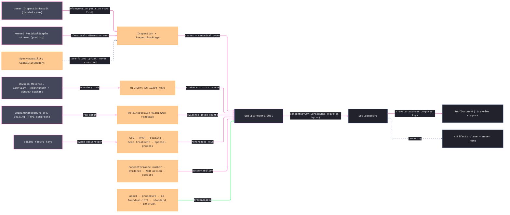

# [RASM_FABRICATION_QUALITY_RECORD]

The as-built quality-record owner is one `QualityRecord` union over staged inspection, EN 10204 material certificates, weld inspection, nonconformance closure, calibration traceability, and typed conformance declarations. `QualityReport.Seal` admits every nested scalar and identity, partitions accountability into measured, conforming, accepted nonconforming, rejected, incomplete, and contradictory evidence, writes declaration-complete canonical bytes, and mints the record key through `ContentKey.Of(EgressKind.Traveler, bytes)`. `OfInspection` and `OfResiduals` return `Fin<QualityRecord>` so invalid tolerances, empty evidence, and malformed residuals never become latent records awaiting a later seal.

The record is a decision ledger, not a disposition judge. Incompleteness and contradiction remain counted evidence; only malformed primitives route the `Op` admission channel — `Fault.OutOfRange` carrying the violating scalar, `InvalidInput` for structural shape. `MillCert` enforces the `CertType.WithResults` and `CertType.ThirdParty` payload laws: result-bearing certificates require chemistry and mechanical evidence, declarations without results carry neither, and `3.2` requires independent-validator identity. Chemistry closure, specification-window contradictions, and mechanical-floor contradictions contribute to one conserved census. Weld rows preserve NDT locus and indication limits beside WPS heat-input evidence. `Nonconformance` records external MRB authority and closure without deriving it, `Calibration` distinguishes as-found from as-left state against one traceable standard, and `QualityDeclarationKind` discriminates CoC, PPAP, coating, heat-treatment, and special-process evidence on the existing declaration case.

Wire posture: HOST-LOCAL. Sealed records cross only as content keys into the `Run(Document)` traveler compose; the record model never sits between wire and rail; sheet/PDF/annotation RENDERING rides the artifacts-plane seam — a renderer arm here is the named boundary violation.

## [01]-[INDEX]

- [01]-[QUALITY_RECORD]: owns the inspection/certificate/disposition/declaration axes, generated identity admission, shared evidence rows, the six-case `QualityRecord` union, the railed evidence factories, `SealedRecord`, and the one `QualityReport.Seal` fold.

## [02]-[QUALITY_RECORD]

- Owner: `CharacteristicClass` owns the AS9102 Form-3 taxonomy; `InspectionStage` owns stage and predecessor policy; `Disposition` owns external MRB verdict semantics; `NdtMethod` owns NDT modality; `CertType` owns EN 10204 evidence requirements; `QualityDeclarationKind` owns CoC, PPAP, coating, heat-treatment, and special-process declarations; generated `HeatNumber`, `NonconformanceNumber`, `AssetTag`, and `QualityDeclaration` own identity admission; the evidence rows own their nested scalars; `QualityRecord` owns the closed record family; `SealedRecord` is the content-keyed receipt; `QualityReport` owns `Seal`.
- Cases: `QualityRecord` cases 6 — `Inspection(InspectionStage, …, Option<ContentKey> Prior, …)`, `MillCert` with optional evidence governed by `CertType.WithResults`, `WeldInspection`, `Nonconformance`, `Calibration`, and `Conformance(QualityDeclaration, Records, IssuedAt)`; `InspectionStage` rows 4 — first article, in-process, final, and predecessor-required reinspection; `CharacteristicClass` rows 5; `Disposition` rows 4; `NdtMethod` rows 5; `CertType` rows 4; `QualityDeclarationKind` rows 5. One `SealedRecord` conserves rows across measured, conforming, accepted-nonconforming, rejected, incomplete, and contradictory projections.
- Entry: `public static Fin<SealedRecord> QualityReport.Seal(QualityRecord record)` — the one entry and generated total `Switch` over every record case; `Fin<T>` routes only the `Op` admission channel for malformed primitives or impossible payload timing. Disposition conflicts, open nonconformances, out-of-tolerance calibration results, and unmeasured characteristics remain counted evidence.
- Auto: `Seal` validates duplicate ordinals, reinspection lineage, nested text, finite windows, optional Cp/Cpk, certificate evidence shape, mechanical floors, weld-joint identity, nonconformance evidence/closure, and calibration interval/readback bounds before counting. Missing demanded weld or calibration readback increments `Incomplete`; accepted nonconformance is distinct from conformity; chemistry, mechanical, and mass-closure contradictions reduce certificate conformance. Canonical rows normalize unordered identities, format `Instant` through `InstantPattern.ExtendedIso`, frame free text as netstrings, and mint through the one content-key entry.
- Receipt: `SealedRecord(ContentKey Key, QualityRecord Record, int Rows, int Measured, int Conforming, int AcceptedNonconforming, int Rejected, int Incomplete, int Contradictions)` is the evidence and the traveler-composable identity.
- Packages: `Process/owner` (`ContentKey`, `EgressKind`, `FabricationResult.InspectionResult`), `Process/physics` (`Material`), kernel analysis (`ResidualSample`), `Spec/capability` (`CapabilityReport`, `CapabilityMetric`), NodaTime (`Instant`, `InstantPattern.ExtendedIso`), `Rasm.Domain` (`Op`, `Fault.OutOfRange` — the admission channel), Thinktecture.Runtime.Extensions, LanguageExt.Core, Rhino.Geometry, BCL inbox.
- Growth: a new record family is one `QualityRecord` case plus one `Seal` and canonical-byte arm; a declaration modality is one `QualityDeclarationKind` row; a new NDT method, cert type, disposition, or characteristic class is one row; a new evidence source is one case factory beside `OfInspection`/`OfResiduals`; a new accountability metric is one count column on `SealedRecord`; zero new entrypoints.
- Boundary: the record is a MODEL and rendering rides the artifacts seam — a sheet/PDF/annotation arm here is the deleted form; ONE union over shared rows — parallel `FaiReport`/`CertReport`/`WeldReport` classes are the deleted form; Cp/Cpk are PRE-FOLDED capability outputs and a page-local Welford/quantile fold is the dual-paradigm defect; conformance truth composes the kernel `ResidualSample` rows and a hand-rolled residual comparator is the deleted form; records key through the ONE `ContentKey.Of` under `EgressKind.Traveler` — a new egress row or a second hasher is the rejected form; canonical text fields frame through the netstring law — bare delimiter concatenation is the named injectivity defect; heat/chemistry/mechanicals are boundary scalars and a `Rasm.Materials` type import is the seam violation; dispositions are MRB authority — a fold that DERIVES `use-as-is`/`rework`/`scrap` is the named over-reach, the contradiction count is the honest form; the fault cluster stays reserved-EMPTY and a Documentation arm on `FabricationFault` is the refused form.

```csharp signature
// --- [RUNTIME_PRELUDE] ----------------------------------------------------------------------------------------------------------------------------
using System.Globalization;
using System.Text;
using LanguageExt;
using LanguageExt.Common;
using NodaTime;
using NodaTime.Text;
using Rasm.Analysis;                 // ResidualSample — the kernel conformance evidence OfResiduals records
using Rasm.Domain;                   // Op + Fault.OutOfRange — the malformed-primitive admission channel
using Rasm.Fabrication.Process;      // Material · ContentKey · EgressKind · FabricationResult.InspectionResult — owner#atoms + physics vocabulary
using Rasm.Fabrication.Spec;         // CapabilityReport · CapabilityMetric — the pre-folded Cp/Cpk seam
using Rhino.Geometry;
using Thinktecture;
using static LanguageExt.Prelude;

namespace Rasm.Fabrication.Documentation;

// --- [TYPES] --------------------------------------------------------------------------------------------------------------------------------------
[SmartEnum<string>]
public sealed partial class CharacteristicClass {
    public static readonly CharacteristicClass Dimension = new("dimension");
    public static readonly CharacteristicClass Geometry = new("gdt");
    public static readonly CharacteristicClass Finish = new("finish");
    public static readonly CharacteristicClass Material = new("material");
    public static readonly CharacteristicClass Process = new("process");
}

[SmartEnum<string>]
public sealed partial class InspectionStage {
    public static readonly InspectionStage FirstArticle = new("first-article", requiresPrior: false);
    public static readonly InspectionStage InProcess = new("in-process", requiresPrior: false);
    public static readonly InspectionStage Final = new("final", requiresPrior: false);
    public static readonly InspectionStage Reinspection = new("reinspection", requiresPrior: true);

    public bool RequiresPrior { get; }
}

// use-as-is is an ACCEPTED nonconformance: Conforming false, Accepted true — the MRB distinction the counts preserve.
[SmartEnum<string>]
public sealed partial class Disposition {
    public static readonly Disposition Conform = new("conform", conforming: true, accepted: true);
    public static readonly Disposition UseAsIs = new("use-as-is", conforming: false, accepted: true);
    public static readonly Disposition Rework = new("rework", conforming: false, accepted: false);
    public static readonly Disposition Scrap = new("scrap", conforming: false, accepted: false);

    public bool Conforming { get; }
    public bool Accepted { get; }
}

[SmartEnum<string>]
public sealed partial class NdtMethod {
    public static readonly NdtMethod Visual = new("vt", volumetric: false);
    public static readonly NdtMethod Penetrant = new("pt", volumetric: false);
    public static readonly NdtMethod MagneticParticle = new("mt", volumetric: false);
    public static readonly NdtMethod Ultrasonic = new("ut", volumetric: true);
    public static readonly NdtMethod Radiographic = new("rt", volumetric: true);

    public bool Volumetric { get; }
}

[SmartEnum<string>]
public sealed partial class CertType {
    public static readonly CertType Declaration21 = new("en10204-2.1", withResults: false, specific: false, thirdParty: false);
    public static readonly CertType TestReport22 = new("en10204-2.2", withResults: true, specific: false, thirdParty: false);
    public static readonly CertType Inspection31 = new("en10204-3.1", withResults: true, specific: true, thirdParty: false);
    public static readonly CertType Inspection32 = new("en10204-3.2", withResults: true, specific: true, thirdParty: true);

    public bool WithResults { get; }
    public bool Specific { get; }
    public bool ThirdParty { get; }
}

[SmartEnum<string>]
public sealed partial class QualityDeclarationKind {
    public static readonly QualityDeclarationKind Conformance = new("coc");
    public static readonly QualityDeclarationKind ProductionPartApproval = new("ppap");
    public static readonly QualityDeclarationKind Coating = new("coating");
    public static readonly QualityDeclarationKind HeatTreatment = new("heat-treatment");
    public static readonly QualityDeclarationKind SpecialProcess = new("special-process");
}

// The mill-lot identity: blank text is unrepresentable past the generated admission — no page-local blank check survives.
[ValueObject<string>]
public sealed partial class HeatNumber {
    static partial void ValidateFactoryArguments(ref ValidationError? validationError, ref string value) {
        value = value?.Trim() ?? string.Empty;
        if (value.Length == 0)
            validationError = new ValidationError("heat number blank");
    }
}

[ValueObject<string>]
public sealed partial class NonconformanceNumber {
    static partial void ValidateFactoryArguments(ref ValidationError? validationError, ref string value) {
        value = value?.Trim() ?? string.Empty;
        if (value.Length == 0)
            validationError = new ValidationError("nonconformance number blank");
    }
}

[ValueObject<string>]
public sealed partial class AssetTag {
    static partial void ValidateFactoryArguments(ref ValidationError? validationError, ref string value) {
        value = value?.Trim() ?? string.Empty;
        if (value.Length == 0)
            validationError = new ValidationError("asset tag blank");
    }
}

[ComplexValueObject]
public readonly partial struct QualityDeclaration {
    public QualityDeclarationKind Kind { get; }
    public string Certificate { get; }
    public string Statement { get; }

    static partial void ValidateFactoryArguments(
        ref ValidationError? validationError,
        ref QualityDeclarationKind kind,
        ref string certificate,
        ref string statement) {
        certificate = certificate?.Trim() ?? string.Empty;
        statement = statement?.Trim() ?? string.Empty;
        if (certificate.Length == 0 || statement.Length == 0)
            validationError = new ValidationError("quality declaration identity and statement must be nonblank");
    }
}

// --- [MODELS] -------------------------------------------------------------------------------------------------------------------------------------
public sealed record CharacteristicRow(
    int Number, CharacteristicClass Class, string Callout, double Nominal, double Lower, double Upper,
    Option<Point3d> Locus, Option<double> Measured, Disposition Verdict) {
    public Option<double> Deviation => Measured.Map(m => m - Nominal);
    public bool Accounted => Measured.IsSome || !Verdict.Conforming;
    public bool Contradicts => Measured.Map(m => (m < Lower || m > Upper) && Verdict.Conforming).IfNone(false);
}

// Spec windows ride the row as optional data — the census reads them, the boundary maps them, no Materials type crosses.
public sealed record ChemistryRow(string Symbol, double MassPct, Option<double> SpecLowPct, Option<double> SpecHighPct) {
    public bool Contradicts => SpecLowPct.Map(lo => MassPct < lo).IfNone(false) || SpecHighPct.Map(hi => MassPct > hi).IfNone(false);
}

public sealed record MechanicalRow(
    double YieldMpa, double TensileMpa, double ElongationPct, Option<double> CharpyJ, Option<double> HardnessHb,
    Option<double> YieldMinMpa, Option<double> TensileMinMpa, Option<double> ElongationMinPct) {
    public bool Contradicts =>
        YieldMinMpa.Map(f => YieldMpa < f).IfNone(false)
        || TensileMinMpa.Map(f => TensileMpa < f).IfNone(false)
        || ElongationMinPct.Map(f => ElongationPct < f).IfNone(false);
}

public sealed record WeldInspectionRow(
    int Joint,
    NdtMethod Method,
    Disposition Verdict,
    Option<double> HeatInputKjPerMm,
    Option<double> WpsCeilingKjPerMm,
    Option<Point3d> Locus,
    Option<double> IndicationMm,
    Option<double> AcceptanceMm) {
    public Option<bool> WithinWps => from hi in HeatInputKjPerMm from cap in WpsCeilingKjPerMm select hi <= cap;
    public Option<bool> WithinNdt => from indication in IndicationMm from acceptance in AcceptanceMm select indication <= acceptance;
    public bool NdtComplete => !Method.Volumetric || Locus.IsSome && IndicationMm.IsSome && AcceptanceMm.IsSome;
}

public sealed record CalibrationRow(
    AssetTag Asset,
    string Procedure,
    double AsFoundError,
    double AllowedError,
    Option<double> AsLeftError,
    ContentKey StandardCertificate,
    Instant CalibratedAt,
    Instant DueAt);

[Union(ConversionFromValue = ConversionOperatorsGeneration.None)]
public abstract partial record QualityRecord {
    private QualityRecord() { }

    public sealed record Inspection(
        InspectionStage Stage,
        UInt128 ComponentKey,
        Arr<CharacteristicRow> Characteristics,
        Option<double> Cp,
        Option<double> Cpk,
        Option<ContentKey> Prior,
        Instant SampledAt) : QualityRecord;
    public sealed record MillCert(
        Material Material,
        HeatNumber Heat,
        CertType Cert,
        string Issuer,
        Option<string> IndependentValidator,
        Arr<ChemistryRow> Chemistry,
        Option<MechanicalRow> Mechanicals,
        Instant IssuedAt) : QualityRecord;
    public sealed record WeldInspection(UInt128 ComponentKey, Arr<WeldInspectionRow> Joints, Instant InspectedAt) : QualityRecord;
    public sealed record Nonconformance(
        UInt128 ComponentKey,
        NonconformanceNumber Number,
        Seq<ContentKey> Evidence,
        Disposition Verdict,
        string Action,
        string Authority,
        Instant OpenedAt,
        Option<Instant> ClosedAt) : QualityRecord;
    public sealed record Calibration(CalibrationRow Row) : QualityRecord;
    public sealed record Conformance(QualityDeclaration Declaration, Seq<ContentKey> Records, Instant IssuedAt) : QualityRecord;

    // Position characteristics per the GD&T convention: nominal 0, window [0, tol], measured 2·|Δ| — the honest
    // InspectionResult projection; Cp/Cpk read PRE-FOLDED off the optional capability report, never re-derived.
    // Dispositions are MRB AUTHORITY: the factory records `conform` unless the mrb map supplies an authority row —
    // an out-of-window measurement under `conform` is exactly what the Seal contradiction census counts.
    public static Fin<QualityRecord> OfInspection(
        UInt128 componentKey, FabricationResult.InspectionResult measured, double positionTol, Instant at,
        Map<int, Disposition> mrb, Option<CapabilityReport> capability) =>
        from _1 in guard(double.IsFinite(positionTol) && positionTol > 0.0,
            new Fault.OutOfRange("quality-record:position-tolerance", positionTol, "finite > 0", Some(QualityReport.RecordOp)) as Error).ToFin()
        from _2 in guard(!measured.Features.IsEmpty,
            QualityReport.RecordOp.InvalidInput()).ToFin()
        select (QualityRecord)new Inspection(
            InspectionStage.FirstArticle,
            componentKey,
            toSeq(measured.Features.Select((f, i) => new CharacteristicRow(
                Number: i + 1, Class: CharacteristicClass.Geometry, Callout: "position", Nominal: 0.0, Lower: 0.0, Upper: positionTol,
                Locus: Some(f.Nominal), Measured: Some(2.0 * f.Nominal.DistanceTo(f.Measured)),
                Verdict: mrb.Find(i + 1).IfNone(Disposition.Conform)))).ToArr(),
            Cp: capability.Bind(static r => r.Rows.Find(static x => x.Metric == CapabilityMetric.Cp).Map(static x => x.Value)),
            Cpk: capability.Bind(static r => r.Rows.Find(static x => x.Metric == CapabilityMetric.Cpk).Map(static x => x.Value)),
            Prior: None,
            SampledAt: at);

    // The kernel-conformance arm: each ResidualSample row RECORDS its own tolerance window, locus, and signed
    // residual — the probing evidence stream lands as dimension-class accountability rows, truth stays the kernel's.
    public static Fin<QualityRecord> OfResiduals(UInt128 componentKey, Seq<ResidualSample> residuals, Instant at, Map<int, Disposition> mrb) =>
        from _1 in guard(!residuals.IsEmpty, QualityReport.RecordOp.InvalidInput()).ToFin()
        from _2 in guard(residuals.ForAll(static sample => double.IsFinite(sample.Tolerance) && sample.Tolerance > 0.0 && double.IsFinite(sample.Distance)),
            QualityReport.RecordOp.InvalidInput()).ToFin()
        select (QualityRecord)new Inspection(
            InspectionStage.InProcess,
            componentKey,
            residuals.Map(s => new CharacteristicRow(
                Number: s.Index + 1, Class: CharacteristicClass.Dimension, Callout: "residual",
                Nominal: 0.0, Lower: -s.Tolerance, Upper: s.Tolerance,
                Locus: Some(s.Location), Measured: Some(s.Distance),
                Verdict: mrb.Find(s.Index + 1).IfNone(Disposition.Conform))).ToArr(),
            Cp: None, Cpk: None, Prior: None, SampledAt: at);
}

public sealed record SealedRecord(
    ContentKey Key,
    QualityRecord Record,
    int Rows,
    int Measured,
    int Conforming,
    int AcceptedNonconforming,
    int Rejected,
    int Incomplete,
    int Contradictions);

// --- [OPERATIONS] ---------------------------------------------------------------------------------------------------------------------------------
public static class QualityReport {
    internal static readonly Op RecordOp = Op.Of(name: "fabrication:quality-record");

    // Reserved-empty cluster law: incompleteness/contradiction is COUNTED evidence; only malformed primitives fail
    // typed through the Op admission channel — never a Documentation FabricationFault arm.
    public static Fin<SealedRecord> Seal(QualityRecord record) =>
        record.Switch(
            inspection: fa =>
                fa.Characteristics.IsEmpty
                || fa.Characteristics.Map(static row => row.Number).Distinct().Count() != fa.Characteristics.Count
                || fa.Characteristics.Exists(static r =>
                    r.Number < 1 || string.IsNullOrWhiteSpace(r.Callout)
                    || !double.IsFinite(r.Nominal) || !double.IsFinite(r.Lower) || !double.IsFinite(r.Upper) || r.Lower > r.Upper
                    || r.Measured.Exists(static m => !double.IsFinite(m))
                    || r.Locus.Exists(static p => !p.IsValid))
                || fa.Cp.Exists(static value => !double.IsFinite(value) || value < 0.0)
                || fa.Cpk.Exists(static value => !double.IsFinite(value) || value < 0.0)
                || fa.Stage.RequiresPrior != fa.Prior.IsSome
                    ? Fin.Fail<SealedRecord>(RecordOp.InvalidInput())
                    : Fin.Succ(new SealedRecord(
                        Key(record), record,
                        Rows: fa.Characteristics.Count,
                        Measured: fa.Characteristics.Count(static r => r.Measured.IsSome),
                        Conforming: fa.Characteristics.Count(static r => r.Accounted && r.Verdict.Conforming && !r.Contradicts),
                        AcceptedNonconforming: fa.Characteristics.Count(static r => !r.Verdict.Conforming && r.Verdict.Accepted),
                        Rejected: fa.Characteristics.Count(static r => !r.Verdict.Conforming && !r.Verdict.Accepted),
                        Incomplete: fa.Characteristics.Count(static r => !r.Accounted),
                        Contradictions: fa.Characteristics.Count(static r => r.Contradicts))),
            millCert: mc => {
                bool evidenceShape = mc.Cert.WithResults
                    ? !mc.Chemistry.IsEmpty && mc.Mechanicals.IsSome
                    : mc.Chemistry.IsEmpty && mc.Mechanicals.IsNone;
                if (!evidenceShape
                    || string.IsNullOrWhiteSpace(mc.Issuer)
                    || mc.Cert.ThirdParty != mc.IndependentValidator.IsSome
                    || mc.IndependentValidator.Exists(static value => string.IsNullOrWhiteSpace(value))
                    || mc.Chemistry.Map(static row => row.Symbol).Distinct().Count() != mc.Chemistry.Count
                    || mc.Chemistry.Exists(static c =>
                    string.IsNullOrWhiteSpace(c.Symbol)
                    || !double.IsFinite(c.MassPct) || c.MassPct < 0.0
                    || c.SpecLowPct.Exists(static value => !double.IsFinite(value) || value < 0.0)
                    || c.SpecHighPct.Exists(static value => !double.IsFinite(value) || value < 0.0)
                    || (from low in c.SpecLowPct from high in c.SpecHighPct select low > high).IfNone(false))
                    || mc.Mechanicals.Exists(static mechanical => !Valid(mechanical)))
                    return Fin.Fail<SealedRecord>(RecordOp.InvalidInput());
                int chemistry = mc.Cert.WithResults ? mc.Chemistry.Count(static c => c.Contradicts) : 0;
                int mechanical = mc.Cert.WithResults && mc.Mechanicals.Exists(static row => row.Contradicts) ? 1 : 0;
                int closure = mc.Chemistry.Map(static c => c.MassPct).Fold(0.0, static (a, v) => a + v) > 100.0 ? 1 : 0;
                int rows = mc.Chemistry.Count + (mc.Mechanicals.IsSome ? 1 : 0);
                int measured = mc.Cert.WithResults ? rows : 0;
                return Fin.Succ(new SealedRecord(
                    Key(record), record,
                    Rows: rows,
                    Measured: measured,
                    Conforming: int.Max(0, measured - chemistry - mechanical - closure),
                    AcceptedNonconforming: 0,
                    Rejected: 0,
                    Incomplete: 0,
                    Contradictions: chemistry + mechanical + closure));
            },
            weldInspection: wi =>
                wi.Joints.IsEmpty
                || wi.Joints.Map(static row => row.Joint).Distinct().Count() != wi.Joints.Count
                || wi.Joints.Exists(static j =>
                    j.Joint < 0
                    || j.HeatInputKjPerMm.Exists(static v => !double.IsFinite(v) || v < 0.0)
                    || j.WpsCeilingKjPerMm.Exists(static v => !double.IsFinite(v) || v <= 0.0)
                    || j.Locus.Exists(static point => !point.IsValid)
                    || j.IndicationMm.Exists(static v => !double.IsFinite(v) || v < 0.0)
                    || j.AcceptanceMm.Exists(static v => !double.IsFinite(v) || v <= 0.0))
                    ? Fin.Fail<SealedRecord>(RecordOp.InvalidInput())
                    : Fin.Succ(new SealedRecord(
                        Key(record), record,
                        Rows: wi.Joints.Count,
                        Measured: wi.Joints.Count(static j =>
                            (j.WpsCeilingKjPerMm.IsNone || j.HeatInputKjPerMm.IsSome)
                            && j.NdtComplete),
                        Conforming: wi.Joints.Count(static j =>
                            j.Verdict.Conforming
                            && (j.WpsCeilingKjPerMm.IsNone || j.HeatInputKjPerMm.IsSome)
                            && j.NdtComplete
                            && j.WithinWps.ForAll(static pass => pass)
                            && j.WithinNdt.ForAll(static pass => pass)),
                        AcceptedNonconforming: wi.Joints.Count(static j => !j.Verdict.Conforming && j.Verdict.Accepted),
                        Rejected: wi.Joints.Count(static j => !j.Verdict.Conforming && !j.Verdict.Accepted),
                        Incomplete: wi.Joints.Count(static j =>
                            j.WpsCeilingKjPerMm.IsSome && j.HeatInputKjPerMm.IsNone
                            || !j.NdtComplete),
                        Contradictions: wi.Joints.Count(static j =>
                            j.Verdict.Conforming
                            && (j.WithinWps.Map(static pass => !pass).IfNone(false)
                                || j.WithinNdt.Map(static pass => !pass).IfNone(false))))),
            nonconformance: ncr =>
                ncr.Verdict.Conforming
                || ncr.Evidence.IsEmpty
                || ncr.Evidence.Distinct().Count() != ncr.Evidence.Count
                || string.IsNullOrWhiteSpace(ncr.Action)
                || string.IsNullOrWhiteSpace(ncr.Authority)
                || ncr.ClosedAt.Exists(closed => closed < ncr.OpenedAt)
                    ? Fin.Fail<SealedRecord>(RecordOp.InvalidInput())
                    : Fin.Succ(new SealedRecord(
                        Key(record), record,
                        Rows: 1,
                        Measured: 1,
                        Conforming: 0,
                        AcceptedNonconforming: ncr.ClosedAt.IsSome && ncr.Verdict.Accepted ? 1 : 0,
                        Rejected: ncr.ClosedAt.IsSome && !ncr.Verdict.Accepted ? 1 : 0,
                        Incomplete: ncr.ClosedAt.IsNone ? 1 : 0,
                        Contradictions: 0)),
            calibration: calibration => {
                CalibrationRow row = calibration.Row;
                if (string.IsNullOrWhiteSpace(row.Procedure)
                    || !double.IsFinite(row.AsFoundError)
                    || !double.IsFinite(row.AllowedError) || row.AllowedError <= 0.0
                    || row.AsLeftError.Exists(static value => !double.IsFinite(value))
                    || row.DueAt <= row.CalibratedAt)
                    return Fin.Fail<SealedRecord>(RecordOp.InvalidInput());
                bool complete = double.Abs(row.AsFoundError) <= row.AllowedError || row.AsLeftError.IsSome;
                bool conforming = row.AsLeftError.Map(value => double.Abs(value) <= row.AllowedError)
                    .IfNone(double.Abs(row.AsFoundError) <= row.AllowedError);
                return Fin.Succ(new SealedRecord(
                    Key(record), record,
                    Rows: 1,
                    Measured: 1,
                    Conforming: complete && conforming ? 1 : 0,
                    AcceptedNonconforming: 0,
                    Rejected: complete && !conforming ? 1 : 0,
                    Incomplete: complete ? 0 : 1,
                    Contradictions: 0));
            },
            conformance: coc =>
                coc.Records.IsEmpty || coc.Records.Distinct().Count() != coc.Records.Count
                    ? Fin.Fail<SealedRecord>(RecordOp.InvalidInput())
                    : Fin.Succ(new SealedRecord(
                        Key(record), record,
                        Rows: coc.Records.Count,
                        Measured: coc.Records.Count,
                        Conforming: coc.Records.Count,
                        AcceptedNonconforming: 0,
                        Rejected: 0,
                        Incomplete: 0,
                        Contradictions: 0)));

    // Canonical bytes are DECLARATION-COMPLETE and INJECTIVE: every field of every case and nested row contributes in
    // stable declaration order under the invariant culture, free text netstring-framed ({length}:{text}) so no field
    // value can forge the structural delimiters — the content key IS the record identity (K9).
    static ContentKey Key(QualityRecord record) => ContentKey.Of(EgressKind.Traveler, CanonicalBytes(record));

    static byte[] CanonicalBytes(QualityRecord record) =>
        Encoding.UTF8.GetBytes(record.Switch(
            inspection: static fa =>
                $"inspection|{fa.Stage.Key}|{fa.ComponentKey:x32}|{T(fa.SampledAt)}|{OptKey(fa.Prior)}|{Opt(fa.Cp)}|{Opt(fa.Cpk)}|{string.Join(';', fa.Characteristics.OrderBy(static row => row.Number).Map(static r =>
                    $"{r.Number}:{r.Class.Key}:{S(r.Callout)}:{N(r.Nominal)}:{N(r.Lower)}:{N(r.Upper)}:{Locus(r.Locus)}:{Opt(r.Measured)}:{r.Verdict.Key}"))}",
            millCert: static mc =>
                $"cert|{mc.Material.Key}|{S(mc.Heat.ToValue())}|{mc.Cert.Key}|{S(mc.Issuer)}|{mc.IndependentValidator.Map(S).IfNone("-")}|{T(mc.IssuedAt)}"
                + $"|{string.Join(';', mc.Chemistry.OrderBy(static row => row.Symbol).Map(static c => $"{S(c.Symbol)}:{N(c.MassPct)}:{Opt(c.SpecLowPct)}:{Opt(c.SpecHighPct)}"))}"
                + $"|{mc.Mechanicals.Map(MechanicalLine).IfNone("-")}",
            weldInspection: static wi =>
                $"weld|{wi.ComponentKey:x32}|{T(wi.InspectedAt)}|{string.Join(';', wi.Joints.OrderBy(static row => row.Joint).Map(static j =>
                    $"{j.Joint}:{j.Method.Key}:{j.Verdict.Key}:{Opt(j.HeatInputKjPerMm)}:{Opt(j.WpsCeilingKjPerMm)}:{Locus(j.Locus)}:{Opt(j.IndicationMm)}:{Opt(j.AcceptanceMm)}"))}",
            nonconformance: static ncr =>
                $"ncr|{ncr.ComponentKey:x32}|{S(ncr.Number.ToValue())}|{ncr.Verdict.Key}|{S(ncr.Action)}|{S(ncr.Authority)}|{T(ncr.OpenedAt)}|{OptTime(ncr.ClosedAt)}"
                + $"|{string.Join(';', ncr.Evidence.OrderBy(static key => key.Kind.Key).ThenBy(static key => key.Digest).Map(K))}",
            calibration: static calibration =>
                $"calibration|{S(calibration.Row.Asset.ToValue())}|{S(calibration.Row.Procedure)}|{N(calibration.Row.AsFoundError)}"
                + $"|{N(calibration.Row.AllowedError)}|{Opt(calibration.Row.AsLeftError)}|{K(calibration.Row.StandardCertificate)}"
                + $"|{T(calibration.Row.CalibratedAt)}|{T(calibration.Row.DueAt)}",
            conformance: static coc =>
                $"declaration|{coc.Declaration.Kind.Key}|{S(coc.Declaration.Certificate)}|{S(coc.Declaration.Statement)}|{T(coc.IssuedAt)}"
                + $"|{string.Join(';', coc.Records.OrderBy(static key => key.Kind.Key).ThenBy(static key => key.Digest).Map(K))}"));

    static bool Valid(MechanicalRow row) =>
        double.IsFinite(row.YieldMpa) && row.YieldMpa >= 0.0
        && double.IsFinite(row.TensileMpa) && row.TensileMpa >= 0.0
        && double.IsFinite(row.ElongationPct) && row.ElongationPct >= 0.0
        && row.CharpyJ.ForAll(static value => double.IsFinite(value) && value >= 0.0)
        && row.HardnessHb.ForAll(static value => double.IsFinite(value) && value >= 0.0)
        && row.YieldMinMpa.ForAll(static value => double.IsFinite(value) && value >= 0.0)
        && row.TensileMinMpa.ForAll(static value => double.IsFinite(value) && value >= 0.0)
        && row.ElongationMinPct.ForAll(static value => double.IsFinite(value) && value >= 0.0);

    static string MechanicalLine(MechanicalRow row) =>
        $"{N(row.YieldMpa)}:{N(row.TensileMpa)}:{N(row.ElongationPct)}:{Opt(row.CharpyJ)}:{Opt(row.HardnessHb)}"
        + $":{Opt(row.YieldMinMpa)}:{Opt(row.TensileMinMpa)}:{Opt(row.ElongationMinPct)}";

    static string S(string raw) => $"{raw.Length}:{raw}";

    static string N(double value) => value.ToString("R", CultureInfo.InvariantCulture);

    static string T(Instant value) => InstantPattern.ExtendedIso.Format(value);

    static string Opt(Option<double> value) => value.Map(N).IfNone("-");

    static string K(ContentKey key) => $"{key.Kind.Key}:{key.Digest:x32}";

    static string OptKey(Option<ContentKey> value) => value.Map(K).IfNone("-");

    static string OptTime(Option<Instant> value) => value.Map(T).IfNone("-");

    static string Locus(Option<Point3d> locus) => locus.Map(static p => $"{N(p.X)},{N(p.Y)},{N(p.Z)}").IfNone("-");
}
```


