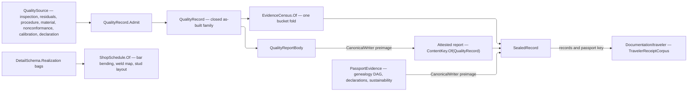

# [RASM_FABRICATION_QUALITY_RECORD]

As-built quality truth enters once through `QualityRecord.Admit(QualitySource)`, remains typed across inspection, material, process, nonconformance, calibration, and declaration evidence, and exits through `QualityReport.Seal(QualityReportRequest)`. `SealedRecord` preserves the full record set, one folded accountability census, cryptographic attestations, and the optional `EgressKind.DigitalProductPassport` identity the traveler composes. `ShopSchedule` folds the same seam's realization bags into bar-bending, weld-map, and stud-layout deliverables.

Every signed artifact is keyed and signed over a `CanonicalWriter` BINARY preimage composing `FabricationCanon`, never a serializer's output: a quantity enters as its family token and base-unit magnitude, so renaming a display unit cannot invalidate a signature, and every collection carries its count while every optional column carries its presence bit. `CanonicalJson` remains the TRANSPORT rendering the traveler document serializes through, carrying the `[JsonPolymorphic]` rosters, the LanguageExt carrier factory, and the Thinktecture value factory that make that rendering round-trip.

`ECDsa` signs the preimage, signer, role, credential, and instant; the trust callback binds those claims to the certificate before quorum and receipt verification. Passport attestations bind genealogy, materials, compliance, declarations, lifecycle, sustainability, and report key. `NdtMethod` and `InspectionFamily` arrive settled from `Joining/procedure`, so the performed grain and the demand grain meet at one owner.

## [01]-[INDEX]

- [02]-[EVIDENCE_VOCABULARY]: the closed refusal, relation, grade, class, stage, sampling, disposition, decision-rule, coverage, declaration, role, outcome, root-cause, and correction rows every record keys on.
- [03]-[QUALITY_RECORD]: admitted evidence owners, the observation family and its census, the closed as-built record family, and `QualityRecord.Admit` over one `QualitySource`.
- [04]-[PASSPORT_AND_SEAL]: passport evidence, the attestation algebra, the canonical binary preimage, the transport rendering, and `QualityReport.Seal`.
- [05]-[SHOP_SCHEDULE]: `ScheduleKind` fold rows over `DetailSchema.Realization` bags and the `ScheduleEntry` deliverables they emit.

## [02]-[EVIDENCE_VOCABULARY]

- Owner: `RecordRefusal` owns the distinguishable operation refusals; `EvidenceOutcome` owns the six evaluation states and their severity rank; `Disposition` owns material-review verdicts; `RootCauseCategory` and `CorrectionKind` own the corrective vocabulary; every other row closes one evidence axis.
- Law: `EvidenceOutcome` carries its RANK and whether it counts as measured — nothing else. The census counts ROWS PER OUTCOME in one fold, so the partition holds by construction and seven parallel indicator columns per row, each restating which bucket the row belongs to, are the deleted form.
- Law: root cause and correction are TYPED. A cause names its category beside its statement and a correction names its kind, so a corrective-action query partitions on rows rather than parsing narrative text a shop typed once.
- Law: every closed row uses the GENERATED positional constructor. A hand `private Row(string key, …) : this(key) => (…)` beside the generator's own is a second construction path that drifts the moment a column is added.
- Growth: a refusal is one `RecordRefusal` row; an outcome is one `EvidenceOutcome` row carrying its rank; a cause category, correction kind, declaration kind, or attestation role is one row on its own owner.

```csharp signature
// --- [RUNTIME_PRELUDE] ----------------------------------------------------------------------------------------------------------------------------
using System;
using System.Collections.Generic;
using System.Linq;
using System.Security.Cryptography;
using System.Security.Cryptography.X509Certificates;
using System.Text.Json;
using System.Text.Json.Serialization;
using LanguageExt;
using LanguageExt.Common;
using LanguageExt.Traits;
using NodaTime;
using NodaTime.Serialization.SystemTextJson;
using QuikGraph;
using QuikGraph.Algorithms;
using Rasm.Analysis;
using Rasm.Domain;
using Rasm.Element.Projection;
using Rasm.Element.Properties;
using Rasm.Fabrication.Joining;
using Rasm.Fabrication.Process;
using Rasm.Fabrication.Spec;
using Thinktecture;
using Thinktecture.Text.Json.Serialization;
using UnitsNet;
using UnitsNet.Units;
using static LanguageExt.Prelude;
using PropertyBag = Rasm.Element.Properties.ValueBag<Rasm.Element.Properties.PropertyValue>;

namespace Rasm.Fabrication.Documentation;

// --- [VOCABULARY] ---------------------------------------------------------------------------------------------------------------------------------
[SmartEnum<string>]
public sealed partial class RecordRefusal {
    public static readonly RecordRefusal Source = new("source-absent");
    public static readonly RecordRefusal Subject = new("subject-unmapped");
    public static readonly RecordRefusal Sampling = new("sampling-plan");
    public static readonly RecordRefusal Window = new("tolerance-window");
    public static readonly RecordRefusal Evidence = new("evidence-inadmissible");
    public static readonly RecordRefusal Declaration = new("declaration-invalid");
    public static readonly RecordRefusal Lineage = new("record-lineage");
    public static readonly RecordRefusal Scope = new("scope-absent");
    public static readonly RecordRefusal Credential = new("credential-incomplete");
    public static readonly RecordRefusal Quorum = new("attestation-quorum");
    public static readonly RecordRefusal Independence = new("signer-independence");
    public static readonly RecordRefusal Canonical = new("canonical-encode");
    public static readonly RecordRefusal Signature = new("signature-unverified");
    public static readonly RecordRefusal SigningKey = new("signing-key-absent");
}

[SmartEnum<string>]
public sealed partial class TraceRelation {
    public static readonly TraceRelation ProducedFrom = new("produced-from");
    public static readonly TraceRelation AssembledInto = new("assembled-into");
    public static readonly TraceRelation CertifiedBy = new("certified-by");
    public static readonly TraceRelation InspectedBy = new("inspected-by");
    public static readonly TraceRelation MeasuredWith = new("measured-with");
    public static readonly TraceRelation DerivedFrom = new("derived-from");
    public static readonly TraceRelation SupersededBy = new("superseded-by");
    public static readonly TraceRelation ReworkedInto = new("reworked-into");
    public static readonly TraceRelation SegregatedAs = new("segregated-as");
}

[SmartEnum<string>]
public sealed partial class TestOrientation {
    public static readonly TestOrientation Longitudinal = new("longitudinal");
    public static readonly TestOrientation Transverse = new("transverse");
    public static readonly TestOrientation ThroughThickness = new("through-thickness");
    public static readonly TestOrientation WeldMetal = new("weld-metal");
    public static readonly TestOrientation FusionLine = new("fusion-line");
    public static readonly TestOrientation HeatAffectedZone = new("heat-affected-zone");
}

[SmartEnum<string>]
public sealed partial class ExaminerGrade {
    public static readonly ExaminerGrade LevelOne = new("level-1", interprets: false, approvesProcedure: false);
    public static readonly ExaminerGrade LevelTwo = new("level-2", interprets: true, approvesProcedure: false);
    public static readonly ExaminerGrade LevelThree = new("level-3", interprets: true, approvesProcedure: true);

    public bool Interprets { get; }
    public bool ApprovesProcedure { get; }
}

[SmartEnum<string>]
public sealed partial class EvidenceRefKind {
    public static readonly EvidenceRefKind Report = new("report");
    public static readonly EvidenceRefKind Characteristic = new("characteristic");
    public static readonly EvidenceRefKind Product = new("product");
    public static readonly EvidenceRefKind Certificate = new("certificate");
    public static readonly EvidenceRefKind Personnel = new("personnel");
    public static readonly EvidenceRefKind Procedure = new("procedure");
    public static readonly EvidenceRefKind Material = new("material");
    public static readonly EvidenceRefKind Lot = new("lot");
    public static readonly EvidenceRefKind Source = new("source");
    public static readonly EvidenceRefKind Requirement = new("requirement");
}

[SmartEnum<string>]
public sealed partial class CharacteristicClass {
    public static readonly CharacteristicClass Dimension = new("dimension", quantified: true, requiresLocus: true);
    public static readonly CharacteristicClass Geometry = new("geometry", quantified: true, requiresLocus: true);
    public static readonly CharacteristicClass Surface = new("surface", quantified: true, requiresLocus: true);
    public static readonly CharacteristicClass Material = new("material", quantified: true, requiresLocus: false);
    public static readonly CharacteristicClass Process = new("process", quantified: false, requiresLocus: false);
    public static readonly CharacteristicClass Assembly = new("assembly", quantified: true, requiresLocus: true);
    public static readonly CharacteristicClass Functional = new("functional", quantified: true, requiresLocus: false);
    public static readonly CharacteristicClass Visual = new("visual", quantified: false, requiresLocus: true);
    public static readonly CharacteristicClass Documentation = new("documentation", quantified: false, requiresLocus: false);

    public bool Quantified { get; }
    public bool RequiresLocus { get; }
}

[SmartEnum<string>]
public sealed partial class InspectionStage {
    public static readonly InspectionStage Receiving = new("receiving", requiresPrior: false);
    public static readonly InspectionStage FirstArticle = new("first-article", requiresPrior: false);
    public static readonly InspectionStage Setup = new("setup", requiresPrior: false);
    public static readonly InspectionStage InProcess = new("in-process", requiresPrior: false);
    public static readonly InspectionStage Final = new("final", requiresPrior: false);
    public static readonly InspectionStage Reinspection = new("reinspection", requiresPrior: true);
    public static readonly InspectionStage Surveillance = new("surveillance", requiresPrior: true);

    public bool RequiresPrior { get; }
}

// ISO 2859-1 inspection levels: discrimination is the relative sample size a level draws, and the census level
// draws the whole lot rather than a sample at all.
[SmartEnum<string>]
public sealed partial class InspectionLevel {
    public static readonly InspectionLevel Special1 = new("s-1", census: false);
    public static readonly InspectionLevel Special2 = new("s-2", census: false);
    public static readonly InspectionLevel Special3 = new("s-3", census: false);
    public static readonly InspectionLevel Special4 = new("s-4", census: false);
    public static readonly InspectionLevel General1 = new("i", census: false);
    public static readonly InspectionLevel General2 = new("ii", census: false);
    public static readonly InspectionLevel General3 = new("iii", census: false);
    public static readonly InspectionLevel Total = new("100-percent", census: true);

    // A declared column, never an infinity read back as one: the census level is a KIND of plan, not a limit.
    public bool Census { get; }
}

[SmartEnum<string>]
public sealed partial class InspectionSeverity {
    public static readonly InspectionSeverity Normal = new("normal", acceptanceShift: 0);
    public static readonly InspectionSeverity Tightened = new("tightened", acceptanceShift: -1);
    public static readonly InspectionSeverity Reduced = new("reduced", acceptanceShift: 0);

    public int AcceptanceShift { get; }
}

[SmartEnum<string>]
public sealed partial class Disposition {
    public static readonly Disposition Conform = new("conform", conforming: true, accepted: true, terminal: true, requiresAuthority: false);
    public static readonly Disposition UseAsIs = new("use-as-is", conforming: false, accepted: true, terminal: true, requiresAuthority: true);
    public static readonly Disposition Repair = new("repair", conforming: false, accepted: false, terminal: false, requiresAuthority: true);
    public static readonly Disposition Rework = new("rework", conforming: false, accepted: false, terminal: false, requiresAuthority: true);
    public static readonly Disposition ReturnToSupplier = new("return-to-supplier", conforming: false, accepted: false, terminal: true, requiresAuthority: true);
    public static readonly Disposition Reject = new("reject", conforming: false, accepted: false, terminal: true, requiresAuthority: true);
    public static readonly Disposition Scrap = new("scrap", conforming: false, accepted: false, terminal: true, requiresAuthority: true);
    public static readonly Disposition PendingReview = new("pending-review", conforming: false, accepted: false, terminal: false, requiresAuthority: true);

    public bool Conforming { get; }
    public bool Accepted { get; }
    public bool Terminal { get; }
    public bool RequiresAuthority { get; }
}

[SmartEnum<string>]
public sealed partial class DecisionRule {
    public static readonly DecisionRule SimpleAcceptance = new("simple-acceptance", guardBandFactor: 0.0);
    public static readonly DecisionRule SharedRisk = new("shared-risk", guardBandFactor: 0.5);
    public static readonly DecisionRule GuardBand = new("guard-band", guardBandFactor: 1.0);

    public double GuardBandFactor { get; }
}

[SmartEnum<string>]
public sealed partial class CoverageInterval {
    public static readonly CoverageInterval Standard = new("k1", factor: 1.0, confidence: 0.6827);
    public static readonly CoverageInterval Nominal95 = new("k1.96", factor: 1.96, confidence: 0.95);
    public static readonly CoverageInterval Expanded = new("k2", factor: 2.0, confidence: 0.9545);
    public static readonly CoverageInterval Critical = new("k3", factor: 3.0, confidence: 0.9973);

    public double Factor { get; }
    public double Confidence { get; }
}

[SmartEnum<string>]
public sealed partial class QualityDeclarationKind {
    public static readonly QualityDeclarationKind CertificateOfConformity = new("certificate-of-conformity");
    public static readonly QualityDeclarationKind ProductionPartApproval = new("production-part-approval");
    public static readonly QualityDeclarationKind Coating = new("coating");
    public static readonly QualityDeclarationKind HeatTreatment = new("heat-treatment");
    public static readonly QualityDeclarationKind SpecialProcess = new("special-process");
}

[SmartEnum<int>]
public sealed partial class PpapLevel {
    public static readonly PpapLevel One = new(1);
    public static readonly PpapLevel Two = new(2);
    public static readonly PpapLevel Three = new(3);
    public static readonly PpapLevel Four = new(4);
    public static readonly PpapLevel Five = new(5);
}

[SmartEnum<string>]
public sealed partial class AttestationRole {
    public static readonly AttestationRole Manufacturer = new("manufacturer", independentAuthority: false);
    public static readonly AttestationRole ManufacturerAuthorized = new("manufacturer-authorized", independentAuthority: false);
    public static readonly AttestationRole Purchaser = new("purchaser", independentAuthority: true);
    public static readonly AttestationRole Independent = new("independent", independentAuthority: true);
    public static readonly AttestationRole Quality = new("quality", independentAuthority: false);
    public static readonly AttestationRole Regulator = new("regulator", independentAuthority: true);
    public static readonly AttestationRole WeldingInspector = new("welding-inspector", independentAuthority: true);
    public static readonly AttestationRole CalibrationLaboratory = new("calibration-laboratory", independentAuthority: true);
    public static readonly AttestationRole MaterialReviewBoard = new("material-review-board", independentAuthority: true);
    public static readonly AttestationRole SustainabilityVerifier = new("sustainability-verifier", independentAuthority: true);

    public bool IndependentAuthority { get; }
}

// Rank orders severity; `Measured` says whether the row carried a reading at all. The bucket a row falls in IS
// the row, so a census counts rows per outcome and needs no indicator column to add up.
[SmartEnum<string>]
public sealed partial class EvidenceOutcome {
    public static readonly EvidenceOutcome Trace = new("trace", rank: 0, measured: false);
    public static readonly EvidenceOutcome Conforming = new("conforming", rank: 1, measured: true);
    public static readonly EvidenceOutcome Incomplete = new("incomplete", rank: 2, measured: false);
    public static readonly EvidenceOutcome AcceptedNonconforming = new("accepted-nonconforming", rank: 3, measured: true);
    public static readonly EvidenceOutcome Rejected = new("rejected", rank: 4, measured: true);
    public static readonly EvidenceOutcome Contradiction = new("contradiction", rank: 5, measured: true);

    public int Rank { get; }
    public bool Measured { get; }

    internal static EvidenceOutcome Worst(EvidenceOutcome left, EvidenceOutcome right) =>
        left.Rank >= right.Rank ? left : right;
}

// The corrective vocabulary a nonconformance query partitions on. A narrative alone forces every downstream
// question — which failure mode recurs, which action class actually closed it — back into text search.
[SmartEnum<string>]
public sealed partial class RootCauseCategory {
    public static readonly RootCauseCategory Material = new("material");
    public static readonly RootCauseCategory Method = new("method");
    public static readonly RootCauseCategory Machine = new("machine");
    public static readonly RootCauseCategory Measurement = new("measurement");
    public static readonly RootCauseCategory Personnel = new("personnel");
    public static readonly RootCauseCategory Environment = new("environment");
    public static readonly RootCauseCategory Design = new("design");
    public static readonly RootCauseCategory Supplier = new("supplier");
    public static readonly RootCauseCategory Documentation = new("documentation");
}

[SmartEnum<string>]
public sealed partial class CorrectionKind {
    public static readonly CorrectionKind Contain = new("contain", systemic: false);
    public static readonly CorrectionKind Repair = new("repair", systemic: false);
    public static readonly CorrectionKind Rework = new("rework", systemic: false);
    public static readonly CorrectionKind Replace = new("replace", systemic: false);
    public static readonly CorrectionKind Retrain = new("retrain", systemic: true);
    public static readonly CorrectionKind ProcessChange = new("process-change", systemic: true);
    public static readonly CorrectionKind DesignChange = new("design-change", systemic: true);
    public static readonly CorrectionKind SupplierAction = new("supplier-action", systemic: true);

    // Only a systemic kind can discharge a corrective ACTION; an immediate correction never closes a recurrence.
    public bool Systemic { get; }
}
```

## [03]-[QUALITY_RECORD]

- Owner: `QualitySource` owns raw ingress modality; the generated evidence owners own admission; `QualityRecord` owns the closed as-built family; `QualityObservation` owns one evaluated reading and `EvidenceCensus` its folded accountability.
- Owner: `SamplingPlan` carries AQL, `InspectionLevel`, `InspectionSeverity`, sample size, and the acceptance-rejection pair; `InspectionEvidence.LotVerdict` compares observed nonconformities against the severity-shifted acceptance number. The plan arrives DRAWN — the sample size comes off the caller's own ISO 2859-1 code-letter table — so level and severity carry the identity a plan was drawn under plus the acceptance shift this page applies, and a level-discrimination or severity sample-factor column would state a derivation no fold here performs.
- Law: a verdict requiring material-review authority is signed by a grade that holds it — `Disposition.RequiresAuthority` against `ExaminerGrade.ApprovesProcedure` — because interpreting findings and dispositioning nonconforming product are two authorities and a row carrying the first for a verdict demanding the second is an unsigned disposition.
- Owner: `NonconformanceEvidence` separates immediate `Correction` from systemic `CorrectiveAction`, carries the `Containment` scope and `Recurrence` link, and admits `Effectiveness` evidence exactly when a corrective action exists.
- Owner: `CertType.En10204_2_1`, `En10204_2_2`, `En10204_3_1`, and `En10204_3_2` carry exact `EN 10204` result and representative shapes; `Requirements` derives role-only or named-representative quorum from the selected case.
- Owner: `QualityDeclaration` carries conformity scope, PPAP level and parts, coating system and film thickness, heat-treatment cycle, or special-process procedure and operator.
- Law: a SHORT sample emits ONE `Missing` observation PER MISSING UNIT. A single observation for a plan that drew five of twenty units states the same evidence gap as one that drew nineteen, and every census, severity, and acceptance read off it inherits that flattening.
- Law: a characteristic row carries the STACKUP EVIDENCE behind its own closure where a chain governs it — the chain's method, its half-range against its bound, and its ranked contribution rows — so a failed characteristic names the feature variation dominating it and corrective action routes to a term rather than to the assembly. The rows arrive from `ToleranceChain.Evaluate`; this page ranks nothing of its own.
- Law: `ProcessEvidence.Unfulfilled` diffs `ProcedureReceipt.Inspections` against the performed `WeldInspectionRow` set through `InspectionRequirement.Satisfies(NdtMethod)` — the ONE grain seam `Joining/procedure` owns — so a documentation-plane reconciliation never re-derives the family-to-method correspondence under a second vocabulary.
- Law: `CalibrationRow` carries the interval `Period` and the `Impacted` record keys measured inside it, so an out-of-tolerance as-found reading is `Complete` only once its downstream impact is enumerated.
- Law: `QualityObservation.Outcome` projects every evidence atom to one `EvidenceOutcome`; `EvidenceCensus.Of` folds rows into one bucket map whose named counters project from it, so the partition is structural and `Severity` carries the worst outcome seen.
- Law: `RecordRefusal` rows name every distinguishable operation rejection and lower onto `Op.InvalidResult(detail:)`, while every generated owner refuses on the fabrication band under its own locus — two rails, each carrying a discriminant a caller can act on.
- Entry: `public static Fin<QualityRecord> QualityRecord.Admit(QualitySource source)` is the only record-creation entrypoint.
- Receipt: `CharacteristicRow`, `ChemistryRow`, `MechanicalRow`, `WeldInspectionRow`, and `CalibrationRow` carry quantity, `CoverageInterval` uncertainty, method, equipment, personnel, procedure, acceptance, examiner grade, locus, coverage, environment, traceability, and lifecycle evidence. `Measurement.StandardUncertainty` and `ToleranceRatio` derive from the declared coverage factor.
- Packages: owner atoms (`ContentKey`, `EgressKind`, `FabricationResult`, `InspectionFeature`, `MaterialSpec`), `Joining/procedure` (`ProcedureReceipt`, `InspectionRequirement`, `InspectionFamily`, `NdtMethod`), `Spec/capability` (`CapabilityReport`), `Spec/tolerance` (`ChainReceipt`, `StackMethod`, `CharacteristicId`), `Rasm.Analysis` (`ResidualSample`), `UnitsNet`, `NodaTime`, Thinktecture.Runtime.Extensions, LanguageExt.Core.
- Growth: a source is one `QualitySource` case; a record is one `QualityRecord` case; an observation is one `QualityObservation` case; a declaration is one `QualityDeclaration` case.
- Boundary: `ProcedureReceipt`, `InspectionRequirement`, and qualification rows enter through `ProcessEvidence`; `MaterialSpec` carries mill-certificate grade identity; `CapabilityReport` remains inspection evidence.

```csharp signature
// --- [ADMISSION] ----------------------------------------------------------------------------------------------------------------------------------
[ValueObject<string>]
[ValidationError<FabricationFault>]
[ConfidentialData]
public readonly partial struct HeatNumber {
    [BoundaryAdapter]
    static partial void ValidateFactoryArguments(ref FabricationFault? validationError, ref string value) {
        value = value.Trim();
        if (!Witness.Keyed(value))
            validationError = QualityReport.Refusal("heat-number");
    }

    public static Fin<HeatNumber> Admit(string value) => Admission.OfValue<HeatNumber, string>(value);
}

[ValueObject<string>]
[ValidationError<FabricationFault>]
public readonly partial struct NonconformanceNumber {
    [BoundaryAdapter]
    static partial void ValidateFactoryArguments(ref FabricationFault? validationError, ref string value) {
        value = value.Trim();
        if (!Witness.Keyed(value))
            validationError = QualityReport.Refusal("nonconformance-number");
    }

    public static Fin<NonconformanceNumber> Admit(string value) => Admission.OfValue<NonconformanceNumber, string>(value);
}

[ValueObject<string>]
[ValidationError<FabricationFault>]
public readonly partial struct AssetTag {
    [BoundaryAdapter]
    static partial void ValidateFactoryArguments(ref FabricationFault? validationError, ref string value) {
        value = value.Trim();
        if (!Witness.Keyed(value))
            validationError = QualityReport.Refusal("asset-tag");
    }

    public static Fin<AssetTag> Admit(string value) => Admission.OfValue<AssetTag, string>(value);
}

[ValueObject<string>]
[ValidationError<FabricationFault>]
public sealed partial class EvidenceId {
    [BoundaryAdapter]
    static partial void ValidateFactoryArguments(ref FabricationFault? validationError, ref string value) {
        value = value.Trim();
        if (!Witness.Keyed(value))
            validationError = QualityReport.Refusal("evidence-id");
    }

    public static Fin<EvidenceId> Admit(string value) => Admission.Of<EvidenceId, string>(value);
}

// One narrative statement owner: trimmed, non-empty, and never a bare string field a producer can leave blank.
[ValueObject<string>]
[ValidationError<FabricationFault>]
public sealed partial class Narrative {
    [BoundaryAdapter]
    static partial void ValidateFactoryArguments(ref FabricationFault? validationError, ref string value) {
        value = value.Trim();
        if (!Witness.Keyed(value))
            validationError = QualityReport.Refusal("narrative");
    }

    public static Fin<Narrative> Admit(string value) => Admission.Of<Narrative, string>(value);
}

public sealed record RootCause(RootCauseCategory Category, Narrative Statement);
public sealed record CorrectiveStep(CorrectionKind Kind, Narrative Statement);

// The persisted wire discriminator is the case name under one `kind` property, locked per case so a rename at the
// type breaks the build rather than the wire, and the roster is what makes the transport rendering round-trip.
[Union(ConversionFromValue = ConversionOperatorsGeneration.None)]
[JsonPolymorphic(TypeDiscriminatorPropertyName = "kind")]
[JsonDerivedType(typeof(Report), "report")]
[JsonDerivedType(typeof(Characteristic), "characteristic")]
[JsonDerivedType(typeof(Product), "product")]
[JsonDerivedType(typeof(Certificate), "certificate")]
[JsonDerivedType(typeof(Personnel), "personnel")]
[JsonDerivedType(typeof(Procedure), "procedure")]
[JsonDerivedType(typeof(Material), "material")]
[JsonDerivedType(typeof(Lot), "lot")]
[JsonDerivedType(typeof(Source), "source")]
[JsonDerivedType(typeof(Requirement), "requirement")]
public abstract partial record EvidenceRef {
    private EvidenceRef(EvidenceRefKind kind) => Kind = kind;

    public EvidenceRefKind Kind { get; }

    public sealed record Report(EvidenceId Id) : EvidenceRef(EvidenceRefKind.Report);
    public sealed record Characteristic(CharacteristicId Id) : EvidenceRef(EvidenceRefKind.Characteristic);
    public sealed record Product(EvidenceId Id) : EvidenceRef(EvidenceRefKind.Product);
    public sealed record Certificate(EvidenceId Id) : EvidenceRef(EvidenceRefKind.Certificate);
    public sealed record Personnel(EvidenceId Id) : EvidenceRef(EvidenceRefKind.Personnel);
    public sealed record Procedure(EvidenceId Id) : EvidenceRef(EvidenceRefKind.Procedure);
    public sealed record Material(EvidenceId Id) : EvidenceRef(EvidenceRefKind.Material);
    public sealed record Lot(EvidenceId Id) : EvidenceRef(EvidenceRefKind.Lot);
    public sealed record Source(EvidenceId Id) : EvidenceRef(EvidenceRefKind.Source);
    public sealed record Requirement(EvidenceId Id) : EvidenceRef(EvidenceRefKind.Requirement);

    // The identity token every preimage reads: the characteristic arm keys on its own typed id and every other arm
    // on the evidence id, so the two identity spaces never convert into one another.
    public string Token => Switch(
        report: static row => row.Id.ToValue(),
        characteristic: static row => row.Id.ToValue().ToString("x32"),
        product: static row => row.Id.ToValue(),
        certificate: static row => row.Id.ToValue(),
        personnel: static row => row.Id.ToValue(),
        procedure: static row => row.Id.ToValue(),
        material: static row => row.Id.ToValue(),
        lot: static row => row.Id.ToValue(),
        source: static row => row.Id.ToValue(),
        requirement: static row => row.Id.ToValue());
}

[ValueObject<Seq<EvidenceRef>>]
[ValidationError<FabricationFault>]
public sealed partial class EvidenceLinks {
    [BoundaryAdapter]
    static partial void ValidateFactoryArguments(ref FabricationFault? validationError, ref Seq<EvidenceRef> value) {
        if (value.IsEmpty || value.Distinct().Count != value.Count)
            validationError = QualityReport.Refusal("evidence-links");
    }

    public static Fin<EvidenceLinks> Admit(Seq<EvidenceRef> value) => Admission.Of<EvidenceLinks, Seq<EvidenceRef>>(value);
}

[ComplexValueObject]
[ValidationError<FabricationFault>]
public sealed partial class EvidenceContext {
    public EvidenceRef.Personnel Actor { get; }
    public Option<AssetTag> Equipment { get; }
    public Option<EvidenceRef.Procedure> Procedure { get; }
    public Narrative Method { get; }
    public Option<Narrative> Locus { get; }
    public Instant At { get; }

    [BoundaryAdapter]
    static partial void ValidateFactoryArguments(
        ref FabricationFault? validationError,
        ref EvidenceRef.Personnel actor,
        ref Option<AssetTag> equipment,
        ref Option<EvidenceRef.Procedure> procedure,
        ref Narrative method,
        ref Option<Narrative> locus,
        ref Instant at) {
        if (at == default)
            validationError = QualityReport.Refusal("evidence-context");
    }
}

[ComplexValueObject]
[ValidationError<FabricationFault>]
public sealed partial class Measurement {
    public IQuantity Nominal { get; }
    public IQuantity Observed { get; }
    public IQuantity Lower { get; }
    public IQuantity Upper { get; }
    public IQuantity ExpandedUncertainty { get; }
    public CoverageInterval Coverage { get; }
    public DecisionRule DecisionRule { get; }
    public EvidenceContext Context { get; }
    public double GuardBand => DecisionRule.GuardBandFactor * ExpandedUncertainty.As(Observed.Unit);
    public double StandardUncertainty => ExpandedUncertainty.As(Observed.Unit) / Coverage.Factor;

    // Absent where the uncertainty is zero: a ratio against nothing is not an unbounded ratio, it is no ratio.
    public Option<double> ToleranceRatio => StandardUncertainty > 0.0
        ? Some((Upper.As(Observed.Unit) - Lower.As(Observed.Unit)) / (2.0 * ExpandedUncertainty.As(Observed.Unit)))
        : None;

    public bool Within =>
        Lower.As(Observed.Unit) + GuardBand <= (double)Observed.Value
        && (double)Observed.Value <= Upper.As(Observed.Unit) - GuardBand;

    internal static Fin<Measurement> Admit(
        IQuantity nominal,
        IQuantity observed,
        IQuantity lower,
        IQuantity upper,
        IQuantity expandedUncertainty,
        CoverageInterval coverage,
        DecisionRule decisionRule,
        EvidenceContext context) =>
        Validate(nominal, observed, lower, upper, expandedUncertainty, coverage, decisionRule, context,
            out Measurement admitted).Admitted(admitted);

    [BoundaryAdapter]
    static partial void ValidateFactoryArguments(
        ref FabricationFault? validationError,
        ref IQuantity nominal,
        ref IQuantity observed,
        ref IQuantity lower,
        ref IQuantity upper,
        ref IQuantity expandedUncertainty,
        ref CoverageInterval coverage,
        ref DecisionRule decisionRule,
        ref EvidenceContext context) {
        Seq<IQuantity> family = Seq(nominal, lower, upper, expandedUncertainty);
        if (family.Exists(row => row.QuantityInfo != observed.QuantityInfo)
            || !family.Add(observed).ForAll(static row => double.IsFinite((double)row.Value))
            || lower.As(observed.Unit) > upper.As(observed.Unit)
            || expandedUncertainty.As(observed.Unit) < 0.0
            || lower.As(observed.Unit) + (decisionRule.GuardBandFactor * expandedUncertainty.As(observed.Unit))
                > upper.As(observed.Unit) - (decisionRule.GuardBandFactor * expandedUncertainty.As(observed.Unit)))
            validationError = QualityReport.Refusal("measurement");
    }
}

[ComplexValueObject]
[ValidationError<FabricationFault>]
public sealed partial class CharacteristicSubject {
    public EvidenceRef.Characteristic Characteristic { get; }
    public EvidenceRef.Requirement Requirement { get; }
    public CharacteristicClass Class { get; }
}

// The chain evidence behind ONE characteristic's closure, ranked as `ToleranceChain.Evaluate` ranked it.
public sealed record StackupContributionRow(string Term, double Share);

// Conformance is CARRIED, never re-derived: the chain's own verdict measures the interval's extremes against the
// bound, so a half-range compared to a bound here silently passes every chain whose centre is offset — and this
// projection drops the two worst-case columns that would let a reader notice.
public sealed record StackupEvidence(
    StackMethod Method,
    double HalfRangeMm,
    double BoundMm,
    bool Conforming,
    Seq<StackupContributionRow> Contributions) {
    // The rows arrive ranked, so the dominating term is the head and no consumer re-sorts to find it.
    public Option<StackupContributionRow> Dominant => Contributions.Head;

    public static StackupEvidence Of(ChainReceipt receipt) => new(
        receipt.Method,
        receipt.HalfRangeMm,
        receipt.BoundMm,
        receipt.Conforming,
        toSeq(receipt.Contributions).Map(static row => new StackupContributionRow(row.Term, row.Share)));
}

[ComplexValueObject]
[ValidationError<FabricationFault>]
public sealed partial class CharacteristicRow {
    public CharacteristicSubject Subject { get; }
    public Measurement Measurement { get; }
    public Disposition Verdict { get; }

    // Present where a tolerance chain governs this characteristic: a nonconforming row then names its dominating
    // feature variation, which is what routes corrective action to a term rather than to the whole closure.
    public Option<StackupEvidence> Stackup { get; }

    internal static Fin<CharacteristicRow> Admit(
        CharacteristicSubject subject, Measurement measurement, Disposition verdict, Option<StackupEvidence> stackup) =>
        Validate(subject, measurement, verdict, stackup, out CharacteristicRow admitted).Admitted(admitted);

    [BoundaryAdapter]
    static partial void ValidateFactoryArguments(
        ref FabricationFault? validationError,
        ref CharacteristicSubject subject,
        ref Measurement measurement,
        ref Disposition verdict,
        ref Option<StackupEvidence> stackup) {
        if (!subject.Class.Quantified
            || (subject.Class.RequiresLocus && measurement.Context.Locus.IsNone)
            || stackup.Exists(static row => row.Contributions.IsEmpty
                || !row.Contributions.ForAll(static contribution => double.IsFinite(contribution.Share))
                || !row.Contributions.Zip(row.Contributions.Tail).ForAll(static pair => pair.Item1.Share >= pair.Item2.Share)))
            validationError = QualityReport.Refusal("characteristic-row");
    }
}

[ComplexValueObject]
[ValidationError<FabricationFault>]
public sealed partial class ChemistryRow {
    public Narrative Element { get; }
    public Ratio Observed { get; }
    public Ratio Lower { get; }
    public Ratio Upper { get; }
    public EvidenceContext Context { get; }
    public Disposition Verdict { get; }
    public bool Within => Lower <= Observed && Observed <= Upper;

    [BoundaryAdapter]
    static partial void ValidateFactoryArguments(
        ref FabricationFault? validationError,
        ref Narrative element,
        ref Ratio observed,
        ref Ratio lower,
        ref Ratio upper,
        ref EvidenceContext context,
        ref Disposition verdict) {
        if (lower > upper || !Seq(observed, lower, upper).ForAll(static row => QualityReport.ValidFraction(row)))
            validationError = QualityReport.Refusal("chemistry-row");
    }
}

[ComplexValueObject]
[ValidationError<FabricationFault>]
public sealed partial class CategoricalEvidence {
    public EvidenceRef.Characteristic Characteristic { get; }
    public CharacteristicClass Class { get; }
    public Seq<Narrative> Admitted { get; }
    public Narrative Observed { get; }
    public EvidenceContext Context { get; }
    public bool Within => Admitted.Exists(value =>
        string.Equals(value.ToValue(), Observed.ToValue(), StringComparison.OrdinalIgnoreCase));

    [BoundaryAdapter]
    static partial void ValidateFactoryArguments(
        ref FabricationFault? validationError,
        ref EvidenceRef.Characteristic characteristic,
        ref CharacteristicClass @class,
        ref Seq<Narrative> admitted,
        ref Narrative observed,
        ref EvidenceContext context) {
        if (@class.Quantified || admitted.IsEmpty
            || admitted.Map(static value => value.ToValue().ToUpperInvariant()).Distinct().Count != admitted.Count
            || (@class.RequiresLocus && context.Locus.IsNone))
            validationError = QualityReport.Refusal("categorical-evidence");
    }
}

[ComplexValueObject]
[ValidationError<FabricationFault>]
public sealed partial class TraceEvidence {
    public EvidenceRef Subject { get; }
    public EvidenceRef Source { get; }
    public TraceRelation Relation { get; }
    public EvidenceContext Context { get; }

    [BoundaryAdapter]
    static partial void ValidateFactoryArguments(
        ref FabricationFault? validationError,
        ref EvidenceRef subject,
        ref EvidenceRef source,
        ref TraceRelation relation,
        ref EvidenceContext context) {
        if (subject == source)
            validationError = QualityReport.Refusal("trace-evidence");
    }
}

// --- [EVIDENCE] -----------------------------------------------------------------------------------------------------------------------------------
[Union(ConversionFromValue = ConversionOperatorsGeneration.None)]
[JsonPolymorphic(TypeDiscriminatorPropertyName = "kind")]
[JsonDerivedType(typeof(Characteristic), "characteristic")]
[JsonDerivedType(typeof(Chemistry), "chemistry")]
[JsonDerivedType(typeof(Categorical), "categorical")]
[JsonDerivedType(typeof(Ndt), "ndt")]
[JsonDerivedType(typeof(Calibration), "calibration")]
[JsonDerivedType(typeof(Trace), "trace")]
[JsonDerivedType(typeof(Missing), "missing")]
public abstract partial record QualityObservation {
    private QualityObservation() { }

    public sealed record Characteristic(CharacteristicRow Row) : QualityObservation;
    public sealed record Chemistry(ChemistryRow Row) : QualityObservation;
    public sealed record Categorical(CategoricalEvidence Row, Disposition Verdict) : QualityObservation;
    public sealed record Ndt(WeldInspectionRow Row) : QualityObservation;
    public sealed record Calibration(CalibrationRow Row) : QualityObservation;
    public sealed record Trace(TraceEvidence Row) : QualityObservation;
    public sealed record Missing(EvidenceRef.Requirement Requirement, EvidenceContext Context) : QualityObservation;

    public EvidenceOutcome Outcome => Switch(
        characteristic: static value => Classify(value.Row.Measurement.Within, value.Row.Verdict),
        chemistry: static value => Classify(value.Row.Within, value.Row.Verdict),
        categorical: static value => Classify(value.Row.Within, value.Verdict),
        ndt: static value => value.Row.Complete
            ? EvidenceOutcome.Worst(value.Row.Findings.Outcome, Classify(within: true, verdict: value.Row.Verdict))
            : EvidenceOutcome.Incomplete,
        calibration: static value => value.Row.Complete ? Classify(value.Row.Within, value.Row.Verdict) : EvidenceOutcome.Incomplete,
        trace: static _ => EvidenceOutcome.Trace,
        missing: static _ => EvidenceOutcome.Incomplete);

    private static EvidenceOutcome Classify(bool within, Disposition verdict) => (within, verdict.Conforming, verdict.Accepted) switch {
        (true, true, _) => EvidenceOutcome.Conforming,
        (false, true, _) => EvidenceOutcome.Contradiction,
        (_, _, true) => EvidenceOutcome.AcceptedNonconforming,
        _ => EvidenceOutcome.Rejected,
    };
}

[ValueObject<Seq<QualityObservation>>]
[ValidationError<FabricationFault>]
public sealed partial class EvidenceSet {
    public bool HasContradiction => Outcome == EvidenceOutcome.Contradiction;
    public EvidenceOutcome Outcome => ToValue().Fold(
        EvidenceOutcome.Trace,
        static (state, observation) => EvidenceOutcome.Worst(state, observation.Outcome));

    internal static Fin<EvidenceSet> Admit(Seq<QualityObservation> observations) =>
        Admission.Of<EvidenceSet, Seq<QualityObservation>>(observations);

    [BoundaryAdapter]
    static partial void ValidateFactoryArguments(
        ref FabricationFault? validationError,
        ref Seq<QualityObservation> value) {
        if (value.IsEmpty)
            validationError = QualityReport.Refusal("evidence-set");
    }
}

// One bucket map, one fold. Every named counter projects from it, so the partition cannot drift out of agreement
// with the row count and a new outcome row costs no census column at all.
public sealed record EvidenceCensus(Map<EvidenceOutcome, int> Buckets, EvidenceOutcome Severity) {
    public int Rows => Buckets.Values.Fold(0, static (sum, count) => sum + count);
    public int Measured => Buckets.Filter(static (outcome, _) => outcome.Measured)
        .Values.Fold(0, static (sum, count) => sum + count);
    public int Traced => Count(EvidenceOutcome.Trace);
    public int Conforming => Count(EvidenceOutcome.Conforming);
    public int AcceptedNonconforming => Count(EvidenceOutcome.AcceptedNonconforming);
    public int Rejected => Count(EvidenceOutcome.Rejected);
    public int Incomplete => Count(EvidenceOutcome.Incomplete);
    public int Contradictions => Count(EvidenceOutcome.Contradiction);

    public int Count(EvidenceOutcome outcome) => Buckets.Find(outcome).IfNone(0);

    public static EvidenceCensus Of(Seq<QualityObservation> observations) =>
        observations.Map(static observation => observation.Outcome).Fold(
            new EvidenceCensus(Map<EvidenceOutcome, int>(), EvidenceOutcome.Trace),
            static (census, outcome) => new EvidenceCensus(
                census.Buckets.AddOrUpdate(outcome, static held => held + 1, 1),
                EvidenceOutcome.Worst(census.Severity, outcome)));
}

[ComplexValueObject]
[ValidationError<FabricationFault>]
public sealed partial class MechanicalRow {
    public TestOrientation Orientation { get; }
    public EvidenceRef.Requirement Standard { get; }
    public Option<Temperature> TestTemperature { get; }
    public EvidenceSet Properties { get; }
}

[ComplexValueObject]
[ValidationError<FabricationFault>]
public sealed partial class MaterialResults {
    public Seq<ChemistryRow> Chemistry { get; }
    public Seq<MechanicalRow> Mechanicals { get; }
    public Seq<QualityObservation> Observations =>
        Chemistry.Map(static row => (QualityObservation)new QualityObservation.Chemistry(row))
        + Mechanicals.Bind(static row => row.Properties.ToValue());

    [BoundaryAdapter]
    static partial void ValidateFactoryArguments(
        ref FabricationFault? validationError,
        ref Seq<ChemistryRow> chemistry,
        ref Seq<MechanicalRow> mechanicals) {
        if (chemistry.IsEmpty && mechanicals.IsEmpty)
            validationError = QualityReport.Refusal("material-results");
    }
}

[Union(ConversionFromValue = ConversionOperatorsGeneration.None)]
[JsonPolymorphic(TypeDiscriminatorPropertyName = "kind")]
[JsonDerivedType(typeof(En10204_2_1), "en-10204-2-1")]
[JsonDerivedType(typeof(En10204_2_2), "en-10204-2-2")]
[JsonDerivedType(typeof(En10204_3_1), "en-10204-3-1")]
[JsonDerivedType(typeof(En10204_3_2), "en-10204-3-2")]
public abstract partial record CertType {
    private CertType() { }

    public sealed record En10204_2_1(EvidenceRef.Source Issuer, QualityDeclaration.Conformity Declaration) : CertType;
    public sealed record En10204_2_2(EvidenceRef.Source Issuer, MaterialResults Results) : CertType;
    public sealed record En10204_3_1(
        EvidenceRef.Source Issuer,
        MaterialResults Results,
        EvidenceRef.Personnel ManufacturerRepresentative) : CertType;
    public sealed record En10204_3_2(
        EvidenceRef.Source Issuer,
        MaterialResults Results,
        EvidenceRef.Personnel ManufacturerRepresentative,
        EvidenceRef.Personnel IndependentRepresentative) : CertType;

    public Seq<QualityObservation> Observations => Switch(
        en10204_2_1: static value => value.Declaration.Observations,
        en10204_2_2: static value => value.Results.Observations,
        en10204_3_1: static value => value.Results.Observations,
        en10204_3_2: static value => value.Results.Observations);

    public Seq<AttestationRequirement> Requirements => Switch(
        en10204_2_1: static value => value.Declaration.Requirements
            + Seq<AttestationRequirement>(new AttestationRequirement.Role(AttestationRole.Manufacturer)),
        en10204_2_2: static _ => Seq<AttestationRequirement>(new AttestationRequirement.Role(AttestationRole.Manufacturer)),
        en10204_3_1: static value => Seq<AttestationRequirement>(
            new AttestationRequirement.Signer(value.ManufacturerRepresentative, AttestationRole.ManufacturerAuthorized)),
        en10204_3_2: static value => Seq<AttestationRequirement>(
            new AttestationRequirement.Signer(value.ManufacturerRepresentative, AttestationRole.ManufacturerAuthorized),
            new AttestationRequirement.Signer(value.IndependentRepresentative, AttestationRole.Independent)));

    // The 3.2 certificate's whole point is INDEPENDENCE: one person signing both halves is the condition the
    // grade exists to forbid, and it is the only cross-field invariant the generated owners cannot state.
    public bool Valid => Switch(
        en10204_2_1: static value => value.Declaration.Valid,
        en10204_2_2: static _ => true,
        en10204_3_1: static _ => true,
        en10204_3_2: static value => value.ManufacturerRepresentative != value.IndependentRepresentative);
}

[ComplexValueObject]
[ValidationError<FabricationFault>]
public sealed partial class WeldInspectionRow {
    public int Joint { get; }
    public NdtMethod Method { get; }
    public Ratio Coverage { get; }
    public Ratio RequiredCoverage { get; }
    public EvidenceRef.Procedure Procedure { get; }
    public EvidenceRef.Requirement Acceptance { get; }
    [PersonalData]
    public EvidenceRef.Personnel Examiner { get; }
    public ExaminerGrade Grade { get; }
    public EvidenceSet Findings { get; }
    public Disposition Verdict { get; }
    public Instant At { get; }
    public bool Complete => Coverage >= RequiredCoverage;

    // The grain seam is the requirement's own predicate: the family-to-method correspondence lives at
    // `Joining/procedure` and is read here, never re-derived from a second vocabulary at this stratum.
    internal bool Satisfies(InspectionRequirement demand) =>
        demand.Joint == Joint && demand.Satisfies(Method) && Coverage >= demand.Coverage;

    [BoundaryAdapter]
    static partial void ValidateFactoryArguments(
        ref FabricationFault? validationError,
        ref int joint,
        ref NdtMethod method,
        ref Ratio coverage,
        ref Ratio requiredCoverage,
        ref EvidenceRef.Procedure procedure,
        ref EvidenceRef.Requirement acceptance,
        ref EvidenceRef.Personnel examiner,
        ref ExaminerGrade grade,
        ref EvidenceSet findings,
        ref Disposition verdict,
        ref Instant at) {
        if (joint < 0 || !QualityReport.ValidFraction(coverage)
            || !QualityReport.ValidFraction(requiredCoverage, positive: true)
            || !grade.Interprets
            // A material-review verdict is signed by the grade that may sign it: interpreting findings and
            // dispositioning nonconforming product are two authorities, and a Level 2 examiner holds only the first.
            || (verdict.RequiresAuthority && !grade.ApprovesProcedure)
            || at == default)
            validationError = QualityReport.Refusal("weld-inspection-row");
    }
}

[ComplexValueObject]
[ValidationError<FabricationFault>]
public sealed partial class CalibrationRow {
    public AssetTag Asset { get; }
    public EvidenceRef.Procedure Procedure { get; }
    public IQuantity AsFoundError { get; }
    public IQuantity AllowedError { get; }
    public Option<IQuantity> AsLeftError { get; }
    public IQuantity ExpandedUncertainty { get; }
    public CoverageInterval Coverage { get; }
    public DecisionRule DecisionRule { get; }
    public ContentKey StandardCertificate { get; }
    public EvidenceContext Context { get; }
    public Option<Temperature> AmbientTemperature { get; }
    public Option<Ratio> AmbientHumidity { get; }
    public Interval Period { get; }
    public Seq<ContentKey> Impacted { get; }
    public Instant DueAt { get; }
    public Disposition Verdict { get; }
    public IQuantity EffectiveError => AsLeftError.IfNone(AsFoundError);
    public Option<double> TestUncertaintyRatio => ExpandedUncertainty.As(AllowedError.Unit) > 0.0
        ? Some(Math.Abs((double)AllowedError.Value) / ExpandedUncertainty.As(AllowedError.Unit))
        : None;
    public bool AsFoundWithin => Bounded(AsFoundError);
    public bool Within => Bounded(EffectiveError);
    public bool Complete => Within && (AsFoundWithin || !Impacted.IsEmpty);

    private bool Bounded(IQuantity error) => Math.Abs(error.As(AllowedError.Unit))
        + (DecisionRule.GuardBandFactor * ExpandedUncertainty.As(AllowedError.Unit)) <= Math.Abs((double)AllowedError.Value);

    [BoundaryAdapter]
    static partial void ValidateFactoryArguments(
        ref FabricationFault? validationError,
        ref AssetTag asset,
        ref EvidenceRef.Procedure procedure,
        ref IQuantity asFoundError,
        ref IQuantity allowedError,
        ref Option<IQuantity> asLeftError,
        ref IQuantity expandedUncertainty,
        ref CoverageInterval coverage,
        ref DecisionRule decisionRule,
        ref ContentKey standardCertificate,
        ref EvidenceContext context,
        ref Option<Temperature> ambientTemperature,
        ref Option<Ratio> ambientHumidity,
        ref Interval period,
        ref Seq<ContentKey> impacted,
        ref Instant dueAt,
        ref Disposition verdict) {
        if (asFoundError.QuantityInfo != allowedError.QuantityInfo
            || asLeftError.Exists(value => value.QuantityInfo != allowedError.QuantityInfo)
            || expandedUncertainty.QuantityInfo != allowedError.QuantityInfo
            || !Seq(asFoundError, allowedError, expandedUncertainty).ForAll(static row => double.IsFinite((double)row.Value))
            || asLeftError.Exists(static value => !double.IsFinite((double)value.Value))
            || expandedUncertainty.As(allowedError.Unit) < 0.0
            || (double)allowedError.Value <= 0.0
            || dueAt <= context.At
            || ambientHumidity.Exists(static value => !QualityReport.ValidFraction(value))
            || !period.HasStart || !period.HasEnd || period.End != context.At
            || impacted.Distinct().Count != impacted.Count)
            validationError = QualityReport.Refusal("calibration-row");
    }
}

// --- [DECLARATIONS] -------------------------------------------------------------------------------------------------------------------------------
[Union(ConversionFromValue = ConversionOperatorsGeneration.None)]
[JsonPolymorphic(TypeDiscriminatorPropertyName = "kind")]
[JsonDerivedType(typeof(Conformity), "conformity")]
[JsonDerivedType(typeof(ProductionPartApproval), "production-part-approval")]
[JsonDerivedType(typeof(Coating), "coating")]
[JsonDerivedType(typeof(HeatTreatment), "heat-treatment")]
[JsonDerivedType(typeof(SpecialProcess), "special-process")]
public abstract partial record QualityDeclaration {
    private QualityDeclaration() { }

    public sealed record Conformity(EvidenceRef.Certificate Certificate, EvidenceLinks Scope, EvidenceSet Evidence) : QualityDeclaration;
    public sealed record ProductionPartApproval(
        EvidenceRef.Certificate Submission,
        PpapLevel Level,
        EvidenceLinks Parts,
        EvidenceSet Evidence) : QualityDeclaration;
    public sealed record Coating(
        EvidenceRef.Certificate Certificate,
        EvidenceRef.Requirement System,
        Length DryFilmThickness,
        EvidenceRef.Requirement SurfacePreparation,
        EvidenceSet Evidence) : QualityDeclaration;
    public sealed record HeatTreatment(
        EvidenceRef.Certificate Certificate,
        EvidenceRef.Requirement Cycle,
        Temperature Soak,
        NodaTime.Duration Dwell,
        EvidenceRef.Requirement Cooling,
        EvidenceSet Evidence) : QualityDeclaration;
    public sealed record SpecialProcess(
        EvidenceRef.Certificate Certificate,
        EvidenceRef.Procedure Procedure,
        EvidenceRef.Personnel Operator,
        EvidenceRef.Requirement Process,
        EvidenceSet Evidence) : QualityDeclaration;

    public QualityDeclarationKind Kind => Switch(
        conformity: static _ => QualityDeclarationKind.CertificateOfConformity,
        productionPartApproval: static _ => QualityDeclarationKind.ProductionPartApproval,
        coating: static _ => QualityDeclarationKind.Coating,
        heatTreatment: static _ => QualityDeclarationKind.HeatTreatment,
        specialProcess: static _ => QualityDeclarationKind.SpecialProcess);

    public Seq<QualityObservation> Observations => Switch(
        conformity: static value => value.Evidence.ToValue(),
        productionPartApproval: static value => value.Evidence.ToValue(),
        coating: static value => value.Evidence.ToValue(),
        heatTreatment: static value => value.Evidence.ToValue(),
        specialProcess: static value => value.Evidence.ToValue());

    public Seq<AttestationRequirement> Requirements => Switch(
        conformity: static _ => Seq<AttestationRequirement>(new AttestationRequirement.Role(AttestationRole.Manufacturer)),
        productionPartApproval: static _ => Seq<AttestationRequirement>(
            new AttestationRequirement.Role(AttestationRole.Manufacturer),
            new AttestationRequirement.Role(AttestationRole.Purchaser)),
        coating: static _ => Seq<AttestationRequirement>(new AttestationRequirement.Role(AttestationRole.ManufacturerAuthorized)),
        heatTreatment: static _ => Seq<AttestationRequirement>(new AttestationRequirement.Role(AttestationRole.ManufacturerAuthorized)),
        specialProcess: static value => Seq<AttestationRequirement>(
            new AttestationRequirement.Signer(value.Operator, AttestationRole.ManufacturerAuthorized)));

    // Only the DIMENSIONED invariants a generated owner cannot state: a coating with no film and a cycle with no
    // dwell are declarations that assert nothing.
    public bool Valid => Switch(
        conformity: static _ => true,
        productionPartApproval: static _ => true,
        coating: static value => value.DryFilmThickness > Length.Zero,
        heatTreatment: static value => value.Dwell > NodaTime.Duration.Zero,
        specialProcess: static _ => true);
}

// --- [RECORDS] ------------------------------------------------------------------------------------------------------------------------------------
[ComplexValueObject]
[ValidationError<FabricationFault>]
public sealed partial class SamplingPlan {
    public EvidenceRef.Requirement Requirement { get; }
    public Ratio AcceptanceQuality { get; }
    public InspectionLevel Level { get; }
    public InspectionSeverity Severity { get; }
    public int SampleSize { get; }
    public int Accept { get; }
    public int Reject { get; }

    [BoundaryAdapter]
    static partial void ValidateFactoryArguments(
        ref FabricationFault? validationError,
        ref EvidenceRef.Requirement requirement,
        ref Ratio acceptanceQuality,
        ref InspectionLevel level,
        ref InspectionSeverity severity,
        ref int sampleSize,
        ref int accept,
        ref int reject) {
        if (!QualityReport.ValidFraction(acceptanceQuality)
            || sampleSize < 1 || accept < 0 || reject != accept + 1 || accept >= sampleSize
            || (level.Census && accept != 0))
            validationError = QualityReport.Refusal("sampling-plan");
    }
}

[ComplexValueObject]
[ValidationError<FabricationFault>]
public sealed partial class InspectionEvidence {
    public EvidenceRef.Report Report { get; }
    public EvidenceRef.Product Product { get; }
    public InspectionStage Stage { get; }
    public SamplingPlan Plan { get; }
    public int LotSize { get; }
    public Seq<CharacteristicRow> Characteristics { get; }
    public Seq<InspectionFeature> Features { get; }
    public Option<CapabilityReport> Capability { get; }
    public Option<ContentKey> Prior { get; }
    public Instant SampledAt { get; }
    public int Nonconforming => Characteristics.Filter(static row => !row.Measurement.Within).Count;

    // The lot's verdict against ITS OWN sampling plan, and the outcome that verdict contributes to the census the
    // seal publishes. A plan whose accept column decides nothing about the record it produced is a plan the shop
    // filled in for a reader nobody wrote — so the acceptance number reaches the severity fold the passport reads.
    public Disposition LotVerdict => Nonconforming <= Plan.Accept + Plan.Severity.AcceptanceShift
        ? Disposition.Conform
        : Disposition.PendingReview;

    public EvidenceOutcome LotOutcome => LotVerdict == Disposition.Conform
        ? EvidenceOutcome.Conforming
        : EvidenceOutcome.Incomplete;

    // ONE `Missing` per undrawn unit: a plan that drew five of twenty is not the same evidence gap as one that
    // drew nineteen, and a single row for either flattens every census, severity, and acceptance read off it.
    public Seq<QualityObservation> Observations =>
        Characteristics.Map(static row => (QualityObservation)new QualityObservation.Characteristic(row))
        + Characteristics.Head
            .Map(row => toSeq(Enumerable.Range(0, Plan.SampleSize - Characteristics.Count))
                .Map(_ => (QualityObservation)new QualityObservation.Missing(Plan.Requirement, row.Measurement.Context)))
            .IfNone(Seq<QualityObservation>());

    [BoundaryAdapter]
    static partial void ValidateFactoryArguments(
        ref FabricationFault? validationError,
        ref EvidenceRef.Report report,
        ref EvidenceRef.Product product,
        ref InspectionStage stage,
        ref SamplingPlan plan,
        ref int lotSize,
        ref Seq<CharacteristicRow> characteristics,
        ref Seq<InspectionFeature> features,
        ref Option<CapabilityReport> capability,
        ref Option<ContentKey> prior,
        ref Instant sampledAt) {
        if (lotSize < plan.SampleSize || characteristics.IsEmpty
            || characteristics.Count > plan.SampleSize
            || characteristics.Map(static row => row.Subject.Characteristic).Distinct().Count != characteristics.Count
            || (!features.IsEmpty && features.Count != characteristics.Count)
            || features.Distinct().Count != features.Count
            || (plan.Level.Census && plan.SampleSize != lotSize)
            || (stage.RequiresPrior && prior.IsNone))
            validationError = QualityReport.Refusal("inspection-evidence");
    }
}

[ComplexValueObject]
[ValidationError<FabricationFault>]
public sealed partial class MaterialCertificate {
    public EvidenceRef.Report Report { get; }
    public MaterialSpec Grade { get; }
    public HeatNumber Heat { get; }
    public Seq<EvidenceRef.Lot> Lots { get; }
    public CertType Cert { get; }
    public Instant IssuedAt { get; }

    [BoundaryAdapter]
    static partial void ValidateFactoryArguments(
        ref FabricationFault? validationError,
        ref EvidenceRef.Report report,
        ref MaterialSpec grade,
        ref HeatNumber heat,
        ref Seq<EvidenceRef.Lot> lots,
        ref CertType cert,
        ref Instant issuedAt) {
        if (lots.IsEmpty || lots.Distinct().Count != lots.Count || !cert.Valid)
            validationError = QualityReport.Refusal("material-certificate");
    }
}

[ComplexValueObject]
[ValidationError<FabricationFault>]
public sealed partial class ProcessEvidence {
    public EvidenceRef.Report Report { get; }
    public EvidenceRef.Product Product { get; }
    public ProcedureReceipt Procedure { get; }
    public Seq<WeldInspectionRow> Inspections { get; }
    public EvidenceSet Execution { get; }
    public EvidenceContext Context { get; }
    public Option<ContentKey> Prior { get; }

    public Seq<InspectionRequirement> Unfulfilled =>
        Procedure.Inspections.Filter(demand => !Inspections.Exists(row => row.Satisfies(demand)));

    public Seq<QualityObservation> Observations =>
        Execution.ToValue()
        + Inspections.Map(static row => (QualityObservation)new QualityObservation.Ndt(row))
        + Unfulfilled.Bind(demand => EvidenceId.Admit(demand.Acceptance)
            .Map(id => (QualityObservation)new QualityObservation.Missing(new EvidenceRef.Requirement(id), Context))
            .ToSeq());

    [BoundaryAdapter]
    static partial void ValidateFactoryArguments(
        ref FabricationFault? validationError,
        ref EvidenceRef.Report report,
        ref EvidenceRef.Product product,
        ref ProcedureReceipt procedure,
        ref Seq<WeldInspectionRow> inspections,
        ref EvidenceSet execution,
        ref EvidenceContext context,
        ref Option<ContentKey> prior) {
        if (!procedure.Qualified || inspections.IsEmpty
            || inspections.Map(static row => (row.Joint, row.Method)).Distinct().Count != inspections.Count
            || procedure.Inspections.Exists(static demand => !Witness.Keyed(demand.Acceptance)))
            validationError = QualityReport.Refusal("process-evidence");
    }
}

[ComplexValueObject]
[ValidationError<FabricationFault>]
public sealed partial class NonconformanceEvidence {
    public EvidenceRef.Product Product { get; }
    public NonconformanceNumber Number { get; }
    public EvidenceRef.Source Source { get; }
    public int AffectedQuantity { get; }
    public EvidenceLinks Containment { get; }
    public RootCause RootCause { get; }
    public CorrectiveStep Correction { get; }
    public Option<CorrectiveStep> CorrectiveAction { get; }
    public EvidenceSet Verification { get; }
    public Option<EvidenceSet> Effectiveness { get; }
    public Option<NonconformanceNumber> Recurrence { get; }
    public Seq<ContentKey> Evidence { get; }
    public Disposition Verdict { get; }
    public EvidenceRef.Personnel Authority { get; }
    public Instant OpenedAt { get; }
    public Option<Instant> ClosedAt { get; }
    public Seq<QualityObservation> Observations =>
        Verification.ToValue() + Effectiveness.Map(static set => set.ToValue()).IfNone(Seq<QualityObservation>());

    [BoundaryAdapter]
    static partial void ValidateFactoryArguments(
        ref FabricationFault? validationError,
        ref EvidenceRef.Product product,
        ref NonconformanceNumber number,
        ref EvidenceRef.Source source,
        ref int affectedQuantity,
        ref EvidenceLinks containment,
        ref RootCause rootCause,
        ref CorrectiveStep correction,
        ref Option<CorrectiveStep> correctiveAction,
        ref EvidenceSet verification,
        ref Option<EvidenceSet> effectiveness,
        ref Option<NonconformanceNumber> recurrence,
        ref Seq<ContentKey> evidence,
        ref Disposition verdict,
        ref EvidenceRef.Personnel authority,
        ref Instant openedAt,
        ref Option<Instant> closedAt) {
        if (affectedQuantity < 1 || evidence.IsEmpty
            || closedAt.Exists(value => value < openedAt)
            || verdict.Terminal != closedAt.IsSome
            // A recurrence demands a SYSTEMIC action: repeating a repair is what makes a nonconformance recur.
            || (recurrence.IsSome && !correctiveAction.Exists(static step => step.Kind.Systemic))
            || effectiveness.IsSome != correctiveAction.IsSome)
            validationError = QualityReport.Refusal("nonconformance-evidence");
    }
}

[Union(ConversionFromValue = ConversionOperatorsGeneration.None)]
[JsonPolymorphic(TypeDiscriminatorPropertyName = "kind")]
[JsonDerivedType(typeof(Inspection), "inspection")]
[JsonDerivedType(typeof(MillCert), "mill-cert")]
[JsonDerivedType(typeof(WeldInspection), "weld-inspection")]
[JsonDerivedType(typeof(Nonconformance), "nonconformance")]
[JsonDerivedType(typeof(Calibration), "calibration")]
[JsonDerivedType(typeof(Conformance), "conformance")]
public abstract partial record QualityRecord {
    private QualityRecord() { }

    public sealed record Inspection : QualityRecord {
        internal Inspection(InspectionEvidence evidence) => Evidence = evidence;
        public InspectionEvidence Evidence { get; }
    }

    public sealed record MillCert : QualityRecord {
        internal MillCert(MaterialCertificate evidence) => Evidence = evidence;
        public MaterialCertificate Evidence { get; }
    }

    public sealed record WeldInspection : QualityRecord {
        internal WeldInspection(ProcessEvidence evidence) => Evidence = evidence;
        public ProcessEvidence Evidence { get; }
    }

    public sealed record Nonconformance : QualityRecord {
        internal Nonconformance(NonconformanceEvidence evidence) => Evidence = evidence;
        public NonconformanceEvidence Evidence { get; }
    }

    public sealed record Calibration : QualityRecord {
        internal Calibration(CalibrationRow evidence) => Evidence = evidence;
        public CalibrationRow Evidence { get; }
    }

    public sealed record Conformance : QualityRecord {
        internal Conformance(QualityDeclaration declaration, Seq<ContentKey> records, Instant issuedAt) =>
            (Declaration, Records, IssuedAt) = (declaration, records, issuedAt);

        public QualityDeclaration Declaration { get; }
        public Seq<ContentKey> Records { get; }
        public Instant IssuedAt { get; }
    }

    public Seq<QualityObservation> Observations => Switch(
        inspection: static value => value.Evidence.Observations,
        millCert: static value => value.Evidence.Cert.Observations,
        weldInspection: static value => value.Evidence.Observations,
        nonconformance: static value => value.Evidence.Observations,
        calibration: static value => Seq<QualityObservation>(new QualityObservation.Calibration(value.Evidence)),
        conformance: static value => value.Declaration.Observations);

    public Seq<AttestationRequirement> Requirements => Switch(
        inspection: static _ => Seq<AttestationRequirement>(new AttestationRequirement.Role(AttestationRole.Quality)),
        millCert: static value => value.Evidence.Cert.Requirements,
        weldInspection: static _ => Seq<AttestationRequirement>(
            new AttestationRequirement.Role(AttestationRole.ManufacturerAuthorized),
            new AttestationRequirement.Role(AttestationRole.WeldingInspector)),
        nonconformance: static value => Seq<AttestationRequirement>(
            new AttestationRequirement.Signer(value.Evidence.Authority, AttestationRole.MaterialReviewBoard)),
        calibration: static value => Seq<AttestationRequirement>(
            new AttestationRequirement.Signer(value.Evidence.Context.Actor, AttestationRole.CalibrationLaboratory)),
        conformance: static value => value.Declaration.Requirements);

    public Seq<InspectionFeature> InspectionFeatures => Switch(
        inspection: static value => value.Evidence.Features,
        millCert: static _ => Seq<InspectionFeature>(),
        weldInspection: static _ => Seq<InspectionFeature>(),
        nonconformance: static _ => Seq<InspectionFeature>(),
        calibration: static _ => Seq<InspectionFeature>(),
        conformance: static _ => Seq<InspectionFeature>());

    public static Fin<QualityRecord> Admit(QualitySource source) =>
        from admitted in QualityReport.RecordOp.Need(source)
        from record in admitted.Switch(
            inspection: static value => Sampled(value.Lot, value.Readings, value.Measured.Features),
            residuals: static value => Sampled(value.Lot, value.Readings, Seq<InspectionFeature>()),
            procedure: static value => QualityReport.RecordOp.Need(value.Evidence).Map(static evidence => (QualityRecord)new WeldInspection(evidence)),
            material: static value => QualityReport.RecordOp.Need(value.Evidence).Map(static evidence => (QualityRecord)new MillCert(evidence)),
            nonconformance: static value => QualityReport.RecordOp.Need(value.Evidence).Map(static evidence => (QualityRecord)new Nonconformance(evidence)),
            calibration: static value => QualityReport.RecordOp.Need(value.Evidence).Map(static evidence => (QualityRecord)new Calibration(evidence)),
            declaration: static value =>
                from declaration in QualityReport.RecordOp.Need(value.Declaration)
                from _ in guard(declaration.Valid, QualityReport.Refused(RecordRefusal.Declaration)).ToFin()
                from _lineage in guard(
                    !value.Records.IsEmpty && value.Records.Distinct().Count == value.Records.Count,
                    QualityReport.Refused(RecordRefusal.Lineage)).ToFin()
                select (QualityRecord)new Conformance(declaration, value.Records, value.IssuedAt),
            record: static value => QualityReport.RecordOp.Need(value.Value))
        select record;

    private static Fin<QualityRecord> Sampled(
        SampledLot lot,
        Seq<SampleReading> readings,
        Seq<InspectionFeature> features) =>
        from _ in (
            QualityReport.Gate(!readings.IsEmpty && readings.Count <= lot.Plan.SampleSize, RecordRefusal.Sampling),
            QualityReport.Gate(readings.ForAll(reading => lot.Subjects.Find(reading.Index).IsSome), RecordRefusal.Subject),
            QualityReport.Gate(readings.Map(static reading => reading.Index).Distinct().Count == readings.Count, RecordRefusal.Subject))
            .Apply(static (_, _, _) => unit)
            .As()
            .ToFin()
        from rows in readings.Map(reading =>
                from subject in lot.Subjects.Find(reading.Index).ToFin(QualityReport.Refused(RecordRefusal.Subject))
                from measurement in Measurement.Admit(
                    reading.Nominal,
                    reading.Observed,
                    reading.Lower,
                    reading.Upper,
                    reading.ExpandedUncertainty,
                    lot.Coverage,
                    lot.DecisionRule,
                    lot.Context)
                from row in CharacteristicRow.Admit(
                    subject,
                    measurement,
                    // No material-review verdict is PENDING, never conforming: a lot whose review nobody ran
                    // reads as accepted the moment absence borrows the passing row.
                    lot.Mrb.Find(reading.Index).IfNone(Disposition.PendingReview),
                    lot.Chains.Find(reading.Index).Map(StackupEvidence.Of))
                select row)
            .Traverse(identity)
            .As()
        from evidence in InspectionEvidence.Validate(
                lot.Report,
                lot.Product,
                lot.Stage,
                lot.Plan,
                lot.LotSize,
                rows,
                features,
                lot.Capability,
                lot.Prior,
                lot.Context.At,
                out InspectionEvidence admitted)
            .Admitted(admitted)
        select (QualityRecord)new Inspection(evidence);
}

public sealed record SampleReading(
    int Index,
    IQuantity Nominal,
    IQuantity Observed,
    IQuantity Lower,
    IQuantity Upper,
    IQuantity ExpandedUncertainty);

[ComplexValueObject]
[ValidationError<FabricationFault>]
public sealed partial class SampledLot {
    public EvidenceRef.Report Report { get; }
    public EvidenceRef.Product Product { get; }
    public InspectionStage Stage { get; }
    public SamplingPlan Plan { get; }
    public int LotSize { get; }
    public Map<int, CharacteristicSubject> Subjects { get; }
    public Map<int, Disposition> Mrb { get; }

    // The chain receipt governing a sampled characteristic, keyed by the same index its subject is: a lot whose
    // closure a stack governs carries that evidence per row rather than re-evaluating a chain per record.
    public Map<int, ChainReceipt> Chains { get; }

    public EvidenceContext Context { get; }
    public CoverageInterval Coverage { get; }
    public DecisionRule DecisionRule { get; }
    public Option<CapabilityReport> Capability { get; }
    public Option<ContentKey> Prior { get; }

    [BoundaryAdapter]
    static partial void ValidateFactoryArguments(
        ref FabricationFault? validationError,
        ref EvidenceRef.Report report,
        ref EvidenceRef.Product product,
        ref InspectionStage stage,
        ref SamplingPlan plan,
        ref int lotSize,
        ref Map<int, CharacteristicSubject> subjects,
        ref Map<int, Disposition> mrb,
        ref Map<int, ChainReceipt> chains,
        ref EvidenceContext context,
        ref CoverageInterval coverage,
        ref DecisionRule decisionRule,
        ref Option<CapabilityReport> capability,
        ref Option<ContentKey> prior) {
        if (lotSize < plan.SampleSize || subjects.IsEmpty
            || !mrb.Keys.ForAll(key => subjects.ContainsKey(key))
            || !chains.Keys.ForAll(key => subjects.ContainsKey(key))
            || (stage.RequiresPrior && prior.IsNone))
            validationError = QualityReport.Refusal("sampled-lot");
    }
}

[Union(ConversionFromValue = ConversionOperatorsGeneration.None)]
[JsonPolymorphic(TypeDiscriminatorPropertyName = "kind")]
[JsonDerivedType(typeof(Inspection), "inspection")]
[JsonDerivedType(typeof(Residuals), "residuals")]
[JsonDerivedType(typeof(Procedure), "procedure")]
[JsonDerivedType(typeof(Material), "material")]
[JsonDerivedType(typeof(Nonconformance), "nonconformance")]
[JsonDerivedType(typeof(Calibration), "calibration")]
[JsonDerivedType(typeof(Declaration), "declaration")]
[JsonDerivedType(typeof(Record), "record")]
public abstract partial record QualitySource {
    private QualitySource() { }

    public sealed record Inspection(
        FabricationResult.InspectionResult Measured,
        Length PositionTolerance,
        SampledLot Lot) : QualitySource {
        internal Seq<SampleReading> Readings => Measured.Features.Map((feature, index) => new SampleReading(
            index,
            Length.Zero,
            new Length(feature.DeviationMm, LengthUnit.Millimeter),
            Length.Zero,
            feature.ToleranceMm.Map(static value => new Length(value, LengthUnit.Millimeter)).IfNone(PositionTolerance),
            new Length(feature.UncertaintyMm, LengthUnit.Millimeter)));
    }

    public sealed record Residuals(
        Seq<ResidualSample> Samples,
        Length Uncertainty,
        SampledLot Lot) : QualitySource {
        internal Seq<SampleReading> Readings => Samples.Map(sample => new SampleReading(
            sample.Index,
            Length.Zero,
            new Length(sample.Distance, LengthUnit.Millimeter),
            new Length(-sample.Tolerance, LengthUnit.Millimeter),
            new Length(sample.Tolerance, LengthUnit.Millimeter),
            Uncertainty));
    }

    public sealed record Procedure(ProcessEvidence Evidence) : QualitySource;
    public sealed record Material(MaterialCertificate Evidence) : QualitySource;
    public sealed record Nonconformance(NonconformanceEvidence Evidence) : QualitySource;
    public sealed record Calibration(CalibrationRow Evidence) : QualitySource;
    public sealed record Declaration(QualityDeclaration Declaration, Seq<ContentKey> Records, Instant IssuedAt) : QualitySource;
    public sealed record Record(QualityRecord Value) : QualitySource;
}
```

## [04]-[PASSPORT_AND_SEAL]

- Owner: `PassportEvidence` owns product identity, genealogy, materials, compliance, declarations, service and repair history, lifecycle instants, and sustainability measures; `Attested<TBody>` owns one signed artifact; `QualityReport` owns the preimage, the transport rendering, and `Seal`.
- Law: the signed preimage is `CanonicalWriter` BINARY over `FabricationCanon`. A serializer's byte stream depends on property order, naming policy, escape choices, and a unit's SPELLING — every one of which can change without any evidence changing — so a signature over it attests to a rendering rather than to the evidence. A quantity enters as its `QuantityInfo.Name` and its base-unit magnitude, so a millimetre reading and its metre spelling address identically and a display rename re-keys nothing.
- Law: the preimage writer opens at a ZERO grid. Measured evidence is exact truth under attestation, so this seal declares no quantization: no column on the page writes a `Measure`, and a grid would silently fuse two readings a signer distinguished.
- Law: an UPSTREAM receipt enters the preimage by the columns this attestation covers — its identity, its verdict, and the demands it published. Its own owner keys its full shape, and re-transcribing that shape here forks the two keys the day either page grows a column.
- Law: `CanonicalJson` is the TRANSPORT rendering, not an identity: it carries the `[JsonPolymorphic]` roster per union, `LanguageExtJsonConverterFactory` so `Seq` and `Option` members repopulate on read, and `ThinktectureJsonConverterFactory(skipObjectsWithJsonConverterAttribute: true)` so generator-stamped owners keep their own converters.
- Law: `AttestationRequirement` binds role-only or named-signer obligations. `RecordAttestation` signs and verifies `AttestationPayload(Body, Signer, Role, Credential, SignedAt)` with `ECDsa`, `HashAlgorithmName.SHA384`, and `DSASignatureFormat.Rfc3279DerSequence`; receipts carry credential identity, certificate PEM, and signature bytes without private-key material.
- Law: classification rides definition-time attribute rows from `Process/telemetry#CLASSIFICATION` — `Signer` and `Examiner` personal, `HeatNumber` confidential, `Credential` credential — so a log or export seam redacts these members while the sealed preimage stays domain truth.
- Exemption: the `extension(CanonicalWriter sink)` bodies are the byte kernel; every other body on this cluster is expression-shaped.
- Entry: `public static Fin<SealedRecord> QualityReport.Seal(QualityReportRequest request)` is the only sealing entrypoint; the trailing `FabricationTap?` defaults to the silent port.
- Receipt: `SealedRecord` carries the attested report, the optional attested passport, and the folded census. `FabricationFact.QualitySeal.Of` folds every sealed sustainability case through the union's own total `Switch` onto the `rasm.fabrication.sustainability.<quantity>` stream its UCUM unit selects, tagged by the case name, through `Process/telemetry#FACT_PROJECTION` as kind `quality-seal`; an unsealed measure projects no row rather than a zero reading.
- Packages: `Rasm.Element` (`CanonicalWriter` through `Process/owner#RUN_DISPATCH` `FabricationCanon`, `ContentKey.CanonicalBytes`), QuikGraph (`AdjacencyGraph`, `SEdge`, `IsDirectedAcyclicGraph`, `WeaklyConnectedComponents`, `Sinks`), `System.Security.Cryptography`, `System.Text.Json`, `NodaTime.Serialization.SystemTextJson`, Thinktecture.Runtime.Extensions.Json.
- Boundary: `TravelerReceiptCorpus.Records` consumes `Seq<SealedRecord>` and derives its singleton digital-product-passport projection from those records.

```csharp signature
// --- [PASSPORT] -----------------------------------------------------------------------------------------------------------------------------------
[Union(ConversionFromValue = ConversionOperatorsGeneration.None)]
[JsonPolymorphic(TypeDiscriminatorPropertyName = "kind")]
[JsonDerivedType(typeof(EnergyUse), "energy-use")]
[JsonDerivedType(typeof(Carbon), "carbon")]
[JsonDerivedType(typeof(Waste), "waste")]
[JsonDerivedType(typeof(RecycledContent), "recycled-content")]
[JsonDerivedType(typeof(WaterUse), "water-use")]
[JsonDerivedType(typeof(RenewableEnergy), "renewable-energy")]
[JsonDerivedType(typeof(RecyclableMass), "recyclable-mass")]
[JsonDerivedType(typeof(HazardousSubstance), "hazardous-substance")]
[JsonDerivedType(typeof(Repairability), "repairability")]
[JsonDerivedType(typeof(Durability), "durability")]
public abstract partial record SustainabilityEvidence {
    private SustainabilityEvidence() { }

    public sealed record EnergyUse(Energy Value, EvidenceRef.Source Source, Interval Period) : SustainabilityEvidence;
    public sealed record Carbon(Mass Value, EvidenceRef.Source Source, Interval Period) : SustainabilityEvidence;
    public sealed record Waste(Mass Value, EvidenceRef.Source Source, Interval Period) : SustainabilityEvidence;
    public sealed record RecycledContent(Ratio Value, EvidenceRef.Source Source, Interval Period) : SustainabilityEvidence;
    public sealed record WaterUse(Volume Value, EvidenceRef.Source Source, Interval Period) : SustainabilityEvidence;
    public sealed record RenewableEnergy(Ratio Value, EvidenceRef.Source Source, Interval Period) : SustainabilityEvidence;
    public sealed record RecyclableMass(Mass Value, EvidenceRef.Source Source, Interval Period) : SustainabilityEvidence;
    public sealed record HazardousSubstance(
        EvidenceRef.Material Substance,
        Mass Value,
        EvidenceRef.Source Source,
        Interval Period) : SustainabilityEvidence;
    public sealed record Repairability(Ratio Value, EvidenceRef.Source Source, Interval Period) : SustainabilityEvidence;
    public sealed record Durability(NodaTime.Duration Value, EvidenceRef.Source Source, Interval Period) : SustainabilityEvidence;

    // The declared row identity every projection and every preimage reads, so a new case costs one row here and
    // no second correspondence at a consumer.
    public string Measure => Switch(
        energyUse: static _ => "energy-use",
        carbon: static _ => "carbon",
        waste: static _ => "waste",
        recycledContent: static _ => "recycled-content",
        waterUse: static _ => "water-use",
        renewableEnergy: static _ => "renewable-energy",
        recyclableMass: static _ => "recyclable-mass",
        hazardousSubstance: static _ => "hazardous-substance",
        repairability: static _ => "repairability",
        durability: static _ => "durability");

    public (EvidenceRef.Source Source, Interval Period) Provenance => Switch(
        energyUse: static row => (row.Source, row.Period),
        carbon: static row => (row.Source, row.Period),
        waste: static row => (row.Source, row.Period),
        recycledContent: static row => (row.Source, row.Period),
        waterUse: static row => (row.Source, row.Period),
        renewableEnergy: static row => (row.Source, row.Period),
        recyclableMass: static row => (row.Source, row.Period),
        hazardousSubstance: static row => (row.Source, row.Period),
        repairability: static row => (row.Source, row.Period),
        durability: static row => (row.Source, row.Period));

    public bool Valid => Switch(
        energyUse: static value => value.Value >= Energy.Zero && ValidPeriod(value.Period),
        carbon: static value => value.Value >= Mass.Zero && ValidPeriod(value.Period),
        waste: static value => value.Value >= Mass.Zero && ValidPeriod(value.Period),
        recycledContent: static value => QualityReport.ValidFraction(value.Value) && ValidPeriod(value.Period),
        waterUse: static value => value.Value >= Volume.Zero && ValidPeriod(value.Period),
        renewableEnergy: static value => QualityReport.ValidFraction(value.Value) && ValidPeriod(value.Period),
        recyclableMass: static value => value.Value >= Mass.Zero && ValidPeriod(value.Period),
        hazardousSubstance: static value => value.Value >= Mass.Zero && ValidPeriod(value.Period),
        repairability: static value => QualityReport.ValidFraction(value.Value) && ValidPeriod(value.Period),
        durability: static value => value.Value > NodaTime.Duration.Zero && ValidPeriod(value.Period));

    private static bool ValidPeriod(Interval period) => period.HasStart && period.HasEnd && period.Start < period.End;
}

[ComplexValueObject]
[ValidationError<FabricationFault>]
public sealed partial class GenealogyLink {
    public EvidenceRef Parent { get; }
    public EvidenceRef Child { get; }
    public TraceRelation Relation { get; }

    [BoundaryAdapter]
    static partial void ValidateFactoryArguments(
        ref FabricationFault? validationError,
        ref EvidenceRef parent,
        ref EvidenceRef child,
        ref TraceRelation relation) {
        if (parent == child)
            validationError = QualityReport.Refusal("genealogy-link");
    }
}

[ComplexValueObject]
[ValidationError<FabricationFault>]
public sealed partial class PassportEvidence {
    public EvidenceRef.Product Product { get; }
    public Seq<GenealogyLink> Genealogy { get; }
    public EvidenceLinks Materials { get; }
    public EvidenceLinks Compliance { get; }
    public Seq<QualityDeclaration> Declarations { get; }
    public Seq<SustainabilityEvidence> Sustainability { get; }
    public Seq<ContentKey> ServiceHistory { get; }
    public Seq<ContentKey> RepairHistory { get; }
    public Instant ManufacturedAt { get; }
    public Option<Instant> RetiredAt { get; }

    [BoundaryAdapter]
    static partial void ValidateFactoryArguments(
        ref FabricationFault? validationError,
        ref EvidenceRef.Product product,
        ref Seq<GenealogyLink> genealogy,
        ref EvidenceLinks materials,
        ref EvidenceLinks compliance,
        ref Seq<QualityDeclaration> declarations,
        ref Seq<SustainabilityEvidence> sustainability,
        ref Seq<ContentKey> serviceHistory,
        ref Seq<ContentKey> repairHistory,
        ref Instant manufacturedAt,
        ref Option<Instant> retiredAt) {
        if (genealogy.IsEmpty
            || !materials.ToValue().ForAll(static value => value is EvidenceRef.Material or EvidenceRef.Lot)
            || !compliance.ToValue().ForAll(static value => value is EvidenceRef.Certificate or EvidenceRef.Requirement)
            || declarations.IsEmpty || declarations.Exists(static value => !value.Valid)
            || sustainability.IsEmpty || sustainability.Exists(static value => !value.Valid)
            || serviceHistory.Distinct().Count != serviceHistory.Count
            || repairHistory.Distinct().Count != repairHistory.Count
            || retiredAt.Exists(value => value <= manufacturedAt)
            || genealogy.Map(static value => (value.Parent, value.Child)).Distinct().Count != genealogy.Count
            || !ValidGenealogy(product, genealogy))
            validationError = QualityReport.Refusal("passport-evidence");
    }

    // `SEdge` carries VALUE identity, so two genealogy links naming one parent-child pair are one edge and the
    // acyclicity gate reads the relation the evidence actually states. `Edge<T>` is reference-identity and admits
    // the same pair twice, which inflates the closure a severed-lineage check walks.
    private static bool ValidGenealogy(EvidenceRef.Product product, Seq<GenealogyLink> genealogy) {
        AdjacencyGraph<EvidenceRef, SEdge<EvidenceRef>> graph = new(allowParallelEdges: false);
        genealogy.Iter(link => graph.AddVerticesAndEdge(new SEdge<EvidenceRef>(link.Parent, link.Child)));
        Dictionary<EvidenceRef, int> components = new();
        Seq<EvidenceRef> sinks = toSeq(graph.Sinks());
        return graph.IsDirectedAcyclicGraph()
            && graph.WeaklyConnectedComponents(components) == 1
            && sinks.Count == 1
            && sinks[0] == product;
    }
}

[Union(ConversionFromValue = ConversionOperatorsGeneration.None)]
[JsonPolymorphic(TypeDiscriminatorPropertyName = "kind")]
[JsonDerivedType(typeof(Records), "records")]
[JsonDerivedType(typeof(Passport), "passport")]
public abstract partial record ReportScope {
    private ReportScope() { }

    public sealed record Records : ReportScope;
    public sealed record Passport(PassportEvidence Evidence) : ReportScope;
}

// --- [ATTESTATION] --------------------------------------------------------------------------------------------------------------------------------
[Union(ConversionFromValue = ConversionOperatorsGeneration.None)]
[JsonPolymorphic(TypeDiscriminatorPropertyName = "kind")]
[JsonDerivedType(typeof(Role), "role")]
[JsonDerivedType(typeof(Signer), "signer")]
public abstract partial record AttestationRequirement {
    private AttestationRequirement() { }

    public sealed record Role(AttestationRole Value) : AttestationRequirement;
    public sealed record Signer(EvidenceRef.Personnel Identity, AttestationRole Role) : AttestationRequirement;

    internal bool SatisfiedBy(Seq<AttestationCredential> credentials) => Switch(
        state: credentials,
        role: static (values, requirement) => values.Exists(credential => credential.Role == requirement.Value),
        signer: static (values, requirement) => values.Exists(credential =>
            credential.Role == requirement.Role && credential.Signer == requirement.Identity));
}

[BoundaryAdapter]
public sealed record AttestationCredential(
    [property: PersonalData] EvidenceRef.Personnel Signer,
    AttestationRole Role,
    [property: CredentialData] EvidenceRef.Certificate Credential,
    X509Certificate2 Certificate);

public sealed record AttestationPayload(
    ReadOnlyMemory<byte> Body,
    [property: PersonalData] EvidenceRef.Personnel Signer,
    AttestationRole Role,
    [property: CredentialData] EvidenceRef.Certificate Credential,
    Instant SignedAt);

public sealed record RecordAttestation(
    [property: PersonalData] EvidenceRef.Personnel Signer,
    AttestationRole Role,
    [property: CredentialData] EvidenceRef.Certificate Credential,
    string CertificatePem,
    ReadOnlyMemory<byte> Signature,
    Instant SignedAt) {
    public Fin<Unit> Verify(
        ReadOnlyMemory<byte> canonicalBody,
        Func<EvidenceRef.Personnel, AttestationRole, EvidenceRef.Certificate, X509Certificate2, Fin<Unit>> trust) =>
        from verified in Try.lift(() => {
            using X509Certificate2 certificate = X509Certificate2.CreateFromPem(CertificatePem);
            using ECDsa? key = certificate.GetECDsaPublicKey();
            return from _ in trust(Signer, Role, Credential, certificate)
                   from __ in guard(key is not null && key.VerifyData(
                       QualityReport.Payload(new AttestationPayload(canonicalBody, Signer, Role, Credential, SignedAt)).Span,
                       Signature.Span,
                       HashAlgorithmName.SHA384,
                       DSASignatureFormat.Rfc3279DerSequence), QualityReport.Refused(RecordRefusal.Signature)).ToFin()
                   select unit;
        }).Run().MapFail(static _ => QualityReport.Refused(RecordRefusal.Signature))
        from result in verified
        select unit;
}

// --- [PROJECTIONS] --------------------------------------------------------------------------------------------------------------------------------
[BoundaryAdapter]
public sealed record QualityReportRequest(
    ReportScope Scope,
    Seq<QualityRecord> Records,
    Seq<AttestationCredential> Signers,
    Func<EvidenceRef.Personnel, AttestationRole, EvidenceRef.Certificate, X509Certificate2, Fin<Unit>> Trust,
    Instant SealedAt);

public sealed record QualityReportBody(Seq<QualityRecord> Records, Instant SealedAt);

public sealed record DigitalProductPassport(PassportEvidence Evidence, ContentKey QualityRecord);

public sealed record Attested<TBody>(
    TBody Body,
    ReadOnlyMemory<byte> Canonical,
    ContentKey Key,
    Seq<RecordAttestation> Attestations);

public sealed record SealedRecord(
    Attested<QualityReportBody> Report,
    Option<Attested<DigitalProductPassport>> Passport,
    EvidenceCensus Census) {
    public ContentKey Key => Report.Key;
    public Seq<QualityRecord> Records => Report.Body.Records;
    public Seq<RecordAttestation> Attestations => Report.Attestations;
    public Option<ContentKey> DigitalProductPassport => Passport.Map(static artifact => artifact.Key);
}

// --- [OPERATIONS] ---------------------------------------------------------------------------------------------------------------------------------
public static class QualityReport {
    internal static readonly Op RecordOp = Op.Of(name: "fabrication:quality-record");

    // Measured evidence under attestation is exact truth: the seal declares no quantization, and no column on this
    // page writes a `Measure`, so the writer's grid never rounds a reading a signer distinguished.
    private const double ExactGrid = 0.0;

    // The TRANSPORT rendering. A traveler document serializes through these options; identity and signature never
    // do. The roster per union keeps a case's discriminator stable under a type rename, the LanguageExt factory
    // repopulates `Seq` and `Option` members on read, and the Thinktecture factory skips owners whose generator
    // already stamped a converter.
    internal static readonly JsonSerializerOptions CanonicalJson =
        new JsonSerializerOptions(JsonSerializerDefaults.General) {
            PropertyNamingPolicy = JsonNamingPolicy.CamelCase,
            WriteIndented = false,
            Converters = {
                new LanguageExtJsonConverterFactory(),
                new ThinktectureJsonConverterFactory(skipObjectsWithJsonConverterAttribute: true),
            },
        }.ConfigureForNodaTime(DateTimeZoneProviders.Tzdb);

    // The seal is where the passport receipt SETTLES, so the sustainability fact fires here and nowhere inside the
    // evidence folds. A records-scoped seal fires nothing at all — an unsealed measure is absence, never a zero
    // reading a board would then average.
    public static Fin<SealedRecord> Seal(QualityReportRequest request, FabricationTap? tap = null) =>
        from admitted in RecordOp.Need(request)
        from _request in (
            Gate(!admitted.Records.IsEmpty, RecordRefusal.Source),
            Gate(admitted.Scope is not null, RecordRefusal.Scope),
            Gate(admitted.Signers.ForAll(static signer => signer.Certificate is not null) && admitted.Trust is not null,
                RecordRefusal.Credential))
            .Apply(static (_, _, _) => unit)
            .As()
            .ToFin()
        from _trusted in admitted.Signers.Traverse(signer => admitted.Trust(
            signer.Signer, signer.Role, signer.Credential, signer.Certificate)).As()
        from _quorum in (
            Gate(admitted.Signers.Map(static signer => (signer.Signer, signer.Role)).Distinct().Count == admitted.Signers.Count,
                RecordRefusal.Credential),
            Gate(!admitted.Signers.Exists(independent => independent.Role.IndependentAuthority
                && admitted.Signers.Exists(authority => !authority.Role.IndependentAuthority
                    && authority.Signer == independent.Signer)), RecordRefusal.Independence),
            Gate(Required(admitted).ForAll(requirement => requirement.SatisfiedBy(admitted.Signers)), RecordRefusal.Quorum))
            .Apply(static (_, _, _) => unit)
            .As()
            .ToFin()
        from report in Attest(
            new QualityReportBody(admitted.Records, admitted.SealedAt),
            static (sink, body) => sink
                .Rows(body.Records, static (row, record) => row.Record(record))
                .Moment(body.SealedAt),
            EgressKind.QualityRecord,
            admitted.Signers,
            admitted.Trust,
            admitted.SealedAt)
        from passport in admitted.Scope.Switch(
            records: static _ => Fin.Succ(Option<Attested<DigitalProductPassport>>.None),
            passport: value => Attest(
                    new DigitalProductPassport(value.Evidence, report.Key),
                    static (sink, body) => sink.Passport(body.Evidence).Key(body.QualityRecord),
                    EgressKind.DigitalProductPassport,
                    admitted.Signers,
                    admitted.Trust,
                    admitted.SealedAt)
                .Map(static artifact => Some(artifact)))
        let _fact = admitted.Scope.Switch(
            records: static _ => unit,
            passport: value => (tap ?? FabricationTap.Silent)
                .Fire(FabricationFact.QualitySeal.Of(value.Evidence)))
        select new SealedRecord(
            report,
            passport,
            EvidenceCensus.Of(admitted.Records.Bind(static record => record.Observations)));

    private static Seq<AttestationRequirement> Required(QualityReportRequest request) => (
        request.Records.Bind(static record => record.Requirements)
        + request.Scope.Switch(
            records: static _ => Seq<AttestationRequirement>(),
            passport: static value => value.Evidence.Declarations.Bind(static declaration => declaration.Requirements)
                + Seq<AttestationRequirement>(new AttestationRequirement.Role(AttestationRole.SustainabilityVerifier))))
        .Distinct()
        .ToSeq();

    // The body's own writer is the algebra parameter, so one attestation fold serves every signed artifact class
    // and no artifact reaches a serializer for its identity.
    private static Fin<Attested<TBody>> Attest<TBody>(
        TBody body,
        Func<CanonicalWriter, TBody, CanonicalWriter> write,
        EgressKind kind,
        Seq<AttestationCredential> signers,
        Func<EvidenceRef.Personnel, AttestationRole, EvidenceRef.Certificate, X509Certificate2, Fin<Unit>> trust,
        Instant sealedAt) =>
        from canonical in Try.lift(() => write(new CanonicalWriter(ExactGrid), body).ToBytes())
            .Run()
            .MapFail(static _ => Refused(RecordRefusal.Canonical))
        from attestations in signers.Traverse(credential => Sign(canonical, credential, sealedAt)).As()
        from _verified in attestations.Traverse(attestation => attestation.Verify(canonical, trust)).As()
        select new Attested<TBody>(body, canonical, ContentKey.Of(kind, canonical.Span), attestations);

    private static Fin<RecordAttestation> Sign(
        ReadOnlyMemory<byte> canonicalBody,
        AttestationCredential credential,
        Instant signedAt) =>
        from signature in Try.lift(() => {
            using ECDsa? key = credential.Certificate.GetECDsaPrivateKey();
            return key is null
                ? Option<byte[]>.None
                : Some(key.SignData(
                    Payload(new AttestationPayload(canonicalBody, credential.Signer, credential.Role,
                        credential.Credential, signedAt)).Span,
                    HashAlgorithmName.SHA384,
                    DSASignatureFormat.Rfc3279DerSequence));
        }).Run().MapFail(static _ => Refused(RecordRefusal.SigningKey))
        from bytes in signature.ToFin(Refused(RecordRefusal.SigningKey))
        select new RecordAttestation(
            credential.Signer,
            credential.Role,
            credential.Credential,
            credential.Certificate.ExportCertificatePem(),
            bytes,
            signedAt);

    // The signature preimage binds the body bytes to WHO signed, in WHAT role, under WHICH credential, and WHEN,
    // so a valid signature transplanted onto another claim fails verification.
    internal static ReadOnlyMemory<byte> Payload(AttestationPayload payload) =>
        new CanonicalWriter(ExactGrid)
            .Ordinal(payload.Body.Length)
            .Raw(payload.Body.Span)
            .Reference(payload.Signer)
            .Discriminant(payload.Role)
            .Reference(payload.Credential)
            .Moment(payload.SignedAt)
            .ToBytes();

    internal static bool ValidFraction(Ratio value, bool positive = false) {
        double fraction = value.As(RatioUnit.DecimalFraction);
        return double.IsFinite(fraction) && (positive ? fraction > 0.0 : fraction >= 0.0) && fraction <= 1.0;
    }

    // Two rails, each carrying a discriminant: an OPERATION gate answers on the record op under its own detail,
    // and a generated OWNER answers on the fabrication band under its own locus.
    internal static Error Refused(RecordRefusal reason) => RecordOp.InvalidResult(detail: reason.Key);

    internal static FabricationFault Refusal(string locus) =>
        new FabricationFault.PolicyInadmissible(FabConcern.Documentation, $"quality:{locus}");

    internal static K<Validation<Error>, Unit> Gate(bool condition, RecordRefusal reason) =>
        AdmissionSlots.Gate(condition, Refused(reason));

    // The page's OWN column writers over the shared codec — one per page-owned shape, each an ordinary extension
    // on the writer, so every preimage site chains and no site re-spells a column order.
    extension(CanonicalWriter sink) {
        internal CanonicalWriter Key(ContentKey key) => key.CanonicalBytes(sink);

        internal CanonicalWriter Moment(Instant at) => sink.I64(at.ToUnixTimeTicks());

        internal CanonicalWriter Window(Interval period) => sink
            .I64(period.Start.ToUnixTimeTicks()).I64(period.End.ToUnixTimeTicks());

        // A quantity's family is its `QuantityInfo.Name` and its magnitude its base-unit reading, so the preimage
        // never depends on the unit a caller constructed with and a unit RENAME cannot re-key a signed report.
        internal CanonicalWriter Amount(IQuantity value) => sink
            .String(value.QuantityInfo.Name)
            .Double(value.As(value.QuantityInfo.BaseUnitInfo.Value));

        internal CanonicalWriter Reference(EvidenceRef reference) => sink
            .Discriminant(reference.Kind).String(reference.Token);

        internal CanonicalWriter Context(EvidenceContext context) => sink
            .Reference(context.Actor)
            .Maybe(context.Equipment, static (row, tag) => row.String(tag.ToValue()))
            .Maybe(context.Procedure, static (row, procedure) => row.Reference(procedure))
            .String(context.Method.ToValue())
            .Maybe(context.Locus, static (row, locus) => row.String(locus.ToValue()))
            .Moment(context.At);

        internal CanonicalWriter Reading(Measurement measurement) => sink
            .Amount(measurement.Nominal).Amount(measurement.Observed)
            .Amount(measurement.Lower).Amount(measurement.Upper)
            .Amount(measurement.ExpandedUncertainty)
            .Discriminant(measurement.Coverage).Discriminant(measurement.DecisionRule)
            .Context(measurement.Context);

        internal CanonicalWriter Characteristic(CharacteristicRow row) => sink
            .Reference(row.Subject.Characteristic).Reference(row.Subject.Requirement)
            .Discriminant(row.Subject.Class)
            .Reading(row.Measurement)
            .Discriminant(row.Verdict)
            .Maybe(row.Stackup, static (inner, stackup) => inner
                .Discriminant(stackup.Method).Double(stackup.HalfRangeMm).Double(stackup.BoundMm)
                .Rows(stackup.Contributions, static (term, contribution) => term
                    .String(contribution.Term).Double(contribution.Share)));

        internal CanonicalWriter Chemistry(ChemistryRow row) => sink
            .String(row.Element.ToValue())
            .Amount(row.Observed).Amount(row.Lower).Amount(row.Upper)
            .Context(row.Context).Discriminant(row.Verdict);

        internal CanonicalWriter Categorical(CategoricalEvidence row, Disposition verdict) => sink
            .Reference(row.Characteristic).Discriminant(row.Class)
            .Rows(row.Admitted, static (inner, value) => inner.String(value.ToValue()))
            .String(row.Observed.ToValue())
            .Context(row.Context).Discriminant(verdict);

        internal CanonicalWriter Ndt(WeldInspectionRow row) => sink
            .Ordinal(row.Joint).Discriminant(row.Method)
            .Amount(row.Coverage).Amount(row.RequiredCoverage)
            .Reference(row.Procedure).Reference(row.Acceptance).Reference(row.Examiner)
            .Discriminant(row.Grade)
            .Observations(row.Findings.ToValue())
            .Discriminant(row.Verdict).Moment(row.At);

        internal CanonicalWriter Calibration(CalibrationRow row) => sink
            .String(row.Asset.ToValue()).Reference(row.Procedure)
            .Amount(row.AsFoundError).Amount(row.AllowedError)
            .Maybe(row.AsLeftError, static (inner, value) => inner.Amount(value))
            .Amount(row.ExpandedUncertainty)
            .Discriminant(row.Coverage).Discriminant(row.DecisionRule)
            .Key(row.StandardCertificate).Context(row.Context)
            .Maybe(row.AmbientTemperature, static (inner, value) => inner.Amount(value))
            .Maybe(row.AmbientHumidity, static (inner, value) => inner.Amount(value))
            .Window(row.Period)
            .Rows(row.Impacted, static (inner, key) => inner.Key(key))
            .Moment(row.DueAt).Discriminant(row.Verdict);

        internal CanonicalWriter Trace(TraceEvidence row) => sink
            .Reference(row.Subject).Reference(row.Source)
            .Discriminant(row.Relation).Context(row.Context);

        internal CanonicalWriter Observations(Seq<QualityObservation> observations) => sink
            .Rows(observations, static (row, observation) => observation.Switch(
                state: row,
                characteristic: static (inner, value) => inner.Ordinal(0).Characteristic(value.Row),
                chemistry: static (inner, value) => inner.Ordinal(1).Chemistry(value.Row),
                categorical: static (inner, value) => inner.Ordinal(2).Categorical(value.Row, value.Verdict),
                ndt: static (inner, value) => inner.Ordinal(3).Ndt(value.Row),
                calibration: static (inner, value) => inner.Ordinal(4).Calibration(value.Row),
                trace: static (inner, value) => inner.Ordinal(5).Trace(value.Row),
                missing: static (inner, value) => inner.Ordinal(6)
                    .Reference(value.Requirement).Context(value.Context)));

        internal CanonicalWriter Results(MaterialResults results) => sink
            .Rows(results.Chemistry, static (row, chemistry) => row.Chemistry(chemistry))
            .Rows(results.Mechanicals, static (row, mechanical) => row
                .Discriminant(mechanical.Orientation).Reference(mechanical.Standard)
                .Maybe(mechanical.TestTemperature, static (inner, value) => inner.Amount(value))
                .Observations(mechanical.Properties.ToValue()));

        internal CanonicalWriter Cert(CertType cert) => cert.Switch(
            state: sink,
            en10204_2_1: static (row, value) => row.Ordinal(0).Reference(value.Issuer).Declaration(value.Declaration),
            en10204_2_2: static (row, value) => row.Ordinal(1).Reference(value.Issuer).Results(value.Results),
            en10204_3_1: static (row, value) => row.Ordinal(2).Reference(value.Issuer).Results(value.Results)
                .Reference(value.ManufacturerRepresentative),
            en10204_3_2: static (row, value) => row.Ordinal(3).Reference(value.Issuer).Results(value.Results)
                .Reference(value.ManufacturerRepresentative).Reference(value.IndependentRepresentative));

        internal CanonicalWriter Declaration(QualityDeclaration declaration) => declaration.Switch(
            state: sink,
            conformity: static (row, value) => row.Ordinal(0).Reference(value.Certificate)
                .Rows(value.Scope.ToValue(), static (inner, link) => inner.Reference(link))
                .Observations(value.Evidence.ToValue()),
            productionPartApproval: static (row, value) => row.Ordinal(1).Reference(value.Submission)
                .Ordinal(value.Level.Key)
                .Rows(value.Parts.ToValue(), static (inner, link) => inner.Reference(link))
                .Observations(value.Evidence.ToValue()),
            coating: static (row, value) => row.Ordinal(2).Reference(value.Certificate).Reference(value.System)
                .Amount(value.DryFilmThickness).Reference(value.SurfacePreparation)
                .Observations(value.Evidence.ToValue()),
            heatTreatment: static (row, value) => row.Ordinal(3).Reference(value.Certificate).Reference(value.Cycle)
                .Amount(value.Soak).I64(value.Dwell.BclCompatibleTicks).Reference(value.Cooling)
                .Observations(value.Evidence.ToValue()),
            specialProcess: static (row, value) => row.Ordinal(4).Reference(value.Certificate).Reference(value.Procedure)
                .Reference(value.Operator).Reference(value.Process)
                .Observations(value.Evidence.ToValue()));

        internal CanonicalWriter Feature(InspectionFeature feature) => sink
            .String(feature.Key.ToValue())
            .Coords(feature.Nominal).Coords(feature.Measured)
            .Maybe(feature.ToleranceMm, static (row, value) => row.Double(value))
            .Double(feature.UncertaintyMm).Discriminant(feature.Method);

        // An upstream receipt enters by the columns THIS attestation covers: its identity, its verdict, and the
        // demands it published. Its own owner keys its full shape.
        internal CanonicalWriter Procedure(ProcedureReceipt receipt) => sink
            .String(receipt.WpsId.ToValue()).Ordinal(receipt.Revision).String(receipt.PqrId.ToValue())
            .Discriminant(receipt.Process).Bool(receipt.Qualified).Moment(receipt.At)
            .Rows(receipt.Inspections, static (row, demand) => row
                .Ordinal(demand.Joint).Discriminant(demand.Family).Discriminant(demand.Sampling)
                .Amount(demand.Coverage).String(demand.Acceptance));

        internal CanonicalWriter Capability(CapabilityReport report) => sink
            .Discriminant(report.Identity.Process).U128(report.Identity.Characteristic)
            .String(report.Grade.Name.Key)
            .Double(report.Verdict.Cpk).Double(report.Verdict.DemandedCpk)
            .Bool(report.Controlled).Bool(report.Verdict.Pass).Moment(report.At);

        internal CanonicalWriter Plan(SamplingPlan plan) => sink
            .Reference(plan.Requirement).Amount(plan.AcceptanceQuality)
            .Discriminant(plan.Level).Discriminant(plan.Severity)
            .Ordinal(plan.SampleSize).Ordinal(plan.Accept).Ordinal(plan.Reject);

        internal CanonicalWriter Record(QualityRecord record) => record.Switch(
            state: sink,
            inspection: static (row, value) => row.Ordinal(0)
                .Reference(value.Evidence.Report).Reference(value.Evidence.Product)
                .Discriminant(value.Evidence.Stage).Plan(value.Evidence.Plan).Ordinal(value.Evidence.LotSize)
                .Rows(value.Evidence.Characteristics, static (inner, characteristic) => inner.Characteristic(characteristic))
                .Rows(value.Evidence.Features, static (inner, feature) => inner.Feature(feature))
                .Maybe(value.Evidence.Capability, static (inner, report) => inner.Capability(report))
                .Maybe(value.Evidence.Prior, static (inner, key) => inner.Key(key))
                .Moment(value.Evidence.SampledAt),
            millCert: static (row, value) => row.Ordinal(1)
                .Reference(value.Evidence.Report)
                .String(value.Evidence.Grade.Identity.Grade).String(value.Evidence.Grade.Identity.Designation)
                .String(value.Evidence.Heat.ToValue())
                .Rows(value.Evidence.Lots, static (inner, lot) => inner.Reference(lot))
                .Cert(value.Evidence.Cert).Moment(value.Evidence.IssuedAt),
            weldInspection: static (row, value) => row.Ordinal(2)
                .Reference(value.Evidence.Report).Reference(value.Evidence.Product)
                .Procedure(value.Evidence.Procedure)
                .Rows(value.Evidence.Inspections, static (inner, inspection) => inner.Ndt(inspection))
                .Observations(value.Evidence.Execution.ToValue())
                .Context(value.Evidence.Context)
                .Maybe(value.Evidence.Prior, static (inner, key) => inner.Key(key)),
            nonconformance: static (row, value) => row.Ordinal(3)
                .Reference(value.Evidence.Product).String(value.Evidence.Number.ToValue())
                .Reference(value.Evidence.Source).Ordinal(value.Evidence.AffectedQuantity)
                .Rows(value.Evidence.Containment.ToValue(), static (inner, link) => inner.Reference(link))
                .Discriminant(value.Evidence.RootCause.Category).String(value.Evidence.RootCause.Statement.ToValue())
                .Discriminant(value.Evidence.Correction.Kind).String(value.Evidence.Correction.Statement.ToValue())
                .Maybe(value.Evidence.CorrectiveAction, static (inner, step) => inner
                    .Discriminant(step.Kind).String(step.Statement.ToValue()))
                .Observations(value.Evidence.Verification.ToValue())
                .Maybe(value.Evidence.Effectiveness, static (inner, set) => inner.Observations(set.ToValue()))
                .Maybe(value.Evidence.Recurrence, static (inner, number) => inner.String(number.ToValue()))
                .Rows(value.Evidence.Evidence, static (inner, key) => inner.Key(key))
                .Discriminant(value.Evidence.Verdict).Reference(value.Evidence.Authority)
                .Moment(value.Evidence.OpenedAt)
                .Maybe(value.Evidence.ClosedAt, static (inner, at) => inner.Moment(at)),
            calibration: static (row, value) => row.Ordinal(4).Calibration(value.Evidence),
            conformance: static (row, value) => row.Ordinal(5)
                .Declaration(value.Declaration)
                .Rows(value.Records, static (inner, key) => inner.Key(key))
                .Moment(value.IssuedAt));

        internal CanonicalWriter Passport(PassportEvidence evidence) => sink
            .Reference(evidence.Product)
            .Rows(evidence.Genealogy, static (row, link) => row
                .Reference(link.Parent).Reference(link.Child).Discriminant(link.Relation))
            .Rows(evidence.Materials.ToValue(), static (row, link) => row.Reference(link))
            .Rows(evidence.Compliance.ToValue(), static (row, link) => row.Reference(link))
            .Rows(evidence.Declarations, static (row, declaration) => row.Declaration(declaration))
            .Rows(evidence.Sustainability, static (row, measure) => measure.Switch(
                state: row.String(measure.Measure),
                energyUse: static (inner, value) => inner.Amount(value.Value),
                carbon: static (inner, value) => inner.Amount(value.Value),
                waste: static (inner, value) => inner.Amount(value.Value),
                recycledContent: static (inner, value) => inner.Amount(value.Value),
                waterUse: static (inner, value) => inner.Amount(value.Value),
                renewableEnergy: static (inner, value) => inner.Amount(value.Value),
                recyclableMass: static (inner, value) => inner.Amount(value.Value),
                hazardousSubstance: static (inner, value) => inner.Reference(value.Substance).Amount(value.Value),
                repairability: static (inner, value) => inner.Amount(value.Value),
                durability: static (inner, value) => inner.I64(value.Value.BclCompatibleTicks))
                .Reference(measure.Provenance.Source).Window(measure.Provenance.Period))
            .Rows(evidence.ServiceHistory, static (row, key) => row.Key(key))
            .Rows(evidence.RepairHistory, static (row, key) => row.Key(key))
            .Moment(evidence.ManufacturedAt)
            .Maybe(evidence.RetiredAt, static (row, at) => row.Moment(at));
    }
}
```

## [05]-[SHOP_SCHEDULE]

- Owner: `ScheduleKind` owns the deliverable roster, the CUSTODY SPLIT of the rows each kind folds, and the optional extension a shaped instance earns; `ScheduleRow` and `ScheduleEntry` own one folded deliverable; `ShopSchedule` owns the fold over admitted realization bags.
- Law: a kind's inputs carry their CUSTODY. A `TypeRows` member is a type-level fact the owning Materials family publishes off its catalogue row; an `OccurrenceRows` member is a placement fact only the detailing knows and authors onto the occurrence bag. `DetailSchema.Realization` inherits `OccurrenceWins`, so the two custodies MERGE into one bag before the fold and the split is a statement of who owes each cell, never a second read.
- Law: a bar's cut LENGTH is an occurrence fact — a bar type has a diameter, an area, and a shape code, and no length at all until a detailing places it, so a type-level roster that demanded one could never be satisfied.
- Law: a weld's connection CONTEXT is an occurrence fact — the carried member's width and depth belong to the connection the detailing copies onto the weld occurrence, while the throat and joint modality ride the weld type itself.
- Law: a stud's PITCH is a type fact off the stud row and its EDGE DISTANCE a placement fact — the sheathing field and edge nailing a panel product publishes are a different concept under the same words, and they never reach this fold because their bag is the product schema's.
- Law: `RequiredRows` is `TypeRows` followed by `OccurrenceRows` and gates the deliverable all-or-nothing — a partially detailed element yields no half-schedule a shop would read as authored. `OptionalRows` EXTEND a deliverable that already exists and gate nothing, so a straight bar schedules without a bend block and a plug weld without a part thickness, while a shaped bar and a prepared groove carry theirs.
- Law: the deliverable row name mints through `PropertyCategory.Fabrication.Row`, the seam's own custody scope, so this package names its deliverables inside the partition the seam blesses and a bare `PropertyName.Create` at a fold site is the deleted form.
- Law: the fold reads the bag whose `SetName` is the realization schema's own; a bag from another schema carries the same row names under a different contract and is skipped rather than mis-read.
- Entry: `ShopSchedule.Of(Seq<RealizedDetail>)` is the one fold; every kind reads the same bag set and contributes independently.
- Growth: a new shop deliverable is one `ScheduleKind` row naming its deliverable row and its inputs under their two custodies; a new column on an existing deliverable is one roster member, required where every instance carries it and optional where the geometry decides.
- Boundary: the values stay `PropertyValue` as the seam authored them — this fold selects and groups, it never re-resolves a material, re-derives a quantity, or renders a sheet.

```csharp signature
// --- [MODELS] -------------------------------------------------------------------------------------------------------------------------------------
public readonly record struct ScheduleRow(PropertyName Row, PropertyValue Value);

public sealed record ScheduleEntry(UInt128 Element, PropertyName Kind, Seq<ScheduleRow> Rows);

public sealed record RealizedDetail(UInt128 Element, PropertyBag Realization);

[SmartEnum<string>]
public sealed partial class ScheduleKind {
    public static readonly ScheduleKind BarBending = Of("bar-bending", "BarBendingSchedule",
        type: Seq(DetailSchema.BarType, DetailSchema.NominalDiameter, DetailSchema.CrossSectionArea, DetailSchema.BendShapeCode),
        occurrence: Seq(DetailSchema.NominalLength),
        optional: Seq(DetailSchema.BendSchedule));
    // A THROAT is a line-weld dimension: a plug or slot resists on its hole area and publishes none, so gating the
    // map on one would delete every hole weld from the deliverable. The connected-part thickness and the run every
    // weld carries gate instead, and the throat rides the optional block beside the procedure it belongs to.
    public static readonly ScheduleKind WeldMap = Of("weld-map", "WeldMap",
        type: Seq(DetailSchema.JointType, DetailSchema.PartThickness, DetailSchema.NominalLength),
        occurrence: Seq(DetailSchema.CarriedMemberWidth, DetailSchema.CarriedMemberDepth),
        optional: Seq(DetailSchema.EffectiveThroat, DetailSchema.WeldPrep));
    // The stud names the SAME FastenerType token its kind row already publishes; an AccessoryType demand would force
    // a welded connector to mint a discrete-accessory value its IFC entity does not carry.
    public static readonly ScheduleKind StudLayout = Of("stud-layout", "StudLayout",
        type: Seq(DetailSchema.FastenerType, DetailSchema.NominalDiameter, DetailSchema.NominalLength, DetailSchema.FieldSpacing),
        occurrence: Seq(DetailSchema.EdgeSpacing),
        optional: Seq(DetailSchema.StudGrade));

    public PropertyName Row { get; }
    public Seq<PropertyName> TypeRows { get; }
    public Seq<PropertyName> OccurrenceRows { get; }
    public Seq<PropertyName> OptionalRows { get; }

    // The gating roster is the two custodies read in order — declared once so no fold site re-spells the union.
    public Seq<PropertyName> RequiredRows => TypeRows + OccurrenceRows;

    // An omitted optional roster is the empty Seq the struct default already is, so a kind with no extension names none.
    private static ScheduleKind Of(string key, string row, Seq<PropertyName> type, Seq<PropertyName> occurrence, Seq<PropertyName> optional = default) =>
        new(key, PropertyCategory.Fabrication.Row(row), type, occurrence, optional);

    static Option<ScheduleRow> Read(PropertyBag realization, PropertyName name) =>
        realization.Find(name).Map(value => new ScheduleRow(name, value));

    // A deliverable exists only where the bag carries every REQUIRED input; the optionals then append whatever the
    // instance actually realized, so absence narrows a schedule row rather than deleting the schedule.
    public Option<ScheduleEntry> Fold(UInt128 element, PropertyBag realization) =>
        RequiredRows
            .Traverse(name => Read(realization, name))
            .As()
            .Map(required => new ScheduleEntry(
                element, Row, required + OptionalRows.Choose(name => Read(realization, name))));
}

// --- [OPERATIONS] ---------------------------------------------------------------------------------------------------------------------------------
public static class ShopSchedule {
    public static Seq<ScheduleEntry> Of(Seq<RealizedDetail> realized) =>
        realized
            .Filter(static row => string.Equals(
                row.Realization.SetName, DetailSchema.Realization.SetName, StringComparison.Ordinal))
            .Bind(row => toSeq(ScheduleKind.Items).Choose(kind => kind.Fold(row.Element, row.Realization)));
}
```


```mermaid
---
config:
  layout: elk
  flowchart:
    curve: linear
    padding: 25
---
flowchart LR
    accTitle: Quality record seal
    accDescr: One quality source admits into a typed record, records fold into one observation census, the report and passport key and sign over a canonical binary preimage, and realization bags fold separately into shop schedule deliverables.
    Source["QualitySource — inspection, residuals, procedure, material, nonconformance, calibration, declaration"] --> Admit["QualityRecord.Admit"]
    Admit --> Records["QualityRecord — closed as-built family"]
    Records --> Census["EvidenceCensus.Of — one bucket fold"]
    Records --> Body["QualityReportBody"]
    Body -->|"CanonicalWriter preimage"| Report["Attested report — ContentKey.Of(QualityRecord)"]
    Passport["PassportEvidence — genealogy DAG, declarations, sustainability"] -->|"CanonicalWriter preimage"| Sealed
    Report --> Sealed["SealedRecord"]
    Census --> Sealed
    Sealed -->|"records and passport key"| Traveler["Documentation/traveler — TravelerReceiptCorpus"]
    Bags["DetailSchema.Realization bags"] --> Schedule["ShopSchedule.Of — bar bending, weld map, stud layout"]
```

## [06]-[RESEARCH]

<!-- source-only: research row template:
[TOKEN]-[OPEN|BLOCKED]: <exact question>; <verification route>.
[SPLIT_MEMBER]-[OPEN]: does `shape-core` expose `split_all`; verify against the member rail.
-->

(none)
