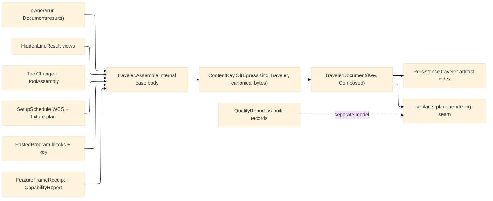

# [RASM_FABRICATION_TRAVELER]

The traveler owner is the terminal forward shop-document model for `Run(Document{results})`: it assembles completed fabrication evidence into canonical section rows, keys the document with `ContentKey.Of(EgressKind.Traveler, bytes)`, and returns only `FabricationResult.TravelerDocument(ContentKey Key, Seq<ContentKey> Composed)`. The composer is the widest fan-in node in the folder, so every upstream owner that contributes to shop execution exposes a typed receipt before it enters this model; projection views, magazine tool lists, setup plans, program facts, tolerance frames, and capability rows are carried forward as typed rows, never re-derived from raw geometry, raw program text, or plane-internal state.

The traveler is forward execution truth. `QualityReport` owns as-built quality records and sealed inspection evidence; `TravelerDocument` owns the pre-work and in-work shop packet. Rendering, annotation, sheets, PDFs, and artifact layouts ride the artifacts-plane seam after this page emits the keyed document model; Persistence owns the `traveler` artifact-index enrollment row and reads only the content key spine.

## [01]-[INDEX]

- [01]-[TRAVELER_DOCUMENT]: owns `TravelerSectionKind`, the seven typed section row families, `TravelerReceiptCorpus`, `TravelerDocumentBody`, `TravelerDocumentModel`, and the internal `Traveler.Assemble` case body for `Run(Document{Seq<FabricationResult>})`.

## [02]-[TRAVELER_DOCUMENT]

- Owner: `TravelerSectionKind` closes the seven-section vocabulary; `TravelerHeaderRow`, `TravelerOperationRow`, `TravelerToolRow`, `TravelerProgramRow`, `TravelerSpecRow`, `TravelerViewRow`, and `TravelerRecordRow` carry the typed document rows; `TravelerReceiptCorpus` is the fan-in pack (its `Records` lane carries the report page's `SealedRecord` receipts — the typed as-built fan-in); `TravelerDocumentBody` is the canonical byte source; `TravelerDocumentModel` is the keyed receipt.
- Cases: `TravelerSectionKind` rows 7 - `header`, `operation`, `tool`, `program`, `spec`, `view`, `record`; `TravelerSection` union cases 7, one per row family; `Traveler.Assemble` remains an internal case body invoked by owner#run and never a second public fold.
- Entry: owner#run dispatches `Document(Seq<FabricationResult> Results)` into `internal static Fin<FabricationResult> Traveler.Assemble(FabricationPolicy.Document policy, FabricationInput input, TravelerReceiptCorpus corpus, Instant stampedAt)`; the outer public entry remains `Fabrication.Run`.
- Auto: `Assemble` builds `TravelerDocumentBody` from result cases and `TravelerReceiptCorpus`, orders sections by `TravelerSectionKind.Order`, writes DECLARATION-COMPLETE canonical bytes (every section row payload plus the full `Composed` key spine — nested receipt rows fold through record hashes per the program.md canonical precedent, never count-only summaries), mints `ContentKey.Of(EgressKind.Traveler, bytes)`, and returns `TravelerDocument(Key, Composed)`. Program, view, operation, tool, and spec rows read only the typed receipts named in Packages.
- Receipt: `TravelerDocument(ContentKey Key, Seq<ContentKey> Composed)` is the only owner#atoms result case. `Composed` is the provenance spine over every upstream content key in the completed result set: placement, additive artifacts, verification residual and setup snapshots, posted programs, plan artifacts, formed outputs, sealed quality-record keys from the corpus `Records` lane, and — for a prior traveler — the prior DOCUMENT key plus its composed spine.
- Packages: owner#atoms (`EgressKind.Traveler`, `ContentKey`, `FabricationPolicy.Document`, `FabricationResult`, `FabricationInput`, `PlannedStep`, `StockSnapshot`, `CapabilityVerdict`), `Documentation/projection` (`HiddenLineResult` via owner result), `Tooling/magazine` (`ToolChange`, `ToolAssembly`), `Fixturing/setups` (`SetupSchedule`, `WcsAssignment`, `WcsDatum`), `Spec/tolerance` (`FeatureFrameReceipt`), `Spec/capability` (`CapabilityReport`, `CapabilityRow`, `SpcLimitRow`), NodaTime (`Instant`, `InstantPattern.ExtendedIso`, `IClock.GetCurrentInstant` at owner#run boundary), Thinktecture.Runtime.Extensions, LanguageExt.Core, BCL inbox; cross-package: Persistence artifact index owns the `traveler` enrollment row.
- Growth: a new traveler section is one `TravelerSectionKind` row, one `TravelerSection` case, one row record, and one canonical writer arm; a new upstream receipt contributes through `TravelerReceiptCorpus`; a new output medium remains an artifacts-plane consumer; a new as-built record remains a `QualityReport` case.
- Boundary: Documentation has no local fault arms, and upstream owners validate their receipts before this terminal compose. Traveler mints no GD&T frames, no tool-life measurements, no WCS roster, no program AST, no setup graph, no quality-record CONTENT (sealed records enter as keys and typed receipts through the corpus lane), no sheet annotation, and no artifact layout. Missing typed receipt exposure is an upstream corpus defect, not a local reconstruction path; `ContentKey.Of` is the only key mint and raw hashing is outside the page.

```csharp signature
using System;
using System.Collections.Generic;
using System.Diagnostics;
using System.Linq;
using System.Text;
using LanguageExt;
using LanguageExt.Common;
using NodaTime;
using NodaTime.Text;
using Rasm.Fabrication.Fixturing;
using Rasm.Fabrication.Process;
using Rasm.Fabrication.Spec;
using Rasm.Fabrication.Tooling;
using Thinktecture;
using static LanguageExt.Prelude;

namespace Rasm.Fabrication.Documentation;

[SmartEnum<string>]
public sealed partial class TravelerSectionKind {
    public static readonly TravelerSectionKind Header = new("header", order: 0);
    public static readonly TravelerSectionKind Operation = new("operation", order: 1);
    public static readonly TravelerSectionKind Tool = new("tool", order: 2);
    public static readonly TravelerSectionKind Program = new("program", order: 3);
    public static readonly TravelerSectionKind Spec = new("spec", order: 4);
    public static readonly TravelerSectionKind View = new("view", order: 5);
    public static readonly TravelerSectionKind Record = new("record", order: 6);

    public int Order { get; }
}

public sealed record TravelerHeaderRow(
    ProcessKind Process,
    Machine Machine,
    ProjectionDir View,
    Seq<int> PartIds,
    Instant StampedAt);

public sealed record TravelerOperationRow(
    SetupSchedule Schedule,
    Seq<PlannedStep> Steps,
    Seq<StockSnapshot> Stock);

public sealed record TravelerToolRow(
    Seq<ToolChange> Changes,
    Seq<ToolAssembly> Assemblies);

public sealed record TravelerProgramRow(
    Option<PostDialect> Dialect,
    int BlockCount,
    ContentKey Key);

public sealed record TravelerSpecRow(
    Seq<FeatureFrameReceipt> Frames,
    Seq<CapabilityRow> Capability,
    Seq<SpcLimitRow> Limits,
    Option<CapabilityVerdict> Verdict);

public sealed record TravelerViewRow(
    Seq<Edge3> Visible,
    Seq<Edge3> Hidden,
    Seq<Edge3> Silhouette);

// The sealed quality-record fan-in lane: report.md's SealedRecord receipts enter the traveler HERE as a typed
// section, their content keys riding the Composed spine — as-built records are traveler-composed, never re-built.
public sealed record TravelerRecordRow(Seq<SealedRecord> Records);

[Union(ConversionFromValue = ConversionOperatorsGeneration.None)]
public abstract partial record TravelerSection {
    private TravelerSection() { }

    public abstract TravelerSectionKind Kind { get; }

    public sealed record Header(TravelerHeaderRow Row) : TravelerSection {
        public override TravelerSectionKind Kind => TravelerSectionKind.Header;
    }

    public sealed record Operation(TravelerOperationRow Row) : TravelerSection {
        public override TravelerSectionKind Kind => TravelerSectionKind.Operation;
    }

    public sealed record Tool(TravelerToolRow Row) : TravelerSection {
        public override TravelerSectionKind Kind => TravelerSectionKind.Tool;
    }

    public sealed record Program(TravelerProgramRow Row) : TravelerSection {
        public override TravelerSectionKind Kind => TravelerSectionKind.Program;
    }

    public sealed record Spec(TravelerSpecRow Row) : TravelerSection {
        public override TravelerSectionKind Kind => TravelerSectionKind.Spec;
    }

    public sealed record View(TravelerViewRow Row) : TravelerSection {
        public override TravelerSectionKind Kind => TravelerSectionKind.View;
    }

    public sealed record Record(TravelerRecordRow Row) : TravelerSection {
        public override TravelerSectionKind Kind => TravelerSectionKind.Record;
    }
}

public sealed record TravelerReceiptCorpus(
    Seq<ToolChange> ToolChanges,
    Seq<ToolAssembly> ToolAssemblies,
    Seq<SetupSchedule> Setups,
    Seq<FeatureFrameReceipt> Frames,
    Seq<CapabilityReport> Capabilities,
    Seq<SealedRecord> Records) {
    public static readonly TravelerReceiptCorpus Empty =
        new(Seq<ToolChange>(), Seq<ToolAssembly>(), Seq<SetupSchedule>(), Seq<FeatureFrameReceipt>(), Seq<CapabilityReport>(), Seq<SealedRecord>());
}

public sealed record TravelerDocumentBody(
    Instant StampedAt,
    Seq<TravelerSection> Sections,
    Seq<ContentKey> Composed) {
    public TravelerDocumentModel Seal() =>
        new(
            ContentKey.Of(EgressKind.Traveler, CanonicalBytes(this)),
            Composed,
            StampedAt,
            Sections);

    public static TravelerDocumentBody Of(
        Seq<FabricationResult> results,
        FabricationInput input,
        TravelerReceiptCorpus corpus,
        Instant stampedAt) {
        Seq<TravelerSection> sections =
            Seq<TravelerSection>(
                    new TravelerSection.Header(Header(results, input, stampedAt)),
                    Operation(corpus, results, input),
                    Tool(corpus))
                .Concat(Programs(results, input).Cast<TravelerSection>())
                .Concat(Specs(corpus, input).Cast<TravelerSection>())
                .Concat(Views(results).Cast<TravelerSection>())
                .Concat(Records(corpus).Cast<TravelerSection>())
                .OrderBy(static section => section.Kind.Order)
                .ToSeq();

        return new TravelerDocumentBody(stampedAt, sections, Composed(results, corpus));
    }

    static TravelerHeaderRow Header(Seq<FabricationResult> results, FabricationInput input, Instant stampedAt) =>
        new(input.Process, input.Machine, input.View, PartIds(results), stampedAt);

    static TravelerSection.Operation Operation(TravelerReceiptCorpus corpus, Seq<FabricationResult> results, FabricationInput input) =>
        new(new TravelerOperationRow(new SetupSchedule(
            corpus.Setups.Bind(static schedule => schedule.Setups).ToArr(),
            corpus.Setups.Bind(static schedule => schedule.Wcs),
            corpus.Setups.Bind(static schedule => schedule.Precedence)),
            PlanSteps(results),
            input.Snapshots));

    static TravelerSection.Tool Tool(TravelerReceiptCorpus corpus) =>
        new(new TravelerToolRow(corpus.ToolChanges, corpus.ToolAssemblies));

    static Seq<TravelerSection.Program> Programs(Seq<FabricationResult> results, FabricationInput input) =>
        results.Bind(result => result switch {
            FabricationResult.PostedProgram program => Seq(new TravelerSection.Program(new TravelerProgramRow(input.Dialect, program.Blocks.Count, program.Key))),
            _ => Seq<TravelerSection.Program>()
        });

    static Seq<TravelerSection.Spec> Specs(TravelerReceiptCorpus corpus, FabricationInput input) {
        if (!corpus.Capabilities.IsEmpty)
            return corpus.Capabilities
                .Map(report => new TravelerSection.Spec(new TravelerSpecRow(corpus.Frames, report.Rows, report.Limits, Some(report.Verdict))));

        return input.Capability.Match(
            Some: verdict => Seq(new TravelerSection.Spec(new TravelerSpecRow(corpus.Frames, Seq<CapabilityRow>(), Seq<SpcLimitRow>(), Some(verdict)))),
            None: () => corpus.Frames.IsEmpty
                ? Seq<TravelerSection.Spec>()
                : Seq(new TravelerSection.Spec(new TravelerSpecRow(corpus.Frames, Seq<CapabilityRow>(), Seq<SpcLimitRow>(), None)));
    }

    static Seq<TravelerSection.View> Views(Seq<FabricationResult> results) =>
        results.Bind(result => result switch {
            FabricationResult.HiddenLineResult view => Seq(new TravelerSection.View(new TravelerViewRow(view.Visible, view.Hidden, view.Silhouette))),
            _ => Seq<TravelerSection.View>()
        });

    static Seq<TravelerSection.Record> Records(TravelerReceiptCorpus corpus) =>
        corpus.Records.IsEmpty
            ? Seq<TravelerSection.Record>()
            : Seq(new TravelerSection.Record(new TravelerRecordRow(corpus.Records)));

    static Seq<int> PartIds(Seq<FabricationResult> results) =>
        results.Bind(result => result switch {
            FabricationResult.Placement placement => placement.Parts.Map(static part => part.PartId),
            _ => Seq<int>()
        }).Distinct().ToSeq();

    static Seq<PlannedStep> PlanSteps(Seq<FabricationResult> results) =>
        results.Bind(result => result switch {
            FabricationResult.FabricationPlan plan => plan.Steps,
            _ => Seq<PlannedStep>()
        });

    // A prior TravelerDocument contributes its OWN key plus its composed spine — document lineage never drops.
    static Seq<ContentKey> Composed(Seq<FabricationResult> results, TravelerReceiptCorpus corpus) =>
        results.Bind(result => result switch {
            FabricationResult.Placement placement => Seq(placement.Key),
            FabricationResult.AdditiveResult additive => additive.Artifacts,
            FabricationResult.VerificationResult verified => verified.Snapshots.Map(static snapshot => snapshot.Key).Add(verified.Residual.Key),
            FabricationResult.PostedProgram program => Seq(program.Key),
            FabricationResult.TravelerDocument traveler => Seq1(traveler.Key).Concat(traveler.Composed),
            FabricationResult.FabricationPlan plan => plan.Artifacts.Add(plan.Key),
            FabricationResult.FormedResult formed => Seq(formed.Key),
            _ => Seq<ContentKey>()
        })
            .Concat(corpus.Records.Map(static record => record.Key))
            .Distinct().ToSeq();

    // Canonical bytes are DECLARATION-COMPLETE (K9): every section row payload AND the full Composed key spine
    // contribute in stable declaration order — nested receipt rows fold through their compiler-generated record
    // hashes (the program.md canonical precedent), scalar/key columns write explicitly under the invariant culture,
    // so two documents differing in any row payload or composed key digest apart.
    static byte[] CanonicalBytes(TravelerDocumentBody body) =>
        Encoding.UTF8.GetBytes(string.Join(
            "\n",
            body.Sections.Map(SectionLine)
                .Prepend(InstantPattern.ExtendedIso.Format(body.StampedAt))
                .Concat(body.Composed.Map(static key => $"composed|{key.Digest}"))));

    static string SectionLine(TravelerSection section) =>
        section switch {
            TravelerSection.Header header =>
                $"header|{header.Row.Process.Key}|{header.Row.Machine.Key}|{header.Row.View.GetHashCode():x8}|parts:{string.Join(',', header.Row.PartIds)}|{InstantPattern.ExtendedIso.Format(header.Row.StampedAt)}",
            TravelerSection.Operation operation =>
                $"operation|setups:{string.Join(',', operation.Row.Schedule.Setups.Map(static s => $"{s.GetHashCode():x8}"))}"
                + $"|wcs:{string.Join(',', operation.Row.Schedule.Wcs.Map(static w => $"{w.GetHashCode():x8}"))}"
                + $"|steps:{string.Join(',', operation.Row.Steps.Map(static s => $"{s.GetHashCode():x8}"))}"
                + $"|stock:{string.Join(',', operation.Row.Stock.Map(static s => s.Key.Digest))}",
            TravelerSection.Tool tool =>
                $"tool|changes:{string.Join(',', tool.Row.Changes.Map(static c => $"{c.GetHashCode():x8}"))}"
                + $"|assemblies:{string.Join(',', tool.Row.Assemblies.Map(static a => $"{a.GetHashCode():x8}"))}",
            TravelerSection.Program program =>
                $"program|{program.Row.Dialect.Map(static d => d.Key).IfNone("-")}|blocks:{program.Row.BlockCount}|key:{program.Row.Key.Digest}",
            TravelerSection.Spec spec =>
                $"spec|frames:{string.Join(',', spec.Row.Frames.Map(static f => $"{f.GetHashCode():x8}"))}"
                + $"|capability:{string.Join(',', spec.Row.Capability.Map(static c => $"{c.GetHashCode():x8}"))}"
                + $"|limits:{string.Join(',', spec.Row.Limits.Map(static l => $"{l.GetHashCode():x8}"))}"
                + $"|verdict:{spec.Row.Verdict.Map(static v => string.Create(System.Globalization.CultureInfo.InvariantCulture, $"{v.Pass}:{v.Cpk:R}:{v.DemandedItGrade}")).IfNone("-")}",
            TravelerSection.View view =>
                $"view|visible:{string.Join(',', view.Row.Visible.Map(static e => $"{e.GetHashCode():x8}"))}"
                + $"|hidden:{string.Join(',', view.Row.Hidden.Map(static e => $"{e.GetHashCode():x8}"))}"
                + $"|silhouette:{string.Join(',', view.Row.Silhouette.Map(static e => $"{e.GetHashCode():x8}"))}",
            TravelerSection.Record record =>
                $"record|{string.Join(',', record.Row.Records.Map(static r => r.Key.Digest))}",
            _ => throw new UnreachableException("traveler-section")
        };
}

public sealed record TravelerDocumentModel(
    ContentKey Key,
    Seq<ContentKey> Composed,
    Instant StampedAt,
    Seq<TravelerSection> Sections) {
    public FabricationResult ToResult() =>
        new FabricationResult.TravelerDocument(Key, Composed);
}

internal static class Traveler {
    // The owner#run Document arm: results-only compose at the boundary clock; a receipt-enriched corpus
    // threads the 4-arg form — one fold, never a second public entry.
    public static Fin<FabricationResult> Assemble(FabricationPolicy.Document policy, FabricationInput input) =>
        Assemble(policy, input, TravelerReceiptCorpus.Empty, SystemClock.Instance.GetCurrentInstant());

    public static Fin<FabricationResult> Assemble(
        FabricationPolicy.Document policy,
        FabricationInput input,
        TravelerReceiptCorpus corpus,
        Instant stampedAt) =>
        Fin.Succ(TravelerDocumentBody.Of(policy.Results, input, corpus, stampedAt).Seal().ToResult());
}
```


