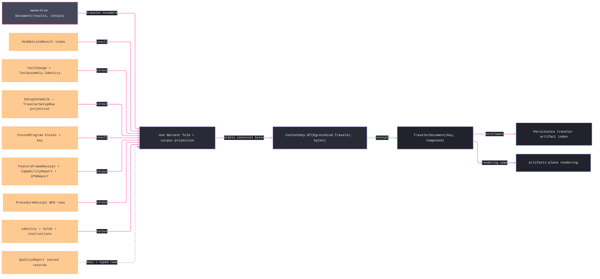

# [RASM_FABRICATION_TRAVELER]

The traveler owner is the terminal forward shop-document model for `Run(Document{results, corpus})`: it assembles completed fabrication evidence into canonical section rows, keys the document with `ContentKey.Of(EgressKind.Traveler, bytes)`, and returns only `FabricationResult.TravelerDocument(ContentKey Key, Seq<ContentKey> Composed)`. The composer is the widest fan-in node in the folder, so every upstream owner that contributes to shop execution exposes a typed receipt before it enters this model; projection views, magazine tool lists, setup plans, program facts, tolerance frames, capability rows, DfM reports, and WPS qualification receipts are carried forward as typed rows, never re-derived from raw geometry, raw program text, or plane-internal state. The traveler carries the shop-floor half beside the engineering half: work-order identity (order, part, revision, quantity, heat lot, serials), per-operation hold points naming the buy-off authority, and work instructions — the accountability axes a traveler exists to be audited FOR.

The traveler is forward execution truth. `QualityReport` owns as-built quality records and sealed inspection evidence; `TravelerDocument` owns the pre-work and in-work shop packet. Rendering, annotation, sheets, PDFs, and artifact layouts ride the artifacts-plane seam after this page emits the keyed document model; Persistence owns the `traveler` artifact-index enrollment row and reads only the content key spine.

## [01]-[INDEX]

- [01]-[TRAVELER_DOCUMENT]: owns the nine-case `TravelerSection` union with case-owned order, the typed section row families, `TravelerReceiptCorpus`, the one-pass result harvest, `TravelerDocumentBody` with its stable canonical writer, `TravelerDocumentModel`, and the internal `Traveler.Assemble` case body for `Run(Document{Results, Corpus})`.

## [02]-[TRAVELER_DOCUMENT]

- Owner: `TravelerSection` closes section identity and order on one nine-case union; its row records carry header, identity, operation, tool, program, specification, procedure, view, and quality-record data. `TravelerReceiptCorpus` is the fan-in pack, `TravelerDocumentBody` is the canonical byte source, and `TravelerDocumentModel` is the keyed rendering receipt.
- Cases: `TravelerSection` cases 9 — `Header`, `Identity`, `Operation`, `Tool`, `Program`, `Spec`, `Procedure`, `View`, and `Record` — each carries its order directly. The canonical writer and result harvest are generated total switches; a new case breaks the build until its projection lands.
- Entry: owner#run dispatches `Document(Seq<FabricationResult> Results, TravelerReceiptCorpus Corpus)` into `internal static Fin<FabricationResult> Traveler.Assemble(FabricationPolicy.Document policy, FabricationInput input)`; the boundary arm stamps the clock and threads `policy.Corpus`, the `Instant` overload serves deterministic re-mint, and the outer public entry remains `Fabrication.Run`. Every corpus lane is therefore reachable through `Run(Document)`; `TravelerReceiptCorpus.Empty` is the caller's explicit no-receipts choice, never a forced boundary constant.
- Auto: `Assemble` folds the result set once through `FabricationResult.Switch`, validates shop identity/hold/instruction rows, projects corpus receipts to document altitude, admits and transitively reduces setup precedence through QuikGraph, records source-first operation order, and orders sections by case order plus canonical row content. `TravelerSetupRow.Datum` is the sole WCS binding; no parallel `WcsAssignment` copy survives. Canonical bytes spell every field under invariant culture with netstring-framed text, explicit smart-enum keys, `R` scalars, ISO instants, and content-key digests before `ContentKey.Of(EgressKind.Traveler, bytes)` mints the document identity.
- Receipt: `TravelerDocument(ContentKey Key, Seq<ContentKey> Composed)` is the only owner#atoms result case. `Composed` is the provenance spine over every upstream content key in the completed result set: placement, additive artifacts, verification residual and setup snapshots, posted programs, plan artifacts, formed outputs, sealed quality-record keys from the corpus `Records` lane, and — for a prior traveler — the prior DOCUMENT key plus its composed spine.
- Packages: owner#atoms (`EgressKind.Traveler`, `ContentKey`, `FabricationPolicy.Document`, `FabricationResult`, `FabricationInput`, `PlannedStep`, `StockSnapshot`, `CapabilityVerdict`, `ProjectionDir`, `Edge3`), `Documentation/projection`, `Tooling/magazine`, `Fixturing/setups` (`SetupSchedule`, `Setup`, `WcsDatum`, `WcsSlot`), `Posting/dialect` (`PostDialect`), `Spec/tolerance`, `Spec/capability`, `Spec/manufacturability`, `Joining/procedure`, `Rasm.Domain` (`Op` — the admission channel), QuikGraph (`BidirectionalGraph`, `IsDirectedAcyclicGraph`, `ComputeTransitiveReduction`, `SourceFirstTopologicalSort`), NodaTime (`Instant`, `InstantPattern.ExtendedIso`, `SystemClock.Instance.GetCurrentInstant` at the owner-run boundary), Thinktecture.Runtime.Extensions, LanguageExt.Core, BCL inbox (`CultureInfo`); Persistence owns artifact-index enrollment.
- Growth: a new traveler section is one `TravelerSection` case with its order, one row record, and one writer arm; a new upstream receipt contributes through `TravelerReceiptCorpus`; a new result contribution is one harvest arm; output media remain artifacts-plane consumers.
- Boundary: Documentation has no local fault arms, and upstream owners validate their receipts before this terminal compose. Traveler mints no GD&T frames, no tool-life measurements, no WCS roster, no program AST, no setup graph (the operation section carries the datum/reach PROJECTION of the schedule, never a re-minted `SetupSchedule`), no quality-record CONTENT (sealed records enter as keys and typed receipts through the corpus lane), no sheet annotation, and no artifact layout. Missing typed receipt exposure is an upstream corpus defect, not a local reconstruction path; `ContentKey.Of` is the only key mint, raw hashing is outside the page, and a `GetHashCode` fold in the canonical writer is the named process-randomization defect. `PostedProgram` carries no dialect column, so the program row stamps the ONE `input.Dialect` — the per-program dialect column is an owner#atoms widening, recorded there.

```csharp signature
// --- [RUNTIME_PRELUDE] ----------------------------------------------------------------------------------------------------------------------------
using System.Globalization;
using System.Text;
using LanguageExt;
using NodaTime;
using NodaTime.Text;
using QuikGraph;
using QuikGraph.Algorithms;
using Rasm.Domain;
using Rasm.Fabrication.Fixturing;
using Rasm.Fabrication.Joining;
using Rasm.Fabrication.Posting;
using Rasm.Fabrication.Process;
using Rasm.Fabrication.Spec;
using Rasm.Fabrication.Tooling;
using Rhino.Geometry;
using Thinktecture;
using static LanguageExt.Prelude;

namespace Rasm.Fabrication.Documentation;

// --- [MODELS] -------------------------------------------------------------------------------------------------------------------------------------
public sealed record TravelerHeaderRow(
    ProcessKind Process,
    Machine Machine,
    ProjectionDir View,
    Seq<int> PartIds,
    Instant StampedAt);

// The accountability identity: which lot of which material becomes which serialized parts under which work order.
public sealed record TravelerIdentityRow(
    string WorkOrder,
    string Part,
    string Revision,
    int Quantity,
    Option<string> HeatLot,
    Seq<string> Serials);

// Document-altitude setup projection: datum lineage, WCS binding, reach facts, clamp count — never fixture geometry.
public sealed record TravelerSetupRow(WcsDatum Datum, Arr<int> ReachableOps, int Clamps);

// A hold point: work stops after the named step until the named authority buys off.
public sealed record TravelerHold(int AfterStep, string Authority);

public sealed record TravelerOperationRow(
    Seq<TravelerSetupRow> Setups,
    Seq<(int Before, int After)> Precedence,
    Seq<int> OperationOrder,
    Seq<PlannedStep> Steps,
    Seq<StockSnapshot> Stock,
    Seq<TravelerHold> Holds,
    Seq<string> Instructions);

// Assemblies ride as their ContentHash.Of identities — the magazine owns the assembly interior.
public sealed record TravelerToolRow(Seq<ToolChange> Changes, Seq<UInt128> Assemblies);

public sealed record TravelerProgramRow(
    Option<PostDialect> Dialect,
    int BlockCount,
    ContentKey Key);

public sealed record TravelerSpecRow(
    Seq<FeatureFrameReceipt> Frames,
    Seq<CapabilityRow> Capability,
    Seq<CapabilityInterval> Intervals,
    Seq<SpcLimitRow> Limits,
    Seq<SpcViolation> Violations,
    Option<CapabilityDistribution> Distribution,
    Option<CapabilityDependence> Dependence,
    Option<DriftRow> Drift,
    Option<StackupReceipt> Stackup,
    Option<bool> ProcedureQualified,
    Option<CapabilityVerdict> Verdict,
    Seq<DfmReport> Dfm);

// The WPS-per-joint fan-in Joining/procedure declares: the traveler renders the qualification receipt rows.
public sealed record TravelerProcedureRow(Seq<ProcedureReceipt> Procedures);

public sealed record TravelerViewRow(
    Seq<Edge3> Visible,
    Seq<Edge3> Hidden,
    Seq<Edge3> Silhouette);

// The sealed quality-record fan-in lane: report.md's SealedRecord receipts enter the traveler HERE as a typed
// section, their content keys riding the Composed spine — as-built records are traveler-composed, never re-built.
public sealed record TravelerRecordRow(Seq<SealedRecord> Records);

[Union(ConversionFromValue = ConversionOperatorsGeneration.None)]
public abstract partial record TravelerSection {
    private TravelerSection() { }

    public abstract int Order { get; }

    public sealed record Header(TravelerHeaderRow Row) : TravelerSection {
        public override int Order => 0;
    }

    public sealed record Identity(TravelerIdentityRow Row) : TravelerSection {
        public override int Order => 1;
    }

    public sealed record Operation(TravelerOperationRow Row) : TravelerSection {
        public override int Order => 2;
    }

    public sealed record Tool(TravelerToolRow Row) : TravelerSection {
        public override int Order => 3;
    }

    public sealed record Program(TravelerProgramRow Row) : TravelerSection {
        public override int Order => 4;
    }

    public sealed record Spec(TravelerSpecRow Row) : TravelerSection {
        public override int Order => 5;
    }

    public sealed record Procedure(TravelerProcedureRow Row) : TravelerSection {
        public override int Order => 6;
    }

    public sealed record View(TravelerViewRow Row) : TravelerSection {
        public override int Order => 7;
    }

    public sealed record Record(TravelerRecordRow Row) : TravelerSection {
        public override int Order => 8;
    }
}

public sealed record TravelerReceiptCorpus(
    Seq<ToolChange> ToolChanges,
    Seq<ToolAssembly> ToolAssemblies,
    Seq<SetupSchedule> Setups,
    Seq<FeatureFrameReceipt> Frames,
    Seq<CapabilityReport> Capabilities,
    Seq<DfmReport> Dfm,
    Seq<ProcedureReceipt> Procedures,
    Seq<SealedRecord> Records,
    Option<TravelerIdentityRow> Identity,
    Seq<TravelerHold> Holds,
    Seq<string> Instructions) {
    public static readonly TravelerReceiptCorpus Empty = new(
        Seq<ToolChange>(), Seq<ToolAssembly>(), Seq<SetupSchedule>(), Seq<FeatureFrameReceipt>(), Seq<CapabilityReport>(),
        Seq<DfmReport>(), Seq<ProcedureReceipt>(), Seq<SealedRecord>(), Option<TravelerIdentityRow>.None, Seq<TravelerHold>(), Seq<string>());
}

public sealed record TravelerDocumentBody(
    Instant StampedAt,
    Seq<TravelerSection> Sections,
    Seq<ContentKey> Composed) {
    sealed record Harvest(Seq<TravelerSection> Programs, Seq<TravelerSection> Views, Seq<int> Parts, Seq<PlannedStep> Steps, Seq<ContentKey> Composed) {
        public static readonly Harvest Empty = new(Seq<TravelerSection>(), Seq<TravelerSection>(), Seq<int>(), Seq<PlannedStep>(), Seq<ContentKey>());
    }

    public TravelerDocumentModel Seal() =>
        new(
            ContentKey.Of(EgressKind.Traveler, CanonicalBytes(this)),
            Composed,
            StampedAt,
            Sections);

    public static Fin<TravelerDocumentBody> Of(
        Seq<FabricationResult> results,
        FabricationInput input,
        TravelerReceiptCorpus corpus,
        Instant stampedAt) {
        Harvest harvest = results.Fold(Harvest.Empty, (h, result) => Gather(h, result, input.Dialect));
        return from _ in Admit(corpus, harvest)
               from operation in Operation(corpus, harvest, input)
               let composed = (harvest.Composed + corpus.Records.Map(static r => r.Key))
                   .Distinct()
                   .OrderBy(static key => key.Kind.Key)
                   .ThenBy(static key => key.Digest)
                   .ToSeq()
               let sections =
            (Seq<TravelerSection>(
                new TravelerSection.Header(new TravelerHeaderRow(input.Process, input.Machine, input.View, harvest.Parts.Distinct().OrderBy(static id => id).ToSeq(), stampedAt)),
                new TravelerSection.Operation(operation),
                new TravelerSection.Tool(new TravelerToolRow(corpus.ToolChanges, corpus.ToolAssemblies.Map(static a => a.Identity))))
            + corpus.Identity.Map(static row => (TravelerSection)new TravelerSection.Identity(row)).ToSeq()
            + harvest.Programs
            + Specs(corpus, input)
            + (corpus.Procedures.IsEmpty ? Seq<TravelerSection>() : Seq1((TravelerSection)new TravelerSection.Procedure(new TravelerProcedureRow(corpus.Procedures))))
            + harvest.Views
            + (corpus.Records.IsEmpty ? Seq<TravelerSection>() : Seq1((TravelerSection)new TravelerSection.Record(new TravelerRecordRow(corpus.Records)))))
            .OrderBy(static section => section.Order)
            .ThenBy(SectionLine)
            .ToSeq()
               select new TravelerDocumentBody(stampedAt, sections, composed);
    }

    static readonly Op TravelerOp = Op.Of(name: "fabrication:traveler");

    // Corpus admission rides the Op channel — Documentation mints no local fault arms and no bare Error strings.
    static Fin<Unit> Admit(TravelerReceiptCorpus corpus, Harvest harvest) =>
        Seq(
            guard(corpus.Identity.ForAll(static row =>
                !string.IsNullOrWhiteSpace(row.WorkOrder)
                && !string.IsNullOrWhiteSpace(row.Part)
                && !string.IsNullOrWhiteSpace(row.Revision)
                && row.Quantity > 0
                && row.HeatLot.ForAll(static value => !string.IsNullOrWhiteSpace(value))
                && row.Serials.ForAll(static value => !string.IsNullOrWhiteSpace(value))
                && row.Serials.Distinct().Count() == row.Serials.Count
                && (row.Serials.IsEmpty || row.Serials.Count == row.Quantity)),
                TravelerOp.InvalidInput()).ToValidation(),
            guard(corpus.Holds.Map(static hold => hold.AfterStep).Distinct().Count() == corpus.Holds.Count
                && corpus.Holds.ForAll(hold =>
                    !string.IsNullOrWhiteSpace(hold.Authority)
                    && harvest.Steps.Exists(step => step.Order == hold.AfterStep)),
                TravelerOp.InvalidInput()).ToValidation(),
            guard(corpus.Instructions.ForAll(static instruction => !string.IsNullOrWhiteSpace(instruction)),
                TravelerOp.InvalidInput()).ToValidation())
            .Traverse(static validation => validation)
            .As()
            .ToFin();

    static Harvest Gather(Harvest h, FabricationResult result, Option<PostDialect> dialect) =>
        result.Switch(
            hiddenLineResult: view => h with { Views = h.Views.Add(new TravelerSection.View(new TravelerViewRow(view.Visible, view.Hidden, view.Silhouette))) },
            motion: _ => h,
            placement: placement => h with { Parts = h.Parts + placement.Parts.Map(static p => p.PartId), Composed = h.Composed.Add(placement.Key) },
            additiveResult: additive => h with { Composed = h.Composed + additive.Artifacts },
            verificationResult: verified => h with { Composed = h.Composed + verified.Snapshots.Map(static s => s.Key) + Seq1(verified.Residual.Key) },
            inspectionResult: _ => h,
            postedProgram: program => h with {
                Programs = h.Programs.Add(new TravelerSection.Program(new TravelerProgramRow(dialect, program.Blocks.Count, program.Key))),
                Composed = h.Composed.Add(program.Key),
            },
            // A prior TravelerDocument contributes its OWN key plus its composed spine — document lineage never drops.
            travelerDocument: prior => h with { Composed = (h.Composed + Seq1(prior.Key)) + prior.Composed },
            fabricationPlan: plan => h with { Steps = h.Steps + plan.Steps, Composed = h.Composed + plan.Artifacts.Add(plan.Key) },
            formedResult: formed => h with { Composed = h.Composed.Add(formed.Key) });

    // The schedule PROJECTS to document altitude — datum, reach, clamp count — never a re-minted SetupSchedule.
    static Fin<TravelerOperationRow> Operation(TravelerReceiptCorpus corpus, Harvest harvest, FabricationInput input) =>
        Topology(
            corpus.Setups.Bind(static schedule => schedule.Setups.ToSeq().Bind(static setup => setup.ReachableOps.ToSeq()))
                + harvest.Steps.Bind(static step => step.Operations.ToSeq()),
            corpus.Setups.Bind(static schedule => schedule.Precedence)).Map(topology => new TravelerOperationRow(
            corpus.Setups.Bind(static schedule => schedule.Setups.ToSeq().Map(static s => new TravelerSetupRow(s.Datum, s.ReachableOps, s.Fixture.Clamps.Count))),
            topology.Precedence,
            topology.Order,
            harvest.Steps,
            input.Snapshots,
            corpus.Holds,
            corpus.Instructions));

    static Fin<(Seq<(int Before, int After)> Precedence, Seq<int> Order)> Topology(
        Seq<int> operations,
        Seq<(int Before, int After)> precedence) {
        BidirectionalGraph<int, SEquatableEdge<int>> seed = new(allowParallelEdges: false);
        seed.AddVertexRange(operations.Distinct());
        BidirectionalGraph<int, SEquatableEdge<int>> graph = precedence.Distinct().Fold(
            seed,
            static (current, row) => {
                current.AddVerticesAndEdge(new SEquatableEdge<int>(row.Before, row.After));
                return current;
            });
        if (!graph.IsDirectedAcyclicGraph())
            return Fin.Fail<(Seq<(int Before, int After)>, Seq<int>)>(TravelerOp.InvalidInput());
        BidirectionalGraph<int, SEquatableEdge<int>> reduced = graph.ComputeTransitiveReduction();
        Seq<(int Before, int After)> edges = reduced.Edges
            .OrderBy(static edge => edge.Source)
            .ThenBy(static edge => edge.Target)
            .Map(static edge => (edge.Source, edge.Target))
            .ToSeq();
        return Fin.Succ((edges, reduced.SourceFirstTopologicalSort().ToSeq()));
    }

    static Seq<TravelerSection> Specs(TravelerReceiptCorpus corpus, FabricationInput input) =>
        !corpus.Capabilities.IsEmpty
            ? corpus.Capabilities
                .Map(report => (TravelerSection)new TravelerSection.Spec(new TravelerSpecRow(
                    corpus.Frames, report.Rows, report.Intervals, report.Limits, report.Violations, Some(report.Distribution), Some(report.Dependence), Some(report.Drift), Some(report.Stackup), Some(report.ProcedureQualified), Some(report.Verdict), corpus.Dfm)))
            : input.Capability.Match(
                Some: verdict => Seq1((TravelerSection)new TravelerSection.Spec(new TravelerSpecRow(
                    corpus.Frames, Seq<CapabilityRow>(), Seq<CapabilityInterval>(), Seq<SpcLimitRow>(), Seq<SpcViolation>(), None, None, None, None, None, Some(verdict), corpus.Dfm))),
                None: () => corpus.Frames.IsEmpty && corpus.Dfm.IsEmpty
                    ? Seq<TravelerSection>()
                    : Seq1((TravelerSection)new TravelerSection.Spec(new TravelerSpecRow(
                        corpus.Frames, Seq<CapabilityRow>(), Seq<CapabilityInterval>(), Seq<SpcLimitRow>(), Seq<SpcViolation>(), None, None, None, None, None, None, corpus.Dfm))));

    // --- [BOUNDARIES] -------------------------------------------------------------------------------------------------------------------------------
    // STABLE canonical bytes (K9): every carried field of every section row contributes explicitly — invariant-culture
    // R-format scalars, smart-enum keys, ISO instants, content-key digests, netstring-framed free text (injective
    // against delimiter collision), typed locus writers through the generated union dispatch. GetHashCode never
    // reaches the byte source: record hash codes are process-randomized and the content key IS the document identity.
    static byte[] CanonicalBytes(TravelerDocumentBody body) =>
        Encoding.UTF8.GetBytes(string.Join(
            "\n",
            body.Sections.Map(SectionLine)
                .Prepend(InstantPattern.ExtendedIso.Format(body.StampedAt))
                .Concat(body.Composed.Map(static key => $"composed|{K(key)}"))));

    // The generated TOTAL Switch: a tenth section case fails the build here until its writer arm lands.
    static string SectionLine(TravelerSection section) =>
        section.Switch(
            header: static h =>
                $"header|{h.Row.Process.Key}|{h.Row.Machine.Key}|view:{V(h.Row.View.Forward)};{V(h.Row.View.ScreenU)};{V(h.Row.View.ScreenV)}"
                + $"|parts:{string.Join(',', h.Row.PartIds)}|{InstantPattern.ExtendedIso.Format(h.Row.StampedAt)}",
            identity: static i =>
                $"identity|{S(i.Row.WorkOrder)}|{S(i.Row.Part)}|{S(i.Row.Revision)}|{i.Row.Quantity}"
                + $"|lot:{i.Row.HeatLot.Map(S).IfNone("-")}|serials:{string.Join(',', i.Row.Serials.Map(S))}",
            operation: static o =>
                $"operation|setups:{string.Join(',', o.Row.Setups.Map(static s => $"{s.Datum.Setup}:{s.Datum.Slot.Family.Key}{s.Datum.Slot.Ordinal}:{s.Datum.AnchorOperation}:l[{string.Join(';', s.Datum.Lineage)}]:r[{string.Join(';', s.ReachableOps)}]:c{s.Clamps}"))}"
                + $"|prec:{string.Join(',', o.Row.Precedence.Map(static p => $"{p.Before}>{p.After}"))}"
                + $"|order:{string.Join(',', o.Row.OperationOrder)}"
                + $"|steps:{string.Join(',', o.Row.Steps.Map(static s => $"{s.Order}:{s.Process.Key}:{s.Machine.Key}:{s.Setup}:{s.Program.Map(K).IfNone("-")}"))}"
                + $"|stock:{string.Join(',', o.Row.Stock.Map(static s => K(s.Key)))}"
                + $"|holds:{string.Join(',', o.Row.Holds.Map(static x => $"{x.AfterStep}:{S(x.Authority)}"))}"
                + $"|inst:{string.Join(',', o.Row.Instructions.Map(S))}",
            tool: static t =>
                $"tool|changes:{string.Join(',', t.Row.Changes.Map(static c => $"{c.Slot.Kind}.{c.Slot.Pot}:{c.ProgramTool}:{N(c.LengthOffset)}:{N(c.Retract)}:{c.MidJob}:{c.ManualConfirm}"))}"
                + $"|assemblies:{string.Join(',', t.Row.Assemblies.Map(static a => $"{a:x32}"))}",
            program: static p =>
                $"program|{p.Row.Dialect.Map(static d => d.Key).IfNone("-")}|blocks:{p.Row.BlockCount}|key:{K(p.Row.Key)}",
            spec: static s =>
                $"spec|frames:{string.Join(',', s.Row.Frames.Map(FrameLine))}"
                + $"|capability:{string.Join(',', s.Row.Capability.Map(static c => $"{c.Metric.Key}:{N(c.Value)}:{N(c.Demanded)}:{c.Pass}"))}"
                + $"|intervals:{string.Join(',', s.Row.Intervals.Map(static i => $"{i.Metric.Key}:{N(i.Lower)}:{N(i.Upper)}:{N(i.Confidence)}"))}"
                + $"|limits:{string.Join(',', s.Row.Limits.Map(static l => $"{l.Chart.Key}:{InstantPattern.ExtendedIso.Format(l.At)}:{N(l.Center)}:{N(l.Lower)}:{N(l.Upper)}:{l.Violations}"))}"
                + $"|rules:{string.Join(',', s.Row.Violations.Map(static v => $"{v.Rule.Key}:{v.StartSubgroup}:{v.EndSubgroup}:{N(v.FurthestSigma)}"))}"
                + $"|distribution:{s.Row.Distribution.Map(DistributionLine).IfNone("-")}"
                + $"|dependence:{s.Row.Dependence.Map(static d => $"{N(d.LagOneCorrelation)}:{N(d.EffectiveSampleSize)}:{d.MeasurementSystemSuitable}").IfNone("-")}"
                + $"|drift:{s.Row.Drift.Map(static d => $"{N(d.Intercept)}:{N(d.Slope)}").IfNone("-")}"
                + $"|stack:{s.Row.Stackup.Map(StackupLine).IfNone("-")}"
                + $"|procedure-qualified:{s.Row.ProcedureQualified.Map(static value => value.ToString()).IfNone("-")}"
                + $"|verdict:{s.Row.Verdict.Map(static v => $"{v.Pass}:{N(v.Cpk)}:{N(v.DemandedCpk)}:{v.DemandedItGrade}").IfNone("-")}"
                + $"|dfm:{string.Join(',', s.Row.Dfm.Map(DfmLine))}",
            procedure: static q =>
                $"procedure|{string.Join(',', q.Row.Procedures.Map(static r => $"{S(r.WpsId)}:{r.Revision}:{S(r.PqrId)}:{r.Qualified}:{InstantPattern.ExtendedIso.Format(r.At)}:[{string.Join(';', r.Rows.Map(ComplianceLine))}]"))}",
            view: static v =>
                $"view|visible:{string.Join(',', v.Row.Visible.Map(E))}|hidden:{string.Join(',', v.Row.Hidden.Map(E))}|silhouette:{string.Join(',', v.Row.Silhouette.Map(E))}",
            record: static r =>
                $"record|{string.Join(',', r.Row.Records.OrderBy(static x => x.Key.Kind.Key).ThenBy(static x => x.Key.Digest).Map(static x =>
                    $"{K(x.Key)}:{x.Rows}:{x.Measured}:{x.Conforming}:{x.AcceptedNonconforming}:{x.Rejected}:{x.Incomplete}:{x.Contradictions}"))}");

    static string FrameLine(FeatureFrameReceipt f) =>
        $"{f.Qif.Key}:{f.Characteristic.Key}:{f.Kind.Key}:{N(f.WidthMm)}"
        + $":m[{string.Join(';', f.Modifiers.OrderBy(static m => m.Key).Map(static m => m.Key))}]"
        + $":d[{string.Join(';', f.Datums.OrderBy(static d => d.Precedence.Order).Map(static d => $"{S(d.Label)}:{d.Precedence.Key}:{d.Material.Key}"))}]:{f.Material.Key}"
        + $":projected:{Opt(f.ProjectedHeightMm)}:unequal:{Opt(f.UnequalOffsetMm)}"
        + $":basic[{string.Join(';', f.Extension.Basics.OrderBy(static b => b.Label).Map(static b => $"{S(b.Label)}:{N(b.NominalMm)}"))}]"
        + $":targets[{string.Join(';', f.Extension.Targets.OrderBy(static t => t.Label).Map(static t => $"{S(t.Label)}:{t.Kind.Key}:{P(t.Locus)}:{Opt(t.SizeMm)}"))}]"
        + $":composite:{f.Extension.Composite.Map(static c => $"{N(c.WidthMm)}:m[{string.Join(';', c.Modifiers.OrderBy(static m => m.Key).Map(static m => m.Key))}]:d[{string.Join(';', c.Datums.References.OrderBy(static d => d.Precedence.Order).Map(static d => $"{S(d.Label)}:{d.Precedence.Key}:{d.Material.Key}"))}]").IfNone("-")}";

    static string DfmLine(DfmReport report) =>
        $"{report.ComponentKey:x32}"
        + $":v[{string.Join(';', report.Verdicts.Map(static v => $"{v.Check.Key}:{v.Check.Measure.Key}:{v.Severity.Key}:{Locus(v.Locus)}:{N(v.Measured)}:{N(v.Bound)}"))}]"
        + $":r[{string.Join(';', report.Rows.Map(static r => $"{r.Process.Key}:{r.Viable}:b[{string.Join('/', r.Blockers.Map(static b => b.Key))}]:{r.Friction}"))}]"
        + $":{report.StackupPrecheck}";

    static string StackupLine(StackupReceipt receipt) =>
        $"{N(receipt.AccumulatedMm)}:{N(receipt.RssMm)}:{N(receipt.BoundMm)}:{receipt.RandomSeed}:{N(receipt.CommonCorrelation)}"
        + $":s[{string.Join(';', receipt.Sensitivities.Map(N))}]:{receipt.Pass}";

    static string DistributionLine(CapabilityDistribution distribution) =>
        distribution.Switch(
            normalFit: static normal => $"normal:{N(normal.Mu)}:{N(normal.StdDev)}:{N(normal.Error)}",
            logNormalFit: static logNormal => $"lognormal:{N(logNormal.Mu)}:{N(logNormal.StdDev)}:{N(logNormal.Error)}",
            gammaFit: static gamma => $"gamma:{N(gamma.Shape)}:{N(gamma.Rate)}:{N(gamma.Error)}",
            studentFit: static student => $"student-t:{N(student.Location)}:{N(student.Scale)}:{N(student.Freedom)}:{N(student.Error)}");

    // Typed locus and compliance writers ride the generated union dispatch — total, never a catch-all.
    static string Locus(DfmLocus locus) =>
        locus.Switch(
            atPoint: static p => $"p{P(p.Point)}",
            atEdge: static e => $"e{E(e.Edge)}",
            atFace: static f => $"f{f.Face}",
            atJoint: static j => $"j{j.Joint}",
            atProcess: static p => $"r{p.Process.Key}",
            global: static _ => "g");

    static string ComplianceLine(ComplianceRow row) =>
        row.Switch(
            numeric: static n => $"n{n.Joint}.{n.Ordinal}:{n.Variable.Key}:{N(n.Demanded)}:{N(n.QualifiedLow)}:{N(n.QualifiedHigh)}:{n.Pass}",
            categorical: static c => $"c{c.Joint}.{c.Ordinal}:{c.Variable.Key}:{S(c.Demanded)}:[{string.Join(';', c.Qualified.OrderBy(static value => value).Map(S))}]:{c.Pass}",
            boolean: static b => $"b{b.Joint}.{b.Ordinal}:{b.Variable.Key}:{b.Demanded}:{b.Qualified}:{b.Pass}",
            temporal: static t => $"t{t.Joint}.{t.Ordinal}:{t.Variable.Key}:{InstantPattern.ExtendedIso.Format(t.Demanded)}"
                + $":{InstantPattern.ExtendedIso.Format(t.Qualified.Start)}:{InstantPattern.ExtendedIso.Format(t.Qualified.End)}:{t.Pass}",
            applicability: static a => $"a{a.Joint}.{a.Ordinal}:{a.Variable.Key}:{a.Admitted}");

    static string S(string raw) => $"{raw.Length}:{raw}";
    static string N(double value) => value.ToString("R", CultureInfo.InvariantCulture);
    static string K(ContentKey key) => $"{key.Kind.Key}:{key.Digest:x32}";
    static string V(Vector3d v) => $"{N(v.X)},{N(v.Y)},{N(v.Z)}";
    static string P(Point3d p) => $"{N(p.X)},{N(p.Y)},{N(p.Z)}";
    static string E(Edge3 e) => $"{P(e.A)};{P(e.B)}";
}

public sealed record TravelerDocumentModel(
    ContentKey Key,
    Seq<ContentKey> Composed,
    Instant StampedAt,
    Seq<TravelerSection> Sections) {
    public FabricationResult ToResult() =>
        new FabricationResult.TravelerDocument(Key, Composed);
}

internal static class Traveler {
    // The owner#run Document arm: the policy case carries Results AND the receipt corpus, so every fan-in lane is
    // reachable through Fabrication.Run; the boundary arm stamps the clock, the Instant overload serves
    // deterministic re-mint — one fold, never a second public entry.
    public static Fin<FabricationResult> Assemble(FabricationPolicy.Document policy, FabricationInput input) =>
        Assemble(policy, input, SystemClock.Instance.GetCurrentInstant());

    public static Fin<FabricationResult> Assemble(FabricationPolicy.Document policy, FabricationInput input, Instant stampedAt) =>
        TravelerDocumentBody.Of(policy.Results, input, policy.Corpus, stampedAt)
            .Map(static body => body.Seal().ToResult());
}
```


