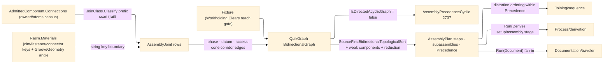

# [RASM_FABRICATION_ASSEMBLY]

The join-PRECEDENCE owner: `Assembly` the static surface folding an `AdmittedComponent`'s connection census into the typed partial order a build follows — `Assembly.Sequence(AdmittedComponent, AssemblyPolicy) → Fin<AssemblyPlan>`, the ONE entry. The joint census IS the owner#atoms `ComponentConnection` row set: each row's `RealizingKey` is a Materials designation whose PREFIX classifies the join (`joint.weld-`/`joint.stud-`/`joint.adhesive-`/`fastener.`/`connector.` — the `JoinClass` prefix table, a boundary scan, never a parallel joint model), and the rows BEHIND the key stay `Rasm.Materials`-owned: `GrooveGeometry` (the AWS A2.4 groove axis with `IncludedAngleDeg`), `GroovePrep`, the `WeldRow` static leg bounds `MinimumFilletLegMm`, and `ConnectorPlate` over `PlateStock` (all in `Rasm.Materials` `Component/joint.md` and `Component/connector.md` — member names, never line anchors, because cross-package line cites drift as Materials rebuilds) — this page carries the KEY plus ONE boundary-resolved column (a groove-welded joint tightens its access half-angle to half the resolved `GrooveGeometry.IncludedAngleDeg`), `Joining/weld` reads the deep rows. Precedence is a QuikGraph `BidirectionalGraph` over `(joint, phase)` nodes under three edge families: tack-before-final per `Tackable` joint (the `JoinPhase` expansion), datum-first from the policy's datum joints, and corridor occlusion — a joint sitting inside another's approach CONE forces the deep joint first, so access is a PRECEDENCE fact, not a runtime surprise; the corridor radius grows as `clearance + tan(halfAngle)·t` along the approach, so the census-resolved `AccessHalfAngleDeg` is a live geometric axis of the occlusion test, never a decorative column. The clamp window is the landed `Fixturing/workholding#WORKHOLDING` keep-out: a joint whose approach segment `Workholding.Clears(Edge3, Fixture)` rejects under the plan's holding routes `SetupInfeasible` 2717 (unreachable in this fixture), and a cyclic precedence (mutual occlusion, contradictory datums) routes `AssemblyPrecedenceCyclic` 2737 off the `IsDirectedAcyclicGraph` gate — the folder charter is keep-out + setup + assembly planning, three owners on one keep-out substrate.

The plan is the CONTRACT, not the schedule: `AssemblyPlan` carries the Kahn-ordered `JoinStep` rows, the weak-component subassembly partition, and the transitively-REDUCED cross-joint `Precedence` pairs — `Joining/sequence` permutes steps for distortion control ONLY where `Precedence` admits (backstep/skip/balanced ordering is that page's law; this page owns what MUST come before what, never how heat walks the seam). The joint identity space is ONE shared ordinal: `AssemblyJoint.Index` is the `ComponentConnection` census ordinal, and `Joining/weld`'s `WeldJoint.Joint` MUST equal it — the alignment contract that lets `sequence` join `plan.Passes` groups against `assembly.Steps` rows, stated here once. Setup-chain datum lineage across machining reorientations stays the `setups` scheduler's (`DatumLineageBroken` 2726 is its arm; assembly's cycle is 2737 — two lineage laws, two owners). Consumers: `Joining/sequence` (the plan + `JoinClass.Thermal` discriminant), `Process/derivation#FABRICATION_DERIVATION` (the setup/assembly stage of `Run(Derive)`), and the traveler compose (`Run(Document)` fan-in) — the plan's durable facts ride the `weld-plan` and `traveler` egress keys downstream, the plan record itself stays plane-local.

Wire posture: HOST-LOCAL. `AssemblyPlan` crosses only the in-process seam to the joining, derivation, and traveler folds; the census rows, the precedence graph, and the plan never sit between wire and rail.

## [01]-[INDEX]

- [01]-[ASSEMBLY]: owns the `JoinClass` prefix-classification table and `JoinPhase` vocabulary, the `AssemblyJoint` census row, the `AssemblyPolicy` carrier, the `JoinStep`/`AssemblyPlan` receipts, and the one `Assembly.Sequence` fold with its `Reaches` holding verdict — the join-precedence plane between the element ingress and the joining planes.

## [02]-[ASSEMBLY]

- Owner: `JoinClass` `[SmartEnum<string>]` the realizing-key prefix classification (`weld`/`stud`/`adhesive`/`bolt`/`connector`) carrying `KeyPrefix`, `Tackable` (the phase-expansion gate), `Reversible` (late-order admission), and `Thermal` (the distortion discriminant `Joining/sequence` reads); `JoinPhase` `[SmartEnum<string>]` (`tack`/`final`) the per-joint expansion vocabulary; `AssemblyJoint` the census row (index, the owner#atoms `ComponentConnection`, class, the XY-normal approach, the resolved access half-angle the corridor test reads); `AssemblyPolicy` the ONE policy carrier (tack expansion, access half-angle floor, standoff, corridor clearance, the optional holding `Fixture`, datum joints, the boundary-resolved per-key groove angles); `JoinStep` the ordered plan row; `AssemblyPlan` the receipt (steps + subassembly count + reduced precedence pairs); `Assembly` the static surface owning `Sequence` and `Reaches`.
- Cases: `JoinClass` rows 5 — `weld` {tackable, thermal} · `stud` {thermal} · `adhesive` {} · `bolt` {reversible} · `connector` {reversible}, each binding its Materials designation prefix; `JoinPhase` rows 2, a tackable joint expanding to `tack → final` under the policy gate, every other joint carrying `final` alone; the three precedence edge families — phase (`tack→final` per joint), datum (`datum.final → first(other)` per policy datum), corridor (`a.final → first(b)` where `b`'s joint midpoint lies within `a`'s access cone — radius `clearance + tan(halfAngle)·t` at parameter `t` along the standoff corridor); the subassembly partition is the weak-component fold over the precedence graph, parallel-buildable islands numbered by component.
- Entry: `public static Fin<AssemblyPlan> Sequence(AdmittedComponent component, AssemblyPolicy policy)` — the ONE fold: census → holding reach gate → graph assembly → acyclicity gate → Kahn order → partition → reduction; `public static bool Reaches(Fixture holding, AssemblyJoint joint, double standoffMm)` the total per-joint holding verdict composing `Workholding.Clears(Edge3, Fixture)` in the owner's declared argument order; `Fin<T>` routes `SetupInfeasible` 2717 (holding-blocked joint), `AssemblyPrecedenceCyclic` 2737 (cycle), and the kernel `GeometryFault.DegenerateInput` (an unclassifiable realizing key is degenerate input at the boundary, never a silent skip).
- Auto: the census traverses each `ComponentConnection` on the `Fin` rail — `JoinClass.Classify` prefix scan (an unclassifiable key rails, and the matched class binds, never a dead fallback), the approach as the left XY normal of the connection segment (a degenerate run falls to `ZAxis`), and the access half-angle — the policy floor, tightened to half the `GrooveGeometry.IncludedAngleDeg` where the policy's boundary-resolved groove map carries the joint's realizing key (the Materials row resolved ONCE at the boundary, the interior reading a raw double); `Sequence` gates every joint against the optional holding via `Reaches` BEFORE graph assembly, adds `(joint, phase)` vertices with the phase expansion, folds the three edge families, rejects a non-DAG at `IsDirectedAcyclicGraph`, orders by `SourceFirstBidirectionalTopologicalSort` (the catalogued bidirectional-graph Kahn member — sources first, deterministic), numbers subassemblies by `WeaklyConnectedComponents`, and projects the cross-joint `Precedence` pairs off `ComputeTransitiveReduction` so the joining plane re-orders against the MINIMAL constraint set; `Joining/sequence` reads `AssemblyPlan.Precedence` + `JoinClass.Thermal` for distortion ordering, `derivation` folds the plan into the `Run(Derive)` setup/assembly stage, the traveler composes the step rows.
- Receipt: `AssemblyPlan` IS the typed evidence — Kahn-ordered `JoinStep` rows, the subassembly count, and the reduced precedence pairs; no generic sequencing ledger, no per-class plan sibling, no schedule timestamps (scheduling is the joining and documentation planes' concern).
- Packages: QuikGraph (`BidirectionalGraph`/`SEdge`, `AlgorithmExtensions` `IsDirectedAcyclicGraph`/`SourceFirstBidirectionalTopologicalSort`/`WeaklyConnectedComponents`/`ComputeTransitiveReduction` — the shared `libs/csharp/.api/api-quikgraph.md` catalog), `Process/owner#FABRICATION_OWNER` (`AdmittedComponent`/`ComponentConnection`/`Edge3` — composed), `Fixturing/workholding#WORKHOLDING` (`Fixture`/`Workholding.Clears` — the one keep-out owner), `Process/faults#FAULT_BAND` (2717/2737), `Rasm.Numerics` (`GeometryFault` band-2400), `Rasm.Materials` `Component/{joint,fastener,connector}` seed vocabulary at the string-key boundary (designation prefixes + the one resolved groove angle — never a type reference), Rhino.Geometry (`Vector3d`/`Line`), Thinktecture, LanguageExt.Core, BCL inbox.
- Growth: a new join class is one `JoinClass` row (prefix + flags); a fit-up phase is one `JoinPhase` row + one expansion arm; a new precedence law (thermal-neighbor spacing, crane-lift staging) is one edge-family fold in `Sequence`; a per-joint fixture window (clamp release between steps) is one policy column read by the reach gate; zero new surface.
- Boundary: this page owns PRECEDENCE and a second distortion sequencer here is the deleted form — heat ordering (backstep/skip/balanced/block) is `Joining/sequence`'s law over this plan's admissible orders; the Materials joining vocabulary is CONSUMED, never re-minted — a local `GrooveGeometry`/`WeldRow`/`ConnectorPlate` sibling is the deleted form, the census carries designation KEYS and one boundary-resolved angle; setup-chain lineage is `setups`' (`DatumLineageBroken` 2726 stays there; assembly's cycle routes 2737 — re-casing either across owners is the deleted form); the precedence graph rides QuikGraph and a hand-rolled toposort/cycle walk is the deleted form — the graph builder mutations and the order/reduction projections over the mutable container are the page's named platform-forced statement seam, every other body expression-shaped; `AssemblyPlan` is plane-local and never rides a `FabricationResult` case (ruling 5 — its durable facts cross on the `weld-plan`/`traveler` content keys); one polymorphic `Sequence` — a per-class `SequenceWelds`/`SequenceBolts` family is the deleted form; the keep-out verdict is `Workholding.Clears` in its declared `(Edge3, Fixture)` order and a second reach test or a reversed-argument local adapter is the deleted form; the access half-angle is a LIVE axis of the corridor cone and a flat clearance radius ignoring it is the named decorative-column defect.

```csharp signature
// --- [RUNTIME_PRELUDE] ----------------------------------------------------------------------------------------------------------------------------
using System.Collections.Generic;
using LanguageExt;
using LanguageExt.Common;
using QuikGraph;
using QuikGraph.Algorithms;
using Rasm.Fabrication.Process;
using Rasm.Numerics;
using Rhino.Geometry;
using Thinktecture;
using static LanguageExt.Prelude;

namespace Rasm.Fabrication.Fixturing;

// --- [TYPES] --------------------------------------------------------------------------------------------------------------------------------------
// Boundary classification: the Materials designation PREFIX is the class key; the rows behind the key
// (GrooveGeometry/GroovePrep/WeldRow/ConnectorPlate) stay Materials-owned — Joining/weld reads them, this page never does.
[SmartEnum<string>]
public sealed partial class JoinClass {
    public static readonly JoinClass Weld = new("weld", keyPrefix: "joint.weld-", tackable: true, reversible: false, thermal: true);
    public static readonly JoinClass Stud = new("stud", keyPrefix: "joint.stud-", tackable: false, reversible: false, thermal: true);
    public static readonly JoinClass Adhesive = new("adhesive", keyPrefix: "joint.adhesive-", tackable: false, reversible: false, thermal: false);
    public static readonly JoinClass Bolt = new("bolt", keyPrefix: "fastener.", tackable: false, reversible: true, thermal: false);
    public static readonly JoinClass Connector = new("connector", keyPrefix: "connector.", tackable: false, reversible: true, thermal: false);

    public string KeyPrefix { get; }
    public bool Tackable { get; }
    public bool Reversible { get; }
    public bool Thermal { get; }

    public static Option<JoinClass> Classify(string realizingKey) =>
        toSeq(Items).Find(c => realizingKey.StartsWith(c.KeyPrefix, StringComparison.Ordinal));
}

[SmartEnum<string>]
public sealed partial class JoinPhase {
    public static readonly JoinPhase Tack = new("tack");
    public static readonly JoinPhase Final = new("final");
}

// --- [MODELS] -------------------------------------------------------------------------------------------------------------------------------------
// Index IS the ComponentConnection census ordinal — the ONE joint identity space Joining/weld's WeldJoint.Joint
// and Joining/sequence's pass grouping share; a parallel joint numbering is the deleted form.
public sealed record AssemblyJoint(int Index, ComponentConnection Connection, JoinClass Class, Vector3d Approach, double AccessHalfAngleDeg);

// GrooveIncludedDeg: per-realizing-key included angles resolved ONCE at the Materials boundary (GrooveGeometry rows) —
// the interior reads raw doubles, never a Materials type.
public sealed record AssemblyPolicy(
    bool TackBeforeFinal,
    double AccessHalfAngleDeg,
    double StandoffMm,
    double CorridorClearanceMm,
    Option<Fixture> Holding,
    Seq<int> DatumJoints,
    Map<string, double> GrooveIncludedDeg);

public readonly record struct JoinStep(int Order, int Joint, JoinPhase Phase, int Subassembly);

// The reduced partial order IS the seam contract: Joining/sequence permutes Steps only where Precedence admits.
public sealed record AssemblyPlan(Seq<JoinStep> Steps, int Subassemblies, Seq<(int Before, int After)> Precedence);

// --- [OPERATIONS] ---------------------------------------------------------------------------------------------------------------------------------
public static class Assembly {
    public static Fin<AssemblyPlan> Sequence(AdmittedComponent component, AssemblyPolicy policy) =>
        Census(component, policy)
            .Bind(joints => joints.Find(j => policy.Holding.Map(h => !Reaches(h, j, policy.StandoffMm)).IfNone(false)).Match(
                Some: blocked => Fin.Fail<AssemblyPlan>(FabricationFault.SetupInfeasible(blocked.Index, 1).ToError()),
                None: () => Ordered(joints, policy)));

    public static bool Reaches(Fixture holding, AssemblyJoint joint, double standoffMm) {
        Point3d mid = Mid(joint.Connection.At);
        return Workholding.Clears(new Edge3(mid, mid + (standoffMm * joint.Approach)), holding);
    }

    // Census rides the rail: an unclassifiable realizing key fails typed and the MATCHED class binds — the
    // old post-rail IfNone(Weld) fallback was dead code that would misclassify under any future refactor.
    static Fin<Seq<AssemblyJoint>> Census(AdmittedComponent component, AssemblyPolicy policy) =>
        component.Connections.ToSeq()
            .Map((connection, index) => (Connection: connection, Index: index))
            .Traverse(row => JoinClass.Classify(row.Connection.RealizingKey).Match(
                Some: cls => Fin.Succ(new AssemblyJoint(
                    row.Index,
                    row.Connection,
                    cls,
                    Approach(row.Connection),
                    policy.GrooveIncludedDeg.Find(row.Connection.RealizingKey)
                        .Map(a => Math.Min(policy.AccessHalfAngleDeg, 0.5 * a))
                        .IfNone(policy.AccessHalfAngleDeg))),
                None: () => Fin.Fail<AssemblyJoint>(
                    GeometryFault.DegenerateInput($"assembly:join-class:{row.Connection.RealizingKey}").ToError())))
            .As();

    // QuikGraph's builder and its order/component/reduction projections run over a mutable container — the
    // page's named platform-forced statement seam; everything before and after is expression-shaped.
    static Fin<AssemblyPlan> Ordered(Seq<AssemblyJoint> joints, AssemblyPolicy policy) {
        BidirectionalGraph<int, SEdge<int>> graph = new(allowParallelEdges: false);
        foreach (AssemblyJoint j in joints) {
            graph.AddVertex(Node(j.Index, JoinPhase.Final));
            if (policy.TackBeforeFinal && j.Class.Tackable) {
                graph.AddVertex(Node(j.Index, JoinPhase.Tack));
                graph.AddEdge(new SEdge<int>(Node(j.Index, JoinPhase.Tack), Node(j.Index, JoinPhase.Final)));
            }
        }
        foreach (int d in policy.DatumJoints.Filter(d => d >= 0 && d < joints.Count))
            foreach (AssemblyJoint j in joints.Filter(x => x.Index != d))
                graph.AddEdge(new SEdge<int>(Node(d, JoinPhase.Final), First(j, policy)));
        foreach (AssemblyJoint a in joints)
            foreach (AssemblyJoint b in joints.Filter(x => x.Index != a.Index))
                if (Occludes(a, b, policy.StandoffMm, policy.CorridorClearanceMm))
                    graph.AddEdge(new SEdge<int>(Node(a.Index, JoinPhase.Final), First(b, policy)));

        if (!graph.IsDirectedAcyclicGraph())
            return Fin.Fail<AssemblyPlan>(FabricationFault.AssemblyPrecedenceCyclic(joints.Count, graph.EdgeCount).ToError());

        Dictionary<int, int> islands = new();
        int count = graph.WeaklyConnectedComponents(islands);
        Seq<JoinStep> steps = toSeq(graph.SourceFirstBidirectionalTopologicalSort())
            .Map((node, rank) => new JoinStep(rank, node >> 1, (node & 1) == 1 ? JoinPhase.Final : JoinPhase.Tack, islands[node]));
        Seq<(int Before, int After)> reduced = toSeq(
            graph.ComputeTransitiveReduction(static (a, b) => new SEdge<int>(a, b)).Edges)
            .Filter(static e => (e.Source >> 1) != (e.Target >> 1))
            .Map(static e => (e.Source >> 1, e.Target >> 1));

        return Fin.Succ(new AssemblyPlan(steps, count, reduced));
    }

    static Vector3d Approach(ComponentConnection connection) {
        Vector3d run = connection.At.B - connection.At.A;
        Vector3d approach = new(-run.Y, run.X, 0.0);
        return approach.Unitize() ? approach : Vector3d.ZAxis;
    }

    // b inside a's access CONE => a joins FIRST (the deep joint precedes its walling-off neighbor). The cone
    // radius grows as clearance + tan(halfAngle)·t along the standoff corridor — the census-resolved access
    // half-angle is a live axis: a tight groove (small half-angle) claims a narrow corridor, an open fillet a wide one.
    static bool Occludes(AssemblyJoint a, AssemblyJoint b, double standoffMm, double clearanceMm) {
        Point3d mid = Mid(a.Connection.At);
        Point3d bMid = Mid(b.Connection.At);
        Line corridor = new(mid, mid + (standoffMm * a.Approach));
        Point3d closest = corridor.ClosestPoint(bMid, limitToFiniteSegment: true);
        double along = mid.DistanceTo(closest);
        double radius = clearanceMm + (Math.Tan(Math.PI * a.AccessHalfAngleDeg / 180.0) * along);
        return bMid.DistanceTo(closest) < radius;
    }

    static Point3d Mid(Edge3 at) => at.A + (0.5 * (at.B - at.A));

    static int Node(int joint, JoinPhase phase) => (joint << 1) | (phase == JoinPhase.Final ? 1 : 0);

    static int First(AssemblyJoint j, AssemblyPolicy policy) =>
        policy.TackBeforeFinal && j.Class.Tackable ? Node(j.Index, JoinPhase.Tack) : Node(j.Index, JoinPhase.Final);
}
```


