# [RASM_FABRICATION_ASSEMBLY]

`Assembly.Sequence` is the join-precedence owner. Each `ComponentConnection.RealizingKey` resolves through an explicit `AssemblyPolicy.Specifications` row, so classification, component membership, access corridors, groove narrowing, reversibility, tackability, and thermal behavior remain data instead of prefix scans or inferred defaults.

The graph uses typed `JoinNode(Joint, Phase)` vertices. `PrecedenceKind` preserves phase, datum, access-occlusion, reversible-last, and thermal-first provenance through transitive reduction. Physical subassemblies derive from the component endpoint graph, not from the precedence graph. `AssemblyJoint.Index` remains the connection-census identity consumed by joining plans.

Holding admission composes the full `ToolCorridor` verdict for every declared access row. Occlusion minimizes the segment-versus-cone quadratic over the complete axial interval, so an interior crossing cannot clear because its endpoints do. The cone radius grows with distance, and the optional groove angle tightens its half-angle. Policy validation, specification lookup, and reach checks remain on accumulating rails before graph mutation.

Wire posture: HOST-LOCAL. `AssemblyPlan` crosses only in-process joining, derivation, and documentation seams.

## [01]-[INDEX]

- [01]-[ASSEMBLY]: owns explicit join specifications, phase expansion, typed precedence provenance, holding-corridor admission, physical subassembly partitioning, and the reduced assembly plan.

## [02]-[ASSEMBLY]

- Owner: `JoinClass` owns behavioral flags; `JoinPhase` owns tack and final execution; `AssemblyMode` owns phase expansion; `PrecedenceKind` owns edge provenance; `JoinSpecification` owns class, components, access, and groove angle; `AssemblyPolicy` owns specification rows, datums, clearance, mode, and optional holding; `AssemblyPlan` owns ordered steps and evidence.
- Cases: join classes cover weld, stud, braze, adhesive, rivet, press-fit, clinch, bolt, screw, and connector behavior — the full behavioral vocabulary the three flags span. `AssemblyMode` selects tack-plus-final or final-only expansion. `PrecedenceKind` preserves the reason for every reduced phase, datum, occlusion, reversibility, and thermal constraint.
- Entry: `Sequence(AdmittedComponent, AssemblyPolicy) -> Fin<AssemblyPlan>` validates policy, resolves the connection census, validates datum indices and holding access, constructs the graph, rejects cycles, orders nodes, partitions components, and reduces precedence. `Reaches(Fixture, AssemblyJoint, double) -> Fin<bool>` traverses every access corridor.
- Auto: `Census` traverses exact key lookup on `Fin`; `Reaches` traverses tool corridors on `Validation`; `Ordered` expands phases, adds typed edge families, derives cycle-member evidence with `StronglyConnectedComponents`, orders with `SourceFirstBidirectionalTopologicalSort`, labels component islands with `ConnectedComponents`, and reduces graph edges while retaining their reasons.
- Receipt: `AssemblyPlan` carries ordered `JoinStep` rows, physical subassembly count, typed reduced `PrecedenceEdge` rows, resolved joints, and blocked-corridor witnesses.
- Packages: `Rasm`, `RhinoCommon`, `QuikGraph`, `Thinktecture.Runtime.Extensions`, and `LanguageExt.Core`.
- Growth: a new join behavior is one `JoinClass` row; a new precedence rule is one `PrecedenceKind` row and one graph fold; a new access modality is one `AccessCorridor` row on the existing specification.
- Boundary: precedence and physical connectivity remain separate graphs; classification comes from explicit specification data; corridor half-angle, standoff, tool radius, and groove angle remain live; reduction preserves provenance; and no local distortion sequencer, prefix classifier, or second keep-out solver exists.

```csharp signature
// --- [RUNTIME_PRELUDE] ----------------------------------------------------------------------------------------------------------------------------
using System.Collections.Generic;
using LanguageExt;
using LanguageExt.Common;
using QuikGraph;
using QuikGraph.Algorithms;
using Rasm.Fabrication.Process;
using Rasm.Numerics;
using Rhino.Geometry;
using Thinktecture;
using static LanguageExt.Prelude;

namespace Rasm.Fabrication.Fixturing;

// --- [TYPES] --------------------------------------------------------------------------------------------------------------------------------------
[SmartEnum<string>]
public sealed partial class JoinClass {
    public static readonly JoinClass Weld = new("weld", tackable: true, reversible: false, thermal: true);
    public static readonly JoinClass Stud = new("stud", tackable: false, reversible: false, thermal: true);
    public static readonly JoinClass Braze = new("braze", tackable: false, reversible: false, thermal: true);
    public static readonly JoinClass Adhesive = new("adhesive", tackable: false, reversible: false, thermal: false);
    public static readonly JoinClass Rivet = new("rivet", tackable: false, reversible: false, thermal: false);
    public static readonly JoinClass PressFit = new("press-fit", tackable: false, reversible: false, thermal: false);
    public static readonly JoinClass Clinch = new("clinch", tackable: false, reversible: false, thermal: false);
    public static readonly JoinClass Bolt = new("bolt", tackable: false, reversible: true, thermal: false);
    public static readonly JoinClass Screw = new("screw", tackable: false, reversible: true, thermal: false);
    public static readonly JoinClass Connector = new("connector", tackable: false, reversible: true, thermal: false);

    public bool Tackable { get; }
    public bool Reversible { get; }
    public bool Thermal { get; }
}

[SmartEnum<string>]
public sealed partial class JoinPhase {
    public static readonly JoinPhase Tack = new("tack");
    public static readonly JoinPhase Final = new("final");
}

[SmartEnum<string>]
public sealed partial class AssemblyMode {
    public static readonly AssemblyMode TackAndFinal = new("tack-and-final", includeTack: true);
    public static readonly AssemblyMode FinalOnly = new("final-only", includeTack: false);

    public bool IncludeTack { get; }
}

[SmartEnum<string>]
public sealed partial class PrecedenceKind {
    public static readonly PrecedenceKind Phase = new("phase");
    public static readonly PrecedenceKind Datum = new("datum");
    public static readonly PrecedenceKind Occlusion = new("occlusion");
    public static readonly PrecedenceKind ReversibleLast = new("reversible-last");
    public static readonly PrecedenceKind ThermalFirst = new("thermal-first");
}

// --- [MODELS] -------------------------------------------------------------------------------------------------------------------------------------
// Index IS the ComponentConnection census ordinal — the ONE joint identity space Joining/weld's WeldJoint.Joint
// and Joining/sequence's pass grouping share; a parallel joint numbering is the deleted form.
public readonly record struct AccessCorridor(Vector3d Axis, double HalfAngleRadians, double StandoffMm, double ToolRadiusMm);

public sealed record JoinSpecification(JoinClass Class, Arr<int> Components, Seq<AccessCorridor> Access, Option<double> GrooveIncludedRadians);

public sealed record AssemblyJoint(int Index, ComponentConnection Connection, JoinSpecification Specification);

// Groove included angles resolve once at the materials boundary; the interior carries validated radians and no foreign domain type.
public sealed record AssemblyPolicy(
    AssemblyMode Mode,
    double CorridorClearanceMm,
    Option<Fixture> Holding,
    Seq<int> DatumJoints,
    Map<string, JoinSpecification> Specifications);

public readonly record struct JoinStep(int Order, int Joint, JoinPhase Phase, int Subassembly);

public readonly record struct JoinNode(int Joint, JoinPhase Phase);

public readonly record struct PrecedenceEdge(JoinNode Before, JoinNode After, PrecedenceKind Kind);

public readonly record struct BlockedCorridor(int Joint, int Corridor, int Occluder);

// The reduced partial order IS the seam contract: Joining/sequence permutes Steps only where Precedence admits.
public sealed record AssemblyPlan(Seq<JoinStep> Steps, int Subassemblies, Seq<PrecedenceEdge> Precedence,
    Seq<AssemblyJoint> Joints, Seq<BlockedCorridor> Blocked);

// --- [OPERATIONS] ---------------------------------------------------------------------------------------------------------------------------------
public static class Assembly {
    public static Fin<AssemblyPlan> Sequence(AdmittedComponent component, AssemblyPolicy policy) =>
        Validate(policy).Bind(_ => Census(component, policy).Bind(joints =>
            policy.DatumJoints.Find(index => index < 0 || index >= joints.Count).Match(
                Some: invalid => Fin.Fail<AssemblyPlan>(FabricationFault.SetupInfeasible(invalid, joints.Count).ToError()),
                None: () => policy.Holding.Match(
                    Some: holding => joints.Traverse(joint => Reaches(holding, joint, policy.CorridorClearanceMm)
                            .Map(clear => (joint.Index, Clear: clear)).ToValidation())
                        .As().ToFin().Bind(clearance => clearance.Find(static row => !row.Clear).Match(
                            Some: blocked => Fin.Fail<AssemblyPlan>(FabricationFault.SetupInfeasible(blocked.Index, holding.Zones.Count).ToError()),
                            None: () => Ordered(joints, policy))),
                    None: () => Ordered(joints, policy)))));

    public static Fin<bool> Reaches(Fixture holding, AssemblyJoint joint, double clearanceMm) =>
        joint.Specification.Access.Traverse(access => Workholding.Clears(Corridor(joint.Connection.At, access,
                joint.Specification.GrooveIncludedRadians, clearanceMm), holding).ToValidation())
            .As().ToFin().Map(static verdicts => verdicts.ForAll(identity));

    static Fin<Seq<AssemblyJoint>> Census(AdmittedComponent component, AssemblyPolicy policy) =>
        component.Connections.ToSeq()
            .Map((connection, index) => (Connection: connection, Index: index))
            .Traverse(row => policy.Specifications.Find(row.Connection.RealizingKey)
                .Map(specification => new AssemblyJoint(row.Index, row.Connection, specification))
                .ToFin(GeometryFault.DegenerateInput($"assembly:join-specification:{row.Connection.RealizingKey}").ToError())
                .ToValidation())
            .As().ToFin();

    static Fin<Unit> Validate(AssemblyPolicy policy) {
        Seq<Validation<Error, Unit>> rows = policy.Specifications.Values.ToSeq().Map(specification =>
            specification.Components.Count >= 2 && specification.Components.Distinct().Count() == specification.Components.Count &&
            specification.Access.ForAll(access => Finite(access.Axis) && access.Axis.Length > 1e-9 &&
                double.IsFinite(access.HalfAngleRadians) && access.HalfAngleRadians is > 0.0 and < Math.PI / 2.0 &&
                double.IsFinite(access.StandoffMm) && access.StandoffMm > 0.0 && double.IsFinite(access.ToolRadiusMm) && access.ToolRadiusMm >= 0.0) &&
            specification.GrooveIncludedRadians.ForAll(static angle => double.IsFinite(angle) && angle is > 0.0 and < Math.PI)
                ? Fin.Succ(unit).ToValidation()
                : Fin.Fail<Unit>(GeometryFault.DegenerateInput("assembly:join-specification").ToError()).ToValidation());
        Seq<Validation<Error, Unit>> policyRow = Seq((double.IsFinite(policy.CorridorClearanceMm) && policy.CorridorClearanceMm >= 0.0
            ? Fin.Succ(unit) : Fin.Fail<Unit>(GeometryFault.DegenerateInput("assembly:policy").ToError())).ToValidation());
        return policyRow.Concat(rows).Traverse(static row => row).As().ToFin().Map(static _ => unit);
    }

    // QuikGraph's builder and its order/component/reduction projections run over a mutable container — the
    // page's named platform-forced statement seam; everything before and after is expression-shaped.
    static Fin<AssemblyPlan> Ordered(Seq<AssemblyJoint> joints, AssemblyPolicy policy) {
        BidirectionalGraph<JoinNode, SEdge<JoinNode>> graph = new(allowParallelEdges: false);
        Dictionary<(JoinNode Before, JoinNode After), Seq<PrecedenceKind>> reasons = new();
        void Add(JoinNode before, JoinNode after, PrecedenceKind kind) {
            if (!graph.ContainsEdge(before, after)) graph.AddVerticesAndEdge(new SEdge<JoinNode>(before, after));
            reasons[(before, after)] = reasons.TryGetValue((before, after), out Seq<PrecedenceKind> carried)
                ? carried.Add(kind).Distinct().ToSeq()
                : Seq1(kind);
        }
        foreach (AssemblyJoint joint in joints) {
            graph.AddVertex(new JoinNode(joint.Index, JoinPhase.Final));
            if (policy.Mode.IncludeTack && joint.Specification.Class.Tackable)
                Add(new JoinNode(joint.Index, JoinPhase.Tack), new JoinNode(joint.Index, JoinPhase.Final), PrecedenceKind.Phase);
        }
        foreach (int datum in policy.DatumJoints)
            foreach (AssemblyJoint joint in joints.Filter(row => row.Index != datum))
                Add(new JoinNode(datum, JoinPhase.Final), First(joint, policy), PrecedenceKind.Datum);
        foreach (AssemblyJoint irreversible in joints.Filter(static joint => !joint.Specification.Class.Reversible))
            foreach (AssemblyJoint reversible in joints.Filter(static joint => joint.Specification.Class.Reversible))
                if (SharesComponent(irreversible, reversible))
                    Add(new JoinNode(irreversible.Index, JoinPhase.Final), First(reversible, policy), PrecedenceKind.ReversibleLast);
        foreach (AssemblyJoint thermal in joints.Filter(static joint => joint.Specification.Class.Thermal))
            foreach (AssemblyJoint sensitive in joints.Filter(static joint => !joint.Specification.Class.Thermal))
                if (SharesComponent(thermal, sensitive))
                    Add(new JoinNode(thermal.Index, JoinPhase.Final), First(sensitive, policy), PrecedenceKind.ThermalFirst);
        Seq<BlockedCorridor> blocked = joints.Bind(before => before.Specification.Access.Map((access, index) => (before, access, index)))
            .Bind(row => joints.Filter(after => after.Index != row.before.Index && Occludes(row.before.Connection.At, row.access,
                    row.before.Specification.GrooveIncludedRadians, after.Connection.At, policy.CorridorClearanceMm))
                .Map(after => new BlockedCorridor(row.before.Index, row.index, after.Index)));
        foreach (BlockedCorridor corridor in blocked)
            Add(new JoinNode(corridor.Joint, JoinPhase.Final), First(joints[corridor.Occluder], policy), PrecedenceKind.Occlusion);

        if (!graph.IsDirectedAcyclicGraph()) {
            Dictionary<JoinNode, int> labels = new();
            graph.StronglyConnectedComponents(labels);
            int cyclic = labels.GroupBy(static row => row.Value).Where(static group => group.Count() > 1).Sum(static group => group.Count());
            return Fin.Fail<AssemblyPlan>(FabricationFault.AssemblyPrecedenceCyclic(cyclic, graph.EdgeCount).ToError());
        }

        (Dictionary<int, int> components, int count) = Physical(joints);
        Seq<JoinStep> steps = toSeq(graph.SourceFirstBidirectionalTopologicalSort())
            .Map((node, rank) => new JoinStep(rank, node.Joint, node.Phase, components[joints[node.Joint].Specification.Components[0]]));
        Seq<PrecedenceEdge> reduced = toSeq(graph.ComputeTransitiveReduction(static (before, after) => new SEdge<JoinNode>(before, after)).Edges)
            .Bind(edge => reasons[(edge.Source, edge.Target)].Map(kind => new PrecedenceEdge(edge.Source, edge.Target, kind)))
            .Distinct().ToSeq();

        return Fin.Succ(new AssemblyPlan(steps, count, reduced, joints, blocked));
    }

    // b inside a's access CONE => a joins FIRST (the deep joint precedes its walling-off neighbor). The cone
    // radius grows as clearance + tan(halfAngle)·t along the standoff corridor — the census-resolved access
    // half-angle is a live axis: a tight groove (small half-angle) claims a narrow corridor, an open fillet a wide one.
    static bool Occludes(Edge3 joint, AccessCorridor access, Option<double> grooveIncludedRadians, Edge3 obstacle, double clearanceMm) {
        Point3d origin = Mid(joint);
        Vector3d axis = access.Axis;
        axis.Unitize();
        Vector3d span = obstacle.B - obstacle.A, at = obstacle.A - origin;
        double axial0 = at * axis, axialRate = span * axis;
        (double lower, double upper) = AxialInterval(axial0, axialRate, access.StandoffMm);
        if (lower > upper) return false;
        Vector3d radial0 = at - (axial0 * axis), radialRate = span - (axialRate * axis);
        double slope = Math.Tan(EffectiveHalfAngle(access, grooveIncludedRadians));
        double radius0 = access.ToolRadiusMm + clearanceMm + (slope * axial0), radiusRate = slope * axialRate;
        double a = (radialRate * radialRate) - (radiusRate * radiusRate);
        double b = 2.0 * ((radial0 * radialRate) - (radius0 * radiusRate));
        double c = (radial0 * radial0) - (radius0 * radius0);
        double stationary = Math.Abs(a) > 1e-12 ? Math.Clamp(-b / (2.0 * a), lower, upper) : lower;
        double At(double parameter) => (a * parameter * parameter) + (b * parameter) + c;
        return Math.Min(At(lower), Math.Min(At(stationary), At(upper))) <= 0.0;
    }

    static (double Lower, double Upper) AxialInterval(double at, double rate, double length) {
        if (Math.Abs(rate) < 1e-12) return at is >= 0.0 && at <= length ? (0.0, 1.0) : (1.0, 0.0);
        double first = -at / rate, second = (length - at) / rate;
        return (Math.Max(0.0, Math.Min(first, second)), Math.Min(1.0, Math.Max(first, second)));
    }

    static ToolCorridor Corridor(Edge3 joint, AccessCorridor access, Option<double> grooveIncludedRadians, double clearanceMm) {
        Point3d origin = Mid(joint);
        Vector3d axis = access.Axis;
        axis.Unitize();
        double halfAngle = EffectiveHalfAngle(access, grooveIncludedRadians);
        return new ToolCorridor(new Edge3(origin, origin + (access.StandoffMm * axis)),
            access.ToolRadiusMm + clearanceMm,
            access.ToolRadiusMm + clearanceMm + (Math.Tan(halfAngle) * access.StandoffMm));
    }

    static double EffectiveHalfAngle(AccessCorridor access, Option<double> grooveIncludedRadians) =>
        grooveIncludedRadians.Map(angle => Math.Min(access.HalfAngleRadians, 0.5 * angle)).IfNone(access.HalfAngleRadians);

    static (Dictionary<int, int> Labels, int Count) Physical(Seq<AssemblyJoint> joints) {
        UndirectedGraph<int, SEdge<int>> graph = new(allowParallelEdges: false);
        graph.AddVertexRange(joints.Bind(static joint => joint.Specification.Components).Distinct());
        foreach (AssemblyJoint joint in joints)
            foreach (int component in joint.Specification.Components.Tail)
                graph.AddEdge(new SEdge<int>(joint.Specification.Components[0], component));
        Dictionary<int, int> labels = new();
        int count = graph.ConnectedComponents(labels);
        return (labels, count);
    }

    static Point3d Mid(Edge3 at) => at.A + (0.5 * (at.B - at.A));

    static JoinNode First(AssemblyJoint joint, AssemblyPolicy policy) =>
        policy.Mode.IncludeTack && joint.Specification.Class.Tackable
            ? new JoinNode(joint.Index, JoinPhase.Tack)
            : new JoinNode(joint.Index, JoinPhase.Final);

    static bool SharesComponent(AssemblyJoint left, AssemblyJoint right) =>
        left.Specification.Components.Exists(right.Specification.Components.Contains);

    static bool Finite(Vector3d value) => double.IsFinite(value.X) && double.IsFinite(value.Y) && double.IsFinite(value.Z);
}
```

```mermaid
---
config:
  theme: base
  look: classic
  layout: elk
  flowchart:
    curve: linear
    padding: 25
  themeVariables:
    darkMode: true
    fontFamily: "SF Mono, Menlo, Cascadia Mono, Segoe UI Mono, Consolas, monospace"
    useGradient: false
    dropShadow: "none"
    background: "#282A36"
    primaryColor: "#44475A"
    primaryTextColor: "#F8F8F2"
    primaryBorderColor: "#BD93F9"
    lineColor: "#FF79C6"
    textColor: "#F8F8F2"
    titleColor: "#D6BCFA"
    clusterBkg: "#21222C"
    clusterBorder: "#D6BCFA"
    edgeLabelBackground: "#21222C"
    labelBackgroundColor: "#21222C"
  themeCSS: ".nodeLabel{font-size:13px;font-weight:500}.edgeLabel{font-size:12px;font-weight:500}.cluster-label .nodeLabel{font-size:13.5px;font-weight:700;letter-spacing:.08em}.edge-thickness-normal{stroke-width:2px}.edge-thickness-thick{stroke-width:3px}.edge-pattern-dashed,.edge-pattern-dotted{stroke-width:1.5px;stroke-dasharray:4 6}.node rect,.node circle,.node polygon,.node path,.node .outer-path{stroke-width:1.5px;filter:none!important}.cluster rect{stroke-width:1px!important;stroke-dasharray:5 4!important;filter:none!important}.marker path{transform:scale(.8);transform-origin:5px 5px}.marker circle{transform:scale(.48);transform-origin:5px 5px}.edgeLabel rect{transform-box:fill-box;transform-origin:center;transform:scale(1.1,1.2)}"
---
flowchart LR
    accTitle: Assembly precedence construction
    accDescr: Connection rows resolve through explicit join specifications and holding corridors into a typed precedence graph whose acyclicity gate emits either a reduced assembly plan or one cycle fault.
    Connections([Connection census]) --> Census[Resolve join specifications]
    Specifications[(Specification rows)] -.->|classifies keys| Census
    Census --> Reach[Validate holding corridors]
    Holding[(Fixture)] -.->|constrains reach| Reach
    Reach --> Graph[Build precedence graph]
    Graph --> Dag{Acyclic?}
    Dag -->|no| Fault[/Cycle fault/]
    Dag -->|yes| Order[Topologically order nodes]
    Order --> Components[Partition physical components]
    Components --> Reduce[Reduce precedence edges]
    Reduce --> Plan[/Assembly plan/]
    classDef primary fill:#44475A,stroke:#FF79C6,color:#F8F8F2
    classDef boundary fill:#282A36,stroke:#BD93F9,color:#F8F8F2
    classDef data fill:#FFB86CBF,stroke:#FFB86C,color:#282A36
    classDef error fill:#FF555580,stroke:#FF5555,color:#F8F8F2
    classDef success fill:#50FA7BBF,stroke:#50FA7B,color:#282A36
    class Connections boundary
    class Census,Reach,Graph,Dag,Order,Components,Reduce primary
    class Specifications,Holding data
    class Fault error
    class Plan success
    linkStyle 1,3 stroke:#6272A4,color:#F8F8F2,stroke-width:1.5px,stroke-dasharray:4 6
    linkStyle 6 stroke:#FF5555,stroke-width:3px,color:#F8F8F2
    linkStyle 10 stroke:#50FA7B,color:#F8F8F2
```


