# [RASM_FABRICATION_SETUPS]

`Setup.Schedule<TOp>` is the reorientation, datum-lineage, work-offset, reach, fixture, and objective owner. The caller supplies stable operation identity and every operation-specific projection through `SchedulePolicy<TOp>`; the scheduler never collapses physical operation instances into an operation-kind vocabulary.

`Setup` carries its part-to-machine `Plane`, fixture, datum, work-offset slot, and operation keys. Candidate admission accumulates machine compatibility, typed kinematic evidence, guard evidence, workholding equilibrium, corridor clearance, and machined-stock evidence into `SetupEvidence`. `SetupDecision` records whether a candidate extends an existing setup or opens a new one and preserves the evidence that justified the branch.

The search uses a real lower bound: each state carries committed cost and remaining `LowerBound` values, and both objective pruning and candidate physical infeasibility return `None` rather than manufacturing a domain fault. A rejected existing setup therefore cannot prevent the same branch from opening a new setup. A complete solution records both searched cost and proven lower-bound evidence. WCS assignment consumes an explicit `WcsSlots` roster; it never derives controller syntax from an ordinal.

Wire posture: HOST-LOCAL. `SetupSchedule` crosses only in-process posting, probing, derivation, and documentation seams.

## [01]-[INDEX]

- [01]-[SETUP_SCHEDULER]: owns stable operation identity, lineage validation, typed candidate admission, bounded setup partitioning, WCS allocation, decisions, and proof-bearing schedule receipts.

## [02]-[SETUP_SCHEDULER]

- Owner: `Setup` owns one physical orientation; `WcsSlot` and `WcsDatum` own controller allocation; `KinematicReceipt`, `SetupEvidence`, and `SetupDecision` own admission proof; `SchedulePolicy<TOp>` owns every caller-supplied discriminant and policy value; `ScheduleState` owns search state; `SetupSchedule` owns the final proof.
- Cases: placement extends an admissible existing setup or opens an admissible new setup. Graph edges carry operation precedence or datum lineage. `SetupInfeasible`, `DatumLineageBroken`, and `ClampOnMachinedFace` remain distinct typed failures.
- Entry: `Schedule<TOp>(Seq<TOp>, SchedulePolicy<TOp>) -> Fin<SetupSchedule>` validates identity and policy before any dictionary construction, validates lineage, orders operations, searches partitions, allocates WCS rows, and emits the reduced precedence proof.
- Auto: QuikGraph owns DAG admission, source-first order, strongly connected cycle evidence, and transitive reduction. `Admit` retains compatibility, reach, load, holding, clearance, guard, and machined-hit evidence after their boundary operations succeed; a clamp-free setup carries `Option.None` holding, never a synthesized infinite capacity. `Search` carries `Option<ScheduleState>` for ordinary branch pruning and `Fin` only for domain or boundary failure, and an operation never lands earlier than the setups its precedence and datum sources occupy.
- Receipt: `SetupSchedule` carries ordered setups, WCS assignments, reduced precedence, per-operation decisions and evidence, objective cost, and proven lower bound.
- Packages: `Rasm`, `RhinoCommon`, `QuikGraph`, `Thinktecture.Runtime.Extensions`, and `LanguageExt.Core`.
- Growth: a new setup objective is one `SchedulePolicy.Score` term; a new datum law is one graph edge-family fold; a new reach window is one `ReachSegments` projection; a new controller offset roster remains one `PostDialect.Wcs` row and no posting fallback; the operation-instance vocabulary lands as the caller's `TOp` with a real key — zero scheduler edits.
- Boundary: caller identity must be stable and collision-free; policy validation precedes dictionary or graph admission; search pruning is not a fault; WCS values come from the carried roster; workholding and kinematic receipts remain typed; and no posting-side default or setup-local geometry solver exists.

```csharp signature
// --- [RUNTIME_PRELUDE] ----------------------------------------------------------------------------------------------------------------------------
using System.Collections.Generic;
using System.Linq;
using LanguageExt;
using LanguageExt.Common;
using QuikGraph;
using QuikGraph.Algorithms;
using Rasm.Fabrication.Process;
using Rhino.Geometry;
using Thinktecture;
using static LanguageExt.Prelude;

namespace Rasm.Fabrication.Fixturing;

// --- [TYPES] --------------------------------------------------------------------------------------------------------------------------------------
[SmartEnum<string>]
public sealed partial class WcsFamily {
    public static readonly WcsFamily Base = new("base");
    public static readonly WcsFamily Extended = new("extended");
}

// --- [MODELS] -------------------------------------------------------------------------------------------------------------------------------------
public readonly record struct WcsSlot(WcsFamily Family, int Ordinal) {
    public static Fin<WcsSlot> Of(int setup, PostDialect dialect, int operation) =>
        setup < 0 || setup >= dialect.Wcs.Total
            ? Fin.Fail<WcsSlot>(FabricationFault.SetupInfeasible(operation, dialect.Wcs.Total).ToError())
            : setup < dialect.Wcs.Slots
                ? Fin.Succ(new WcsSlot(WcsFamily.Base, setup))
                : Fin.Succ(new WcsSlot(WcsFamily.Extended, setup - dialect.Wcs.Slots + 1));
}

public readonly record struct WcsDatum(int Setup, WcsSlot Slot, int AnchorOperation, Seq<int> Lineage);

public sealed record SetupChain(Seq<int> Operations, Seq<(int Before, int After)> Lineage);

public readonly record struct KinematicReceipt(Arr<double> Axes, double JacobianCondition, double ClearanceMm) {
    public bool Reachable => Axes.Count > 0 && Axes.ForAll(double.IsFinite) && double.IsFinite(JacobianCondition) && JacobianCondition > 0.0 &&
        double.IsFinite(ClearanceMm) && ClearanceMm >= 0.0;
}

// Holding is Option-carried: None states a clamp-free setup where holding equilibrium is INAPPLICABLE — a minted
// infinite-capacity receipt was the rejected fiction that let a physically unconstrained setup read as proven.
public readonly record struct SetupEvidence(
    int Operation,
    bool Compatible,
    KinematicReceipt Reach,
    Option<HoldingReceipt> Holding,
    Seq<(Edge3 Segment, bool Clear)> Clearance,
    bool Guarded,
    Option<Point3d> MachinedHit);

public readonly record struct SetupDecision(int Operation, int Setup, bool Extended, double IncrementalCost, SetupEvidence Evidence);

// Frame is the 6-DOF part-to-machine reorientation the setup IS: posting emits offset VALUES off it, probing
// corrects against it, per-setup snapshots transform through it — never index arithmetic alone. An interior
// product of already-admitted values: plain record, no second admission gate.
public sealed record Setup(Fixture Fixture, Plane Frame, WcsDatum Datum, Arr<int> ReachableOps) {
    public static Fin<SetupSchedule> Schedule<TOp>(Seq<TOp> operations, SchedulePolicy<TOp> policy) {
        Arr<TOp> opRows = operations.ToArr();
        return Validate(opRows, policy).Bind(_ => {
            IReadOnlyDictionary<int, TOp> byKey = opRows.ToDictionary(policy.Key);
            BidirectionalGraph<int, SEdge<int>> graph = Build(opRows, policy);
            return CheckLineage(graph).Bind(_ => Search(
                    order: graph.SourceFirstBidirectionalTopologicalSort().ToArr(), cursor: 0, state: ScheduleState.Empty,
                    bound: double.PositiveInfinity, operations: byKey, policy: policy)
                .Bind(result => result.Match(
                    Some: state => Finalize(state, graph),
                    None: () => Fin.Fail<SetupSchedule>(FabricationFault.SetupInfeasible(0, policy.MaxSetups).ToError()))));
        });
    }

    static Fin<Unit> Validate<TOp>(Arr<TOp> operations, SchedulePolicy<TOp> policy) {
        Set<int> keys = toSet(operations.Map(policy.Key));
        Seq<Validation<Error, Unit>> policyGate = Seq(
            (policy.MaxSetups > 0 && policy.Holding.Valid && !policy.WcsSlots.IsEmpty && policy.WcsSlots.Count <= policy.Dialect.Wcs.Total &&
             policy.WcsSlots.Distinct().Count() == policy.WcsSlots.Count
                ? Fin.Succ(unit) : Fin.Fail<Unit>(GeometryFault.DegenerateInput("setup:policy").ToError())).ToValidation());
        // The roster is an arbitrary DISTINCT sub-roster of the dialect slot space — a shop reserves G54 for the
        // vise and hands the scheduler the rest; forcing the canonical ordinal prefix made the roster derivable
        // data. Each row proves only dialect admission; `WcsSlot.Of` stays the canonical derivation `Direct` uses.
        Seq<Validation<Error, Unit>> slots = policy.WcsSlots.Map((slot, index) =>
            (slot.Family == WcsFamily.Base && slot.Ordinal >= 0 && slot.Ordinal < policy.Dialect.Wcs.Slots) ||
            (slot.Family == WcsFamily.Extended && slot.Ordinal >= 1 && slot.Ordinal <= policy.Dialect.Wcs.Extended)
                ? Fin.Succ(unit).ToValidation()
                : Fin.Fail<Unit>(GeometryFault.DegenerateInput($"setup:wcs-slot:{index}").ToError()).ToValidation()).ToSeq();
        Seq<Validation<Error, Unit>> duplicates = operations.GroupBy(policy.Key)
            .Filter(static group => group.Count() > 1)
            .Map(group => Fin.Fail<Unit>(FabricationFault.SetupInfeasible(group.Key, group.Count()).ToError()).ToValidation())
            .ToSeq();
        Seq<Validation<Error, Unit>> references = operations.ToSeq().Bind(operation =>
            policy.Predecessors(operation).Concat(policy.DatumSources(operation)).Map(reference =>
                keys.Contains(reference)
                    ? Fin.Succ(unit).ToValidation()
                    : Fin.Fail<Unit>(FabricationFault.DatumLineageBroken(
                        new SetupChain(Seq1(policy.Key(operation)), Seq1((reference, policy.Key(operation))))).ToError()).ToValidation()));
        Seq<Validation<Error, Unit>> bounds = operations.ToSeq().Map(operation =>
            double.IsFinite(policy.LowerBound(operation)) && policy.LowerBound(operation) >= 0.0 && policy.Frame(operation).IsValid
                ? Fin.Succ(unit).ToValidation()
                : Fin.Fail<Unit>(GeometryFault.DegenerateInput($"setup:operation-policy:{policy.Key(operation)}").ToError()).ToValidation());
        return policyGate.Concat(slots).Concat(duplicates).Concat(references).Concat(bounds)
            .Traverse(static validation => validation).As().ToFin().Map(static _ => unit);
    }

    // QuikGraph's builder is a mutable container: the AddVertexRange/AddVerticesAndEdge loop is the page's named
    // platform-forced statement seam.
    static BidirectionalGraph<int, SEdge<int>> Build<TOp>(Arr<TOp> operations, SchedulePolicy<TOp> policy) {
        BidirectionalGraph<int, SEdge<int>> graph = new(allowParallelEdges: false);
        graph.AddVertexRange(operations.Map(policy.Key));
        foreach (TOp operation in operations) {
            int target = policy.Key(operation);
            foreach (int before in policy.Predecessors(operation))
                graph.AddVerticesAndEdge(new SEdge<int>(before, target));
            foreach (int datum in policy.DatumSources(operation))
                graph.AddVerticesAndEdge(new SEdge<int>(datum, target));
        }
        return graph;
    }

    // Acyclicity is the ONE lineage gate left after Validate: reference existence is Validate's references leg,
    // and every predecessor/datum edge reaches its target by construction of Build.
    static Fin<Unit> CheckLineage(BidirectionalGraph<int, SEdge<int>> graph) =>
        graph.IsDirectedAcyclicGraph()
            ? Fin.Succ(unit)
            : Fin.Fail<Unit>(FabricationFault.DatumLineageBroken(Cycles(graph)).ToError());

    static SetupChain Cycles(BidirectionalGraph<int, SEdge<int>> graph) {
        Dictionary<int, int> labels = new();
        graph.StronglyConnectedComponents(labels);
        Set<int> cyclic = toSet(labels.GroupBy(static row => row.Value).Where(static group => group.Count() > 1).SelectMany(static group => group.Select(static row => row.Key)));
        return new SetupChain(cyclic.ToSeq(), graph.Edges.Filter(edge => cyclic.Contains(edge.Source) && cyclic.Contains(edge.Target))
            .Map(static edge => (edge.Source, edge.Target)).ToSeq());
    }

    // Bounded branch-and-bound: the incumbent's cost is the pruning bound — a partial state whose accumulated
    // cost already meets it is cut before recursion, and each candidate tightens the bound for its siblings.
    static Fin<Option<ScheduleState>> Search<TOp>(
        Arr<int> order,
        int cursor,
        ScheduleState state,
        double bound,
        IReadOnlyDictionary<int, TOp> operations,
        SchedulePolicy<TOp> policy) =>
        state.Cost + order.Skip(cursor).Sum(key => policy.LowerBound(operations[key])) >= bound
            ? Fin.Succ(Option<ScheduleState>.None)
            : cursor == order.Count
                ? Fin.Succ(Some(state))
                : Candidates(state, operations[order[cursor]], policy).Fold(
                    Fin.Succ(Option<ScheduleState>.None),
                    (best, placement) => best.Bind(incumbent =>
                        Place(state, operations[order[cursor]], placement, policy)
                            .Bind(next => next.Match(
                                Some: admitted => Search(order, cursor + 1, admitted, BoundOf(incumbent, bound), operations, policy),
                                None: static () => Fin.Succ(Option<ScheduleState>.None)))
                            .Map(candidate => Better(incumbent, candidate))));

    static double BoundOf(Option<ScheduleState> best, double bound) =>
        best.Match(Some: incumbent => Math.Min(incumbent.Cost, bound), None: () => bound);

    // Extend-candidates never precede a predecessor's setup: posting emits setups in array order, so an operation
    // may land only at or after the highest setup its precedence and datum sources already occupy — otherwise a
    // successor executes physically before its lineage source.
    static Seq<Option<int>> Candidates<TOp>(ScheduleState state, TOp operation, SchedulePolicy<TOp> policy) =>
        policy.Predecessors(operation).Concat(policy.DatumSources(operation))
            .Bind(source => state.Decisions.Filter(decision => decision.Operation == source).Map(static decision => decision.Setup))
            .Fold(0, Math.Max) switch {
            var floor => toSeq(Enumerable.Range(floor, Math.Max(0, state.Setups.Count - floor)))
                .Map(Some)
                .Add(None)
                .Filter(candidate =>
                    candidate.IsSome || state.Setups.Count < Math.Min(policy.MaxSetups, policy.WcsSlots.Count)),
        };

    static Fin<Option<ScheduleState>> Place<TOp>(ScheduleState state, TOp operation, Option<int> placement, SchedulePolicy<TOp> policy) =>
        placement.Match(
            Some: index =>
                Admit(operation, state.Setups[index], policy).Bind(evidence =>
                    evidence.Match(
                        Some: admitted => Commit(state, operation, state.Setups[index], index, extends: true, admitted, policy).Map(Some),
                        None: static () => Fin.Succ(Option<ScheduleState>.None))),
            None: () =>
                policy.Fixture(operation).Bind(fixture => {
                    WcsSlot slot = policy.WcsSlots[state.Setups.Count];
                    WcsDatum datum = new(state.Setups.Count, slot, policy.Key(operation), policy.DatumSources(operation));
                    Setup setup = new(fixture, policy.Frame(operation), datum, Arr<int>());
                    return Admit(operation, setup, policy).Bind(evidence =>
                        evidence.Match(
                            Some: admitted => Commit(state, operation, setup, state.Setups.Count, extends: false, admitted, policy).Map(Some),
                            None: static () => Fin.Succ(Option<ScheduleState>.None)));
                }));

    static Fin<ScheduleState> Commit<TOp>(ScheduleState state, TOp operation, Setup setup, int index, bool extends,
        SetupEvidence evidence, SchedulePolicy<TOp> policy) {
        double increment = policy.Score(operation, setup, extends);
        if (!double.IsFinite(increment) || increment < 0.0)
            return Fin.Fail<ScheduleState>(GeometryFault.DegenerateInput($"setup:score:{policy.Key(operation)}").ToError());
        Setup admitted = setup with { ReachableOps = setup.ReachableOps.Add(policy.Key(operation)) };
        return Fin.Succ(state with {
            Setups = extends ? state.Setups.SetItem(index, admitted) : state.Setups.Add(admitted),
            Cost = state.Cost + increment,
            LowerBoundCost = state.LowerBoundCost + policy.LowerBound(operation),
            Decisions = state.Decisions.Add(new SetupDecision(policy.Key(operation), index, extends, increment, evidence)),
        });
    }

    // Boundary failures abort the search; an admissible boundary result whose physical predicates fail prunes only that candidate.
    static Fin<Option<SetupEvidence>> Admit<TOp>(TOp operation, Setup setup, SchedulePolicy<TOp> policy) =>
        policy.Reach(policy.Machine, operation, setup).Bind(reach =>
            (setup.Fixture.Clamps.IsEmpty
                ? Fin.Succ(Option<HoldingReceipt>.None)
                : policy.Load(operation)
                    .ToFin(FabricationFault.SetupInfeasible(policy.Key(operation), setup.Fixture.Clamps.Count).ToError())
                    .Bind(load => Workholding.Restrains(setup.Fixture, load, policy.Holding).Map(Some)))
            .Bind(holding => policy.ReachSegments(operation)
                .Traverse(segment => Workholding.Clears(segment, setup.Fixture)
                    .Map(clear => (Segment: segment, Clear: clear)).ToValidation())
                .As().ToFin().Bind(clearance => setup.Fixture.Current.Match(
                        Some: snapshot => Workholding.MachinedHit(setup.Fixture, snapshot),
                        None: static () => Fin.Succ(Option<Point3d>.None))
                    .Bind(hit => {
                        bool compatible = policy.Compatible(operation, setup), guarded = policy.Guard(operation, setup.Fixture);
                        SetupEvidence evidence = new(policy.Key(operation), compatible, reach, holding, clearance, guarded, hit);
                        bool accepted = compatible && reach.Reachable && clearance.ForAll(static row => row.Clear) && guarded &&
                            holding.ForAll(static receipt => receipt.Holds) && hit.IsNone;
                        return Fin.Succ(accepted ? Some(evidence) : Option<SetupEvidence>.None);
                    }))));

    // One objective: the searched Cost. The old Better delegate was a second objective beside Score — deleted.
    static Option<ScheduleState> Better(Option<ScheduleState> current, Option<ScheduleState> candidate) =>
        current.Match(
            Some: best => candidate.Match(Some: next => next.Cost < best.Cost ? candidate : current, None: () => current),
            None: () => candidate);

    static Fin<SetupSchedule> Finalize(ScheduleState state, BidirectionalGraph<int, SEdge<int>> graph) =>
        Fin.Succ(new SetupSchedule(
            state.Setups,
            state.Setups.Map(setup => new WcsAssignment(setup.Datum.Setup, setup.Datum.Slot)).ToSeq(),
            graph.ComputeTransitiveReduction(static (source, target) => new SEdge<int>(source, target))
                .Edges
                .Map(edge => (edge.Source, edge.Target))
                .ToSeq(),
            state.Decisions,
            state.Cost,
            state.LowerBoundCost));

}

public readonly record struct WcsAssignment(int Setup, WcsSlot Slot);

// Generic over the operation INSTANCE: every discriminant is a delegate column, identity is caller-owned and
// stable (Key is required on every policy — a process-randomized hash identity is the deleted form).
public sealed record SchedulePolicy<TOp>(
    Machine Machine,
    PostDialect Dialect,
    int MaxSetups,
    Seq<WcsSlot> WcsSlots,
    Func<TOp, int> Key,
    Func<TOp, Seq<int>> Predecessors,
    Func<TOp, Seq<int>> DatumSources,
    Func<TOp, Fin<Fixture>> Fixture,
    Func<TOp, Plane> Frame,
    Func<TOp, Seq<Edge3>> ReachSegments,
    Func<TOp, Fixture, bool> Guard,
    Func<TOp, Setup, bool> Compatible,
    Func<Machine, TOp, Setup, Fin<KinematicReceipt>> Reach,
    Func<TOp, Option<CutLoad>> Load,
    HoldingPhysics Holding,
    Func<TOp, double> LowerBound,
    Func<TOp, Setup, bool, double> Score) {
    // The context-free floor: one setup, world frame, no precedence, no datums, clamp-free fixture — Schedule over
    // an empty operation set yields the empty schedule and posting's WCS prologue degrades to absence. The caller
    // supplies its own stable key; there is no hash-derived default.
    public static SchedulePolicy<TOp> Direct(Machine machine, PostDialect dialect, Func<TOp, int> key) => new(
        machine, dialect, MaxSetups: 1,
        WcsSlots: toSeq(Enumerable.Range(0, dialect.Wcs.Total)).Map(index => index < dialect.Wcs.Slots
            ? new WcsSlot(WcsFamily.Base, index)
            : new WcsSlot(WcsFamily.Extended, index - dialect.Wcs.Slots + 1)),
        Key: key, Predecessors: static _ => Seq<int>(), DatumSources: static _ => Seq<int>(),
        Fixture: static _ => Fin.Succ(Fixturing.Fixture.Free), Frame: static _ => Plane.WorldXY,
        ReachSegments: static _ => Seq<Edge3>(), Guard: static (_, _) => true, Compatible: static (_, _) => true,
        Reach: static (_, _, _) => Fin.Succ(new KinematicReceipt(Arr(0.0, 0.0, 0.0), JacobianCondition: 1.0, ClearanceMm: double.MaxValue)),
        Load: static _ => None,
        Holding: HoldingPhysics.SteelOnSteel,
        LowerBound: static _ => 0.0,
        Score: static (_, _, extends) => extends ? 0.0 : 1.0);
}

public sealed record ScheduleState(Arr<Setup> Setups, Seq<SetupDecision> Decisions, double Cost, double LowerBoundCost) {
    public static ScheduleState Empty => new(Arr<Setup>(), Seq<SetupDecision>(), 0.0, 0.0);
}

public sealed record SetupSchedule(Arr<Setup> Setups, Seq<WcsAssignment> Wcs, Seq<(int Before, int After)> Precedence,
    Seq<SetupDecision> Decisions, double Cost, double ProvenLowerBound);
```

```mermaid
---
config:
  theme: base
  look: classic
  layout: elk
  flowchart:
    curve: linear
    padding: 25
  themeVariables:
    darkMode: true
    fontFamily: "SF Mono, Menlo, Cascadia Mono, Segoe UI Mono, Consolas, monospace"
    useGradient: false
    dropShadow: "none"
    background: "#282A36"
    primaryColor: "#44475A"
    primaryTextColor: "#F8F8F2"
    primaryBorderColor: "#BD93F9"
    lineColor: "#FF79C6"
    textColor: "#F8F8F2"
    titleColor: "#D6BCFA"
    clusterBkg: "#21222C"
    clusterBorder: "#D6BCFA"
    edgeLabelBackground: "#21222C"
    labelBackgroundColor: "#21222C"
  themeCSS: ".nodeLabel{font-size:13px;font-weight:500}.edgeLabel{font-size:12px;font-weight:500}.cluster-label .nodeLabel{font-size:13.5px;font-weight:700;letter-spacing:.08em}.edge-thickness-normal{stroke-width:2px}.edge-thickness-thick{stroke-width:3px}.edge-pattern-dashed,.edge-pattern-dotted{stroke-width:1.5px;stroke-dasharray:4 6}.node rect,.node circle,.node polygon,.node path,.node .outer-path{stroke-width:1.5px;filter:none!important}.cluster rect{stroke-width:1px!important;stroke-dasharray:5 4!important;filter:none!important}.marker path{transform:scale(.8);transform-origin:5px 5px}.marker circle{transform:scale(.48);transform-origin:5px 5px}.edgeLabel rect{transform-box:fill-box;transform-origin:center;transform:scale(1.1,1.2)}"
---
flowchart LR
    accTitle: Setup schedule search and proof
    accDescr: Typed operations pass identity and lineage validation, enter a branch-and-bound setup partition whose fixture, reach, load, and work-offset admission produces either one proven schedule or one typed infeasibility.
    Operations([Operation instances]) --> Validate[Validate identity and policy]
    Validate --> Graph[Build precedence graph]
    Graph --> Lineage{Lineage valid?}
    Lineage -->|no| Fault[/Typed fault/]
    Lineage -->|yes| Search[Search setup partitions]
    Policy[(Admission policy)] -.-> Search
    Search --> Admit[Accumulate candidate evidence]
    Admit --> Bound[Apply objective bound]
    Bound --> Solution{Solution found?}
    Solution -->|no| Fault
    Solution -->|yes| Schedule[/Setup schedule/]
    classDef primary fill:#44475A,stroke:#FF79C6,color:#F8F8F2
    classDef boundary fill:#282A36,stroke:#BD93F9,color:#F8F8F2
    classDef data fill:#FFB86CBF,stroke:#FFB86C,color:#282A36
    classDef error fill:#FF555580,stroke:#FF5555,color:#F8F8F2
    classDef success fill:#50FA7BBF,stroke:#50FA7B,color:#282A36
    class Operations boundary
    class Validate,Graph,Lineage,Search,Admit,Bound,Solution primary
    class Policy data
    class Fault error
    class Schedule success
    linkStyle 3,9 stroke:#FF5555,stroke-width:3px,color:#F8F8F2
    linkStyle 5 stroke:#6272A4,color:#F8F8F2,stroke-width:1.5px,stroke-dasharray:4 6
    linkStyle 10 stroke:#50FA7B,color:#F8F8F2
```


