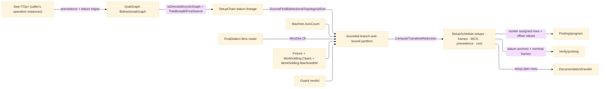

# [RASM_FABRICATION_SETUPS]

The setup scheduler owns reorientation planning across fixtures, datum lineage, WCS assignment, reach admission, and current-stock clamp safety. `Setup.Schedule<TOp>(Seq<TOp>, SchedulePolicy<TOp>) → Fin<SetupSchedule>` folds operation precedence and datum dependencies into one QuikGraph DAG, searches legal operation-to-setup partitions under machine axis reach and fixture keep-out clearance with a genuine best-cost pruning bound, assigns each setup to the dialect WCS roster, and emits the typed setup plan that posting renders, probing datums consume, traveler pages carry, and derivation composes during the setup/assembly stage. The scheduler is GENERIC over the operation element: `TOp` is the caller's operation INSTANCE type and every discriminant — identity key, predecessors, datum sources, fixture, axis demand, reach probes, guard, compatibility, frame, score — is a `SchedulePolicy<TOp>` delegate column, so the 4-row `Process/physics` `Operation` kind vocabulary never caps the scheduler at kind granularity (N pockets are N instances under the caller's key, never one collapsed vertex), and the operation-instance vocabulary lands as a caller-side `TOp` with zero scheduler edits. Identity is caller-owned and STABLE: the `Key` delegate is a required constructor argument on every policy including `Direct` — a process-randomized `string.GetHashCode` identity is the deleted form, because the key indexes the operation dictionary and the precedence graph and must survive process restarts.

A setup is a physical reorientation, so `Setup` carries its 6-DOF part-to-machine `Plane Frame` beside the fixture, datum, and reachable-op set — the geometric fact that lets posting emit offset VALUES rather than a bare WCS index, gives probing's datum reconciliation a nominal frame to correct against, and lets per-setup stock snapshots transform between orientations; the policy's `Frame` column supplies it when a new setup opens. Clamp-on-machined-face admission composes the ONE published `Workholding.MachinedHit` witness — the setups-local vertex-or-edge re-derivation is the deleted weaker-witness form — and reach admission composes `Workholding.Clears` per policy reach segment. Datum lineage across machining flips is THIS page's law (`DatumLineageBroken` 2726); assembly's join cycle stays 2737 — two lineage laws, two owners.

Wire posture: HOST-LOCAL. `SetupSchedule` crosses only in-process seams — `Posting/program` composes `Setup.Schedule` for its WCS prologue rows, `Documentation/traveler` carries the plan rows, `Process/derivation` lowers its setup stage here; no type on this page sits between wire and rail.

## [01]-[INDEX]

- [01]-[SETUP_SCHEDULER]: owns `Setup` as the complex value object with its part-to-machine frame, the WCS roster assignment rows, the setup-chain datum lineage payload, the QuikGraph precedence/reachability fold, the bounded branch-and-bound setup partition, and the one generic `Setup.Schedule` entry.

## [02]-[SETUP_SCHEDULER]

- Owner: `Setup` `[ComplexValueObject]` owns the fixture, the part-to-machine `Frame`, the WCS datum, and the reachable operation key set for one reorientation; `WcsFamily`/`WcsSlot` owns dialect-roster assignment; `WcsDatum` owns setup index, slot, anchor operation, and lineage producers; `SetupChain` owns the datum-lineage diagnostic payload; `SchedulePolicy<TOp>` owns machine, dialect, and the ten operation-instance delegate columns; `ScheduleState` the search accumulator; `SetupSchedule` owns the receipt including the searched objective cost.
- Cases: `WcsFamily` rows 2 — `base` for G54-G59.x slots and `extended` for G54.1-Pn/G154/G505 roster slots; graph edge families 2 — operation precedence and datum lineage; placement cases 2 — extend an existing compatible setup or open a new setup with its policy-supplied frame; failures 3 — `SetupInfeasible` 2717 for axis/reach/guard/WCS exhaustion, `DatumLineageBroken` 2726 for cycles or undatumed references, `ClampOnMachinedFace` 2727 for op-N fixtures landing on op-N-1 machined stock (the witness vertex from `Workholding.MachinedHit`).
- Entry: `public static Fin<SetupSchedule> Schedule<TOp>(Seq<TOp> operations, SchedulePolicy<TOp> policy)` — the one scheduler fold: build graph → DAG gate → datum reachability gate → source-first operation order → bounded branch-and-bound setup partition → WCS assignment → transitive reduction receipt.
- Auto: `Build` folds every operation key into a `BidirectionalGraph<int, SEdge<int>>` and adds `Predecessors(op) → op` plus `DatumSources(op) → op`; `CheckLineage` rejects non-DAG graphs with `DatumLineageBroken(SetupChain)` and verifies each declared source reaches its consumer through `TreeBreadthFirstSearch`; the Kahn order is `SourceFirstBidirectionalTopologicalSort` — the catalogued bidirectional-graph member, never the edge-list `SourceFirstTopologicalSort` on the wrong receiver; `Search` owns the NP-hard partition half, enumerating existing-setup and new-setup placements with the best-so-far cost as a PRUNING BOUND — a partial state whose accumulated cost already meets the incumbent is cut before recursion, the bound the prose always promised and the body now carries; `Admit` checks `Machine.AxisCount`, folds `Workholding.Clears` over the policy reach segments, applies the policy guard, and gates the current `StockSnapshot` through `Workholding.MachinedHit` on the `Fin` rail; `WcsSlot.Of` binds setup k against `PostDialect.Wcs.Total`. Admission gates stay first-fault by design: inside the search interior a refusal PRUNES a branch, so accumulating every independent violation would spend the search budget decorating states the bound discards.
- Receipt: `SetupSchedule` carries the ordered `Setup` rows (each with its frame), setup-to-WCS assignment rows, the reduced operation precedence pairs, and the searched `Cost`; posting renders assigned rows and offset values off the frames, probing consumes datum anchors and nominal frames, traveler consumes the plan, derivation composes the receipt, and no schedule timestamp or program block rides this page.
- Packages: QuikGraph (`BidirectionalGraph`/`SEdge`, `AlgorithmExtensions` `IsDirectedAcyclicGraph`/`SourceFirstBidirectionalTopologicalSort`/`TreeBreadthFirstSearch`/`ComputeTransitiveReduction`), `Process/owner#FABRICATION_OWNER` (`StockSnapshot`/`Edge3`), `Process/family#PROCESS_FAMILY` (`Machine.AxisCount`, `PostDialect.Wcs`), `Fixturing/workholding#WORKHOLDING` (`Fixture`/`Workholding.Clears`/`Workholding.MachinedHit`), `Process/faults#FAULT_BAND` (2717/2726/2727), Rhino.Geometry (`Plane`), Thinktecture, LanguageExt.Core, BCL inbox.
- Growth: a new setup objective is one `SchedulePolicy.Score` term; a new datum law is one graph edge-family fold; a new reach window is one `ReachSegments` projection; a new controller offset roster remains one `PostDialect.Wcs` row and no posting fallback; the operation-instance vocabulary lands as the caller's `TOp` with a real key — zero scheduler edits.
- Boundary: setup scheduling lives here and a posting-side default WCS assignment is the deleted form; datum lineage lives here and an assembly precedence cycle is still `AssemblyPrecedenceCyclic` 2737; magazine eviction stays magazine-owned and never enters the setup partition; the clamp-on-machined-face verdict is `Workholding.MachinedHit` and a setups-local vertex/edge re-derivation is the deleted weaker-witness form; a hand-rolled topological sort, a raw WCS string row, a hash-derived operation identity, or a second fixture keep-out solver is the deleted form; the QuikGraph builder mutations (`AddVertexRange`/`AddVerticesAndEdge`) are the page's named platform-forced statement seam — the graph container is imperative by construction — and every non-graph body is expression-shaped.

```csharp signature
// --- [RUNTIME_PRELUDE] ----------------------------------------------------------------------------------------------------------------------------
using System.Collections.Generic;
using System.Linq;
using LanguageExt;
using LanguageExt.Common;
using QuikGraph;
using QuikGraph.Algorithms;
using Rasm.Fabrication.Process;
using Rhino.Geometry;
using Thinktecture;
using static LanguageExt.Prelude;

namespace Rasm.Fabrication.Fixturing;

// --- [TYPES] --------------------------------------------------------------------------------------------------------------------------------------
[SmartEnum<string>]
public sealed partial class WcsFamily {
    public static readonly WcsFamily Base = new("base");
    public static readonly WcsFamily Extended = new("extended");
}

public readonly record struct SetupPlacement(Option<int> Existing);

// --- [MODELS] -------------------------------------------------------------------------------------------------------------------------------------
public readonly record struct WcsSlot(WcsFamily Family, int Ordinal) {
    public static Fin<WcsSlot> Of(int setup, PostDialect dialect, int operation) =>
        setup < 0 || setup >= dialect.Wcs.Total
            ? Fin.Fail<WcsSlot>(FabricationFault.SetupInfeasible(operation, dialect.Wcs.Total).ToError())
            : setup < dialect.Wcs.Slots
                ? Fin.Succ(new WcsSlot(WcsFamily.Base, setup))
                : Fin.Succ(new WcsSlot(WcsFamily.Extended, setup - dialect.Wcs.Slots + 1));
}

public readonly record struct WcsDatum(int Setup, WcsSlot Slot, int AnchorOperation, Seq<int> Lineage);

public sealed record SetupChain(Seq<int> Operations, Seq<(int Before, int After)> Lineage);

// Frame is the 6-DOF part-to-machine reorientation the setup IS: posting emits offset VALUES off it, probing
// corrects against it, per-setup snapshots transform through it — never index arithmetic alone.
[ComplexValueObject]
public sealed partial record Setup(Fixture Fixture, Plane Frame, WcsDatum Datum, Arr<int> ReachableOps) {
    public static Fin<SetupSchedule> Schedule<TOp>(Seq<TOp> operations, SchedulePolicy<TOp> policy) {
        Arr<TOp> opRows = operations.ToArr();
        IReadOnlyDictionary<int, TOp> byKey = opRows.ToDictionary(policy.Key);
        BidirectionalGraph<int, SEdge<int>> graph = Build(opRows, policy);

        return CheckLineage(opRows, byKey, graph, policy).Bind(_ =>
            Search(
                order: graph.SourceFirstBidirectionalTopologicalSort().ToArr(),
                cursor: 0,
                state: ScheduleState.Empty,
                bound: double.PositiveInfinity,
                operations: byKey,
                policy: policy)
            .Bind(state => Finalize(state, graph)));
    }

    // QuikGraph's builder is a mutable container: the AddVertexRange/AddVerticesAndEdge loop is the page's named
    // platform-forced statement seam.
    static BidirectionalGraph<int, SEdge<int>> Build<TOp>(Arr<TOp> operations, SchedulePolicy<TOp> policy) {
        BidirectionalGraph<int, SEdge<int>> graph = new(allowParallelEdges: false);
        graph.AddVertexRange(operations.Map(policy.Key));
        foreach (TOp operation in operations) {
            int target = policy.Key(operation);
            foreach (int before in policy.Predecessors(operation))
                graph.AddVerticesAndEdge(new SEdge<int>(before, target));
            foreach (int datum in policy.DatumSources(operation))
                graph.AddVerticesAndEdge(new SEdge<int>(datum, target));
        }
        return graph;
    }

    static Fin<Unit> CheckLineage<TOp>(
        Arr<TOp> operations,
        IReadOnlyDictionary<int, TOp> byKey,
        BidirectionalGraph<int, SEdge<int>> graph,
        SchedulePolicy<TOp> policy) =>
        !graph.IsDirectedAcyclicGraph()
            ? Fin.Fail<Unit>(FabricationFault.DatumLineageBroken(Chain(graph)).ToError())
            : operations.ToSeq()
                .Traverse(operation =>
                    policy.Predecessors(operation).Concat(policy.DatumSources(operation))
                        .ForAll(source => byKey.ContainsKey(source) && Reaches(graph, source, policy.Key(operation)))
                        ? Fin.Succ(unit)
                        : Fin.Fail<Unit>(FabricationFault.DatumLineageBroken(Chain(graph)).ToError()))
                .As()
                .Map(static _ => unit);

    static bool Reaches(BidirectionalGraph<int, SEdge<int>> graph, int source, int target) =>
        graph.TreeBreadthFirstSearch(source)(target, out _);

    // Bounded branch-and-bound: the incumbent's cost is the pruning bound — a partial state whose accumulated
    // cost already meets it is cut before recursion, and each candidate tightens the bound for its siblings.
    static Fin<ScheduleState> Search<TOp>(
        Arr<int> order,
        int cursor,
        ScheduleState state,
        double bound,
        IReadOnlyDictionary<int, TOp> operations,
        SchedulePolicy<TOp> policy) =>
        state.Cost >= bound
            ? Fin.Fail<ScheduleState>(FabricationFault.SetupInfeasible(cursor, state.Setups.Count).ToError())
            : cursor == order.Count
                ? Fin.Succ(state)
                : Candidates(state, operations[order[cursor]], policy).Fold(
                    Fin.Fail<ScheduleState>(FabricationFault.SetupInfeasible(order[cursor], state.Setups.Count).ToError()),
                    (best, placement) => Better(
                        best,
                        Place(state, operations[order[cursor]], placement, policy)
                            .Bind(next => Search(order, cursor + 1, next, BoundOf(best, bound), operations, policy))));

    static double BoundOf(Fin<ScheduleState> best, double bound) =>
        best.Match(Succ: incumbent => Math.Min(incumbent.Cost, bound), Fail: _ => bound);

    static Seq<SetupPlacement> Candidates<TOp>(ScheduleState state, TOp operation, SchedulePolicy<TOp> policy) =>
        toSeq(Range(0, state.Setups.Count)
            .Filter(index => policy.Compatible(state.Setups[index].Fixture, policy.Fixture(operation)))
            .Map(index => new SetupPlacement(Some(index))))
            .Add(new SetupPlacement(None))
            .Filter(candidate =>
                candidate.Existing.IsSome || state.Setups.Count < Math.Min(policy.MaxSetups, policy.Dialect.Wcs.Total));

    static Fin<ScheduleState> Place<TOp>(ScheduleState state, TOp operation, SetupPlacement placement, SchedulePolicy<TOp> policy) =>
        placement.Existing.Match(
            Some: index =>
                Admit(operation, state.Setups[index].Fixture, policy).Map(_ =>
                    state with {
                        Setups = state.Setups.SetItem(
                            index,
                            state.Setups[index] with { ReachableOps = state.Setups[index].ReachableOps.Add(policy.Key(operation)) }),
                        Cost = state.Cost + policy.Score(operation, state.Setups[index], true)
                    }),
            None: () =>
                WcsSlot.Of(state.Setups.Count, policy.Dialect, policy.Key(operation)).Bind(slot => {
                    Fixture fixture = policy.Fixture(operation);
                    WcsDatum datum = new(state.Setups.Count, slot, policy.Key(operation), policy.DatumSources(operation));
                    Setup setup = new(fixture, policy.Frame(operation), datum, Arr(policy.Key(operation)));
                    return Admit(operation, fixture, policy).Map(_ =>
                        state with {
                            Setups = state.Setups.Add(setup),
                            Cost = state.Cost + policy.Score(operation, setup, false)
                        });
                }));

    // First-fault by design: a refusal PRUNES the branch, so accumulating independent violations would spend the
    // search budget on states the bound discards. The machined-face gate composes the ONE published witness.
    static Fin<Unit> Admit<TOp>(TOp operation, Fixture fixture, SchedulePolicy<TOp> policy) =>
        policy.RequiredAxes(operation) > policy.Machine.AxisCount
            ? Fin.Fail<Unit>(FabricationFault.SetupInfeasible(policy.Key(operation), policy.Machine.AxisCount).ToError())
            : policy.ReachSegments(operation).Exists(segment => !Workholding.Clears(segment, fixture))
                ? Fin.Fail<Unit>(FabricationFault.SetupInfeasible(policy.Key(operation), fixture.Zones.Count).ToError())
                : !policy.Guard(operation, fixture)
                    ? Fin.Fail<Unit>(FabricationFault.SetupInfeasible(policy.Key(operation), fixture.Zones.Count).ToError())
                    : fixture.Current.Match(
                        Some: snapshot => Workholding.MachinedHit(fixture, snapshot).Bind(hit => hit.Match(
                            Some: point => Fin.Fail<Unit>(FabricationFault.ClampOnMachinedFace(policy.Key(operation), point).ToError()),
                            None: () => Fin.Succ(unit))),
                        None: () => Fin.Succ(unit));

    // One objective: the searched Cost. The old Better delegate was a second objective beside Score — deleted.
    static Fin<ScheduleState> Better(Fin<ScheduleState> current, Fin<ScheduleState> candidate) =>
        current.Match(
            Succ: best => candidate.Match(
                Succ: next => next.Cost < best.Cost ? candidate : current,
                Fail: _ => current),
            Fail: _ => candidate);

    static Fin<SetupSchedule> Finalize(ScheduleState state, BidirectionalGraph<int, SEdge<int>> graph) =>
        Fin.Succ(new SetupSchedule(
            state.Setups,
            state.Setups.Map(setup => new WcsAssignment(setup.Datum.Setup, setup.Datum.Slot)).ToSeq(),
            graph.ComputeTransitiveReduction(static (source, target) => new SEdge<int>(source, target))
                .Edges
                .Map(edge => (edge.Source, edge.Target))
                .ToSeq(),
            state.Cost));

    static SetupChain Chain(BidirectionalGraph<int, SEdge<int>> graph) =>
        new(graph.Vertices.ToSeq(), graph.Edges.Map(edge => (edge.Source, edge.Target)).ToSeq());
}

public readonly record struct WcsAssignment(int Setup, WcsSlot Slot);

// Generic over the operation INSTANCE: every discriminant is a delegate column, identity is caller-owned and
// stable (Key is required on every policy — a process-randomized hash identity is the deleted form).
public sealed record SchedulePolicy<TOp>(
    Machine Machine,
    PostDialect Dialect,
    int MaxSetups,
    Func<TOp, int> Key,
    Func<TOp, Seq<int>> Predecessors,
    Func<TOp, Seq<int>> DatumSources,
    Func<TOp, Fixture> Fixture,
    Func<TOp, Plane> Frame,
    Func<TOp, int> RequiredAxes,
    Func<TOp, Seq<Edge3>> ReachSegments,
    Func<TOp, Fixture, bool> Guard,
    Func<Fixture, Fixture, bool> Compatible,
    Func<TOp, Setup, bool, double> Score) {
    // The context-free floor: one setup, world frame, no precedence, no datums, clamp-free fixture — Schedule over
    // an empty operation set yields the empty schedule and posting's WCS prologue degrades to absence. The caller
    // supplies its own stable key; there is no hash-derived default.
    public static SchedulePolicy<TOp> Direct(Machine machine, PostDialect dialect, Func<TOp, int> key) => new(
        machine, dialect, MaxSetups: 1,
        Key: key, Predecessors: static _ => Seq<int>(), DatumSources: static _ => Seq<int>(),
        Fixture: static _ => Fixturing.Fixture.Free, Frame: static _ => Plane.WorldXY, RequiredAxes: static _ => 3,
        ReachSegments: static _ => Seq<Edge3>(), Guard: static (_, _) => true, Compatible: static (_, _) => true,
        Score: static (_, _, extends) => extends ? 0.0 : 1.0);
}

public sealed record ScheduleState(Arr<Setup> Setups, double Cost) {
    public static ScheduleState Empty => new(Arr<Setup>(), 0.0);
}

public sealed record SetupSchedule(Arr<Setup> Setups, Seq<WcsAssignment> Wcs, Seq<(int Before, int After)> Precedence, double Cost);
```


