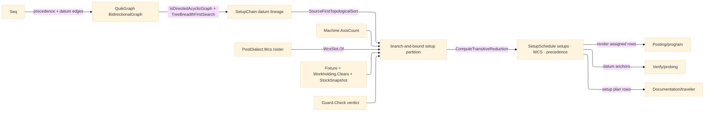

# [RASM_FABRICATION_SETUPS]

The setup scheduler owns reorientation planning across fixtures, datum lineage, WCS assignment, reach admission, and current-stock clamp safety. `Setup.Schedule(Seq<Operation>, SchedulePolicy) → SetupSchedule` folds operation precedence and datum dependencies into one QuikGraph DAG, searches legal operation-to-setup partitions under machine axis reach and fixture keep-out clearance, assigns each setup to the dialect WCS roster, and emits the typed setup plan that posting renders, probing datums consume, traveler pages carry, and derivation composes during the setup/assembly stage.

## [01]-[INDEX]

- [01]-[SETUP_SCHEDULER]: owns `Setup` as the complex value object, the WCS roster assignment row, the setup-chain datum lineage receipt, the QuikGraph precedence/reachability fold, the branch-and-bound setup partition, and the one `Setup.Schedule` entry.

## [02]-[SETUP_SCHEDULER]

- Owner: `Setup` `[ComplexValueObject]` owns the fixture, WCS datum, and reachable operation key set for one reorientation; `WcsFamily`/`WcsSlot` owns dialect-roster assignment; `WcsDatum` owns setup index, slot, anchor operation, and lineage producers; `SetupChain` owns the datum-lineage diagnostic payload; `SchedulePolicy` owns machine, dialect, operation identity, precedence, datum, fixture, reach, guard, and scoring delegates; `SetupSchedule` owns the receipt.
- Cases: `WcsFamily` rows 2 — `base` for G54-G59.x slots and `extended` for G54.1-Pn/G154/G505 roster slots; graph edge families 2 — operation precedence and datum lineage; placement cases 2 — extend an existing compatible setup or open a new setup; failures 3 — `SetupInfeasible` for axis/reach/guard/WCS exhaustion, `DatumLineageBroken` for cycles or undatumed references, `ClampOnMachinedFace` for op-N fixtures landing on op-N-1 machined stock.
- Entry: `public static Fin<SetupSchedule> Schedule(Seq<Operation> operations, SchedulePolicy policy)` — the one scheduler fold: build graph → DAG gate → datum reachability gate → source-first operation order → branch-and-bound setup partition → WCS assignment → transitive reduction receipt.
- Auto: `Build` folds every operation key into a `BidirectionalGraph<int, SEdge<int>>` and adds `Predecessors(op) → op` plus `DatumSources(op) → op`; `CheckLineage` rejects non-DAG graphs with `DatumLineageBroken(SetupChain)` and verifies each datum source reaches its consumer through `TreeBreadthFirstSearch`; `Search` owns the NP-hard sequencing half by enumerating existing-setup and new-setup placements under cost pruning; `Admit` checks `Machine.AxisCount`, `Workholding.Clears`, the policy guard verdict, and current `StockSnapshot` clamp occupation; `WcsSlot.Of` binds setup k against `PostDialect.Wcs.Total`.
- Receipt: `SetupSchedule` carries the ordered `Setup` rows, setup-to-WCS assignment rows, and the reduced operation precedence pairs; posting renders assigned rows, probing consumes datum anchors, traveler consumes the plan, derivation composes the receipt, and no schedule timestamp or program block rides this page.
- Packages: QuikGraph (`BidirectionalGraph`/`SEdge`, `AlgorithmExtensions` `IsDirectedAcyclicGraph`/`SourceFirstTopologicalSort`/`TreeBreadthFirstSearch`/`ComputeTransitiveReduction`), `Process/owner#FABRICATION_OWNER` (`StockSnapshot`/`Edge3`), `Process/family#PROCESS_FAMILY` (`Machine.AxisCount`, `PostDialect.Wcs`), `Fixturing/workholding#WORKHOLDING` (`Fixture`/`Workholding.Clears`/`ExclusionZone`), `Process/faults#FAULT_BAND` (2717/2726/2727), Rhino.Geometry, Thinktecture, LanguageExt.Core, BCL inbox.
- Growth: a new setup objective is one `SchedulePolicy.Score` term; a new datum law is one graph edge-family fold; a new reach window is one `ReachSegments` projection; a new controller offset roster remains one `PostDialect.Wcs` row and no posting fallback.
- Boundary: setup scheduling lives here and a posting-side default WCS assignment is the deleted form; datum lineage lives here and an assembly precedence cycle is still `AssemblyPrecedenceCyclic` 2737; magazine eviction stays magazine-owned and never enters the setup partition; a hand-rolled topological sort, a raw WCS string row, or a second fixture keep-out solver is the deleted form.

```csharp signature
// --- [RUNTIME_PRELUDE] ----------------------------------------------------------------------------------------------------------------------------
using System.Collections.Generic;
using System.Linq;
using LanguageExt;
using LanguageExt.Common;
using QuikGraph;
using QuikGraph.Algorithms;
using Rasm.Fabrication.Process;
using Rhino.Geometry;
using Thinktecture;
using static LanguageExt.Prelude;

namespace Rasm.Fabrication.Fixturing;

// --- [TYPES] --------------------------------------------------------------------------------------------------------------------------------------
[SmartEnum<string>]
public sealed partial class WcsFamily {
    public static readonly WcsFamily Base = new("base");
    public static readonly WcsFamily Extended = new("extended");
}

public readonly record struct SetupPlacement(Option<int> Existing);

// --- [MODELS] -------------------------------------------------------------------------------------------------------------------------------------
public readonly record struct WcsSlot(WcsFamily Family, int Ordinal) {
    public static Fin<WcsSlot> Of(int setup, PostDialect dialect, int operation) =>
        setup < 0 || setup >= dialect.Wcs.Total
            ? Fin.Fail<WcsSlot>(FabricationFault.SetupInfeasible(operation, dialect.Wcs.Total).ToError())
            : setup < dialect.Wcs.Slots
                ? Fin.Succ(new WcsSlot(WcsFamily.Base, setup))
                : Fin.Succ(new WcsSlot(WcsFamily.Extended, setup - dialect.Wcs.Slots + 1));
}

public readonly record struct WcsDatum(int Setup, WcsSlot Slot, int AnchorOperation, Seq<int> Lineage);

public sealed record SetupChain(Seq<int> Operations, Seq<(int Before, int After)> Lineage);

[ComplexValueObject]
public sealed partial record Setup(Fixture Fixture, WcsDatum Datum, Arr<int> ReachableOps) {
    public static Fin<SetupSchedule> Schedule(Seq<Operation> operations, SchedulePolicy policy) {
        Arr<Operation> opRows = operations.ToArr();
        IReadOnlyDictionary<int, Operation> byKey = opRows.ToDictionary(policy.Key);
        BidirectionalGraph<int, SEdge<int>> graph = Build(opRows, policy);

        return CheckLineage(opRows, byKey, graph, policy).Bind(_ =>
            Search(
                order: graph.SourceFirstTopologicalSort().ToArr(),
                cursor: 0,
                state: ScheduleState.Empty,
                operations: byKey,
                policy: policy)
            .Bind(state => Finalize(state, graph)));
    }

    static BidirectionalGraph<int, SEdge<int>> Build(Arr<Operation> operations, SchedulePolicy policy) {
        BidirectionalGraph<int, SEdge<int>> graph = new(allowParallelEdges: false);
        graph.AddVertexRange(operations.Map(policy.Key));

        foreach (Operation operation in operations) {
            int target = policy.Key(operation);

            foreach (int before in policy.Predecessors(operation))
                graph.AddVerticesAndEdge(new SEdge<int>(before, target));

            foreach (int datum in policy.DatumSources(operation))
                graph.AddVerticesAndEdge(new SEdge<int>(datum, target));
        }

        return graph;
    }

    static Fin<Unit> CheckLineage(
        Arr<Operation> operations,
        IReadOnlyDictionary<int, Operation> byKey,
        BidirectionalGraph<int, SEdge<int>> graph,
        SchedulePolicy policy) {
        if (!graph.IsDirectedAcyclicGraph())
            return Fin.Fail<Unit>(FabricationFault.DatumLineageBroken(Chain(graph)).ToError());

        foreach (Operation operation in operations) {
            int target = policy.Key(operation);

            foreach (int before in policy.Predecessors(operation))
                if (!byKey.ContainsKey(before) || !Reaches(graph, before, target))
                    return Fin.Fail<Unit>(FabricationFault.DatumLineageBroken(Chain(graph)).ToError());

            foreach (int source in policy.DatumSources(operation))
                if (!byKey.ContainsKey(source) || !Reaches(graph, source, target))
                    return Fin.Fail<Unit>(FabricationFault.DatumLineageBroken(Chain(graph)).ToError());
        }

        return Fin.Succ(unit);
    }

    static bool Reaches(BidirectionalGraph<int, SEdge<int>> graph, int source, int target) {
        TryFunc<int, IEnumerable<SEdge<int>>> paths = graph.TreeBreadthFirstSearch(source);
        IEnumerable<SEdge<int>> edges = Enumerable.Empty<SEdge<int>>();
        return paths(target, out edges);
    }

    static Fin<ScheduleState> Search(
        Arr<int> order,
        int cursor,
        ScheduleState state,
        IReadOnlyDictionary<int, Operation> operations,
        SchedulePolicy policy) {
        if (cursor == order.Count)
            return Fin.Succ(state);

        int key = order[cursor];
        Operation operation = operations[key];

        return Candidates(state, operation, policy).Fold(
            Fin.Fail<ScheduleState>(FabricationFault.SetupInfeasible(key, state.Setups.Count).ToError()),
            (best, placement) =>
                Better(
                    best,
                    Place(state, operation, placement, policy)
                        .Bind(next => Search(order, cursor + 1, next, operations, policy)),
                    policy));
    }

    static Seq<SetupPlacement> Candidates(ScheduleState state, Operation operation, SchedulePolicy policy) =>
        Range(0, state.Setups.Count)
            .Filter(index => policy.Compatible(state.Setups[index].Fixture, policy.Fixture(operation)))
            .Map(index => new SetupPlacement(Some(index)))
            .Append(new SetupPlacement(None))
            .Filter(candidate =>
                candidate.Existing.IsSome || state.Setups.Count < Math.Min(policy.MaxSetups, policy.Dialect.Wcs.Total));

    static Fin<ScheduleState> Place(ScheduleState state, Operation operation, SetupPlacement placement, SchedulePolicy policy) =>
        placement.Existing.Match(
            Some: index =>
                Admit(operation, state.Setups[index].Fixture, policy).Map(_ =>
                    state with {
                        Setups = state.Setups.SetItem(
                            index,
                            state.Setups[index] with { ReachableOps = state.Setups[index].ReachableOps.Add(policy.Key(operation)) }),
                        Cost = state.Cost + policy.Score(operation, state.Setups[index], true)
                    }),
            None: () =>
                WcsSlot.Of(state.Setups.Count, policy.Dialect, policy.Key(operation)).Bind(slot => {
                    Fixture fixture = policy.Fixture(operation);
                    WcsDatum datum = new(state.Setups.Count, slot, policy.Key(operation), policy.DatumSources(operation));
                    Setup setup = new(fixture, datum, Arr(policy.Key(operation)));

                    return Admit(operation, fixture, policy).Map(_ =>
                        state with {
                            Setups = state.Setups.Add(setup),
                            Cost = state.Cost + policy.Score(operation, setup, false)
                        });
                }));

    static Fin<Unit> Admit(Operation operation, Fixture fixture, SchedulePolicy policy) {
        int key = policy.Key(operation);

        if (policy.RequiredAxes(operation) > policy.Machine.AxisCount)
            return Fin.Fail<Unit>(FabricationFault.SetupInfeasible(key, policy.Machine.AxisCount).ToError());

        foreach (Edge3 segment in policy.ReachSegments(operation))
            if (!Workholding.Clears(segment, fixture))
                return Fin.Fail<Unit>(FabricationFault.SetupInfeasible(key, fixture.Zones.Count).ToError());

        if (!policy.Guard(operation, fixture))
            return Fin.Fail<Unit>(FabricationFault.SetupInfeasible(key, fixture.Zones.Count).ToError());

        return fixture.Current.Match(
            Some: snapshot =>
                ClampHit(fixture, snapshot).Match(
                    Some: point => Fin.Fail<Unit>(FabricationFault.ClampOnMachinedFace(key, point).ToError()),
                    None: () => Fin.Succ(unit)),
            None: () => Fin.Succ(unit));
    }

    static Option<Point3d> ClampHit(Fixture fixture, StockSnapshot snapshot) =>
        fixture.Zones
            .Bind(zone => snapshot.Machined.Map(face => (Zone: zone, Face: face)))
            .Find(row =>
                row.Zone.Covers(row.Face.At(0))
                || Range(0, row.Face.Count).Exists(index =>
                    row.Zone.Crosses(new Edge3(row.Face.At(index), row.Face.At((index + 1) % row.Face.Count)))))
            .Map(row => row.Face.At(0));

    static Fin<ScheduleState> Better(Fin<ScheduleState> current, Fin<ScheduleState> candidate, SchedulePolicy policy) =>
        current.Match(
            Succ: best =>
                candidate.Match(
                    Succ: next => policy.Better(next, best) ? Fin.Succ(next) : current,
                    Fail: _ => current),
            Fail: _ => candidate);

    static Fin<SetupSchedule> Finalize(ScheduleState state, BidirectionalGraph<int, SEdge<int>> graph) {
        Seq<WcsAssignment> assignments =
            state.Setups.Map(setup => new WcsAssignment(setup.Datum.Setup, setup.Datum.Slot));

        Seq<(int Before, int After)> reduced =
            graph.ComputeTransitiveReduction(static (source, target) => new SEdge<int>(source, target))
                .Edges
                .Map(edge => (edge.Source, edge.Target))
                .ToSeq();

        return Fin.Succ(new SetupSchedule(state.Setups, assignments, reduced));
    }

    static SetupChain Chain(BidirectionalGraph<int, SEdge<int>> graph) =>
        new(graph.Vertices.ToSeq(), graph.Edges.Map(edge => (edge.Source, edge.Target)).ToSeq());
}

public readonly record struct WcsAssignment(int Setup, WcsSlot Slot);

public sealed record SchedulePolicy(
    Machine Machine,
    PostDialect Dialect,
    int MaxSetups,
    Func<Operation, int> Key,
    Func<Operation, Seq<int>> Predecessors,
    Func<Operation, Seq<int>> DatumSources,
    Func<Operation, Fixture> Fixture,
    Func<Operation, int> RequiredAxes,
    Func<Operation, Seq<Edge3>> ReachSegments,
    Func<Operation, Fixture, bool> Guard,
    Func<Fixture, Fixture, bool> Compatible,
    Func<Operation, Setup, bool, double> Score,
    Func<ScheduleState, ScheduleState, bool> Better) {
    // The context-free floor: one setup, no precedence, no datums, clamp-free fixture — Schedule over an
    // empty operation set yields the empty schedule and posting's WCS prologue degrades to absence.
    public static SchedulePolicy Direct(Machine machine, PostDialect dialect) => new(
        machine, dialect, MaxSetups: 1,
        Key: static op => op.Key.GetHashCode(StringComparison.Ordinal), Predecessors: static _ => Seq<int>(), DatumSources: static _ => Seq<int>(),
        Fixture: static _ => Fixture.Free, RequiredAxes: static _ => 3,
        ReachSegments: static _ => Seq<Edge3>(), Guard: static (_, _) => true, Compatible: static (_, _) => true,
        Score: static (_, _, _) => 0.0, Better: static (next, best) => next.Setups.Count < best.Setups.Count);
}

public sealed record ScheduleState(Arr<Setup> Setups, double Cost) {
    public static ScheduleState Empty => new(Arr<Setup>(), 0.0);
}

public sealed record SetupSchedule(Arr<Setup> Setups, Seq<WcsAssignment> Wcs, Seq<(int Before, int After)> Precedence);
```


