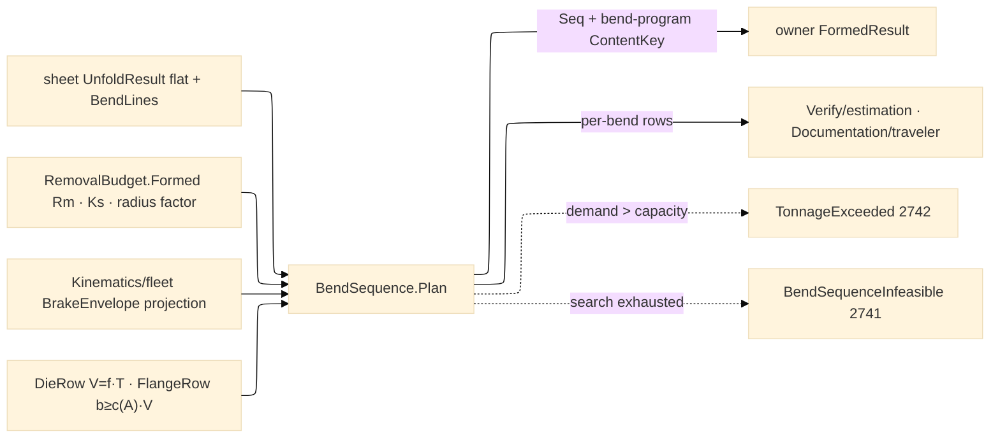

# [RASM_FABRICATION_BEND_SEQUENCE]

The press-brake planning owner: `BendSequence.Plan` orders the `Forming/sheet#FLAT_PATTERN` bend-line set into an executable brake program — the best-first search over the per-state feasibility matrix, emitting the `BendStep` atoms rows (`Order`/`Line`/`AngleDeg`/`RadiusMm`/`KFactor`/`OverbendDeg`/`TonnageKn`/`Flip`) the `Run(Form)` case body mints into `FormedResult` under the `bend-program` content key. Die selection is table law: the die opening `V = f·T` from the thickness-band rows (`T ≤ 3 → f=8`, `3 < T ≤ 10 → f=10`, `T > 10 → f=12`), the air-bend working radius `Ri ≈ 0.16·V` (the working radius DEFEATS the nominal drawing radius — the plan re-projects `BA` through `FlatPattern.Project` when `Ri` displaces `R`), and the minimum flange `b ≥ c(A)·V` from the angle-band rows (`≥90° → 0.7`, `60-90° → 0.9`, `45-60° → 1.1`, `30-45° → 1.5`). Air-bend tonnage is `F = (C·Rm·S²·L)/(V·1000)` in kN with `C = 1.33`, `Rm` the physics `RemovalBudget.Formed.TensileRm`, `S` thickness, `L` bend length, `V` the die opening — scaled by the `BendMethod` tonnage multiplier (`air ×1` · `bottoming ×4` · `coining ×8`); a bend whose demand exceeds the machine envelope routes `TonnageExceeded` 2742. Springback resolves to a per-bend overbend: `OverbendDeg = A·(1 − Ks)/Ks · methodScale` with `Ks` the `Formed.SpringbackRatio` (air carries full springback, bottoming half, coining a tenth) — the overbend rides the `BendStep` row, never a post-pass correction.

The sequence search is state-space, not heuristic-ordered: a state is the set of completed bends plus part orientation; a candidate bend is FEASIBLE when the back gauge reaches its reference edge (`X ≤ GaugeTravelMm`, the gauged flange still flat), no intermediate flange sweeps the die/ram section (the folded-profile silhouette against the tooling section — the 2D check composes `Geometry2D/algebra` clipping and `Loop.Covers`, never a bespoke intersector), and no prior upstanding flange occludes the gauge face; expansion orders by flips-then-gauge-moves cost and the first goal state IS the plan (`BendStep.Flip` marks each reorientation). Search exhaustion routes `BendSequenceInfeasible` 2741 carrying the blocking bend and the tried-order count. The machine envelope (`CapacityKn`/`GaugeTravelMm`/`OpenHeightMm`) is a projected row from the `Kinematics/fleet#MACHINE_FLEET` capability registry — the brake never keeps a private machine table; the `press-brake-cnc` `Machine` row admits the `press-brake` `ProcessKind` and the envelope arrives as fleet-registry data at the fold.

Wire posture: HOST-LOCAL. The plan crosses only as `Seq<BendStep>` on `FormedResult` plus the `bend-program` `ContentKey`; bender-native program text is a dialect concern that stays OFF this page — the step rows are the neutral model exactly as `CutProgram` is posting's.

## [01]-[BEND_SEQUENCE]

- [01]-[BEND_SEQUENCE]: owns the `BendMethod` axis with its tonnage/springback columns, the `DieRow`/`FlangeRow` selection tables, the `BrakeEnvelope` projected machine row, the tonnage/overbend/flange formulas, and the ONE `BendSequence.Plan` best-first fold from `UnfoldResult` to the ordered `Seq<BendStep>` — the brake half the `Run(Form)` case body composes after `Forming/sheet#FLAT_PATTERN`.

## [02]-[BEND_SEQUENCE]

- Owner: `BendMethod` `[SmartEnum<string>]` (`air`/`bottoming`/`coining`) carrying `TonnageMultiplier` and `SpringbackScale` — the forming-method axis `Forming/sheet`'s `KFactorTable` also keys; `DieRow` the thickness-band die rule (`V = f·T`); `FlangeRow` the angle-band minimum-flange rule (`b ≥ c(A)·V`); `BrakeEnvelope` the projected machine capability row (capacity kN, gauge travel, open height — fleet-registry data, never a page-local machine table); `BendState` the plane-local search node (done-set, orientation, gauge position); `BendSequence` the static surface owning `Plan` and the die/tonnage/overbend projections.
- Cases: `BendMethod` rows 3 (air 1.0/1.0 · bottoming 4.0/0.5 · coining 8.0/0.1); `DieRow` rows 3; `FlangeRow` rows 4; the search discriminates feasibility per state — reach, collision, occlusion — as three predicate columns of ONE matrix fold, never three sibling validators.
- Entry: `public static Fin<Seq<BendStep>> Plan(UnfoldResult unfold, FormPolicy policy, BrakeEnvelope envelope)` — the ONE plan fold the `Run(Form)` case body composes; `DieV`/`InsideRadiusAir`/`MinFlange`/`TonnagePerMeter`/`Overbend` are the pure projections consumers (estimation, traveler, manufacturability) read without re-deriving.
- Auto: `Plan` selects `V` per the die rows (the `FormPolicy.DieWidthFactor` override displaces the band factor), re-projects each bend's `BA` through `FlatPattern.Project` at the working radius `max(R, 0.16·V)`, prices tonnage per bend against `envelope.CapacityKn` (fail → 2742), gates every flange against `MinFlange` (an under-flange bend re-orders behind its neighbor or fails the state), and best-first expands `BendState` until the done-set closes — flips minimized first, gauge moves second; the winning path projects straight into `BendStep` rows with `OverbendDeg` resolved per method; `Verify/estimation` prices the plan from the same rows; `Documentation/traveler` renders them as the bend card.
- Receipt: `Seq<BendStep>` IS the plan evidence — ordered, per-bend priced, flip-marked; no parallel `BendPlan` wrapper and no plane-internal search type on the result (ruling 5: the state graph dies inside the fold).
- Packages: `Forming/sheet#FLAT_PATTERN` (`UnfoldResult`/`BendLine`/`FormPolicy`/`Project` — composed), `Process/physics#CUT_PARAMETER` (`RemovalBudget.Formed` Rm/springback), `Process/owner#FABRICATION_OWNER` atoms (`BendStep`/`Edge3`/`ContentKey`/`EgressKind.BendProgram`), `Process/family#PROCESS_FAMILY` (`Machine.PressBrakeCnc`/`ProcessKind.PressBrake` admission), `Kinematics/fleet#MACHINE_FLEET` (`BrakeEnvelope` projection rows — the capability registry), `Geometry2D/algebra#POLYGON_ALGEBRA` (collision clipping), Thinktecture.Runtime.Extensions, LanguageExt.Core, `Rasm.Numerics`, BCL inbox.
- Growth: a new forming method is one `BendMethod` row (multiplier + scale columns); a new die family is rows, not folds; hemming/staged-bottoming tooling lands as die rows plus a `FlangeRow` band, never a second planner; a bender-dialect emission target is a posting-plane concern riding the `bend-program` key; zero new entrypoint surface.
- Boundary: this page owns SEQUENCING and pricing — unfold algebra is `Forming/sheet`'s and a re-derived `BA` here (outside the working-radius re-projection) is the split-brain defect; the machine table is the fleet registry's and a page-local capacity/gauge table is the deleted form; the search state never escapes the fold; tonnage/springback constants are row data (`C`, band factors, method columns) and an inline formula literal at a call site is the named defect; bender program TEXT never lands here.

```csharp signature
// --- [RUNTIME_PRELUDE] ----------------------------------------------------------------------------------------------------------------------------
using LanguageExt;
using LanguageExt.Common;
using Rasm.Fabrication.Kinematics;
using Rasm.Fabrication.Process;
using Rasm.Numerics;
using Thinktecture;
using static LanguageExt.Prelude;

namespace Rasm.Fabrication.Forming;

// --- [TYPES] --------------------------------------------------------------------------------------------------------------------------------------
[SmartEnum<string>]
public sealed partial class BendMethod {
    public static readonly BendMethod Air = new("air", tonnageMultiplier: 1.0, springbackScale: 1.0);
    public static readonly BendMethod Bottoming = new("bottoming", tonnageMultiplier: 4.0, springbackScale: 0.5);
    public static readonly BendMethod Coining = new("coining", tonnageMultiplier: 8.0, springbackScale: 0.1);

    public double TonnageMultiplier { get; }
    public double SpringbackScale { get; }
}

// --- [CONSTANTS] ----------------------------------------------------------------------------------------------------------------------------------
// Air-bend die constant C in F = C·Rm·S²·L/(V·1000); a row datum, never an inline literal in a projection body.
public static class BrakeLaw {
    public const double DieConstant = 1.33;
}

// --- [MODELS] -------------------------------------------------------------------------------------------------------------------------------------
public readonly record struct DieRow(double ThicknessLowMm, double ThicknessHighMm, double WidthFactor);

public readonly record struct FlangeRow(double AngleLowDeg, double AngleHighDeg, double FlangeFactor);

// Projected from the Kinematics/fleet capability registry — never a page-local machine table.
public readonly record struct BrakeEnvelope(double CapacityKn, double GaugeTravelMm, double OpenHeightMm);

// --- [OPERATIONS] ---------------------------------------------------------------------------------------------------------------------------------
public static class BendSequence {
    static readonly Arr<DieRow> Dies = Array(new DieRow(0.0, 3.0, 8.0), new DieRow(3.0, 10.0, 10.0), new DieRow(10.0, double.MaxValue, 12.0));
    static readonly Arr<FlangeRow> Flanges = Array(
        new FlangeRow(90.0, 180.0, 0.7), new FlangeRow(60.0, 90.0, 0.9), new FlangeRow(45.0, 60.0, 1.1), new FlangeRow(30.0, 45.0, 1.5));

    public static double DieV(double thicknessMm, Option<double> factorOverride) =>
        factorOverride.IfNone(Dies.Filter(d => thicknessMm > d.ThicknessLowMm && thicknessMm <= d.ThicknessHighMm).Head().WidthFactor) * thicknessMm;

    public static double InsideRadiusAir(double dieVMm) => 0.16 * dieVMm;

    public static double MinFlange(double angleDeg, double dieVMm) =>
        Flanges.Filter(f => angleDeg > f.AngleLowDeg && angleDeg <= f.AngleHighDeg).HeadOrNone().Match(f => f.FlangeFactor, () => 1.5) * dieVMm;

    // kN for a full bend: Rm [MPa], S/V/L [mm] → C·Rm·S²/(1000·V) is kN per metre of bend line.
    public static double Tonnage(double rmMpa, double thicknessMm, double dieVMm, double lengthMm, BendMethod method) =>
        BrakeLaw.DieConstant * rmMpa * thicknessMm * thicknessMm / (1000.0 * dieVMm) * (lengthMm / 1000.0) * method.TonnageMultiplier;

    public static double Overbend(double angleDeg, double springbackRatio, BendMethod method) =>
        angleDeg * (1.0 - springbackRatio) / springbackRatio * method.SpringbackScale;

    // Best-first over (done-set, orientation): reach → collision → occlusion predicate columns; flips then gauge
    // moves as cost. The winning path IS the Seq<BendStep>; the state graph dies inside the fold (ruling 5).
    public static Fin<Seq<BendStep>> Plan(UnfoldResult unfold, FormPolicy policy, BrakeEnvelope envelope) =>
        FlatPattern.FormedRow(unfold.Material).Bind(formed => {
            double v = DieV(unfold.ThicknessMm, policy.DieWidthFactor);
            Seq<(BendLine Bend, double Kn)> priced = unfold.Bends
                .Map(b => (b, Tonnage(formed.TensileRm, unfold.ThicknessMm, v, b.Line.A.DistanceTo(b.Line.B), policy.Method)));
            return priced.Filter(p => p.Kn > envelope.CapacityKn).HeadOrNone().Match(
                Some: p => Fin.Fail<Seq<BendStep>>(FabricationFault.TonnageExceeded(p.Kn, envelope.CapacityKn).ToError()),
                None: () => Search(priced, formed, policy, v, envelope));
        });
}
```


