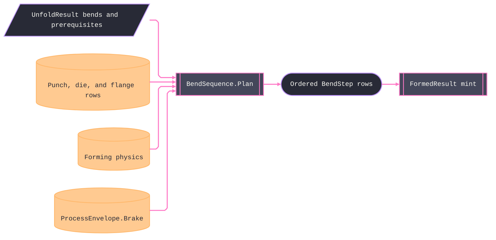

# [RASM_FABRICATION_BEND_SEQUENCE]

The press-brake planning owner, `BendSequence.Plan`, orders the `UnfoldResult` bend-line set into an executable brake program. Die selection is table law: `V = f·T`, minimum flange `b ≥ c(A)·V`, and tonnage `F = C·Rm·S²·L/(V·1000)` in kN. `BendMethod` supplies tonnage, springback, K calibration, and the working-radius law (air `max(R, 0.16·V)`, bottoming and coining the demanded punch radius); `PunchKind` supplies the punch turn ceiling `180−β` and back clearance. Every `BendStep` preserves working radius, K factor, overbend, tonnage, and physical flip.

The sequence search is state-space over orientation-true feasibility. A state carries completed bends, part orientation, gauge position, accumulated flat delta, and the executable path. A candidate must satisfy its explicit prerequisite set, signed forming direction, punch turn ceiling, gauge travel, minimum flange, gauge-side clearance, open height, bed length, and machine capacity. `PriorityQueue<TElement,TPriority>` orders flips before gauge moves. Section clipping stays on the `Fin` rail; geometry failure cannot become a silent collision result. `ProcessEnvelope.Brake` from `Kinematics/fleet` is the sole capacity owner and carries `CapacityKn`, `GaugeTravelMm`, `OpenHeightMm`, and `BedLengthMm`.

Wire posture: HOST-LOCAL. The plan crosses only as `Seq<BendStep>` on `FormedResult` (the ONE key digests flat + bends — `EgressKind.BendProgram` stays unminted on this carrier); bender-native program text is a dialect concern that stays OFF this page — the step rows are the neutral model exactly as `CutProgram` is posting's.

## [01]-[BEND_SEQUENCE]

- [01]-[BEND_SEQUENCE]: owns the `BendMethod` axis, `PunchKind` tooling axis, `DieRow` and `FlangeRow` tables, tonnage, overbend, flange projections, and the one `BendSequence.Plan` best-first fold from `UnfoldResult` to ordered `BendStep` rows. `Kinematics/fleet` owns the composed `ProcessEnvelope.Brake` machine capability.

## [02]-[BEND_SEQUENCE]

- Owner: `BendMethod` owns forming-method calibration and the working-radius law; `PunchKind` owns the punch turn ceiling and back clearance; `DieRow` and `FlangeRow` own table data; `BendState` owns the private search node; `BendSequence` owns projections and planning. `ProcessEnvelope.Brake` remains the canonical machine capability.
- Cases: `BendMethod` rows 3 (air 1.0/1.0/0.0 · bottoming 4.0/0.5/−0.04 · coining 8.0/0.1/−0.08, each with its `WorkingRadius` delegate); `PunchKind` rows 3 (straight 92°/0 · gooseneck 92°/60 · acute 152°/0); `DieRow` rows 3; `FlangeRow` rows 5 (terminal `<30°` band closes the table); the search discriminates feasibility per state — direction-formable, punch turn ceiling, back-gauge reach, minimum flange, gauge-side clearance, die/ram section clearance — as the predicate columns of ONE admission matrix fold, never sibling validators.
- Entry: `public static Fin<Seq<BendStep>> Plan(UnfoldResult unfold, FormPolicy policy, ProcessEnvelope.Brake envelope)` is the one plan fold. `DieV`, `MinFlange`, `Tonnage`, and `Overbend` are shared projections.
- Auto: `Plan` gates degenerate thickness and springback first, selects `V` per the die rows (`FormPolicy.DieWidthFactor` displaces the band factor), re-projects each bend through `FlatPattern.Project` at the method's `WorkingRadius` and accumulates only the difference against the original-radius projection the unfold flat already embeds — an unchanged working radius shifts no gauge position — prices tonnage per bend against `envelope.CapacityKn` (fail → 2742), gates every flange against the total `MinFlange` table, and best-first expands `BendState` on the `PriorityQueue` frontier until the done-set closes — flips minimized first, gauge moves second; each expansion admits only the orientation whose face-up state makes the candidate's signed direction formable, so `Flip` is a physically evaluated reorientation, never a decorative flag; the winning path projects straight into `BendStep` rows with `OverbendDeg` resolved per method; `Verify/estimation` prices the plan from the same rows; `Documentation/traveler` renders them as the bend card.
- Receipt: `Seq<BendStep>` IS the plan evidence — ordered, per-bend priced, flip-marked; no parallel `BendPlan` wrapper and no plane-internal search type on the result (ruling 5: the state graph dies inside the fold).
- Packages: `UnfoldResult`, `BendLine`, `FormPolicy`, `FlatPattern.Project`, `ProcessBudget.Formed`, `BendStep`, `ProcessEnvelope.Brake`, `Loop.Admit`, `PolygonAlgebra`, BCL `PriorityQueue<TElement,TPriority>`, Thinktecture.Runtime.Extensions, LanguageExt.Core, and `Rasm.Numerics` compose directly.
- Growth: a new forming method is one `BendMethod` row, a new punch profile is one `PunchKind` row, and new die or flange capability is table data. A bender-dialect emission target remains a posting concern.
- Boundary: this page owns SEQUENCING and pricing — unfold algebra is `Forming/sheet`'s and a re-derived `BA` here (outside the working-radius re-projection) is the split-brain defect; the machine table is capability data and a page-local capacity/gauge table is the deleted form; the search state never escapes the fold; tonnage/springback constants are row data (`C`, band factors, method columns) and an inline formula literal at a call site is the named defect; a feasibility predicate that ignores orientation makes `Flip` a fiction — every side-signed predicate reads the orientation; bender program TEXT never lands here.

```csharp signature
// --- [RUNTIME_PRELUDE] ----------------------------------------------------------------------------------------------------------------------------
using LanguageExt;
using LanguageExt.Common;
using Rasm.Domain;
using Rasm.Fabrication.Geometry2D;
using Rasm.Fabrication.Kinematics;
using Rasm.Fabrication.Process;
using Rasm.Numerics;
using Rhino.Geometry;
using Thinktecture;
using static LanguageExt.Prelude;

namespace Rasm.Fabrication.Forming;

// --- [TYPES] --------------------------------------------------------------------------------------------------------------------------------------
// KBias is the K-table method shift Forming/sheet's KFactorTable reads; WorkingRadius is the realized-radius
// law — air bending follows the die opening (0.16·V floor), bottoming and coining set the demanded punch R.
[SmartEnum<string>]
public sealed partial class BendMethod {
    public static readonly BendMethod Air = new("air", tonnageMultiplier: 1.0, springbackScale: 1.0, kBias: 0.0, static (r, v) => Math.Max(r, 0.16 * v));
    public static readonly BendMethod Bottoming = new("bottoming", tonnageMultiplier: 4.0, springbackScale: 0.5, kBias: -0.04, static (r, _) => r);
    public static readonly BendMethod Coining = new("coining", tonnageMultiplier: 8.0, springbackScale: 0.1, kBias: -0.08, static (r, _) => r);

    public double TonnageMultiplier { get; }
    public double SpringbackScale { get; }
    public double KBias { get; }

    [UseDelegateFromConstructor]
    public partial double WorkingRadius(double insideRadiusMm, double dieVMm);
}

// The punch tooling axis is a MAX-TURN law: the punch tip (included angle β) must fit inside the bent part,
// so the admissible turn ceiling is 180−β; BackClearanceMm is the throat window a folded return flange may
// occupy behind the punch line. A hem flatten (turn ≥ HemTurnFloorDeg) bypasses the V-gate — no punch enters.
[SmartEnum<string>]
public sealed partial class PunchKind {
    public static readonly PunchKind Straight = new("straight", maxTurnDeg: 92.0, backClearanceMm: 0.0);
    public static readonly PunchKind Gooseneck = new("gooseneck", maxTurnDeg: 92.0, backClearanceMm: 60.0);
    public static readonly PunchKind Acute = new("acute", maxTurnDeg: 152.0, backClearanceMm: 0.0);

    public double MaxTurnDeg { get; }
    public double BackClearanceMm { get; }
}

// --- [CONSTANTS] ----------------------------------------------------------------------------------------------------------------------------------
// Air-bend die constant C in F = C·Rm·S²·L/(V·1000); the gauge-reposition band and the bounded-search cap are
// row data of the same law table, never inline literals in a fold body.
public static class BrakeLaw {
    public const double DieConstant = 1.33;
    public const double GaugeRepositionToleranceMm = 0.5;
    public const double HemTurnFloorDeg = 175.0;
    public const int SearchCap = 1 << 14;
}

// --- [MODELS] -------------------------------------------------------------------------------------------------------------------------------------
public readonly record struct DieRow(double ThicknessLowMm, double ThicknessHighMm, double WidthFactor);

public readonly record struct FlangeRow(double AngleLowDeg, double AngleHighDeg, double FlangeFactor);

// --- [OPERATIONS] ---------------------------------------------------------------------------------------------------------------------------------
public static class BendSequence {
    static readonly Arr<DieRow> Dies = Array(new DieRow(0.0, 3.0, 8.0), new DieRow(3.0, 10.0, 10.0), new DieRow(10.0, double.MaxValue, 12.0));

    // The terminal <30° band makes the table TOTAL — no Match fallback, no inline factor literal at the read.
    static readonly Arr<FlangeRow> Flanges = Array(
        new FlangeRow(90.0, 180.0, 0.7), new FlangeRow(60.0, 90.0, 0.9), new FlangeRow(45.0, 60.0, 1.1),
        new FlangeRow(30.0, 45.0, 1.5), new FlangeRow(0.0, 30.0, 2.0));

    public static Fin<double> DieV(double thicknessMm, Option<double> factorOverride) =>
        thicknessMm <= 0.0 || !double.IsFinite(thicknessMm)
            ? Fin.Fail<double>(GeometryFault.DegenerateInput($"bend-sequence:thickness:{thicknessMm:0.###}").ToError())
            : factorOverride.Match(
                Some: factor => factor > 0.0 && double.IsFinite(factor)
                    ? Fin.Succ(factor * thicknessMm)
                    : Fin.Fail<double>(GeometryFault.DegenerateInput($"bend-sequence:die-factor:{factor:0.###}").ToError()),
                None: () => Dies
                    .Filter(d => thicknessMm > d.ThicknessLowMm && thicknessMm <= d.ThicknessHighMm)
                    .HeadOrNone()
                    .Map(row => row.WidthFactor * thicknessMm)
                    .ToFin(GeometryFault.DegenerateInput($"bend-sequence:die-band:{thicknessMm:0.###}").ToError()));

    public static Fin<double> MinFlange(double angleDeg, double dieVMm) =>
        Flanges
            .Filter(f => Math.Abs(angleDeg) > f.AngleLowDeg && Math.Abs(angleDeg) <= f.AngleHighDeg)
            .HeadOrNone()
            .Map(f => f.FlangeFactor * dieVMm)
            .ToFin(GeometryFault.DegenerateInput($"bend-sequence:angle:{angleDeg:0.###}").ToError());

    // kN for a full bend with every length in millimetres.
    public static double Tonnage(double rmMpa, double thicknessMm, double dieVMm, double lengthMm, BendMethod method) =>
        BrakeLaw.DieConstant * rmMpa * thicknessMm * thicknessMm * lengthMm / (dieVMm * 1000.0) * method.TonnageMultiplier;

    public static double Overbend(double angleDeg, double springbackRatio, BendMethod method) =>
        Math.Abs(angleDeg) * (1.0 - springbackRatio) / springbackRatio * method.SpringbackScale;

    // Degenerate-input gates precede every projection: a zero thickness has no die band, a springback ratio
    // outside (0,1] mints an infinite overbend — both fail typed, never a poisoned row.
    public static Fin<Seq<BendStep>> Plan(UnfoldResult unfold, FormPolicy policy, ProcessEnvelope.Brake envelope) =>
        unfold is null || policy is null || envelope is null || unfold.Material is null || unfold.Forming is null || policy.Method is null || policy.Punch is null
            || unfold.Flat.IsEmpty || !unfold.Flat.ForAll(static loop => loop is not null && loop.Closed)
            || !unfold.Flat.Tail.ForAll(loop => loop.Tolerance == unfold.Flat.Head.Tolerance)
            || unfold.ThicknessMm <= 0.0 || !double.IsFinite(unfold.ThicknessMm)
            || policy.DieWidthFactor.Exists(static f => f <= 0.0 || !double.IsFinite(f))
            || InvalidBends(unfold) || InvalidEnvelope(envelope)
            ? Fin.Fail<Seq<BendStep>>(GeometryFault.DegenerateInput($"bend-sequence:input:{unfold.ThicknessMm:0.###}:{unfold.Bends.Count}").ToError())
            : unfold.Forming.SpringbackRatio is <= 0.0 or > 1.0 || !double.IsFinite(unfold.Forming.SpringbackRatio)
                || unfold.Forming.TensileRm <= 0.0 || !double.IsFinite(unfold.Forming.TensileRm)
                ? Fin.Fail<Seq<BendStep>>(GeometryFault.DegenerateInput($"bend-sequence:springback:{unfold.Forming.SpringbackRatio:0.###}").ToError())
                : DieV(unfold.ThicknessMm, policy.DieWidthFactor).Bind(v => {
                    ProcessBudget.Formed formed = unfold.Forming;
                    Seq<(BendLine Bend, double Kn)> priced = unfold.Bends
                        .Map(b => (b, Tonnage(formed.TensileRm, unfold.ThicknessMm, v, b.Line.A.DistanceTo(b.Line.B), policy.Method)));
                    return priced.Filter(p => p.Kn > envelope.CapacityKn).HeadOrNone().Match(
                        Some: p => Fin.Fail<Seq<BendStep>>(FabricationFault.TonnageExceeded(p.Kn, envelope.CapacityKn).ToError()),
                        None: () => priced.Map((p, index) => (Row: p, Index: index))
                            .Filter(p => p.Row.Bend.Line.A.DistanceTo(p.Row.Bend.Line.B) > envelope.BedLengthMm)
                            .HeadOrNone()
                            .Match(
                                Some: p => Fin.Fail<Seq<BendStep>>(FabricationFault.BendSequenceInfeasible(p.Index, priced.Count).ToError()),
                                None: () => Search(priced, formed, policy, v, unfold, envelope)));
                });

    static bool InvalidBends(UnfoldResult unfold) =>
        unfold.Bends.Map((bend, index) => (Bend: bend, Index: index)).Exists(row =>
            row.Bend.Line.A.DistanceTo(row.Bend.Line.B) is var length && (!double.IsFinite(length) || length <= 1e-9)
            || !double.IsFinite(row.Bend.AngleDeg) || Math.Abs(row.Bend.AngleDeg) is <= 0.0 or > 180.0
            || !double.IsFinite(row.Bend.InsideRadiusMm) || row.Bend.InsideRadiusMm < 0.0
            || !double.IsFinite(row.Bend.K) || row.Bend.K is <= 0.0 or >= 1.0
            || !double.IsFinite(row.Bend.BaMm) || row.Bend.BaMm <= 0.0
            || row.Bend.Prerequisites.ToSeq().Exists(prerequisite => prerequisite < 0 || prerequisite >= unfold.Bends.Count || prerequisite == row.Index));

    static bool InvalidEnvelope(ProcessEnvelope.Brake envelope) =>
        double.IsNaN(envelope.CapacityKn) || envelope.CapacityKn <= 0.0
        || double.IsNaN(envelope.GaugeTravelMm) || envelope.GaugeTravelMm <= 0.0
        || double.IsNaN(envelope.OpenHeightMm) || envelope.OpenHeightMm <= 0.0
        || double.IsNaN(envelope.BedLengthMm) || envelope.BedLengthMm <= 0.0;

    // The plane-local search node — dies inside the fold (ruling 5). FlippedUp is the face-up orientation every
    // side-signed predicate reads; FlatDeltaMm accumulates each completed bend's working-MINUS-original projection
    // difference — the correction beyond what the unfold flat already embeds, zero when the die keeps the radius.
    sealed record BendState(Set<int> Done, bool FlippedUp, double GaugeX, double FlatDeltaMm, Seq<BendStep> Path, int Flips, int GaugeMoves) {
        public static readonly BendState Start = new(Set<int>(), FlippedUp: false, GaugeX: 0.0, FlatDeltaMm: 0.0, Seq<BendStep>(), Flips: 0, GaugeMoves: 0);

        public long Cost => ((long)Flips << 32) + GaugeMoves;
    }

    // Best-first over PriorityQueue (the BCL heap owner — a linear frontier min-scan is the deleted form): pop
    // the cheapest state, expand every unbent line through the admission columns, first closed done-set wins.
    // Exemption: the frontier loop is the bounded-search kernel; domain flow receives only the Fin rail.
    static Fin<Seq<BendStep>> Search(Seq<(BendLine Bend, double Kn)> priced, ProcessBudget.Formed formed, FormPolicy policy, double v, UnfoldResult unfold, ProcessEnvelope.Brake envelope) {
        (BendLine Bend, double Kn)[] bends = priced.ToArray();
        PriorityQueue<BendState, long> frontier = new();
        frontier.Enqueue(BendState.Start, BendState.Start.Cost);
        Set<(Set<int> Done, bool Flipped, long Gauge)> visited = Set<(Set<int>, bool, long)>();
        int tried = 0, blocked = 0, guard = 0;
        while (frontier.TryDequeue(out BendState? state, out _) && state is not null && guard++ < BrakeLaw.SearchCap) {
            if (state.Done.Count == bends.Length)
                return Fin.Succ(state.Path);
            (Set<int>, bool, long) key = (state.Done, state.FlippedUp, (long)Math.Round(state.GaugeX / BrakeLaw.GaugeRepositionToleranceMm));
            if (visited.Contains(key))
                continue;
            visited = visited.Add(key);
            foreach (int i in Enumerable.Range(0, bends.Length).Where(i => !state.Done.Contains(i))) {
                tried++;
                Option<Error> expansionFault = None;
                Expand(state, i, bends, formed, policy, v, unfold, envelope).Match(
                    Succ: next => {
                        if (next.IsEmpty)
                            blocked = i;
                        next.Iter(s => frontier.Enqueue(s, s.Cost));
                        return unit;
                    },
                    Fail: error => {
                        expansionFault = Some(error);
                        return unit;
                    });
                if (expansionFault.IsSome)
                    return expansionFault.Match(error => Fin.Fail<Seq<BendStep>>(error), () => Fin.Fail<Seq<BendStep>>(GeometryFault.DegenerateInput("bend-sequence:expansion").ToError()));
            }
        }
        return Fin.Fail<Seq<BendStep>>(FabricationFault.BendSequenceInfeasible(blocked, tried).ToError());
    }

    // ONE admission matrix per candidate, six predicate columns — every side-signed column reads the candidate
    // orientation: DIRECTION-FORMABLE (the brake folds up, so the signed bend direction must face up in the
    // candidate orientation — flip is the physical act that turns a down-bend up), PUNCH turn ceiling (a hem
    // flatten bypasses the V-gate), back-gauge REACH, minimum FLANGE, GAUGE-CLEAR, SECTION-CLEAR (±V/2 window
    // widened by the punch back clearance).
    static Fin<Seq<BendState>> Expand(BendState state, int i, (BendLine Bend, double Kn)[] bends, ProcessBudget.Formed formed, FormPolicy policy, double v, UnfoldResult unfold, ProcessEnvelope.Brake envelope) =>
        Seq(false, true).Traverse(flip => {
            BendLine bend = bends[i].Bend;
            bool up = state.FlippedUp ^ flip;
            double orient = up ? -1.0 : 1.0;
            double gauge = GaugeReach(unfold, bend) + state.FlatDeltaMm;
            bool preconditions =
                bend.Prerequisites.ToSeq().ForAll(state.Done.Contains)
                &&
                (up ? bend.AngleDeg < 0.0 : bend.AngleDeg > 0.0)
                && (Math.Abs(bend.AngleDeg) >= BrakeLaw.HemTurnFloorDeg || Math.Abs(bend.AngleDeg) <= policy.Punch.MaxTurnDeg)
                && double.IsFinite(gauge) && gauge is >= 0.0 && gauge <= envelope.GaugeTravelMm
                && GaugeSideClear(unfold, bend, state.Done, bends, orient);
            return MinFlange(bend.AngleDeg, v).Bind(minFlange =>
                SectionClear(unfold, bend, state.Done, bends, v, envelope.OpenHeightMm, policy.Punch.BackClearanceMm, orient)
                    .Map(clear => preconditions && FlangeWidth(unfold, bend) >= minFlange && clear
                        ? Some(Step(state, i, bends, formed, policy, v, unfold, bend, up, flip, gauge))
                        : None));
        }).Map(static candidates => candidates.Choose(identity).ToSeq());

    static BendState Step(BendState state, int i, (BendLine Bend, double Kn)[] bends, ProcessBudget.Formed formed, FormPolicy policy, double v, UnfoldResult unfold, BendLine bend, bool up, bool flip, double gauge) {
        double working = policy.Method.WorkingRadius(bend.InsideRadiusMm, v);
        // The flat already embeds each bend's ORIGINAL-radius projection (hem allowance at the hem floor), so only the
        // working-minus-original difference shifts downstream gauge reach: equal radii shift nothing, and a hem's
        // allowance law is die-independent so its correction is zero — one Project algebra, never a second absolute pass.
        double flatDelta = Math.Abs(bend.AngleDeg) >= BrakeLaw.HemTurnFloorDeg
            ? 0.0
            : FlatPattern.Project(bend.AngleDeg, working, unfold.ThicknessMm, bend.K).FlatDeltaMm
                - FlatPattern.Project(bend.AngleDeg, bend.InsideRadiusMm, unfold.ThicknessMm, bend.K).FlatDeltaMm;
        BendStep step = new(state.Path.Count + 1, bend.Line, bend.AngleDeg, working, bend.K,
            Overbend(bend.AngleDeg, formed.SpringbackRatio, policy.Method), bends[i].Kn,
            flip ? BendOrientation.Flipped : BendOrientation.AsIs);
        return state with {
            Done = state.Done.Add(i), FlippedUp = up, GaugeX = gauge,
            FlatDeltaMm = state.FlatDeltaMm + flatDelta, Path = state.Path.Add(step),
            Flips = state.Flips + (flip ? 1 : 0),
            GaugeMoves = state.GaugeMoves + (Math.Abs(gauge - state.GaugeX) > BrakeLaw.GaugeRepositionToleranceMm ? 1 : 0),
        };
    }

    // Gauge-face law under orientation: the gauged (larger) flange must stay flat and unshadowed — a completed
    // bend on the gauge side (in the CURRENT orientation's sign) breaks flatness and occludes the gauge face.
    static bool GaugeSideClear(UnfoldResult unfold, BendLine bend, Set<int> done, (BendLine Bend, double Kn)[] bends, double orient) {
        bool positive = SideExtent(unfold, bend, positive: true) >= SideExtent(unfold, bend, positive: false);
        return !done.ToSeq().Exists(j => {
            double d = orient * Signed(Mid(bends[j].Bend.Line), bend.Line);
            return positive ? d > 0.0 : d < 0.0;
        });
    }

    // The die/ram section is the ±V/2 window widened by the punch back clearance on the throat side, raised to
    // the open height; each completed flange projects its folded silhouette at its orientation-signed offset.
    // The overlap check composes the ONE Geometry2D Clip owner; a clip failure reads as a collision — fail-closed.
    static Fin<bool> SectionClear(UnfoldResult unfold, BendLine bend, Set<int> done, (BendLine Bend, double Kn)[] bends, double v, double openHeightMm, double backClearanceMm, double orient) {
        if (double.IsPositiveInfinity(openHeightMm))
            return Fin.Succ(true);
        Context tolerance = unfold.Flat.Head.Tolerance;
        return Box((-v / 2.0) - backClearanceMm, 0.0, v / 2.0, openHeightMm, tolerance).Bind(section =>
            done.ToSeq().Traverse(j => {
                BendLine prior = bends[j].Bend;
                double flange = Math.Min(SideExtent(unfold, prior, positive: true), SideExtent(unfold, prior, positive: false));
                double folded = (Math.Abs(Math.Sin(Math.Abs(prior.AngleDeg) * Math.PI / 180.0)) * flange) + unfold.ThicknessMm;
                if (folded > openHeightMm)
                    return Fin.Succ(false);
                double at = orient * Signed(Mid(prior.Line), bend.Line);
                return Box(at - unfold.ThicknessMm, 0.0, at + unfold.ThicknessMm, folded, tolerance)
                    .Bind(silhouette => PolygonAlgebra.Clip(Seq1(silhouette), Seq1(section), ClipOp.Intersect))
                    .Map(static overlap => overlap.IsEmpty);
            }).Map(static rows => rows.ForAll(identity)));
    }

    // Boundary extent algebra over the flat pattern: the gauge reach is the larger perpendicular side extent, the
    // flange width the smaller — one Signed primitive serves reach, flange, gauge-side, and silhouette columns.
    static double GaugeReach(UnfoldResult unfold, BendLine bend) =>
        Math.Max(SideExtent(unfold, bend, positive: true), SideExtent(unfold, bend, positive: false));

    static double FlangeWidth(UnfoldResult unfold, BendLine bend) =>
        Math.Min(SideExtent(unfold, bend, positive: true), SideExtent(unfold, bend, positive: false));

    static double SideExtent(UnfoldResult unfold, BendLine bend, bool positive) =>
        unfold.Flat.ToSeq()
            .Bind(static loop => loop.Vertices.ToSeq())
            .Map(pt => Signed(pt, bend.Line))
            .Filter(d => positive ? d > 0.0 : d < 0.0)
            .Map(Math.Abs)
            .Fold(0.0, Math.Max);

    static double Signed(Point3d pt, Edge3 line) {
        double dx = line.B.X - line.A.X, dy = line.B.Y - line.A.Y;
        double len = Math.Sqrt((dx * dx) + (dy * dy));
        return (((pt.X - line.A.X) * dy) - ((pt.Y - line.A.Y) * dx)) / len;
    }

    static Point3d Mid(Edge3 line) => new((line.A.X + line.B.X) / 2.0, (line.A.Y + line.B.Y) / 2.0, 0.0);

    static Fin<Loop> Box(double x0, double y0, double x1, double y1, Context tolerance) =>
        Loop.Admit(Arr(new Point3d(x0, y0, 0.0), new Point3d(x1, y0, 0.0), new Point3d(x1, y1, 0.0), new Point3d(x0, y1, 0.0)),
            closed: true, Arr<double>(), tolerance);
}
```


