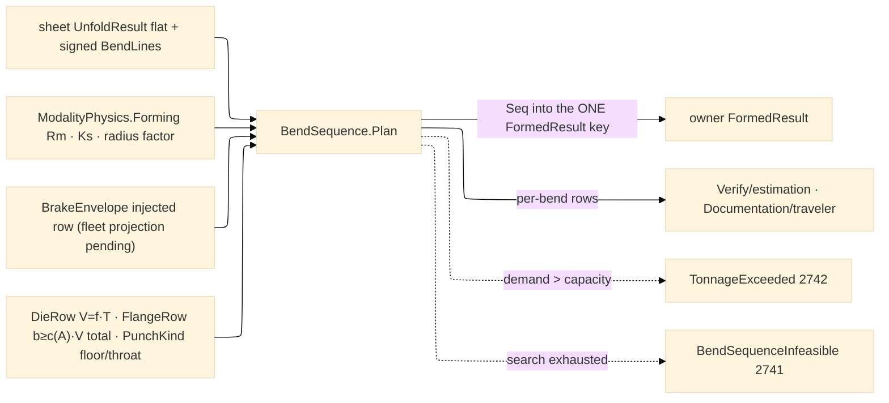

# [RASM_FABRICATION_BEND_SEQUENCE]

The press-brake planning owner: `BendSequence.Plan` orders the `Forming/sheet#FLAT_PATTERN` bend-line set into an executable brake program — the best-first search over the per-state feasibility matrix, emitting the `BendStep` atoms rows (`Order`/`Line`/`AngleDeg`/`RadiusMm`/`KFactor`/`OverbendDeg`/`TonnageKn`/`Flip`) the `Run(Form)` case body mints into `FormedResult` under the ONE flat-pattern content key. Die selection is table law: the die opening `V = f·T` from the thickness-band rows (`T ≤ 3 → f=8`, `3 < T ≤ 10 → f=10`, `T > 10 → f=12`), the air-bend working radius `Ri ≈ 0.16·V` (the working radius DEFEATS the nominal drawing radius — the plan re-projects `BA` through `FlatPattern.Project` when `Ri` displaces `R`), and the minimum flange `b ≥ c(A)·V` from the angle-band rows (`≥90° → 0.7`, `60-90° → 0.9`, `45-60° → 1.1`, `30-45° → 1.5`, `<30° → 2.0` the terminal band — the table is TOTAL by construction, no inline fallback literal). PUNCH selection is the second tooling axis: `PunchKind` rows (`straight`/`gooseneck`/`acute`) carry the `MinAngleDeg` reach floor (an acute bend under the punch's floor is infeasible in that tooling) and the `BackClearanceMm` throat column that relaxes the section-clearance window behind the punch line — a gooseneck admits a tall return flange a straight punch collides with. Air-bend tonnage is `F = (C·Rm·S²·L)/(V·1000)` in kN with `C = 1.33`, `Rm` the physics `Forming.TensileRm`, `S` thickness, `L` bend length, `V` the die opening — scaled by the `BendMethod` tonnage multiplier (`air ×1` · `bottoming ×4` · `coining ×8`); a bend whose demand exceeds the machine envelope routes `TonnageExceeded` 2742. Springback resolves to a per-bend overbend: `OverbendDeg = |A|·(1 − Ks)/Ks · methodScale` with `Ks` the `Forming.SpringbackRatio` gated into `(0, 1]` (a degenerate physics row fails typed, never an infinite overbend) — the overbend rides the `BendStep` row, never a post-pass correction.

The sequence search is state-space over ORIENTATION-TRUE feasibility: a state is the set of completed bends plus part orientation, and orientation is load-bearing on every predicate — the brake always folds UP, so a candidate is formable only when its SIGNED `BendLine.AngleDeg` direction matches the current face-up state (a down-bend demands the flip that turns it up), and the gauge side, occlusion side, and silhouette offsets all read through the orientation sign. A candidate bend is FEASIBLE when it is direction-formable, its punch admits the angle, the back gauge reaches its reference edge (`X ≤ GaugeTravelMm`, the gauged flange still flat), no intermediate flange sweeps the die/ram section beyond the punch back clearance (the folded-profile silhouette against the tooling window — the 2D check composes `Geometry2D/algebra` clipping, never a bespoke intersector), and no prior upstanding flange occludes the gauge face; expansion orders by flips-then-gauge-moves cost through the BCL `PriorityQueue<TElement,TPriority>` frontier (the hand-rolled linear min-scan over a list is the deleted form the system-API law names) and the first goal state IS the plan (`BendStep.Flip` marks each reorientation). Search exhaustion routes `BendSequenceInfeasible` 2741 carrying the blocking bend and the tried-order count. The machine envelope (`CapacityKn`/`GaugeTravelMm`/`OpenHeightMm`) is an INJECTED capability row: the `Kinematics/fleet` registry carries no forming-press projection today, so the row binds as the injected column the architecture's designed-ahead seam law prescribes — the owner arm wires `BrakeEnvelope.Unbounded` until the fleet lands its per-`ProcessKind` capability projection, and this page never keeps a private machine table.

Wire posture: HOST-LOCAL. The plan crosses only as `Seq<BendStep>` on `FormedResult` (the ONE key digests flat + bends — `EgressKind.BendProgram` stays unminted on this carrier); bender-native program text is a dialect concern that stays OFF this page — the step rows are the neutral model exactly as `CutProgram` is posting's.

## [01]-[BEND_SEQUENCE]

- [01]-[BEND_SEQUENCE]: owns the `BendMethod` axis with its tonnage/springback/K-bias columns, the `PunchKind` tooling axis, the `DieRow`/`FlangeRow` selection tables, the `BrakeEnvelope` injected machine row, the tonnage/overbend/flange formulas, and the ONE `BendSequence.Plan` best-first fold from `UnfoldResult` to the ordered `Seq<BendStep>` — the brake half the `Run(Form)` case body composes after `Forming/sheet#FLAT_PATTERN`.

## [02]-[BEND_SEQUENCE]

- Owner: `BendMethod` `[SmartEnum<string>]` (`air`/`bottoming`/`coining`) carrying `TonnageMultiplier`, `SpringbackScale`, and `KBias` (the K-table method shift `Forming/sheet`'s `KFactorTable` reads) — the forming-method axis both pages key; `PunchKind` `[SmartEnum<string>]` (`straight`/`gooseneck`/`acute`) carrying `MinAngleDeg` and `BackClearanceMm`; `DieRow` the thickness-band die rule (`V = f·T`); `FlangeRow` the angle-band minimum-flange rule (`b ≥ c(A)·V`, terminal band total); `BrakeEnvelope` the injected machine capability row (capacity kN, gauge travel, open height — fleet-projected once the forming projection lands, never a page-local machine table); `BendState` the plane-local search node (done-set, orientation, gauge position, flat-delta carry); `BendSequence` the static surface owning `Plan` and the die/tonnage/overbend/flange projections.
- Cases: `BendMethod` rows 3 (air 1.0/1.0/0.0 · bottoming 4.0/0.5/−0.04 · coining 8.0/0.1/−0.08); `PunchKind` rows 3 (straight 78°/0 · gooseneck 78°/60 · acute 28°/0); `DieRow` rows 3; `FlangeRow` rows 5 (terminal `<30°` band closes the table); the search discriminates feasibility per state — direction-formable, punch angle floor, back-gauge reach, minimum flange, gauge-side clearance, die/ram section clearance — as the predicate columns of ONE admission matrix fold, never sibling validators.
- Entry: `public static Fin<Seq<BendStep>> Plan(UnfoldResult unfold, FormPolicy policy, BrakeEnvelope envelope)` — the ONE plan fold the `Run(Form)` case body composes; `DieV`/`InsideRadiusAir`/`MinFlange`/`Tonnage`/`Overbend` are the pure projections consumers (estimation, traveler, manufacturability) read without re-deriving.
- Auto: `Plan` gates degenerate thickness and springback first, selects `V` per the die rows (`FormPolicy.DieWidthFactor` displaces the band factor), re-projects each bend's `BA` through `FlatPattern.Project` at the working radius `max(R, 0.16·V)`, prices tonnage per bend against `envelope.CapacityKn` (fail → 2742), gates every flange against the total `MinFlange` table, and best-first expands `BendState` on the `PriorityQueue` frontier until the done-set closes — flips minimized first, gauge moves second; each expansion admits only the orientation whose face-up state makes the candidate's signed direction formable, so `Flip` is a physically evaluated reorientation, never a decorative flag; the winning path projects straight into `BendStep` rows with `OverbendDeg` resolved per method; `Verify/estimation` prices the plan from the same rows; `Documentation/traveler` renders them as the bend card.
- Receipt: `Seq<BendStep>` IS the plan evidence — ordered, per-bend priced, flip-marked; no parallel `BendPlan` wrapper and no plane-internal search type on the result (ruling 5: the state graph dies inside the fold).
- Packages: `Forming/sheet#FLAT_PATTERN` (`UnfoldResult`/`BendLine`/`FormPolicy`/`Project`/`FormedRow` — composed), `Process/physics#CUT_PARAMETER` (`ModalityPhysics.Forming` Rm/springback via the shared accessor), `Process/owner#FABRICATION_OWNER` atoms (`BendStep`/`Edge3`), `Process/family#PROCESS_FAMILY` (`Machine.PressBrakeCnc`/`ProcessKind.PressBrake` admission), `Geometry2D/algebra#POLYGON_ALGEBRA` (section-collision clipping), BCL `PriorityQueue<TElement,TPriority>` (the frontier owner), Thinktecture.Runtime.Extensions, LanguageExt.Core, `Rasm.Numerics`, BCL inbox.
- Growth: a new forming method is one `BendMethod` row (multiplier + scale + bias columns); a new punch profile is one `PunchKind` row; a new die family is rows, not folds; hemming/staged-bottoming tooling lands as die rows plus a `FlangeRow` band, never a second planner; the fleet forming-capability projection replaces `BrakeEnvelope.Unbounded` at the owner arm when it lands — the row shape is FROZEN here so the fleet side lands against a settled contract; a bender-dialect emission target is a posting-plane concern; zero new entrypoint surface.
- Boundary: this page owns SEQUENCING and pricing — unfold algebra is `Forming/sheet`'s and a re-derived `BA` here (outside the working-radius re-projection) is the split-brain defect; the machine table is capability data and a page-local capacity/gauge table is the deleted form; the search state never escapes the fold; tonnage/springback constants are row data (`C`, band factors, method columns) and an inline formula literal at a call site is the named defect; a feasibility predicate that ignores orientation makes `Flip` a fiction — every side-signed predicate reads the orientation; bender program TEXT never lands here.

```csharp signature
// --- [RUNTIME_PRELUDE] ----------------------------------------------------------------------------------------------------------------------------
using LanguageExt;
using LanguageExt.Common;
using Rasm.Fabrication.Geometry2D;
using Rasm.Fabrication.Process;
using Rasm.Numerics;
using Rhino.Geometry;
using Thinktecture;
using static LanguageExt.Prelude;

namespace Rasm.Fabrication.Forming;

// --- [TYPES] --------------------------------------------------------------------------------------------------------------------------------------
// KBias is the K-table method shift Forming/sheet's KFactorTable reads — the ONE forming-method axis, three columns.
[SmartEnum<string>]
public sealed partial class BendMethod {
    public static readonly BendMethod Air = new("air", tonnageMultiplier: 1.0, springbackScale: 1.0, kBias: 0.0);
    public static readonly BendMethod Bottoming = new("bottoming", tonnageMultiplier: 4.0, springbackScale: 0.5, kBias: -0.04);
    public static readonly BendMethod Coining = new("coining", tonnageMultiplier: 8.0, springbackScale: 0.1, kBias: -0.08);

    public double TonnageMultiplier { get; }
    public double SpringbackScale { get; }
    public double KBias { get; }
}

// The punch tooling axis: MinAngleDeg is the reach floor (an 88° straight punch cannot form 45°), and
// BackClearanceMm the throat window a folded return flange may occupy behind the punch line.
[SmartEnum<string>]
public sealed partial class PunchKind {
    public static readonly PunchKind Straight = new("straight", minAngleDeg: 78.0, backClearanceMm: 0.0);
    public static readonly PunchKind Gooseneck = new("gooseneck", minAngleDeg: 78.0, backClearanceMm: 60.0);
    public static readonly PunchKind Acute = new("acute", minAngleDeg: 28.0, backClearanceMm: 0.0);

    public double MinAngleDeg { get; }
    public double BackClearanceMm { get; }
}

// --- [CONSTANTS] ----------------------------------------------------------------------------------------------------------------------------------
// Air-bend die constant C in F = C·Rm·S²·L/(V·1000); the gauge-reposition band and the bounded-search cap are
// row data of the same law table, never inline literals in a fold body.
public static class BrakeLaw {
    public const double DieConstant = 1.33;
    public const double GaugeRepositionToleranceMm = 0.5;
    public const int SearchCap = 1 << 14;
}

// --- [MODELS] -------------------------------------------------------------------------------------------------------------------------------------
public readonly record struct DieRow(double ThicknessLowMm, double ThicknessHighMm, double WidthFactor);

public readonly record struct FlangeRow(double AngleLowDeg, double AngleHighDeg, double FlangeFactor);

// INJECTED capability row (architecture designed-ahead seam): the fleet registry carries no forming-press
// projection yet, so the owner arm wires Unbounded until the per-ProcessKind projection lands against this shape.
public readonly record struct BrakeEnvelope(double CapacityKn, double GaugeTravelMm, double OpenHeightMm) {
    public static readonly BrakeEnvelope Unbounded = new(double.PositiveInfinity, double.PositiveInfinity, double.PositiveInfinity);
}

// --- [OPERATIONS] ---------------------------------------------------------------------------------------------------------------------------------
public static class BendSequence {
    static readonly Arr<DieRow> Dies = Array(new DieRow(0.0, 3.0, 8.0), new DieRow(3.0, 10.0, 10.0), new DieRow(10.0, double.MaxValue, 12.0));

    // The terminal <30° band makes the table TOTAL — no Match fallback, no inline factor literal at the read.
    static readonly Arr<FlangeRow> Flanges = Array(
        new FlangeRow(90.0, 180.0, 0.7), new FlangeRow(60.0, 90.0, 0.9), new FlangeRow(45.0, 60.0, 1.1),
        new FlangeRow(30.0, 45.0, 1.5), new FlangeRow(0.0, 30.0, 2.0));

    public static double DieV(double thicknessMm, Option<double> factorOverride) =>
        factorOverride.IfNone(Dies.Filter(d => thicknessMm > d.ThicknessLowMm && thicknessMm <= d.ThicknessHighMm).Head().WidthFactor) * thicknessMm;

    public static double InsideRadiusAir(double dieVMm) => 0.16 * dieVMm;

    public static double MinFlange(double angleDeg, double dieVMm) =>
        Flanges.Filter(f => Math.Abs(angleDeg) > f.AngleLowDeg && Math.Abs(angleDeg) <= f.AngleHighDeg).Head().FlangeFactor * dieVMm;

    // kN for a full bend: Rm [MPa], S/V/L [mm] → C·Rm·S²/(1000·V) is kN per metre of bend line.
    public static double Tonnage(double rmMpa, double thicknessMm, double dieVMm, double lengthMm, BendMethod method) =>
        BrakeLaw.DieConstant * rmMpa * thicknessMm * thicknessMm / (1000.0 * dieVMm) * (lengthMm / 1000.0) * method.TonnageMultiplier;

    public static double Overbend(double angleDeg, double springbackRatio, BendMethod method) =>
        Math.Abs(angleDeg) * (1.0 - springbackRatio) / springbackRatio * method.SpringbackScale;

    // Degenerate-input gates precede every projection: a zero thickness has no die band, a springback ratio
    // outside (0,1] mints an infinite overbend — both fail typed, never a poisoned row.
    public static Fin<Seq<BendStep>> Plan(UnfoldResult unfold, FormPolicy policy, BrakeEnvelope envelope) =>
        unfold.ThicknessMm <= 0.0
            ? Fin.Fail<Seq<BendStep>>(GeometryFault.DegenerateInput($"bend-sequence:thickness:{unfold.ThicknessMm:0.###}").ToError())
            : FlatPattern.FormedRow(unfold.Material).Bind(formed => {
                if (formed.SpringbackRatio is <= 0.0 or > 1.0)
                    return Fin.Fail<Seq<BendStep>>(GeometryFault.DegenerateInput($"bend-sequence:springback:{formed.SpringbackRatio:0.###}").ToError());
                double v = DieV(unfold.ThicknessMm, policy.DieWidthFactor);
                Seq<(BendLine Bend, double Kn)> priced = unfold.Bends
                    .Map(b => (b, Tonnage(formed.TensileRm, unfold.ThicknessMm, v, b.Line.A.DistanceTo(b.Line.B), policy.Method)));
                return priced.Filter(p => p.Kn > envelope.CapacityKn).HeadOrNone().Match(
                    Some: p => Fin.Fail<Seq<BendStep>>(FabricationFault.TonnageExceeded(p.Kn, envelope.CapacityKn).ToError()),
                    None: () => Search(priced, formed, policy, v, unfold, envelope));
            });

    // The plane-local search node — dies inside the fold (ruling 5). FlippedUp is the face-up orientation every
    // side-signed predicate reads; FlatDeltaMm accumulates each completed bend's working-radius BA reprojection.
    sealed record BendState(Set<int> Done, bool FlippedUp, double GaugeX, double FlatDeltaMm, Seq<BendStep> Path, int Flips, int GaugeMoves) {
        public static readonly BendState Start = new(Set<int>(), FlippedUp: false, GaugeX: 0.0, FlatDeltaMm: 0.0, Seq<BendStep>(), Flips: 0, GaugeMoves: 0);

        public long Cost => ((long)Flips << 32) + GaugeMoves;
    }

    // Best-first over PriorityQueue (the BCL heap owner — a linear frontier min-scan is the deleted form): pop
    // the cheapest state, expand every unbent line through the admission columns, first closed done-set wins.
    // Exemption: the frontier loop is the bounded-search kernel; domain flow receives only the Fin rail.
    static Fin<Seq<BendStep>> Search(Seq<(BendLine Bend, double Kn)> priced, ModalityPhysics.Forming formed, FormPolicy policy, double v, UnfoldResult unfold, BrakeEnvelope envelope) {
        (BendLine Bend, double Kn)[] bends = priced.ToArray();
        PriorityQueue<BendState, long> frontier = new();
        frontier.Enqueue(BendState.Start, BendState.Start.Cost);
        Set<(Set<int> Done, bool Flipped, long Gauge)> visited = Set<(Set<int>, bool, long)>();
        int tried = 0, blocked = 0, guard = 0;
        while (frontier.TryDequeue(out BendState? state, out _) && guard++ < BrakeLaw.SearchCap) {
            if (state.Done.Count == bends.Length)
                return Fin.Succ(state.Path);
            (Set<int>, bool, long) key = (state.Done, state.FlippedUp, (long)Math.Round(state.GaugeX / BrakeLaw.GaugeRepositionToleranceMm));
            if (visited.Contains(key))
                continue;
            visited = visited.Add(key);
            foreach (int i in Enumerable.Range(0, bends.Length).Where(i => !state.Done.Contains(i))) {
                tried++;
                Seq<BendState> next = Expand(state, i, bends, formed, policy, v, unfold, envelope);
                if (next.IsEmpty)
                    blocked = i;
                next.Iter(s => frontier.Enqueue(s, s.Cost));
            }
        }
        return Fin.Fail<Seq<BendStep>>(FabricationFault.BendSequenceInfeasible(blocked, tried).ToError());
    }

    // ONE admission matrix per candidate, six predicate columns — every side-signed column reads the candidate
    // orientation: DIRECTION-FORMABLE (the brake folds up, so the signed bend direction must face up in the
    // candidate orientation — flip is the physical act that turns a down-bend up), PUNCH floor, back-gauge
    // REACH, minimum FLANGE, GAUGE-CLEAR, SECTION-CLEAR (±V/2 window widened by the punch back clearance).
    static Seq<BendState> Expand(BendState state, int i, (BendLine Bend, double Kn)[] bends, ModalityPhysics.Forming formed, FormPolicy policy, double v, UnfoldResult unfold, BrakeEnvelope envelope) =>
        Seq(false, true).Bind(flip => {
            BendLine bend = bends[i].Bend;
            bool up = state.FlippedUp ^ flip;
            double orient = up ? -1.0 : 1.0;
            double gauge = GaugeReach(unfold, bend) + state.FlatDeltaMm;
            bool admissible =
                (up ? bend.AngleDeg < 0.0 : bend.AngleDeg > 0.0)
                && Math.Abs(bend.AngleDeg) >= policy.Punch.MinAngleDeg
                && gauge <= envelope.GaugeTravelMm
                && FlangeWidth(unfold, bend) >= MinFlange(bend.AngleDeg, v)
                && GaugeSideClear(unfold, bend, state.Done, bends, orient)
                && SectionClear(unfold, bend, state.Done, bends, v, envelope.OpenHeightMm, policy.Punch.BackClearanceMm, orient);
            if (!admissible)
                return Seq<BendState>();
            double working = Math.Max(bend.InsideRadiusMm, InsideRadiusAir(v));
            BendProjection projected = FlatPattern.Project(bend.AngleDeg, working, unfold.ThicknessMm, bend.K);
            BendStep step = new(
                Order: state.Path.Count + 1,
                Line: bend.Line,
                AngleDeg: bend.AngleDeg,
                RadiusMm: working,
                KFactor: bend.K,
                OverbendDeg: Overbend(bend.AngleDeg, formed.SpringbackRatio, policy.Method),
                TonnageKn: bends[i].Kn,
                Flip: flip);
            return Seq1(state with {
                Done = state.Done.Add(i),
                FlippedUp = up,
                GaugeX = gauge,
                FlatDeltaMm = state.FlatDeltaMm + projected.FlatDeltaMm,
                Path = state.Path.Add(step),
                Flips = state.Flips + (flip ? 1 : 0),
                GaugeMoves = state.GaugeMoves + (Math.Abs(gauge - state.GaugeX) > BrakeLaw.GaugeRepositionToleranceMm ? 1 : 0),
            });
        });

    // Gauge-face law under orientation: the gauged (larger) flange must stay flat and unshadowed — a completed
    // bend on the gauge side (in the CURRENT orientation's sign) breaks flatness and occludes the gauge face.
    static bool GaugeSideClear(UnfoldResult unfold, BendLine bend, Set<int> done, (BendLine Bend, double Kn)[] bends, double orient) {
        bool positive = SideExtent(unfold, bend, positive: true) >= SideExtent(unfold, bend, positive: false);
        return !done.ToSeq().Exists(j => {
            double d = orient * Signed(Mid(bends[j].Bend.Line), bend.Line);
            return positive ? d > 0.0 : d < 0.0;
        });
    }

    // The die/ram section is the ±V/2 window widened by the punch back clearance on the throat side, raised to
    // the open height; each completed flange projects its folded silhouette at its orientation-signed offset.
    // The overlap check composes the ONE Geometry2D Clip owner; a clip failure reads as a collision — fail-closed.
    static bool SectionClear(UnfoldResult unfold, BendLine bend, Set<int> done, (BendLine Bend, double Kn)[] bends, double v, double openHeightMm, double backClearanceMm, double orient) {
        if (double.IsPositiveInfinity(openHeightMm))
            return true;
        Loop section = Box((-v / 2.0) - backClearanceMm, 0.0, v / 2.0, openHeightMm);
        return done.ToSeq().ForAll(j => {
            BendLine prior = bends[j].Bend;
            double folded = Math.Min(SideExtent(unfold, prior, positive: true), SideExtent(unfold, prior, positive: false)) + unfold.ThicknessMm;
            if (folded > openHeightMm)
                return false;
            double at = orient * Signed(Mid(prior.Line), bend.Line);
            Loop silhouette = Box(at - unfold.ThicknessMm, 0.0, at + unfold.ThicknessMm, folded);
            return PolygonAlgebra.Clip(Seq1(silhouette), Seq1(section), ClipOp.Intersect)
                .Map(static overlap => overlap.IsEmpty)
                .IfFail(false);
        });
    }

    // Boundary extent algebra over the flat pattern: the gauge reach is the larger perpendicular side extent, the
    // flange width the smaller — one Signed primitive serves reach, flange, gauge-side, and silhouette columns.
    static double GaugeReach(UnfoldResult unfold, BendLine bend) =>
        Math.Max(SideExtent(unfold, bend, positive: true), SideExtent(unfold, bend, positive: false));

    static double FlangeWidth(UnfoldResult unfold, BendLine bend) =>
        Math.Min(SideExtent(unfold, bend, positive: true), SideExtent(unfold, bend, positive: false));

    static double SideExtent(UnfoldResult unfold, BendLine bend, bool positive) =>
        unfold.Flat.ToSeq()
            .Bind(static loop => loop.Vertices.ToSeq())
            .Map(pt => Signed(pt, bend.Line))
            .Filter(d => positive ? d > 0.0 : d < 0.0)
            .Map(Math.Abs)
            .Fold(0.0, Math.Max);

    static double Signed(Point3d pt, Edge3 line) {
        double dx = line.B.X - line.A.X, dy = line.B.Y - line.A.Y;
        double len = Math.Max(1e-9, Math.Sqrt((dx * dx) + (dy * dy)));
        return (((pt.X - line.A.X) * dy) - ((pt.Y - line.A.Y) * dx)) / len;
    }

    static Point3d Mid(Edge3 line) => new((line.A.X + line.B.X) / 2.0, (line.A.Y + line.B.Y) / 2.0, 0.0);

    static Loop Box(double x0, double y0, double x1, double y1) =>
        new(Arr(new Point3d(x0, y0, 0.0), new Point3d(x1, y0, 0.0), new Point3d(x1, y1, 0.0), new Point3d(x0, y1, 0.0)), Closed: true);
}
```


