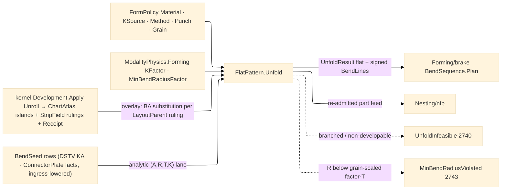

# [RASM_FABRICATION_FLAT_PATTERN]

The ONE unfold owner: `FlatPattern.Unfold` projects a formed sheet source to its flat pattern plus the per-bend line set the brake plan consumes — the merged owner, never two half-pages. The bend projection is the four-scalar algebra over `(A, R, T, K)`: `BA = (π/180)·|A|·(R + K·T)` the bend allowance along the neutral fiber, `OSSB = tan(|A|·π/360)·(R + T)` the outside setback, `BD = 2·OSSB − BA` the bend deduction, `flatDelta = −BD` per bend — flat length = Σ outside flange dims − Σ BD. Bend DIRECTION is the SIGN of `BendLine.AngleDeg` (`+` up, `−` down) — the one column the brake's flip search dispatches on; a direction-less bend row cannot drive a brake plan. The K factor resolves through the `KSource` policy rows, each row carrying its OWN `[UseDelegateFromConstructor]` `Resolve` law: `table-row` reads the `KFactorTable` (material × R/T band × the `BendMethod.KBias` method column, monotone-interpolated when a production series carries ≥ 3 bands, clamped to `[0.25, 0.50]`, falling back to the physics `Formed.KFactor` base when no row matches), `coupon-back-solve` reads the policy-carried `CouponK` solved ONCE through `SolveK` (`K = (BA_measured·180/(π·A) − R)/T` where `BA_measured = L_flat − Σ(flange − OSSB)`), and `din-6935` derives `K = min(1, 0.65 + 0.5·log₁₀(R/T))/2` (the DIN correction `k` halved — DIN places the neutral line at `s/2·k` from the inside face). The Y-factor rides the same rail as a projection (`Y = K·π/2`), never a second policy axis. `FormPolicy` mints HERE — the `Run(Form)` policy case carries it, and it resolves `Material` and thickness ONCE (the `FabricationInput` carrier holds neither, so the policy is the material/thickness boundary); the owner case body composes `FlatPattern.Unfold → BendSequence.Plan → FormedResult` whose ONE `flat-pattern` content key digests the flat AND the bend-step rows together.

Unfold is the OVERLAY over the kernel development owner, never a second unroll engine: the surface lane routes `DevelopOp.Unroll` (NOT `Decompose` — only `Unroll` yields the planar `ChartAtlas` and the `DevelopmentReceipt` isometry witness; `Decompose` stops at UV-space strips with no flat and no receipt) through kernel `Development.Apply`, reads `DevelopmentResult.Unrolled(Atlas, Field, Receipt)` — the flat is the atlas `UvIsland` planar boundaries, the bend lines are the `StripField.LayoutParent` rulings (a kernel ruling shared by two strips IS a bend line), and the overlay substitutes the per-bend neutral-fiber `BA` where the isometric unroll placed the arc's developed width. The lane's source is the kernel `SurfaceResult.UvTessellation` — mesh + per-vertex UV + live `NurbsForm.Surface` binding — carried on the `FormSource.Surface` case, because the kernel states a bare world-space mesh cannot feed the pipeline by construction; `AdmittedComponent.Mesh` is such a bare mesh and therefore feeds NO unfold lane. The profile lane unfolds analytically: bend-annotated profiles cross as `BendSeed` rows (line, signed angle, optional radius — the DSTV `KA` and `ConnectorPlate`/`PlateStock` reads lower to this row at the ingress boundary), and the projection is pure `(A,R,T,K)` arithmetic. Relief, corner, and hem vocabulary are bounded rows APPLIED in the fold: `ReliefKind` (`rectangular`/`obround`/`tear`) loops sized `≥ T` wide and `BA/2 + clearance·T` deep subtract at every intersecting-bend corner through the ONE `PolygonAlgebra.Clip` difference; `HemKind` (`closed`/`open`/`teardrop`) rows carry their allowance LAW as a delegate column (`closed` → the `1.5·T` practical row, `open`/`teardrop` → the full `BA(180°, R)` projection), and a seed whose `|angle|` reaches the hem floor takes the hem allowance in place of `BA`. A demanded inside radius under the `Formed.MinBendRadiusFactor·T` floor — scaled by the `GrainLaw.ParallelPenalty` when the bend line runs within 45° of the rolling direction — routes `MinBendRadiusViolated` 2743; a non-developable unroll (torsal residual over policy) or branched tangent graph routes `UnfoldInfeasible` 2740; an open profile demanded closed routes `OpenLoop(FabConcern.Form)` 2704.

Wire posture: HOST-LOCAL. The flat pattern crosses as `Arr<Loop>` on `FormedResult` with the ONE `flat-pattern` `ContentKey` (flat + bend rows in one preimage — `EgressKind.BendProgram` stays unminted on this carrier; a second key demands a second `FormedResult` slot, an owner-page decision); the flat feeds `Nesting/nfp` as a true-shape part by re-admission across runs; no DXF writer lands here — the CAD write leg is AppUi's, and the flat reaches it only as the insulated result payload. The physics row reads `material.Physics.Find(ProcessModality.Formed)` directly — the ONE forming-physics access path; the `RemovalParameter.Budget` projection is NOT on this seam.

## [01]-[INDEX]

- [01]-[FLAT_PATTERN]: owns the `KSource`/`ReliefKind`/`HemKind` vocabularies with their delegate-column laws, the `KFactorTable` rows and resolution fold, the `BendSeed`/`FormSource`/`FormPolicy`/`GrainLaw` carriers, the `BendProjection`/`BendLine`/`UnfoldResult` plane-local models, the `(A,R,T,K)` bend-projection algebra with signed direction, and the ONE `FlatPattern.Unfold` fold over the surface (kernel `Development.Apply` `Unroll` overlay) and profile (analytic seed) lanes — the unfold half the `Run(Form)` case body composes before `Forming/brake#BEND_SEQUENCE`.

## [02]-[FLAT_PATTERN]

- Owner: `KSource` `[SmartEnum<string>]` the K-resolution policy whose rows CARRY their resolution law as a `[UseDelegateFromConstructor]` `Resolve(KQuery)` column — a central K switch or a per-source resolver family is unconstructable; `ReliefKind`/`HemKind` `[SmartEnum<string>]` the bounded relief/hem vocabularies, the hem allowance a delegate column; `KFactorRow` + `KFactorTable` the seed rows (material × R/T band × air-method K, 9 seeds; `BendMethod.KBias` biases per method, clamp `[0.25, 0.50]`; a material×method series with ≥ 3 bands resolves through MathNet `Interpolate.CubicSplineMonotone` over band midpoints — production rows enter through the same CSV/QIF data-ingress discipline as the Kienzle table, never hand-transcribed vendor cards); `BendSeed` the analytic-lane bend annotation (line, SIGNED angle, optional radius); `FormSource` `[Union]` the polymorphic target — `Profile(Seq<BendSeed>)` reads `FabricationInput.Profiles`, `Component(AdmittedComponent, Seq<BendSeed>)` reads the component profiles + `SheetThicknessMm`, `Surface(SurfaceResult.UvTessellation)` the kernel-bound unroll lane; `FormPolicy` the ONE policy carrier the `Run(Form)` case holds (source, `Material`, K source, `BendMethod`, `PunchKind`, relief/hem rows, thickness, die-width override, coupon K, grain law); `GrainLaw` the rolling-direction row (angle + parallel radius penalty); `BendProjection` the `(BA, BD, OSSB, flatDelta)` receipt; `BendLine` the per-bend plane row (`Edge3` line, signed angle, radius, K, BA); `UnfoldResult` the flat + bend-line product `Forming/brake` consumes; `FlatPattern` the static surface owning `Unfold`, the `Project` bend algebra, `SolveK`, and the shared `FormedRow` physics accessor sheet, brake, and tube all read.
- Cases: `KSource` rows 3, each with its `Resolve` delegate; `ReliefKind` rows 3; `HemKind` rows 3 with allowance delegates; `KFactorTable` seed rows 9 (mild-steel/aluminium/stainless × R/T bands {<1, 1-3, ≥3} at air); the two `Unfold` lanes discriminate on the `FormSource` case — surface (kernel `Unroll` overlay) and profile (analytic seeds) — one fold, no `UnfoldMesh`/`UnfoldProfile` siblings.
- Entry: `public static Fin<UnfoldResult> Unfold(FormPolicy policy, FabricationInput input)` — the ONE unfold fold the `Run(Form)` case body composes; `public static BendProjection Project(double angleDeg, double insideRadiusMm, double thicknessMm, double k)` the pure bend algebra every consumer reads (brake re-projects per die selection; `|angle|` drives the algebra, the sign is direction); `public static Fin<double> SolveK(double measuredFlatMm, Arr<double> flangeMm, double angleDeg, double insideRadiusMm, double thicknessMm)` the coupon inverse whose result the policy carries as `CouponK`.
- Auto: the surface lane folds `Development.Apply(new DevelopOp.Unroll(source, DevelopOf(thickness)))` and maps the `Unrolled` result — `Atlas.Islands` planar boundaries → flat `Loop`s, `Field.LayoutParent` rulings → `BendLine`s with K resolved per station through the policy's `KSource.Resolve` row and `BA` substituted at each ruling, `Receipt` → the isometry evidence; the profile lane maps `BendSeed` rows straight through `Resolve` + `Project`; reliefs subtract at intersecting-bend corners through `PolygonAlgebra.Clip` difference and hem-floor seeds take the `HemKind` allowance; `Forming/brake#BEND_SEQUENCE` consumes `UnfoldResult` and re-projects `BA` when die selection changes the working radius (`Ri ≈ 0.16·V` defeats the nominal R in air bending); `Nesting/nfp` receives the flat as a re-admitted part; the physics `Formed` row arrives via `FormedRow(material)` — the direct map read.
- Receipt: `UnfoldResult` carries the flat `Arr<Loop>`, the `Seq<BendLine>`, thickness, material, and the kernel `DevelopmentReceipt` isometry evidence when the surface lane ran — typed evidence end to end; the `FormedResult` egress case carries only atoms rows (`Arr<Loop>` + `Seq<BendStep>` + the ONE key over both) per ruling 5.
- Packages: kernel `Parametric/develop.md#Development.Apply` (`DevelopOp.Unroll` → `Unrolled(ChartAtlas, StripField, DevelopmentReceipt)` — the one unroll engine, composed), kernel `Parametric/surface.md` (`SurfaceResult.UvTessellation` — the surface-bound lane source), `Process/owner#FABRICATION_OWNER` atoms (`Loop`/`Edge3`/`AdmittedComponent`/`BendStep`/`EgressKind.FlatPattern`/`ContentKey`), `Process/physics#CUT_PARAMETER` (`ModalityPhysics.Forming` via the map read), `Geometry2D/algebra#POLYGON_ALGEBRA` (relief loop subtraction), `Forming/brake#BEND_SEQUENCE` (`BendMethod`/`PunchKind` — co-namespace axes), MathNet.Numerics (`Interpolate.CubicSplineMonotone` — the production-series K resolution), Thinktecture.Runtime.Extensions, LanguageExt.Core, `Rasm.Numerics` (`GeometryFault`), BCL inbox.
- Growth: a new K convention is one `KSource` row WITH its `Resolve` delegate — the build breaks until the delegate lands; a new relief or hem is one row with its columns; production K data is the data-ingress arm, never inline rows; the DSTV `KA`/`ConnectorPlate` reads lower to `BendSeed` at their ingress arms (`Ingress/steel`, `Ingress/element`) — the seed row is the ONE analytic-lane wire; `composite.md` (fishnet draping + AFP geodesic-parallel courses over the kernel on-mesh suite) admits LAST as its own page on a named consumer; zero new entrypoint surface.
- Boundary: this page is the ONE unfold owner and a second unroll engine — or a re-derived strip adjacency/MST beside the kernel `StripField.LayoutParent` columns — is the deleted form; `Decompose` cannot produce a flat or a receipt, so a mesh-lane claim over it is the named fiction; the kernel owns isometric development and this overlay owns ONLY neutral-fiber substitution and bend annotation; NO DXF/DWG writer lands here and the flat crosses only as the `FormedResult` payload; `FormPolicy` is the one policy carrier and a parallel `UnfoldPolicy`/`SheetPolicy` sibling is the deleted form; the K factor is a resolved scalar at the fold and a K literal in a downstream signature is the named defect; bend direction is the SIGN of the angle — a parallel direction flag beside a signed angle is the deleted form; Materials vocabulary (`ConnectorPlate`/`PlateStock`, groove rows) resolves to `BendSeed`/scalar facts at the ingress boundary, never a Materials type in-folder.

```csharp signature
// --- [RUNTIME_PRELUDE] ----------------------------------------------------------------------------------------------------------------------------
using LanguageExt;
using LanguageExt.Common;
using MathNet.Numerics;
using Rasm.Fabrication.Geometry2D;
using Rasm.Fabrication.Process;
using Rasm.Meshing;
using Rasm.Numerics;
using Rasm.Parametric;
using Rasm.Processing;
using Rhino.Geometry;
using Thinktecture;
using static LanguageExt.Prelude;

namespace Rasm.Fabrication.Forming;

// --- [TYPES] --------------------------------------------------------------------------------------------------------------------------------------
// K resolution is ROW-OWNED behavior: each source carries its Resolve law, so a central K switch and a
// per-source resolver family are both unconstructable; a new convention is one row WITH its delegate.
[SmartEnum<string>]
public sealed partial class KSource {
    public static readonly KSource TableRow = new("table-row", static q => KFactorTable.K(q.Material, q.Method, q.InsideRadiusMm / Math.Max(1e-9, q.ThicknessMm)).IfNone(q.BaseK));
    public static readonly KSource CouponBackSolve = new("coupon-back-solve", static q => q.CouponK.IfNone(q.BaseK));
    public static readonly KSource Din6935 = new("din-6935", static q => FlatPattern.KDin6935(q.InsideRadiusMm, q.ThicknessMm));

    [UseDelegateFromConstructor]
    public partial double Resolve(KQuery query);
}

[SmartEnum<string>]
public sealed partial class ReliefKind {
    public static readonly ReliefKind Rectangular = new("rectangular", widthFactor: 1.0, depthClearance: 0.5);
    public static readonly ReliefKind Obround = new("obround", widthFactor: 1.0, depthClearance: 0.5);
    public static readonly ReliefKind Tear = new("tear", widthFactor: 0.5, depthClearance: 0.0);

    public double WidthFactor { get; }        // relief width = factor · T, floored at T
    public double DepthClearance { get; }     // relief depth = BA/2 + clearance · T
}

// The hem allowance is a LAW, not a factor: closed hems take the 1.5·T practical row, open/teardrop the
// full BA(180°, R) projection — one delegate column, no allowance-factor arithmetic at the call site.
[SmartEnum<string>]
public sealed partial class HemKind {
    public static readonly HemKind Closed = new("closed", static (t, _, _) => 1.5 * t);
    public static readonly HemKind Open = new("open", static (t, r, k) => FlatPattern.Project(180.0, r, t, k).BaMm);
    public static readonly HemKind Teardrop = new("teardrop", static (t, r, k) => FlatPattern.Project(180.0, r, t, k).BaMm);

    [UseDelegateFromConstructor]
    public partial double Allowance(double thicknessMm, double radiusMm, double k);
}

// --- [MODELS] -------------------------------------------------------------------------------------------------------------------------------------
public readonly record struct KQuery(Material Material, BendMethod Method, double InsideRadiusMm, double ThicknessMm, Option<double> CouponK, double BaseK);

public readonly record struct KFactorRow(Material Material, double RtLow, double RtHigh, BendMethod Method, double K);

// Seed rows at air; BendMethod.KBias shifts per method; a production material×method series with >= 3 bands
// resolves through the monotone spline over band midpoints, seeds through the band row — one fold, two data depths.
public static class KFactorTable {
    public const double Floor = 0.25;
    public const double Ceiling = 0.50;

    static readonly Arr<KFactorRow> Rows = Array(
        new KFactorRow(Material.MildSteel, 0.0, 1.0, BendMethod.Air, 0.33), new KFactorRow(Material.MildSteel, 1.0, 3.0, BendMethod.Air, 0.40), new KFactorRow(Material.MildSteel, 3.0, double.MaxValue, BendMethod.Air, 0.50),
        new KFactorRow(Material.Aluminium, 0.0, 1.0, BendMethod.Air, 0.35), new KFactorRow(Material.Aluminium, 1.0, 3.0, BendMethod.Air, 0.42), new KFactorRow(Material.Aluminium, 3.0, double.MaxValue, BendMethod.Air, 0.50),
        new KFactorRow(Material.Stainless, 0.0, 1.0, BendMethod.Air, 0.38), new KFactorRow(Material.Stainless, 1.0, 3.0, BendMethod.Air, 0.45), new KFactorRow(Material.Stainless, 3.0, double.MaxValue, BendMethod.Air, 0.50));

    public static Option<double> K(Material material, BendMethod method, double rt) {
        Arr<KFactorRow> series = Rows.Filter(r => r.Material == material);
        Option<double> raw = series.Count >= 3
            ? Optional(Interpolate.CubicSplineMonotone(
                [.. series.Map(static r => (r.RtLow + Math.Min(r.RtHigh, 6.0)) / 2.0)],
                [.. series.Map(static r => r.K)]).Interpolate(Math.Min(rt, 6.0)))
            : series.Filter(r => rt >= r.RtLow && rt < r.RtHigh).HeadOrNone().Map(static r => r.K);
        return raw.Map(k => Math.Clamp(k + method.KBias, Floor, Ceiling));
    }
}

// The analytic-lane bend annotation: DSTV KA rows and ConnectorPlate/PlateStock facts lower to this row at
// their ingress arms. AngleDeg is SIGNED (+up/−down) — direction is the sign, never a parallel flag.
public readonly record struct BendSeed(Edge3 Line, double AngleDeg, Option<double> RadiusMm);

// Grain law: bend lines within 45° of the rolling direction multiply the min-radius floor by the penalty.
public readonly record struct GrainLaw(double AngleDeg, double ParallelPenalty);

// Polymorphic unfold target. Surface carries the kernel-bound tessellation because a bare world-space mesh
// cannot feed Development.Apply by construction; AdmittedComponent.Mesh therefore feeds no lane.
[Union(ConversionFromValue = ConversionOperatorsGeneration.None)]
public abstract partial record FormSource {
    private FormSource() { }

    public sealed record Profile(Seq<BendSeed> Bends) : FormSource;
    public sealed record Component(AdmittedComponent Admitted, Seq<BendSeed> Bends) : FormSource;
    public sealed record Surface(SurfaceResult.UvTessellation Source) : FormSource;
}

// Minted HERE: the Run(Form) policy payload and the material/thickness boundary (FabricationInput carries
// neither). DieWidthFactor None = the brake die-rule band decides; CouponK is SolveK's once-solved result.
public sealed record FormPolicy(
    FormSource Source, Material Material, KSource KSource, BendMethod Method, PunchKind Punch,
    ReliefKind Relief, HemKind Hem, Option<double> ThicknessMm, Option<double> DieWidthFactor,
    Option<double> CouponK, Option<GrainLaw> Grain);

public readonly record struct BendProjection(double BaMm, double BdMm, double OssbMm, double FlatDeltaMm);

public sealed record BendLine(Edge3 Line, double AngleDeg, double InsideRadiusMm, double K, double BaMm);

public sealed record UnfoldResult(Arr<Loop> Flat, Seq<BendLine> Bends, double ThicknessMm, Material Material, Option<DevelopmentReceipt> Isometry);

// --- [OPERATIONS] ---------------------------------------------------------------------------------------------------------------------------------
public static class FlatPattern {
    const double HemAngleFloorDeg = 175.0;

    // The owner#run Form-arm terminal mint: ONE flat-pattern key digests the flat AND the bend rows — two
    // programs over one flat never collide; length prefixes keep loop grouping in the preimage.
    public static FabricationResult Formed(UnfoldResult unfold, Seq<BendStep> bends) =>
        new FabricationResult.FormedResult(
            unfold.Flat, bends,
            bends.Map(static b => b.OverbendDeg).Fold(0.0, Math.Max),
            ContentKey.Of(EgressKind.FlatPattern, CanonicalBytes(unfold.Flat, bends)));

    static byte[] CanonicalBytes(Arr<Loop> flat, Seq<BendStep> bends) {
        System.Buffers.ArrayBufferWriter<byte> writer = new();
        WriteCount(writer, flat.Count);
        flat.Iter(loop => {
            WriteCount(writer, loop.Count);
            for (int i = 0; i < loop.Count; i++) {
                Point3d v = loop.At(i);
                WriteDouble(writer, v.X); WriteDouble(writer, v.Y); WriteDouble(writer, loop.BulgeAt(i));
            }
        });
        WriteCount(writer, bends.Count);
        bends.Iter(b => { WriteDouble(writer, b.AngleDeg); WriteDouble(writer, b.RadiusMm); WriteDouble(writer, b.KFactor); WriteDouble(writer, b.OverbendDeg); });
        return writer.WrittenSpan.ToArray();
    }

    static void WriteCount(System.Buffers.ArrayBufferWriter<byte> writer, int count) {
        System.Buffers.Binary.BinaryPrimitives.WriteInt32LittleEndian(writer.GetSpan(4), count);
        writer.Advance(4);
    }

    static void WriteDouble(System.Buffers.ArrayBufferWriter<byte> writer, double value) {
        System.Buffers.Binary.BinaryPrimitives.WriteDoubleLittleEndian(writer.GetSpan(8), value);
        writer.Advance(8);
    }

    // Forming's ONE physics accessor — sheet, brake, and tube all read the material's Formed row through here;
    // a material without the formed map entry is degenerate input, never a default.
    internal static Fin<ModalityPhysics.Forming> FormedRow(Material material) =>
        material.Physics.Find(ProcessModality.Formed)
            .Bind(static p => p is ModalityPhysics.Forming f ? Some(f) : None)
            .ToFin(GeometryFault.DegenerateInput($"flat-pattern:{material.Key}-lacks-formed").ToError());

    // The (A,R,T,K) algebra over |angle|: BA along the neutral fiber, OSSB to the mold-line apex, BD the
    // per-bend flat shrink; the angle SIGN is direction and never enters the magnitude algebra.
    public static BendProjection Project(double angleDeg, double insideRadiusMm, double thicknessMm, double k) {
        double a = Math.Abs(angleDeg);
        double ba = Math.PI / 180.0 * a * (insideRadiusMm + (k * thicknessMm));
        double ossb = Math.Tan(a * Math.PI / 360.0) * (insideRadiusMm + thicknessMm);
        double bd = (2.0 * ossb) - ba;
        return new BendProjection(ba, bd, ossb, -bd);
    }

    public static double YFactor(double k) => k * Math.PI / 2.0;

    // DIN 6935 correction k = 0.65 + 0.5·log10(R/T) capped at 1; neutral line at (T/2)·k ⇒ K = k/2.
    public static double KDin6935(double insideRadiusMm, double thicknessMm) =>
        Math.Min(1.0, 0.65 + (0.5 * Math.Log10(insideRadiusMm / Math.Max(1e-9, thicknessMm)))) / 2.0;

    // Coupon inverse: BA_measured = flat − Σ(flange − OSSB); K = (BA·180/(π·A) − R)/T. The result rides
    // FormPolicy.CouponK — solved once, read by the coupon-back-solve row per bend.
    public static Fin<double> SolveK(double measuredFlatMm, Arr<double> flangeMm, double angleDeg, double insideRadiusMm, double thicknessMm) {
        double a = Math.Abs(angleDeg);
        double ossb = Math.Tan(a * Math.PI / 360.0) * (insideRadiusMm + thicknessMm);
        double ba = measuredFlatMm - flangeMm.Sum(f => f - ossb);
        double k = ((ba * 180.0 / (Math.PI * a)) - insideRadiusMm) / thicknessMm;
        return double.IsFinite(k) && k is > 0.0 and < 1.0
            ? Fin.Succ(k)
            : Fin.Fail<double>(GeometryFault.DegenerateInput($"flat-pattern:coupon-k:{k:0.###}").ToError());
    }

    // ONE fold, two lanes discriminated by the FormSource case: Surface (kernel Unroll overlay — islands are
    // the flat, LayoutParent rulings the bend lines, BA substituted per station) and Profile/Component
    // (analytic BendSeed projection). Every lane exits through relief subtraction and the grain-aware radius gate.
    public static Fin<UnfoldResult> Unfold(FormPolicy policy, FabricationInput input) =>
        FormedRow(policy.Material).Bind(formed =>
            (policy.Source switch {
                FormSource.Surface s => SurfaceLane(s.Source, policy, formed),
                FormSource.Component c => ProfileLane(c.Admitted.Profiles, c.Bends, c.Admitted.SheetThicknessMm | policy.ThicknessMm, policy, formed),
                FormSource.Profile p => ProfileLane(input.Profiles, p.Bends, policy.ThicknessMm, policy, formed),
                _ => Fin.Fail<UnfoldResult>(GeometryFault.DegenerateInput("flat-pattern:source").ToError()),
            })
            .Bind(r => Relieved(r, policy.Relief))
            .Bind(r => GateRadii(r, formed.MinBendRadiusFactor, policy.Grain)));

    // Surface lane: Development.Apply(Unroll) is the ONLY planar-yielding kernel op; the develop policy threads
    // verified kernel knobs resolved from thickness, never a kernel-side default literal. Islands → flat Loops;
    // LayoutParent rulings → BendLines with K resolved per station and BA substituted at the placed ruling.
    static Fin<UnfoldResult> SurfaceLane(SurfaceResult.UvTessellation source, FormPolicy policy, ModalityPhysics.Forming formed) =>
        policy.ThicknessMm
            .ToFin(GeometryFault.DegenerateInput("flat-pattern:thickness").ToError())
            .Bind(t => Development.Apply(new DevelopOp.Unroll(source, DevelopOf(t))).Bind(dev => dev switch {
                DevelopmentResult.Unrolled u when Branches(u.Field) > 0 =>
                    Fin.Fail<UnfoldResult>(FabricationFault.UnfoldInfeasible(u.Field.RailOffsets.Count, Branches(u.Field)).ToError()),
                DevelopmentResult.Unrolled u => Fin.Succ(new UnfoldResult(
                    [.. u.Atlas.Islands.Map(IslandLoop)],
                    Substituted(source, u.Field, t, policy, formed),
                    t, policy.Material, Some(u.Receipt))),
                _ => Fin.Fail<UnfoldResult>(GeometryFault.DegenerateInput("flat-pattern:unroll-shape").ToError()),
            }));

    // Profile lane: BendSeed rows are flange-true — pure Resolve + Project arithmetic; a seed at the hem floor
    // takes the HemKind allowance in place of BA; a seed without a radius takes the physics floor radius.
    static Fin<UnfoldResult> ProfileLane(Arr<Loop> profiles, Seq<BendSeed> seeds, Option<double> thickness, FormPolicy policy, ModalityPhysics.Forming formed) =>
        profiles.ForAll(static p => p.Closed)
            ? thickness
                .ToFin(GeometryFault.DegenerateInput("flat-pattern:thickness").ToError())
                .Map(t => new UnfoldResult(
                    profiles,
                    seeds.Map(seed => Annotated(seed, t, policy, formed)),
                    t, policy.Material, None))
            : Fin.Fail<UnfoldResult>(FabricationFault.OpenLoop(FabConcern.Form, profiles.FindIndex(static p => !p.Closed)).ToError());

    static BendLine Annotated(BendSeed seed, double t, FormPolicy policy, ModalityPhysics.Forming formed) {
        double radius = seed.RadiusMm.IfNone(formed.MinBendRadiusFactor * t);
        double k = policy.KSource.Resolve(new KQuery(policy.Material, policy.Method, radius, t, policy.CouponK, formed.KFactor));
        double ba = Math.Abs(seed.AngleDeg) >= HemAngleFloorDeg
            ? policy.Hem.Allowance(t, radius, k)
            : Project(seed.AngleDeg, radius, t, k).BaMm;
        return new BendLine(seed.Line, seed.AngleDeg, radius, k, ba);
    }

    // Ruling substitution: each LayoutParent edge is a bend station — the placed ruling segment becomes the
    // BendLine, the fold angle is the source-mesh dihedral across the ruling (the field is planar; the fold
    // angle is the ONE datum the overlay derives itself), K resolves per station.
    static Seq<BendLine> Substituted(SurfaceResult.UvTessellation source, StripField field, double t, FormPolicy policy, ModalityPhysics.Forming formed) =>
        toSeq(Enumerable.Range(0, field.LayoutParent.Count).Where(i => field.LayoutParent[i] >= 0)).Map(i => {
            Edge3 line = new(Planar(field.RulingA[i]), Planar(field.RulingB[i]));
            double angleDeg = Dihedral(source, field, i);
            double radius = ArcRadius(field, i, Math.Abs(angleDeg));
            double k = policy.KSource.Resolve(new KQuery(policy.Material, policy.Method, radius, t, policy.CouponK, formed.KFactor));
            return new BendLine(line, angleDeg, radius, k, Project(angleDeg, radius, t, k).BaMm);
        });

    static Point3d Planar(Point2d uv) => new(uv.X, uv.Y, 0.0);

    // Signed fold angle: mean source-mesh face normals on each side of the ruling; the cross against the
    // ruling direction signs up/down. Zero-area sides read collinear and contribute no bend row upstream.
    static double Dihedral(SurfaceResult.UvTessellation source, StripField field, int ruling) {
        (Vector3d left, Vector3d right, Vector3d along) = SideNormals(source, field, ruling);
        double magnitude = Vector3d.VectorAngle(left, right) * 180.0 / Math.PI;
        return Math.CopySign(magnitude, Vector3d.CrossProduct(left, right) * along);
    }

    // The developed arc width the unroll placed at the station recovers the formed radius: R = width/θ; the
    // width is the ruling-offset span across the bend region read off the field columns.
    static double ArcRadius(StripField field, int ruling, double angleDeg) =>
        angleDeg <= 0.0 ? 0.0 : RulingSpan(field, ruling) / (angleDeg * Math.PI / 180.0);

    static Fin<UnfoldResult> Relieved(UnfoldResult result, ReliefKind relief) =>
        Corners(result) is var corners && corners.IsEmpty
            ? Fin.Succ(result)
            : PolygonAlgebra.Clip(toSeq(result.Flat), corners.Map(c => ReliefLoop(c, result.ThicknessMm, relief)), ClipOp.Difference)
                .Map(cut => result with { Flat = [.. cut] });

    // Relief geometry: width = max(T, factor·T), depth = BA/2 + clearance·T at each pair of bend lines whose
    // endpoints meet inside the flat — the ONE Clip difference; hand-stitched vertex surgery is the deleted form.
    static Loop ReliefLoop((Point3d At, BendLine A, BendLine B) corner, double t, ReliefKind relief) =>
        Box(corner.At, Math.Max(t, relief.WidthFactor * t), ((corner.A.BaMm + corner.B.BaMm) / 4.0) + (relief.DepthClearance * t));

    static Seq<(Point3d At, BendLine A, BendLine B)> Corners(UnfoldResult result) =>
        result.Bends.Bind(a => result.Bends.Filter(b => !ReferenceEquals(a, b) && Meets(a.Line, b.Line)).Map(b => (Meet(a.Line, b.Line), a, b)));

    // Radius gate every lane exits through: floor = factor·T, scaled by the grain penalty when the bend line
    // runs within 45° of the rolling direction; the first violating bend routes 2743 with its index.
    static Fin<UnfoldResult> GateRadii(UnfoldResult result, double minRadiusFactor, Option<GrainLaw> grain) =>
        result.Bends
            .Map((b, i) => (Index: i, Bend: b, Floor: minRadiusFactor * result.ThicknessMm * GrainScale(b, grain)))
            .Filter(row => row.Bend.InsideRadiusMm < row.Floor)
            .HeadOrNone()
            .Match(
                Some: row => Fin.Fail<UnfoldResult>(FabricationFault.MinBendRadiusViolated(row.Index, row.Bend.InsideRadiusMm, row.Floor).ToError()),
                None: () => Fin.Succ(result));

    static double GrainScale(BendLine bend, Option<GrainLaw> grain) =>
        grain.Map(g => AngleTo(bend.Line, g.AngleDeg) < 45.0 ? g.ParallelPenalty : 1.0).IfNone(1.0);

    // --- [STATION_KERNELS]
    // Small declared kernels — every member the lanes reach resolves HERE; a named-but-bodiless helper is the
    // fence defect this page forecloses.
    static DevelopPolicy DevelopOf(double thicknessMm) =>
        new(StripWidth: 4.0 * thicknessMm, RulingStations: 16, TorsalTolerance: 1e-3, IsometryBudget: 1e-4, Seed: 0);

    // A ruling whose strip is referenced as LayoutParent by >1 sibling marks a branched tangent graph.
    static int Branches(StripField field) =>
        field.LayoutParent.Filter(static p => p >= 0).GroupBy(static p => p).Count(static g => g.Count() > 1);

    // Island boundary: edges used by exactly one face, chained into the planar Loop over the island Uv.
    static Loop IslandLoop(UvIsland island) {
        Seq<(int A, int B)> boundary = toSeq(island.Faces)
            .Bind(static f => Seq((Math.Min(f.A, f.B), Math.Max(f.A, f.B)), (Math.Min(f.B, f.C), Math.Max(f.B, f.C)), (Math.Min(f.C, f.A), Math.Max(f.C, f.A))))
            .GroupBy(static e => e).Filter(static g => g.Count() == 1).Map(static g => g.Key).ToSeq();
        Seq<int> cycle = Chained(boundary);
        return new Loop([.. cycle.Map(v => Planar(island.Uv[v]))], Closed: true);
    }

    static Seq<int> Chained(Seq<(int A, int B)> edges) =>
        edges.Fold(Seq<int>(), (walk, edge) => walk.IsEmpty
            ? Seq(edge.A, edge.B)
            : walk.Last == edge.A ? walk.Add(edge.B) : walk.Last == edge.B ? walk.Add(edge.A) : walk);

    static (Vector3d Left, Vector3d Right, Vector3d Along) SideNormals(SurfaceResult.UvTessellation source, StripField field, int ruling) {
        Point2d a = field.RulingA[ruling], b = field.RulingB[ruling];
        Point2d mid = new((a.X + b.X) / 2.0, (a.Y + b.Y) / 2.0);
        Vector3d along = new(b.X - a.X, b.Y - a.Y, 0.0);
        Vector3d left = MeshNormalNear(source, mid, offset: new Point2d(-along.Y, along.X));
        Vector3d right = MeshNormalNear(source, mid, offset: new Point2d(along.Y, -along.X));
        return (left, right, along);
    }

    // Nearest-face normal probe on the UV side of the ruling: MeshEdit.Of is the ONE kernel mesh adapter
    // (intersect-page law); the probe keys the face whose Uv centroid sits nearest the offset point.
    static Vector3d MeshNormalNear(SurfaceResult.UvTessellation source, Point2d at, Point2d offset) {
        MeshEdit soup = MeshEdit.Of(source.Mesh);
        Point2d probe = new(at.X + (0.05 * offset.X), at.Y + (0.05 * offset.Y));
        (int A, int B, int C) face = soup.Faces.OrderBy(f => probe.DistanceTo(Centroid(source.Uv[f.A], source.Uv[f.B], source.Uv[f.C]))).First();
        return Vector3d.CrossProduct(soup.Vertices[face.B] - soup.Vertices[face.A], soup.Vertices[face.C] - soup.Vertices[face.A]);
    }

    static Point2d Centroid(Point2d a, Point2d b, Point2d c) => new((a.X + b.X + c.X) / 3.0, (a.Y + b.Y + c.Y) / 3.0);

    static double RulingSpan(StripField field, int ruling) {
        int strip = field.Component[ruling];
        int lo = field.RulingOffsets[strip], hi = ruling < field.RulingOffsets.Count - 1 ? field.RulingOffsets[strip + 1] : field.RulingA.Count;
        return hi - lo > 1 ? field.RulingA[Math.Min(ruling + 1, hi - 1)].DistanceTo(field.RulingA[Math.Max(ruling - 1, lo)]) / 2.0 : 0.0;
    }

    // Exact corner probe: two bend segments meet when each straddles the other's carrier — four Orient2D signs,
    // the kernel exact floor, never a float epsilon.
    static bool Meets(Edge3 p, Edge3 q) =>
        Predicate.Orient2D(p.A, p.B, q.A) != Predicate.Orient2D(p.A, p.B, q.B)
        && Predicate.Orient2D(q.A, q.B, p.A) != Predicate.Orient2D(q.A, q.B, p.B);

    static Point3d Meet(Edge3 p, Edge3 q) {
        double d = ((p.B.X - p.A.X) * (q.B.Y - q.A.Y)) - ((p.B.Y - p.A.Y) * (q.B.X - q.A.X));
        double s = (((q.A.X - p.A.X) * (q.B.Y - q.A.Y)) - ((q.A.Y - p.A.Y) * (q.B.X - q.A.X))) / d;
        return new Point3d(p.A.X + (s * (p.B.X - p.A.X)), p.A.Y + (s * (p.B.Y - p.A.Y)), 0.0);
    }

    static double AngleTo(Edge3 line, double grainAngleDeg) {
        double lineDeg = Math.Atan2(line.B.Y - line.A.Y, line.B.X - line.A.X) * 180.0 / Math.PI;
        double delta = Math.Abs(lineDeg - grainAngleDeg) % 180.0;
        return Math.Min(delta, 180.0 - delta);
    }

    static Loop Box(Point3d center, double width, double depth) =>
        new(Arr(
            new Point3d(center.X - (width / 2.0), center.Y - (depth / 2.0), 0.0),
            new Point3d(center.X + (width / 2.0), center.Y - (depth / 2.0), 0.0),
            new Point3d(center.X + (width / 2.0), center.Y + (depth / 2.0), 0.0),
            new Point3d(center.X - (width / 2.0), center.Y + (depth / 2.0), 0.0)), Closed: true);
}
```


