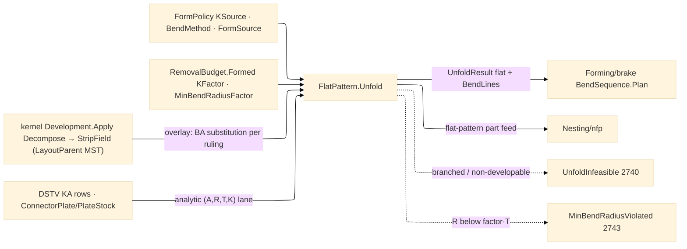

# [RASM_FABRICATION_FLAT_PATTERN]

The ONE unfold owner: `FlatPattern.Unfold` projects a formed sheet component to its flat pattern plus the per-bend line set the brake plan consumes — the merged N5/domain-D owner, never two half-pages. The bend projection is the four-scalar algebra over `(A, R, T, K)`: `BA = (π/180)·A·(R + K·T)` the bend allowance along the neutral fiber, `OSSB = tan(A·π/360)·(R + T)` the outside setback, `BD = 2·OSSB − BA` the bend deduction, `flatDelta = −BD` per bend — flat length = Σ outside flange dims − Σ BD. The K factor resolves through the `KSource` policy axis: `table-row` reads the `KFactorTable` (material × R/T band × `BendMethod`, falling back to the physics `RemovalBudget.Formed.KFactor` base when no band row matches), `coupon-back-solve` inverts a measured coupon (`K = (BA_measured·180/(π·A) − R)/T` where `BA_measured = L_flat − Σ(flange − OSSB)`), and `din-6935` derives `K = min(1, 0.65 + 0.5·log₁₀(R/T))/2` (the DIN correction factor `k` halved — DIN places the neutral line at `s/2·k` from the inside face). The Y-factor rides the same rail as a projection (`Y = K·π/2`), never a second policy axis. `FormPolicy` mints HERE — the `Run(Form)` policy case carries it; the owner case body composes `FlatPattern.Unfold → BendSequence.Plan → FormedResult` under the `flat-pattern`/`bend-program` content keys.

Unfold is the OVERLAY over the kernel development owner, never a second unroll engine: the mesh lane routes `DevelopOp.Decompose` through kernel `Development.Apply`, reads the `StripField` SoA (`RailOffsets`/`RailUv`, `RulingOffsets`/`RulingA`/`RulingB`/`TorsalResidual`, `Component`, `LayoutParent`) — the kernel ALREADY computes the tangent-strip adjacency and the MST layout parent as columns — and substitutes the per-bend neutral-fiber allowance at each `LayoutParent` edge (a kernel ruling shared by two strips IS a bend line; the flat placement inserts `BA` where the kernel's isometric unroll placed the arc's developed width). The profile lane unfolds analytically without the kernel: a bend-annotated profile (DSTV `KA` rows via `DstvBend.CreateBend`, or a Materials `ConnectorPlate` whose `PlateStock.BendRadiusMm` + form-case fields imply the bend set) is already flange-dimensioned, so the projection is pure `(A,R,T,K)` arithmetic. Relief, corner, and hem vocabulary are bounded rows: `ReliefKind` (`rectangular`/`obround`/`tear`) sized `≥ T` wide and `BA/2 + clearance` deep at every intersecting-bend corner, `HemKind` (`closed`/`open`/`teardrop`) with allowance rows (closed hem `BA(180°, R≈0)` ≈ `1.5·T` practical, open/teardrop keep their radius). A demanded inside radius under the `Formed.MinBendRadiusFactor·T` floor routes `MinBendRadiusViolated` 2743; a tangent-face graph with branches (non-tree `LayoutParent` demand) or a non-developable strip (torsal residual over policy) routes `UnfoldInfeasible` 2740; an open profile demanded closed routes `OpenLoop(FabConcern.Form)` 2704.

Wire posture: HOST-LOCAL. The flat pattern crosses as `Arr<Loop>` on `FormedResult` with its `flat-pattern` `ContentKey`; the flat feeds `Nesting/nfp` as a true-shape part exactly like a kernel `DevelopmentReceipt` strip; no DXF writer lands here — the two-format CAD WRITE leg is AppUi's, and the flat pattern reaches it only as the insulated result payload.

## [01]-[INDEX]

- [01]-[FLAT_PATTERN]: owns the `KSource`/`ReliefKind`/`HemKind` vocabularies, the `KFactorTable` rows, the `FormPolicy`/`FormSource` policy carriers, the `BendLine`/`UnfoldResult` plane-local models, the `(A,R,T,K)` bend-projection algebra, and the ONE `FlatPattern.Unfold` fold over the mesh (kernel `Development.Apply` overlay) and profile (analytic) lanes — the unfold half the `Run(Form)` case body composes before `Forming/brake#BEND_SEQUENCE`.

## [02]-[FLAT_PATTERN]

- Owner: `KSource` `[SmartEnum<string>]` the K-resolution policy (`table-row`/`coupon-back-solve`/`din-6935`); `ReliefKind`/`HemKind` `[SmartEnum<string>]` the bounded relief/hem vocabularies with allowance columns; `KFactorRow` the seed table row (material key × R/T band × `BendMethod` × K) with the physics `Formed.KFactor` base as fallback — production rows enter through the same CSV/QIF data-ingress discipline as the Kienzle table, never hand-transcribed vendor cards; `FormSource` `[Union]` the polymorphic target (`Input` reads `FabricationInput.Model`/`Profiles`, `Component` carries an `AdmittedComponent` whose `SheetThicknessMm`/`Layers` seed T and material); `FormPolicy` the ONE policy carrier the `Run(Form)` case holds (source, K source, `BendMethod`, die-width-factor override); `BendProjection` the `(BA, BD, OSSB, flatDelta)` receipt; `BendLine` the per-bend plane row (`Edge3` line, angle, radius, K, BA); `UnfoldResult` the flat + bend-line product `Forming/brake` consumes; `FlatPattern` the static surface owning `Unfold` and the `Project` bend algebra.
- Cases: `KSource` rows 3; `ReliefKind` rows 3; `HemKind` rows 3; `KFactorTable` seed rows 9 (mild-steel/aluminium/stainless × R/T bands {<1, 1-3, ≥3} at `air` method; bottoming/coining bias columns −0.04/−0.08 per method, clamped to [0.25, 0.50]); the two Unfold lanes discriminate on `FormSource` + input shape — mesh (kernel strips) and profile (analytic) — one fold, no `UnfoldMesh`/`UnfoldProfile` siblings.
- Entry: `public static Fin<UnfoldResult> Unfold(FormPolicy policy, FabricationInput input)` — the ONE unfold fold the `Run(Form)` case body composes; `public static BendProjection Project(double angleDeg, double insideRadiusMm, double thicknessMm, double k)` the pure bend algebra every consumer reads (brake re-projects per die selection); `public static Fin<double> SolveK(double measuredFlatMm, Arr<double> flangeMm, double angleDeg, double insideRadiusMm, double thicknessMm)` the coupon inverse.
- Auto: the mesh lane folds `Development.Apply(DevelopOp.Decompose(source, policy))` and maps `StripField` columns — strips→flanges, `LayoutParent` rulings→`BendLine`s, torsal residual→developability verdict — substituting `BA` at each bend station; the profile lane maps DSTV `KA`/`ConnectorPlate` bend annotations straight through `Project`; K resolves once per bend through the `KSource` generated `Switch`; reliefs/hems are inserted as `Loop` edits in the flat (algebra `Offset`/`Clip` seam), never post-hoc geometry; `Forming/brake#BEND_SEQUENCE` consumes `UnfoldResult` and re-projects `BA` when die selection changes the working radius (`Ri ≈ 0.16·V` defeats the nominal R in air bending); `Nesting/nfp` receives the flat as a part; the physics `Formed` row arrives via `RemovalParameter.Budget(ProcessKind.PressBrake, material, tool, operation)`.
- Receipt: `UnfoldResult` carries the flat `Arr<Loop>`, the `Seq<BendLine>`, and the kernel `DevelopmentReceipt` isometry evidence when the mesh lane ran — typed evidence end to end; the `FormedResult` egress case carries only atoms rows (`Arr<Loop>` + `Seq<BendStep>` + key) per ruling 5.
- Packages: kernel `Parametric/develop.md#Development.Apply` (`DevelopOp.Decompose` → `StripField`/`DevelopmentReceipt` — the one unroll engine, composed), `Process/owner#FABRICATION_OWNER` atoms (`Loop`/`Edge3`/`AdmittedComponent`/`BendStep`/`EgressKind.FlatPattern`/`ContentKey`), `Process/physics#CUT_PARAMETER` (`RemovalBudget.Formed`), `Geometry2D/algebra#POLYGON_ALGEBRA` (relief/hem loop edits), `Forming/brake#BEND_SEQUENCE` (`BendMethod` — co-namespace axis), DSTV.Net (`DstvBend.CreateBend` `KA` rows — `.api/api-dstv-net.md`), `Rasm.Materials` `Component/connector#CONNECTOR_FAMILY` (`ConnectorPlate`/`PlateStock` raw fields at the AEC-peer boundary — the union at connector.md:193, the stock row at :185), Thinktecture.Runtime.Extensions, LanguageExt.Core, `Rasm.Numerics` (`GeometryFault`), BCL inbox.
- Growth: a new K convention is one `KSource` row + one resolution arm; a new relief or hem is one row with its allowance column; production K data is the data-ingress arm, never inline rows; `composite.md` (fishnet draping + AFP geodesic-parallel courses over the kernel K10-K13 on-mesh suite) admits LAST as its own page on a named consumer — recorded growth lane, not a page now; zero new entrypoint surface.
- Boundary: this page is the ONE unfold owner and a second unroll engine — or a re-derived strip adjacency/MST beside the kernel `StripField.LayoutParent` columns — is the deleted form; the kernel owns isometric development and this overlay owns ONLY neutral-fiber substitution and bend annotation; NO DXF/DWG writer lands here (AppUi's write leg) and the flat crosses only as the `FormedResult` payload; `FormPolicy` is the one policy carrier and a parallel `UnfoldPolicy`/`SheetPolicy` sibling is the deleted form; the K factor is a resolved scalar at the fold and a K literal in a downstream signature is the named defect; Materials joining vocabulary (`ConnectorPlate`/`PlateStock`, groove rows) is CONSUMED, never re-minted.

```csharp signature
// --- [RUNTIME_PRELUDE] ----------------------------------------------------------------------------------------------------------------------------
using LanguageExt;
using LanguageExt.Common;
using Rasm.Fabrication.Process;
using Rasm.Numerics;
using Rasm.Parametric;
using Rhino.Geometry;
using Thinktecture;
using static LanguageExt.Prelude;

namespace Rasm.Fabrication.Forming;

// --- [TYPES] --------------------------------------------------------------------------------------------------------------------------------------
[SmartEnum<string>]
public sealed partial class KSource {
    public static readonly KSource TableRow = new("table-row");
    public static readonly KSource CouponBackSolve = new("coupon-back-solve");
    public static readonly KSource Din6935 = new("din-6935");
}

[SmartEnum<string>]
public sealed partial class ReliefKind {
    public static readonly ReliefKind Rectangular = new("rectangular", widthFactor: 1.0, depthClearance: 0.5);
    public static readonly ReliefKind Obround = new("obround", widthFactor: 1.0, depthClearance: 0.5);
    public static readonly ReliefKind Tear = new("tear", widthFactor: 0.5, depthClearance: 0.0);

    public double WidthFactor { get; }        // relief width = factor · T, floored at T
    public double DepthClearance { get; }     // relief depth = BA/2 + clearance · T
}

[SmartEnum<string>]
public sealed partial class HemKind {
    public static readonly HemKind Closed = new("closed", allowanceFactor: 1.5);      // BA(180°, R→0) practical row
    public static readonly HemKind Open = new("open", allowanceFactor: 0.0);          // 0 = projected from real R
    public static readonly HemKind Teardrop = new("teardrop", allowanceFactor: 0.0);

    public double AllowanceFactor { get; }
}

// --- [MODELS] -------------------------------------------------------------------------------------------------------------------------------------
// Seed K rows: material key × R/T band × method; production rows ride the data-ingress arm. Physics Formed.KFactor is the floor.
public sealed record KFactorRow(Material Material, double RtLow, double RtHigh, BendMethod Method, double K);

// Polymorphic unfold target: input geometry or an admitted element component (sheet thickness + material off its rows).
[Union(ConversionFromValue = ConversionOperatorsGeneration.None)]
public abstract partial record FormSource {
    private FormSource() { }

    public sealed record Input() : FormSource;
    public sealed record Component(AdmittedComponent Admitted) : FormSource;
}

// Minted HERE: the Run(Form) policy payload. DieWidthFactor None = the brake die-rule band (V = f·T) decides.
public sealed record FormPolicy(FormSource Source, KSource KSource, BendMethod Method, Option<double> DieWidthFactor);

public readonly record struct BendProjection(double BaMm, double BdMm, double OssbMm, double FlatDeltaMm);

public sealed record BendLine(Edge3 Line, double AngleDeg, double InsideRadiusMm, double K, double BaMm);

public sealed record UnfoldResult(Arr<Loop> Flat, Seq<BendLine> Bends, double ThicknessMm, Material Material, Option<DevelopmentReceipt> Isometry);

// --- [OPERATIONS] ---------------------------------------------------------------------------------------------------------------------------------
public static class FlatPattern {
    // The owner#run Form-arm terminal mint: FormedResult carries the flat pattern under its flat-pattern key,
    // the brake bend rows under bend-program, and the worst overbend — atoms-safe rows only (ruling 5).
    public static FabricationResult Formed(UnfoldResult unfold, Seq<BendStep> bends) =>
        new FabricationResult.FormedResult(
            unfold.Flat,
            bends,
            bends.Map(static b => b.OverbendDeg).DefaultIfEmpty(0.0).Max(),
            ContentKey.Of(EgressKind.FlatPattern, FlatBytes(unfold.Flat)));

    // Canonical flat-pattern bytes: LE loop count, then per loop its LE vertex count followed by vertex
    // coordinates + bulges as LE doubles — the length prefixes make loop grouping part of the preimage,
    // so two groupings over identical vertex streams never digest to one flat-pattern key.
    static byte[] FlatBytes(Arr<Loop> flat) {
        System.Buffers.ArrayBufferWriter<byte> writer = new();
        WriteCount(writer, flat.Count);
        flat.Iter(loop => {
            WriteCount(writer, loop.Count);
            for (int i = 0; i < loop.Count; i++) {
                Point3d v = loop.At(i);
                System.Buffers.Binary.BinaryPrimitives.WriteDoubleLittleEndian(writer.GetSpan(8), v.X); writer.Advance(8);
                System.Buffers.Binary.BinaryPrimitives.WriteDoubleLittleEndian(writer.GetSpan(8), v.Y); writer.Advance(8);
                System.Buffers.Binary.BinaryPrimitives.WriteDoubleLittleEndian(writer.GetSpan(8), loop.BulgeAt(i)); writer.Advance(8);
            }
        });
        return writer.WrittenSpan.ToArray();
    }

    static void WriteCount(System.Buffers.ArrayBufferWriter<byte> writer, int count) {
        System.Buffers.Binary.BinaryPrimitives.WriteInt32LittleEndian(writer.GetSpan(4), count);
        writer.Advance(4);
    }

    // Forming's ONE physics accessor — sheet, brake, and tube all read the material's Formed row through here;
    // a material without the formed map entry is degenerate input, never a default.
    internal static Fin<ModalityPhysics.Forming> FormedRow(Material material) =>
        material.Physics.Find(ProcessModality.Formed).Match(
            Some: static p => p is ModalityPhysics.Forming f
                ? Fin.Succ(f)
                : Fin.Fail<ModalityPhysics.Forming>(GeometryFault.DegenerateInput($"flat-pattern:formed-shape:{material.Key}").ToError()),
            None: () => Fin.Fail<ModalityPhysics.Forming>(GeometryFault.DegenerateInput($"flat-pattern:{material.Key}-lacks-formed").ToError()));

    // The (A,R,T,K) algebra: BA along the neutral fiber, OSSB to the mold-line apex, BD the per-bend flat shrink.
    public static BendProjection Project(double angleDeg, double insideRadiusMm, double thicknessMm, double k) {
        double ba = Math.PI / 180.0 * angleDeg * (insideRadiusMm + k * thicknessMm);
        double ossb = Math.Tan(angleDeg * Math.PI / 360.0) * (insideRadiusMm + thicknessMm);
        double bd = 2.0 * ossb - ba;
        return new BendProjection(ba, bd, ossb, -bd);
    }

    public static double YFactor(double k) => k * Math.PI / 2.0;

    // DIN 6935 correction k = 0.65 + 0.5·log10(R/T) capped at 1; neutral line at (T/2)·k ⇒ K = k/2.
    public static double KDin6935(double insideRadiusMm, double thicknessMm) =>
        Math.Min(1.0, 0.65 + 0.5 * Math.Log10(insideRadiusMm / thicknessMm)) / 2.0;

    // Coupon inverse: BA_measured = flat − Σ(flange − OSSB); K = (BA·180/(π·A) − R)/T.
    public static Fin<double> SolveK(double measuredFlatMm, Arr<double> flangeMm, double angleDeg, double insideRadiusMm, double thicknessMm) {
        double ossb = Math.Tan(angleDeg * Math.PI / 360.0) * (insideRadiusMm + thicknessMm);
        double ba = measuredFlatMm - flangeMm.Sum(f => f - ossb);
        double k = (ba * 180.0 / (Math.PI * angleDeg) - insideRadiusMm) / thicknessMm;
        return double.IsFinite(k) && k is > 0.0 and < 1.0
            ? Fin.Succ(k)
            : Fin.Fail<double>(GeometryFault.DegenerateInput($"flat-pattern:coupon-k:{k:0.###}").ToError());
    }

    // ONE fold, two lanes discriminated by FormSource + input shape: mesh (kernel Development.Apply Decompose →
    // StripField overlay — LayoutParent rulings ARE the bend lines, BA substitutes at each station) and profile
    // (DSTV KA / ConnectorPlate analytic projection). MeshSpace → UvTessellation rides the kernel Parametric
    // surface front — the source arrives as the kernel type, never a local tessellator.
    public static Fin<UnfoldResult> Unfold(FormPolicy policy, FabricationInput input) =>
        (policy.Source switch {
            FormSource.Component c when c.Admitted.Mesh.IsSome => MeshLane(c.Admitted, policy),
            FormSource.Component c => ProfileLane(c.Admitted.Profiles, c.Admitted.SheetThicknessMm, policy),
            _ => ProfileLane(input.Profiles, None, policy),
        }).Bind(r => FormedRow(r.Material).Bind(f => GateRadii(r, f.MinBendRadiusFactor)));

    // Mesh lane: strips→flanges, LayoutParent rulings→BendLines; a non-tree parent set or an over-budget torsal
    // residual is the 2740 verdict. The develop policy threads verified kernel knobs (StripWidth/TorsalTolerance/
    // IsometryBudget/RulingStations), resolved from thickness — never a kernel-side default literal.
    static Fin<UnfoldResult> MeshLane(AdmittedComponent admitted, FormPolicy policy) =>
        Development.Apply(new DevelopOp.Decompose(SurfaceFront(admitted), DevelopOf(admitted.SheetThicknessMm)))
            .Bind(dev => dev switch {
                DevelopmentResult.Strips s when Branched(s.Field) =>
                    Fin.Fail<UnfoldResult>(FabricationFault.UnfoldInfeasible(s.Field.RailOffsets.Count, Branches(s.Field)).ToError()),
                DevelopmentResult.Strips s => Fin.Succ(Substitute(s.Field, admitted, policy)),
                _ => Fin.Fail<UnfoldResult>(GeometryFault.DegenerateInput("flat-pattern:decompose-shape").ToError()),
            });

    // Profile lane: bend-annotated loops (DSTV KA rows, ConnectorPlate stock facts) are flange-true — pure Project arithmetic.
    static Fin<UnfoldResult> ProfileLane(Arr<Loop> profiles, Option<double> thickness, FormPolicy policy) =>
        profiles.ForAll(static p => p.Closed)
            ? thickness.Match(
                Some: t => Fin.Succ(Analytic(profiles, t, policy)),
                None: () => Fin.Fail<UnfoldResult>(GeometryFault.DegenerateInput("flat-pattern:thickness").ToError()))
            : Fin.Fail<UnfoldResult>(FabricationFault.OpenLoop(FabConcern.Form, profiles.FindIndex(static p => !p.Closed)).ToError());

    // Radius gate every lane exits through: R < MinBendRadiusFactor·T is the 2743 verdict, per bend.
    static Fin<UnfoldResult> GateRadii(UnfoldResult result, double minRadiusFactor) =>
        result.Bends.Filter(b => b.InsideRadiusMm < minRadiusFactor * result.ThicknessMm).HeadOrNone().Match(
            Some: b => Fin.Fail<UnfoldResult>(FabricationFault.MinBendRadiusViolated(
                result.Bends.FindIndex(x => x == b), b.InsideRadiusMm, minRadiusFactor * result.ThicknessMm).ToError()),
            None: () => Fin.Succ(result));
}
```


