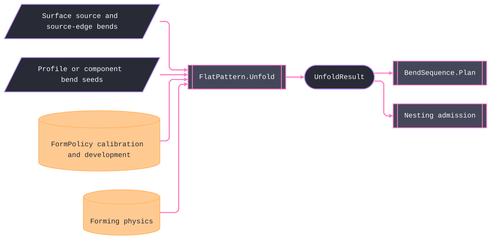

# [RASM_FABRICATION_FLAT_PATTERN]

The ONE unfold owner, `FlatPattern.Unfold`, projects a formed sheet source to the flat pattern and per-bend lines consumed by brake planning. The bend projection is the four-scalar algebra over `(A, R, T, K)`: `BA = (π/180)·|A|·(R + K·T)`, `OSSB = tan(|A|·π/360)·(R + T)`, `BD = 2·OSSB − BA`, and `flatDelta = −BD`. The sign of `BendLine.AngleDeg` owns direction. `KSource` rows carry their own `[UseDelegateFromConstructor]` resolution laws, and `KFactorTable` is policy data keyed by admitted grade or family baseline, method, and `R/T` band. Production tables use `Interpolate.CubicSplineMonotone` only within one matching grade-method series; seed rows remain replaceable data rather than a hidden global roster. `FormPolicy` resolves `MaterialSpec`, positive thickness, development controls, isometry budgets, grain anisotropy, tooling posture, and K calibration once. The owner composition remains `FlatPattern.Unfold → BendSequence.Plan → FormedResult`, and the one `flat-pattern` content key covers complete flat and bend-step atoms.

Unfold overlays the kernel development owner. The surface lane routes `DevelopOp.Unroll` through `Development.Apply`, gates the returned `DevelopmentReceipt` against policy budgets, and projects every `UvIsland` boundary. `SurfaceBendSeed` identifies the source-mesh edge and supplies signed angle and optional radius; `UvIsland.Vertices` then transfers that exact edge into the developed plane. No body infers fold angle or radius from unrelated ruling widths, and a bare `AdmittedComponent.Mesh` still feeds no development lane. The profile lane consumes `BendSeed` rows directly. `ReliefKind` rows carry rail-returning loop generators through `Loop.Admit`, `HemKind` rows carry their allowance law, and one `PolygonAlgebra.Clip` difference applies the generated reliefs. `GrainLaw` carries parallel, diagonal, and transverse radius factors. Invalid policy values, non-developable receipts, unresolved source edges, malformed layout parents, undersized radii, and open demanded profiles fail on typed rails.

Wire posture: HOST-LOCAL. The flat pattern crosses as `Arr<Loop>` on `FormedResult` with the ONE `flat-pattern` `ContentKey` (flat + bend rows in one preimage — `EgressKind.BendProgram` stays unminted on this carrier; a second key demands a second `FormedResult` slot, an owner-page decision); the flat feeds `Nesting/nfp` as a true-shape part by re-admission across runs; no DXF writer lands here — the CAD write leg is AppUi's, and the flat reaches it only as the insulated result payload. `ProcessPhysics.Budget` resolves the admitted grade's `ProcessBudget.Formed` once, and `UnfoldResult.Forming` carries that exact budget into brake planning.

## [01]-[INDEX]

- [01]-[FLAT_PATTERN]: owns the `KSource`/`ReliefKind`/`HemKind` vocabularies with their delegate-column laws, the `KFactorTable` rows and resolution fold, the `BendSeed`/`FormSource`/`FormPolicy`/`GrainLaw` carriers, the `BendProjection`/`BendLine`/`UnfoldResult` plane-local models, the `(A,R,T,K)` bend-projection algebra with signed direction, and the ONE `FlatPattern.Unfold` fold over the surface and analytic lanes before `BendSequence.Plan`.

## [02]-[FLAT_PATTERN]

- Owner: `KSource` `[SmartEnum<string>]` owns K-resolution dispatch; `KFactorTable` owns replaceable calibration rows; `ReliefKind` and `HemKind` own bounded geometry and allowance laws; `BendSeed` and `SurfaceBendSeed` own analytic and developed-edge bend annotations; `FormSource` owns profile, component, and kernel-bound surface lanes; `FormPolicy` owns material, thickness, calibration, tooling, development, and evidence budgets; `GrainLaw` owns anisotropic radius factors; `BendProjection`, `BendLine`, and `UnfoldResult` own the plane-local projection and receipt; `FlatPattern` owns the fold, algebra, inverse calibration, physics lookup, and complete content-key preimage.
- Cases: `KSource`, `ReliefKind`, and `HemKind` are row-driven closed vocabularies. `KFactorTable.Canonical` is seed data, while any admitted production table enters through the same carrier. `FormSource` discriminates surface and analytic lanes inside one fold.
- Entry: `public static Fin<UnfoldResult> Unfold(FormPolicy policy, FabricationInput input)` — the ONE unfold fold the `Run(Form)` case body composes; `public static BendProjection Project(double angleDeg, double insideRadiusMm, double thicknessMm, double k)` the pure bend algebra every consumer reads (brake re-projects per die selection; `|angle|` drives the algebra, the sign is direction); `public static Fin<double> SolveK(double measuredFlatMm, Arr<double> flangeMm, double angleDeg, double insideRadiusMm, double thicknessMm)` the coupon inverse whose result the policy carries as `CouponK`.
- Auto: the surface lane composes the policy-carried `DevelopPolicy`, maps source vertex identities through each `UvIsland`, and preserves `DevelopmentReceipt`; the analytic lane projects `BendSeed` rows directly; relief rows generate distinct straight-segment loops before one difference; radius gates read the full grain band; `BendSequence.Plan` re-projects working radii after tooling selection and accumulates only the working-minus-original `FlatDeltaMm` difference beyond the projection this fold already embedded in the flat; `Nesting/nfp` receives the flat through normal re-admission.
- Receipt: `UnfoldResult` carries the flat `Arr<Loop>`, the `Seq<BendLine>`, thickness, `MaterialSpec`, the exact `ProcessBudget.Formed`, and the kernel `DevelopmentReceipt` isometry evidence when the surface lane ran — typed evidence end to end; the `FormedResult` egress case carries only atoms rows (`Arr<Loop>` + `Seq<BendStep>` + the ONE key over both) per ruling 5.
- Packages: kernel `Development.Apply`, `SurfaceResult.UvTessellation`, fabrication atoms, `MaterialSpec`, `ProcessPhysics.Budget`, `ProcessBudget.Formed`, `PolygonAlgebra`, `BendMethod`, `PunchKind`, MathNet.Numerics `Interpolate.CubicSplineMonotone`, QuikGraph `UndirectedGraph<int,SEdge<int>>` and `ConnectedComponents`, Thinktecture.Runtime.Extensions, LanguageExt.Core, `Rasm.Numerics`, and BCL inbox surfaces compose directly.
- Growth: a new K convention is one `KSource` row WITH its `Resolve` delegate — the build breaks until the delegate lands; a new relief or hem is one row with its columns; production K data is the data-ingress arm, never inline rows; the DSTV `KA`/`ConnectorPlate` reads lower to `BendSeed` at their ingress arms (`Ingress/steel`, `Ingress/element`) — the seed row is the ONE analytic-lane wire; `composite.md` (fishnet draping + AFP geodesic-parallel courses over the kernel on-mesh suite) admits LAST as its own page on a named consumer; zero new entrypoint surface.
- Boundary: this page is the ONE unfold owner and a second unroll engine — or a re-derived strip adjacency/MST beside the kernel `StripField.LayoutParent` columns — is the deleted form; `Decompose` cannot produce a flat or a receipt, so a mesh-lane claim over it is the named fiction; the kernel owns isometric development and this overlay owns ONLY neutral-fiber substitution and bend annotation; NO DXF/DWG writer lands here and the flat crosses only as the `FormedResult` payload; `FormPolicy` is the one policy carrier and a parallel `UnfoldPolicy`/`SheetPolicy` sibling is the deleted form; the K factor is a resolved scalar at the fold and a K literal in a downstream signature is the named defect; bend direction is the SIGN of the angle — a parallel direction flag beside a signed angle is the deleted form; Materials vocabulary (`ConnectorPlate`/`PlateStock`, groove rows) resolves to `BendSeed`/scalar facts at the ingress boundary, never a Materials type in-folder.

```csharp signature
// --- [RUNTIME_PRELUDE] ----------------------------------------------------------------------------------------------------------------------------
using LanguageExt;
using LanguageExt.Common;
using MathNet.Numerics;
using Rasm.Domain;
using Rasm.Fabrication.Geometry2D;
using Rasm.Fabrication.Process;
using Rasm.Meshing;
using Rasm.Numerics;
using Rasm.Parametric;
using Rasm.Processing;
using QuikGraph;
using QuikGraph.Algorithms;
using Rhino.Geometry;
using Thinktecture;
using static LanguageExt.Prelude;

namespace Rasm.Fabrication.Forming;

// --- [TYPES] --------------------------------------------------------------------------------------------------------------------------------------
// K resolution is ROW-OWNED behavior: each source carries its Resolve law, so a central K switch and a
// per-source resolver family are both unconstructable; a new convention is one row WITH its delegate.
[SmartEnum<string>]
public sealed partial class KSource {
    public static readonly KSource TableRow = new("table-row", static q => q.Table.K(q.Material, q.Method, q.InsideRadiusMm / q.ThicknessMm)
        .ToFin(GeometryFault.DegenerateInput($"flat-pattern:k-table:{q.Material.Family.Key}:{q.Material.Grade}:{q.Method.Key}").ToError()));
    public static readonly KSource CouponBackSolve = new("coupon-back-solve", static q => q.CouponK
        .ToFin(GeometryFault.DegenerateInput("flat-pattern:k-coupon-missing").ToError()));
    public static readonly KSource Din6935 = new("din-6935", static q => Fin.Succ(FlatPattern.KDin6935(q.InsideRadiusMm, q.ThicknessMm)));
    public static readonly KSource Physics = new("physics", static q => Fin.Succ(q.BaseK));

    [UseDelegateFromConstructor]
    public partial Fin<double> Resolve(KQuery query);
}

[SmartEnum<string>]
public sealed partial class ReliefKind {
    public static readonly ReliefKind Rectangular = new("rectangular", widthFactor: 1.0, depthClearance: 0.5, FlatPattern.RectangularRelief);
    public static readonly ReliefKind Obround = new("obround", widthFactor: 1.0, depthClearance: 0.5, FlatPattern.ObroundRelief);
    public static readonly ReliefKind Tear = new("tear", widthFactor: 1.0, depthClearance: 0.0, FlatPattern.TearRelief);

    public double WidthFactor { get; }
    public double DepthClearance { get; }

    [UseDelegateFromConstructor]
    public partial Fin<Loop> Cut(ReliefSeat seat, Context tolerance);
}

// The hem allowance is a LAW, not a factor: closed hems take the 1.5·T practical row, open/teardrop the
// full BA(180°, R) projection — one delegate column, no allowance-factor arithmetic at the call site.
[SmartEnum<string>]
public sealed partial class HemKind {
    public static readonly HemKind Closed = new("closed", static (t, _, _) => 1.5 * t);
    public static readonly HemKind Open = new("open", static (t, r, k) => Math.PI * (r + (k * t)));
    public static readonly HemKind Teardrop = new("teardrop", static (t, r, k) => Math.PI * (r + (k * t)));

    [UseDelegateFromConstructor]
    public partial double Allowance(double thicknessMm, double radiusMm, double k);
}

// --- [MODELS] -------------------------------------------------------------------------------------------------------------------------------------
public readonly record struct KQuery(MaterialSpec Material, BendMethod Method, double InsideRadiusMm, double ThicknessMm, KFactorTable Table, Option<double> CouponK, double BaseK);

public readonly record struct KFactorRow(Material Material, Option<string> Grade, double RtLow, double RtHigh, BendMethod Method, double K);

public sealed record KFactorTable(Arr<KFactorRow> Rows) {
    public const double Floor = 0.25;
    public const double Ceiling = 0.50;
    public const double StationCeilingRt = 6.0;

    static readonly Arr<KFactorRow> AirCalibration = Array(
        new KFactorRow(Material.MildSteel, None, 0.0, 1.0, BendMethod.Air, 0.33), new KFactorRow(Material.MildSteel, None, 1.0, 3.0, BendMethod.Air, 0.40), new KFactorRow(Material.MildSteel, None, 3.0, double.MaxValue, BendMethod.Air, 0.50),
        new KFactorRow(Material.Aluminium, None, 0.0, 1.0, BendMethod.Air, 0.35), new KFactorRow(Material.Aluminium, None, 1.0, 3.0, BendMethod.Air, 0.42), new KFactorRow(Material.Aluminium, None, 3.0, double.MaxValue, BendMethod.Air, 0.50),
        new KFactorRow(Material.Stainless, None, 0.0, 1.0, BendMethod.Air, 0.38), new KFactorRow(Material.Stainless, None, 1.0, 3.0, BendMethod.Air, 0.45), new KFactorRow(Material.Stainless, None, 3.0, double.MaxValue, BendMethod.Air, 0.50));

    public static readonly KFactorTable Canonical = new([
        .. from row in AirCalibration.AsEnumerable()
           from method in BendMethod.Items
           select row with { Method = method },
    ]);

    public Option<double> K(MaterialSpec material, BendMethod method, double rt) {
        Arr<KFactorRow> exact = Rows.Filter(r => r.Material == material.Family && r.Method == method && r.Grade.Exists(grade => grade == material.Grade));
        Arr<KFactorRow> series = [.. (exact.IsEmpty
            ? Rows.Filter(r => r.Material == material.Family && r.Method == method && r.Grade.IsNone)
            : exact).AsEnumerable().OrderBy(static row => row.RtLow)];
        double[] stations = [.. series.Map(static row => (row.RtLow + Math.Min(row.RtHigh, StationCeilingRt)) / 2.0)];
        bool admitted = double.IsFinite(rt) && series.Exists(row => rt >= row.RtLow && rt < row.RtHigh);
        bool monotone = stations.Zip(stations.Skip(1)).All(static pair => pair.First < pair.Second);
        Option<double> raw = !admitted || (series.Count >= 3 && !monotone)
            ? None
            : series.Count >= 3
            ? Optional(Interpolate.CubicSplineMonotone(stations, [.. series.Map(static row => row.K)])
                .Interpolate(Math.Clamp(rt, stations[0], stations[^1])))
            : series.Filter(r => rt >= r.RtLow && rt < r.RtHigh).HeadOrNone().Map(static r => r.K);
        return raw.Map(k => Math.Clamp(k + method.KBias, Floor, Ceiling));
    }
}

// The analytic-lane bend annotation: DSTV KA rows and ConnectorPlate/PlateStock facts lower to this row at
// their ingress arms. AngleDeg is SIGNED (+up/−down) — direction is the sign, never a parallel flag.
public readonly record struct BendSeed(Edge3 Line, double AngleDeg, Option<double> RadiusMm, Set<int> Prerequisites);

public readonly record struct SurfaceBendSeed(int SourceA, int SourceB, double AngleDeg, Option<double> RadiusMm, Set<int> Prerequisites);

public readonly record struct GrainLaw(double AngleDeg, double ParallelPenalty, double DiagonalPenalty, double TransversePenalty);

public readonly record struct ReliefSeat(Point3d At, double WidthMm, double DepthMm);

// Polymorphic unfold target. Surface carries the kernel-bound tessellation because a bare world-space mesh
// cannot feed Development.Apply by construction; AdmittedComponent.Mesh therefore feeds no lane.
[Union(ConversionFromValue = ConversionOperatorsGeneration.None)]
public abstract partial record FormSource {
    private FormSource() { }

    public sealed record Profile(Seq<BendSeed> Bends) : FormSource;
    public sealed record Component(AdmittedComponent Admitted, Seq<BendSeed> Bends) : FormSource;
    public sealed record Surface(SurfaceResult.UvTessellation Source, Seq<SurfaceBendSeed> Bends) : FormSource;
}

// Minted HERE: the Run(Form) policy payload and the material/thickness boundary (FabricationInput carries
// neither). DieWidthFactor None = the brake die-rule band decides; CouponK is SolveK's once-solved result.
public sealed record FormPolicy(
    FormSource Source, MaterialSpec Material, KSource KSource, BendMethod Method, PunchKind Punch,
    ReliefKind Relief, HemKind Hem, double ThicknessMm, Option<double> DieWidthFactor,
    KFactorTable KFactors, Option<double> CouponK, Option<GrainLaw> Grain, DevelopPolicy Development,
    double MaxIsometry, double MaxTorsal);

public readonly record struct BendProjection(double BaMm, double BdMm, double OssbMm, double FlatDeltaMm);

public sealed record BendLine(Edge3 Line, double AngleDeg, double InsideRadiusMm, double K, double BaMm, Set<int> Prerequisites);

public sealed record UnfoldResult(
    Arr<Loop> Flat, Seq<BendLine> Bends, double ThicknessMm,
    MaterialSpec Material, ProcessBudget.Formed Forming, Option<DevelopmentReceipt> Isometry);

// --- [OPERATIONS] ---------------------------------------------------------------------------------------------------------------------------------
public static class FlatPattern {
    const double HemAngleFloorDeg = 175.0;
    const double ThicknessMatchMm = 1e-6;

    // The owner#run Form-arm terminal mint: ONE flat-pattern key digests the flat AND the bend rows — two
    // programs over one flat never collide; length prefixes keep loop grouping in the preimage.
    public static FabricationResult Formed(UnfoldResult unfold, Seq<BendStep> bends) =>
        new FabricationResult.FormedResult(
            unfold.Flat, bends,
            bends.Map(static b => b.OverbendDeg).Fold(0.0, Math.Max),
            ContentKey.Of(EgressKind.FlatPattern, CanonicalBytes(unfold.Flat, bends)));

    static byte[] CanonicalBytes(Arr<Loop> flat, Seq<BendStep> bends) {
        System.Buffers.ArrayBufferWriter<byte> writer = new();
        WriteCount(writer, flat.Count);
        flat.Iter(loop => {
            WriteCount(writer, loop.Count);
            for (int i = 0; i < loop.Count; i++) {
                Point3d v = loop.At(i);
                WriteDouble(writer, v.X); WriteDouble(writer, v.Y); WriteDouble(writer, loop.BulgeAt(i));
            }
        });
        WriteCount(writer, bends.Count);
        bends.Iter(b => {
            WriteCount(writer, b.Order);
            WriteDouble(writer, b.Line.A.X); WriteDouble(writer, b.Line.A.Y);
            WriteDouble(writer, b.Line.B.X); WriteDouble(writer, b.Line.B.Y);
            WriteDouble(writer, b.AngleDeg); WriteDouble(writer, b.RadiusMm); WriteDouble(writer, b.KFactor);
            WriteDouble(writer, b.OverbendDeg); WriteDouble(writer, b.TonnageKn);
            WriteCount(writer, b.Orientation == BendOrientation.Flipped ? 1 : 0);
        });
        return writer.WrittenSpan.ToArray();
    }

    static void WriteCount(System.Buffers.ArrayBufferWriter<byte> writer, int count) {
        System.Buffers.Binary.BinaryPrimitives.WriteInt32LittleEndian(writer.GetSpan(4), count);
        writer.Advance(4);
    }

    static void WriteDouble(System.Buffers.ArrayBufferWriter<byte> writer, double value) {
        System.Buffers.Binary.BinaryPrimitives.WriteDoubleLittleEndian(writer.GetSpan(8), value);
        writer.Advance(8);
    }

    // Forming's ONE physics accessor composes the canonical grade-and-process budget fold; a wrong modality or
    // missing grade row remains on the typed rail, and every downstream projection reads the same receipt.
    internal static Fin<ProcessBudget.Formed> FormedRow(MaterialSpec material, ProcessKind process) =>
        ProcessPhysics.Budget(process, material, None, None).Bind(static budget => budget is ProcessBudget.Formed formed
            ? Fin.Succ(formed)
            : Fin.Fail<ProcessBudget.Formed>(GeometryFault.DegenerateInput("flat-pattern:formed-budget").ToError()));

    // The (A,R,T,K) algebra over |angle|: BA along the neutral fiber, OSSB to the mold-line apex, BD the
    // per-bend flat shrink; the angle SIGN is direction and never enters the magnitude algebra.
    public static BendProjection Project(double angleDeg, double insideRadiusMm, double thicknessMm, double k) {
        double a = Math.Abs(angleDeg);
        double ba = Math.PI / 180.0 * a * (insideRadiusMm + (k * thicknessMm));
        double ossb = Math.Tan(a * Math.PI / 360.0) * (insideRadiusMm + thicknessMm);
        double bd = (2.0 * ossb) - ba;
        return new BendProjection(ba, bd, ossb, -bd);
    }

    public static double YFactor(double k) => k * Math.PI / 2.0;

    // DIN 6935 correction k = 0.65 + 0.5·log10(R/T) capped at 1; neutral line at (T/2)·k ⇒ K = k/2.
    public static double KDin6935(double insideRadiusMm, double thicknessMm) =>
        Math.Clamp(0.65 + (0.5 * Math.Log10(insideRadiusMm / thicknessMm)), 0.5, 1.0) / 2.0;

    // Coupon inverse: BA_measured = flat − Σ(flange − OSSB); K = (BA·180/(π·A) − R)/T. The result rides
    // FormPolicy.CouponK — solved once, read by the coupon-back-solve row per bend.
    public static Fin<double> SolveK(double measuredFlatMm, Arr<double> flangeMm, double angleDeg, double insideRadiusMm, double thicknessMm) {
        double a = Math.Abs(angleDeg);
        double ossb = Math.Tan(a * Math.PI / 360.0) * (insideRadiusMm + thicknessMm);
        double ba = measuredFlatMm - flangeMm.Sum(f => f - ossb);
        double k = ((ba * 180.0 / (Math.PI * a)) - insideRadiusMm) / thicknessMm;
        return a is > 0.0 and < 175.0 && thicknessMm > 0.0 && insideRadiusMm >= 0.0 && double.IsFinite(k) && k is > 0.0 and < 1.0
            ? Fin.Succ(k)
            : Fin.Fail<double>(GeometryFault.DegenerateInput($"flat-pattern:coupon-k:{k:0.###}").ToError());
    }

    // ONE fold, two lanes discriminated by the FormSource case: Surface (kernel Unroll overlay — islands are
    // the flat, LayoutParent rulings the bend lines, BA substituted per station) and Profile/Component
    // (analytic BendSeed projection). Every lane exits through relief subtraction and the grain-aware radius gate.
    public static Fin<UnfoldResult> Unfold(FormPolicy policy, FabricationInput input) =>
        Valid(policy) && input.Process is not null
        ? FormedRow(policy.Material, input.Process).Bind(formed =>
            policy.Source.Switch(
                state: (Policy: policy, Input: input, Formed: formed),
                profile: static (s, p) => ProfileLane(s.Input.Profiles, p.Bends, s.Policy.ThicknessMm, s.Policy, s.Formed),
                component: static (s, c) => c.Admitted.SheetThicknessMm.Map(t => Math.Abs(t - s.Policy.ThicknessMm) <= ThicknessMatchMm).IfNone(true)
                    ? ProfileLane(c.Admitted.Profiles, c.Bends, s.Policy.ThicknessMm, s.Policy, s.Formed)
                    : Fin.Fail<UnfoldResult>(GeometryFault.DegenerateInput("flat-pattern:thickness-conflict").ToError()),
                surface: static (s, src) => SurfaceLane(src.Source, src.Bends, s.Policy, s.Formed))
            .Bind(r => Relieved(r, policy.Relief))
            .Bind(r => GateRadii(r, formed.MinBendRadiusFactor, policy.Grain)))
        : Fin.Fail<UnfoldResult>(GeometryFault.DegenerateInput("flat-pattern:policy").ToError());

    // Surface lane: Development.Apply(Unroll) is the ONLY planar-yielding kernel op; the develop policy threads
    // verified kernel knobs resolved from thickness, never a kernel-side default literal. Islands → flat Loops;
    // source-identity annotations → BendLines with K resolved per edge and BA substituted at the placed edge.
    static Fin<UnfoldResult> SurfaceLane(SurfaceResult.UvTessellation source, Seq<SurfaceBendSeed> seeds, FormPolicy policy, ProcessBudget.Formed formed) =>
        Development.Apply(new DevelopOp.Unroll(source, policy.Development)).Bind(dev => dev.Switch(
            state: (Source: source, Seeds: seeds, Policy: policy, Formed: formed),
            strips: static (_, _) => Fin.Fail<UnfoldResult>(GeometryFault.DegenerateInput("flat-pattern:unroll-shape").ToError()),
            unrolled: static (s, u) =>
                InvalidLayout(u.Field) is var malformed && malformed > 0
                    ? Fin.Fail<UnfoldResult>(FabricationFault.UnfoldInfeasible(u.Field.RailOffsets.Count, malformed).ToError())
                    : u.Receipt.MaxIsometry > s.Policy.MaxIsometry || u.Receipt.MaxTorsal > s.Policy.MaxTorsal
                        ? Fin.Fail<UnfoldResult>(FabricationFault.UnfoldInfeasible(u.Field.RailOffsets.Count, Branches(u.Field)).ToError())
                        : u.Atlas.Islands
                            .Traverse(island => IslandLoops(island, s.Source.Mesh.Tolerance))
                            .Bind(flat => s.Seeds
                                .Traverse(seed => SurfaceAnnotated(seed, u.Atlas.Islands, s.Policy.ThicknessMm, s.Policy, s.Formed))
                                .Map(bends => new UnfoldResult([.. flat.Bind(identity)], bends, s.Policy.ThicknessMm, s.Policy.Material, s.Formed, Some(u.Receipt))))));

    // Profile lane: BendSeed rows are flange-true — pure Resolve + Project arithmetic; a seed at the hem floor
    // takes the HemKind allowance in place of BA; a seed without a radius takes the physics floor radius.
    static Fin<UnfoldResult> ProfileLane(Arr<Loop> profiles, Seq<BendSeed> seeds, double thickness, FormPolicy policy, ProcessBudget.Formed formed) =>
        profiles.IsEmpty || !profiles.ForAll(static profile => profile.Closed)
            || !profiles.Tail.ForAll(profile => profile.Tolerance == profiles.Head.Tolerance)
            ? Fin.Fail<UnfoldResult>(FabricationFault.OpenLoop(FabConcern.Form, profiles.ToSeq()
                .Map(static (loop, index) => (loop.Closed, Index: index))
                .Filter(static row => !row.Closed)
                .HeadOrNone().Map(static row => row.Index).IfNone(0)).ToError())
            : seeds.Traverse(seed => Annotated(seed, thickness, policy, formed))
                .Map(bends => new UnfoldResult(profiles, bends, thickness, policy.Material, formed, None));

    static Fin<BendLine> Annotated(BendSeed seed, double t, FormPolicy policy, ProcessBudget.Formed formed) {
        double radius = seed.RadiusMm.IfNone(formed.MinBendRadiusFactor * t);
        double length = seed.Line.A.DistanceTo(seed.Line.B);
        return !double.IsFinite(length) || length <= 1e-9 || !double.IsFinite(seed.AngleDeg)
            || Math.Abs(seed.AngleDeg) is <= 0.0 or > 180.0 || !double.IsFinite(radius) || radius < 0.0
            ? Fin.Fail<BendLine>(GeometryFault.DegenerateInput("flat-pattern:bend-seed").ToError())
            : policy.KSource.Resolve(new KQuery(policy.Material, policy.Method, radius, t, policy.KFactors, policy.CouponK, formed.KFactor))
                .Bind(k => !double.IsFinite(k) || k is <= 0.0 or >= 1.0
                    ? Fin.Fail<BendLine>(GeometryFault.DegenerateInput($"flat-pattern:k:{k:0.###}").ToError())
                    : Fin.Succ(new BendLine(
                        seed.Line, seed.AngleDeg, radius, k,
                        Math.Abs(seed.AngleDeg) >= HemAngleFloorDeg ? policy.Hem.Allowance(t, radius, k) : Project(seed.AngleDeg, radius, t, k).BaMm,
                        seed.Prerequisites)));
    }

    static Fin<BendLine> SurfaceAnnotated(SurfaceBendSeed seed, Seq<UvIsland> islands, double t, FormPolicy policy, ProcessBudget.Formed formed) =>
        islands
            .Choose(island => LocalIndex(island, seed.SourceA).Bind(a => LocalIndex(island, seed.SourceB).Map(b => (Island: island, A: a, B: b))))
            .HeadOrNone()
            .ToFin(FabricationFault.UnfoldInfeasible(islands.Count, 0).ToError())
            .Bind(found => Annotated(
                new BendSeed(new Edge3(Planar(found.Island.Uv[found.A]), Planar(found.Island.Uv[found.B])), seed.AngleDeg, seed.RadiusMm, seed.Prerequisites),
                t, policy, formed));

    static Option<int> LocalIndex(UvIsland island, int sourceVertex) =>
        toSeq(Enumerable.Range(0, island.Vertices.Count)).Filter(i => island.Vertices[i] == sourceVertex).HeadOrNone();

    static Point3d Planar(Point2d uv) => new(uv.X, uv.Y, 0.0);

    static Fin<UnfoldResult> Relieved(UnfoldResult result, ReliefKind relief) =>
        result.Flat.IsEmpty
            ? Fin.Fail<UnfoldResult>(GeometryFault.DegenerateInput("flat-pattern:empty-flat").ToError())
            : Corners(result) is var corners && corners.IsEmpty
                ? Fin.Succ(result)
                : corners.Traverse(corner => ReliefLoop(corner, result.ThicknessMm, relief, result.Flat.Head.Tolerance))
                    .Bind(cuts => PolygonAlgebra.Clip(toSeq(result.Flat), cuts, ClipOp.Difference))
                    .Map(cut => result with { Flat = [.. cut] });

    // Relief geometry: width = max(T, factor·T), depth = BA/2 + clearance·T at each pair of bend lines whose
    // endpoints meet inside the flat — the ONE Clip difference; hand-stitched vertex surgery is the deleted form.
    static Fin<Loop> ReliefLoop((Point3d At, BendLine A, BendLine B) corner, double t, ReliefKind relief, Context tolerance) =>
        relief.Cut(new ReliefSeat(corner.At, Math.Max(t, relief.WidthFactor * t), ((corner.A.BaMm + corner.B.BaMm) / 4.0) + (relief.DepthClearance * t)), tolerance);

    static Seq<(Point3d At, BendLine A, BendLine B)> Corners(UnfoldResult result) =>
        toSeq(Enumerable.Range(0, result.Bends.Count)).Bind(i =>
            toSeq(Enumerable.Range(i + 1, result.Bends.Count - i - 1))
                .Filter(j => Meets(result.Bends[i].Line, result.Bends[j].Line))
                .Map(j => (Meet(result.Bends[i].Line, result.Bends[j].Line), result.Bends[i], result.Bends[j])));

    // Radius gate every lane exits through: floor = factor·T, scaled by the grain penalty when the bend line
    // runs within 45° of the rolling direction; the first violating bend routes 2743 with its index.
    static Fin<UnfoldResult> GateRadii(UnfoldResult result, double minRadiusFactor, Option<GrainLaw> grain) =>
        result.Bends
            .Map((b, i) => (Index: i, Bend: b, Floor: minRadiusFactor * result.ThicknessMm * GrainScale(b, grain)))
            .Filter(row => row.Bend.InsideRadiusMm < row.Floor)
            .HeadOrNone()
            .Match(
                Some: row => Fin.Fail<UnfoldResult>(FabricationFault.MinBendRadiusViolated(row.Index, row.Bend.InsideRadiusMm, row.Floor).ToError()),
                None: () => Fin.Succ(result));

    static double GrainScale(BendLine bend, Option<GrainLaw> grain) =>
        grain.Map(g => AngleTo(bend.Line, g.AngleDeg) is var a
            ? a <= 22.5 ? g.ParallelPenalty : a >= 67.5 ? g.TransversePenalty : g.DiagonalPenalty
            : 1.0).IfNone(1.0);

    // --- [STATION_KERNELS]
    // Small declared kernels — every member the lanes reach resolves HERE; a named-but-bodiless helper is the
    // fence defect this page forecloses.
    // LayoutParent is a directed forest projection: branching is valid, while invalid parents, self-parenting,
    // and longer cycles are not. QuikGraph owns the cycle predicate; this overlay only projects kernel rows.
    static int InvalidLayout(StripField field) {
        Seq<(int Parent, int Strip)> rows = field.LayoutParent.ToSeq().Map((parent, strip) => (parent, strip));
        int malformed = rows.Count(row => row.Parent < -1 || row.Parent >= field.LayoutParent.Count || row.Parent == row.Strip);
        if (malformed > 0)
            return malformed;
        AdjacencyGraph<int, SEdge<int>> graph = new(allowParallelEdges: false);
        graph.AddVertexRange(Enumerable.Range(0, field.LayoutParent.Count));
        rows.Filter(static row => row.Parent >= 0).Iter(row => graph.AddEdge(new SEdge<int>(row.Strip, row.Parent)));
        return graph.IsDirectedAcyclicGraph() ? 0 : 1;
    }

    static int Branches(StripField field) =>
        field.LayoutParent.ToSeq().Filter(static parent => parent >= 0).GroupBy(static parent => parent).Count(static children => children.Count() > 1);

    // Boundary edges form a degree-two undirected graph. ConnectedComponents preserves holes as independent
    // loops, adjacency orders each cycle, and the surviving face-edge direction restores outer/hole winding.
    static Fin<Seq<Loop>> IslandLoops(UvIsland island, Context tolerance) {
        Seq<(SEdge<int> Edge, int From, int To)> boundary = toSeq(island.Faces)
            .Bind(static f => Seq(
                (From: f.A, To: f.B, A: Math.Min(f.A, f.B), B: Math.Max(f.A, f.B)),
                (From: f.B, To: f.C, A: Math.Min(f.B, f.C), B: Math.Max(f.B, f.C)),
                (From: f.C, To: f.A, A: Math.Min(f.C, f.A), B: Math.Max(f.C, f.A))))
            .GroupBy(static edge => (edge.A, edge.B))
            .Filter(static group => group.Count() == 1)
            .Map(static group => {
                (int From, int To, int A, int B) edge = group.First();
                return (Edge: new SEdge<int>(group.Key.A, group.Key.B), edge.From, edge.To);
            })
            .ToSeq();
        UndirectedGraph<int, SEdge<int>> graph = new(allowParallelEdges: false);
        graph.AddVertexRange(boundary.Bind(static row => Seq(row.Edge.Source, row.Edge.Target)).Distinct());
        boundary.Iter(row => graph.AddEdge(row.Edge));
        if (graph.VertexCount < 3 || graph.Vertices.Any(vertex => graph.AdjacentDegree(vertex) != 2))
            return Fin.Fail<Seq<Loop>>(GeometryFault.DegenerateInput($"flat-pattern:island-boundary:{island.Chart}").ToError());
        Dictionary<int, int> componentOf = new();
        int components = graph.ConnectedComponents(componentOf);
        return toSeq(Enumerable.Range(0, components)).Traverse(component => BoundaryLoop(island, graph, boundary, componentOf, component, tolerance));
    }

    static Fin<Loop> BoundaryLoop(UvIsland island, UndirectedGraph<int, SEdge<int>> graph, Seq<(SEdge<int> Edge, int From, int To)> boundary, Dictionary<int, int> componentOf, int component, Context tolerance) {
        int start = componentOf.Where(static row => row.Value >= 0).Where(row => row.Value == component).Min(static row => row.Key);
        List<int> cycle = [start];
        int prior = -1, current = start, guard = 0;
        do {
            int next = graph.AdjacentEdges(current)
                .Select(edge => edge.Source == current ? edge.Target : edge.Source)
                .First(vertex => vertex != prior);
            prior = current;
            current = next;
            if (current != start) cycle.Add(current);
        } while (current != start && guard++ <= graph.VertexCount);
        IEnumerable<int> oriented = cycle.Count >= 2 && boundary.Exists(row => row.From == cycle[0] && row.To == cycle[1])
            ? cycle
            : cycle.AsEnumerable().Reverse();
        return current == start && cycle.Count >= 3
            ? Loop.Admit([.. oriented.Select(vertex => Planar(island.Uv[vertex]))], closed: true, Arr<double>(), tolerance)
            : Fin.Fail<Loop>(GeometryFault.DegenerateInput($"flat-pattern:island-cycle:{island.Chart}:{component}").ToError());
    }

    // Exact corner probe: two bend segments meet when each straddles the other's carrier — four Orient2D signs,
    // the kernel exact floor, never a float epsilon.
    static bool Meets(Edge3 p, Edge3 q) =>
        Predicate.Orient2D(p.A, p.B, q.A) != Predicate.Orient2D(p.A, p.B, q.B)
        && Predicate.Orient2D(q.A, q.B, p.A) != Predicate.Orient2D(q.A, q.B, p.B);

    static Point3d Meet(Edge3 p, Edge3 q) {
        double d = ((p.B.X - p.A.X) * (q.B.Y - q.A.Y)) - ((p.B.Y - p.A.Y) * (q.B.X - q.A.X));
        double s = (((q.A.X - p.A.X) * (q.B.Y - q.A.Y)) - ((q.A.Y - p.A.Y) * (q.B.X - q.A.X))) / d;
        return new Point3d(p.A.X + (s * (p.B.X - p.A.X)), p.A.Y + (s * (p.B.Y - p.A.Y)), 0.0);
    }

    static double AngleTo(Edge3 line, double grainAngleDeg) {
        double lineDeg = Math.Atan2(line.B.Y - line.A.Y, line.B.X - line.A.X) * 180.0 / Math.PI;
        double delta = Math.Abs(lineDeg - grainAngleDeg) % 180.0;
        return Math.Min(delta, 180.0 - delta);
    }

    internal static Fin<Loop> RectangularRelief(ReliefSeat seat, Context tolerance) =>
        Loop.Admit(Arr(
            new Point3d(seat.At.X - (seat.WidthMm / 2.0), seat.At.Y - (seat.DepthMm / 2.0), 0.0),
            new Point3d(seat.At.X + (seat.WidthMm / 2.0), seat.At.Y - (seat.DepthMm / 2.0), 0.0),
            new Point3d(seat.At.X + (seat.WidthMm / 2.0), seat.At.Y + (seat.DepthMm / 2.0), 0.0),
            new Point3d(seat.At.X - (seat.WidthMm / 2.0), seat.At.Y + (seat.DepthMm / 2.0), 0.0)), closed: true, Arr<double>(), tolerance);

    internal static Fin<Loop> ObroundRelief(ReliefSeat seat, Context tolerance) =>
        Loop.Admit([.. Generate.LinearSpacedMap(17, 0.0, 2.0 * Math.PI, a => new Point3d(
            seat.At.X + ((seat.WidthMm / 2.0) * Math.Cos(a)),
            seat.At.Y + ((seat.DepthMm / 2.0) * Math.Sin(a)), 0.0)).Take(16)], closed: true, Arr<double>(), tolerance);

    internal static Fin<Loop> TearRelief(ReliefSeat seat, Context tolerance) =>
        Loop.Admit(Arr(
            new Point3d(seat.At.X, seat.At.Y - (seat.DepthMm / 2.0), 0.0),
            new Point3d(seat.At.X + (seat.WidthMm / 2.0), seat.At.Y, 0.0),
            new Point3d(seat.At.X, seat.At.Y + (seat.DepthMm / 2.0), 0.0),
            new Point3d(seat.At.X - (seat.WidthMm / 2.0), seat.At.Y, 0.0)), closed: true, Arr<double>(), tolerance);

    static bool Valid(FormPolicy policy) =>
        policy is not null && policy.Source is not null && policy.Material is not null && policy.KSource is not null
        && policy.Method is not null && policy.Punch is not null && policy.Relief is not null && policy.Hem is not null
        && (policy.Source switch {
            FormSource.Surface surface => surface.Source is not null,
            FormSource.Component component => component.Admitted is not null,
            FormSource.Profile => true,
            _ => false,
        })
        && policy.KFactors is not null && policy.ThicknessMm > 0.0 && double.IsFinite(policy.ThicknessMm)
        && policy.MaxIsometry >= 0.0 && double.IsFinite(policy.MaxIsometry)
        && policy.MaxTorsal >= 0.0 && double.IsFinite(policy.MaxTorsal)
        && policy.Development.IsValid && !policy.KFactors.Rows.IsEmpty
        && policy.KFactors.Rows.ForAll(static row => row.Material is not null && row.Method is not null
            && row.RtLow >= 0.0 && row.RtHigh > row.RtLow
            && double.IsFinite(row.RtLow) && !double.IsNaN(row.RtHigh) && row.K is > 0.0 and < 1.0 && double.IsFinite(row.K))
        && policy.KFactors.Rows.GroupBy(static row => (row.Material, row.Grade, row.Method)).ForAll(static group => {
            double[] stations = [.. group.OrderBy(static row => row.RtLow).Select(static row => (row.RtLow + Math.Min(row.RtHigh, KFactorTable.StationCeilingRt)) / 2.0)];
            return stations.Length < 3 || stations.Zip(stations.Skip(1)).All(static pair => pair.First < pair.Second);
        })
        && policy.KFactors.Rows.ForAll(static row => row.Grade.ForAll(static grade => !string.IsNullOrWhiteSpace(grade)))
        && policy.CouponK.ForAll(static k => k is > 0.0 and < 1.0 && double.IsFinite(k))
        && policy.DieWidthFactor.ForAll(static factor => factor > 0.0 && double.IsFinite(factor))
        && policy.Grain.ForAll(static grain => double.IsFinite(grain.AngleDeg)
            && grain.ParallelPenalty > 0.0 && double.IsFinite(grain.ParallelPenalty)
            && grain.DiagonalPenalty > 0.0 && double.IsFinite(grain.DiagonalPenalty)
            && grain.TransversePenalty > 0.0 && double.IsFinite(grain.TransversePenalty));
}
```


