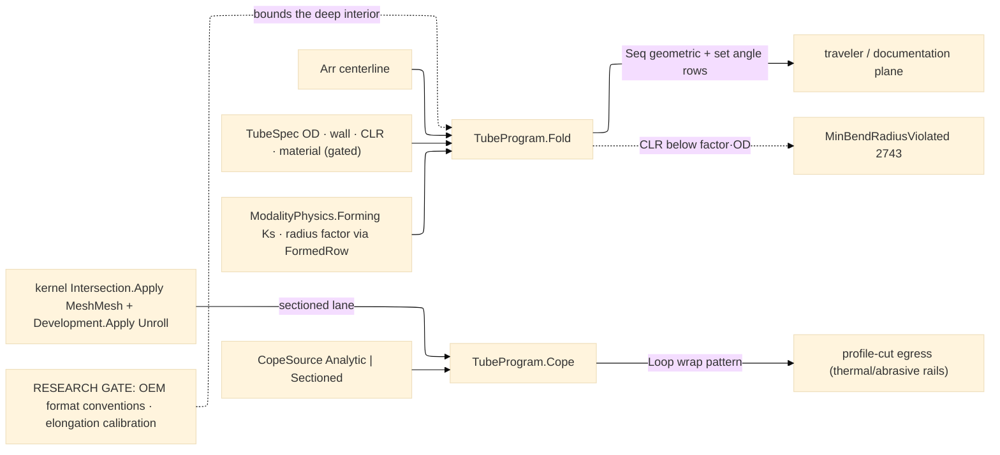

# [RASM_FABRICATION_TUBE_BENDING]

The rotary-draw tube owner: `TubeProgram.Fold` projects a polyline centerline to the bender coordinate stream — the XYZ→YBC/LRA transform as real vector algebra over consecutive segments. For centerline points `P₀..Pₙ` with segment vectors `dᵢ = Pᵢ₊₁ − Pᵢ`: the GEOMETRIC bend angle at interior point `i` is `Cᵢ = ∠(dᵢ₋₁, dᵢ)` (the turn, `acos` of unit dots); the plane-of-bend rotation `Bᵢ` is the signed dihedral between the bend plane at `i−1` (`dᵢ₋₂ × dᵢ₋₁`) and at `i` (`dᵢ₋₁ × dᵢ`), signed by the triple product against `dᵢ₋₁` (the first bend carries `B₁ = 0` — the reference plane); the feed `Yᵢ = |dᵢ₋₁| − Tᵢ₋₁ − Tᵢ` subtracts the arc tangent lengths `T = CLR·tan(C/2)` on both flanks — with the GEOMETRIC `C` on both flanks, which is why `TubeBend` carries `BendDeg` (geometric) AND `SetDeg` (springback-compensated `C/Ks`) as DISTINCT columns: the feed algebra reads geometry, the bender axis reads the set angle, and one conflated column corrupts every feed after the first bend. A collinear interior point (`C` under the `TubeLaw.CollinearDeg` tolerance) COLLAPSES into feed — it contributes its segment length and emits no bend row. The LRA form is the same triple named length-rotation-angle; the `BendFormat` axis discriminates emission order and sign convention through its behavior columns, never a second fold. Elongation CARRIES as a per-bend recurrence: the tangent-line model consumes `2·CLR·tan(C/2)` against the arc's `CLR·C·π/180`, so the per-bend delta `ΔLᵢ = CLR·(Cᵢ·π/180 − 2·tan(Cᵢ/2))` redistributes half onto each adjacent feed (`Yᵢ′ = Yᵢ + (ΔLᵢ₋₁ + ΔLᵢ)/2` — the fold state, never a post-pass), and springback sets each bend to `Cᵢ/Ks` with `Ks` the physics `Forming.SpringbackRatio` — the same constitutive row the brake reads through `FlatPattern.FormedRow`, one springback vocabulary.

Tooling admission is table law: the `MandrelRow` bands over `CLR/OD` and `OD/wall` gate mandrel and wiper demand (`CLR/OD < 2` → mandrel + wiper; `2 ≤ CLR/OD < 3` with thin wall `OD/t ≥ 20` → mandrel; else open bend — declaration-order precedence with a terminal total fallback), and the fold gates its spec: a demanded `CLR` under `MinBendRadiusFactor·OD` routes `MinBendRadiusViolated` 2743 (the SAME fault arm as the sheet radius floor — one radius law), a non-positive OD or a wall at or past `OD/2` (a solid bar) routes the kernel `DegenerateInput`. Coping is ONE `Cope` fold over the `CopeSource` `[Union]` — the input shape IS the lane discriminant: `Analytic(branch, main, angle)` carries the cylinder-on-cylinder template `z(φ) = (R − √(R² − r²·sin²φ))/sinθ + r·cosφ/tanθ` (perpendicular joints reduce to `z(φ) = R − √(R² − r²·sin²φ)`), ADMITTED before evaluation — `0 < θ < 180`, `r ≤ R`, positive diameters — because `r > R` drives the radicand negative and a non-finite loop must be unmintable, with the wrap sampled through MathNet `Generate.LinearSpacedMap` at the chord-derived count (`⌈π·OD / CopeChordMm⌉`, never a magic sample literal); `Sectioned(branchTessellation, mainMesh, policy)` routes the kernel — `Intersection.Apply(IntersectOp.MeshMesh)` sections the joint into chains, `Development.Apply(DevelopOp.Unroll)` unrolls the branch band, and the developed cut emits as a `Loop` into the EXISTING profile-cut egress (laser/plasma rails cut the wrap template; no new egress case). The `Sectioned` case carries the kernel `SurfaceResult.UvTessellation` because the develop pipeline admits no bare mesh by construction. RESEARCH GATE (this row is the page's own honesty law): ONE bounded research lane — bender-format breadth (per-OEM YBC/LRA sign and zero conventions) and elongation-model calibration against measured coupon data — precedes the deep interior (collision simulation against the bend head, multi-stack die scheduling, compound overbend); the vocabulary, the centerline fold, the admission rows, and the two cope lanes land NOW and stand.

Wire posture: HOST-LOCAL. The bend rows cross as typed `TubeBend` data toward the traveler/documentation plane and the cope `Loop` feeds the in-process cutting rail; no bender-native program text and no DXF writer lands here — the CAD write leg is AppUi's. Tube has NO `Run` case yet: the owner-arm promotion (a `FabricationPolicy` tube case, its result row, a bender `Machine` row, and a content-keyed tube-program egress on the `EgressKind` spine) is the designed-ahead counterpart this page's receipts are already shaped for — `Seq<TubeBend>` is atoms-safe row data exactly as `BendStep` is.

## [01]-[INDEX]

- [01]-[TUBE_BENDING]: owns the `BendFormat` axis, the `MandrelRow` tooling-admission table, the `TubeLaw` constants, the `TubeSpec`/`TubeBend` models with the geometric/set angle split, the `CopeSource` union, the XYZ→YBC/LRA centerline fold with its elongation/springback carry and collinear collapse, the two-lane cope fold, and the recorded research gate that bounds the deep interior.

## [02]-[TUBE_BENDING]

- Owner: `BendFormat` `[SmartEnum<string>]` (`ybc`/`lra`) the behavior-bearing bender coordinate convention — the `RotationSign` handedness column plus the `[UseDelegateFromConstructor]` `Normalize` zero-convention delegate the fold reads, one fold; `MandrelRow` the `CLR/OD × OD/wall` admission band (mandrel + wiper flags, declaration-order precedence, terminal total fallback); `TubeLaw` the constants table (collinear tolerance, cope chord); `TubeSpec` the tube identity (OD, wall, CLR, material); `TubeBend` the per-bend program row (order, feed Y, rotation B, GEOMETRIC bend C, SET angle C/Ks, CLR, mandrel/wiper verdict columns) — the neutral model, exactly as `BendStep` is the brake's; `CopeSource` `[Union]` the cope input whose case IS the lane (`Analytic` cylinder pair · `Sectioned` kernel joint); `TubeProgram` the static surface owning `Fold`, the `ToolingOf` classification, and `Cope`.
- Cases: `MandrelRow` rows 3 (tight+thin → mandrel+wiper · moderate+thin → mandrel · total open fallback); the fold's format semantics are the `BendFormat` behavior columns (sign × normalize), never a branch; `CopeSource` cases 2 — analytic-cylinder and kernel-mesh — one `Cope` fold, the union case the discriminant.
- Entry: `public static Fin<Seq<TubeBend>> Fold(Arr<Point3d> centerline, TubeSpec spec, BendFormat format)` — the ONE centerline fold (< 3 points is kernel `DegenerateInput`; collinear interior points collapse to feed); `public static Fin<Loop> Cope(CopeSource source)` — the saddle template or the kernel section-and-unroll into the profile-cut egress.
- Auto: `Fold` gates the spec (OD, wall, CLR floor), walks the segment triples computing `(Y, B, C)` per the vector algebra with the collinear collapse folding zero-turn points into feed, lowers each plane rotation through the format's `RotationSign`/`Normalize` columns, applies the elongation redistribution and the `C/Ks` set angle in one pass (the carry is fold state, never a post-pass; the trailing-flank tangent reads the GEOMETRIC angle off the prior row), and classifies the spec through `ToolingOf` so every `TubeBend` row carries its mandrel/wiper verdict; `Cope` admits the analytic pair's domain before any evaluation and samples the wrap at the chord-derived count, or composes `Intersection.Apply` + `Development.Apply` for the sectioned joint, its `Loop` feeding the thermal/abrasive profile rails as an ordinary part; the physics `Forming` row arrives via `FlatPattern.FormedRow` — the ONE map read all three Forming pages share.
- Receipt: `Seq<TubeBend>` is the typed program evidence; the cope `Loop` carries no wrapper — a `CopeResult` sibling is the deleted form.
- Packages: `Process/owner#FABRICATION_OWNER` atoms (`Loop`), `Process/physics#CUT_PARAMETER` (`ModalityPhysics.Forming` via the shared accessor), kernel `Meshing/intersect.md#Intersection.Apply` (`IntersectOp.MeshMesh` → `IntersectResult.Chains`) + `Parametric/develop.md#Development.Apply` (`DevelopOp.Unroll` — the cope seam, composed, never re-implemented), kernel `Parametric/surface.md` (`SurfaceResult.UvTessellation` — the sectioned-lane source), MathNet.Numerics (`Generate.LinearSpacedMap` — the wrap sampler), `Rhino.Geometry` (`Point3d`/`Vector3d`), Thinktecture.Runtime.Extensions, LanguageExt.Core, `Rasm.Numerics` (`GeometryFault`), BCL inbox.
- Growth: RESEARCH-GATED — the one bounded lane (OEM format conventions, elongation calibration) unlocks the deep interior: bend-head collision simulation, multi-stack die scheduling, compound overbend; each lands as rows/arms on THIS page, never a sibling; a new bender format is one `BendFormat` row; a new tooling band is one `MandrelRow`; the owner-arm promotion (policy/result tube cases, bender `Machine` row, tube-program `EgressKind` row) lands on `Process/owner` + `Process/family` against the receipt shapes frozen here; zero new entrypoint surface.
- Boundary: the centerline fold and admission tables stand NOW and the research gate bounds only the deep interior — a stub interior hiding behind the gate is the named defect (the fold's math is complete); the geometric and set angles are DISTINCT columns and a fold reading the set angle into the tangent algebra is the named feed corruption; coping composes the kernel and a local surface-surface intersector is the deleted form; the analytic cope admits its domain before evaluation and a `Fin.Succ` carrying non-finite coordinates is unmintable; no DXF writer, no bender-dialect text; springback is the ONE physics `Forming` row and a tube-local springback table is the split-brain defect.

```csharp signature
// --- [RUNTIME_PRELUDE] ----------------------------------------------------------------------------------------------------------------------------
using LanguageExt;
using LanguageExt.Common;
using MathNet.Numerics;
using Rasm.Fabrication.Process;
using Rasm.Meshing;
using Rasm.Numerics;
using Rasm.Parametric;
using Rhino.Geometry;
using Thinktecture;
using static LanguageExt.Prelude;

namespace Rasm.Fabrication.Forming;

// --- [TYPES] --------------------------------------------------------------------------------------------------------------------------------------
// The bender coordinate convention is BEHAVIOR-BEARING row data: RotationSign fixes the plane-rotation handedness
// (YBC CCW-positive, LRA CW-positive) and the Normalize delegate fixes the zero convention (YBC signed ±180, LRA
// wrapped [0,360)) — the fold reads both columns, so a format is one row and never a second fold.
[SmartEnum<string>]
public sealed partial class BendFormat {
    public static readonly BendFormat Ybc = new("ybc", rotationSign: 1.0, static deg => deg);
    public static readonly BendFormat Lra = new("lra", rotationSign: -1.0, static deg => deg < 0.0 ? deg + 360.0 : deg);

    public double RotationSign { get; }

    [UseDelegateFromConstructor]
    public partial double Normalize(double rotationDeg);
}

// --- [CONSTANTS] ----------------------------------------------------------------------------------------------------------------------------------
// A turn under CollinearDeg collapses into feed; the cope wrap samples at ceil(π·OD/CopeChordMm) stations —
// both law-table rows, never inline literals in a fold body.
public static class TubeLaw {
    public const double CollinearDeg = 0.1;
    public const double CopeChordMm = 0.5;
}

// --- [MODELS] -------------------------------------------------------------------------------------------------------------------------------------
public readonly record struct MandrelRow(double ClrOverOdLow, double ClrOverOdHigh, double OdOverWallMin, bool Mandrel, bool Wiper);

public readonly record struct TubeSpec(double OdMm, double WallMm, double ClrMm, Material Material);

// BendDeg is the GEOMETRIC turn (feed/tangent algebra reads it); SetDeg the springback-compensated bender axis
// (C/Ks). Mandrel/Wiper are the MandrelRow verdict columns — downstream planning reads them off the row.
public readonly record struct TubeBend(int Order, double FeedMm, double RotationDeg, double BendDeg, double SetDeg, double ClrMm, bool Mandrel, bool Wiper);

// The cope input IS the lane discriminant: Analytic carries the cylinder pair the closed-form template admits;
// Sectioned carries the kernel-bound branch (no bare mesh feeds the develop pipeline by construction).
[Union(ConversionFromValue = ConversionOperatorsGeneration.None)]
public abstract partial record CopeSource {
    private CopeSource() { }

    public sealed record Analytic(TubeSpec Branch, TubeSpec Main, double AngleDeg) : CopeSource;
    public sealed record Sectioned(SurfaceResult.UvTessellation Branch, MeshSpace Main, DevelopPolicy Policy) : CopeSource;
}

// --- [OPERATIONS] ---------------------------------------------------------------------------------------------------------------------------------
public static class TubeProgram {
    // Admission precedence IS declaration order; the terminal row is the total open-bend fallback, so every
    // spec classifies — a moderate-CLR thick-wall tube falls through the mandrel band to open.
    static readonly Arr<MandrelRow> Tooling = Array(
        new MandrelRow(0.0, 2.0, 0.0, Mandrel: true, Wiper: true),
        new MandrelRow(2.0, 3.0, 20.0, Mandrel: true, Wiper: false),
        new MandrelRow(0.0, double.MaxValue, 0.0, Mandrel: false, Wiper: false));

    // Spec gates then the segment-triple walk: C = acos(d̂ᵢ₋₁·d̂ᵢ) geometric; B = signed dihedral of consecutive
    // bend planes lowered through the format's sign + zero convention; Y = |dᵢ₋₁| − T flanks with T = CLR·tan(C/2)
    // on the GEOMETRIC angles; ΔL = CLR·(C·π/180 − 2·tan(C/2)) redistributes half per adjacent feed; set angle =
    // C/Ks — one pass, fold state, never a post-pass; collinear turns collapse into feed and emit no row.
    public static Fin<Seq<TubeBend>> Fold(Arr<Point3d> centerline, TubeSpec spec, BendFormat format) =>
        centerline.Count < 3
            ? Fin.Fail<Seq<TubeBend>>(GeometryFault.DegenerateInput($"tube:centerline:{centerline.Count}-points").ToError())
            : spec.OdMm <= 0.0 || spec.WallMm <= 0.0 || spec.WallMm >= spec.OdMm / 2.0
                ? Fin.Fail<Seq<TubeBend>>(GeometryFault.DegenerateInput($"tube:spec:od={spec.OdMm:0.###}:wall={spec.WallMm:0.###}").ToError())
                : FlatPattern.FormedRow(spec.Material).Bind(f =>
                    spec.ClrMm < f.MinBendRadiusFactor * spec.OdMm
                        ? Fin.Fail<Seq<TubeBend>>(FabricationFault.MinBendRadiusViolated(0, spec.ClrMm, f.MinBendRadiusFactor * spec.OdMm).ToError())
                        : f.SpringbackRatio is <= 0.0 or > 1.0
                            ? Fin.Fail<Seq<TubeBend>>(GeometryFault.DegenerateInput($"tube:springback:{f.SpringbackRatio:0.###}").ToError())
                            : Fin.Succ(Walk(centerline, spec, f.SpringbackRatio, format)));

    // First matching band wins (declaration-order precedence); the terminal fallback row makes the classification total.
    public static MandrelRow ToolingOf(TubeSpec spec) {
        double clrOverOd = spec.ClrMm / spec.OdMm;
        double odOverWall = spec.OdMm / spec.WallMm;
        return Tooling
            .Filter(row => clrOverOd >= row.ClrOverOdLow && clrOverOd < row.ClrOverOdHigh && odOverWall >= row.OdOverWallMin)
            .Head();
    }

    // The walk carry: (prior plane, prior GEOMETRIC angle, prior ΔL, feed accumulated by collapsed collinear
    // points). Exemption: the index loop is the recurrence kernel; domain flow receives the Seq rows only.
    static Seq<TubeBend> Walk(Arr<Point3d> pts, TubeSpec spec, double ks, BendFormat format) {
        MandrelRow tooling = ToolingOf(spec);
        Seq<TubeBend> bends = Seq<TubeBend>();
        Vector3d prevPlane = Vector3d.Zero;
        double prevGeomDeg = 0.0, carry = 0.0, collapsed = 0.0;
        for (int i = 1; i < pts.Count - 1; i++) {
            Vector3d a = pts[i] - pts[i - 1], b = pts[i + 1] - pts[i];
            double c = Vector3d.VectorAngle(a, b) * 180.0 / Math.PI;
            if (c < TubeLaw.CollinearDeg) { collapsed += b.Length; continue; }
            Vector3d plane = Vector3d.CrossProduct(a, b);
            double raw = bends.IsEmpty ? 0.0 : Math.CopySign(Vector3d.VectorAngle(prevPlane, plane) * 180.0 / Math.PI,
                Vector3d.CrossProduct(prevPlane, plane) * a);
            double rot = format.Normalize(format.RotationSign * raw);
            double tangent = spec.ClrMm * Math.Tan(c * Math.PI / 360.0);
            double delta = spec.ClrMm * ((c * Math.PI / 180.0) - (2.0 * Math.Tan(c * Math.PI / 360.0)));
            double priorTangent = bends.IsEmpty ? 0.0 : spec.ClrMm * Math.Tan(prevGeomDeg * Math.PI / 360.0);
            double feed = a.Length + collapsed - tangent - priorTangent + ((carry + delta) / 2.0);
            bends = bends.Add(new TubeBend(bends.Count + 1, feed, rot, c, c / ks, spec.ClrMm, tooling.Mandrel, tooling.Wiper));
            (prevPlane, prevGeomDeg, carry, collapsed) = (plane, c, delta, 0.0);
        }
        return bends;
    }

    // ONE cope fold, the union case the lane: the analytic template admits its domain BEFORE evaluation (r ≤ R,
    // 0 < θ < 180 — the radicand and divisors are total on the admitted domain, so a non-finite loop is
    // unmintable); the sectioned lane composes the kernel section + unroll and emits the developed band boundary.
    public static Fin<Loop> Cope(CopeSource source) => source switch {
        CopeSource.Analytic a when a.AngleDeg is <= 0.0 or >= 180.0 =>
            Fin.Fail<Loop>(GeometryFault.DegenerateInput($"tube:cope-angle:{a.AngleDeg:0.###}").ToError()),
        CopeSource.Analytic a when a.Branch.OdMm <= 0.0 || a.Main.OdMm <= 0.0 || a.Branch.OdMm > a.Main.OdMm =>
            Fin.Fail<Loop>(GeometryFault.DegenerateInput($"tube:cope-radii:r={a.Branch.OdMm / 2.0:0.###}:R={a.Main.OdMm / 2.0:0.###}").ToError()),
        CopeSource.Analytic a => Fin.Succ(Saddle(a.Branch.OdMm / 2.0, a.Main.OdMm / 2.0, a.AngleDeg * Math.PI / 180.0)),
        CopeSource.Sectioned s => SectionedCope(s),
        _ => Fin.Fail<Loop>(GeometryFault.DegenerateInput("tube:cope-source").ToError()),
    };

    // Analytic saddle: z(φ) = (R − √(R² − r²sin²φ))/sinθ + r·cosφ/tanθ over the branch wrap, sampled at the
    // chord-derived station count through the MathNet range map — never a magic sample literal.
    static Loop Saddle(double r, double R, double th) {
        int stations = Math.Max(32, (int)Math.Ceiling(2.0 * Math.PI * r / TubeLaw.CopeChordMm));
        double[] z = Generate.LinearSpacedMap(stations, 0.0, 2.0 * Math.PI,
            phi => ((R - Math.Sqrt((R * R) - (r * r * Math.Sin(phi) * Math.Sin(phi)))) / Math.Sin(th)) + (r * Math.Cos(phi) / Math.Tan(th)));
        return new Loop([.. Enumerable.Range(0, stations).Select(k => new Point3d(r * (2.0 * Math.PI * k / stations), z[k], 0.0))], Closed: true);
    }

    // Kernel lane: MeshMesh sections the joint into walked chains; Unroll develops the branch band; the developed
    // island boundary nearest the section chain is the cut template — the kernel owns both computations.
    static Fin<Loop> SectionedCope(CopeSource.Sectioned s) =>
        Intersection.Apply(new IntersectOp.MeshMesh(s.Branch.Mesh, s.Main, IntersectPolicy.Canonical)).Bind(section =>
            section is IntersectResult.Chains chains && !chains.Walked.IsEmpty
                ? Development.Apply(new DevelopOp.Unroll(s.Branch, s.Policy)).Bind(static dev => dev switch {
                    DevelopmentResult.Unrolled u when !u.Atlas.Islands.IsEmpty =>
                        Fin.Succ(new Loop([.. u.Atlas.Islands.Head().Uv.Map(static uv => new Point3d(uv.X, uv.Y, 0.0))], Closed: true)),
                    _ => Fin.Fail<Loop>(GeometryFault.DegenerateInput("tube:cope-unroll").ToError()),
                })
                : Fin.Fail<Loop>(GeometryFault.DegenerateInput("tube:cope-section").ToError()));
}
```


