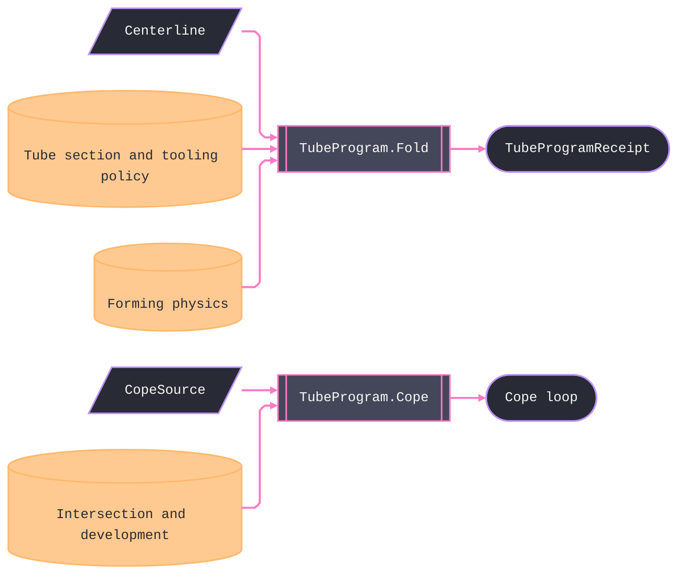

# [RASM_FABRICATION_TUBE_BENDING]

The rotary-draw tube owner, `TubeProgram.Fold`, projects a normalized centerline to one neutral YBC/LRA program receipt. Consecutive collinear segments collapse before bending, zero-length segments fail, reversals beyond the admitted bend range fail, and every feed must remain non-negative after tangent and elongation compensation. `TubeBend.BendDeg` owns geometric turn, `TubeBend.SetDeg` owns springback-compensated command angle, and the recurrence keeps those axes distinct. The receipt preserves every bend, terminal feed, centerline cut length, developed length, and tooling verdict. `TubeSectionKind` admits round, square, rectangular, and oval sections through parameterized dimensions; only round sections enter the closed-form cope lane.

Tooling admission is table law over `CLR/tooling-depth`, depth-to-wall ratio, demanded ovality, and demanded wall thinning. The verdict includes mandrel, wiper, pressure-die assist, boost, and qualified deformation limits; each `TubeBend` preserves those limits without inventing an unsupported predictor. Coping remains one fold over `CopeSource`. `Analytic` applies the cylinder template to admitted round sections, derives its station count from the demanded chord length over the branch wrap, and fails when that demand exceeds the carrier's resource budget. `Sectioned` composes `Intersection.Apply` and `Development.Apply`, then calls its injected face-provenance transfer. The current kernel exposes intersection lattice provenance and developed island coordinates but no public world-chain-to-developed-chain owner; this page therefore cannot substitute an island boundary for the cut curve.

Wire posture: HOST-LOCAL. `TubeProgramReceipt` crosses toward documentation and posting, and the cope `Loop` feeds the in-process cutting rail. Tube has no `Run` case yet; the owner-arm promotion adds the policy, result, machine-family, and egress rows against this receipt.

## [01]-[INDEX]

- [01]-[TUBE_BENDING]: owns `BendFormat`, `TubeSectionKind`, the `MandrelRow` table, `TubeSpec`, `TubeBend`, `TubeProgramReceipt`, `CopeSource`, the normalized centerline fold, and the analytic or kernel-composed cope fold.

## [02]-[TUBE_BENDING]

- Owner: `BendFormat` owns bender coordinate convention; `TubeSectionKind` and `TubeSection` own parameterized section geometry and kind-specific admission; `MandrelRow` owns tooling admission and quality limits; `TubeSpec` carries section, CLR, the resolved forming budget, model context, and deformation demands; `TubeBend` and `TubeProgramReceipt` own demand and evidence; `CopeSource` owns analytic and sectioned inputs; `TubeProgram` owns normalization, folding, tooling classification, and coping.
- Cases: `MandrelRow` rows 4 (tight → mandrel+wiper+assist+boost · moderate → mandrel+wiper+assist · large-CLR thin-wall → mandrel · qualified open-bend range); every row must also satisfy the demanded ovality and wall-thinning limits. The fold's format semantics are the `BendFormat` behavior columns (sign × normalize), while `TubeSectionKind` owns round, square, rectangular, and oval dimension admission through its generated delegate; `CopeSource` cases 2 — analytic-cylinder and kernel-mesh — one `Cope` fold, the union case the discriminant.
- Entry: `public static Fin<TubeProgramReceipt> Fold(Arr<Point3d> centerline, TubeSpec spec, BendFormat format)` is the one centerline fold. `public static Fin<Loop> Cope(CopeSource source)` owns analytic or sectioned cope projection.
- Auto: `Fold` validates the section and deformation demands, collapses collinear vertices without double-counting their lengths, rejects zero and reversal segments, computes geometric and set angles, applies tangent and elongation compensation, preserves terminal feed, and admits only tooling whose qualified ovality and thinning limits satisfy the demand. `Cope` admits round analytic pairs or composes sectioning and unrolling before invoking the provenance transfer.
- Receipt: `TubeProgramReceipt` carries the complete neutral program, terminal feed, cut and developed lengths, and tooling evidence. The cope remains a `Loop`.
- Packages: `Context`, `Loop.Admit`, `ProcessBudget.Formed`, `Intersection.Apply`, `Development.Apply`, `SurfaceResult.UvTessellation`, MathNet.Numerics `Generate.LinearSpacedMap`, Rhino `Point3d`/`Vector3d`, Thinktecture.Runtime.Extensions, LanguageExt.Core, `Rasm.Numerics`, and BCL inbox surfaces compose directly.
- Growth: a new bender convention is one `BendFormat` row, a new section family is one `TubeSectionKind` row plus its parameter admission, and tooling capability is table data. The owner-arm promotion consumes `TubeProgramReceipt`; the kernel development owner must admit the section-provenance transfer before the injected column can collapse.
- Boundary: the centerline fold and admission tables stand NOW and the research gate bounds only the deep interior — a stub interior hiding behind the gate is the named defect (the fold's math is complete); the geometric and set angles are DISTINCT columns and a fold reading the set angle into the tangent algebra is the named feed corruption; coping composes the kernel and a local surface-surface intersector is the deleted form; the analytic cope admits its domain before evaluation and a `Fin.Succ` carrying non-finite coordinates is unmintable; no DXF writer, no bender-dialect text; springback is the ONE `ProcessBudget.Formed` column and a tube-local springback table is the split-brain defect.

```csharp signature
// --- [RUNTIME_PRELUDE] ----------------------------------------------------------------------------------------------------------------------------
using LanguageExt;
using LanguageExt.Common;
using MathNet.Numerics;
using Rasm.Domain;
using Rasm.Fabrication.Process;
using Rasm.Meshing;
using Rasm.Numerics;
using Rasm.Parametric;
using Rhino.Geometry;
using Thinktecture;
using static LanguageExt.Prelude;

namespace Rasm.Fabrication.Forming;

// --- [TYPES] --------------------------------------------------------------------------------------------------------------------------------------
// The bender coordinate convention is BEHAVIOR-BEARING row data: RotationSign fixes the plane-rotation handedness
// (YBC CCW-positive, LRA CW-positive) and the Normalize delegate fixes the zero convention (YBC signed ±180, LRA
// wrapped [0,360)) — the fold reads both columns, so a format is one row and never a second fold.
[SmartEnum<string>]
public sealed partial class BendFormat {
    public static readonly BendFormat Ybc = new("ybc", rotationSign: 1.0, static deg => deg);
    public static readonly BendFormat Lra = new("lra", rotationSign: -1.0, static deg => deg < 0.0 ? deg + 360.0 : deg);

    public double RotationSign { get; }

    [UseDelegateFromConstructor]
    public partial double Normalize(double rotationDeg);
}

[SmartEnum<string>]
public sealed partial class TubeSectionKind {
    public static readonly TubeSectionKind Round = new("round", supportsAnalyticCope: true,
        static (section, tolerance) => Math.Abs(section.MajorMm - section.MinorMm) <= tolerance.Absolute.Value && section.CornerRadiusMm <= tolerance.Absolute.Value);
    public static readonly TubeSectionKind Square = new("square", supportsAnalyticCope: false,
        static (section, tolerance) => Math.Abs(section.MajorMm - section.MinorMm) <= tolerance.Absolute.Value && section.CornerRadiusMm > tolerance.Absolute.Value);
    public static readonly TubeSectionKind Rectangular = new("rectangular", supportsAnalyticCope: false,
        static (section, tolerance) => section.MajorMm - section.MinorMm > tolerance.Absolute.Value && section.CornerRadiusMm > tolerance.Absolute.Value);
    public static readonly TubeSectionKind Oval = new("oval", supportsAnalyticCope: false,
        static (section, tolerance) => section.MajorMm - section.MinorMm > tolerance.Absolute.Value && section.CornerRadiusMm <= tolerance.Absolute.Value);

    public bool SupportsAnalyticCope { get; }

    [UseDelegateFromConstructor]
    public partial bool Admits(TubeSection section, Context tolerance);
}

// --- [MODELS] -------------------------------------------------------------------------------------------------------------------------------------
public readonly record struct MandrelRow(
    double ClrOverDepthLow, double ClrOverDepthHigh, double DepthOverWallMin,
    bool Mandrel, bool Wiper, bool PressureDieAssist, bool Boost,
    double MaxOvalityPercent, double MaxWallThinningPercent);

public readonly record struct TubeSection(TubeSectionKind Kind, double MajorMm, double MinorMm, double WallMm, double CornerRadiusMm) {
    public double ToolingDepthMm => Math.Max(MajorMm, MinorMm);
}

public readonly record struct TubeSpec(
    TubeSection Section, double ClrMm, ProcessBudget.Formed Forming, Context Tolerance,
    double MaxOvalityPercent, double MaxWallThinningPercent);

public sealed record TubeProgramReceipt(
    Seq<TubeBend> Bends, double TailFeedMm, double CutLengthMm,
    double DevelopedLengthMm, MandrelRow Tooling);

// BendDeg is the GEOMETRIC turn (feed/tangent algebra reads it); SetDeg the springback-compensated bender axis
// (C/Ks). Mandrel/Wiper are the MandrelRow verdict columns — downstream planning reads them off the row.
public readonly record struct TubeBend(
    int Order, double FeedMm, double RotationDeg, double BendDeg, double SetDeg, double ClrMm,
    bool Mandrel, bool Wiper, double OvalityLimitPercent, double WallThinningLimitPercent);

public delegate Fin<Loop> DevelopedSectionTransfer(IntersectResult.Chains section, DevelopmentResult.Unrolled development);

// The cope input IS the lane discriminant: Analytic carries the cylinder pair the closed-form template admits;
// Sectioned carries the kernel-bound branch (no bare mesh feeds the develop pipeline by construction).
[Union(ConversionFromValue = ConversionOperatorsGeneration.None)]
public abstract partial record CopeSource {
    private CopeSource() { }

    public sealed record Analytic(
        TubeSection Branch, TubeSection Main, Context Tolerance,
        double AngleDeg, double ChordMm, int StationCap) : CopeSource;
    public sealed record Sectioned(
        SurfaceResult.UvTessellation Branch, MeshSpace Main, DevelopPolicy Policy,
        DevelopedSectionTransfer Transfer) : CopeSource;
}

// --- [OPERATIONS] ---------------------------------------------------------------------------------------------------------------------------------
public static class TubeProgram {
    // Admission precedence IS declaration order. The terminal row covers the open-bend geometry range, but its
    // qualified deformation limits still reject a stricter demand instead of inventing attainable quality.
    static readonly Arr<MandrelRow> Tooling = Array(
        new MandrelRow(0.0, 1.5, 0.0, Mandrel: true, Wiper: true, PressureDieAssist: true, Boost: true, MaxOvalityPercent: 5.0, MaxWallThinningPercent: 12.0),
        new MandrelRow(1.5, 2.0, 0.0, Mandrel: true, Wiper: true, PressureDieAssist: true, Boost: false, MaxOvalityPercent: 7.0, MaxWallThinningPercent: 15.0),
        new MandrelRow(2.0, 3.0, 20.0, Mandrel: true, Wiper: false, PressureDieAssist: false, Boost: false, MaxOvalityPercent: 8.0, MaxWallThinningPercent: 18.0),
        new MandrelRow(0.0, double.MaxValue, 0.0, Mandrel: false, Wiper: false, PressureDieAssist: false, Boost: false, MaxOvalityPercent: 10.0, MaxWallThinningPercent: 20.0));

    // Spec gates then the segment-triple walk: C = acos(d̂ᵢ₋₁·d̂ᵢ) geometric; B = signed dihedral of consecutive
    // bend planes lowered through the format's sign + zero convention; Y = |dᵢ₋₁| − T flanks with T = CLR·tan(C/2)
    // on the GEOMETRIC angles; ΔL = CLR·(C·π/180 − 2·tan(C/2)) redistributes half per adjacent feed; set angle =
    // C/Ks — one pass, fold state, never a post-pass; collinear turns collapse into feed and emit no row.
    public static Fin<TubeProgramReceipt> Fold(Arr<Point3d> centerline, TubeSpec spec, BendFormat format) =>
        format is null || centerline.Count < 3
            ? Fin.Fail<TubeProgramReceipt>(GeometryFault.DegenerateInput($"tube:centerline:{centerline.Count}-points").ToError())
            : !ValidSpec(spec)
                ? Fin.Fail<TubeProgramReceipt>(GeometryFault.DegenerateInput($"tube:spec:major={spec.Section.MajorMm:0.###}:minor={spec.Section.MinorMm:0.###}:wall={spec.Section.WallMm:0.###}").ToError())
                : spec.ClrMm < spec.Forming.MinBendRadiusFactor * spec.Section.ToolingDepthMm
                    ? Fin.Fail<TubeProgramReceipt>(FabricationFault.MinBendRadiusViolated(0, spec.ClrMm, spec.Forming.MinBendRadiusFactor * spec.Section.ToolingDepthMm).ToError())
                    : Normalize(centerline, spec.Tolerance).Bind(points => ToolingOf(spec)
                        .Bind(tooling => Walk(points, spec, spec.Forming.SpringbackRatio, format, tooling)));

    // First matching geometry-and-quality band wins; no admitted row is a typed tooling failure.
    public static Fin<MandrelRow> ToolingOf(TubeSpec spec) =>
        ValidSpec(spec)
            ? ToolingFor(spec, spec.ClrMm / spec.Section.ToolingDepthMm, spec.Section.ToolingDepthMm / spec.Section.WallMm)
            : Fin.Fail<MandrelRow>(GeometryFault.DegenerateInput("tube:tooling-spec").ToError());

    static Fin<MandrelRow> ToolingFor(TubeSpec spec, double clrOverOd, double odOverWall) =>
        Tooling
            .Filter(row => clrOverOd >= row.ClrOverDepthLow && clrOverOd < row.ClrOverDepthHigh
                && odOverWall >= row.DepthOverWallMin
                && row.MaxOvalityPercent <= spec.MaxOvalityPercent
                && row.MaxWallThinningPercent <= spec.MaxWallThinningPercent)
            .HeadOrNone()
            .ToFin(GeometryFault.DegenerateInput($"tube:tooling:{spec.Section.Kind.Key}:{clrOverOd:0.###}:{odOverWall:0.###}").ToError());

    // The walk carry: (prior plane, prior GEOMETRIC angle, prior ΔL, feed accumulated by collapsed collinear
    // points). Exemption: the index loop is the recurrence kernel; domain flow receives the Seq rows only.
    static Fin<TubeProgramReceipt> Walk(Arr<Point3d> pts, TubeSpec spec, double ks, BendFormat format, MandrelRow tooling) {
        Seq<TubeBend> bends = Seq<TubeBend>();
        Vector3d prevPlane = Vector3d.Zero;
        double prevGeomDeg = 0.0, carry = 0.0, developed = 0.0;
        for (int i = 1; i < pts.Count - 1; i++) {
            Vector3d a = pts[i] - pts[i - 1], b = pts[i + 1] - pts[i];
            double c = Vector3d.VectorAngle(a, b) * 180.0 / Math.PI;
            if (!double.IsFinite(c) || c >= 175.0)
                return Fin.Fail<TubeProgramReceipt>(GeometryFault.DegenerateInput($"tube:bend:{i}:angle={c:0.###}").ToError());
            Vector3d plane = Vector3d.CrossProduct(a, b);
            double raw = bends.IsEmpty ? 0.0 : Math.CopySign(Vector3d.VectorAngle(prevPlane, plane) * 180.0 / Math.PI,
                Vector3d.CrossProduct(prevPlane, plane) * a);
            double rot = format.Normalize(format.RotationSign * raw);
            double tangent = spec.ClrMm * Math.Tan(c * Math.PI / 360.0);
            double delta = spec.ClrMm * ((c * Math.PI / 180.0) - (2.0 * Math.Tan(c * Math.PI / 360.0)));
            double priorTangent = bends.IsEmpty ? 0.0 : spec.ClrMm * Math.Tan(prevGeomDeg * Math.PI / 360.0);
            double feed = a.Length - tangent - priorTangent + ((carry + delta) / 2.0);
            if (feed < 0.0 || !double.IsFinite(raw) || !double.IsFinite(rot) || !double.IsFinite(feed) || !double.IsFinite(delta))
                return Fin.Fail<TubeProgramReceipt>(GeometryFault.DegenerateInput($"tube:bend:{i}:negative-feed={feed:0.###}").ToError());
            bends = bends.Add(new TubeBend(
                bends.Count + 1, feed, rot, c, c / ks, spec.ClrMm, tooling.Mandrel, tooling.Wiper,
                tooling.MaxOvalityPercent, tooling.MaxWallThinningPercent));
            developed += feed + (spec.ClrMm * c * Math.PI / 180.0);
            (prevPlane, prevGeomDeg, carry) = (plane, c, delta);
        }
        double tail = (pts[^1] - pts[^2]).Length - (spec.ClrMm * Math.Tan(prevGeomDeg * Math.PI / 360.0)) + (carry / 2.0);
        double cut = SegmentLength(pts), total = developed + tail;
        return tail >= 0.0 && !bends.IsEmpty && double.IsFinite(tail) && double.IsFinite(cut) && double.IsFinite(total)
            ? Fin.Succ(new TubeProgramReceipt(bends, tail, cut, total, tooling))
            : Fin.Fail<TubeProgramReceipt>(GeometryFault.DegenerateInput($"tube:tail:{tail:0.###}").ToError());
    }

    static Fin<Arr<Point3d>> Normalize(Arr<Point3d> points, Context tolerance) {
        if (points.Zip(points.Skip(1)).Map(static pair => pair.Item1.DistanceTo(pair.Item2)).Exists(static d => d <= 1e-9 || !double.IsFinite(d)))
            return Fin.Fail<Arr<Point3d>>(GeometryFault.DegenerateInput("tube:zero-segment").ToError());
        Arr<Point3d> normalized = points.Fold(Arr<Point3d>(), (kept, point) =>
            kept.Count < 2 || Vector3d.VectorAngle(kept[^1] - kept[^2], point - kept[^1]) >= tolerance.Angle.Value
                ? kept.Add(point)
                : kept.SetItem(kept.Count - 1, point));
        return normalized.Count >= 3
            ? Fin.Succ(normalized)
            : Fin.Fail<Arr<Point3d>>(GeometryFault.DegenerateInput("tube:collinear-centerline").ToError());
    }

    static double SegmentLength(Arr<Point3d> points) =>
        points.Zip(points.Skip(1)).Map(static pair => pair.Item1.DistanceTo(pair.Item2)).Sum();

    // ONE cope fold, generated total dispatch — a new source case breaks the build here: the analytic arm admits
    // its domain BEFORE evaluation (r ≤ R, 0 < θ < 180 — the radicand and divisors are total on the admitted
    // domain, so a non-finite loop is unmintable); the sectioned arm composes the kernel section + unroll.
    public static Fin<Loop> Cope(CopeSource source) => source.Switch(
        analytic: static a =>
            !double.IsFinite(a.AngleDeg) || a.AngleDeg is <= 0.0 or >= 180.0
                ? Fin.Fail<Loop>(GeometryFault.DegenerateInput($"tube:cope-angle:{a.AngleDeg:0.###}").ToError())
                : !double.IsFinite(a.ChordMm) || a.ChordMm <= 0.0 || a.StationCap < 3
                    || !ValidSection(a.Branch, a.Tolerance) || !ValidSection(a.Main, a.Tolerance)
                    || !a.Branch.Kind.SupportsAnalyticCope || !a.Main.Kind.SupportsAnalyticCope
                    || a.Branch.MajorMm > a.Main.MajorMm
                    ? Fin.Fail<Loop>(GeometryFault.DegenerateInput($"tube:cope-sections:{a.Branch.Kind.Key}:{a.Main.Kind.Key}").ToError())
                    : Saddle(
                        a.Branch.MajorMm / 2.0, a.Main.MajorMm / 2.0,
                        a.AngleDeg * Math.PI / 180.0, a.ChordMm, a.StationCap, a.Tolerance),
        sectioned: static s =>
            s.Branch is not null && s.Main is not null && s.Transfer is not null
                && s.Policy.IsValid && s.Branch.Mesh.Tolerance == s.Main.Tolerance
                ? SectionedCope(s)
                : Fin.Fail<Loop>(GeometryFault.DegenerateInput("tube:cope-sectioned-policy").ToError()));

    // Analytic saddle: z(φ) = (R − √(R² − r²sin²φ))/sinθ + r·cosφ/tanθ over the branch wrap, sampled at the
    // chord-derived station count through the MathNet range map — never a magic sample literal.
    static Fin<Loop> Saddle(double r, double R, double th, double chordMm, int stationCap, Context tolerance) {
        double demand = Math.Max(3.0, Math.Ceiling(Math.Tau * r / chordMm));
        if (!double.IsFinite(demand) || demand > stationCap)
            return Fin.Fail<Loop>(GeometryFault.DegenerateInput($"tube:cope-stations:{demand:0}:{stationCap}").ToError());
        int stations = (int)demand;
        double[] phi = Generate.LinearSpacedMap(stations + 1, 0.0, 2.0 * Math.PI, identity);
        return Loop.Admit([.. phi.Take(stations).Select(a => new Point3d(r * a,
            ((R - Math.Sqrt(Math.Max(0.0, (R * R) - (r * r * Math.Sin(a) * Math.Sin(a))))) / Math.Sin(th)) + (r * Math.Cos(a) / Math.Tan(th)), 0.0))],
            closed: true, Arr<double>(), tolerance);
    }

    // Kernel lane: MeshMesh sections the joint into walked chains; Unroll develops the branch band; the transfer
    // preserves chain-to-face provenance across source and developed coordinates.
    static Fin<Loop> SectionedCope(CopeSource.Sectioned s) =>
        Intersection.Apply(new IntersectOp.MeshMesh(s.Branch.Mesh, s.Main, IntersectPolicy.Canonical)).Bind(section =>
            section is IntersectResult.Chains chains && !chains.Walked.IsEmpty
                ? Development.Apply(new DevelopOp.Unroll(s.Branch, s.Policy)).Bind(dev => dev.Switch(
                    state: (s.Transfer, Chains: chains),
                    strips: static (_, _) => Fin.Fail<Loop>(GeometryFault.DegenerateInput("tube:cope-unroll").ToError()),
                    unrolled: static (state, u) => u.Atlas.Islands.IsEmpty
                        ? Fin.Fail<Loop>(GeometryFault.DegenerateInput("tube:cope-unroll").ToError())
                        : state.Transfer(state.Chains, u)))
                : Fin.Fail<Loop>(GeometryFault.DegenerateInput("tube:cope-section").ToError()));

    static bool ValidSection(TubeSection section, Context tolerance) =>
        tolerance is not null && section.Kind is not null && double.IsFinite(section.MajorMm) && double.IsFinite(section.MinorMm) && double.IsFinite(section.WallMm)
        && double.IsFinite(section.CornerRadiusMm) && section.MajorMm > 0.0 && section.MinorMm > 0.0
        && section.MajorMm >= section.MinorMm
        && section.WallMm > 0.0 && section.WallMm < Math.Min(section.MajorMm, section.MinorMm) / 2.0
        && section.CornerRadiusMm >= 0.0 && section.CornerRadiusMm <= Math.Min(section.MajorMm, section.MinorMm) / 2.0
        && section.Kind.Admits(section, tolerance);

    static bool ValidSpec(TubeSpec spec) =>
        spec.Forming is not null && ValidSection(spec.Section, spec.Tolerance) && spec.ClrMm > 0.0 && double.IsFinite(spec.ClrMm)
        && spec.Forming.TensileRm > 0.0 && double.IsFinite(spec.Forming.TensileRm)
        && spec.Forming.KFactor is > 0.0 and < 1.0 && double.IsFinite(spec.Forming.KFactor)
        && spec.Forming.SpringbackRatio is > 0.0 and <= 1.0 && double.IsFinite(spec.Forming.SpringbackRatio)
        && spec.Forming.MinBendRadiusFactor >= 0.0 && double.IsFinite(spec.Forming.MinBendRadiusFactor)
        && spec.MaxOvalityPercent is > 0.0 and <= 100.0 && double.IsFinite(spec.MaxOvalityPercent)
        && spec.MaxWallThinningPercent is > 0.0 and <= 100.0 && double.IsFinite(spec.MaxWallThinningPercent);
}
```


