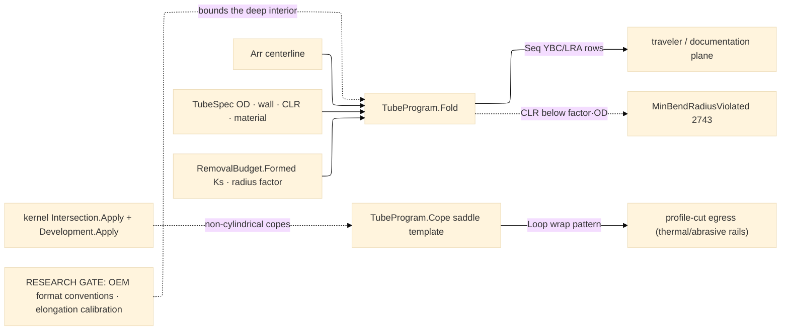

# [RASM_FABRICATION_TUBE_BENDING]

The rotary-draw tube owner: `TubeProgram.Fold` projects a polyline centerline to the bender coordinate stream — the XYZ→YBC/LRA transform as real vector algebra over consecutive segments. For centerline points `P₀..Pₙ` with segment vectors `dᵢ = Pᵢ₊₁ − Pᵢ`: the bend angle at interior point `i` is `Cᵢ = ∠(dᵢ₋₁, dᵢ)` (the turn, `acos` of unit dots); the plane-of-bend rotation `Bᵢ` is the signed dihedral between the bend plane at `i−1` (`dᵢ₋₂ × dᵢ₋₁`) and at `i` (`dᵢ₋₁ × dᵢ`), signed by the triple product against `dᵢ₋₁` (the first bend carries `B₁ = 0` — the reference plane); the feed `Yᵢ = |dᵢ₋₁| − Tᵢ₋₁ − Tᵢ` subtracts the arc tangent lengths `T = CLR·tan(C/2)` on both flanks. The LRA form is the same triple named length-rotation-angle; the `BendFormat` axis discriminates emission order and sign convention, never a second fold. Elongation and springback CARRY as a per-bend recurrence: material consumed along the arc is `CLR·Cᵢ·π/180` against the tangent-line model's `2·CLR·tan(Cᵢ/2)`, so the growth `ΔLᵢ` redistributes half onto each adjacent feed (`Yᵢ′ = Yᵢ − (ΔLᵢ₋₁ + ΔLᵢ)/2`), and each bend sets to `Cᵢ/Ks` with `Ks` the physics `RemovalBudget.Formed.SpringbackRatio` — the same constitutive row the brake reads, one springback vocabulary.

Tooling admission is table law: the `MandrelRow` bands over `CLR/OD` and `OD/wall` gate mandrel and wiper demand (`CLR/OD < 2` → mandrel + wiper; `2 ≤ CLR/OD < 3` with thin wall `OD/t ≥ 20` → mandrel; else open bend), and a demanded `CLR` under `MinBendRadiusFactor·OD` routes `MinBendRadiusViolated` 2743 — the CLR floor rides the SAME fault arm as the sheet radius floor, one radius law. Coping is a SEAM, not a local engine: the fishmouth/saddle template carries the analytic floor `z(φ) = (R − √(R² − r²·sin²φ))/sinθ + r·cosφ/tanθ` (branch radius `r` meeting main radius `R` at angle `θ`; perpendicular joints reduce to `z(φ) = R − √(R² − r²·sin²φ)`), and non-cylindrical or multi-branch copes route the kernel — `Meshing/intersect.md#Intersection.Apply` sections the joint, `Parametric/develop.md#Development.Apply` unrolls the cut band — with the developed cope emitting as a `Loop` into the EXISTING profile-cut egress (laser/plasma rails cut the wrap template; no new egress case). RESEARCH GATE (this row is the page's own honesty law): ONE bounded research lane — bender-format breadth (per-OEM YBC/LRA sign and zero conventions) and elongation-model calibration against measured coupon data — precedes the deep interior (collision simulation against the bend head, multi-stack die scheduling, compound overbend); the vocabulary, the centerline fold, the admission rows, and the cope seam land NOW and stand.

Wire posture: HOST-LOCAL. The bend rows cross as typed `TubeBend` data toward the traveler/documentation plane and the cope `Loop` feeds the in-process cutting rail; no bender-native program text and no DXF writer lands here — the CAD write leg is AppUi's.

## [01]-[INDEX]

- [01]-[TUBE_BENDING]: owns the `BendFormat` axis, the `MandrelRow` tooling-admission table, the `TubeSpec`/`TubeBend` models, the XYZ→YBC/LRA centerline fold with its elongation/springback carry recurrence, the analytic cope template plus the kernel intersect+develop cope seam, and the recorded research gate that bounds the deep interior.

## [02]-[TUBE_BENDING]

- Owner: `BendFormat` `[SmartEnum<string>]` (`ybc`/`lra`) the behavior-bearing bender coordinate convention — the `RotationSign` handedness column plus the `[UseDelegateFromConstructor]` `Normalize` zero-convention delegate the fold reads, one fold; `MandrelRow` the `CLR/OD × OD/wall` admission band (mandrel + wiper flags, declaration-order precedence, terminal total fallback); `TubeSpec` the tube identity (OD, wall, CLR, material); `TubeBend` the per-bend program row (order, feed Y, rotation B, bend C, CLR, mandrel/wiper verdict columns) — the neutral model, exactly as `BendStep` is the brake's; `TubeProgram` the static surface owning `Fold`, the `ToolingOf` classification, and the cope template.
- Cases: `MandrelRow` rows 3 (tight+thin → mandrel+wiper · moderate+thin → mandrel · total open fallback); the fold's format semantics are the `BendFormat` behavior columns (sign × normalize), never a branch; the cope discriminates analytic-cylinder vs kernel-mesh on the joint's form — one `Cope` fold, two lanes.
- Entry: `public static Fin<Seq<TubeBend>> Fold(Arr<Point3d> centerline, TubeSpec spec, BendFormat format)` — the ONE centerline fold (< 3 points is kernel `DegenerateInput`; collinear interior points collapse to feed); `public static Fin<Loop> Cope(TubeSpec branch, TubeSpec main, double angleDeg)` — the saddle template into the profile-cut egress.
- Auto: `Fold` walks the segment triples computing `(Y, B, C)` per the vector algebra, lowers each plane rotation through the format's `RotationSign`/`Normalize` columns, applies the elongation redistribution and the `Cᵢ/Ks` springback set-angle in one pass (the carry is a fold state, never a post-pass), classifies the spec through `ToolingOf` so every `TubeBend` row carries its mandrel/wiper verdict, and gates against the `MinBendRadiusFactor·OD` CLR floor; `Cope` emits the analytic wrap template for cylinder-on-cylinder and routes kernel `Intersection.Apply` + `Development.Apply` for everything else, its `Loop` feeding the thermal/abrasive profile rails as an ordinary part; the physics `Formed` row arrives via `RemovalParameter.Budget` keyed `press-brake`-modality (`formed`) exactly as the brake's.
- Receipt: `Seq<TubeBend>` is the typed program evidence; the cope `Loop` carries no wrapper — a `CopeResult` sibling is the deleted form.
- Packages: `Process/owner#FABRICATION_OWNER` atoms (`Loop`/`ContentKey`), `Process/physics#CUT_PARAMETER` (`RemovalBudget.Formed`), kernel `Meshing/intersect.md#Intersection.Apply` + `Parametric/develop.md#Development.Apply` (the cope seam — composed, never re-implemented), `Rhino.Geometry` (`Point3d`/`Vector3d`), Thinktecture.Runtime.Extensions, LanguageExt.Core, `Rasm.Numerics` (`GeometryFault`), BCL inbox.
- Growth: RESEARCH-GATED — the one bounded lane (OEM format conventions, elongation calibration) unlocks the deep interior: bend-head collision simulation, multi-stack die scheduling, compound overbend; each lands as rows/arms on THIS page, never a sibling; a new bender format is one `BendFormat` row; a new tooling band is one `MandrelRow`; zero new entrypoint surface.
- Boundary: the centerline fold and admission tables stand NOW and the research gate bounds only the deep interior — a stub interior hiding behind the gate is the named defect (the fold's math is complete); coping composes the kernel and a local surface-surface intersector is the deleted form; no DXF writer, no bender-dialect text; springback is the ONE physics `Formed` row and a tube-local springback table is the split-brain defect.

```csharp signature
// --- [RUNTIME_PRELUDE] ----------------------------------------------------------------------------------------------------------------------------
using LanguageExt;
using LanguageExt.Common;
using Rasm.Fabrication.Process;
using Rasm.Numerics;
using Rhino.Geometry;
using Thinktecture;
using static LanguageExt.Prelude;

namespace Rasm.Fabrication.Forming;

// --- [TYPES] --------------------------------------------------------------------------------------------------------------------------------------
// The bender coordinate convention is BEHAVIOR-BEARING row data: RotationSign fixes the plane-rotation handedness
// (YBC CCW-positive, LRA CW-positive) and the Normalize delegate fixes the zero convention (YBC signed ±180, LRA
// wrapped [0,360)) — the fold reads both columns, so a format is one row and never a second fold.
[SmartEnum<string>]
public sealed partial class BendFormat {
    public static readonly BendFormat Ybc = new("ybc", rotationSign: 1.0, static deg => deg);
    public static readonly BendFormat Lra = new("lra", rotationSign: -1.0, static deg => deg < 0.0 ? deg + 360.0 : deg);

    public double RotationSign { get; }

    [UseDelegateFromConstructor]
    public partial double Normalize(double rotationDeg);
}

// --- [MODELS] -------------------------------------------------------------------------------------------------------------------------------------
public readonly record struct MandrelRow(double ClrOverOdLow, double ClrOverOdHigh, double OdOverWallMin, bool Mandrel, bool Wiper);

public readonly record struct TubeSpec(double OdMm, double WallMm, double ClrMm, Material Material);

// Mandrel/Wiper are the tooling-admission verdict columns the MandrelRow bands classify — downstream planning
// (traveler tooling card, estimation setup pricing) reads them off the row, never re-derives the bands.
public readonly record struct TubeBend(int Order, double FeedMm, double RotationDeg, double BendDeg, double ClrMm, bool Mandrel, bool Wiper);

// --- [OPERATIONS] ---------------------------------------------------------------------------------------------------------------------------------
public static class TubeProgram {
    // Admission precedence IS declaration order; the terminal row is the total open-bend fallback, so every
    // spec classifies — a moderate-CLR thick-wall tube falls through the mandrel band to open.
    static readonly Arr<MandrelRow> Tooling = Array(
        new MandrelRow(0.0, 2.0, 0.0, Mandrel: true, Wiper: true),
        new MandrelRow(2.0, 3.0, 20.0, Mandrel: true, Wiper: false),
        new MandrelRow(0.0, double.MaxValue, 0.0, Mandrel: false, Wiper: false));

    // Segment-triple walk: C = acos(d̂ᵢ₋₁·d̂ᵢ); B = signed dihedral of consecutive bend planes lowered through the
    // format's sign + zero convention; Y = |dᵢ₋₁| − T flanks with T = CLR·tan(C/2). Elongation ΔL = CLR·(C·π/180 −
    // 2·tan(C/2)) redistributes half per adjacent feed; set angle = C/Ks (springback carry) — one pass, fold state,
    // never a post-pass. Every row carries its MandrelRow tooling verdict.
    public static Fin<Seq<TubeBend>> Fold(Arr<Point3d> centerline, TubeSpec spec, BendFormat format) =>
        centerline.Count < 3
            ? Fin.Fail<Seq<TubeBend>>(GeometryFault.DegenerateInput($"tube:centerline:{centerline.Count}-points").ToError())
            : FlatPattern.FormedRow(spec.Material).Bind(f =>
                spec.ClrMm < f.MinBendRadiusFactor * spec.OdMm
                    ? Fin.Fail<Seq<TubeBend>>(FabricationFault.MinBendRadiusViolated(0, spec.ClrMm, f.MinBendRadiusFactor * spec.OdMm).ToError())
                    : Fin.Succ(Walk(centerline, spec, f.SpringbackRatio, format)));

    // First matching band wins (declaration-order precedence); the terminal fallback row makes the classification total.
    public static MandrelRow ToolingOf(TubeSpec spec) {
        double clrOverOd = spec.ClrMm / Math.Max(1e-9, spec.OdMm);
        double odOverWall = spec.OdMm / Math.Max(1e-9, spec.WallMm);
        return Tooling
            .Filter(row => clrOverOd >= row.ClrOverOdLow && clrOverOd < row.ClrOverOdHigh && odOverWall >= row.OdOverWallMin)
            .Head();
    }

    static Seq<TubeBend> Walk(Arr<Point3d> pts, TubeSpec spec, double ks, BendFormat format) {
        MandrelRow tooling = ToolingOf(spec);
        Seq<TubeBend> bends = Seq<TubeBend>();
        Vector3d prevPlane = Vector3d.Zero;
        double carry = 0.0;
        for (int i = 1; i < pts.Count - 1; i++) {
            Vector3d a = pts[i] - pts[i - 1], b = pts[i + 1] - pts[i];
            double c = Vector3d.VectorAngle(a, b) * 180.0 / Math.PI;
            Vector3d plane = Vector3d.CrossProduct(a, b);
            double raw = i == 1 ? 0.0 : Math.CopySign(Vector3d.VectorAngle(prevPlane, plane) * 180.0 / Math.PI,
                Vector3d.CrossProduct(prevPlane, plane) * a);
            double rot = format.Normalize(format.RotationSign * raw);
            double tangent = spec.ClrMm * Math.Tan(c * Math.PI / 360.0);
            double grown = spec.ClrMm * (c * Math.PI / 180.0 - 2.0 * Math.Tan(c * Math.PI / 360.0));
            double feed = a.Length - tangent - (i == 1 ? 0.0 : spec.ClrMm * Math.Tan(bends.Last.BendDeg * Math.PI / 360.0)) - (carry + grown) / 2.0;
            bends = bends.Add(new TubeBend(i, feed, rot, c / ks, spec.ClrMm, tooling.Mandrel, tooling.Wiper));
            (prevPlane, carry) = (plane, grown);
        }
        return bends;
    }

    // Analytic saddle floor: z(φ) = (R − √(R² − r²sin²φ))/sinθ + r·cosφ/tanθ over the branch wrap; the developed
    // band emits as a Loop into the existing profile-cut egress. Non-cylindrical copes route the kernel seam.
    public static Fin<Loop> Cope(TubeSpec branch, TubeSpec main, double angleDeg) {
        double r = branch.OdMm / 2.0, R = main.OdMm / 2.0, th = angleDeg * Math.PI / 180.0;
        Arr<Point3d> wrap = Range(0, 64).Map(k => {
            double phi = 2.0 * Math.PI * k / 64.0;
            double z = (R - Math.Sqrt(R * R - r * r * Math.Sin(phi) * Math.Sin(phi))) / Math.Sin(th) + r * Math.Cos(phi) / Math.Tan(th);
            return new Point3d(r * phi, z, 0.0);
        }).ToArr();
        return Fin.Succ(new Loop(wrap, Closed: true));
    }
}
```


