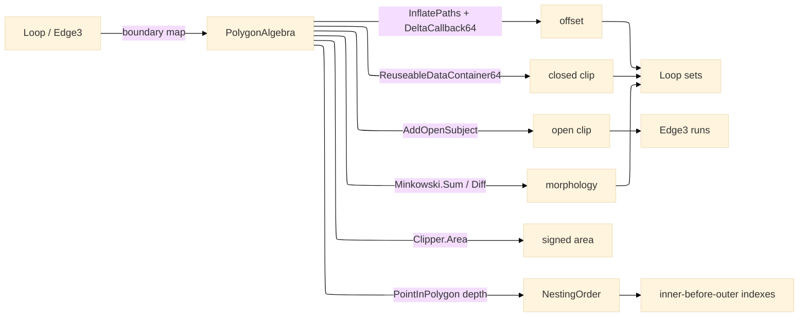

# [RASM_FABRICATION_ALGEBRA]

`PolygonAlgebra` owns line-space fabrication algebra over Clipper2: uniform offset, variable-delta offset, Boolean clipping, open-subject clipping, Minkowski morphology, and containment-depth ordering all enter through one Clipper2 boundary map and return owner#atoms-safe `Loop`/`Edge3` results. `Geometry2D/arcs` owns bulge-carrying arc-space construction, so constant-radius arc offset, kerf arcs, and arc Boolean work stay outside the line-space owner while the zero-bulge `Loop` remains the shared polygon carrier.

## [01]-[INDEX]

- [01]-[POLYGON_ALGEBRA]: owns the `ClipOp` and `OffsetEnds` axes, `Offset`, `OffsetVariable`, `Clip`, `ClipOpen`, `Area`, `Minkowski.Sum`, `Minkowski.Diff`, and `NestingOrder`; the line-space plane is the sole Clipper2 owner and the consumer-facing containment order and area-measure source.

## [02]-[POLYGON_ALGEBRA]

- Owner: `PolygonAlgebra` maps owner#atoms `Loop` and `Edge3` into Clipper2 `PathD`/`PathsD` or scaled `Path64`/`Paths64`, folds line-space results back through `Loop.AsCcw`, and keeps `Predicate.Orient2D` as the domain winding authority.
- Cases: `ClipOp` rows `union` · `intersect` · `difference` · `xor`; `OffsetEnds` rows `polygon` · `open-round` · `open-butt` · `open-square`; `Minkowski.Sum` and `Minkowski.Diff` carry the precision-bearing morphology row without admitting a no-fit-polygon type here.
- Entry: `Offset`, `OffsetVariable`, `Clip`, `ClipOpen`, `Area`, `Minkowski.Sum`, `Minkowski.Diff`, and `NestingOrder` are the complete public line-space roster; `ClipOpen` absorbs arity in the request shape — the `Seq<Edge3>` batch and the single-`Edge3` probe are two overloads of ONE name, never a `ClipOpenPath` sibling; `Fin<T>` routes empty closed-path input through `GeometryFault.DegenerateInput(...).ToError()`.
- Auto: `Offset` composes `Clipper.InflatePaths`; `OffsetVariable` composes `ClipperOffset.AddPaths`, `DeltaCallback64`, and `Execute`; `Clip` composes `ReuseableDataContainer64` plus `Clipper64.AddReuseableData` for scanbeam reuse; `ClipOpen` composes `ClipperD.AddOpenSubject`, `AddClip`, and the open-result `Execute` overload; `Area` composes the signed `Clipper.Area(PathD)` measure over the `Loop.AsCcw` boundary map; `Minkowski` composes the precision-bearing `Minkowski.Sum`/`Diff` facade; `NestingOrder` ranks deepest loops first by counting strict-interior ancestors — `Clipper.PointInPolygon` over edge-midpoint probes, boundary verdicts skipped.
- Receipt: the typed `Loop` and `Edge3` sets are the evidence; `NestingOrder` returns stable loop indexes so workholding conditioning, motion sequencing, and posting program lowering consume the same inner-before-outer order.
- Packages: Clipper2 `Clipper2Lib` (`Clipper`, `Clipper64`, `ClipperD`, `ClipperOffset`, `ReuseableDataContainer64`, `Minkowski`, `ClipType`, `FillRule`, `JoinType`, `EndType`, `PathType`, `Path64`, `Paths64`, `PathD`, `PathsD`, `PointD`, `PolyTreeD`, `DeltaCallback64`), `Rasm.Numerics` (`Predicate.Orient2D`), owner#atoms (`Loop`, `Edge3`), Thinktecture.Runtime.Extensions, LanguageExt.Core, BCL inbox.
- Growth: the inner-fit dual primitive remains one held `PolygonAlgebra` row: the nfp lane consumes `Minkowski.Diff` and names the container-feasibility fold at its own altitude, with no local `InnerFit` method.
- Boundary: out → Clipper2 `Clipper2Lib`, `Predicate.Orient2D`, owner#atoms `Loop`/`Edge3`; in ← nfp, remnant, linking, guard, workholding.Condition, motion, `Geometry2D/arcs` kerf base, slicing, scanpath hatch clipping, partition open-path engrave and marking trim, program `NestingOrder`, estimation `Area`. A second Clipper2 call site, a hand-rolled offset or open-path subtraction or area fold, a `PathsD`/`Path64` sibling signature, a `ClipOpenPath` alias, and an arc-walled offset on this line-space owner are the deleted forms.

```csharp signature
// --- [RUNTIME_PRELUDE] --------------------------------------------------------------------
using Clipper2Lib;
using LanguageExt;
using LanguageExt.Common;
using Rasm.Fabrication.Process;
using Rasm.Numerics;
using Rhino.Geometry;
using Thinktecture;
using static LanguageExt.Prelude;

namespace Rasm.Fabrication.Geometry2D;

// --- [TYPES] ------------------------------------------------------------------------------
[SmartEnum<string>]
public sealed partial class ClipOp {
    public static readonly ClipOp Union = new("union", ClipType.Union);
    public static readonly ClipOp Intersect = new("intersect", ClipType.Intersection);
    public static readonly ClipOp Difference = new("difference", ClipType.Difference);
    public static readonly ClipOp Xor = new("xor", ClipType.Xor);

    public ClipType Type { get; }
}

[SmartEnum<string>]
public sealed partial class OffsetEnds {
    public static readonly OffsetEnds Polygon = new("polygon", JoinType.Miter, EndType.Polygon);
    public static readonly OffsetEnds OpenRound = new("open-round", JoinType.Round, EndType.Round);
    public static readonly OffsetEnds OpenButt = new("open-butt", JoinType.Square, EndType.Butt);
    public static readonly OffsetEnds OpenSquare = new("open-square", JoinType.Square, EndType.Square);

    public JoinType Join { get; }
    public EndType End { get; }
}

public readonly record struct NestRank(int Index, int Depth);

// --- [CONSTANTS] --------------------------------------------------------------------------
file static class Precision {
    public const int Digits = 6;
}

// --- [OPERATIONS] -------------------------------------------------------------------------
public static class PolygonAlgebra {
    public static Fin<Seq<Loop>> Offset(Seq<Loop> loops, double delta, OffsetEnds ends) =>
        loops.IsEmpty
            ? Fin.Fail<Seq<Loop>>(GeometryFault.DegenerateInput("offset:empty").ToError())
            : Fin.Succ(FromPaths(Clipper.InflatePaths(ToPaths(loops), delta, ends.Join, ends.End, precision: Precision.Digits)));

    public static Fin<Seq<Loop>> OffsetVariable(Seq<Loop> loops, Func<Point3d, double> delta, OffsetEnds ends) {
        if (loops.IsEmpty)
            return Fin.Fail<Seq<Loop>>(GeometryFault.DegenerateInput("offset-variable:empty").ToError());

        double scale = Scale();
        ClipperOffset engine = new();
        Paths64 solution = new();
        engine.AddPaths(ToPaths64(loops, scale), ends.Join, ends.End);
        engine.DeltaCallback = (path, _, index, _) =>
            (long)(delta(new Point3d(path[index].X / scale, path[index].Y / scale, 0.0)) * scale);
        engine.Execute(engine.DeltaCallback, solution);
        return Fin.Succ(FromPaths(Clipper.ScalePathsD(solution, 1.0 / scale)));
    }

    public static Fin<Seq<Loop>> Clip(Seq<Loop> subject, Seq<Loop> clip, ClipOp op) =>
        subject.IsEmpty
            ? Fin.Fail<Seq<Loop>>(GeometryFault.DegenerateInput("clip:empty-subject").ToError())
            : Fin.Succ(FromPaths(ExecuteClosed(op.Type, subject, clip)));

    public static (Seq<Edge3> Inside, Seq<Edge3> Outside) ClipOpen(Seq<Edge3> open, Seq<Loop> regions) =>
        open.IsEmpty || regions.IsEmpty
            ? (Seq<Edge3>(), open)
            : (SplitOpen(ClipType.Intersection, open, regions), SplitOpen(ClipType.Difference, open, regions));

    public static (Seq<Edge3> Inside, Seq<Edge3> Outside) ClipOpen(Edge3 open, Seq<Loop> regions) =>
        ClipOpen(Seq1(open), regions);

    public static double Area(Loop loop) =>
        Clipper.Area(ToPath(loop));

    public static Seq<int> NestingOrder(Arr<Loop> loops) =>
        toSeq(Ranks(loops)
            .OrderByDescending(static rank => rank.Depth)
            .ThenBy(static rank => rank.Index))
            .Map(static rank => rank.Index);

    public static class Minkowski {
        public static Fin<Seq<Loop>> Sum(Loop fixedPart, Loop orbiting) =>
            Fin.Succ(FromPaths(Clipper2Lib.Minkowski.Sum(ToPath(fixedPart), ToPath(orbiting), isClosed: true, decimalPlaces: Precision.Digits)));

        public static Fin<Seq<Loop>> Diff(Loop container, Loop part) =>
            Fin.Succ(FromPaths(Clipper2Lib.Minkowski.Diff(ToPath(container), ToPath(part), isClosed: true, decimalPlaces: Precision.Digits)));
    }

    // --- [BOUNDARIES] ---------------------------------------------------------------------
    static PathsD ExecuteClosed(ClipType op, Seq<Loop> subject, Seq<Loop> clip) {
        double scale = Scale();
        ReuseableDataContainer64 reuse = new();
        Paths64 closed = new();
        Clipper64 engine = new();
        reuse.AddPaths(ToPaths64(subject, scale), PathType.Subject, isOpen: false);
        if (!clip.IsEmpty)
            reuse.AddPaths(ToPaths64(clip, scale), PathType.Clip, isOpen: false);
        engine.AddReuseableData(reuse);
        engine.Execute(op, FillRule.NonZero, closed);
        return Clipper.ScalePathsD(closed, 1.0 / scale);
    }

    static Seq<Edge3> SplitOpen(ClipType op, Seq<Edge3> open, Seq<Loop> regions) {
        ClipperD engine = new(Precision.Digits);
        PathsD openPaths = new();
        engine.AddOpenSubject(new PathsD(open.Map(ToOpenPath)));
        engine.AddClip(ToPaths(regions));
        engine.Execute(op, FillRule.NonZero, new PolyTreeD(), openPaths);
        return Runs(openPaths);
    }

    static Seq<NestRank> Ranks(Arr<Loop> loops) =>
        toSeq(Enumerable.Range(0, loops.Count)).Map(i => new NestRank(i, Depth(i, loops)));

    // Depth probes edge midpoints until one lands strictly off the candidate container's boundary — a
    // bare At(0) vertex probe is boundary-ambiguous under touching or rotated loops and ranks unstably.
    static int Depth(int index, Arr<Loop> loops) =>
        toSeq(Enumerable.Range(0, loops.Count))
            .Filter(i => i != index && loops[index].Count > 0)
            .Filter(i => Within(loops[index], loops[i]))
            .Count;

    static bool Within(Loop inner, Loop outer) =>
        toSeq(Enumerable.Range(0, inner.Count))
            .Map(k => Clipper.PointInPolygon(Mid(inner.At(k), inner.At((k + 1) % inner.Count)), ToPath(outer), Precision.Digits))
            .Find(static verdict => verdict != PointInPolygonResult.IsOn)
            .Map(static verdict => verdict == PointInPolygonResult.IsInside)
            .IfNone(false);

    static PointD Mid(Point3d a, Point3d b) => new((a.X + b.X) / 2.0, (a.Y + b.Y) / 2.0);

    static double Scale() => Math.Pow(10.0, Precision.Digits);

    static Paths64 ToPaths64(Seq<Loop> loops, double scale) => Clipper.ScalePaths64(ToPaths(loops), scale);

    static PathsD ToPaths(Seq<Loop> loops) => new(loops.Map(ToPath));

    static PathD ToPath(Loop loop) => new(loop.AsCcw().Vertices.Map(ToPoint));

    static PathD ToOpenPath(Edge3 edge) => new() { ToPoint(edge.A), ToPoint(edge.B) };

    static PointD ToPoint(Point3d point) => new(point.X, point.Y);

    static Seq<Loop> FromPaths(PathsD paths) =>
        toSeq(paths).Map(path => new Loop(toSeq(path).Map(point => new Point3d(point.x, point.y, 0.0)).ToArr(), Closed: true).AsCcw());

    static Seq<Edge3> Runs(PathsD paths) =>
        toSeq(paths).Bind(path => path.Count <= 1
            ? Seq<Edge3>()
            : toSeq(Enumerable.Range(0, path.Count - 1))
                .Map(i => new Edge3(new Point3d(path[i].x, path[i].y, 0.0), new Point3d(path[i + 1].x, path[i + 1].y, 0.0))));
}
```


