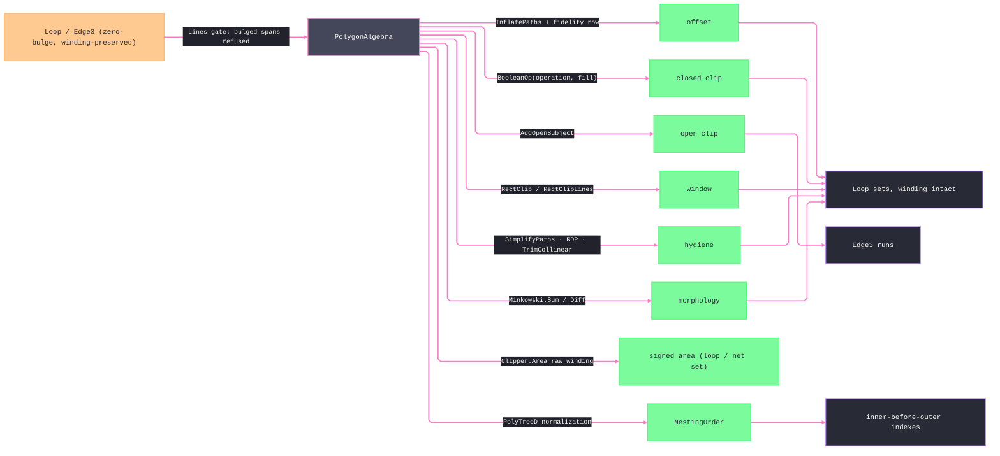

# [RASM_FABRICATION_ALGEBRA]

`PolygonAlgebra` owns line-space fabrication algebra over Clipper2: uniform and variable offset, closed and open clipping, rectangle windowing, simplification, Minkowski morphology, signed measure, and containment-depth ordering. Every operation returns `Loop` or `Edge3` owner atoms through `Fin<T>`.

The boundary map preserves winding, plane, and rejects bulges. Outer counterclockwise and hole clockwise contours remain distinct under `PolygonFill.NonZero`; `ToPath` never re-winds, and a caller requiring a pure outer normalizes explicitly through `Loop.AsCcw`. Every result re-emits on the admitted `Loop.Plane` elevation — multi-input operations reject cross-plane sets beside the mixed-context gate, so a slice-height profile never collapses to `Z = 0`. Arc profiles enter line space only through `ArcAlgebra.Densify`.

Closed-region operations reject open `Loop` values. Offset operations alone admit open loops, and `OffsetPolicy.End` must match input closure. `ClipOpen` and `NestingOrder` consume the same explicit `PolygonFill` vocabulary as closed clipping.

## [01]-[INDEX]

- [01]-[POLYGON_ALGEBRA]: `PolygonBoolean`, `PolygonFill`, `OffsetJoin`, `OffsetEnd`, `OffsetPolicy`, `SimplifyKind`, and the single line-space operation owner.

## [02]-[POLYGON_ALGEBRA]

- Owner: `PolygonAlgebra` maps admitted `Loop` and `Edge3` values into Clipper2 paths and folds results back through `Loop.Admit` under the source `Context`. Every multi-loop operation rejects mixed contexts, and every line-space operation rejects bulges.
- Cases: `PolygonBoolean` and `PolygonFill` remain independent execution parameters, so all valid operation/fill combinations are generatable without named cross-product rows. `OffsetPolicy` carries local `OffsetJoin` and `OffsetEnd` values plus admitted miter and arc tolerances. `SimplifyKind` selects vertex, Ramer-Douglas-Peucker, or collinear hygiene.
- Entry: `Offset` consumes one admitted policy. `OffsetVariable` consumes a per-loop, per-vertex delta matrix and uses the callback's path and vertex indexes directly. `Clip`, `ClipOpen`, and `NestingOrder` accept the local fill vocabulary. Every public operation owns all arities through its collection shape — `Seq1` is the singular form, and no forwarding sibling exists beside a collection entry. Open-window clipping accepts an explicit `Context`, and every operation returns `Fin<T>`.
- Auto: Clipper2 owns inflation, callback offset, Boolean execution, open clipping, rectangle clipping, simplification, signed area, and Minkowski operations. Decimal precision derives from `Context.Absolute` and is bounded to Clipper2's admitted range. `NestingOrder` self-unions the set into `PolyTreeD`, flattens the normalized hierarchy, and orders by absolute enclosed area so nested children precede enclosing contours.
- Receipt: typed `Loop` and `Edge3` sets are the evidence with winding intact; `NestingOrder` returns normalized loops in inner-before-outer order.
- Packages: Clipper2 supplies `Clipper`, `ClipperD`, `ClipperOffset`, `Minkowski`, `Path64`, `Paths64`, `PathD`, `PathsD`, `RectD`, `PolyTreeD`, and the private native enum projections. `Loop`, `Edge3`, and `Context` remain owner atoms; Thinktecture and LanguageExt supply the closed vocabularies and rails.
- Growth: new Boolean and fill values arrive through the existing independent parameters, new offset combinations through `OffsetPolicy.Admit`, and a new hygiene algorithm through one `SimplifyKind` row and dispatch arm.
- Boundary: Clipper2 types and enums remain private. Every polygon re-enters through `Loop.Admit`, every edge input proves finite endpoints, multi-loop operations reject mixed contexts, cross-input operations admit one shared plane and context before projection and re-emit on that plane, and bulged profiles must compose `ArcAlgebra.Densify` before line-space admission.

```csharp signature
// --- [RUNTIME_PRELUDE] ----------------------------------------------------------------------------------------------------------------------------
using System.Linq;
using Clipper2Lib;
using LanguageExt;
using LanguageExt.Common;
using Rasm.Domain;
using Rasm.Fabrication.Process;
using Rasm.Numerics;
using Rhino.Geometry;
using Thinktecture;
using static LanguageExt.Prelude;

namespace Rasm.Fabrication.Geometry2D;

// --- [TYPES] --------------------------------------------------------------------------------------------------------------------------------------
[SmartEnum<string>]
public sealed partial class SimplifyKind {
    public static readonly SimplifyKind Vertex = new("vertex");
    public static readonly SimplifyKind Rdp = new("rdp");
    public static readonly SimplifyKind Collinear = new("collinear");
}

[SmartEnum<string>]
public sealed partial class PolygonBoolean {
    public static readonly PolygonBoolean Union = new("union");
    public static readonly PolygonBoolean Intersection = new("intersection");
    public static readonly PolygonBoolean Difference = new("difference");
    public static readonly PolygonBoolean Xor = new("xor");
}

[SmartEnum<string>]
public sealed partial class PolygonFill {
    public static readonly PolygonFill EvenOdd = new("even-odd");
    public static readonly PolygonFill NonZero = new("non-zero");
    public static readonly PolygonFill Positive = new("positive");
    public static readonly PolygonFill Negative = new("negative");
}

[SmartEnum<string>]
public sealed partial class OffsetJoin {
    public static readonly OffsetJoin Miter = new("miter");
    public static readonly OffsetJoin Square = new("square");
    public static readonly OffsetJoin Bevel = new("bevel");
    public static readonly OffsetJoin Round = new("round");
}

[SmartEnum<string>]
public sealed partial class OffsetEnd {
    public static readonly OffsetEnd Polygon = new("polygon");
    public static readonly OffsetEnd Joined = new("joined");
    public static readonly OffsetEnd Butt = new("butt");
    public static readonly OffsetEnd Square = new("square");
    public static readonly OffsetEnd Round = new("round");
}

public sealed record OffsetPolicy {
    private OffsetPolicy(OffsetJoin join, OffsetEnd end, double miterLimit, double arcTolerance) =>
        (Join, End, MiterLimit, ArcTolerance) = (join, end, miterLimit, arcTolerance);

    public OffsetJoin Join { get; }
    public OffsetEnd End { get; }
    public double MiterLimit { get; }
    public double ArcTolerance { get; }

    public static Fin<OffsetPolicy> Admit(OffsetJoin join, OffsetEnd end, double miterLimit, double arcTolerance) =>
        double.IsFinite(miterLimit)
        && miterLimit >= 1.0
        && double.IsFinite(arcTolerance)
        && arcTolerance > 0.0
            ? Fin.Succ(new OffsetPolicy(join, end, miterLimit, arcTolerance))
            : Fin.Fail<OffsetPolicy>(GeometryFault.DegenerateInput("polygon-offset-policy").ToError());
}

// --- [OPERATIONS] ---------------------------------------------------------------------------------------------------------------------------------
public static class PolygonAlgebra {
    public static Fin<Seq<Loop>> Offset(Seq<Loop> loops, double delta, OffsetPolicy policy) =>
        from admitted in OffsetInputs(loops, policy, "offset")
        from _ in double.IsFinite(delta)
            ? Fin.Succ(unit)
            : Fin.Fail<Unit>(GeometryFault.DegenerateInput("offset:delta").ToError())
        from result in FromPaths(
            Clipper.InflatePaths(ToPaths(admitted), delta, Native(policy.Join), Native(policy.End),
                miterLimit: policy.MiterLimit, precision: Digits(admitted.Head.Tolerance), arcTolerance: policy.ArcTolerance),
            admitted.Head.Tolerance, admitted.Head.Plane)
        select result;

    public static Fin<Seq<Loop>> OffsetVariable(Seq<Loop> loops, Seq<Arr<double>> deltas, OffsetPolicy policy) =>
        OffsetInputs(loops, policy, "offset-variable").Bind(admitted => {
            if (deltas.Count != admitted.Count
                || deltas.Zip(admitted, static (row, loop) => row.Count == loop.Count).Exists(static valid => !valid)
                || deltas.Bind(static row => row).Exists(static delta => !double.IsFinite(delta)))
                return Fin.Fail<Seq<Loop>>(GeometryFault.DegenerateInput("offset-variable:deltas").ToError());
            double scale = Scale(admitted.Head.Tolerance);
            Paths64 paths = ToPaths64(admitted, scale);
            ClipperOffset engine = new(policy.MiterLimit, policy.ArcTolerance * scale);
            Paths64 solution = new();
            engine.AddPaths(paths, Native(policy.Join), Native(policy.End));
            engine.Execute(
                (_, _, pathIndex, vertexIndex) => (long)(deltas[pathIndex][vertexIndex] * scale),
                solution);
            return FromPaths(Clipper.ScalePathsD(solution, 1.0 / scale), admitted.Head.Tolerance, admitted.Head.Plane);
        });

    // Winding reaches the selected fill rule unchanged, so clockwise holes subtract under `NonZero`.
    public static Fin<Seq<Loop>> Clip(
        Seq<Loop> subject,
        Seq<Loop> clip,
        PolygonBoolean operation,
        PolygonFill fill) =>
        from admittedSubject in Regions(subject, "clip:subject")
        from admittedClip in Regions(clip, "clip:clip", admitEmpty: true)
        from _ in admittedClip.IsEmpty
            ? Fin.Succ(unit)
            : SharedFrame(admittedSubject.Head, admittedClip.Head, "clip")
        from result in FromPaths(
            Clipper.BooleanOp(
                Native(operation),
                ToPaths(admittedSubject),
                admittedClip.IsEmpty ? null : ToPaths(admittedClip),
                Native(fill),
                Digits(admittedSubject.Head.Tolerance)),
            admittedSubject.Head.Tolerance, admittedSubject.Head.Plane)
        select result;

    // One arity-polymorphic open-clip entry: a single edge rides Seq1 into the same admission and split body.
    public static Fin<(Seq<Edge3> Inside, Seq<Edge3> Outside)> ClipOpen(
        Seq<Edge3> open,
        Seq<Loop> regions,
        PolygonFill fill) =>
        from admittedOpen in Open(open, "clip-open:subject")
        from result in admittedOpen.IsEmpty || regions.IsEmpty
            ? Fin.Succ((Inside: Seq<Edge3>(), Outside: admittedOpen))
            : Regions(regions, "clip-open:regions").Bind(admittedRegions =>
                Coplanar(admittedOpen, admittedRegions.Head.Plane, admittedRegions.Head.Tolerance)
                    ? Fin.Succ((
                        Inside: SplitOpen(ClipType.Intersection, admittedOpen, admittedRegions, fill),
                        Outside: SplitOpen(ClipType.Difference, admittedOpen, admittedRegions, fill)))
                    : Fin.Fail<(Seq<Edge3> Inside, Seq<Edge3> Outside)>(GeometryFault.DegenerateInput("clip-open:plane").ToError()))
        select result;

    // Closed and open inputs share the dedicated rectangular clipping boundary.
    public static Fin<Seq<Loop>> Window(Seq<Loop> loops, BoundingBox window) =>
        from admitted in Regions(loops, "window")
        from _ in window.IsValid
            && window.Diagonal.X > admitted.Head.Tolerance.Absolute.Value
            && window.Diagonal.Y > admitted.Head.Tolerance.Absolute.Value
            ? Fin.Succ(unit)
            : Fin.Fail<Unit>(GeometryFault.DegenerateInput("window:bounds").ToError())
        from result in FromPaths(
            Clipper.RectClip(RectOf(window), ToPaths(admitted), Digits(admitted.Head.Tolerance)),
            admitted.Head.Tolerance, admitted.Head.Plane)
        select result;

    public static Fin<Seq<Edge3>> Window(Seq<Edge3> open, BoundingBox window, Context tolerance) =>
        !window.IsValid
        || window.Diagonal.X <= tolerance.Absolute.Value
        || window.Diagonal.Y <= tolerance.Absolute.Value
            ? Fin.Fail<Seq<Edge3>>(GeometryFault.DegenerateInput("window:bounds").ToError())
            : Open(open, "window:open").Bind(admitted => admitted.IsEmpty
                ? Fin.Succ(admitted)
                : Coplanar(admitted, admitted.Head.A.Z, tolerance)
                    ? Fin.Succ(Runs(
                        Clipper.RectClipLines(RectOf(window), new PathsD(admitted.Map(ToOpenPath)), Digits(tolerance)),
                        admitted.Head.A.Z))
                    : Fin.Fail<Seq<Edge3>>(GeometryFault.DegenerateInput("window:plane").ToError()));

    public static Fin<Seq<Loop>> Simplify(Seq<Loop> loops, double epsilon, SimplifyKind kind) =>
        from admitted in Lines(loops, "simplify")
        from _ in double.IsFinite(epsilon) && epsilon > 0.0
            ? Fin.Succ(unit)
            : Fin.Fail<Unit>(GeometryFault.DegenerateInput("simplify:epsilon").ToError())
        from result in kind.Switch(
            state: (Loops: admitted, Epsilon: epsilon),
            vertex: static state => state.Loops.Traverse(loop =>
                FromPath(Clipper.SimplifyPath(ToPath(loop), state.Epsilon, loop.Closed), loop.Closed, loop.Tolerance, loop.Plane))
                .As().Map(static result => result.ToSeq()),
            rdp: static state => state.Loops.Traverse(loop =>
                FromPath(Clipper.RamerDouglasPeucker(ToPath(loop), state.Epsilon), loop.Closed, loop.Tolerance, loop.Plane)).As().Map(static result => result.ToSeq()),
            collinear: static state => state.Loops.Traverse(loop =>
                FromPath(Clipper.TrimCollinear(ToPath(loop), Digits(loop.Tolerance), isOpen: !loop.Closed), loop.Closed, loop.Tolerance, loop.Plane)).As().Map(static result => result.ToSeq()))
        select result;

    // The signed net measure preserves positive counterclockwise outers and negative clockwise holes; a single loop rides Seq1.
    public static Fin<double> Area(Seq<Loop> loops) =>
        Regions(loops, "area").Map(static admitted => Clipper.Area(ToPaths(admitted)));

    public static Fin<Seq<Loop>> NestingOrder(Arr<Loop> loops, PolygonFill fill) =>
        from admitted in Regions(loops.ToSeq(), "nesting-order")
        let tree = TreeOf(admitted, fill)
        from normalized in FromPaths(Clipper.PolyTreeToPathsD(tree), admitted.Head.Tolerance, admitted.Head.Plane)
        select normalized.OrderBy(loop => Math.Abs(Clipper.Area(ToPath(loop)))).ToSeq();

    public static class Minkowski {
        public static Fin<Seq<Loop>> Sum(Loop fixedPart, Loop orbiting) =>
            from admitted in Regions(Seq(fixedPart, orbiting), "minkowski:sum")
            from result in FromPaths(
                Clipper2Lib.Minkowski.Sum(
                    ToPath(admitted[0].AsCcw()),
                    ToPath(admitted[1].AsCcw()),
                    isClosed: true,
                    decimalPlaces: Digits(admitted.Head.Tolerance)),
                admitted.Head.Tolerance, admitted.Head.Plane)
            select result;

        public static Fin<Seq<Loop>> Diff(Loop container, Loop part) =>
            from admitted in Regions(Seq(container, part), "minkowski:diff")
            from result in FromPaths(
                Clipper2Lib.Minkowski.Diff(
                    ToPath(admitted[0].AsCcw()),
                    ToPath(admitted[1].AsCcw()),
                    isClosed: true,
                    decimalPlaces: Digits(admitted.Head.Tolerance)),
                admitted.Head.Tolerance, admitted.Head.Plane)
            select result;
    }

    // --- [BOUNDARIES] -------------------------------------------------------------------------------------------------------------------------------
    // Line-space operations reject bulged spans until the arcs owner densifies them; the set shares one admitted plane so
    // results re-emit at the source elevation instead of collapsing to Z = 0.
    private static Fin<Seq<Loop>> Lines(Seq<Loop> loops, string locus, bool admitEmpty = false) =>
        loops.IsEmpty && !admitEmpty
            ? Fin.Fail<Seq<Loop>>(GeometryFault.DegenerateInput($"{locus}:empty").ToError())
            : loops.Exists(static l => !l.Bulges.IsEmpty && l.Bulges.Exists(static b => b != 0.0))
                ? Fin.Fail<Seq<Loop>>(GeometryFault.DegenerateInput($"{locus}:bulged").ToError())
                : loops.Map(static loop => loop.Tolerance).Distinct().Count > 1
                    ? Fin.Fail<Seq<Loop>>(GeometryFault.DegenerateInput($"{locus}:mixed-context").ToError())
                    : loops.Exists(loop => Math.Abs(loop.Plane - loops.Head.Plane) > loop.Tolerance.Absolute.Value)
                        ? Fin.Fail<Seq<Loop>>(GeometryFault.DegenerateInput($"{locus}:plane").ToError())
                        : Fin.Succ(loops);

    private static Fin<Seq<Loop>> Regions(Seq<Loop> loops, string locus, bool admitEmpty = false) =>
        Lines(loops, locus, admitEmpty).Bind(admitted => admitted.Exists(static loop => !loop.Closed)
            ? Fin.Fail<Seq<Loop>>(GeometryFault.DegenerateInput($"{locus}:open").ToError())
            : Fin.Succ(admitted));

    private static Fin<Seq<Loop>> OffsetInputs(Seq<Loop> loops, OffsetPolicy policy, string locus) =>
        Lines(loops, locus).Bind(admitted => admitted.Exists(loop => loop.Closed != (policy.End == OffsetEnd.Polygon))
            ? Fin.Fail<Seq<Loop>>(GeometryFault.DegenerateInput($"{locus}:end-mode").ToError())
            : Fin.Succ(admitted));

    private static Fin<Seq<Edge3>> Open(Seq<Edge3> edges, string locus) =>
        edges.Exists(static edge => !edge.A.IsValid || !edge.B.IsValid || edge.A == edge.B)
            ? Fin.Fail<Seq<Edge3>>(GeometryFault.DegenerateInput(locus).ToError())
            : Fin.Succ(edges);

    // Cross-input admission: both operand sets share one Context and one plane before any XY projection erases Z.
    private static Fin<Unit> SharedFrame(Loop subject, Loop other, string locus) =>
        subject.Tolerance != other.Tolerance
            ? Fin.Fail<Unit>(GeometryFault.DegenerateInput($"{locus}:mixed-context").ToError())
            : Math.Abs(subject.Plane - other.Plane) > subject.Tolerance.Absolute.Value
                ? Fin.Fail<Unit>(GeometryFault.DegenerateInput($"{locus}:plane").ToError())
                : Fin.Succ(unit);

    private static bool Coplanar(Seq<Edge3> edges, double plane, Context tolerance) =>
        edges.ForAll(edge => Math.Abs(edge.A.Z - plane) <= tolerance.Absolute.Value
            && Math.Abs(edge.B.Z - plane) <= tolerance.Absolute.Value);

    private static Seq<Edge3> SplitOpen(
        ClipType op,
        Seq<Edge3> open,
        Seq<Loop> regions,
        PolygonFill fill) {
        ClipperD engine = new(Digits(regions.Head.Tolerance));
        PathsD openPaths = new();
        engine.AddOpenSubject(new PathsD(open.Map(ToOpenPath)));
        engine.AddClip(ToPaths(regions));
        engine.Execute(op, Native(fill), new PolyTreeD(), openPaths);
        return Runs(openPaths, regions.Head.Plane);
    }

    private static PolyTreeD TreeOf(Seq<Loop> loops, PolygonFill fill) {
        ClipperD engine = new(Digits(loops.Head.Tolerance));
        PolyTreeD tree = new();
        engine.AddSubject(ToPaths(loops));
        engine.Execute(ClipType.Union, Native(fill), tree);
        return tree;
    }

    private static int Digits(Context tolerance) =>
        int.Clamp((int)Math.Ceiling(-Math.Log10(tolerance.Absolute.Value)), 0, 8);

    private static double Scale(Context tolerance) => Math.Pow(10.0, Digits(tolerance));

    // Generated Map projections: constant native verdicts, total by construction — a new vocabulary row breaks each seam loudly.
    private static ClipType Native(PolygonBoolean operation) => operation.Map(
        union: ClipType.Union, intersection: ClipType.Intersection, difference: ClipType.Difference, xor: ClipType.Xor);

    private static FillRule Native(PolygonFill fill) => fill.Map(
        evenOdd: FillRule.EvenOdd, nonZero: FillRule.NonZero, positive: FillRule.Positive, negative: FillRule.Negative);

    private static JoinType Native(OffsetJoin join) => join.Map(
        miter: JoinType.Miter, square: JoinType.Square, bevel: JoinType.Bevel, round: JoinType.Round);

    private static EndType Native(OffsetEnd end) => end.Map(
        polygon: EndType.Polygon, joined: EndType.Joined, butt: EndType.Butt, square: EndType.Square, round: EndType.Round);

    private static RectD RectOf(BoundingBox window) => new(window.Min.X, window.Min.Y, window.Max.X, window.Max.Y);

    private static Paths64 ToPaths64(Seq<Loop> loops, double scale) => Clipper.ScalePaths64(ToPaths(loops), scale);

    private static PathsD ToPaths(Seq<Loop> loops) => new(loops.Map(ToPath));

    // Boundary conversion preserves outer and hole winding.
    private static PathD ToPath(Loop loop) => new(loop.Vertices.Map(ToPoint));

    private static PathD ToOpenPath(Edge3 edge) => new() { ToPoint(edge.A), ToPoint(edge.B) };

    private static PointD ToPoint(Point3d point) => new(point.X, point.Y);

    private static Fin<Seq<Loop>> FromPaths(PathsD paths, Context tolerance, double plane) =>
        toSeq(paths).Traverse(path => FromPath(path, closed: true, tolerance, plane)).As().Map(static loops => loops.ToSeq());

    private static Fin<Loop> FromPath(PathD path, bool closed, Context tolerance, double plane) =>
        Loop.Admit(
            toSeq(path).Map(point => new Point3d(point.x, point.y, plane)).ToArr(),
            closed,
            [],
            tolerance);

    private static Seq<Edge3> Runs(PathsD paths, double plane) =>
        toSeq(paths).Bind(path => path.Count <= 1
            ? Seq<Edge3>()
            : toSeq(Enumerable.Range(0, path.Count - 1))
                .Map(i => new Edge3(new Point3d(path[i].x, path[i].y, plane), new Point3d(path[i + 1].x, path[i + 1].y, plane))));
}
```


