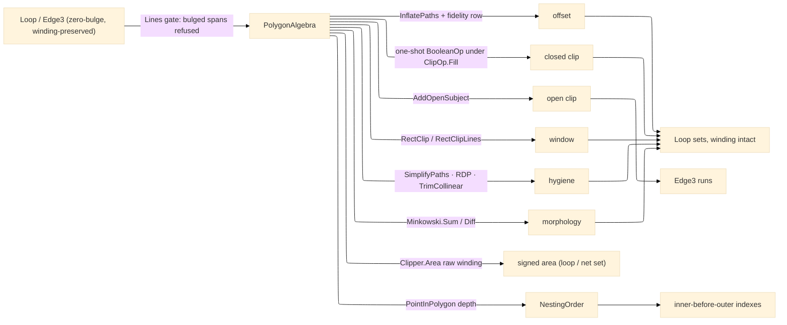

# [RASM_FABRICATION_ALGEBRA]

`PolygonAlgebra` owns line-space fabrication algebra over Clipper2: uniform offset, variable-delta offset, Boolean clipping, open-subject clipping, rectangle window clipping, path simplification, Minkowski morphology, signed measure, and containment-depth ordering all enter through one Clipper2 boundary map and return owner#atoms-safe `Loop`/`Edge3` results. The boundary map is WINDING-PRESERVING and BULGE-REFUSING: winding is load-bearing data (outer CCW, hole CW — the kernel slice forest's own contract, which `FillRule.NonZero` subtracts correctly ONLY when the map carries it through), so `ToPath` never re-winds and a caller wanting a pure outer normalizes explicitly with `Loop.AsCcw`; a non-zero `Bulges` column is REFUSED typed at every entry (`GeometryFault.DegenerateInput`) — the silent arc-to-chord lowering was the named corruption, and an arc profile densifies through the `Geometry2D/arcs` `Densify` bridge before it may enter line space. `Geometry2D/arcs` owns bulge-carrying arc-space construction, so constant-radius arc offset, kerf arcs, and arc Boolean work stay outside the line-space owner while the zero-bulge `Loop` remains the shared polygon carrier.

## [01]-[INDEX]

- [01]-[POLYGON_ALGEBRA]: owns the `ClipOp` (with its `Fill` policy column) and `OffsetEnds` axes, the `SimplifyKind` hygiene vocabulary, the `OffsetFidelity` corner-quality row, `Offset`, `OffsetVariable`, `Clip`, `ClipOpen`, `Window`, `Simplify`, `Area` (single and set arity), `Minkowski.Sum`, `Minkowski.Diff`, and `NestingOrder`; the line-space plane is the sole Clipper2 owner and the consumer-facing containment order and area-measure source.

## [02]-[POLYGON_ALGEBRA]

- Owner: `PolygonAlgebra` maps owner#atoms `Loop` and `Edge3` into Clipper2 `PathD`/`PathsD` or scaled `Path64`/`Paths64` and folds line-space results back winding-intact; `Predicate.Orient2D` stays the domain winding authority and `Loop.AsCcw` the caller's explicit normalization.
- Cases: `ClipOp` rows `union` · `intersect` · `difference` · `xor` (each binding `ClipType` AND its `FillRule` policy column — `NonZero` the hole-respecting default) plus `union-evenodd` (self-overlapping subjects) — fill is a ROW datum, never an execution-site literal; `OffsetEnds` rows `polygon` · `polygon-round` · `polygon-bevel` · `open-round` · `open-butt` · `open-square` · `open-joined` — the `JoinType`×`EndType` postures fabrication reaches (rounded outer corners at positive kerf ride `polygon-round`); `SimplifyKind` rows `vertex` (epsilon vertex simplification) · `rdp` (Ramer-Douglas-Peucker) · `collinear` (collinear-point trim); `OffsetFidelity` the corner-quality row (`MiterLimit`, `ArcTolerance`; `default` resolves the Clipper defaults); `Minkowski.Sum` and `Minkowski.Diff` carry the precision-bearing morphology row without admitting a no-fit-polygon type here.
- Entry: `Offset`, `OffsetVariable`, `Clip`, `ClipOpen`, `Window`, `Simplify`, `Area`, `Minkowski.Sum`, `Minkowski.Diff`, and `NestingOrder` are the complete public line-space roster; `ClipOpen` and `Window` absorb arity in the request shape — the `Seq<Edge3>` batch and the single-`Edge3` probe, the closed `Seq<Loop>` and the open `Seq<Edge3>` window forms, are overloads of ONE name each, never `ClipOpenPath`/`WindowLines` siblings; `Area` carries single-loop and net-set arity on one name (the set form sums SIGNED areas, holes negative); `Fin<T>` routes empty input AND any bulged span through `GeometryFault.DegenerateInput(...).ToError()`.
- Auto: `Offset` composes `Clipper.InflatePaths` with the fidelity row's `miterLimit`/`arcTolerance`; `OffsetVariable` composes `ClipperOffset.AddPaths` and the `DeltaCallback64` `Execute` overload; `Clip` composes the one-shot `Clipper.BooleanOp` under the op row's fill (the per-call `ReuseableDataContainer64` that cached nothing across calls is the deleted decorative form); `ClipOpen` composes `ClipperD.AddOpenSubject`, `AddClip`, and the open-result `Execute` overload; `Window` composes `Clipper.RectClip`/`RectClipLines` over the axis-aligned window; `Simplify` dispatches its kind row over `Clipper.SimplifyPaths`/`RamerDouglasPeucker`/`TrimCollinear`; `Area` composes the signed `Clipper.Area(PathD)`/`Area(PathsD)` measure over the RAW winding (positive = CCW); `Minkowski` composes the precision-bearing `Minkowski.Sum`/`Diff` facade over explicitly-normalized patterns; `NestingOrder` ranks deepest loops first by counting strict-interior ancestors — `Clipper.PointInPolygon` over edge-midpoint probes, boundary verdicts skipped.
- Receipt: the typed `Loop` and `Edge3` sets are the evidence, winding intact; `NestingOrder` returns stable loop indexes so workholding conditioning, motion sequencing, and posting program lowering consume the same inner-before-outer order.
- Packages: Clipper2 `Clipper2Lib` (`Clipper`, `ClipperD`, `ClipperOffset`, `Minkowski`, `ClipType`, `FillRule`, `JoinType`, `EndType`, `Path64`, `Paths64`, `PathD`, `PathsD`, `PointD`, `RectD`, `PolyTreeD`, `DeltaCallback64`), `Rasm.Numerics` (`Predicate.Orient2D`), owner#atoms (`Loop`, `Edge3`), Thinktecture.Runtime.Extensions, LanguageExt.Core, BCL inbox.
- Growth: a new fill discipline is one `ClipOp` row; a new corner posture is one `OffsetEnds` row; a new hygiene pass is one `SimplifyKind` row; the inner-fit dual primitive remains one held `PolygonAlgebra` row: the nfp lane consumes `Minkowski.Diff` and names the container-feasibility fold at its own altitude, with no local `InnerFit` method.
- Boundary: out → Clipper2 `Clipper2Lib`, `Predicate.Orient2D`, owner#atoms `Loop`/`Edge3`; in ← nfp, remnant, linking, guard, workholding.Condition, motion, `Geometry2D/arcs` kerf base, slicing, scanpath hatch clipping, partition open-path engrave and marking trim, program `NestingOrder`, estimation `Area`. A second Clipper2 call site, a hand-rolled offset or open-path subtraction or area fold, a `PathsD`/`Path64` sibling signature, a `ClipOpenPath` alias, an arc-walled offset on this line-space owner, a boundary map that re-winds its input (the hole-collapse corruption `AsCcw`-on-entry caused under `NonZero`), and a silently chord-lowered bulged loop are the deleted forms.

```csharp signature
// --- [RUNTIME_PRELUDE] ----------------------------------------------------------------------------------------------------------------------------
using Clipper2Lib;
using LanguageExt;
using LanguageExt.Common;
using Rasm.Fabrication.Process;
using Rasm.Numerics;
using Rhino.Geometry;
using Thinktecture;
using static LanguageExt.Prelude;

namespace Rasm.Fabrication.Geometry2D;

// --- [TYPES] --------------------------------------------------------------------------------------------------------------------------------------
// Fill is a ROW datum beside the clip type — the execution-site FillRule literal was the named policy hole;
// a new fill discipline is one row, never a parameter knob.
[SmartEnum<string>]
public sealed partial class ClipOp {
    public static readonly ClipOp Union = new("union", ClipType.Union, FillRule.NonZero);
    public static readonly ClipOp UnionEvenOdd = new("union-evenodd", ClipType.Union, FillRule.EvenOdd);
    public static readonly ClipOp Intersect = new("intersect", ClipType.Intersection, FillRule.NonZero);
    public static readonly ClipOp Difference = new("difference", ClipType.Difference, FillRule.NonZero);
    public static readonly ClipOp Xor = new("xor", ClipType.Xor, FillRule.NonZero);

    public ClipType Type { get; }
    public FillRule Fill { get; }
}

[SmartEnum<string>]
public sealed partial class OffsetEnds {
    public static readonly OffsetEnds Polygon = new("polygon", JoinType.Miter, EndType.Polygon);
    public static readonly OffsetEnds PolygonRound = new("polygon-round", JoinType.Round, EndType.Polygon);
    public static readonly OffsetEnds PolygonBevel = new("polygon-bevel", JoinType.Bevel, EndType.Polygon);
    public static readonly OffsetEnds OpenRound = new("open-round", JoinType.Round, EndType.Round);
    public static readonly OffsetEnds OpenButt = new("open-butt", JoinType.Square, EndType.Butt);
    public static readonly OffsetEnds OpenSquare = new("open-square", JoinType.Square, EndType.Square);
    public static readonly OffsetEnds OpenJoined = new("open-joined", JoinType.Round, EndType.Joined);

    public JoinType Join { get; }
    public EndType End { get; }
}

[SmartEnum<string>]
public sealed partial class SimplifyKind {
    public static readonly SimplifyKind Vertex = new("vertex");
    public static readonly SimplifyKind Rdp = new("rdp");
    public static readonly SimplifyKind Collinear = new("collinear");
}

public readonly record struct NestRank(int Index, int Depth);

// Corner quality as a value row: default resolves the Clipper miter/arc defaults, so landed 3-arg call sites hold.
public readonly record struct OffsetFidelity(double MiterLimit, double ArcTolerance) {
    public double Miter => MiterLimit <= 0.0 ? 2.0 : MiterLimit;
    public double Arc => Math.Max(0.0, ArcTolerance);
}

// --- [CONSTANTS] ----------------------------------------------------------------------------------------------------------------------------------
file static class Precision {
    public const int Digits = 6;
}

// --- [OPERATIONS] ---------------------------------------------------------------------------------------------------------------------------------
public static class PolygonAlgebra {
    public static Fin<Seq<Loop>> Offset(Seq<Loop> loops, double delta, OffsetEnds ends, OffsetFidelity fidelity = default) =>
        Lines(loops, "offset").Map(admitted =>
            FromPaths(Clipper.InflatePaths(ToPaths(admitted), delta, ends.Join, ends.End,
                miterLimit: fidelity.Miter, precision: Precision.Digits, arcTolerance: fidelity.Arc)));

    public static Fin<Seq<Loop>> OffsetVariable(Seq<Loop> loops, Func<Point3d, double> delta, OffsetEnds ends) =>
        Lines(loops, "offset-variable").Map(admitted => {
            double scale = Scale();
            ClipperOffset engine = new();
            Paths64 solution = new();
            engine.AddPaths(ToPaths64(admitted, scale), ends.Join, ends.End);
            engine.Execute(
                (path, _, index, _) => (long)(delta(new Point3d(path[index].X / scale, path[index].Y / scale, 0.0)) * scale),
                solution);
            return FromPaths(Clipper.ScalePathsD(solution, 1.0 / scale));
        });

    // ONE one-shot Boolean under the op row's fill: winding travels through, so a CW hole subtracts under NonZero —
    // the per-call reuse container that cached nothing across calls is the deleted decorative form.
    public static Fin<Seq<Loop>> Clip(Seq<Loop> subject, Seq<Loop> clip, ClipOp op) =>
        Lines(subject, "clip:subject").Bind(s =>
            Lines(clip, "clip:clip", admitEmpty: true).Map(c =>
                FromPaths(Clipper.BooleanOp(op.Type, ToPaths(s), c.IsEmpty ? null : ToPaths(c), op.Fill, Precision.Digits))));

    public static (Seq<Edge3> Inside, Seq<Edge3> Outside) ClipOpen(Seq<Edge3> open, Seq<Loop> regions) =>
        open.IsEmpty || regions.IsEmpty
            ? (Seq<Edge3>(), open)
            : (SplitOpen(ClipType.Intersection, open, regions), SplitOpen(ClipType.Difference, open, regions));

    public static (Seq<Edge3> Inside, Seq<Edge3> Outside) ClipOpen(Edge3 open, Seq<Loop> regions) =>
        ClipOpen(Seq1(open), regions);

    // Axis-aligned window clip — closed loops and open runs on one name; hatch trim and marking windows compose this
    // over the dedicated rect kernel instead of a full Boolean.
    public static Fin<Seq<Loop>> Window(Seq<Loop> loops, BoundingBox window) =>
        Lines(loops, "window").Map(admitted =>
            FromPaths(Clipper.RectClip(RectOf(window), ToPaths(admitted), Precision.Digits)));

    public static Seq<Edge3> Window(Seq<Edge3> open, BoundingBox window) =>
        open.IsEmpty ? open : Runs(Clipper.RectClipLines(RectOf(window), new PathsD(open.Map(ToOpenPath)), Precision.Digits));

    // Path hygiene as a kind row: DXF vertex noise, collinear runs, and chord decimation condition HERE, once,
    // instead of per-consumer hand rolls.
    public static Fin<Seq<Loop>> Simplify(Seq<Loop> loops, double epsilon, SimplifyKind kind) =>
        Lines(loops, "simplify").Map(admitted => kind.Switch(
            state: (Loops: admitted, Epsilon: epsilon),
            vertex: static s => FromPaths(Clipper.SimplifyPaths(ToPaths(s.Loops), s.Epsilon, isClosedPath: true)),
            rdp: static s => s.Loops.Map(l => FromPath(Clipper.RamerDouglasPeucker(ToPath(l), s.Epsilon), l.Closed)),
            collinear: static s => s.Loops.Map(l => FromPath(Clipper.TrimCollinear(ToPath(l), Precision.Digits, isOpen: !l.Closed), l.Closed))));

    // Signed by LAW: the raw winding reaches Clipper.Area (positive = CCW), so a hole reports negative and the
    // set form nets a loops-with-holes region in one read; the AsCcw-normalized measure that could never go
    // negative is the deleted form.
    public static double Area(Loop loop) => Clipper.Area(ToPath(loop));

    public static double Area(Seq<Loop> loops) => Clipper.Area(ToPaths(loops));

    public static Seq<int> NestingOrder(Arr<Loop> loops) =>
        toSeq(Ranks(loops)
            .OrderByDescending(static rank => rank.Depth)
            .ThenBy(static rank => rank.Index))
            .Map(static rank => rank.Index);

    public static class Minkowski {
        public static Fin<Seq<Loop>> Sum(Loop fixedPart, Loop orbiting) =>
            Fin.Succ(FromPaths(Clipper2Lib.Minkowski.Sum(ToPath(fixedPart.AsCcw()), ToPath(orbiting.AsCcw()), isClosed: true, decimalPlaces: Precision.Digits)));

        public static Fin<Seq<Loop>> Diff(Loop container, Loop part) =>
            Fin.Succ(FromPaths(Clipper2Lib.Minkowski.Diff(ToPath(container.AsCcw()), ToPath(part.AsCcw()), isClosed: true, decimalPlaces: Precision.Digits)));
    }

    // --- [BOUNDARIES] -------------------------------------------------------------------------------------------------------------------------------
    // The ONE line-space admission: empty input and any bulged span refuse typed — an arc profile densifies
    // through the arcs owner's bridge before it may enter the chord lattice.
    static Fin<Seq<Loop>> Lines(Seq<Loop> loops, string locus, bool admitEmpty = false) =>
        loops.IsEmpty && !admitEmpty
            ? Fin.Fail<Seq<Loop>>(GeometryFault.DegenerateInput($"{locus}:empty").ToError())
            : loops.Exists(static l => !l.Bulges.IsEmpty && l.Bulges.Exists(static b => b != 0.0))
                ? Fin.Fail<Seq<Loop>>(GeometryFault.DegenerateInput($"{locus}:bulged").ToError())
                : Fin.Succ(loops);

    static Seq<Edge3> SplitOpen(ClipType op, Seq<Edge3> open, Seq<Loop> regions) {
        ClipperD engine = new(Precision.Digits);
        PathsD openPaths = new();
        engine.AddOpenSubject(new PathsD(open.Map(ToOpenPath)));
        engine.AddClip(ToPaths(regions));
        engine.Execute(op, ClipOp.Intersect.Fill, new PolyTreeD(), openPaths);
        return Runs(openPaths);
    }

    static Seq<NestRank> Ranks(Arr<Loop> loops) =>
        toSeq(Enumerable.Range(0, loops.Count)).Map(i => new NestRank(i, Depth(i, loops)));

    // Depth probes edge midpoints until one lands strictly off the candidate container's boundary — a
    // bare At(0) vertex probe is boundary-ambiguous under touching or rotated loops and ranks unstably.
    static int Depth(int index, Arr<Loop> loops) =>
        toSeq(Enumerable.Range(0, loops.Count))
            .Filter(i => i != index && loops[index].Count > 0)
            .Filter(i => Within(loops[index], loops[i]))
            .Count;

    static bool Within(Loop inner, Loop outer) =>
        toSeq(Enumerable.Range(0, inner.Count))
            .Map(k => Clipper.PointInPolygon(Mid(inner.At(k), inner.At((k + 1) % inner.Count)), ToPath(outer), Precision.Digits))
            .Find(static verdict => verdict != PointInPolygonResult.IsOn)
            .Map(static verdict => verdict == PointInPolygonResult.IsInside)
            .IfNone(false);

    static PointD Mid(Point3d a, Point3d b) => new((a.X + b.X) / 2.0, (a.Y + b.Y) / 2.0);

    static double Scale() => Math.Pow(10.0, Precision.Digits);

    static RectD RectOf(BoundingBox window) => new(window.Min.X, window.Min.Y, window.Max.X, window.Max.Y);

    static Paths64 ToPaths64(Seq<Loop> loops, double scale) => Clipper.ScalePaths64(ToPaths(loops), scale);

    static PathsD ToPaths(Seq<Loop> loops) => new(loops.Map(ToPath));

    // Winding-preserving by LAW: the map never re-winds — outer CCW / hole CW is the carried contract.
    static PathD ToPath(Loop loop) => new(loop.Vertices.Map(ToPoint));

    static PathD ToOpenPath(Edge3 edge) => new() { ToPoint(edge.A), ToPoint(edge.B) };

    static PointD ToPoint(Point3d point) => new(point.X, point.Y);

    static Seq<Loop> FromPaths(PathsD paths) => toSeq(paths).Map(path => FromPath(path, closed: true));

    static Loop FromPath(PathD path, bool closed) =>
        new(toSeq(path).Map(point => new Point3d(point.x, point.y, 0.0)).ToArr(), closed);

    static Seq<Edge3> Runs(PathsD paths) =>
        toSeq(paths).Bind(path => path.Count <= 1
            ? Seq<Edge3>()
            : toSeq(Enumerable.Range(0, path.Count - 1))
                .Map(i => new Edge3(new Point3d(path[i].x, path[i].y, 0.0), new Point3d(path[i + 1].x, path[i + 1].y, 0.0))));
}
```


