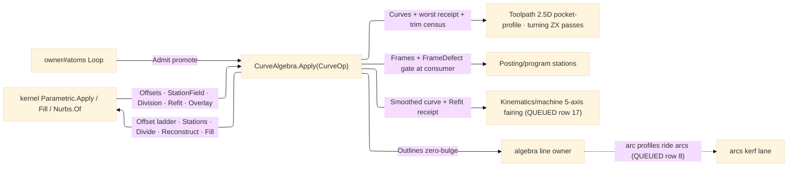

# [RASM_FABRICATION_CURVES]

The parametric-curve CAM substrate — the THIRD Geometry2D owner beside the line-space `PolygonAlgebra` (Clipper2 int64 lattice) and the arc-space `ArcAlgebra` (CavalierContours bulge lattice, the QUEUED `arcs` row): a free-form profile neither lattice expresses exactly — the splined DXF outline, the refit mesh-section chain, the cam lobe, the fairing-critical 5-axis path — rides HERE as a `NurbsForm.Curve` over the landed kernel parametric rail. `CurveAlgebra` is a BOUNDARY-MAP owner, never a re-implementation: every geometric computation routes the kernel — exact side offsets with self-intersection trim through `ParametricOp.Offset` → `ParametricResult.Offsets(Curves, Receipt, TrimmedCrossings, KeptSegments)`, station frames through `ParametricOp.Stations` → `StationField` (the RMF `PerpendicularFrames` sweep with the `FrameDefect` orthonormality witness), engagement sampling through `ParametricOp.Divide`, curve rebuild through `ParametricOp.Reconstruct` → `Refit`, region resolve through `Parametric.Fill` → `ArrangementResult.Overlay`, and point-set admission through `Nurbs.Of(NurbsWire.CurveThrough(samples, FitPolicy))`. The page owns the CAM composition the kernel rail does not: the multi-pass side-offset LADDER (pass i at signed distance `side·(offset + i·stepOver)` — the free-form roughing/finish family the 2.5D pocket-profile arms consume), the `Loop`↔curve bridge in both directions (`Admit` promotes, `Lower` demotes to a zero-bulge `Loop` the line owner clips), and the witness-carrying result vocabulary consumers GATE on.

Kerf compensation is NOT this page's law: the `[V10]a` split holds — pure kerf comp lives in arc space on the `arcs` owner, and `SidePasses` is the free-form parametric pass ladder (tool-side geometry only; climb-vs-conventional resolves at the motion arm from spindle sense × side). The split of the three owners is capability-driven, never namespace-driven: Clipper2 cannot represent a constant-radius arc, CavalierContours cannot represent a free-form spline, the kernel NURBS rail prices exactness in refinement rounds the integer lattice never pays — so line rides `algebra`, arc rides `arcs`, parametric rides `curves`, and the bridges (`Densify`, `Lower`, `Admit`, `g3.BiArcFit2` line-sourced refit) cross only at the declared edges. Results carry kernel witnesses (`RefineReceipt` target-vs-achieved, `StationField.FrameDefect`) and the CONSUMER gates: `Posting/program` refuses a frame batch whose defect exceeds its posting tolerance, `Kinematics/machine` gates the smoothing receipt before a 5-axis fairing pass — a silent skew or deviation swallow downstream is the named defect, never re-checked by a second probe here.

Wire posture: HOST-LOCAL. `CurveAlgebra` results cross only the in-process seam to the toolpath, posting, and kinematics kernels — `NurbsForm.Curve`/`StationField` are kernel vocabulary and travel as such; no result crosses a browser or peer wire, and no local carrier sits between wire and rail.

## [01]-[INDEX]

- [01]-[CURVE_ALGEBRA]: owns the `PassSide`/`CurveSource` vocabularies, the seven-case `CurveOp` request `[Union]`, the four-case `CurveTrace` result `[Union]`, and the ONE `CurveAlgebra.Apply` fold — the parametric lane of the Geometry2D substrate: side-pass ladders, station frames, engagement chords, region resolve, smoothing refit, and the `Loop`↔curve bridge, every computation delegated to the kernel `Parametric`/`Nurbs` rail.

## [02]-[CURVE_ALGEBRA]

- Owner: `PassSide` `[SmartEnum<string>]` (`left`/`right`) the tool-side axis carrying its `Sign` column (+1 left of travel, −1 right — the one place side becomes offset sign); `CurveSource` `[Union]` the admission address (`Samples` raw probe/section points + `FitPolicy` · `Outline` a `Loop` promoted at `ArcChord` — bulged spans sampled at chord tolerance before the fit, the honest approximation note carried); `CurveOp` `[Union]` the seven-case request (`Admit` · `SidePasses` · `Stations` · `Chords` · `Region` · `Smooth` · `Lower`); `CurveTrace` `[Union]` the four-case result (`Curves` · `Frames` · `Outlines` · `Samples`) — four carriers over seven requests, one polymorphic collapse; `CurveAlgebra` the static surface whose ONE `Apply` discriminates on the op case through the generated total `Switch`.
- Cases: `CurveOp` — `Admit(CurveSource)` the promotion arm · `SidePasses(Profile, Frame, Side, Offset, Passes, StepOver, Refine)` the multi-pass ladder (a concave profile's inward pass legitimately splits, so pass curves accumulate across `Offsets` results) · `Stations(Path, StationPlan)` the posting-frame projection (`[T0,T1]` SpineRef window law is the kernel's) · `Chords(Path, MaxChord)` constant-chord engagement sampling · `Region(Loops, Plane)` the closed-loop pocket-profile resolve · `Smooth(Path, Fit, Samples)` the arc-uniform rebuild for 5-axis fairing · `Lower(Path, Chord)` the zero-bulge demotion (7); `CurveTrace` — `Curves(Arr<NurbsForm.Curve>, Option<RefineReceipt>, TrimmedCrossings, KeptSegments)` fed by Admit/SidePasses/Smooth · `Frames(ParametricResult.StationField)` fed by Stations · `Outlines(Seq<Loop>)` fed by Region/Lower · `Samples(Arr<double> Parameters, Arr<Point3d> Points)` fed by Chords (4).
- Entry: `public static Fin<CurveTrace> Apply(CurveOp op, Op? key = null)` — the ONE entry, mirror of the kernel rail idiom; `Fin<T>` routes the kernel `GeometryFault.DegenerateInput` on an empty or non-finite input set and passes kernel `ParametricFault` 2448 refusals through untouched — Geometry2D mints no new arm, its cluster stays 2703 (`KerfCollision` is the arc owner's).
- Auto: `Admit` folds the source — `Samples` straight through `Nurbs.Of(NurbsWire.CurveThrough(samples, fit))`; `Outline` samples straight spans at vertices and bulged spans at `ArcChord` chord resolution (bulge `tan(θ/4)` recovers the arc), then the same `CurveThrough` fit — emitting `Curves` with `None` receipt (admission carries no deviation loop); `SidePasses` folds pass i ∈ [0, Passes) through `Parametric.Apply(new ParametricOp.Offset(profile, frame, side.Sign · (offset + i·stepOver), refine), key)`, concatenating each `Offsets.Curves`, keeping the WORST receipt (max `Achieved`), and summing the `TrimmedCrossings`/`KeptSegments` census — the honest ladder evidence; `Stations` runs `Parametric.Apply(new ParametricOp.Stations(path, plan), key)` and carries the `StationField` WHOLE (SoA columns + `FrameDefect` — the consumer's gate, never re-checked here); `Chords` runs `ParametricOp.Divide` with `DivideRule.ByChord(maxChord)` and carries the kernel `Division` columns; `Region` proves every loop closed, runs `Parametric.Fill(loops, plane)`, and folds the `ArrangementResult.Overlay.Loops` chains to `Loop`s re-wound through `Predicate.Orient2D`; `Smooth` runs `ParametricOp.Reconstruct(path, fit, samples)` and carries the `Refit` curve + receipt; `Lower` runs `ByChord` division and emits the zero-bulge `Loop` (closed iff the path is) the line owner clips. Consumers: `Toolpath/turning` reads `SidePasses`/`Stations` for ZX profile passes, the 2.5D pocket-profile arms read `Region`/`SidePasses`/`Lower`, `Posting/program` reads `Frames` for station posting, and `Kinematics/machine` (QUEUED row 17) reads `Smooth`'s `Curves` TYPE contract for 5-axis fairing — the seam lands against the contract now, the consumer arm with its page.
- Receipt: `CurveTrace` carries the kernel witnesses forward untouched — `RefineReceipt` (target vs achieved deviation, rounds, samples) on every refined curve set, the trim census on the ladder, `StationField.FrameDefect` on every frame batch; the receipt IS the gate input at the consumer and no second deviation probe exists here.
- Packages: `Rasm.Parametric` (`Parametric.Apply` + `ParametricOp.{Offset, Stations, Divide, Reconstruct}` + `ParametricResult.{Offsets, StationField, Division, Refit}` + `Parametric.Fill` + `StationPlan`/`RefinePolicy`/`RefineReceipt`/`DivideRule` — the op rail; `Nurbs.Of` + `NurbsWire.CurveThrough` + `FitPolicy` — the fit seed; `NurbsForm.Curve` the carrier, its `PerpendicularFrames` RMF reached through the `Stations` case, never called per-station here), `Rasm.Meshing` (`ArrangementResult.Overlay` — the `Fill` result read at the one seam), `Rasm.Numerics` (`Predicate.Orient2D` the winding verdict, `Axis` the fill plane, `GeometryFault` band-2400), `Process/owner#FABRICATION_OWNER` (`Loop` — the canonical outline atom, bridged both directions), `Rhino.Geometry` (`Point3d`/`Plane`), Thinktecture.Runtime.Extensions, LanguageExt.Core, BCL inbox.
- Growth: a new CAM projection over the kernel rail (a blend pass, a plane projection) is one `CurveOp` case delegating to its kernel op; a new admission address is one `CurveSource` case; a new lowering target is one arm on `Lower`'s carrier; a new witness is a kernel-receipt field carried forward, never a local probe; zero new entry surfaces.
- Boundary: this page is BOUNDARY-MAP altitude over the kernel OP rail — a re-derived offset loop, trim lattice, RMF sweep, arc-length table, or fit kernel here is the altitude violation, and every computation routes `Parametric.Apply`/`Parametric.Fill`/`Nurbs.Of`; the three-owner split is law — a constant-radius arc profile rides the `arcs` owner, a pure polygon rides `algebra`, and offsetting either HERE (paying refinement rounds for what a lattice owns exactly) is the misrouted form; kerf compensation stays the arc owner's `[V10]a` lane and naming `SidePasses` a kerf pass is the named confusion; `StationField` and `NurbsForm.Curve` cross only to the declared turning/pocket-profile/posting/machine seams and a re-minted parallel `(point, frame)` SoA or curve record is the deleted form; consumers gate on the carried witnesses and a downstream arm that consumes a frame batch without reading `FrameDefect`, or a smoothed curve without reading `Achieved`, ships the named silent-skew defect; the bridge is `Admit`/`Lower` at THIS edge and `Densify`/`BiArcFit2` at the arc/line edges — a fourth bridge site is the deleted form.

```csharp signature
// --- [RUNTIME_PRELUDE] ----------------------------------------------------------------------------------------------------------------------------
using LanguageExt;
using LanguageExt.Common;
using Rasm.Domain;                  // Op — the value-key carriage every kernel entry threads
using Rasm.Fabrication.Process;     // Loop — the canonical outline atom
using Rasm.Meshing;                 // ArrangementResult.Overlay — the Fill result seam
using Rasm.Numerics;                // Predicate · Axis · GeometryFault
using Rasm.Parametric;              // Parametric · ParametricOp/Result · Nurbs · NurbsWire · FitPolicy · StationPlan · RefinePolicy · DivideRule
using Rhino.Geometry;
using Thinktecture;
using static LanguageExt.Prelude;

namespace Rasm.Fabrication.Geometry2D;

// --- [TYPES] --------------------------------------------------------------------------------------------------------------------------------------
// Tool-side of travel only; climb-vs-conventional resolves at the motion arm from spindle sense × side.
[SmartEnum<string>]
public sealed partial class PassSide {
    public static readonly PassSide Left = new("left", sign: +1.0);
    public static readonly PassSide Right = new("right", sign: -1.0);

    public double Sign { get; }
}

// The admission address: Outline promotes a Loop (bulged spans sampled at ArcChord before the fit —
// an arc-exact workflow stays on the arcs owner; this lane is for free-form profiles).
[Union(ConversionFromValue = ConversionOperatorsGeneration.None)]
public abstract partial record CurveSource {
    private CurveSource() { }

    public sealed record Samples(Arr<Point3d> Points, FitPolicy Fit) : CurveSource;
    public sealed record Outline(Loop Profile, Plane Frame, FitPolicy Fit, double ArcChord) : CurveSource;
}

// --- [MODELS] -------------------------------------------------------------------------------------------------------------------------------------
[Union(ConversionFromValue = ConversionOperatorsGeneration.None)]
public abstract partial record CurveOp {
    private CurveOp() { }

    public sealed record Admit(CurveSource Source) : CurveOp;
    public sealed record SidePasses(
        NurbsForm.Curve Profile, Plane Frame, PassSide Side, double Offset, int Passes, double StepOver, RefinePolicy Refine) : CurveOp;
    public sealed record Stations(NurbsForm.Curve Path, StationPlan Plan) : CurveOp;
    public sealed record Chords(NurbsForm.Curve Path, double MaxChord) : CurveOp;
    public sealed record Region(Arr<NurbsForm.Curve> Loops, Axis Plane) : CurveOp;
    public sealed record Smooth(NurbsForm.Curve Path, FitPolicy Fit, int Samples) : CurveOp;
    public sealed record Lower(NurbsForm.Curve Path, double Chord) : CurveOp;
}

// Four carriers over seven requests; kernel witnesses travel WHOLE — the consumer gates on
// FrameDefect / Achieved, never a second probe here.
[Union(ConversionFromValue = ConversionOperatorsGeneration.None)]
public abstract partial record CurveTrace {
    private CurveTrace() { }

    public sealed record Curves(Arr<NurbsForm.Curve> Set, Option<RefineReceipt> Receipt, int TrimmedCrossings, int KeptSegments) : CurveTrace;
    public sealed record Frames(ParametricResult.StationField Field) : CurveTrace;
    public sealed record Outlines(Seq<Loop> Loops) : CurveTrace;
    public sealed record Samples(Arr<double> Parameters, Arr<Point3d> Points) : CurveTrace;
}

// --- [OPERATIONS] ---------------------------------------------------------------------------------------------------------------------------------
public static class CurveAlgebra {
    public static Fin<CurveTrace> Apply(CurveOp op, Op? key = null) =>
        op.Switch(
            state: key,
            admit:      static (k, a) => AdmitOf(a.Source, k),
            sidePasses: static (k, s) => Ladder(s, k),
            stations:   static (k, s) => Parametric.Apply(new ParametricOp.Stations(s.Path, s.Plan), k)
                .Map(static r => (CurveTrace)new CurveTrace.Frames((ParametricResult.StationField)r)),
            chords:     static (k, c) => Parametric.Apply(new ParametricOp.Divide(c.Path, new DivideRule.ByChord(c.MaxChord)), k)
                .Map(static r => { var d = (ParametricResult.Division)r; return (CurveTrace)new CurveTrace.Samples(d.Parameters, d.Points); }),
            region:     static (k, r) => RegionOf(r, k),
            smooth:     static (k, s) => Parametric.Apply(new ParametricOp.Reconstruct(s.Path, s.Fit, s.Samples), k)
                .Map(static r => { var f = (ParametricResult.Refit)r; return (CurveTrace)new CurveTrace.Curves([f.Curve], Some(f.Receipt), 0, 0); }),
            lower:      static (k, l) => Parametric.Apply(new ParametricOp.Divide(l.Path, new DivideRule.ByChord(l.Chord)), k)
                .Map(r => { var d = (ParametricResult.Division)r; return (CurveTrace)new CurveTrace.Outlines([new Loop(d.Points, l.Path.IsClosed)]); }));

    // Pass i at side.Sign·(offset + i·stepOver): curves accumulate (a concave inward pass splits),
    // the WORST receipt survives, the trim census sums — the honest ladder evidence.
    static Fin<CurveTrace> Ladder(CurveOp.SidePasses s, Op? key) =>
        Range(0, s.Passes)
            .TraverseM(i => Parametric.Apply(new ParametricOp.Offset(s.Profile, s.Frame, s.Side.Sign * (s.Offset + i * s.StepOver), s.Refine), key)
                .Map(static r => (ParametricResult.Offsets)r))
            .Map(static results => (CurveTrace)new CurveTrace.Curves(
                new Arr<NurbsForm.Curve>([.. results.SelectMany(static o => o.Curves)]),
                Some(results.OrderByDescending(static o => o.Receipt.Achieved).First().Receipt),
                results.Sum(static o => o.TrimmedCrossings),
                results.Sum(static o => o.KeptSegments)));

    static Fin<CurveTrace> AdmitOf(CurveSource source, Op? key) =>
        source.Switch(
            samples: s => Nurbs.Of(NurbsWire.CurveThrough(s.Points, s.Fit), key)
                .Map(static form => (CurveTrace)new CurveTrace.Curves([(NurbsForm.Curve)form], None, 0, 0)),
            outline: o => Nurbs.Of(NurbsWire.CurveThrough(SampleOutline(o.Profile, o.ArcChord), o.Fit), key)
                .Map(static form => (CurveTrace)new CurveTrace.Curves([(NurbsForm.Curve)form], None, 0, 0)));

    static Fin<CurveTrace> RegionOf(CurveOp.Region r, Op? key) =>
        Parametric.Fill(r.Loops, r.Plane, policy: null, key)
            .Map(static result => {
                var overlay = (ArrangementResult.Overlay)result;
                return (CurveTrace)new CurveTrace.Outlines(overlay.Loops.Map(static chain =>
                    new Loop(new Arr<Point3d>([.. chain.Points]), Closed: true).AsCcw()));
            });

    static Arr<Point3d> SampleOutline(Loop profile, double arcChord) {
        int spans = profile.Closed ? profile.Count : profile.Count - 1;
        IEnumerable<Point3d> walk = Range(0, spans).SelectMany(i => SpanPoints(profile.At(i), profile.At(i + 1), profile.BulgeAt(i), arcChord));
        return new Arr<Point3d>([.. profile.Closed ? walk : walk.Append(profile.At(spans))]);
    }

    // Bulge tan(θ/4) recovers sweep θ and radius r = chord/(2·sin(θ/2)); the center sits on the perpendicular
    // bisector at r·cos(θ/2), bulge sign selecting the side. Each span emits its start; the next span owns the end.
    static IEnumerable<Point3d> SpanPoints(Point3d a, Point3d z, double bulge, double arcChord) {
        if (bulge == 0.0) return [a];
        double theta = 4.0 * Math.Atan(bulge), half = Math.Abs(theta) / 2.0;
        double r = a.DistanceTo(z) / (2.0 * Math.Sin(half));
        Vector3d m = (z - a) * 0.5;
        Vector3d normal = new(-m.Y, m.X, 0.0);
        normal.Unitize();
        Point3d center = a + m + (normal * (r * Math.Cos(half) * Math.Sign(bulge)));
        double a0 = Math.Atan2(a.Y - center.Y, a.X - center.X);
        int n = int.Max(2, (int)Math.Ceiling(Math.Abs(theta) * r / arcChord));
        return Range(0, n).Select(j => new Point3d(center.X + (r * Math.Cos(a0 + (theta * j / n))), center.Y + (r * Math.Sin(a0 + (theta * j / n))), a.Z));
    }
}
```


