# [RASM_FABRICATION_CURVES]

`CurveAlgebra` owns free-form planar CAM profiles over the kernel `Rasm.Parametric` rail. It admits sample and bulged-outline sources, generates witnessed side-pass ladders, exposes station fields and division samples, resolves regions, rebuilds curves, reports planar crossings, and lowers curves to canonical `Loop` values. The line, arc, and free-form owners remain distinct because their exact carriers and algorithms differ; their bridge operations preserve tolerance and approximation evidence.

All curve results remain host-local. `NurbsForm.Curve`, `ParametricResult.StationField`, `RefineReceipt`, and `BooleanReceipt` cross only in-process package seams, and no serialization carrier is introduced here.

## [01]-[INDEX]

- [01]-[CURVE_ALGEBRA]: `PassSide`, `CurveSource`, `SidePassPolicy`, `RebuildPolicy`, `CurveOp`, `PassCurve`, `CurveTrace`, and the single `CurveAlgebra.Apply` fold.

## [02]-[CURVE_ALGEBRA]

- Owner: `PassSide` carries the signed tool side. `CurveSource` discriminates raw sample fitting from arc-aware outline promotion. `SidePassPolicy` admits the exact increasing distance field and kernel refinement policy. `RebuildPolicy` admits fit shape and sample budget. `CurveOp` is the eight-case request algebra, and `CurveTrace` gives each distinct evidence timing its own result case.
- Cases: `CurveOp` has `Admit`, `SidePasses`, `Stations`, `Chords`, `Region`, `Smooth`, `Crossings`, and `Lower`. `CurveTrace` has `Fitted`, `Densified`, `Passes`, `Frames`, `Regions`, `Lowered`, `Samples`, `Refit`, and `Hits`. `PassCurve` retains pass ordinal and signed-distance magnitude for every curve emitted when one concave offset splits.
- Entry: `Apply(CurveOp, Op?)` is the only public operation. Each arm delegates to `Nurbs.Of`, `Parametric.Apply`, `Parametric.Fill`, or `ArcAlgebra.Densify`; unexpected kernel union cases route through `Fin<T>` instead of throwing casts.
- Auto: sample admission fits through `NurbsWire.CurveThrough`. Outline admission composes `DensifyReceipt.Result` and preserves the receipt beside the fitted curve. Side passes traverse every admitted pass distance, preserve every `RefineReceipt`, and aggregate the trim census without discarding pass provenance. Stations preserve the complete `StationField`; chords accept the full `DivideRule` family; smoothing preserves the kernel `Refit` receipt; crossings preserve every `(TA, TB, At)` tuple.
- Region: `Region` rejects an empty or open input, passes an explicit `ArrangementPolicy` to `Parametric.Fill`, requires `ArrangementResult.Overlay`, preserves outer and hole orientation, removes only tolerance-equal closure duplication, admits every chain through `Loop.Admit`, and emits `CurveTrace.Regions` with its `BooleanReceipt`. `Lower` accepts the same `DivideRule` vocabulary and emits a distinct `CurveTrace.Lowered` case without an optional receipt.
- Receipt: `DensifyReceipt` records outline approximation; `RefineReceipt` records each offset or rebuild; `StationField.FrameDefect` records frame orthogonality; `BooleanReceipt` records region classification; `PassCurve` records split-output provenance. An operation with no producer receipt emits no invented substitute.
- Packages: `Rasm.Parametric` supplies `Nurbs.Of`, `NurbsWire.CurveThrough`, `Parametric.Apply`, `Parametric.Fill`, `ParametricOp.Offset`, `Stations`, `Divide`, `Reconstruct`, and `Intersect2D`, plus their typed `ParametricResult` cases. `Rasm.Meshing` supplies `ArrangementPolicy`, `ArrangementResult.Overlay`, and `BooleanReceipt`. `ArcAlgebra.Densify` supplies the bulge-to-line bridge. `Loop`, `Context`, `Axis`, `Op`, `Fin<T>`, and `Rhino.Geometry` carriers remain at their owning seams.
- Growth: a new free-form operation is one `CurveOp` case and one `CurveTrace` evidence case over an existing kernel operation; a new division modality is one `DivideRule` case; a new fitting modality is one `FitPolicy` value. No operation creates a sibling entry or a parallel curve carrier.
- Boundary: curve evaluation, offset refinement, intersection, station framing, fitting, and region arrangement remain kernel-owned. `CurveAlgebra` owns only CAM composition, typed result narrowing, tolerance-preserving bridges, and evidence projection.

```csharp signature
// --- [RUNTIME_PRELUDE] ----------------------------------------------------------------------------------------------------------------------------
using System.Linq;
using LanguageExt;
using LanguageExt.Common;
using Rasm.Domain;
using Rasm.Fabrication.Process;
using Rasm.Meshing;
using Rasm.Numerics;
using Rasm.Parametric;
using Rhino.Geometry;
using Thinktecture;
using static LanguageExt.Prelude;

namespace Rasm.Fabrication.Geometry2D;

// --- [TYPES] --------------------------------------------------------------------------------------------------------------------------------------
[SmartEnum<string>]
public sealed partial class PassSide {
    public static readonly PassSide Left = new("left", sign: +1.0);
    public static readonly PassSide Right = new("right", sign: -1.0);

    public double Sign { get; }
}

[Union(ConversionFromValue = ConversionOperatorsGeneration.None)]
public abstract partial record CurveSource {
    private CurveSource() { }

    public sealed record Samples(Arr<Point3d> Points, FitPolicy Fit) : CurveSource;
    public sealed record Outline(Loop Profile, FitPolicy Fit, double ChordError) : CurveSource;
}

// --- [MODELS] -------------------------------------------------------------------------------------------------------------------------------------
public sealed record SidePassPolicy {
    private SidePassPolicy(Arr<double> distances, RefinePolicy refine) =>
        (Distances, Refine) = (distances, refine);

    public Arr<double> Distances { get; }
    public RefinePolicy Refine { get; }

    public static Fin<SidePassPolicy> Admit(Arr<double> distances, RefinePolicy refine) =>
        !distances.IsEmpty
        && distances.ForAll(static distance => double.IsFinite(distance) && distance >= 0.0)
        && Range(1, distances.Count - 1).ForAll(index => distances[index] > distances[index - 1])
        && refine.IsValid
            ? Fin.Succ(new SidePassPolicy(distances, refine))
            : Fin.Fail<SidePassPolicy>(GeometryFault.DegenerateInput("side-pass-policy").ToError());
}

public sealed record RebuildPolicy {
    private RebuildPolicy(FitPolicy fit, int samples) => (Fit, Samples) = (fit, samples);

    public FitPolicy Fit { get; }
    public int Samples { get; }

    public static Fin<RebuildPolicy> Admit(FitPolicy fit, int samples) =>
        samples >= fit.Degree + 1
            ? Fin.Succ(new RebuildPolicy(fit, samples))
            : Fin.Fail<RebuildPolicy>(GeometryFault.DegenerateInput("rebuild-policy").ToError());
}

[Union(ConversionFromValue = ConversionOperatorsGeneration.None)]
public abstract partial record CurveOp {
    private CurveOp() { }

    public sealed record Admit(CurveSource Source) : CurveOp;
    public sealed record SidePasses(NurbsForm.Curve Profile, Plane Frame, PassSide Side, SidePassPolicy Policy) : CurveOp;
    public sealed record Stations(NurbsForm.Curve Path, StationPlan Plan) : CurveOp;
    public sealed record Chords(NurbsForm.Curve Path, DivideRule Rule) : CurveOp;
    public sealed record Region(
        Arr<NurbsForm.Curve> Loops,
        Axis Plane,
        Context Tolerance,
        ArrangementPolicy Policy) : CurveOp;
    public sealed record Smooth(NurbsForm.Curve Path, RebuildPolicy Policy) : CurveOp;
    public sealed record Crossings(NurbsForm.Curve Path, IntersectTarget Target) : CurveOp;
    public sealed record Lower(NurbsForm.Curve Path, DivideRule Rule, Context Tolerance) : CurveOp;
}

public sealed record PassCurve(int Pass, double Distance, NurbsForm.Curve Curve);

[Union(ConversionFromValue = ConversionOperatorsGeneration.None)]
public abstract partial record CurveTrace {
    private CurveTrace() { }

    public sealed record Fitted(NurbsForm.Curve Curve) : CurveTrace;
    public sealed record Densified(NurbsForm.Curve Curve, DensifyReceipt Receipt) : CurveTrace;
    public sealed record Passes(
        Arr<PassCurve> Curves,
        Arr<RefineReceipt> Receipts,
        int TrimmedCrossings,
        int KeptSegments) : CurveTrace;
    public sealed record Frames(ParametricResult.StationField Field) : CurveTrace;
    public sealed record Regions(Seq<Loop> Loops, BooleanReceipt Receipt) : CurveTrace;
    public sealed record Lowered(Loop Loop) : CurveTrace;
    public sealed record Samples(Arr<double> Parameters, Arr<Point3d> Points) : CurveTrace;
    public sealed record Refit(NurbsForm.Curve Curve, RefineReceipt Receipt) : CurveTrace;
    public sealed record Hits(Arr<(double TA, double TB, Point3d At)> Set) : CurveTrace;
}

// --- [OPERATIONS] ---------------------------------------------------------------------------------------------------------------------------------
public static class CurveAlgebra {
    public static Fin<CurveTrace> Apply(CurveOp op, Op? key = null) =>
        op.Switch(
            state: key,
            admit:      static (k, a) => AdmitOf(a.Source, k),
            sidePasses: static (k, s) => Ladder(s, k),
            stations:   static (k, s) => Parametric.Apply(new ParametricOp.Stations(s.Path, s.Plan), k)
                .Bind(static result => Expect<ParametricResult, ParametricResult.StationField>(result, "curve:stations"))
                .Map(static field => (CurveTrace)new CurveTrace.Frames(field)),
            chords:     static (k, c) => Parametric.Apply(new ParametricOp.Divide(c.Path, c.Rule), k)
                .Bind(static result => Expect<ParametricResult, ParametricResult.Division>(result, "curve:chords"))
                .Map(static division => (CurveTrace)new CurveTrace.Samples(division.Parameters, division.Points)),
            region:     static (k, r) => RegionOf(r, k),
            smooth:     static (k, s) => SmoothOf(s, k),
            crossings:  static (k, c) => Parametric.Apply(new ParametricOp.Intersect2D(c.Path, c.Target), k)
                .Bind(static result => Expect<ParametricResult, ParametricResult.Crossings>(result, "curve:crossings"))
                .Map(static crossings => (CurveTrace)new CurveTrace.Hits(crossings.Hits)),
            lower:      static (k, l) => LowerOf(l, k));

    private static Fin<CurveTrace> Ladder(CurveOp.SidePasses request, Op? key) =>
        Range(0, request.Policy.Distances.Count)
            .Traverse(pass => {
                double distance = request.Policy.Distances[pass];
                return Parametric.Apply(new ParametricOp.Offset(
                        request.Profile,
                        request.Frame,
                        request.Side.Sign * distance,
                        request.Policy.Refine), key)
                    .Bind(result => Expect<ParametricResult, ParametricResult.Offsets>(result, "curve:side-passes"))
                    .Map(offset => (Pass: pass, Distance: distance, Offset: offset));
            })
            .As()
            .Map(static results => (CurveTrace)new CurveTrace.Passes(
                new Arr<PassCurve>([.. results.SelectMany(static result =>
                    result.Offset.Curves.Select(curve => new PassCurve(result.Pass, result.Distance, curve)))]),
                results.Map(static result => result.Offset.Receipt).ToArr(),
                results.Sum(static result => result.Offset.TrimmedCrossings),
                results.Sum(static result => result.Offset.KeptSegments)));

    private static Fin<CurveTrace> AdmitOf(CurveSource source, Op? key) =>
        source.Switch(
            state: key,
            samples: static (k, s) => Nurbs.Of(NurbsWire.CurveThrough(s.Points, s.Fit), k)
                .Bind(static form => Expect<NurbsForm, NurbsForm.Curve>(form, "curve:fit"))
                .Map(static curve => (CurveTrace)new CurveTrace.Fitted(curve)),
            outline: static (k, o) =>
                from receipt in ArcAlgebra.Densify(o.Profile, o.ChordError)
                from form in Nurbs.Of(NurbsWire.CurveThrough(receipt.Result.Vertices, o.Fit), k)
                from curve in Expect<NurbsForm, NurbsForm.Curve>(form, "curve:outline-fit")
                select (CurveTrace)new CurveTrace.Densified(curve, receipt));

    private static Fin<CurveTrace> SmoothOf(CurveOp.Smooth request, Op? key) =>
        from result in Parametric.Apply(new ParametricOp.Reconstruct(
            request.Path,
            request.Policy.Fit,
            request.Policy.Samples), key)
        from refit in Expect<ParametricResult, ParametricResult.Refit>(result, "curve:smooth")
        select (CurveTrace)new CurveTrace.Refit(refit.Curve, refit.Receipt);

    private static Fin<CurveTrace> RegionOf(CurveOp.Region request, Op? key) =>
        request.Loops.IsEmpty || request.Loops.Exists(static curve => !curve.IsClosed)
            ? Fin.Fail<CurveTrace>(GeometryFault.DegenerateInput("region:open-loop").ToError())
            : from result in Parametric.Fill(request.Loops, request.Plane, request.Policy, key)
              from overlay in Expect<ArrangementResult, ArrangementResult.Overlay>(result, "curve:region")
              from loops in overlay.Loops.Traverse(chain => LowerChain(chain, request.Tolerance)).As()
              select (CurveTrace)new CurveTrace.Regions(loops, overlay.Receipt);

    private static Fin<CurveTrace> LowerOf(CurveOp.Lower request, Op? key) =>
        from result in Parametric.Apply(new ParametricOp.Divide(request.Path, request.Rule), key)
        from division in Expect<ParametricResult, ParametricResult.Division>(result, "curve:lower")
        let repeatsClosure = request.Path.IsClosed
            && division.Points.Count > 1
            && division.Points[0].DistanceTo(division.Points[division.Points.Count - 1]) <= request.Tolerance.Absolute.Value
        let vertices = repeatsClosure
            ? new Arr<Point3d>([.. division.Points.Take(division.Points.Count - 1)])
            : division.Points
        from loop in Loop.Admit(vertices, request.Path.IsClosed, [], request.Tolerance)
        select (CurveTrace)new CurveTrace.Lowered(loop);

    private static Fin<Loop> LowerChain(Chain chain, Context tolerance) {
        if (!chain.Closed) return Fin.Fail<Loop>(GeometryFault.DegenerateInput("region:open-result").ToError());
        Arr<Point3d> points = new([.. chain.Points]);
        Arr<Point3d> vertices = points.Count > 1
            && points[0].DistanceTo(points[points.Count - 1]) <= tolerance.Absolute.Value
                ? new Arr<Point3d>([.. points.Take(points.Count - 1)])
                : points;
        return Loop.Admit(vertices, closed: true, [], tolerance);
    }

    // The union-bounded narrow: TUnion pins the kernel result family so an unrelated type can never reach the probe.
    private static Fin<T> Expect<TUnion, T>(TUnion value, string locus)
        where TUnion : class
        where T : class, TUnion =>
        value is T expected
            ? Fin.Succ(expected)
            : Fin.Fail<T>(GeometryFault.DegenerateInput(locus).ToError());
}
```

```mermaid
---
config:
  theme: base
  look: classic
  layout: elk
  flowchart:
    curve: linear
    padding: 25
  themeVariables:
    darkMode: true
    fontFamily: "SF Mono, Menlo, Cascadia Mono, Segoe UI Mono, Consolas, monospace"
    useGradient: false
    dropShadow: "none"
    background: "#282A36"
    primaryColor: "#44475A"
    primaryTextColor: "#F8F8F2"
    primaryBorderColor: "#BD93F9"
    lineColor: "#FF79C6"
    textColor: "#F8F8F2"
    edgeLabelBackground: "#21222C"
    labelBackgroundColor: "#21222C"
  themeCSS: ".nodeLabel{font-size:13px;font-weight:500}.edgeLabel{font-size:12px;font-weight:500}.cluster-label .nodeLabel{font-size:13.5px;font-weight:700;letter-spacing:.08em}.edge-thickness-normal{stroke-width:2px}.edge-thickness-thick{stroke-width:3px}.edge-pattern-dashed,.edge-pattern-dotted{stroke-width:1.5px;stroke-dasharray:4 6}.node rect,.node circle,.node polygon,.node path,.node .outer-path{stroke-width:1.5px;filter:none!important}.cluster rect{stroke-width:1px!important;stroke-dasharray:5 4!important;filter:none!important}.marker path{transform:scale(.8);transform-origin:5px 5px}.marker circle{transform:scale(.48);transform-origin:5px 5px}.edgeLabel rect{transform-box:fill-box;transform-origin:center;transform:scale(1.1,1.2)}"
---
flowchart LR
    accTitle: Free-form curve algebra dispatch
    accDescr: One curve operation fold promotes loop inputs, invokes the parametric kernel, preserves typed receipts, and delivers pass curves, frames, rebuilt curves, and lowered outlines to their consumers.
    Loop["owner#atoms Loop"] -->|Admit promote| Alg["CurveAlgebra.Apply(CurveOp)"]
    Alg -->|"Offset ladder · Stations · Divide · Reconstruct · Intersect2D · Fill"| Kernel["kernel Parametric.Apply / Fill / Nurbs.Of"]
    Kernel -->|"Offsets · StationField · Division · Refit · Crossings · Overlay"| Alg
    Alg -->|"Curves + all receipts + trim census"| Pocket["Toolpath 2.5D pocket-profile · turning ZX passes"]
    Alg -->|"Frames + FrameDefect gate at consumer"| Post["Posting/program stations"]
    Alg -->|"Smoothed curve + Refit receipt"| Machine["Kinematics/machine 5-axis fairing"]
    Alg -->|"Outlines zero-bulge"| Line["algebra line owner"]
    Line -.->|"arc profiles ride arcs"| Arcs["arcs kerf lane"]
    linkStyle 2,3,5 stroke:#50FA7B,color:#F8F8F2
    linkStyle 7 stroke:#6272A4,color:#F8F8F2,stroke-width:1.5px,stroke-dasharray:4 6
    classDef primary fill:#44475A,stroke:#FF79C6,color:#F8F8F2
    classDef success fill:#50FA7BBF,stroke:#50FA7B,color:#282A36
    classDef data fill:#FFB86CBF,stroke:#FFB86C,color:#282A36
    classDef boundary fill:#282A36,stroke:#BD93F9,color:#F8F8F2
    class Alg,Kernel primary
    class Pocket,Post,Machine success
    class Loop data
    class Line,Arcs boundary
```


