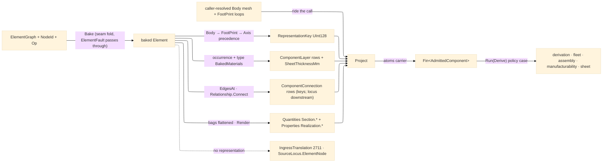

# [RASM_FABRICATION_ELEMENT_INGRESS]

The element-ingress arm: `ElementImport` the one boundary lowering a baked `Rasm.Element` graph object into the `Process/owner#FABRICATION_OWNER` `AdmittedComponent` atoms carrier — the 4th arm of the ONE polymorphic `Ingress.Admit(IngressSource)` fold `Ingress/profile#PROFILE_IMPORT` owns. The seam crossing happens exactly ONCE here: `Admit` runs the seam-owned `Graph/element#BAKE` fold (`ElementGraph.Bake(NodeId, Op) → Fin<Element>` — cycle-guarded, memoized, the one derived flatten), then projects the baked seam vocabulary onto atoms-safe scalars — no `Element`, `Node`, `PropertyBag`, `BakedMaterial`, `MaterialComposition`, or `Relationship` type ever travels past this boundary, and no sibling plane re-learns the graph. The projection is total over what the element carries: the `RepresentationContentHash` keyed map yields the `RepresentationKey` under the Body → FootPrint → Axis precedence (a geometry-less object is the one translation failure — `IngressTranslation` 2711 with the typed `SourceLocus.ElementNode` locus); the occurrence + type-inherited `BakedMaterial` compositions flatten to `ComponentLayer` rows (a `LayerSet` ply per row with its SI thickness lifted to mm, a `ProfileSet`/`Single` a dimensionless substance row) and the ONE formable `LayerSet` stack lifts its `TotalThickness` to `SheetThicknessMm` — the `Forming/sheet` admission lane; the `Connect` edges off the graph incidence (`Relations/relation#Connect` — `From`/`To`/`SubKind`/`Option<NodeId> Realizing`) key the `ComponentConnection` rows; the property/quantity bags flatten to `SetName.Row`-keyed maps, the realizing-detail bags riding among them under the seam `DetailSchema.Realization` neutral set name (`"Realization"` — `JointType`/`FastenerType`/`NominalDiameter` rows the `Rasm.Bim` `Semantics/connection` reader and the `Rasm.Materials` `ComponentProjector` both author byte-identically); the resolved `TypeBinding.Section` lands column-per-column as `Section.*` quantity rows so no consumer re-derives the ProfileSet traversal.

Resolved GEOMETRY rides the call, never a blob read: the element carries content HASHES (`RepresentationContentHash` — blob-resident by design), so the caller resolves Body mesh and FootPrint loops upstream through the Persistence artifact index and passes them alongside the graph; this package opens no blob store. The `ComponentConnection.At` locus stays `default` at admission — the joint LINE is a geometry-time read against the resolved Body that `Fixturing/assembly`'s access analysis owns; the typed `DetailKey`/`RealizingKey` rows are the admission truth. A `Bake` failure (compose cycle, absent root) rides its own Element-band fault through the `Fin` rail unchanged — the band-ownership law forbids re-casing a peer's fault; only the no-representation TRANSLATION failure mints on the Fabrication band. Consumers compose the carrier, never the graph: `Run(Derive{AdmittedComponent, DerivePolicy})` carries it on the policy case into `Process/derivation`; `Kinematics/fleet` joins envelope/capacity against the bags under ITS key contract — `DemandKey` owns the `demand:*` quantity keys and the `material` property fallback, this projection writes the rows (raw-keyed demand rows, head-layer material) so `Fleet.Capable` resolves shim-free; `Fixturing/assembly` sequences its connection rows; `Spec/manufacturability` folds DfM verdicts over its layers and quantities; `Forming/sheet` unfolds its sheet lane.

Wire posture: HOST-LOCAL. The graph arrives in-process at the `IngressSource.Element` case; only atoms-safe scalars and content keys leave; no wire model, no serialized graph, and no Element/Materials/Bim type between wire and rail.

## [01]-[INDEX]

- [01]-[ELEMENT_INGRESS]: `ElementImport` the static element-ingress boundary — `Admit` running the seam `ElementGraph.Bake` and projecting the baked element onto `AdmittedComponent` (representation-key precedence, material-composition layer rows, sheet-thickness lane, `Connect`-edge connection rows, flattened property/quantity bags + `Section.*` columns), the `Render` typed-value-to-invariant-text boundary fold, and the `IngressTranslation` no-representation rail; the 4th `Ingress.Admit` arm.

## [02]-[ELEMENT_INGRESS]

- Owner: `ElementImport` the static surface owning `Admit` (the `ElementGraph`/`NodeId` → `Fin<AdmittedComponent>` boundary fold) plus the private projection folds (`KeyOf` precedence, `MaterialsOf` two-tier composition walk, `LayersOf`, `SheetOf`, `ConnectionsOf`, `QuantitiesOf`+`SectionRows`, `PropertiesOf`, `Render`). One owner, one fold — never a per-bag sibling reader family and never a second graph walker beside the seam's own `Bake`. The `AdmittedComponent`/`ComponentLayer`/`ComponentConnection` TYPES are `owner#atoms` mints (the `CutterForm` discipline) — this page owns only the PROJECTION.
- Cases: the composition switch arms over the seam `MaterialComposition` union — `LayerSet` (one `ComponentLayer` per ply: `Name` → `Function`, `Thickness.Si`·1000 → `ThicknessMm`, `MaterialId.Value` → `MaterialKey`; the set's `TotalThickness` lifts to the `SheetThicknessMm` lane) · `ProfileSet` (one `"profile"` row keyed by the material node's `MaterialKey`; the section columns land via `SectionRows`, never here) · `Single` (one `"substance"` row, dimensionless) (3); the `Render` fold rides the seam union's GENERATED total `Switch` — `Text` verbatim · `Measure`/`Bounded` round-trip invariant SI · `Boolean`/`Logical` lowered tokens · `Enumerated`/`List` ordinal-joined · `Reference` the target node key · `Table` its row-count token · `Complex` its joined pairs (10, compiler-total: a new upstream case breaks the build, never lowers to an empty string); the representation precedence rows `Body`/`FootPrint`/`Axis` (3, ordered — display body wins, analytical falls back).
- Entry: `public static Fin<AdmittedComponent> Admit(ElementGraph graph, NodeId id, Op key, Option<MeshSpace> body, Arr<Loop> footprint = default)` — the ONE entrypoint: `graph.Bake(id, key)` (the seam fold, its `ElementFault` rail passing through unchanged), then the projection; a missing representation routes `FabricationFault.IngressTranslation(SourceKind.Element, SourceLocus.ElementNode(...))`, never a silent empty carrier. Invoked by the `Ingress.Admit` `Element` arm (`Ingress/profile#PROFILE_IMPORT` owns the fold); `Run(Derive)` carries the RESULT on its policy case.
- Auto: `KeyOf` folds the `RepresentationContentHash.ByIdentifier` map through the precedence array — first present identifier wins; `MaterialsOf` concatenates occurrence `Materials` with the `TypeBinding.Materials` type tier so one composition walk serves both; `QuantitiesOf` folds every `QuantityBag` row to `"{SetName}.{Row}"` → SI double over the `SectionRows` floor (the resolved `TypeBinding.Section` columns as `Section.*` rows — the M7 `SectionOf` fallback already baked at projection, so fleet/manufacturability read section data as plain quantity rows), EXCEPT the demand rows: a row already carrying the `demand:` prefix keeps its RAW key so `Kinematics/fleet`'s `DemandKey.Read` (`demand:min-axes`/`demand:distinct-tools`/`demand:spindle-kw`/`demand:it-grade`, each with its axis-owned fallback) resolves against the bag without a shim — fleet owns the keys, this projection writes the rows; `PropertiesOf` folds every `PropertyBag` row through `Render` to `"{SetName}.{Row}"` → invariant text, the `Realization` detail rows (`Realization.JointType`, `Realization.FastenerType`, `Realization.NominalDiameter`) arriving exactly as the Bim connection reader authored them, and the head composition layer's key landing as the `material` property row — `Kinematics/fleet`'s no-layer fallback lane; `ConnectionsOf` chooses the `Relationship.Connect` edges off `graph.EdgesAt(baked.Id)` — `SubKind.Key` → `DetailKey`, the `Realizing` node key → `RealizingKey`, `At` default at admission.
- Receipt: the `AdmittedComponent` IS the typed admission evidence — content-keyed by `RepresentationKey`, self-describing rows, no import report, no graph handle escaping. Fault evidence rides the `Fin` rail: the seam's own `ElementFault` for graph defects, `IngressTranslation` 2711 for the translation failure.
- Packages: `Rasm.Element` (`ElementGraph.Bake`/`EdgesAt` · `Element` (`Representations`/`Materials`/`Properties`/`Quantities`/`Type`) · `RepresentationContentHash.ByIdentifier` · `BakedMaterial` · `MaterialComposition` `Single`/`LayerSet`(`Layers`,`TotalThickness`)/`ProfileSet` · `Relationship.Connect(From, To, SubKind, Realizing)` · `PropertyBag`/`QuantityBag`/`PropertyName`/`PropertyValue` (10-case) · `MeasureValue.Si` · `DetailSchema.Realization` (neutral `SetName`, `JointTypes` `Bolted|Welded|Bonded|Bearing|Cast`) · `NodeId`/`MaterialId` `[ValueObject<string>]` — the whole seam consumed as settled vocabulary), `Rasm` (`Op` value key · `ContentHash.Of` — the one mint, the fault-locus key), `Rasm.Meshing` (`MeshSpace` — the resolved Body), `Rasm.Fabrication.Process` (`AdmittedComponent`/`ComponentLayer`/`ComponentConnection`/`Loop` atoms · `FabricationFault`/`SourceKind`/`SourceLocus`), LanguageExt.Core (`Fin`/`Option`/`Seq`/`Arr`/`Map`), BCL inbox (`CultureInfo` invariant rendering).
- Growth: a new representation identifier is one precedence row; a new composition genus is one switch arm; a new seam `PropertyValue` case is one `Render` arm; a richer connection locus (the `At` line resolved against the Body mesh) is a downstream geometry read on `Fixturing/assembly`, never a second admission pass; batch admission is the caller's map over `Admit` — the fold stays single-component; zero new entrypoint, zero new carrier type.
- Boundary: `ElementImport` is the ONE element-ingress owner — a second `Bake` call site, a `graph.Nodes` traversal, or an `Element`/`PropertyBag`/`BakedMaterial` field in any sibling plane is the named seam violation (the graph lowers to `AdmittedComponent` HERE and never travels the interior); the blob store never opens in this package — a Persistence read, a mesh-by-hash resolution, or a blob client in this fold is the reject (resolved geometry rides the call); the `AdmittedComponent` TYPE mints on `owner#atoms` and a page-local admitted-component sibling is the deleted form; string keys reference Materials/Bim rows at the boundary and a `MaterialId`/`NodeId`/`DetailSchema` TYPE on the carrier is the reject; a peer-band fault never re-cases here (`ElementFault` passes through; only the translation failure mints 2711); the set-name/row spellings compose the seam `DetailSchema` statics and a hand-spelled `"Rasm_ConnectionRealization"` IFC literal is the deleted form (the neutral `SetName` is the in-graph truth); the fabrication projector counterpart (`FabricationProjector : IElementProjection`, the one-registration-row lowering `Rasm.Materials` `Projection/component#[PROJECTOR_MERGE]` holds open) is the OUTBOUND seam `Process/derivation` registers — this page is INBOUND only and never authors graph nodes.

```csharp signature
// --- [RUNTIME_PRELUDE] ------------------------------------------------------------------------------------------------------------------------------
using System.Globalization;
using LanguageExt;
using LanguageExt.Common;
using Rasm.Domain;                    // Op — the value key the Bake fold threads; ContentHash.Of — the one mint (fault-locus key)
using Rasm.Element;                   // ElementGraph · Element · BakedMaterial · MaterialComposition · Relationship · PropertyValue
using Rasm.Fabrication.Process;
using Rasm.Meshing;
using static LanguageExt.Prelude;

namespace Rasm.Fabrication.Ingress;

// --- [OPERATIONS] -----------------------------------------------------------------------------------------------------------------------------------
public static class ElementImport {
    // Admission-key precedence: the display Body wins, the analytical FootPrint/Axis fall back.
    static readonly string[] RepresentationOrder = ["Body", "FootPrint", "Axis"];

    // The 4th Ingress.Admit arm: Bake the Object node (Graph/element#BAKE), lower the baked seam vocabulary onto the
    // owner#atoms AdmittedComponent ONCE. Resolved geometry rides the call — the blob store resolves upstream.
    public static Fin<AdmittedComponent> Admit(ElementGraph graph, NodeId id, Op key, Option<MeshSpace> body, Arr<Loop> footprint = default) =>
        graph.Bake(id, key).Bind(baked => Project(graph, baked, body, footprint));

    static Fin<AdmittedComponent> Project(ElementGraph graph, Element baked, Option<MeshSpace> body, Arr<Loop> footprint) =>
        KeyOf(baked).Match(
            None: () => Fin.Fail<AdmittedComponent>(FabricationFault.IngressTranslation(
                SourceKind.Element,
                new SourceLocus.ElementNode(ContentHash.Of(System.Text.Encoding.UTF8.GetBytes(baked.Id.Value)))).ToError()),
            Some: representation => Fin.Succ(Carrier(graph, baked, body, footprint, representation)));

    static AdmittedComponent Carrier(ElementGraph graph, Element baked, Option<MeshSpace> body, Arr<Loop> footprint, UInt128 representation) {
        Arr<ComponentLayer> layers = LayersOf(baked);
        return new AdmittedComponent(
            RepresentationKey: representation,
            Mesh: body,
            Profiles: footprint,
            SheetThicknessMm: SheetOf(baked),
            Layers: layers,
            Connections: ConnectionsOf(graph, baked),
            Quantities: QuantitiesOf(baked),
            Properties: PropertiesOf(baked, layers));
    }

    static Option<UInt128> KeyOf(Element baked) =>
        toSeq(RepresentationOrder).Choose(identifier => baked.Representations.ByIdentifier.Find(identifier)).Head;

    // Occurrence materials first, type-inherited second — ONE composition walk serves both tiers.
    static Seq<BakedMaterial> MaterialsOf(Element baked) =>
        baked.Materials + baked.Type.Map(static t => t.Materials).IfNone(Empty);

    static Arr<ComponentLayer> LayersOf(Element baked) =>
        MaterialsOf(baked).Bind(static m => m.Material.Composition switch {
            MaterialComposition.LayerSet set => set.Layers.Map(static l => new ComponentLayer(l.Name, l.Thickness.Si * 1000.0, l.Material.Value)),
            MaterialComposition.ProfileSet   => Seq(new ComponentLayer("profile", 0.0, m.Material.MaterialKey.Value)),
            _                                => Seq(new ComponentLayer("substance", 0.0, m.Material.MaterialKey.Value)),
        }).ToArr();

    // ONE formable stack: the LayerSet's SI total lifts to mm; profile/single compositions admit no sheet lane.
    static Option<double> SheetOf(Element baked) =>
        MaterialsOf(baked).Choose(static m => m.Material.Composition is MaterialComposition.LayerSet set
            ? Some(set.TotalThickness * 1000.0)
            : None).Head;

    // Topology keys off the Connect edges: SubKind row → DetailKey, realizing node key → RealizingKey. The Edge3
    // locus stays default at admission — the joint LINE resolves against the Body downstream (assembly access).
    static Arr<ComponentConnection> ConnectionsOf(ElementGraph graph, Element baked) =>
        toSeq(graph.EdgesAt(baked.Id))
            .Choose(static e => e is Relationship.Connect c ? Some(c) : None)
            .Map(static c => new ComponentConnection(c.SubKind.Key, c.Realizing.Map(static r => r.Value).IfNone(string.Empty), At: default))
            .ToArr();

    // Demand rows land RAW so Kinematics/fleet DemandKey.Read resolves without a shim: a row already carrying the
    // demand prefix keeps its key verbatim; every other row namespaces under its set name.
    const string DemandPrefix = "demand:";

    static Map<string, double> QuantitiesOf(Element baked) =>
        baked.Quantities.Fold(SectionRows(baked), static (acc, bag) =>
            bag.Values.Fold(acc, (m, row, value) => m.AddOrUpdate(
                row.Value.StartsWith(DemandPrefix, StringComparison.Ordinal) ? row.Value : $"{bag.SetName}.{row.Value}",
                value.Si)));

    // The resolved section (TypeBinding.Section — the M7 SectionOf fallback baked at projection) lands column-per-
    // column as `Section.*` rows; Depth/Width show the shape, the remaining seam columns follow the identical lift.
    static Map<string, double> SectionRows(Element baked) =>
        baked.Type.Bind(static t => t.Section).Match(
            None: static () => Map<string, double>(),
            Some: static s => Map(("Section.DepthMm", s.Depth.Si * 1000.0), ("Section.WidthMm", s.Width.Si * 1000.0)));

    // The `material` identity row is Fleet's no-layer fallback lane (fleet.md reads the head composition layer
    // FIRST, then this property) — the head layer's key lands whenever a composition resolves, so bag-only
    // consumers stay whole; an element-authored `material` bag row is never overwritten.
    static Map<string, string> PropertiesOf(Element baked, Arr<ComponentLayer> layers) =>
        layers.Fold(
            baked.Properties.Fold(Map<string, string>(), static (acc, bag) =>
                bag.Values.Fold(acc, (m, row, value) => m.AddOrUpdate($"{bag.SetName}.{row.Value}", Render(value)))),
            static (acc, layer) => acc.ContainsKey("material") ? acc : acc.Add("material", layer.MaterialKey));

    // --- [BOUNDARIES] ---------------------------------------------------------------------------------------------------------------------------------
    // The typed PropertyValue family lowers to canonical invariant text ONCE through the seam union's GENERATED total
    // Switch: tokens verbatim, sets ordinal-joined, measures round-trip SI; a Reference row carries its target node
    // key. A new upstream case adds a required Switch parameter, so admission breaks at compile time instead of
    // silently erasing the value — no `_` arm, no empty-string sentinel, no typed value escaping as an object.
    static string Render(PropertyValue value) =>
        value.Switch(
            text: static t => t.Value,
            measure: static m => m.Value.Si.ToString("R", CultureInfo.InvariantCulture),
            boolean: static b => b.Value ? "true" : "false",
            logical: static l => l.Value.Match(Some: v => v ? "true" : "false", None: () => "unknown"),
            enumerated: static e => string.Join("|", e.Selected),
            reference: static r => r.Target.Value,
            bounded: static b => string.Join("..", Seq(b.Lower, b.Upper).Somes().Map(v => v.Si.ToString("R", CultureInfo.InvariantCulture))),
            list: l => string.Join("|", l.Values.Map(Render)),
            table: static t => $"table:{t.Rows.Count}",
            complex: c => string.Join("|", c.Properties.Pairs.Map(p => $"{p.Key.Value}={Render(p.Value)}")));
}
```


