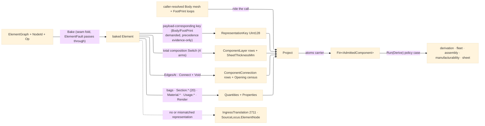

# [RASM_FABRICATION_ELEMENT_INGRESS]

The element-ingress arm: `ElementImport` the one boundary lowering a baked `Rasm.Element` graph object into the `Process/owner#FABRICATION_OWNER` `AdmittedComponent` atoms carrier — the 4th arm of the ONE polymorphic `Ingress.Admit(IngressSource)` fold `Ingress/profile#PROFILE_IMPORT` owns. The seam crossing happens exactly ONCE here: `Admit` runs the seam-owned `Graph/element#BAKE` fold (`ElementGraph.Bake(NodeId, Op) → Fin<Element>` — cycle-guarded, memoized, the one derived flatten), then projects the baked seam vocabulary onto atoms-safe scalars — no `Element`, `Node`, `PropertyBag`, `BakedMaterial`, `MaterialComposition`, or `Relationship` type ever travels past this boundary, and no sibling plane re-learns the graph. The projection is total over what the element carries: the `RepresentationContentHash` keyed map yields the `RepresentationKey` in CORRESPONDENCE with the geometry riding the call — a supplied Body mesh demands the `Body` identifier, a supplied footprint the `FootPrint` identifier, and only a geometry-less admission falls to the Body → FootPrint → Axis precedence, so the carrier's evidence key never names geometry it does not hold (the mismatch and the geometry-less no-identifier element are the one translation failure — `IngressTranslation` 2711 with the typed `SourceLocus.ElementNode` locus); the occurrence + type-inherited `BakedMaterial` compositions flatten through the seam union's GENERATED total `Switch` to `ComponentLayer` rows (a `LayerSet` ply per row via `LayerName`, a `ConstituentSet` constituent per row via `Category`, a `ProfileSet`/`Single` a dimensionless row — four arms, compiler-total, no wildcard downgrade) and the ONE formable `LayerSet` stack lifts its `TotalThickness` to `SheetThicknessMm` — the `Forming/sheet` admission lane; the `Connect` edges off the graph incidence key the `ComponentConnection` rows; the `Void` edges land as the typed opening census (count + per-opening feature keys and `VoidKind` rows) — the drill/pocket/cope feature tier a fabrication derivation plans; the `MaterialUsage` occurrence payload lands its layer direction/sense/offset and profile cardinal point as `Usage.*` rows — the asymmetric-buildup and placement facts forming and nesting orient against; the material nodes' engineering profile lands as `Material.*` quantity rows (`Mechanical` density/stiffness/strength, `Thermal` conductivity/heat columns) — the open material-physics lane `Process/physics` and `Tooling/cuttingdata` read beside their seeded axes; the property/quantity bags flatten to `SetName.Row`-keyed maps, the realizing-detail bags riding among them under the seam `DetailSchema.Realization` neutral set name, and a bag row literally named `material` ALSO lands under its raw key so an element-authored material identity always defeats the derived head-layer fallback; the resolved `TypeBinding.Section` lands column-per-column — ALL twenty `SectionProperties` columns as `Section.*` SI rows — so no consumer re-derives the ProfileSet traversal.

Resolved GEOMETRY rides the call, never a blob read: the element carries content HASHES (`RepresentationContentHash` — blob-resident by design), so the caller resolves Body mesh and FootPrint loops upstream through the Persistence artifact index and passes them alongside the graph; this package opens no blob store. The `ComponentConnection.At` locus stays `default` at admission — the joint LINE is a geometry-time read against the resolved Body that `Fixturing/assembly`'s access analysis owns; the typed `DetailKey`/`RealizingKey` rows are the admission truth. A `Bake` failure (compose cycle, absent root) rides its own Element-band fault through the `Fin` rail unchanged — the band-ownership law forbids re-casing a peer's fault; only the translation failure mints on the Fabrication band. Consumers compose the carrier, never the graph: `Run(Derive{AdmittedComponent, DerivePolicy})` carries it on the policy case into `Process/derivation`; `Kinematics/fleet` joins envelope/capacity against the bags under ITS key contract — `DemandKey` owns the `demand:*` quantity keys and the `material` property fallback, this projection writes the rows so `Fleet.Capable` resolves shim-free; `Fixturing/assembly` sequences its connection rows; `Spec/manufacturability` folds DfM verdicts over its layers, openings, and quantities; `Forming/sheet` unfolds its sheet lane.

Wire posture: HOST-LOCAL. The graph arrives in-process at the `IngressSource.Element` case; only atoms-safe scalars and content keys leave; no wire model, no serialized graph, and no Element/Materials/Bim type between wire and rail.

## [01]-[INDEX]

- [01]-[ELEMENT_INGRESS]: `ElementImport` the static element-ingress boundary — `Admit` running the seam `ElementGraph.Bake` and projecting the baked element onto `AdmittedComponent` (payload-corresponding representation key, total composition layer rows, sheet-thickness lane, `Connect`-edge connection rows, `Void`-edge opening census, `Usage.*` occurrence rows, `Material.*` engineering rows, flattened property/quantity bags + the full `Section.*` column set), the `Render` typed-value-to-invariant-text boundary fold, and the `IngressTranslation` translation rail; the 4th `Ingress.Admit` arm.

## [02]-[ELEMENT_INGRESS]

- Owner: `ElementImport` the static surface owning `Admit` (the `ElementGraph`/`NodeId` → `Fin<AdmittedComponent>` boundary fold) plus the private projection folds (`KeyOf` payload-corresponding precedence, `MaterialsOf` two-tier composition walk, `LayersOf`, `SheetOf`, `ConnectionsOf`, `OpeningRows`, `UsageRows`, `MaterialRows`, `QuantitiesOf`+`SectionRows`, `PropertiesOf`, `Render`). One owner, one fold — never a per-bag sibling reader family and never a second graph walker beside the seam's own `Bake`. The `AdmittedComponent`/`ComponentLayer`/`ComponentConnection` TYPES are `owner#atoms` mints (the `CutterForm` discipline) — this page owns only the PROJECTION.
- Cases: the composition dispatch is the seam union's GENERATED total `Switch` over `MaterialComposition` — `Single` (one dimensionless substance row) · `ProfileSet` (one `"profile"` row; the section columns land via `SectionRows`, never here) · `LayerSet` (one `ComponentLayer` per ply: `LayerName` → `Function`, `Thickness.Si`·1000 → `ThicknessMm`, `Material.Value` → `MaterialKey`; the set's `TotalThickness` lifts to `SheetThicknessMm`) · `ConstituentSet` (one row per constituent: `Category` → `Function`, its `Fraction` a `Constituent.*` quantity row) (4, compiler-total — a new upstream case breaks the build, never lowers to a substance row); the `Render` fold rides the seam `PropertyValue` GENERATED total `Switch` (10 cases, compiler-total); the representation correspondence rows — supplied body demands `Body`, supplied footprint demands `FootPrint`, geometry-less falls to the `Body`/`FootPrint`/`Axis` precedence (3, ordered).
- Entry: `public static Fin<AdmittedComponent> Admit(ElementGraph graph, NodeId id, Op key, Option<MeshSpace> body, Arr<Loop> footprint = default)` — the ONE entrypoint: `graph.Bake(id, key)` (the seam fold, its `ElementFault` rail passing through unchanged), then the projection; a missing or payload-mismatched representation routes `FabricationFault.IngressTranslation(SourceKind.Element, SourceLocus.ElementNode(...))`, never a silent empty carrier or an evidence key naming absent geometry. Invoked by the `Ingress.Admit` `Element` arm (`Ingress/profile#PROFILE_IMPORT` owns the fold); `Run(Derive)` carries the RESULT on its policy case.
- Auto: `KeyOf` demands the identifier matching the supplied payload, falling to the precedence array only for an evidence-only admission; `MaterialsOf` concatenates occurrence `Materials` with the `TypeBinding.Materials` type tier so one composition walk serves both; `QuantitiesOf` folds every `QuantityBag` row to `"{SetName}.{Row}"` → SI double over the `SectionRows` floor (ALL twenty `TypeBinding.Section` columns as `Section.*` SI rows — `Area`/`Iyy`/`Izz`/`J`/`Iw`/`Wely`/`Welz`/`Wply`/`Wplz`/`AvY`/`AvZ`/`RadiusOfGyrationMajor`/`RadiusOfGyrationMinor`/`Depth`/`Width`/`HeatedPerimeter`/`AxisDistance`/`ShearCentreY`/`ShearCentreZ`/`MonosymmetryFactor`), the `Material.*` engineering rows (each composition material's `MaterialPropertySet` `Mechanical`/`Thermal` columns keyed `Material.{key}.{Column}`), the `Usage.*` occurrence rows, the `Opening.Count`/`Component.Parts` census rows, and the `Constituent.*` fraction rows — EXCEPT the demand rows: a row already carrying the `demand:` prefix keeps its RAW key so `Kinematics/fleet`'s `DemandKey.Read` resolves against the bag without a shim — fleet owns the keys, this projection writes the rows; `PropertiesOf` folds every `PropertyBag` row through `Render` to `"{SetName}.{Row}"` → invariant text, a row literally named `material` landing ALSO under the raw `material` key (element-authored identity wins), the `Realization` detail rows arriving exactly as the Bim connection reader authored them, and the head composition layer's key landing as the `material` fallback only when no authored row claimed it; `ConnectionsOf` chooses the `Relationship.Connect` edges off `graph.EdgesAt(baked.Id)` — `SubKind.Key` → `DetailKey`, the `Realizing` node key → `RealizingKey`, `At` default at admission; `OpeningRows` chooses the `Relationship.Void` edges — the feature node key and `VoidKind` row per opening.
- Receipt: the `AdmittedComponent` IS the typed admission evidence — content-keyed by a `RepresentationKey` that corresponds to its payload, self-describing rows, no import report, no graph handle escaping. Fault evidence rides the `Fin` rail: the seam's own `ElementFault` for graph defects, `IngressTranslation` 2711 for the translation failure.
- Packages: `Rasm.Element` (`ElementGraph.Bake`/`EdgesAt` · `Element` (`Representations`/`Materials`/`Properties`/`Quantities`/`Type`/`Parts`) · `RepresentationContentHash.ByIdentifier` · `BakedMaterial(Material, Usage)` · `MaterialComposition` `Single`/`ProfileSet`/`LayerSet`(`Layers`,`TotalThickness`)/`ConstituentSet`(`Constituents`) · `MaterialLayer(Material, Thickness, LayerName)` · `MaterialConstituent(Material, Category, Fraction)` · `MaterialUsage` `None`/`LayerSet`(`Direction`,`Sense`,`OffsetFromReferenceLine`,`ReferenceExtent`)/`ProfileSet`(`CardinalPoint`,`ReferenceExtent`) · `MaterialPropertySet` (`Mechanical` density/stiffness/strength, `Thermal` conductivity/heat — the named per-discipline reads) · `Relationship.Connect(From, To, SubKind, Realizing)`/`Relationship.Void(Host, Feature, SubKind)` · `PropertyBag`/`QuantityBag`/`PropertyName`/`PropertyValue` (10-case) · `MeasureValue.Si` · `SectionProperties` (20 columns) · `DetailSchema.Realization` · `NodeId`/`MaterialId` `[ValueObject<string>]` — the whole seam consumed as settled vocabulary), `Rasm` (`Op` value key · `ContentHash.Of` — the one mint, the fault-locus key), `Rasm.Meshing` (`MeshSpace` — the resolved Body), `Rasm.Fabrication.Process` (`AdmittedComponent`/`ComponentLayer`/`ComponentConnection`/`Loop` atoms · `FabricationFault`/`SourceKind`/`SourceLocus`), LanguageExt.Core (`Fin`/`Option`/`Seq`/`Arr`/`Map`), BCL inbox (`CultureInfo` invariant rendering).
- Growth: a new representation identifier is one precedence row; a new composition genus is one generated-`Switch` arm the compiler demands; a new seam `PropertyValue` case is one `Render` arm; a new engineering discipline is one `MaterialRows` column family; a richer connection locus (the `At` line resolved against the Body mesh) is a downstream geometry read on `Fixturing/assembly`, never a second admission pass; batch admission is the caller's map over `Admit` — the fold stays single-component, the `Component.Parts` census naming what the caller maps next; a typed `Openings`/`Placement` carrier field is one owner#atoms widening whose projection already lands here as rows; zero new entrypoint, zero new carrier type.
- Boundary: `ElementImport` is the ONE element-ingress owner — a second `Bake` call site, a `graph.Nodes` traversal, or an `Element`/`PropertyBag`/`BakedMaterial` field in any sibling plane is the named seam violation (the graph lowers to `AdmittedComponent` HERE and never travels the interior); the blob store never opens in this package — a Persistence read, a mesh-by-hash resolution, or a blob client in this fold is the reject (resolved geometry rides the call); the `AdmittedComponent` TYPE mints on `owner#atoms` and a page-local admitted-component sibling is the deleted form; string keys reference Materials/Bim rows at the boundary and a `MaterialId`/`NodeId`/`DetailSchema` TYPE on the carrier is the reject; a peer-band fault never re-cases here (`ElementFault` passes through; only the translation failure mints 2711); the set-name/row spellings compose the seam `DetailSchema` statics and a hand-spelled IFC literal is the deleted form; every composition and value dispatch is the seam's GENERATED total `Switch` — a wildcard arm that silently downgrades a future case is the rejected form; the fabrication projector counterpart (`FabricationProjector : IElementProjection`) is the OUTBOUND seam `Process/derivation` registers — this page is INBOUND only and never authors graph nodes.

```csharp signature
// --- [RUNTIME_PRELUDE] ------------------------------------------------------------------------------------------------------------------------------
using System.Globalization;
using System.Text;
using LanguageExt;
using LanguageExt.Common;
using Rasm.Domain;                    // Op — the value key the Bake fold threads; ContentHash.Of — the one mint (fault-locus key)
using Rasm.Element;                   // ElementGraph · Element · BakedMaterial · MaterialComposition · MaterialUsage · Relationship · PropertyValue
using Rasm.Fabrication.Process;
using Rasm.Meshing;
using static LanguageExt.Prelude;

namespace Rasm.Fabrication.Ingress;

// --- [OPERATIONS] -----------------------------------------------------------------------------------------------------------------------------------
public static class ElementImport {
    // Evidence-only fallback precedence: the display Body wins, the analytical FootPrint/Axis fall back.
    static readonly string[] RepresentationOrder = ["Body", "FootPrint", "Axis"];

    const string DemandPrefix = "demand:";
    const string MaterialRow = "material";

    // The 4th Ingress.Admit arm: Bake the Object node (Graph/element#BAKE), lower the baked seam vocabulary onto the
    // owner#atoms AdmittedComponent ONCE. Resolved geometry rides the call — the blob store resolves upstream.
    public static Fin<AdmittedComponent> Admit(ElementGraph graph, NodeId id, Op key, Option<MeshSpace> body, Arr<Loop> footprint = default) =>
        graph.Bake(id, key).Bind(baked => Project(graph, baked, body, footprint));

    static Fin<AdmittedComponent> Project(ElementGraph graph, Element baked, Option<MeshSpace> body, Arr<Loop> footprint) =>
        KeyOf(baked, body, footprint).Match(
            None: () => Fin.Fail<AdmittedComponent>(FabricationFault.IngressTranslation(
                SourceKind.Element,
                new SourceLocus.ElementNode(ContentHash.Of(Encoding.UTF8.GetBytes(baked.Id.Value)))).ToError()),
            Some: representation => Fin.Succ(Carrier(graph, baked, body, footprint, representation)));

    static AdmittedComponent Carrier(ElementGraph graph, Element baked, Option<MeshSpace> body, Arr<Loop> footprint, UInt128 representation) {
        Arr<ComponentLayer> layers = LayersOf(baked);
        return new AdmittedComponent(
            RepresentationKey: representation,
            Mesh: body,
            Profiles: footprint,
            SheetThicknessMm: SheetOf(baked),
            Layers: layers,
            Connections: ConnectionsOf(graph, baked),
            Quantities: QuantitiesOf(graph, baked),
            Properties: PropertiesOf(graph, baked, layers));
    }

    // Payload correspondence: a supplied Body mesh demands the Body identifier, a supplied footprint the
    // FootPrint identifier — the evidence key never names geometry the carrier does not hold; the precedence
    // fold serves only the evidence-only (geometry-less) admission.
    static Option<UInt128> KeyOf(Element baked, Option<MeshSpace> body, Arr<Loop> footprint) =>
        body.IsSome ? baked.Representations.ByIdentifier.Find("Body")
        : !footprint.IsEmpty ? baked.Representations.ByIdentifier.Find("FootPrint")
        : toSeq(RepresentationOrder).Choose(identifier => baked.Representations.ByIdentifier.Find(identifier)).Head;

    // Occurrence materials first, type-inherited second — ONE composition walk serves both tiers.
    static Seq<BakedMaterial> MaterialsOf(Element baked) =>
        baked.Materials + baked.Type.Map(static t => t.Materials).IfNone(Empty);

    // The seam union's GENERATED total Switch: four arms, compiler-total — a new composition case breaks the
    // build here, never lowers to a substance row.
    static Arr<ComponentLayer> LayersOf(Element baked) =>
        MaterialsOf(baked).Bind(static m => m.Material.Composition.Switch(
            single: s => Seq(new ComponentLayer("substance", 0.0, s.Material.Value)),
            profileSet: p => Seq(new ComponentLayer("profile", 0.0, p.Material.Value)),
            layerSet: set => set.Layers.Map(static l => new ComponentLayer(l.LayerName, l.Thickness.Si * 1000.0, l.Material.Value)),
            constituentSet: set => set.Constituents.Map(static c => new ComponentLayer(c.Category, 0.0, c.Material.Value)))).ToArr();

    // ONE formable stack: the LayerSet's SI total lifts to mm; profile/single/constituent compositions admit no sheet lane.
    static Option<double> SheetOf(Element baked) =>
        MaterialsOf(baked).Choose(static m => m.Material.Composition is MaterialComposition.LayerSet set
            ? Some(set.TotalThickness * 1000.0)
            : None).Head;

    // Topology keys off the Connect edges: SubKind row → DetailKey, realizing node key → RealizingKey. The Edge3
    // locus stays default at admission — the joint LINE resolves against the Body downstream (assembly access).
    static Arr<ComponentConnection> ConnectionsOf(ElementGraph graph, Element baked) =>
        toSeq(graph.EdgesAt(baked.Id))
            .Choose(static e => e is Relationship.Connect c ? Some(c) : None)
            .Map(static c => new ComponentConnection(c.SubKind.Key, c.Realizing.Map(static r => r.Value).IfNone(string.Empty), At: default))
            .ToArr();

    static Seq<Relationship.Void> VoidsOf(ElementGraph graph, Element baked) =>
        toSeq(graph.EdgesAt(baked.Id)).Choose(static e => e is Relationship.Void v ? Some(v) : None);

    // Demand rows land RAW so Kinematics/fleet DemandKey.Read resolves without a shim; every other bag row
    // namespaces under its set name. The quantity floor stacks SectionRows + Material.* + Usage.* + the
    // opening/parts census + Constituent.* fractions before the bags fold over it.
    static Map<string, double> QuantitiesOf(ElementGraph graph, Element baked) =>
        baked.Quantities.Fold(
            SectionRows(baked) + MaterialRows(baked) + UsageQuantityRows(baked) + CensusRows(graph, baked) + ConstituentRows(baked),
            static (acc, bag) => bag.Values.Fold(acc, (m, row, value) => m.AddOrUpdate(
                row.Value.StartsWith(DemandPrefix, StringComparison.Ordinal) ? row.Value : $"{bag.SetName}.{row.Value}",
                value.Si)));

    // ALL twenty resolved section columns land as Section.* SI rows — no consumer re-derives the ProfileSet
    // traversal and no partial slice hides behind a complete-columns contract.
    static Map<string, double> SectionRows(Element baked) =>
        baked.Type.Bind(static t => t.Section).Match(
            None: static () => Map<string, double>(),
            Some: static s => Map(
                ("Section.Area", s.Area.Si), ("Section.Iyy", s.Iyy.Si), ("Section.Izz", s.Izz.Si), ("Section.J", s.J.Si), ("Section.Iw", s.Iw.Si),
                ("Section.Wely", s.Wely.Si), ("Section.Welz", s.Welz.Si), ("Section.Wply", s.Wply.Si), ("Section.Wplz", s.Wplz.Si),
                ("Section.AvY", s.AvY.Si), ("Section.AvZ", s.AvZ.Si),
                ("Section.RadiusOfGyrationMajor", s.RadiusOfGyrationMajor.Si), ("Section.RadiusOfGyrationMinor", s.RadiusOfGyrationMinor.Si),
                ("Section.Depth", s.Depth.Si), ("Section.Width", s.Width.Si),
                ("Section.HeatedPerimeter", s.HeatedPerimeter.Si), ("Section.AxisDistance", s.AxisDistance.Si),
                ("Section.ShearCentreY", s.ShearCentreY.Si), ("Section.ShearCentreZ", s.ShearCentreZ.Si),
                ("Section.MonosymmetryFactor", s.MonosymmetryFactor)));

    // The open material-physics lane: each composition material's engineering profile lands keyed by its
    // MaterialKey — the Mechanical/Thermal columns physics and cutting-data read beside their seeded axes.
    static Map<string, double> MaterialRows(Element baked) =>
        MaterialsOf(baked).Fold(Map<string, double>(), static (acc, m) => {
            string key = m.Material.MaterialKey.Value;
            Map<string, double> mech = m.Material.Properties.Mechanical.Match(
                Some: p => Map(($"Material.{key}.Density", p.Density.Si), ($"Material.{key}.YoungsModulus", p.YoungsModulus.Si),
                               ($"Material.{key}.YieldStrength", p.YieldStrength.Si), ($"Material.{key}.UltimateStrength", p.UltimateStrength.Si)),
                None: () => Map<string, double>());
            Map<string, double> thermal = m.Material.Properties.Thermal.Match(
                Some: p => Map(($"Material.{key}.Conductivity", p.Conductivity.Si), ($"Material.{key}.SpecificHeat", p.SpecificHeat.Si),
                               ($"Material.{key}.UValue", p.UValue.Si)),
                None: () => Map<string, double>());
            return acc + mech + thermal;
        });

    // Occurrence-usage rows: layer-set offset/extent and the profile cardinal point — the asymmetric-buildup
    // and placement facts forming/nesting orient against; direction/sense land as Usage.* property rows.
    static Map<string, double> UsageQuantityRows(Element baked) =>
        MaterialsOf(baked).Fold(Map<string, double>(), static (acc, m) => m.Usage switch {
            MaterialUsage.LayerSet u => acc.AddOrUpdate("Usage.OffsetFromReferenceLine", u.OffsetFromReferenceLine)
                                           .AddOrUpdate("Usage.ReferenceExtent", u.ReferenceExtent),
            MaterialUsage.ProfileSet u => acc.AddOrUpdate("Usage.CardinalPoint", u.CardinalPoint.Key)
                                             .AddOrUpdate("Usage.ReferenceExtent", u.ReferenceExtent),
            _ => acc,
        });

    static Map<string, double> ConstituentRows(Element baked) =>
        MaterialsOf(baked).Fold(Map<string, double>(), static (acc, m) => m.Material.Composition is MaterialComposition.ConstituentSet set
            ? set.Constituents.Fold(acc, static (a, c) => a.AddOrUpdate($"Constituent.{c.Category}", c.Fraction))
            : acc);

    static Map<string, double> CensusRows(ElementGraph graph, Element baked) =>
        Map(("Opening.Count", (double)VoidsOf(graph, baked).Count), ("Component.Parts", (double)baked.Parts.Count));

    // Element-authored material identity wins: a bag row literally named `material` ALSO lands raw, and the
    // head-layer fallback fills only when nothing claimed the key — Fleet's no-layer lane stays whole.
    static Map<string, string> PropertiesOf(ElementGraph graph, Element baked, Arr<ComponentLayer> layers) {
        Map<string, string> bags = baked.Properties.Fold(Map<string, string>(), static (acc, bag) =>
            bag.Values.Fold(acc, (m, row, value) => {
                Map<string, string> next = m.AddOrUpdate($"{bag.SetName}.{row.Value}", Render(value));
                return row.Value == MaterialRow ? next.AddOrUpdate(MaterialRow, Render(value)) : next;
            }));
        Map<string, string> openings = VoidsOf(graph, baked).Fold((bags, 0), static (state, v) =>
            (state.Item1.AddOrUpdate($"Opening.{state.Item2}", v.Feature.Value).AddOrUpdate($"Opening.{state.Item2}.Kind", v.SubKind.Key), state.Item2 + 1)).Item1;
        return layers.Fold(openings, static (acc, layer) => acc.ContainsKey(MaterialRow) ? acc : acc.Add(MaterialRow, layer.MaterialKey));
    }

    // --- [BOUNDARIES] ---------------------------------------------------------------------------------------------------------------------------------
    // The typed PropertyValue family lowers to canonical invariant text ONCE through the seam union's GENERATED
    // total Switch: a new upstream case adds a required Switch parameter, so admission breaks at compile time
    // instead of silently erasing the value — no `_` arm, no empty-string sentinel, no lossy row-count token.
    static string Render(PropertyValue value) =>
        value.Switch(
            text: static t => t.Value,
            measure: static m => m.Value.Si.ToString("R", CultureInfo.InvariantCulture),
            boolean: static b => b.Value ? "true" : "false",
            logical: static l => l.Value.Match(Some: v => v ? "true" : "false", None: () => "unknown"),
            enumerated: static e => string.Join("|", e.Selected),
            reference: static r => r.UsageName.Match(Some: u => $"{r.Target.Value}:{u}", None: () => r.Target.Value),
            bounded: static b => string.Join("..", Seq(b.Lower, b.Upper, b.SetPoint).Somes().Map(v => v.Si.ToString("R", CultureInfo.InvariantCulture))),
            list: l => string.Join("|", l.Values.Map(Render)),
            table: t => string.Join("|", t.Rows.Map(r => $"{Render(r.Defining)}={Render(r.Defined)}")),
            complex: c => string.Join("|", c.Properties.Pairs.Map(p => $"{p.Key.Value}={Render(p.Value)}")));
}
```


