# [RASM_FABRICATION_ELEMENT_INGRESS]

The element-ingress arm lowers one baked `Rasm.Element` object into the owner#atoms `AdmittedComponent` carrier. `Admit` composes the seam-owned `ElementGraph.Bake(NodeId, Op)` once, preserves peer-band failures, and projects only atoms-safe values. A body-only payload requires the `Body` representation key, a footprint-only payload requires `FootPrint`, and an absent or simultaneous body plus footprint fails. No evidence key names an absent or unkeyed payload.

Occurrence and type-inherited materials arrive already unioned by `ElementGraph.Bake` and traverse the generated four-case `MaterialComposition.Switch` exactly once. A single `LayerSet` supplies `SheetThicknessMm`; multiple layer stacks are ambiguous and fail rather than selecting the head. Usage quantities namespace by `MaterialKey`, constituent fractions namespace by material plus ordinal, openings preserve feature and kind rows, and all twenty section columns project from the baked `ProfileSet.Section`. The engineering material lane exhausts all eleven `MaterialPropertySet` cases: mechanical, orthotropic, thermal, acoustic, fire, environmental, cost, damping, hygrothermal, durability, and optical data land as indexed numeric and symbolic rows with evidence. `PropertyValue` lowers through a total length-prefixed encoding that includes enumerated allowed values, reference usage, bounds positions, table interpolation, complex usage names, measure type/dimension/uncertainty, and nested structure without delimiter collisions.

Resolved geometry rides the call because `RepresentationContentHash` identifies blob-resident artifacts; this package opens no blob store. The current owner#atoms `ComponentConnection.At` is non-optional while `Relationship.Connect` carries no geometric joint line, so a connected element routes `IngressTranslation` instead of manufacturing a default `Edge3`; the atoms owner must widen the locus before connection rows can cross truthfully. Bake failures pass through their Element fault band. Derivation, fleet, fixturing, manufacturability, and forming consume the carrier rather than the graph.

Wire posture: HOST-LOCAL. The graph arrives in-process at the `IngressSource.Element` case; only atoms-safe scalars and content keys leave; no wire model, no serialized graph, and no Element/Materials/Bim type between wire and rail.

## [01]-[INDEX]

- [01]-[ELEMENT_INGRESS]: `ElementImport` runs `ElementGraph.Bake` and projects one `AdmittedComponent` with representation correspondence, total composition, sheet thickness, fail-closed connections, host-owned openings, complete material/usage/section/bag rows, injective property rendering, and the `IngressTranslation` rail; the 4th `Ingress.Admit` arm.

## [02]-[ELEMENT_INGRESS]

- Owner: `ElementImport` owns `Admit` plus `KeyOf`, `LayersOf`, ambiguity-aware `SheetOf`, connection/opening projection, complete material/usage/section/bag projection, and injective `Render`. `AdmittedComponent`, `ComponentLayer`, and `ComponentConnection` remain owner#atoms mints; this page owns only projection.
- Cases: the composition dispatch is the seam union's GENERATED total `Switch` over `MaterialComposition` — `Single` contributes material/property rows but no zero-thickness layer · `ProfileSet` contributes section/material rows but no zero-thickness layer · `LayerSet` contributes one `ComponentLayer` per positive-thickness ply (`LayerName` → `Function`, `Thickness.Si`·1000 → `ThicknessMm`, `Material.Value` → `MaterialKey`) and lifts `TotalThickness` to `SheetThicknessMm` · `ConstituentSet` contributes ordinal-keyed fractions and material rows but no zero-thickness layer (4, compiler-total — a new upstream case breaks the build); the `Render` fold rides the seam `PropertyValue` GENERATED total `Switch` (10 cases, compiler-total); representation correspondence has two successful rows — supplied body demands `Body`, and supplied footprint demands `FootPrint`; absent or dual payloads fail.
- Entry: `public static Fin<AdmittedComponent> Admit(ElementGraph graph, NodeId id, Op key, Option<MeshSpace> body, Arr<Loop> footprint)` bakes once and projects one carrier. Missing, mismatched, dual-unkeyable representation payloads and multiple sheet stacks route element-locus `IngressTranslation`; the footprint has no default ghost.
- Auto: `KeyOf` composes the seam's `Body` and `FootPrint` accessors directly, and `AdmittedComponent.Admit` remains the sole carrier mint. The already inherited and material-key-deduplicated `Element.Materials` sequence is the sole material input. `QuantitiesOf` combines all 20 baked `ProfileSet.Section` columns, every numeric column from all 11 material-property cases, material-keyed usage, ordinal-keyed constituents, census rows, and quantity bags while preserving raw `demand:` keys. `PropertiesOf` adds material evidence and symbolic property rows, lossless property-bag renderings, host-owned opening rows, and the text-typed authored `material` override; the fallback flat alias exists only for one distinct material identity. Both folds reject conflicting projected keys instead of silently overwriting structural truth. `ConnectionsOf` fails a connection until the atoms locus becomes optional.
- Receipt: the `AdmittedComponent` IS the typed admission evidence — content-keyed by a `RepresentationKey` that corresponds to its payload, self-describing rows, no import report, no graph handle escaping. Fault evidence rides the `Fin` rail: the seam's own `ElementFault` for graph defects, `IngressTranslation` 2711 for the translation failure.
- Packages: `Rasm.Element` (`ElementGraph.Bake`/`EdgesAt`, baked representations/materials/bags/type/parts, all four `MaterialComposition` cases, all three `MaterialUsage` cases, all eleven `MaterialPropertySet` cases and their typed columns, relationships, the ten-case `PropertyValue`, `MeasureValue` type/dimension/uncertainty, and 20-column `SectionProperties`); `Rasm` (`Op`, `ContentHash.Of`); `Rasm.Meshing` (`MeshSpace`); fabrication atoms and faults; LanguageExt.Core; BCL invariant and length-prefixed rendering.
- Growth: a new representation identifier is one precedence row; a new composition or property case breaks its generated total switch; a new property column extends the existing numeric or symbolic row projection. Typed per-representation keys, openings, placement, and connection loci are owner#atoms widenings whose available facts already project here. Batch admission maps the same entry.
- Boundary: `ElementImport` is the ONE element-ingress owner — a second `Bake` call site, a `graph.Nodes` traversal, or an `Element`/`PropertyBag`/`BakedMaterial` field in any sibling plane is the named seam violation (the graph lowers to `AdmittedComponent` HERE and never travels the interior); the blob store never opens in this package — a Persistence read, a mesh-by-hash resolution, or a blob client in this fold is the reject (resolved geometry rides the call); the `AdmittedComponent` TYPE mints on `owner#atoms` and a page-local admitted-component sibling is the deleted form; string keys reference Materials/Bim rows at the boundary and a `MaterialId`/`NodeId`/`DetailSchema` TYPE on the carrier is the reject; a peer-band fault never re-cases here (`ElementFault` passes through; only the translation failure mints 2711); the set-name/row spellings compose the seam `DetailSchema` statics and a hand-spelled IFC literal is the deleted form; every composition and value dispatch is the seam's GENERATED total `Switch` — a wildcard arm that silently downgrades a future case is the rejected form; the fabrication projector counterpart (`FabricationProjector : IElementProjection`) is the OUTBOUND seam `Process/derivation` registers — this page is INBOUND only and never authors graph nodes.

```csharp signature
// --- [RUNTIME_PRELUDE] ------------------------------------------------------------------------------------------------------------------------------
using System.Collections.Generic;
using System.Globalization;
using System.Text;
using LanguageExt;
using LanguageExt.Common;
using Rasm.Domain;
using Rasm.Element.Composition;
using Rasm.Element.Graph;
using Rasm.Element.Properties;
using Rasm.Element.Relations;
using Rasm.Fabrication.Process;
using Rasm.Meshing;
using static LanguageExt.Prelude;

namespace Rasm.Fabrication.Ingress;

// --- [OPERATIONS] -----------------------------------------------------------------------------------------------------------------------------------
public static class ElementImport {
    const string DemandPrefix = "demand:";
    const string MaterialRow = "material";

    public static Fin<AdmittedComponent> Admit(ElementGraph graph, NodeId id, Op key, Option<MeshSpace> body, Arr<Loop> footprint) =>
        graph.Bake(id, key).Bind(baked => Project(graph, baked, body, footprint));

    static Fin<AdmittedComponent> Project(ElementGraph graph, Element baked, Option<MeshSpace> body, Arr<Loop> footprint) =>
        KeyOf(baked, body, footprint)
            .ToFin(Translation(baked))
            .Bind(representation => Carrier(graph, baked, body, footprint, representation));

    static Fin<AdmittedComponent> Carrier(ElementGraph graph, Element baked, Option<MeshSpace> body, Arr<Loop> footprint, UInt128 representation) {
        Arr<ComponentLayer> layers = LayersOf(baked);
        return from sheet in SheetOf(baked)
               from connections in ConnectionsOf(graph, baked)
               from quantities in QuantitiesOf(graph, baked)
               from properties in PropertiesOf(graph, baked)
               from component in AdmittedComponent.Admit(representation, body, footprint, sheet, layers, connections,
                   quantities, properties).MapFail(_ => Translation(baked))
               select component;
    }

    static Option<UInt128> KeyOf(Element baked, Option<MeshSpace> body, Arr<Loop> footprint) =>
        body.IsSome && !footprint.IsEmpty ? None
        : body.IsSome ? baked.Representations.Body
        : !footprint.IsEmpty ? baked.Representations.FootPrint
        : None;

    static Arr<ComponentLayer> LayersOf(Element baked) =>
        baked.Materials.Bind(static m => m.Material.Composition.Switch(
            single: static _ => Seq<ComponentLayer>(),
            profileSet: static _ => Seq<ComponentLayer>(),
            layerSet: set => set.Layers.Map(static l => new ComponentLayer(l.LayerName, l.Thickness.Si * 1000.0, l.Material.Value)),
            constituentSet: static _ => Seq<ComponentLayer>())).ToArr();

    static Fin<Option<double>> SheetOf(Element baked) {
        Seq<double> stacks = baked.Materials.Choose(static material =>
            material.Material.Composition is MaterialComposition.LayerSet set ? Some(set.TotalThickness * 1000.0) : None);
        return stacks.Count switch {
            0 => Fin.Succ<Option<double>>(None),
            1 => Fin.Succ<Option<double>>(Some(stacks.Head)),
            _ => Fin.Fail<Option<double>>(Translation(baked)),
        };
    }

    static Fin<Arr<ComponentConnection>> ConnectionsOf(ElementGraph graph, Element baked) =>
        toSeq(graph.EdgesAt(baked.Id)).Exists(static edge => edge is Relationship.Connect)
            ? Fin.Fail<Arr<ComponentConnection>>(Translation(baked))
            : Fin.Succ(Arr<ComponentConnection>());

    static Seq<Relationship.Void> VoidsOf(ElementGraph graph, Element baked) =>
        toSeq(graph.EdgesAt(baked.Id)).Choose(e => e is Relationship.Void v && v.Host == baked.Id ? Some(v) : None);

    static Fin<Map<string, double>> QuantitiesOf(ElementGraph graph, Element baked) =>
        Merge(
            Seq(SectionRows(baked), CensusRows(graph, baked)).Bind(static map => map.Pairs.Map(static pair => (pair.Key, pair.Value)))
            + MaterialRows(baked)
            + UsageQuantityRows(baked)
            + ConstituentRows(baked)
            + baked.Quantities.Bind(bag => bag.Values.Pairs.Map(pair => (
                pair.Key.Value.StartsWith(DemandPrefix, StringComparison.Ordinal) ? pair.Key.Value : $"{bag.SetName}.{pair.Key.Value}",
                pair.Value.Si))),
            Translation(baked));

    static Map<string, double> SectionRows(Element baked) =>
        baked.Materials.Choose(static material => material.Material.Composition is MaterialComposition.ProfileSet profile
            ? profile.Section : Option<SectionProperties>.None).Head.Match(
            None: static () => Map<string, double>(),
            Some: static s => Map(
                ("Section.Area", s.Area.Si), ("Section.Iyy", s.Iyy.Si), ("Section.Izz", s.Izz.Si), ("Section.J", s.J.Si), ("Section.Iw", s.Iw.Si),
                ("Section.Wely", s.Wely.Si), ("Section.Welz", s.Welz.Si), ("Section.Wply", s.Wply.Si), ("Section.Wplz", s.Wplz.Si),
                ("Section.AvY", s.AvY.Si), ("Section.AvZ", s.AvZ.Si),
                ("Section.RadiusOfGyrationMajor", s.RadiusOfGyrationMajor.Si), ("Section.RadiusOfGyrationMinor", s.RadiusOfGyrationMinor.Si),
                ("Section.Depth", s.Depth.Si), ("Section.Width", s.Width.Si),
                ("Section.HeatedPerimeter", s.HeatedPerimeter.Si), ("Section.AxisDistance", s.AxisDistance.Si),
                ("Section.ShearCentreY", s.ShearCentreY.Si), ("Section.ShearCentreZ", s.ShearCentreZ.Si),
                ("Section.MonosymmetryFactor", s.MonosymmetryFactor)));

    static Seq<(string Key, double Value)> MaterialRows(Element baked) =>
        baked.Materials.Bind(material => material.Material.Properties.Bind(property =>
            PropertyQuantities(material.Material.MaterialKey.Value, property).Pairs.Map(static pair => (pair.Key, pair.Value))));

    static Map<string, double> PropertyQuantities(string material, MaterialPropertySet property) {
        string prefix = $"Material.{material}";
        return property.Switch(
            mechanical: p => Map(($"{prefix}.Mechanical.Density", p.Density.Si), ($"{prefix}.Mechanical.YoungsModulus", p.YoungsModulus.Si),
                ($"{prefix}.Mechanical.ShearModulus", p.ShearModulus.Si), ($"{prefix}.Mechanical.YieldStrength", p.YieldStrength.Si),
                ($"{prefix}.Mechanical.UltimateStrength", p.UltimateStrength.Si), ($"{prefix}.Mechanical.PoissonsRatio", p.PoissonsRatio),
                ($"{prefix}.Mechanical.ThermalExpansionPerK", p.ThermalExpansionPerK)),
            orthotropic: p => Map(($"{prefix}.Orthotropic.Density", p.Density.Si), ($"{prefix}.Orthotropic.E1Parallel", p.E1Parallel.Si),
                ($"{prefix}.Orthotropic.E2Perpendicular", p.E2Perpendicular.Si), ($"{prefix}.Orthotropic.ShearModulus", p.ShearModulus.Si),
                ($"{prefix}.Orthotropic.Strength1Parallel", p.Strength1Parallel.Si), ($"{prefix}.Orthotropic.Strength2Perpendicular", p.Strength2Perpendicular.Si),
                ($"{prefix}.Orthotropic.ThermalExpansionPerK", p.ThermalExpansionPerK)),
            thermal: p => Map(($"{prefix}.Thermal.Conductivity", p.Conductivity.Si), ($"{prefix}.Thermal.SpecificHeat", p.SpecificHeat.Si),
                ($"{prefix}.Thermal.UValue", p.UValue.Si), ($"{prefix}.Thermal.VapourResistanceFactor", p.VapourResistanceFactor)),
            acoustic: p => AcousticRows($"{prefix}.Acoustic", p)
                + OptionRow($"{prefix}.Acoustic.DynamicStiffnessMNPerM3", p.DynamicStiffnessMNPerM3)
                + OptionRow($"{prefix}.Acoustic.FlowResistivityPaSPerM2", p.FlowResistivityPaSPerM2)
                + OptionRow($"{prefix}.Acoustic.LossFactor", p.LossFactor)
                + Map(($"{prefix}.Acoustic.Nrc", p.Nrc), ($"{prefix}.Acoustic.Saa", p.Saa),
                    ($"{prefix}.Acoustic.StcWeighted", (double)p.StcWeighted), ($"{prefix}.Acoustic.Rw", (double)p.Rw)),
            fire: p => Map(($"{prefix}.Fire.LoadBearingMinutes", (double)p.Resistance.LoadBearingMinutes),
                ($"{prefix}.Fire.IntegrityMinutes", (double)p.Resistance.IntegrityMinutes),
                ($"{prefix}.Fire.InsulationMinutes", (double)p.Resistance.InsulationMinutes)),
            environmental: p => EnvironmentalRows($"{prefix}.Environmental", p)
                + Map(($"{prefix}.Environmental.RecycledContent", p.RecycledContent),
                    ($"{prefix}.Environmental.EndOfLifeRecovery", p.EndOfLifeRecovery)),
            cost: p => Map(($"{prefix}.Cost.SupplyPerUnit", p.SupplyPerUnit), ($"{prefix}.Cost.InstallPerUnit", p.InstallPerUnit),
                ($"{prefix}.Cost.LifecyclePerUnit", p.LifecyclePerUnit)),
            damping: p => Map(($"{prefix}.Damping.DampingRatio", p.DampingRatio), ($"{prefix}.Damping.StructuralLossFactor", p.StructuralLossFactor))
                + p.Rayleigh.Match(
                    Some: pair => Map(($"{prefix}.Damping.RayleighAlphaPerS", pair.AlphaPerS), ($"{prefix}.Damping.RayleighBetaS", pair.BetaS)),
                    None: () => Map<string, double>()),
            hygrothermal: p => Map(($"{prefix}.Hygrothermal.Porosity", p.Porosity),
                ($"{prefix}.Hygrothermal.WaterContent80Rh", p.WaterContent80Rh.Si),
                ($"{prefix}.Hygrothermal.FreeWaterSaturation", p.FreeWaterSaturation.Si))
                + OptionRow($"{prefix}.Hygrothermal.WaterAbsorptionKgPerM2SqrtS", p.WaterAbsorptionKgPerM2SqrtS),
            durability: p => Map(($"{prefix}.Durability.CarbonationRateMmPerSqrtYear", p.CarbonationRateMmPerSqrtYear),
                ($"{prefix}.Durability.ChlorideDiffusion", p.ChlorideDiffusion.Si), ($"{prefix}.Durability.AgeingExponent", p.AgeingExponent)),
            optical: p => Map(($"{prefix}.Optical.VisibleTransmittance", p.VisibleTransmittance),
                ($"{prefix}.Optical.VisibleReflectanceFront", p.VisibleReflectanceFront),
                ($"{prefix}.Optical.VisibleReflectanceBack", p.VisibleReflectanceBack), ($"{prefix}.Optical.SolarTransmittance", p.SolarTransmittance),
                ($"{prefix}.Optical.SolarReflectanceFront", p.SolarReflectanceFront), ($"{prefix}.Optical.SolarReflectanceBack", p.SolarReflectanceBack),
                ($"{prefix}.Optical.SolarAbsorptanceFront", p.SolarAbsorptanceFront), ($"{prefix}.Optical.SolarAbsorptanceBack", p.SolarAbsorptanceBack),
                ($"{prefix}.Optical.ThermalIrTransmittance", p.ThermalIrTransmittance),
                ($"{prefix}.Optical.ThermalIrEmissivityFront", p.ThermalIrEmissivityFront),
                ($"{prefix}.Optical.ThermalIrEmissivityBack", p.ThermalIrEmissivityBack)));
    }

    static Map<string, double> AcousticRows(string prefix, MaterialPropertySet.Acoustic acoustic) =>
        toSeq(AcousticBand.Items).Fold(Map<string, double>(), (rows, band) =>
            rows.Add($"{prefix}.Absorption.{band.CenterHz}Hz", acoustic.At(band))
                .Add($"{prefix}.SoundReductionIndexDb.{band.CenterHz}Hz", acoustic.SriAt(band)));

    static Map<string, double> EnvironmentalRows(string prefix, MaterialPropertySet.Environmental environmental) =>
        toSeq(ImpactCategory.Items).Bind(category => toSeq(LifecycleStage.Items).Map(stage => (
                Key: $"{prefix}.Impact.{category.Name}.{stage.Module}", Value: environmental.IndicatorAt(category, stage))))
            .Fold(Map<string, double>(), static (rows, row) => rows.Add(row.Key, row.Value));

    static Map<string, double> OptionRow(string key, Option<double> value) =>
        value.Match(Some: scalar => Map((key, scalar)), None: () => Map<string, double>());

    static Seq<(string Key, double Value)> UsageQuantityRows(Element baked) =>
        baked.Materials.Bind(static material => material.Usage.Switch(
            none: static _ => Seq<(string, double)>(),
            layerSet: usage => Seq<(string, double)>(
                ($"Usage.{material.Material.MaterialKey.Value}.OffsetFromReferenceLine", usage.OffsetFromReferenceLine),
                ($"Usage.{material.Material.MaterialKey.Value}.ReferenceExtent", usage.ReferenceExtent))
                .Filter(static row => double.IsFinite(row.Item2)),
            profileSet: usage => Seq<(string, double)>(
                ($"Usage.{material.Material.MaterialKey.Value}.CardinalPoint", (double)usage.CardinalPoint.Key),
                ($"Usage.{material.Material.MaterialKey.Value}.ReferenceExtent", usage.ReferenceExtent))
                .Filter(static row => double.IsFinite(row.Item2))));

    static Seq<(string Key, double Value)> ConstituentRows(Element baked) =>
        baked.Materials.Bind(static material => material.Material.Composition is MaterialComposition.ConstituentSet set
            ? set.Constituents.Map((constituent, index) => (
                $"Constituent.{material.Material.MaterialKey.Value}.{index}.{constituent.Category}", constituent.Fraction))
            : Seq<(string, double)>());

    static Map<string, double> CensusRows(ElementGraph graph, Element baked) =>
        Map(("Opening.Count", (double)VoidsOf(graph, baked).Count), ("Component.Parts", (double)baked.Parts.Count));

    static Fin<Map<string, string>> PropertiesOf(ElementGraph graph, Element baked) {
        Seq<(ValueBag<PropertyValue> Bag, PropertyName Key, PropertyValue Value)> authored = baked.Properties.Bind(bag =>
            bag.Values.Pairs.Map(pair => (bag, pair.Key, pair.Value)));
        Option<string> fallbackMaterial = baked.Materials.Map(static material => material.Material.MaterialKey.Value)
            .Distinct().ToSeq() is { Count: 1 } materials ? Some(materials.Head) : None;
        return authored.Find(static row => row.Key.Value == MaterialRow && row.Value is not PropertyValue.Text).Match(
            Some: _ => Fin.Fail<Map<string, string>>(Translation(baked)),
            None: () => Merge(
                authored.Bind(row => {
                    string rendered = Render(row.Value);
                    return row.Key.Value == MaterialRow && row.Value is PropertyValue.Text material
                        ? Seq(($"{row.Bag.SetName}.{row.Key.Value}", rendered), (MaterialRow, material.Value))
                        : Seq(($"{row.Bag.SetName}.{row.Key.Value}", rendered));
                })
                + baked.Materials.Bind(material => material.Material.Properties.Bind(property =>
                    PropertyFacts(material.Material.MaterialKey.Value, property).Pairs.Map(static pair => (pair.Key, pair.Value))))
                + VoidsOf(graph, baked).Map((@void, index) => Seq(
                    ($"Opening.{index}", @void.Feature.Value), ($"Opening.{index}.Kind", @void.SubKind.Key))).Bind(identity),
                Translation(baked))
            .Map(properties => properties.ContainsKey(MaterialRow)
                ? properties
                : fallbackMaterial.Map(material => properties.Add(MaterialRow, material)).IfNone(properties)));
    }

    static Map<string, string> PropertyFacts(string material, MaterialPropertySet property) {
        string prefix = $"Material.{material}";
        string family = property.Switch(
            mechanical: static _ => "Mechanical", orthotropic: static _ => "Orthotropic", thermal: static _ => "Thermal",
            acoustic: static _ => "Acoustic", fire: static _ => "Fire", environmental: static _ => "Environmental",
            cost: static _ => "Cost", damping: static _ => "Damping", hygrothermal: static _ => "Hygrothermal",
            durability: static _ => "Durability", optical: static _ => "Optical");
        Map<string, string> evidence = Map(($"{prefix}.{family}.Evidence.Source", property.Evidence.Source),
            ($"{prefix}.{family}.Evidence.Reference", property.Evidence.Reference),
            ($"{prefix}.{family}.Evidence.ValidUntil", property.Evidence.ValidUntil.Match(
                Some: date => Pack("some", Seq(date.ToString("yyyy-MM-dd", CultureInfo.InvariantCulture))),
                None: () => Pack("none", Seq<string>()))));
        return evidence + property.Switch(
            mechanical: static _ => Map<string, string>(),
            orthotropic: static _ => Map<string, string>(),
            thermal: static _ => Map<string, string>(),
            acoustic: static _ => Map<string, string>(),
            fire: p => Map(($"{prefix}.Fire.Reaction", p.Reaction.Key), ($"{prefix}.Fire.Smoke", p.Smoke.Key),
                ($"{prefix}.Fire.Droplets", p.Droplets.Key)),
            environmental: p => Map(($"{prefix}.Environmental.Basis", p.Basis.Key))
                + toSeq(ImpactCategory.Items).Fold(Map<string, string>(), (rows, category) =>
                    rows.Add($"{prefix}.Environmental.Impact.{category.Name}.Unit", category.Unit)),
            cost: p => Map(($"{prefix}.Cost.Basis", p.Basis.Key), ($"{prefix}.Cost.Currency", p.Currency.Value)),
            damping: static _ => Map<string, string>(),
            hygrothermal: static _ => Map<string, string>(),
            durability: static _ => Map<string, string>(),
            optical: static _ => Map<string, string>());
    }

    static Fin<Map<string, T>> Merge<T>(IEnumerable<(string Key, T Value)> rows, Error conflict) =>
        toSeq(rows).Fold(Fin.Succ(Map<string, T>()), (rail, row) => rail.Bind(map => map.Find(row.Key).Match(
            Some: existing => EqualityComparer<T>.Default.Equals(existing, row.Value)
                ? Fin.Succ(map)
                : Fin.Fail<Map<string, T>>(conflict),
            None: () => Fin.Succ(map.Add(row.Key, row.Value)))));

    static Error Translation(Element baked) =>
        FabricationFault.IngressTranslation(SourceKind.Element,
            new SourceLocus.ElementNode(ContentHash.Of(Encoding.UTF8.GetBytes(baked.Id.Value)))).ToError();

    // --- [BOUNDARIES] ---------------------------------------------------------------------------------------------------------------------------------
    static string Render(PropertyValue value) =>
        value.Switch(
            text: t => Pack("text", Seq(t.Value)),
            measure: m => MeasureText(m.Value),
            boolean: b => Pack("boolean", Seq(b.Value ? "true" : "false")),
            logical: l => Pack("logical", Seq(l.Value.Match(Some: static v => v ? "true" : "false", None: static () => "unknown"))),
            enumerated: e => Pack("enumerated", Seq(Pack("selected", e.Selected), Pack("allowed", e.Allowed))),
            reference: r => Pack("reference", Seq(r.Target.Value,
                r.UsageName.Match(Some: usage => Pack("some", Seq(usage)), None: () => Pack("none", Seq<string>())))),
            bounded: b => Pack("bounded", Seq(OptionalMeasure(b.Lower), OptionalMeasure(b.Upper), OptionalMeasure(b.SetPoint))),
            list: l => Pack("list", l.Values.Map(Render)),
            table: t => Pack("table", Seq(t.Interp.Key,
                Pack("rows", t.Rows.Map(row => Pack("row", Seq(Render(row.Defining), Render(row.Defined))))))),
            complex: c => Pack("complex", Seq(c.UsageName, Pack("properties", c.Properties.Pairs
                .OrderBy(static pair => pair.Key.Value, StringComparer.Ordinal)
                .Map(pair => Pack("property", Seq(pair.Key.Value, Render(pair.Value))))))));

    static string OptionalMeasure(Option<MeasureValue> value) =>
        value.Match(Some: measure => Pack("some", Seq(MeasureText(measure))), None: () => Pack("none", Seq<string>()));

    static string MeasureText(MeasureValue value) =>
        Pack("measure", Seq(value.Type.Value, value.Dimension.Length.ToString(CultureInfo.InvariantCulture),
            value.Dimension.Mass.ToString(CultureInfo.InvariantCulture), value.Dimension.Time.ToString(CultureInfo.InvariantCulture),
            value.Dimension.Current.ToString(CultureInfo.InvariantCulture), value.Dimension.Temperature.ToString(CultureInfo.InvariantCulture),
            value.Dimension.Amount.ToString(CultureInfo.InvariantCulture), value.Dimension.LuminousIntensity.ToString(CultureInfo.InvariantCulture),
            value.Si.ToString("R", CultureInfo.InvariantCulture), value.CanonicalUnit, value.Uncertainty.Match(
                Some: band => Pack("some", Seq(band.Kind.Key, band.LowerSi.ToString("R", CultureInfo.InvariantCulture),
                    band.UpperSi.ToString("R", CultureInfo.InvariantCulture),
                    band.StandardDeviationSi.Match(
                        Some: deviation => Pack("some", Seq(deviation.ToString("R", CultureInfo.InvariantCulture))),
                        None: () => Pack("none", Seq<string>())),
                    band.CoverageFactor.Match(
                        Some: factor => Pack("some", Seq(factor.ToString("R", CultureInfo.InvariantCulture))),
                        None: () => Pack("none", Seq<string>())))),
                None: () => Pack("none", Seq<string>()))));

    static string Pack(string tag, IEnumerable<string> fields) =>
        $"{tag}:{string.Concat(fields.Select(field => $"{Encoding.UTF8.GetByteCount(field)}:{field}"))}";
}
```

```mermaid
---
config:
  theme: base
  look: classic
  layout: elk
  flowchart:
    curve: linear
    padding: 25
  themeVariables:
    darkMode: true
    fontFamily: "SF Mono, Menlo, Cascadia Mono, Segoe UI Mono, Consolas, monospace"
    useGradient: false
    dropShadow: "none"
    primaryColor: "#44475A"
    primaryTextColor: "#F8F8F2"
    primaryBorderColor: "#BD93F9"
    lineColor: "#FF79C6"
    textColor: "#F8F8F2"
    titleColor: "#D6BCFA"
    clusterBkg: "#21222C"
    clusterBorder: "#D6BCFA"
    edgeLabelBackground: "#21222C"
    labelBackgroundColor: "#21222C"
  themeCSS: ".nodeLabel{font-size:13px;font-weight:500}.edgeLabel{font-size:12px;font-weight:500}.cluster-label .nodeLabel{font-size:13.5px;font-weight:700;letter-spacing:.08em}.edge-thickness-normal{stroke-width:2px}.edge-thickness-thick{stroke-width:3px}.edge-pattern-dashed,.edge-pattern-dotted{stroke-width:1.5px;stroke-dasharray:4 6}.node rect,.node circle,.node polygon,.node path,.node .outer-path{stroke-width:1.5px;filter:none!important}.cluster rect{stroke-width:1px!important;stroke-dasharray:5 4!important;filter:none!important}.marker path{transform:scale(.8);transform-origin:5px 5px}.marker circle{transform:scale(.48);transform-origin:5px 5px}.edgeLabel rect{transform-box:fill-box;transform-origin:center;transform:scale(1.1,1.2)}"
---
flowchart LR
    accTitle: Element graph admission and projection flow
    accDescr: A baked element plus caller-resolved representations produce identity, total material composition, topology, openings, quantities, and full property evidence before one atoms carrier reaches fabrication consumers or a typed representation fault.
    Graph["ElementGraph + NodeId + Op"] eBake@-->|"Bake · seam fold"| Baked["baked Element"]
    Resolved["caller-resolved Body mesh + FootPrint loops"] -->|ride the call| Project["Project"]
    Baked -->|"payload-corresponding key (Body or FootPrint demanded)"| Key["RepresentationKey UInt128"]
    Baked -->|"total composition Switch (4 arms)"| Layers["ComponentLayer rows + SheetThicknessMm"]
    Baked -->|"EdgesAt · Connect + host-owned Void"| Topo["fail-closed connection gate + Opening census"]
    Baked -->|"bags · Section.* (20) · Material.* · Usage.* · Render"| Bags["Quantities + Properties"]
    Key --> Project
    Layers --> Project
    Topo --> Project
    Bags --> Project
    Project eOut@-->|atoms carrier| Out["Fin&lt;AdmittedComponent&gt;"]
    Baked eFault@-.->|no or mismatched representation| Fault["IngressTranslation 2711 · SourceLocus.ElementNode"]
    Out eConsumers@-->|"Run(Derive) policy case"| Consumers["derivation · fleet · assembly · manufacturability · sheet"]
    classDef primary fill:#44475A,stroke:#FF79C6,color:#F8F8F2
    classDef boundary fill:#282A36,stroke:#BD93F9,color:#F8F8F2
    classDef success fill:#50FA7BBF,stroke:#50FA7B,color:#282A36
    classDef error fill:#FF555580,stroke:#FF5555,color:#F8F8F2
    classDef external fill:#8BE9FDBF,stroke:#8BE9FD,color:#282A36
    classDef data fill:#FFB86CBF,stroke:#FFB86C,color:#282A36
    classDef edgeSuccess stroke:#50FA7B,color:#F8F8F2
    classDef edgeError stroke:#FF5555,stroke-width:3px,color:#F8F8F2
    classDef edgeExternal stroke:#8BE9FD,color:#F8F8F2
    classDef edgeData stroke:#FFB86C,color:#F8F8F2
    class Graph,Resolved boundary
    class Project primary
    class Baked,Key,Layers,Topo,Bags data
    class Out success
    class Fault error
    class Consumers external
    class eOut edgeSuccess
    class eFault edgeError
    class eConsumers edgeExternal
    class eBake edgeData
```


