# [RASM_FABRICATION_PROFILE_IMPORT]

`ProfileImport` owns DXF/DWG profile admission. `ProfileFormat` dispatches `DxfReader.Read`/`DwgReader.Read` from the admitted extension; unknown formats route 2711 before a reader runs. The boundary lowers `NotificationType` into the fabrication-owned `ProfileNoticeKind` axis, preserves every notification on the receipt, and lets each policy row reject an explicit notice set. The drawing's `$INSUNITS` declaration (`CadDocument.Header.InsUnits`) resolves ONCE to a millimetre scale through the UnitsNet-derived `UnitScales` rows covering every terrestrial `UnitsType` row from angstroms through survey feet; the astronomical tail and the UnitsNet-unmapped survey inch/yard/mile fail typed with the offending unit named in the locus rather than admitting unit-ambiguous coordinates. Every admitted loop carries its source provenance as a `ProfileEntry` (`Layer` name + ACI `Color` index — the axes a cut/engrave/fold layer policy discriminates on downstream). Polyline bulges, arcs, and circles land arc-exactly through `Loop.Admit` under the source `Context` on their source elevation — WCS-carrying entities keep their `Z`, and an arc or circle whose extrusion `Normal` leaves world-planar orientation fails typed with the entity named in the locus rather than flattening to world XY. Only a NURBS spline samples through `SplineDensity`, and an unprojectable spline aborts rather than disappearing. `Ingress.Admit` is the folder's one polymorphic fold over profile, solid, steel, and element sources, and every result preserves its source evidence — the profile arm returns the full `ProfileImportReceipt` as `AdmittedGeometry.Profiles` and the steel arm returns the full `SteelImportReceipt` as `AdmittedGeometry.Steel`, never a loop-only reduction of an evidence-bearing part.

## [01]-[INDEX]

- [01]-[PROFILE_IMPORT]: `ProfileImport` owns `Read`, `ProfileFormat`, `SplineDensity`, `ProfileReadPolicy`, `ProfileNoticeKind`, `ProfileEntry`/`ProfileImportReceipt`, `$INSUNITS` unit normalization, layer/color provenance, notification capture, rail-preserving entity admission, and the total `Ingress.Admit` fold.

## [02]-[PROFILE_IMPORT]

- Owner: `ProfileFormat` owns extension dispatch; `SplineDensity` owns NURBS sampling precision; `ProfileReadPolicy` owns reader recovery and the rejected-notice set; `ProfileNoticeKind` severs provider severity from the interior; `ProfileEntry` carries one admitted loop with its `Layer`/`Color` provenance; `ProfileImportReceipt` carries entries (with the derived `Loops` view) and notifications; `UnitScales` owns the `$INSUNITS`-to-millimetre law; `IngressSource` and `AdmittedGeometry` own source and result dispatch.
- Cases: `IngressSource` closes over `Profile`, policy-bearing `Solid`, policy-bearing `Steel`, and `Element`; `AdmittedGeometry` closes over evidence-bearing profiles, solid receipt, steel receipt, and component — a generated total `Switch`, so a new result genus breaks every consumer loudly. `ProfileReadPolicy` rows are strict, permissive, and unforgiving. Entity admission covers `LwPolyline`, `Polyline2D`, `Line`, `Arc`, `Circle`, `Spline`, and recursive `Insert`; unsupported non-profile entities return `None`, while a recognized spline or nested profile failure remains on `Fin`, and a throwing `Insert.Explode` (missing block record) lowers to the profile fault instead of escaping the rail.
- Entry: `Fin<ProfileImportReceipt> ProfileImport.Read(string path, SplineDensity density, bool demandClosed, ProfileReadPolicy policy, Context tolerance)` reads a DXF/DWG file and returns bulge-carrying admitted profile loops plus notification rows. `Fin<AdmittedGeometry> Ingress.Admit(IngressSource source)` routes `ProfileImport.Read`, `SolidImport.Read`, `SteelImport.Read`, and `ElementImport.Admit`; every geometric arm carries its source-owned `Context` into the canonical admission boundary.
- Auto: the format delegate binds its concrete configuration and one notification sink. The boundary list exists only for the synchronous provider callback and freezes to `Seq<ProfileNotification>` before publication. Both polyline genera preserve per-span bulges, an arc carries `tan(Sweep/4)` between its WCS endpoints, a circle carries four quarter-arc bulges of `sqrt(2) − 1` on its source elevation to satisfy the canonical closed-loop cardinality, and a spline composes `TryPolygonalVertexes` with `UpdateFromFitPoints`; arcs and circles first pass the world-planar `Normal` gate, and every emitted span then enters through `Loop.Admit`. `TraverseM` preserves failures across document entities and exploded inserts.
- Receipt: `ProfileImportReceipt` is the arc-exact, unit-true, provenance-carrying loop library plus ingress-degradation evidence. `AdmittedGeometry.Profiles` carries that complete receipt — `ProfileEntry` layer/color provenance and notifications survive the fold, and `Loops` remains the derived view; `AdmittedGeometry.Steel` carries the complete `SteelImportReceipt` — header, features, bevels, and content key survive the fold.
- Packages: `ACadSharp` (`DxfReader.Read`/`DwgReader.Read` configured overloads, `DxfReaderConfiguration`/`DwgReaderConfiguration` `Failsafe`, `NotificationEventArgs`, `NotificationType`, `CadDocument.Entities`, `LwPolyline`, `Polyline2D`/`Vertex2D`, `Line`, `Arc` (`Sweep`/`GetEndVertices`), `Circle`, `Spline`, `Insert.Explode`), `Rasm.Fabrication.Process` (`Loop`+`Bulges`, `AdmittedComponent`, `FabricationFault`, `SourceKind`, `SourceLocus`), `Rasm.Meshing` (`MeshSpace`), `Rasm.Element` (`ElementGraph`, `NodeId`), `Rasm.Domain` (`Op`), Thinktecture.Runtime.Extensions, LanguageExt.Core, BCL inbox.
- Growth: a new profile entity is one `Admit` arm; a stricter reader posture is one `ProfileReadPolicy` row; a new CAD dialect is one `ProfileFormat` row plus its configured delegate; a new drawing unit is one `UnitScales` row; a layer-intent policy (cut/engrave/fold/mark routed by `ProfileEntry.Layer` to `Process/family` strategy admission) is a consumer-side policy table over the provenance this receipt already carries; a new source genus is one `IngressSource` case, one dispatch arm, and one `AdmittedGeometry` case only when the geometry genus is new.
- Boundary: ACadSharp types stop here. Circular spans never tessellate when `Loop.Bulges` admits them; `Spline.TryPolygonalVertexes` owns NURBS sampling; `Insert.Explode()` owns block placement. An arc or circle admits only on a world-planar extrusion `Normal` — an oblique normal fails typed with the entity named in the locus, never a silent world-XY flattening. Reader throws, explode throws, and spline projection failures lower to profile `IngressTranslation`, never a generic geometry fault or silent omission. `$INSUNITS` resolves through `UnitScales` and an unmapped drawing unit fails typed — a raw-coordinate copy with no unit law is the deleted form. Provenance is `ProfileEntry` rows minted with their loops — a parallel layer array synced by index is the rejected form. Fabrication owns no CAD writer.

```csharp signature
// --- [RUNTIME_PRELUDE] --------------------------------------------------------------------
using System.Collections.Generic;
using System.IO;
using ACadSharp;
using ACadSharp.Entities;
using ACadSharp.IO;
using ACadSharp.Types.Units;
using CSMath;
using LanguageExt;
using LanguageExt.Common;
using Rasm.Domain;
using Rasm.Element.Graph;
using Rasm.Fabrication.Process;
using Rasm.Meshing;
using Rhino.Geometry;
using Thinktecture;
using UnitsNet;
using UnitsNet.Units;
using static LanguageExt.Prelude;

namespace Rasm.Fabrication.Ingress;

// --- [TYPES] ------------------------------------------------------------------------------
[SmartEnum<string>]
public sealed partial class ProfileFormat {
    public static readonly ProfileFormat Dxf = new("dxf", Arr(".dxf"),
        static (path, failsafe, sink) => DxfReader.Read(path, new DxfReaderConfiguration { Failsafe = failsafe }, sink));
    public static readonly ProfileFormat Dwg = new("dwg", Arr(".dwg"),
        static (path, failsafe, sink) => DwgReader.Read(path, new DwgReaderConfiguration { Failsafe = failsafe }, sink));

    public Arr<string> Extensions { get; }

    [UseDelegateFromConstructor]
    public partial CadDocument Read(string path, bool failsafe, NotificationEventHandler sink);

    public static Fin<ProfileFormat> Of(string path) =>
        Items.Find(f => f.Extensions.Exists(e => string.Equals(e, Path.GetExtension(path), StringComparison.OrdinalIgnoreCase)))
            .ToFin(FabricationFault.IngressTranslation(SourceKind.Profile, new SourceLocus.DxfEntity(Path.GetFileName(path))).ToError());
}

[ValueObject<int>]
public readonly partial struct SplineDensity {
    static partial void ValidateFactoryArguments(ref ValidationError? validationError, ref int value) =>
        validationError = value < 2 ? new ValidationError("spline-density: segment count must be >= 2") : null;

    public int Segments => Value;

    public static readonly SplineDensity Default = Create(24);
}

[SmartEnum<string>]
public sealed partial class ProfileNoticeKind {
    public static readonly ProfileNoticeKind None = new("none");
    public static readonly ProfileNoticeKind Warning = new("warning");
    public static readonly ProfileNoticeKind Error = new("error");
    public static readonly ProfileNoticeKind NotImplemented = new("not-implemented");
}

[SmartEnum<string>]
public sealed partial class ProfileReadPolicy {
    public static readonly ProfileReadPolicy Strict = new("strict", failsafe: true,
        Set(ProfileNoticeKind.Error, ProfileNoticeKind.NotImplemented));
    public static readonly ProfileReadPolicy Permissive = new("permissive", failsafe: true, Set<ProfileNoticeKind>());
    public static readonly ProfileReadPolicy Unforgiving = new("unforgiving", failsafe: false,
        Set(ProfileNoticeKind.Error, ProfileNoticeKind.NotImplemented));

    public bool Failsafe { get; }
    public Set<ProfileNoticeKind> Rejects { get; }
}

// --- [MODELS] -----------------------------------------------------------------------------
public sealed record ProfileNotification(ProfileNoticeKind Kind, string Message, Option<string> ExceptionMessage) {
    public static ProfileNotification Of(NotificationEventArgs args) =>
        new(args.NotificationType switch {
            NotificationType.Warning => ProfileNoticeKind.Warning,
            NotificationType.Error => ProfileNoticeKind.Error,
            NotificationType.NotImplemented => ProfileNoticeKind.NotImplemented,
            _ => ProfileNoticeKind.None,
        }, args.Message, Optional(args.Exception?.Message));
}

public sealed record ProfileEntry(Loop Loop, string Layer, short Color);

public sealed record ProfileImportReceipt(Arr<ProfileEntry> Entries, Seq<ProfileNotification> Notifications) {
    public Arr<Loop> Loops => Entries.Map(static entry => entry.Loop);
}

[Union(ConversionFromValue = ConversionOperatorsGeneration.None)]
public abstract partial record IngressSource {
    private IngressSource() { }

    public sealed record Profile(string Path, SplineDensity Density, bool DemandClosed, ProfileReadPolicy Policy, Context Tolerance) : IngressSource;
    public sealed record Solid(string Path, SolidPolicy Policy) : IngressSource;
    public sealed record Steel(string Path, SteelContourPolicy Policy) : IngressSource;
    public sealed record Element(ElementGraph Graph, NodeId Id, Op Key, Option<MeshSpace> Body, Arr<Loop> Footprint) : IngressSource;
}

[Union(ConversionFromValue = ConversionOperatorsGeneration.None)]
public abstract partial record AdmittedGeometry {
    private AdmittedGeometry() { }

    public sealed record Profiles(ProfileImportReceipt Receipt) : AdmittedGeometry;
    public sealed record Mesh(SolidImportReceipt Receipt) : AdmittedGeometry;
    public sealed record Steel(SteelImportReceipt Receipt) : AdmittedGeometry;
    public sealed record Component(AdmittedComponent Value) : AdmittedGeometry;
}

// --- [OPERATIONS] -------------------------------------------------------------------------
public static class ProfileImport {
    static readonly Map<UnitsType, double> UnitScales = Map(
        (UnitsType.Unitless, 1.0),
        (UnitsType.Millimeters, 1.0),
        (UnitsType.Angstroms, Length.From(1.0, LengthUnit.Angstrom).Millimeters),
        (UnitsType.Nanometers, Length.From(1.0, LengthUnit.Nanometer).Millimeters),
        (UnitsType.Microns, Length.From(1.0, LengthUnit.Micrometer).Millimeters),
        (UnitsType.Centimeters, Length.From(1.0, LengthUnit.Centimeter).Millimeters),
        (UnitsType.Decimeters, Length.From(1.0, LengthUnit.Decimeter).Millimeters),
        (UnitsType.Meters, Length.From(1.0, LengthUnit.Meter).Millimeters),
        (UnitsType.Decameters, Length.From(1.0, LengthUnit.Decameter).Millimeters),
        (UnitsType.Hectometers, Length.From(1.0, LengthUnit.Hectometer).Millimeters),
        (UnitsType.Kilometers, Length.From(1.0, LengthUnit.Kilometer).Millimeters),
        (UnitsType.Microinches, Length.From(1.0, LengthUnit.Microinch).Millimeters),
        (UnitsType.Mils, Length.From(1.0, LengthUnit.Mil).Millimeters),
        (UnitsType.Inches, Length.From(1.0, LengthUnit.Inch).Millimeters),
        (UnitsType.Feet, Length.From(1.0, LengthUnit.Foot).Millimeters),
        (UnitsType.Yards, Length.From(1.0, LengthUnit.Yard).Millimeters),
        (UnitsType.Miles, Length.From(1.0, LengthUnit.Mile).Millimeters),
        (UnitsType.USSurveyFeet, Length.From(1.0, LengthUnit.UsSurveyFoot).Millimeters));

    public static Fin<ProfileImportReceipt> Read(
        string path, SplineDensity density, bool demandClosed, ProfileReadPolicy policy, Context tolerance) {
        List<ProfileNotification> notifications = new();
        NotificationEventHandler sink = (_, args) => notifications.Add(ProfileNotification.Of(args));
        return ProfileFormat.Of(path)
            .Bind(format => Open(format, path, policy, sink))
            .Bind(doc => Scale(doc, path).Bind(scale => Fold(doc, density, tolerance, path, scale)))
            .Bind(entries => demandClosed ? RequireClosed(entries) : Fin.Succ(entries))
            .Bind(entries => Receipt(entries, toSeq(notifications), policy));
    }

    static Fin<double> Scale(CadDocument doc, string path) =>
        UnitScales.Find(doc.Header.InsUnits).ToFin(FabricationFault.IngressTranslation(SourceKind.Profile,
            new SourceLocus.DxfEntity($"{Path.GetFileName(path)}:insunits:{doc.Header.InsUnits}")).ToError());

    static Fin<ProfileImportReceipt> Receipt(Arr<ProfileEntry> entries, Seq<ProfileNotification> notifications, ProfileReadPolicy policy) =>
        notifications.Find(notice => policy.Rejects.Contains(notice.Kind)).Match(
            Some: notice => Fin.Fail<ProfileImportReceipt>(Translation(notice)),
            None: () => Fin.Succ(new ProfileImportReceipt(entries, notifications)));

    static Error Translation(ProfileNotification notice) =>
        FabricationFault.IngressTranslation(SourceKind.Profile, new SourceLocus.DxfEntity(notice.Message)).ToError();

    static Fin<Arr<ProfileEntry>> Fold(CadDocument doc, SplineDensity density, Context tolerance, string path, double scale) =>
        toSeq(doc.Entities).TraverseM(entity => Admit(entity, density, tolerance, path, scale)).As()
            .Map(static admitted => admitted.Somes().Bind(identity).ToArr())
            .Bind(entries => entries.IsEmpty
                ? Fin.Fail<Arr<ProfileEntry>>(PathFault(path))
                : Fin.Succ(entries));

    static Fin<Arr<ProfileEntry>> RequireClosed(Arr<ProfileEntry> entries) =>
        entries.Find(static entry => !entry.Loop.Closed).Match(
            Some: static open => Fin.Fail<Arr<ProfileEntry>>(FabricationFault.OpenLoop(FabConcern.Profile, open.Loop.Count).ToError()),
            None: static () => Fin.Succ(entries));

    static Fin<CadDocument> Open(ProfileFormat format, string path, ProfileReadPolicy policy, NotificationEventHandler sink) =>
        Try.lift(() => format.Read(path, policy.Failsafe, sink)).Run()
            .MapFail(_ => FabricationFault.IngressTranslation(
                SourceKind.Profile, new SourceLocus.DxfEntity(Path.GetFileName(path))).ToError());

    static Fin<Option<Seq<ProfileEntry>>> Admit(Entity entity, SplineDensity density, Context tolerance, string path, double scale) =>
        entity switch {
            LwPolyline poly => ProfileLoop(toSeq(poly.Vertices).Map(v => Pt(v.Location, scale)).ToArr(), poly.IsClosed,
                    toSeq(poly.Vertices).Map((v, i) => !poly.IsClosed && i == poly.Vertices.Count - 1 ? 0.0 : v.Bulge).ToArr(), tolerance, path)
                .Map(loop => (Option<Seq<ProfileEntry>>)Some(Seq(Entry(entity, loop)))),
            Polyline2D poly => ProfileLoop(toSeq(poly.Vertices).Map(v => Pt(v.Location, scale)).ToArr(), poly.IsClosed,
                    toSeq(poly.Vertices).Map((v, i) => !poly.IsClosed && i == poly.Vertices.Count - 1 ? 0.0 : v.Bulge).ToArr(), tolerance, path)
                .Map(loop => (Option<Seq<ProfileEntry>>)Some(Seq(Entry(entity, loop)))),
            Line line => ProfileLoop(Arr(Pt(line.StartPoint, scale), Pt(line.EndPoint, scale)), closed: false, Arr<double>(), tolerance, path)
                .Map(loop => (Option<Seq<ProfileEntry>>)Some(Seq(Entry(entity, loop)))),
            Arc arc => Planar(arc, path).Bind(_ => ArcSpan(arc, tolerance, path, scale))
                .Map(loop => (Option<Seq<ProfileEntry>>)Some(Seq(Entry(entity, loop)))),
            Circle circle when double.IsFinite(circle.Radius) && circle.Radius > 0.0 => Planar(circle, path).Bind(_ => ProfileLoop(
                Arr(Quarter(circle, circle.Radius, 0.0, scale), Quarter(circle, 0.0, circle.Radius, scale),
                    Quarter(circle, -circle.Radius, 0.0, scale), Quarter(circle, 0.0, -circle.Radius, scale)),
                closed: true, Range(0, 4).Map(static _ => Math.Sqrt(2.0) - 1.0).ToArr(), tolerance, path))
                .Map(loop => (Option<Seq<ProfileEntry>>)Some(Seq(Entry(entity, loop)))),
            Circle => Fin.Fail<Option<Seq<ProfileEntry>>>(PathFault(path)),
            Spline spline => SplineLoop(spline, density, tolerance, path, scale)
                .Map(loop => (Option<Seq<ProfileEntry>>)Some(Seq(Entry(entity, loop)))),
            Insert insert => Flatten(insert, density, tolerance, path, scale).Map(rows => (Option<Seq<ProfileEntry>>)Some(rows)),
            _ => Fin.Succ<Option<Seq<ProfileEntry>>>(None),
        };

    static ProfileEntry Entry(Entity entity, Loop loop) => new(loop.AsCcw(), entity.Layer.Name, entity.Color.Index);

    // A world-planar extrusion normal keeps OCS == WCS, so Center/endpoints admit directly; any oblique normal
    // fails typed here — silent world-XY flattening of a tilted curve is the deleted form.
    static Fin<Unit> Planar(Circle curve, string path) =>
        curve.Normal.X == 0.0 && curve.Normal.Y == 0.0 && curve.Normal.Z > 0.0
            ? Fin.Succ(unit)
            : Fin.Fail<Unit>(FabricationFault.IngressTranslation(SourceKind.Profile,
                new SourceLocus.DxfEntity($"{Path.GetFileName(path)}:normal:{curve.Normal}")).ToError());

    static Point3d Quarter(Circle circle, double dx, double dy, double scale) =>
        new((circle.Center.X + dx) * scale, (circle.Center.Y + dy) * scale, circle.Center.Z * scale);

    static Fin<Loop> ArcSpan(Arc arc, Context tolerance, string path, double scale) {
        arc.GetEndVertices(out XYZ start, out XYZ end);
        double bulge = Math.Tan(arc.Sweep / 4.0);
        return double.IsFinite(bulge) && bulge != 0.0
            ? ProfileLoop(Arr(Pt(start, scale), Pt(end, scale)), closed: false, Arr(bulge, 0.0), tolerance, path)
            : Fin.Fail<Loop>(PathFault(path));
    }

    static Fin<Loop> SplineLoop(Spline spline, SplineDensity density, Context tolerance, string path, double scale) {
        List<XYZ> points;
        bool sampled = spline.TryPolygonalVertexes(density.Segments, out points)
            || (spline.UpdateFromFitPoints() && spline.TryPolygonalVertexes(density.Segments, out points));
        return sampled
            ? ProfileLoop(toSeq(points).Map(p => Pt(p, scale)).ToArr(), spline.IsClosed, Arr<double>(), tolerance, path)
            : Fin.Fail<Loop>(FabricationFault.IngressTranslation(
                SourceKind.Profile, new SourceLocus.DxfEntity(Path.GetFileName(path))).ToError());
    }

    static Fin<Seq<ProfileEntry>> Flatten(Insert insert, SplineDensity density, Context tolerance, string path, double scale) =>
        Try.lift(() => toSeq(insert.Explode()).Strict()).Run().MapFail(_ => PathFault(path))
            .Bind(children => children.TraverseM(entity => Admit(entity, density, tolerance, path, scale)).As())
            .Map(static admitted => admitted.Somes().Bind(identity));

    static Point3d Pt(XY xy, double scale) => new(xy.X * scale, xy.Y * scale, 0.0);

    // WCS-carrying entities (Line endpoints, Arc.GetEndVertices, Polyline2D vertices, spline samples) keep their
    // source elevation; Loop.Admit's one-plane law then rules coplanarity instead of a hardcoded Z = 0 collapse.
    static Point3d Pt(XYZ xyz, double scale) => new(xyz.X * scale, xyz.Y * scale, xyz.Z * scale);

    static Fin<Loop> ProfileLoop(Arr<Point3d> vertices, bool closed, Arr<double> bulges, Context tolerance, string path) =>
        Loop.Admit(vertices, closed, bulges, tolerance).MapFail(_ => PathFault(path));

    static Error PathFault(string path) =>
        FabricationFault.IngressTranslation(SourceKind.Profile, new SourceLocus.DxfEntity(Path.GetFileName(path))).ToError();
}

public static class Ingress {
    public static Fin<AdmittedGeometry> Admit(IngressSource source) =>
        source.Switch(
            profile: static profile => ProfileImport.Read(profile.Path, profile.Density, profile.DemandClosed, profile.Policy, profile.Tolerance)
                .Map(receipt => (AdmittedGeometry)new AdmittedGeometry.Profiles(receipt)),
            solid: static solid => SolidImport.Read(solid.Path, solid.Policy)
                .Map(receipt => (AdmittedGeometry)new AdmittedGeometry.Mesh(receipt)),
            steel: static steel => SteelImport.Read(steel.Path, steel.Policy)
                .Map(receipt => (AdmittedGeometry)new AdmittedGeometry.Steel(receipt)),
            element: static element => ElementImport.Admit(element.Graph, element.Id, element.Key, element.Body, element.Footprint)
                .Map(component => (AdmittedGeometry)new AdmittedGeometry.Component(component)));
}
```

```mermaid
---
config:
  theme: base
  look: classic
  layout: elk
  flowchart:
    curve: linear
    padding: 25
  themeVariables:
    darkMode: true
    fontFamily: "SF Mono, Menlo, Cascadia Mono, Segoe UI Mono, Consolas, monospace"
    useGradient: false
    dropShadow: "none"
    primaryColor: "#44475A"
    primaryTextColor: "#F8F8F2"
    primaryBorderColor: "#BD93F9"
    lineColor: "#FF79C6"
    textColor: "#F8F8F2"
    titleColor: "#D6BCFA"
    clusterBkg: "#21222C"
    clusterBorder: "#D6BCFA"
    edgeLabelBackground: "#21222C"
    labelBackgroundColor: "#21222C"
  themeCSS: ".nodeLabel{font-size:13px;font-weight:500}.edgeLabel{font-size:12px;font-weight:500}.cluster-label .nodeLabel{font-size:13.5px;font-weight:700;letter-spacing:.08em}.edge-thickness-normal{stroke-width:2px}.edge-thickness-thick{stroke-width:3px}.edge-pattern-dashed,.edge-pattern-dotted{stroke-width:1.5px;stroke-dasharray:4 6}.node rect,.node circle,.node polygon,.node path,.node .outer-path{stroke-width:1.5px;filter:none!important}.cluster rect{stroke-width:1px!important;stroke-dasharray:5 4!important;filter:none!important}.marker path{transform:scale(.8);transform-origin:5px 5px}.marker circle{transform:scale(.48);transform-origin:5px 5px}.edgeLabel rect{transform-box:fill-box;transform-origin:center;transform:scale(1.1,1.2)}"
---
flowchart LR
    accTitle: Unified fabrication-ingress dispatch
    accDescr: One policy-bearing source union dispatches to profile, solid, steel, or element admission, profile format and entity lowering preserve provider notifications, strict errors become typed faults, and every successful arm returns evidence-bearing admitted geometry.
    Source["IngressSource"] --> Dispatch["Ingress.Admit"]
    Dispatch --> Profile["ProfileImport.Read"]
    Dispatch --> Solid["SolidImport.Read"]
    Dispatch --> Steel["SteelImport.Read"]
    Dispatch --> Element["ElementImport.Admit"]
    Profile --> Format["ProfileFormat.Of (typed 2711 on unknown extension)"]
    Format --> Open["DxfReader / DwgReader configured read"]
    Open --> Notify["NotificationEventHandler"]
    Notify eReceipt@--> Receipt["ProfileImportReceipt"]
    Notify eFault@-->|"Strict + Error"| Fault["IngressTranslation 2711"]
    Open --> Units["Header.InsUnits → UnitScales mm factor"]
    Open --> Entities["CadDocument.Entities"]
    Units --> Admit
    Entities --> Admit["Admit entity · bulge-exact · Layer/Color provenance"]
    Admit --> Loop["ProfileEntry · Loop + Bulges · AsCcw"]
    Loop eProfiles@--> Profiles["AdmittedGeometry.Profiles · ProfileImportReceipt"]
    Solid eMesh@--> Mesh["AdmittedGeometry.Mesh · SolidImportReceipt"]
    Steel eSteel@--> SteelOut["AdmittedGeometry.Steel · SteelImportReceipt"]
    Element eComponent@--> Component["AdmittedGeometry.Component"]
    classDef primary fill:#44475A,stroke:#FF79C6,color:#F8F8F2
    classDef boundary fill:#282A36,stroke:#BD93F9,color:#F8F8F2
    classDef success fill:#50FA7BBF,stroke:#50FA7B,color:#282A36
    classDef error fill:#FF555580,stroke:#FF5555,color:#F8F8F2
    classDef external fill:#8BE9FDBF,stroke:#8BE9FD,color:#282A36
    classDef data fill:#FFB86CBF,stroke:#FFB86C,color:#282A36
    classDef edgeSuccess stroke:#50FA7B,color:#F8F8F2
    classDef edgeError stroke:#FF5555,stroke-width:3px,color:#F8F8F2
    class Source boundary
    class Dispatch,Profile,Solid,Steel,Element,Format,Admit primary
    class Open,Notify external
    class Receipt,Entities,Units,Loop data
    class Profiles,Mesh,SteelOut,Component success
    class Fault error
    class eFault edgeError
    class eReceipt,eProfiles,eMesh,eSteel,eComponent edgeSuccess
```


