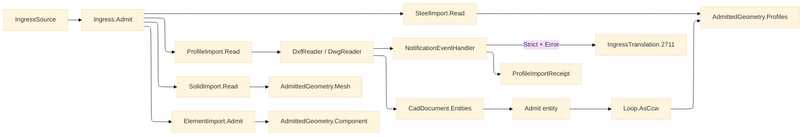

# [RASM_FABRICATION_PROFILE_IMPORT]

`ProfileImport` owns DXF/DWG profile admission: `ACadSharp` reads model-space entities, the boundary lowers recoverable reader notifications into a typed receipt, strict notification policy escalates `NotificationType.Error` to `FabricationFault.IngressTranslation`, and every admitted curve becomes the canonical `Loop` part library. `Ingress.Admit` is the folder's single polymorphic ingress fold over `Profile`, `Solid`, `Steel`, and `Element`; each arm dispatches to its source kernel and returns the shared `AdmittedGeometry` family, so downstream planes consume `Loop`, `MeshSpace`, or `AdmittedComponent` rather than provider objects.

## [01]-[INDEX]

- [01]-[PROFILE_IMPORT]: `ProfileImport` owns `Read`, `ProfileReadPolicy`, `ProfileImportReceipt`, ACadSharp notification capture, entity-to-`Loop` admission, and the total `Ingress.Admit` fold over the four source arms.

## [02]-[PROFILE_IMPORT]

- Owner: `ProfileImport` is the read-only DXF/DWG boundary; `ChordTolerance` owns the sampler precision; `ProfileReadPolicy` owns strict-versus-permissive notification handling; `ProfileImportReceipt` carries loops plus recoverable notification evidence; `Ingress` owns the total source dispatch.
- Cases: `IngressSource` closes over `Profile`, `Solid`, `Steel`, and `Element`; `AdmittedGeometry` closes over `Profiles`, `Mesh`, and `Component`. Entity admission covers `LwPolyline`, `Polyline2D`, `Line`, `Arc`, `Circle`, `Spline`, and `Insert`; unsupported drawing entities drop as non-profile material.
- Entry: `Fin<ProfileImportReceipt> ProfileImport.Read(string path, ChordTolerance chord, bool demandClosed, ProfileReadPolicy policy)` reads a DXF/DWG file and returns profile loops plus notification rows. `Fin<AdmittedGeometry> Ingress.Admit(IngressSource source)` routes `ProfileImport.Read`, `SolidImport.Read`, `SteelImport.Read`, and `ElementImport.Admit`; the Solid arm carries its source-owned `SolidPolicy` into the OCCT boundary.
- Auto: `DxfReader.Read` and `DwgReader.Read` receive one `NotificationEventHandler`. The handler captures every `NotificationEventArgs` as `ProfileNotification`; `ProfileReadPolicy.Strict` fails on the first `NotificationType.Error`, while `ProfileReadPolicy.Permissive` returns the receipt with notifications intact.
- Receipt: `ProfileImportReceipt.Loops` is the part library consumed by nesting, toolpath, and posting. `ProfileImportReceipt.Notifications` is ingress-degradation evidence; it never crosses into sibling kernels as an ACadSharp type.
- Packages: `ACadSharp` (`DxfReader.Read`, `DwgReader.Read`, `NotificationEventArgs`, `NotificationType`, `CadDocument.Entities`, `LwPolyline`, `Polyline2D`, `Line`, `Arc`, `Circle`, `Spline`, `Insert.Explode`), `Rasm.Fabrication.Process` (`Loop`, `AdmittedComponent`, `FabricationFault`, `SourceKind`, `SourceLocus`), `Rasm.Meshing` (`MeshSpace`), `Rasm.Element` (`ElementGraph`, `NodeId`), `Rasm.Domain` (`Op`), Thinktecture.Runtime.Extensions, LanguageExt.Core, BCL inbox.
- Growth: a new profile entity is one `Admit` arm; a stricter reader posture is one `ProfileReadPolicy` row; a new source genus is one `IngressSource` case, one dispatch arm, and one `AdmittedGeometry` case only when the geometry genus is new.
- Boundary: ACadSharp entity types stop at this boundary. `Insert.Explode()` owns block placement; `Arc.CreateFromBulge` and `PolygonalVertexes` own bulge and curve sampling; `Spline.TryPolygonalVertexes` owns NURBS sampling. Fabrication CAD write is rejected: the AppUi ACadSharp two-format drafting leg owns DXF/DWG write, and a `netDxf` read or write path in Fabrication is the rejected second CAD rail.

```csharp signature
// --- [RUNTIME_PRELUDE] --------------------------------------------------------------------
using System.Collections.Generic;
using System.IO;
using ACadSharp;
using ACadSharp.Entities;
using ACadSharp.IO;
using CSMath;
using LanguageExt;
using LanguageExt.Common;
using Rasm.Domain;
using Rasm.Element;
using Rasm.Fabrication.Process;
using Rasm.Meshing;
using Rasm.Numerics;
using Rhino.Geometry;
using Thinktecture;
using static LanguageExt.Prelude;

namespace Rasm.Fabrication.Ingress;

// --- [TYPES] ------------------------------------------------------------------------------
[ValueObject<int>]
public readonly partial struct ChordTolerance {
    static partial void ValidateFactoryArguments(ref ValidationError? validationError, ref int value) =>
        validationError = value < 2
            ? new ValidationError("chord-tolerance: segment count must be >= 2")
            : null;

    public int Segments => Value;

    public static readonly ChordTolerance Default = Create(24);
}

[SmartEnum<string>]
public sealed partial class ProfileReadPolicy {
    public static readonly ProfileReadPolicy Strict = new("strict", errorNotificationsFail: true);
    public static readonly ProfileReadPolicy Permissive = new("permissive", errorNotificationsFail: false);

    public bool ErrorNotificationsFail { get; }
}

// --- [MODELS] -----------------------------------------------------------------------------
public sealed record ProfileNotification(NotificationType Type, string Message, string ExceptionMessage) {
    public bool IsError => Type == NotificationType.Error;

    public static ProfileNotification Of(NotificationEventArgs args) =>
        new(args.NotificationType, args.Message, args.Exception?.Message ?? string.Empty);
}

public sealed record ProfileImportReceipt(Arr<Loop> Loops, Seq<ProfileNotification> Notifications);

[Union(ConversionFromValue = ConversionOperatorsGeneration.None)]
public abstract partial record IngressSource {
    private IngressSource() { }

    public sealed record Profile(string Path, ChordTolerance Chord, bool DemandClosed, ProfileReadPolicy Policy) : IngressSource;
    public sealed record Solid(string Path, SolidPolicy Policy) : IngressSource;
    public sealed record Steel(string Path) : IngressSource;
    public sealed record Element(ElementGraph Graph, NodeId Id, Op Key, Option<MeshSpace> Body, Arr<Loop> Footprint = default) : IngressSource;
}

[Union(ConversionFromValue = ConversionOperatorsGeneration.None)]
public abstract partial record AdmittedGeometry {
    private AdmittedGeometry() { }

    public sealed record Profiles(Arr<Loop> Loops) : AdmittedGeometry;
    public sealed record Mesh(MeshSpace Space) : AdmittedGeometry;
    public sealed record Component(AdmittedComponent Value) : AdmittedGeometry;
}

// --- [OPERATIONS] -------------------------------------------------------------------------
public static class ProfileImport {
    public static Fin<ProfileImportReceipt> Read(string path, ChordTolerance chord, bool demandClosed, ProfileReadPolicy policy) {
        Seq<ProfileNotification> notifications = Empty;
        NotificationEventHandler sink = (_, args) => notifications = notifications.Add(ProfileNotification.Of(args));
        return Open(path, sink)
            .Bind(doc => Fold(doc, chord))
            .Bind(loops => demandClosed ? RequireClosed(loops) : Fin.Succ(loops))
            .Bind(loops => Receipt(loops, notifications, policy));
    }

    static Fin<ProfileImportReceipt> Receipt(Arr<Loop> loops, Seq<ProfileNotification> notifications, ProfileReadPolicy policy) =>
        policy.ErrorNotificationsFail && notifications.Exists(static notice => notice.IsError)
            ? Fin.Fail<ProfileImportReceipt>(Translation(notifications.Find(static notice => notice.IsError).IfNone(new ProfileNotification(NotificationType.Error, "reader-notification", string.Empty))))
            : Fin.Succ(new ProfileImportReceipt(loops, notifications));

    static Error Translation(ProfileNotification notice) =>
        FabricationFault.IngressTranslation(SourceKind.Profile, new SourceLocus.DxfEntity(notice.Message)).ToError();

    static Fin<Arr<Loop>> Fold(CadDocument doc, ChordTolerance chord) {
        Arr<Loop> loops = toSeq(doc.Entities)
            .Map(entity => Admit(entity, chord))
            .Somes()
            .Bind(identity)
            .ToArr();
        return loops.IsEmpty
            ? Fin.Fail<Arr<Loop>>(GeometryFault.DegenerateInput("profile:empty").ToError())
            : loops.Exists(NonFinite)
                ? Fin.Fail<Arr<Loop>>(GeometryFault.DegenerateInput("profile:non-finite").ToError())
                : Fin.Succ(loops);
    }

    static Fin<Arr<Loop>> RequireClosed(Arr<Loop> loops) =>
        loops.Find(static loop => !loop.Closed).Match(
            Some: static open => Fin.Fail<Arr<Loop>>(FabricationFault.OpenLoop(FabConcern.Profile, open.Count).ToError()),
            None: static () => Fin.Succ(loops));

    static Fin<CadDocument> Open(string path, NotificationEventHandler sink) =>
        Try(() => Path.GetExtension(path).ToLowerInvariant() is ".dwg"
                ? DwgReader.Read(path, sink)
                : DxfReader.Read(path, sink))
            .ToFin()
            .MapFail(_ => GeometryFault.DegenerateInput($"profile:unreadable:{Path.GetFileName(path)}").ToError());

    static Option<Seq<Loop>> Admit(Entity entity, ChordTolerance chord) =>
        entity switch {
            LwPolyline poly => Some(Seq(LoopOf(LwVerts(poly, chord), poly.IsClosed))),
            Polyline2D poly => Some(Seq(LoopOf(toSeq(poly.Vertices).Map(vertex => Pt(vertex.Location)), poly.IsClosed))),
            Line line => Some(Seq(LoopOf(Seq(Pt(line.StartPoint), Pt(line.EndPoint)), closed: false))),
            Arc arc => Some(Seq(LoopOf(Sampled(arc.PolygonalVertexes(chord.Segments)), closed: false))),
            Circle circle => Some(Seq(LoopOf(Sampled(circle.PolygonalVertexes(chord.Segments)), closed: true))),
            Spline spline => SplineLoop(spline, chord),
            Insert insert => Some(Flatten(insert, chord)),
            _ => None,
        };

    static Option<Seq<Loop>> SplineLoop(Spline spline, ChordTolerance chord) {
        List<XYZ> points;
        bool sampled = spline.TryPolygonalVertexes(chord.Segments, out points)
            || (spline.UpdateFromFitPoints() && spline.TryPolygonalVertexes(chord.Segments, out points));
        return sampled ? Some(Seq(LoopOf(Sampled(points), spline.IsClosed))) : None;
    }

    static Seq<Loop> Flatten(Insert insert, ChordTolerance chord) =>
        toSeq(insert.Explode()).Map(entity => Admit(entity, chord)).Somes().Bind(identity);

    static Seq<Point3d> LwVerts(LwPolyline poly, ChordTolerance chord) =>
        toSeq(Enumerable.Range(0, poly.Vertices.Count)).Bind(index => Span(poly, index, chord));

    static Seq<Point3d> Span(LwPolyline poly, int index, ChordTolerance chord) {
        LwPolyline.Vertex vertex = poly.Vertices[index];
        int next = (index + 1) % poly.Vertices.Count;
        return Math.Abs(vertex.Bulge) < 1e-12 || (next == 0 && !poly.IsClosed)
            ? Seq(Pt(vertex.Location))
            : Bulge(vertex.Location, poly.Vertices[next].Location, vertex.Bulge, chord);
    }

    static Seq<Point3d> Bulge(XY start, XY end, double bulge, ChordTolerance chord) {
        List<XYZ> sampled = Arc.CreateFromBulge(start, end, bulge).PolygonalVertexes(chord.Segments);
        return Sampled(sampled).Take(sampled.Count - 1);
    }

    static Seq<Point3d> Sampled(List<XYZ> sampled) => toSeq(sampled).Map(Pt);

    static Loop LoopOf(Seq<Point3d> vertices, bool closed) => new Loop(vertices.ToArr(), closed).AsCcw();

    static Point3d Pt(XY xy) => new(xy.X, xy.Y, 0.0);
    static Point3d Pt(XYZ xyz) => new(xyz.X, xyz.Y, 0.0);

    static bool NonFinite(Loop loop) =>
        loop.Vertices.Exists(static point => !double.IsFinite(point.X) || !double.IsFinite(point.Y));
}

public static class Ingress {
    public static Fin<AdmittedGeometry> Admit(IngressSource source) =>
        source.Switch(
            profile: static profile => ProfileImport.Read(profile.Path, profile.Chord, profile.DemandClosed, profile.Policy)
                .Map(receipt => (AdmittedGeometry)new AdmittedGeometry.Profiles(receipt.Loops)),
            solid: static solid => SolidImport.Read(solid.Path, solid.Policy)
                .Map(space => (AdmittedGeometry)new AdmittedGeometry.Mesh(space)),
            steel: static steel => SteelImport.Read(steel.Path)
                .Map(receipt => (AdmittedGeometry)new AdmittedGeometry.Profiles(receipt.Part.Loops)),
            element: static element => ElementImport.Admit(element.Graph, element.Id, element.Key, element.Body, element.Footprint)
                .Map(component => (AdmittedGeometry)new AdmittedGeometry.Component(component)));
}
```


