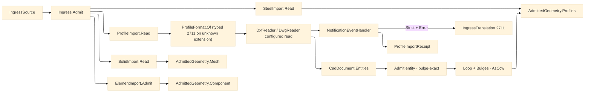

# [RASM_FABRICATION_PROFILE_IMPORT]

`ProfileImport` owns DXF/DWG profile admission: the `ProfileFormat` axis dispatches `DxfReader.Read`/`DwgReader.Read` off the admitted extension (an unknown extension is the typed 2711, never a provider probe), the boundary lowers recoverable reader notifications into a typed receipt, strict notification policy escalates `NotificationType.Error` to `FabricationFault.IngressTranslation`, and every admitted curve becomes the canonical `Loop` part library ARC-EXACT: polyline bulges, arcs, and circles land in the owner#atoms `Loop.Bulges` column (`tan(θ/4)` per arc span) instead of tessellating, so `Geometry2D/arcs` offsets the admitted profile exactly and only a NURBS spline samples through the `SplineDensity` policy. `Ingress.Admit` is the folder's single polymorphic ingress fold over `Profile`, `Solid`, `Steel`, and `Element`; each arm dispatches to its source kernel and returns the shared `AdmittedGeometry` family, so downstream planes consume `Loop`, `MeshSpace`, or `AdmittedComponent` rather than provider objects.

## [01]-[INDEX]

- [01]-[PROFILE_IMPORT]: `ProfileImport` owns `Read`, the `ProfileFormat` extension axis, `SplineDensity`, `ProfileReadPolicy`, `ProfileImportReceipt`, ACadSharp notification capture, bulge-exact entity-to-`Loop` admission, and the total `Ingress.Admit` fold over the four source arms.

## [02]-[PROFILE_IMPORT]

- Owner: `ProfileImport` is the read-only DXF/DWG boundary; `ProfileFormat` the extension→reader delegate axis; `SplineDensity` the NURBS sampler precision (splines are the ONLY tessellated entity — every circular span admits as a bulge); `ProfileReadPolicy` the reader-recovery + notification posture; `ProfileImportReceipt` carries loops plus recoverable notification evidence; `Ingress` owns the total source dispatch.
- Cases: `IngressSource` closes over `Profile`, `Solid`, `Steel`, and `Element`; `AdmittedGeometry` closes over `Profiles`, `Mesh`, and `Component`; `ProfileFormat` rows `dxf` (`.dxf` → `DxfReader.Read` under `DxfReaderConfiguration`) · `dwg` (`.dwg` → `DwgReader.Read` under `DwgReaderConfiguration`); `ProfileReadPolicy` rows `strict` (failsafe read, first `Error` notification fails) · `permissive` (failsafe read, notifications ride the receipt) · `unforgiving` (`Failsafe = false` — recoverable corruption throws and lowers once); entity admission covers `LwPolyline`, `Polyline2D`, `Line`, `Arc`, `Circle`, `Spline`, and `Insert`; entities outside that roster drop as non-profile material.
- Entry: `Fin<ProfileImportReceipt> ProfileImport.Read(string path, SplineDensity density, bool demandClosed, ProfileReadPolicy policy)` reads a DXF/DWG file and returns bulge-carrying profile loops plus notification rows. `Fin<AdmittedGeometry> Ingress.Admit(IngressSource source)` routes `ProfileImport.Read`, `SolidImport.Read`, `SteelImport.Read`, and `ElementImport.Admit`; the Solid arm carries its source-owned `SolidPolicy` into the OCCT boundary.
- Auto: `ProfileFormat.Of` admits the extension before any reader runs; the format row's delegate binds its own configuration type, threading the policy `Failsafe` knob and one `NotificationEventHandler`. The handler captures every `NotificationEventArgs` as `ProfileNotification`; `ProfileReadPolicy.Strict` fails on the first `NotificationType.Error`, `Permissive` returns the receipt with notifications intact. Both polyline arms read the per-vertex `Bulge` into the `Loop.Bulges` column (an open polyline's terminal span carries zero); an `Arc` admits as one two-vertex open span with `tan(Sweep/4)`; a `Circle` as two half-circle spans of bulge `1`; a `Spline` samples through `TryPolygonalVertexes` with the `UpdateFromFitPoints` fallback.
- Receipt: `ProfileImportReceipt.Loops` is the arc-exact part library consumed by nesting, toolpath, and posting. `ProfileImportReceipt.Notifications` is ingress-degradation evidence; it never crosses into sibling kernels as an ACadSharp type.
- Packages: `ACadSharp` (`DxfReader.Read`/`DwgReader.Read` configured overloads, `DxfReaderConfiguration`/`DwgReaderConfiguration` `Failsafe`, `NotificationEventArgs`, `NotificationType`, `CadDocument.Entities`, `LwPolyline`, `Polyline2D`/`Vertex2D`, `Line`, `Arc` (`Sweep`/`GetEndVertices`), `Circle`, `Spline`, `Insert.Explode`), `Rasm.Fabrication.Process` (`Loop`+`Bulges`, `AdmittedComponent`, `FabricationFault`, `SourceKind`, `SourceLocus`), `Rasm.Meshing` (`MeshSpace`), `Rasm.Element` (`ElementGraph`, `NodeId`), `Rasm.Domain` (`Op`), Thinktecture.Runtime.Extensions, LanguageExt.Core, BCL inbox.
- Growth: a new profile entity is one `Admit` arm; a stricter reader posture is one `ProfileReadPolicy` row; a new CAD dialect is one `ProfileFormat` row plus its configured delegate; a new source genus is one `IngressSource` case, one dispatch arm, and one `AdmittedGeometry` case only when the geometry genus is new.
- Boundary: ACadSharp entity types stop at this boundary. The `Bulges` column carries every circular span and a tessellated arc where the bulge column admits it exactly is the rejected lossy form; `Spline.TryPolygonalVertexes` owns NURBS sampling and a hand-rolled de Boor is the rejected form; `Insert.Explode()` owns block placement. Fabrication CAD write is rejected: the AppUi ACadSharp two-format drafting leg owns DXF/DWG write, and a `netDxf` read or write path in Fabrication is the rejected second CAD rail. Layer/color process-intent and `$INSUNITS` unit normalization are tracked catalog demand — `api-acadsharp.md` catalogs no `Entity`-layer or header-unit member, and an uncatalogued member is unciteable until the catalog verifies it.

```csharp signature
// --- [RUNTIME_PRELUDE] --------------------------------------------------------------------
using System.Collections.Generic;
using System.IO;
using ACadSharp;
using ACadSharp.Entities;
using ACadSharp.IO;
using CSMath;
using LanguageExt;
using LanguageExt.Common;
using Rasm.Domain;
using Rasm.Element;
using Rasm.Fabrication.Process;
using Rasm.Meshing;
using Rasm.Numerics;
using Rhino.Geometry;
using Thinktecture;
using static LanguageExt.Prelude;

namespace Rasm.Fabrication.Ingress;

// --- [TYPES] ------------------------------------------------------------------------------
// Extension axis with reader delegate rows: each row binds its own configuration type, so the
// policy Failsafe knob and the notification sink thread through one admitted dispatch.
[SmartEnum<string>]
public sealed partial class ProfileFormat {
    public static readonly ProfileFormat Dxf = new("dxf", Arr(".dxf"),
        static (path, failsafe, sink) => DxfReader.Read(path, new DxfReaderConfiguration { Failsafe = failsafe }, sink));
    public static readonly ProfileFormat Dwg = new("dwg", Arr(".dwg"),
        static (path, failsafe, sink) => DwgReader.Read(path, new DwgReaderConfiguration { Failsafe = failsafe }, sink));

    public Arr<string> Extensions { get; }

    [UseDelegateFromConstructor]
    public partial CadDocument Read(string path, bool failsafe, NotificationEventHandler sink);

    public static Fin<ProfileFormat> Of(string path) =>
        Items.Find(f => f.Extensions.Exists(e => string.Equals(e, Path.GetExtension(path), StringComparison.OrdinalIgnoreCase)))
            .ToFin(FabricationFault.IngressTranslation(SourceKind.Profile, new SourceLocus.DxfEntity(Path.GetFileName(path))).ToError());
}

// NURBS sampler precision: splines are the only tessellated entity — arcs ride the bulge column exactly.
[ValueObject<int>]
public readonly partial struct SplineDensity {
    static partial void ValidateFactoryArguments(ref ValidationError? validationError, ref int value) =>
        validationError = value < 2 ? new ValidationError("spline-density: segment count must be >= 2") : null;

    public int Segments => Value;

    public static readonly SplineDensity Default = Create(24);
}

[SmartEnum<string>]
public sealed partial class ProfileReadPolicy {
    public static readonly ProfileReadPolicy Strict = new("strict", errorNotificationsFail: true, failsafe: true);
    public static readonly ProfileReadPolicy Permissive = new("permissive", errorNotificationsFail: false, failsafe: true);
    public static readonly ProfileReadPolicy Unforgiving = new("unforgiving", errorNotificationsFail: true, failsafe: false);

    public bool ErrorNotificationsFail { get; }
    public bool Failsafe { get; }
}

// --- [MODELS] -----------------------------------------------------------------------------
public sealed record ProfileNotification(NotificationType Type, string Message, string ExceptionMessage) {
    public bool IsError => Type == NotificationType.Error;

    public static ProfileNotification Of(NotificationEventArgs args) =>
        new(args.NotificationType, args.Message, args.Exception?.Message ?? string.Empty);
}

public sealed record ProfileImportReceipt(Arr<Loop> Loops, Seq<ProfileNotification> Notifications);

[Union(ConversionFromValue = ConversionOperatorsGeneration.None)]
public abstract partial record IngressSource {
    private IngressSource() { }

    public sealed record Profile(string Path, SplineDensity Density, bool DemandClosed, ProfileReadPolicy Policy) : IngressSource;
    public sealed record Solid(string Path, SolidPolicy Policy) : IngressSource;
    public sealed record Steel(string Path) : IngressSource;
    public sealed record Element(ElementGraph Graph, NodeId Id, Op Key, Option<MeshSpace> Body, Arr<Loop> Footprint = default) : IngressSource;
}

[Union(ConversionFromValue = ConversionOperatorsGeneration.None)]
public abstract partial record AdmittedGeometry {
    private AdmittedGeometry() { }

    public sealed record Profiles(Arr<Loop> Loops) : AdmittedGeometry;
    public sealed record Mesh(MeshSpace Space) : AdmittedGeometry;
    public sealed record Component(AdmittedComponent Value) : AdmittedGeometry;
}

// --- [OPERATIONS] -------------------------------------------------------------------------
public static class ProfileImport {
    public static Fin<ProfileImportReceipt> Read(string path, SplineDensity density, bool demandClosed, ProfileReadPolicy policy) {
        Seq<ProfileNotification> notifications = Empty;
        NotificationEventHandler sink = (_, args) => notifications = notifications.Add(ProfileNotification.Of(args));
        return ProfileFormat.Of(path)
            .Bind(format => Open(format, path, policy, sink))
            .Bind(doc => Fold(doc, density))
            .Bind(loops => demandClosed ? RequireClosed(loops) : Fin.Succ(loops))
            .Bind(loops => Receipt(loops, notifications, policy));
    }

    static Fin<ProfileImportReceipt> Receipt(Arr<Loop> loops, Seq<ProfileNotification> notifications, ProfileReadPolicy policy) =>
        policy.ErrorNotificationsFail && notifications.Exists(static notice => notice.IsError)
            ? Fin.Fail<ProfileImportReceipt>(Translation(notifications.Filter(static notice => notice.IsError).Head()))
            : Fin.Succ(new ProfileImportReceipt(loops, notifications));

    static Error Translation(ProfileNotification notice) =>
        FabricationFault.IngressTranslation(SourceKind.Profile, new SourceLocus.DxfEntity(notice.Message)).ToError();

    static Fin<Arr<Loop>> Fold(CadDocument doc, SplineDensity density) {
        Arr<Loop> loops = toSeq(doc.Entities).Map(entity => Admit(entity, density)).Somes().Bind(identity).ToArr();
        return loops.IsEmpty
            ? Fin.Fail<Arr<Loop>>(GeometryFault.DegenerateInput("profile:empty").ToError())
            : loops.Exists(NonFinite)
                ? Fin.Fail<Arr<Loop>>(GeometryFault.DegenerateInput("profile:non-finite").ToError())
                : Fin.Succ(loops);
    }

    static Fin<Arr<Loop>> RequireClosed(Arr<Loop> loops) =>
        loops.Find(static loop => !loop.Closed).Match(
            Some: static open => Fin.Fail<Arr<Loop>>(FabricationFault.OpenLoop(FabConcern.Profile, open.Count).ToError()),
            None: static () => Fin.Succ(loops));

    static Fin<CadDocument> Open(ProfileFormat format, string path, ProfileReadPolicy policy, NotificationEventHandler sink) =>
        Try.lift(() => format.Read(path, policy.Failsafe, sink)).Run()
            .MapFail(_ => GeometryFault.DegenerateInput($"profile:unreadable:{Path.GetFileName(path)}").ToError());

    // Bulge-exact admission: both polyline genera carry per-span bulges into Loop.Bulges; Arc/Circle admit as
    // bulged spans (tan(θ/4)); only a Spline tessellates, through the package sampler at the density policy.
    static Option<Seq<Loop>> Admit(Entity entity, SplineDensity density) =>
        entity switch {
            LwPolyline poly => Some(Seq(new Loop(
                toSeq(poly.Vertices).Map(static v => Pt(v.Location)).ToArr(), poly.IsClosed,
                toSeq(poly.Vertices).Map((v, i) => !poly.IsClosed && i == poly.Vertices.Count - 1 ? 0.0 : v.Bulge).ToArr()).AsCcw())),
            Polyline2D poly => Some(Seq(new Loop(
                toSeq(poly.Vertices).Map(static v => Pt(v.Location)).ToArr(), poly.IsClosed,
                toSeq(poly.Vertices).Map((v, i) => !poly.IsClosed && i == poly.Vertices.Count - 1 ? 0.0 : v.Bulge).ToArr()).AsCcw())),
            Line line => Some(Seq(new Loop(Arr(Pt(line.StartPoint), Pt(line.EndPoint)), Closed: false).AsCcw())),
            Arc arc => Some(Seq(ArcSpan(arc))),
            Circle circle => Some(Seq(new Loop(
                Arr(new Point3d(circle.Center.X - circle.Radius, circle.Center.Y, 0.0), new Point3d(circle.Center.X + circle.Radius, circle.Center.Y, 0.0)),
                Closed: true, Arr(1.0, 1.0)).AsCcw())),
            Spline spline => SplineLoop(spline, density),
            Insert insert => Some(Flatten(insert, density)),
            _ => None,
        };

    static Loop ArcSpan(Arc arc) {
        arc.GetEndVertices(out XYZ start, out XYZ end);
        return new Loop(Arr(Pt(start), Pt(end)), Closed: false, Arr(Math.Tan(arc.Sweep / 4.0), 0.0));
    }

    static Option<Seq<Loop>> SplineLoop(Spline spline, SplineDensity density) {
        List<XYZ> points;
        bool sampled = spline.TryPolygonalVertexes(density.Segments, out points)
            || (spline.UpdateFromFitPoints() && spline.TryPolygonalVertexes(density.Segments, out points));
        return sampled ? Some(Seq(new Loop(toSeq(points).Map(Pt).ToArr(), spline.IsClosed).AsCcw())) : None;
    }

    static Seq<Loop> Flatten(Insert insert, SplineDensity density) =>
        toSeq(insert.Explode()).Map(entity => Admit(entity, density)).Somes().Bind(identity);

    static Point3d Pt(XY xy) => new(xy.X, xy.Y, 0.0);
    static Point3d Pt(XYZ xyz) => new(xyz.X, xyz.Y, 0.0);

    static bool NonFinite(Loop loop) =>
        loop.Vertices.Exists(static point => !double.IsFinite(point.X) || !double.IsFinite(point.Y));
}

public static class Ingress {
    public static Fin<AdmittedGeometry> Admit(IngressSource source) =>
        source.Switch(
            profile: static profile => ProfileImport.Read(profile.Path, profile.Density, profile.DemandClosed, profile.Policy)
                .Map(receipt => (AdmittedGeometry)new AdmittedGeometry.Profiles(receipt.Loops)),
            solid: static solid => SolidImport.Read(solid.Path, solid.Policy)
                .Map(space => (AdmittedGeometry)new AdmittedGeometry.Mesh(space)),
            steel: static steel => SteelImport.Read(steel.Path)
                .Map(receipt => (AdmittedGeometry)new AdmittedGeometry.Profiles(receipt.Part.Loops)),
            element: static element => ElementImport.Admit(element.Graph, element.Id, element.Key, element.Body, element.Footprint)
                .Map(component => (AdmittedGeometry)new AdmittedGeometry.Component(component)));
}
```


