# [RASM_FABRICATION_SOLID_IMPORT]

`SolidImport` is the single solid-CAD ingress kernel for the `Ingress.Admit` `Solid` arm: STEP AP203/AP214/AP242, IGES, and STL enter through `OcctNet.Wrapper`, every native `OcctShape` stays inside one disposal boundary, `Triangulate` mints the only `OcctMesh` crossing, the detached triangle carrier admits into kernel `MeshSpace` through `MeshSpace.Of`, and a dirty mesh heals through the kernel `Heal.Repair` session over the ADMITTED space — the heal rail is total over exactly the defective input class dirty STL delivers. AP242 PMI and assembly-tree facts stay a standing wrapper-demand invariant because `libTKXCAF` and `libTKHLR` ship native yet expose no managed entry.

## [01]-[INDEX]

- [01]-[SOLID_IMPORT]: `SolidImport` owns the `IngressSource.Solid` kernel, `SolidFormat` format dispatch, the `HealRoute` repair axis, the OCCT native-runtime gate, the `OcctShape` disposal boundary, the `OcctMesh`→`MeshSpace.Of` admission, the kernel `Heal.Repair` route, and 2711 `IngressTranslation(SourceKind.Solid, SourceLocus.OcctShape(...))` lowering.

## [02]-[SOLID_IMPORT]

- Owner: `SolidImport` the static boundary kernel under `Rasm.Fabrication.Ingress`; `SolidFormat` the format vocabulary over STEP/IGES/STL extensions and their verified `OcctShape.ImportStep`/`ImportIges`/`ImportStl` delegates; `HealRoute` the repair-selection axis whose row carries the format predicate.
- Owner atoms: `SolidPolicy` carries the unit-suffixed tessellation tolerance, the heal route, the kernel `Context`, the diagnostic shape locus, and the `Op` key; `SolidMesh` is the detached triangle carrier after `OcctMesh` crosses through Mapperly-projected vertices.
- Cases: `SolidFormat` rows `Step` (`.step`/`.stp` → `ImportStep`) · `Iges` (`.iges`/`.igs` → `ImportIges`) · `Stl` (`.stl` → `ImportStl`, dirty) (3); `HealRoute` rows `never` · `dirty-stl` (applies when the format row is dirty) · `always` (3); the result path is `B-rep/mesh-as-shape → OcctShape → Triangulate → SolidMesh guard → MeshSpace.Of → (HealRoute) Heal.Repair → MeshSpace`.
- Entry: `Ingress.Admit(IngressSource.Solid source)` dispatches `SolidImport.Read(source.Path, source.Policy)` directly and wraps the admitted kernel geometry as `AdmittedGeometry.Mesh`; the source payload carries the tolerance, heal route, and kernel context, so the arm never reads ambient defaults or a hidden process knob.
- Auto: `Read` resolves the `SolidFormat` from the extension, gates native load through `OcctRuntime.TryGetNativeVersion(out string version, out string? error)`, imports one `OcctShape` under `using`, rejects `shape.IsNull`, and tessellates through `shape.Triangulate(policy.Tolerance.LinearDeflectionMm, policy.Tolerance.AngularDeflectionRad)`; a native failure is caught as the typed `OcctException` at the one boundary kernel and lowered with its shape locus — never a generic trap that erases the native failure class.
- Auto repair: `[Mapper]` projects each `OcctMeshVertex`; the local `WellFormed` guard judges the DETACHED carrier — positive triangle count, index cardinality and range, finite vertices, and per-triangle index distinctness — before kernel admission; the admitted space then heals through `HealPlan.Of` + `Heal.Repair` when the `HealRoute` row applies, and the session's `Healed` space is the published result. The kernel heal is total over defective meshes, so the guard rejects only what no heal admits (malformed index soup), never the dirty-but-healable class the route exists for.
- Receipt: success returns only `MeshSpace` under `AdmittedGeometry.Mesh`; failure lowers `OcctException`, native-load failure, unknown extension, null shape, invalid triangle soup, or kernel admission/heal rejection to `FabricationFault.IngressTranslation(SourceKind.Solid, SourceLocus.OcctShape(policy.ShapeId)).ToError()` — a kernel band-2400 fault from `MeshSpace.Of`/`Heal.Repair` passes through unchanged (band-ownership law).
- Packages OCCT: `OcctNet.Wrapper` (`OcctRuntime.TryGetNativeVersion`, `OcctShape.ImportStep`/`ImportIges`/`ImportStl`, `OcctShape.IsNull`, `OcctShape.Triangulate`, `OcctMesh.Vertices`/`TriangleIndices`/`TriangleCount`, `OcctMeshVertex`, `OcctException`).
- Packages projection: `Riok.Mapperly` (`[Mapper]` partial projection), `UnitsNet` (`Length`/`Angle` — the typed tolerance admission overload).
- Packages kernel: `Rasm.Meshing` (`MeshSpace.Of` admission), `Rasm.Processing` (`Heal.Repair`/`HealPlan.Of` — the kernel heal session over the admitted space), `Rasm.Domain` (`Op` evidence key, `Context`), `Rhino.Geometry` (`Mesh` — the native carrier `MeshSpace.Of` admits), Thinktecture.Runtime.Extensions (`[SmartEnum<string>]`), LanguageExt.Core (`Fin`/`Arr`), BCL inbox.
- Growth: assembly-tree and AP242 PMI surface only as new `SolidFormat`-adjacent wrapper demand rows once managed `libTKXCAF` bindings exist; HLR never moves to OCCT while `libTKHLR` remains managed-unbound, and projection keeps composing kernel `View.Apply`; a new solid file dialect is one `SolidFormat` row plus one import delegate, not a second ingress owner; a repair-policy widening is one `HealRoute` row.
- Boundary source: `Ingress/profile` owns the source union and carries the `SolidPolicy` payload at the dispatch seam; the source family remains singular.
- Boundary ABI: no `OcctShape`, `OcctMesh`, `OcctVector3d`, `OcctPointCoordinates`, or native handle escapes this page; no kernel `Point3d`, `Vector3d`, `MeshSpace`, or content key enters the OCCT ABI; no raw `.Native.OcctStatus` escapes — the boundary catches `OcctException`, and the native `StatusCode` evidence lands once the `SourceLocus.OcctShape` payload widens at its faults owner; no local hasher mints an egress artifact; no assembly/PMI/color reader is claimed from the wrapper until the managed surface binds it; extents derive from the admitted `MeshSpace`, never a second OCCT-side bound truth.

```csharp signature
// --- [RUNTIME_PRELUDE] --------------------------------------------------------------------
using LanguageExt;
using LanguageExt.Common;
using OcctNet.Wrapper;
using Rasm.Domain;
using Rasm.Fabrication.Process;
using Rasm.Meshing;
using Rasm.Processing;
using Rhino.Geometry;
using Riok.Mapperly.Abstractions;
using Thinktecture;
using UnitsNet;
using static LanguageExt.Prelude;

namespace Rasm.Fabrication.Ingress;

// --- [TYPES] ------------------------------------------------------------------------------
[SmartEnum<string>]
public sealed partial class SolidFormat {
    public static readonly SolidFormat Step = new("step", Arr(".step", ".stp"), dirty: false, static path => OcctShape.ImportStep(path));
    public static readonly SolidFormat Iges = new("iges", Arr(".iges", ".igs"), dirty: false, static path => OcctShape.ImportIges(path));
    public static readonly SolidFormat Stl = new("stl", Arr(".stl"), dirty: true, static path => OcctShape.ImportStl(path));

    public Arr<string> Extensions { get; }
    public bool Dirty { get; }

    [UseDelegateFromConstructor]
    public partial OcctShape Import(string path);

    public static Fin<SolidFormat> Of(string path, int shapeId) =>
        Items.Find(format => format.Extensions.Exists(extension => string.Equals(extension, Path.GetExtension(path), StringComparison.OrdinalIgnoreCase)))
            .ToFin(FabricationFault.IngressTranslation(SourceKind.Solid, new SourceLocus.OcctShape(shapeId)).ToError());
}

// Repair selection as a behavior-carrying axis: the row's predicate reads the format, so the caller never
// recombines a heal boolean against the source kind.
[SmartEnum<string>]
public sealed partial class HealRoute {
    public static readonly HealRoute Never = new("never", static _ => false);
    public static readonly HealRoute DirtyStl = new("dirty-stl", static format => format.Dirty);
    public static readonly HealRoute Always = new("always", static _ => true);

    [UseDelegateFromConstructor]
    public partial bool Applies(SolidFormat format);
}

// --- [MODELS] -----------------------------------------------------------------------------
public readonly record struct SolidTolerance(double LinearDeflectionMm, double AngularDeflectionRad) {
    public static Fin<SolidTolerance> Of(double linearDeflectionMm, double angularDeflectionRad, int shapeId) =>
        linearDeflectionMm > 0.0 && angularDeflectionRad > 0.0
            ? Fin.Succ(new SolidTolerance(linearDeflectionMm, angularDeflectionRad))
            : Fin.Fail<SolidTolerance>(FabricationFault.IngressTranslation(SourceKind.Solid, new SourceLocus.OcctShape(shapeId)).ToError());

    public static Fin<SolidTolerance> Of(Length linear, Angle angular, int shapeId) =>
        Of(linear.Millimeters, angular.Radians, shapeId);
}

public readonly record struct SolidPolicy(SolidTolerance Tolerance, HealRoute Heal, Context Context, int ShapeId, Op Key) {
    public static Fin<SolidPolicy> Of(string path, Op key, Context context, double linearDeflectionMm, double angularDeflectionRad, HealRoute? heal = null) {
        int shapeId = StringComparer.OrdinalIgnoreCase.GetHashCode(Path.GetFullPath(path));
        return SolidTolerance.Of(linearDeflectionMm, angularDeflectionRad, shapeId)
            .Map(tolerance => new SolidPolicy(tolerance, heal ?? HealRoute.DirtyStl, context, shapeId, key));
    }
}

public readonly record struct SolidVertex(double X, double Y, double Z);

public sealed record SolidMesh(Arr<SolidVertex> Vertices, Arr<int> TriangleIndices, int TriangleCount) {
    public int VertexCount => Vertices.Count;

    public int IndexCount => TriangleIndices.Count;

    // The DETACHED-carrier guard: index soup no heal admits is rejected here; a dirty-but-healable mesh
    // (open shells, non-manifold edges) passes — the kernel heal session owns that class.
    public bool WellFormed =>
        TriangleCount > 0
        && IndexCount == TriangleCount * 3
        && TriangleIndices.ForAll(index => index >= 0 && index < VertexCount)
        && Vertices.ForAll(static v => double.IsFinite(v.X) && double.IsFinite(v.Y) && double.IsFinite(v.Z))
        && toSeq(Enumerable.Range(0, TriangleCount)).ForAll(t =>
            TriangleIndices[3 * t] != TriangleIndices[3 * t + 1]
            && TriangleIndices[3 * t + 1] != TriangleIndices[3 * t + 2]
            && TriangleIndices[3 * t] != TriangleIndices[3 * t + 2]);

    public Fin<SolidMesh> Guarded(int shapeId) =>
        WellFormed ? Fin.Succ(this)
                   : Fin.Fail<SolidMesh>(FabricationFault.IngressTranslation(SourceKind.Solid, new SourceLocus.OcctShape(shapeId)).ToError());

    public static SolidMesh Of(OcctMesh mesh) =>
        new(SolidMap.ToVertices(mesh.Vertices), mesh.TriangleIndices.ToArr(), mesh.TriangleCount);
}

// --- [OPERATIONS] -------------------------------------------------------------------------
[Mapper]
public static partial class SolidMap {
    public static partial SolidVertex ToVertex(OcctMeshVertex source);

    public static Arr<SolidVertex> ToVertices(IEnumerable<OcctMeshVertex> source) =>
        source.Select(ToVertex).ToArr();
}

public static class SolidImport {
    public static Fin<MeshSpace> Read(string path, SolidPolicy policy) =>
        from format in SolidFormat.Of(path, policy.ShapeId)
        from version in Native(policy.ShapeId)
        from mesh in MeshOf(path, format, policy)
        from guarded in mesh.Guarded(policy.ShapeId)
        from space in AdmitMesh(guarded, format, policy)
        select space;

    static Fin<string> Native(int shapeId) =>
        OcctRuntime.TryGetNativeVersion(out string version, out string? error)
            ? Fin.Succ(version)
            : Fin.Fail<string>(Fault(shapeId));

    // The one OCCT boundary kernel: the typed OcctException is caught distinctly (native failure identity),
    // any other throw is the generic trap — both lower to 2711 with the shape locus. Statement seam.
    static Fin<SolidMesh> MeshOf(string path, SolidFormat format, SolidPolicy policy) {
        try {
            using OcctShape shape = format.Import(path);
            return shape.IsNull
                ? Fin.Fail<SolidMesh>(Fault(policy.ShapeId))
                : Fin.Succ(SolidMesh.Of(shape.Triangulate(policy.Tolerance.LinearDeflectionMm, policy.Tolerance.AngularDeflectionRad)));
        }
        catch (OcctException) { return Fin.Fail<SolidMesh>(Fault(policy.ShapeId)); }
        catch (Exception) { return Fin.Fail<SolidMesh>(Fault(policy.ShapeId)); }
    }

    // Admission then heal: MeshSpace.Of admits the native carrier; the HealRoute row selects the kernel
    // Heal.Repair session over the ADMITTED space, whose Healed freeze is the published result.
    static Fin<MeshSpace> AdmitMesh(SolidMesh mesh, SolidFormat format, SolidPolicy policy) =>
        MeshSpace.Of(Native(mesh), policy.Context, key: policy.Key)
            .Bind(space => policy.Heal.Applies(format)
                ? HealPlan.Of(space, key: policy.Key).Bind(plan => Heal.Repair(plan, policy.Key)).Map(static session => session.Healed)
                : Fin.Succ(space));

    // Native-carrier assembly: the detached triples author one Rhino mesh — the platform-forced statement seam.
    static Mesh Native(SolidMesh mesh) {
        var native = new Mesh();
        foreach (SolidVertex v in mesh.Vertices) native.Vertices.Add(v.X, v.Y, v.Z);
        for (int t = 0; t < mesh.TriangleCount; t++)
            native.Faces.AddFace(mesh.TriangleIndices[3 * t], mesh.TriangleIndices[3 * t + 1], mesh.TriangleIndices[3 * t + 2]);
        return native;
    }

    static Error Fault(int shapeId) =>
        FabricationFault.IngressTranslation(SourceKind.Solid, new SourceLocus.OcctShape(shapeId)).ToError();
}
```

```mermaid
---
config:
  layout: elk
  theme: base
---
flowchart LR
    Source["IngressSource.Solid"] --> Arm["Ingress.Admit Solid arm"]
    Arm --> Policy["SolidPolicy tolerance + HealRoute + Context + Op key + shape locus"]
    Policy --> Format{"SolidFormat"}
    Format -->|STEP AP203/AP214/AP242| Step["OcctShape.ImportStep"]
    Format -->|IGES| Iges["OcctShape.ImportIges"]
    Format -->|STL| Stl["OcctShape.ImportStl"]
    Runtime["OcctRuntime.TryGetNativeVersion"] --> Boundary["native load gate"]
    Step --> Boundary
    Iges --> Boundary
    Stl --> Boundary
    Boundary --> Shape["using OcctShape"]
    Shape -->|"IsNull / typed OcctException"| Fault["IngressTranslation 2711 · OcctShape locus"]
    Shape -->|Triangulate| MeshN["OcctMesh vertices + indices"]
    MeshN --> Mapper["Mapperly vertex projection"]
    Mapper --> Detached["SolidMesh detached carrier · WellFormed guard"]
    Detached -->|"MeshSpace.Of(native, context)"| Admit["kernel MeshSpace admission"]
    Admit -->|"HealRoute applies"| Heal["kernel HealPlan.Of → Heal.Repair → session.Healed"]
    Heal --> Out["AdmittedGeometry.Mesh"]
    Admit --> Out
    Boundary -.-> Scope["libTKXCAF + libTKHLR managed-unbound demand"]
```


