# [RASM_FABRICATION_SOLID_IMPORT]

`SolidImport` is the single solid-CAD ingress kernel for the `Ingress.Admit` `Solid` arm: STEP AP203/AP214/AP242, IGES, and STL enter through `OcctNet.Wrapper`, every native `OcctShape` stays inside one disposal boundary, `Triangulate` mints the only `OcctMesh` crossing, and the mesh admits into kernel `MeshSpace` before slicing, surface-path, projection, and CAM consumers see it. Dirty STL routes through the predicate-gated kernel `HealOp`; AP242 PMI and assembly-tree facts stay a standing wrapper-demand invariant because `libTKXCAF` and `libTKHLR` ship native yet expose no managed entry.

## [01]-[INDEX]

- [01]-[SOLID_IMPORT]: `SolidImport` owns the `IngressSource.Solid` kernel, `SolidFormat` format dispatch, OCCT native-runtime gate, `OcctShape` disposal boundary, `OcctMesh` to kernel `MeshSpace` admission, dirty-STL `HealOp` route, Mapperly vertex projection, and 2711 `IngressTranslation(SourceKind.Solid, SourceLocus.OcctShape(...))` lowering.

## [02]-[SOLID_IMPORT]

- Owner: `SolidImport` the static boundary kernel under `Rasm.Fabrication.Ingress`; `SolidFormat` the format vocabulary over STEP/IGES/STL extensions and their verified `OcctShape.ImportStep`/`ImportIges`/`ImportStl` delegates.
- Owner atoms: `SolidPolicy` carries tolerance, dirty-STL healing, diagnostic shape locus, and the `Op` key; `SolidMesh` is the detached triangle carrier after `OcctMesh` crosses through Mapperly-projected vertices.
- Cases: `SolidFormat` rows `Step` (`.step`/`.stp` -> `ImportStep`) · `Iges` (`.iges`/`.igs` -> `ImportIges`) · `Stl` (`.stl` -> `ImportStl`, dirty route); `SolidImport` result path `STEP/IGES B-rep -> OcctShape -> Triangulate -> MeshSpace` and `STL mesh-as-shape -> OcctShape -> Triangulate -> HealOp -> MeshSpace`.
- Entry: `Ingress.Admit(IngressSource.Solid source)` dispatches to `SolidImport.Read(source.Path, source.Policy)` and wraps the admitted kernel geometry as `AdmittedGeometry.Mesh`; the source payload carries the tolerance and healing policy, so the arm never reads ambient defaults or a hidden process knob.
- Auto: `Read` resolves the `SolidFormat` from the extension, gates native load through `OcctRuntime.TryGetNativeVersion(out string version, out string? error)`, imports one `OcctShape` under `using`, rejects `shape.IsNull`, and tessellates through `shape.Triangulate(policy.Tolerance.LinearDeflection, policy.Tolerance.AngularDeflection)`.
- Auto repair: `[Mapper]` projects each `OcctMeshVertex`; dirty STL runs `HealOp` FIRST, then `SolidMesh.WellFormed` judges the healed form before kernel admission (guarding pre-heal would reject exactly the meshes the heal path exists to admit); STEP/IGES flow through the same guard to `MeshSpace` unless admission rejects.
- Receipt: success returns only `MeshSpace` under `AdmittedGeometry.Mesh`; failure lowers `OcctException`, native-load failure, unknown extension, null shape, invalid triangle soup, or kernel mesh-admission rejection to `FabricationFault.IngressTranslation(SourceKind.Solid, SourceLocus.OcctShape(policy.ShapeId)).ToError()`.
- Packages OCCT: `OcctNet.Wrapper` (`OcctRuntime.TryGetNativeVersion`, `OcctShape.ImportStep`/`ImportIges`/`ImportStl`, `OcctShape.IsNull`, `OcctShape.Triangulate`, `OcctMesh.Vertices`/`TriangleIndices`/`TriangleCount`, `OcctMeshVertex`, `OcctException`).
- Packages projection: `Riok.Mapperly` (`[Mapper]` partial projection).
- Packages kernel: `Rasm.Meshing` (`MeshSpace` admission), `Rasm.Processing` (`HealOp` dirty-STL repair — `Processing/repair.md#HealOp`, the K15 seam owner), `Rasm.Domain` (`Op` evidence key), Thinktecture.Runtime.Extensions (`[SmartEnum<string>]`), LanguageExt.Core (`Fin`/`Arr`), BCL inbox.
- Growth: assembly-tree and AP242 PMI surface only as new `SolidFormat`-adjacent wrapper demand rows once managed `libTKXCAF` bindings exist; HLR never moves to OCCT while `libTKHLR` remains managed-unbound, and projection keeps composing kernel `View.Apply`; a new solid file dialect is one `SolidFormat` row plus one import delegate, not a second ingress owner.
- Boundary source: `Ingress/profile` owns the source union and carries the `SolidPolicy` payload at the dispatch seam; the source family remains singular.
- Boundary ABI: no `OcctShape`, `OcctMesh`, `OcctVector3d`, `OcctPointCoordinates`, or native handle escapes this page; no kernel `Point3d`, `Vector3d`, `MeshSpace`, or content key enters the OCCT ABI; no raw `.Native.OcctStatus` escapes; no local hasher mints an egress artifact; no assembly/PMI/color reader is claimed from the wrapper until the managed surface binds it.

```csharp signature
// --- [RUNTIME_PRELUDE] --------------------------------------------------------------------
using LanguageExt;
using LanguageExt.Common;
using OcctNet.Wrapper;
using Rasm.Domain;
using Rasm.Fabrication.Process;
using Rasm.Meshing;
using Rasm.Processing;
using Riok.Mapperly.Abstractions;
using Thinktecture;
using static LanguageExt.Prelude;

namespace Rasm.Fabrication.Ingress;

// --- [TYPES] ------------------------------------------------------------------------------
[SmartEnum<string>]
public sealed partial class SolidFormat {
    public static readonly SolidFormat Step = new("step", Arr(".step", ".stp"), dirtyStl: false, static path => OcctShape.ImportStep(path));
    public static readonly SolidFormat Iges = new("iges", Arr(".iges", ".igs"), dirtyStl: false, static path => OcctShape.ImportIges(path));
    public static readonly SolidFormat Stl = new("stl", Arr(".stl"), dirtyStl: true, static path => OcctShape.ImportStl(path));

    public Arr<string> Extensions { get; }
    public bool DirtyStl { get; }

    [UseDelegateFromConstructor]
    public partial OcctShape Import(string path);

    public static Fin<SolidFormat> Of(string path, int shapeId) =>
        Items.Find(format => format.Extensions.Exists(extension => string.Equals(extension, Path.GetExtension(path), StringComparison.OrdinalIgnoreCase)))
            .ToFin(FabricationFault.IngressTranslation(SourceKind.Solid, new SourceLocus.OcctShape(shapeId)).ToError());
}

// --- [MODELS] -----------------------------------------------------------------------------
public readonly record struct SolidTolerance(double LinearDeflection, double AngularDeflection) {
    public static Fin<SolidTolerance> Of(double linearDeflection, double angularDeflection, int shapeId) =>
        linearDeflection > 0.0 && angularDeflection > 0.0
            ? Fin.Succ(new SolidTolerance(linearDeflection, angularDeflection))
            : Fin.Fail<SolidTolerance>(FabricationFault.IngressTranslation(SourceKind.Solid, new SourceLocus.OcctShape(shapeId)).ToError());
}

public readonly record struct SolidPolicy(SolidTolerance Tolerance, bool HealDirtyStl, int ShapeId, Op Key) {
    public static Fin<SolidPolicy> Of(string path, Op key, double linearDeflection, double angularDeflection, bool healDirtyStl) {
        int shapeId = StringComparer.OrdinalIgnoreCase.GetHashCode(Path.GetFullPath(path));
        return SolidTolerance.Of(linearDeflection, angularDeflection, shapeId)
            .Map(tolerance => new SolidPolicy(tolerance, healDirtyStl, shapeId, key));
    }
}

public readonly record struct SolidVertex(double X, double Y, double Z);

public sealed record SolidMesh(Arr<SolidVertex> Vertices, Arr<int> TriangleIndices, bool DirtyStl, int TriangleCount) {
    public int VertexCount => Vertices.Count;

    public int IndexCount => TriangleIndices.Count;

    public bool WellFormed =>
        TriangleCount > 0
        && IndexCount == TriangleCount * 3
        && TriangleIndices.ForAll(index => index >= 0 && index < VertexCount);

    public bool RequiresHeal(SolidPolicy policy) =>
        DirtyStl && policy.HealDirtyStl;

    public Fin<SolidMesh> Guarded(int shapeId) =>
        WellFormed
            ? Fin.Succ(this)
            : Fin.Fail<SolidMesh>(FabricationFault.IngressTranslation(SourceKind.Solid, new SourceLocus.OcctShape(shapeId)).ToError());

    public static SolidMesh Of(OcctMesh mesh, bool dirtyStl) =>
        new(
            SolidMap.ToVertices(mesh.Vertices),
            mesh.TriangleIndices.ToArr(),
            dirtyStl,
            mesh.TriangleCount);
}

// --- [OPERATIONS] -------------------------------------------------------------------------
[Mapper]
public static partial class SolidMap {
    public static partial SolidVertex ToVertex(OcctMeshVertex source);

    public static Arr<SolidVertex> ToVertices(IEnumerable<OcctMeshVertex> source) =>
        source.Select(ToVertex).ToArr();
}

public static class SolidImport {
    public static Fin<AdmittedGeometry> Admit(IngressSource.Solid source) =>
        Read(source.Path, source.Policy)
            .Map(space => (AdmittedGeometry)new AdmittedGeometry.Mesh(space));

    public static Fin<MeshSpace> Read(string path, SolidPolicy policy) =>
        from format in SolidFormat.Of(path, policy.ShapeId)
        from version in Native(policy.ShapeId)
        from mesh in MeshOf(path, format, policy)
        from space in AdmitMesh(mesh, policy)
        select space;

    static Fin<string> Native(int shapeId) =>
        OcctRuntime.TryGetNativeVersion(out string version, out string? error)
            ? Fin.Succ(version)
            : Fin.Fail<string>(Fault(shapeId));

    static Fin<SolidMesh> MeshOf(string path, SolidFormat format, SolidPolicy policy) =>
        Try(() => {
                using OcctShape shape = format.Import(path);
                return shape.IsNull
                    ? Fin.Fail<SolidMesh>(Fault(policy.ShapeId))
                    : Fin.Succ(SolidMesh.Of(
                        shape.Triangulate(policy.Tolerance.LinearDeflection, policy.Tolerance.AngularDeflection),
                        format.DirtyStl));
            })
            .ToFin()
            .MapFail(_ => Fault(policy.ShapeId))
            .Bind(identity);

    // Heal precedes the well-formed guard: a dirty STL exists to be repaired, so gating it out before
    // HealOp runs rejects exactly the meshes the heal path admits; the guard then judges the HEALED form.
    static Fin<MeshSpace> AdmitMesh(SolidMesh mesh, SolidPolicy policy) =>
        from healed in mesh.RequiresHeal(policy) ? HealOp.Apply(mesh, policy.Key) : Fin.Succ(mesh)
        from guarded in healed.Guarded(policy.ShapeId)
        from space in MeshSpace.Admit(guarded)
        select space;

    static Error Fault(int shapeId) =>
        FabricationFault.IngressTranslation(SourceKind.Solid, new SourceLocus.OcctShape(shapeId)).ToError();
}
```

```mermaid
---
config:
  layout: elk
  theme: base
---
flowchart LR
    Source["IngressSource.Solid"] --> Arm["Ingress.Admit Solid arm"]
    Arm --> Policy["SolidPolicy tolerance + Op key + shape locus"]
    Policy --> Format{"SolidFormat"}
    Format -->|STEP AP203/AP214/AP242| Step["OcctShape.ImportStep"]
    Format -->|IGES| Iges["OcctShape.ImportIges"]
    Format -->|STL| Stl["OcctShape.ImportStl"]
    Runtime["OcctRuntime.TryGetNativeVersion"] --> Boundary["native load gate"]
    Step --> Boundary
    Iges --> Boundary
    Stl --> Boundary
    Boundary --> Shape["using OcctShape"]
    Shape -->|"IsNull / OcctException"| Fault["IngressTranslation 2711 · OcctShape locus"]
    Shape -->|"Triangulate"| Mesh["OcctMesh vertices + indices"]
    Mesh --> Mapper["Mapperly vertex projection"]
    Mapper --> Detached["SolidMesh detached triangle carrier"]
    Detached -->|"dirty STL"| Heal["kernel HealOp"]
    Detached -->|"STEP / IGES"| Admit["kernel MeshSpace admission"]
    Heal --> Admit
    Admit --> Out["AdmittedGeometry.Mesh"]
    Boundary -.-> Scope["libTKXCAF + libTKHLR managed-unbound demand"]
```


