# [RASM_FABRICATION_SOLID_IMPORT]

`SolidImport` is the single solid-CAD ingress kernel for the `Ingress.Admit` `Solid` arm. STEP AP203/AP214/AP242, IGES, and STL enter through `OcctNet.Wrapper`; every `OcctShape` stays inside one effect-captured disposal boundary; `Triangulate` creates the only detached mesh carrier; `MeshSpace.Of` performs kernel admission; and `Heal.Repair` repairs only the route selected by `HealRoute`. `SolidImportReceipt` preserves the admitted space, verified native version, resolved format, and applied heal evidence. AP242 PMI, assembly trees, and HLR remain unclaimed because the shipped native libraries expose no managed entry.

## [01]-[INDEX]

- [01]-[SOLID_IMPORT]: `SolidImport` owns `SolidFormat`, `HealRoute`, `SolidTolerance`, `SolidPolicy`, `SolidMesh`, `SolidImportReceipt`, the OCCT runtime/disposal boundary, detached-mesh validation, `MeshSpace.Of`, `Heal.Repair`, and 2711 solid-translation lowering.

## [02]-[SOLID_IMPORT]

- Owner: `SolidImport` the static boundary kernel under `Rasm.Fabrication.Ingress`; `SolidFormat` the format vocabulary over STEP/IGES/STL extensions and their verified `OcctShape.ImportStep`/`ImportIges`/`ImportStl` delegates; `HealRoute` the repair-selection axis whose row carries the format predicate.
- Owner atoms: `SolidPolicy` carries linear/angular tessellation tolerances, minimum triangle area, heal route, kernel `Context`, and `Op`; `SolidMesh` is the detached triangle carrier after Mapperly projection; `SolidImportReceipt` is the evidence-bearing result.
- Cases: `SolidFormat` rows `Step` (`.step`/`.stp` → `ImportStep`) · `Iges` (`.iges`/`.igs` → `ImportIges`) · `Stl` (`.stl` → `ImportStl`, dirty) (3); `HealRoute` rows `never` · `dirty-stl` (applies when the format row is dirty) · `always` (3); the result path is `B-rep/mesh-as-shape → OcctShape → Triangulate → SolidMesh guard → MeshSpace.Of → (HealRoute) Heal.Repair → MeshSpace`.
- Entry: `Fin<SolidImportReceipt> SolidImport.Read(string path, SolidPolicy policy)` resolves format, runtime, import, guard, kernel admission, and optional healing in one query rail. `Ingress.Admit` wraps that receipt as `AdmittedGeometry.Mesh` without discarding evidence.
- Auto: `SolidPolicy.Of` admits only tolerance and heal decisions. `Read` hashes its normalized path once through `ContentHash.Of`, uses that locus for every format/runtime/import/mesh failure, preserves the runtime version returned by `OcctRuntime.TryGetNativeVersion`, and captures the native import/disposal boundary through `Try.lift(...).Run()` without an analyzer-forbidden broad catch. A null shape lowers at the same locus.
- Auto repair: Mapperly projects every `OcctMeshVertex`. `WellFormed` requires positive triangle count, exact index cardinality, bounded and distinct indices, finite vertices, and area at least `MinimumTriangleAreaMm2`. The admitted space then composes `HealPlan.Of` and `Heal.Repair`; dirty-but-topologically-readable meshes reach the kernel heal while malformed or degenerate triangle soup fails before admission.
- Receipt: `SolidImportReceipt` carries `Space`, `NativeVersion`, `Format`, and `AppliedHeal`. Unknown format, unavailable runtime, null shape, native import failure, malformed mesh, and local policy rejection lower to the solid `IngressTranslation`; kernel faults from `MeshSpace.Of` and `Heal.Repair` pass through unchanged.
- Packages OCCT: `OcctNet.Wrapper` (`OcctRuntime.TryGetNativeVersion`, `OcctShape.ImportStep`/`ImportIges`/`ImportStl`, `OcctShape.IsNull`, `OcctShape.Triangulate`, `OcctMesh.Vertices`/`TriangleIndices`/`TriangleCount`, `OcctMeshVertex`, `OcctException`).
- Packages projection: `Riok.Mapperly` (`[Mapper]` partial projection), `UnitsNet` (`Length`/`Angle`/`Area` typed tolerance admission).
- Packages kernel: `Rasm.Meshing` (`MeshSpace.Of` admission), `Rasm.Processing` (`Heal.Repair`/`HealPlan.Of` — the kernel heal session over the admitted space), `Rasm.Domain` (`Op` evidence key, `Context`), `Rhino.Geometry` (`Mesh` — the native carrier `MeshSpace.Of` admits), Thinktecture.Runtime.Extensions (`[SmartEnum<string>]`), LanguageExt.Core (`Fin`/`Arr`), BCL inbox.
- Growth: assembly-tree and AP242 PMI surface only as new `SolidFormat`-adjacent wrapper demand rows once managed `libTKXCAF` bindings exist; HLR never moves to OCCT while `libTKHLR` remains managed-unbound, and projection keeps composing kernel `View.Apply`; a new solid file dialect is one `SolidFormat` row plus one import delegate, not a second ingress owner; a repair-policy widening is one `HealRoute` row.
- Boundary source: `Ingress/profile` owns the source union and carries the `SolidPolicy` payload at the dispatch seam; the source family remains singular.
- Boundary ABI: no `OcctShape`, `OcctMesh`, `OcctVector3d`, `OcctPointCoordinates`, or native handle escapes. Kernel geometry never enters the OCCT ABI. Raw native status evidence awaits the faults-owner `SourceLocus.OcctShape` widening; the current boundary preserves the runtime/version and typed locus without claiming unavailable status columns. No local egress hasher, assembly/PMI/color reader, or OCCT-side duplicate extent truth exists.

```csharp signature
// --- [RUNTIME_PRELUDE] --------------------------------------------------------------------
using LanguageExt;
using LanguageExt.Common;
using OcctNet.Wrapper;
using Rasm.Domain;
using Rasm.Fabrication.Process;
using Rasm.Meshing;
using Rasm.Processing;
using Rhino.Geometry;
using Riok.Mapperly.Abstractions;
using Thinktecture;
using UnitsNet;
using static LanguageExt.Prelude;

namespace Rasm.Fabrication.Ingress;

// --- [TYPES] ------------------------------------------------------------------------------
[SmartEnum<string>]
public sealed partial class SolidFormat {
    public static readonly SolidFormat Step = new("step", Arr(".step", ".stp"), dirty: false, static path => OcctShape.ImportStep(path));
    public static readonly SolidFormat Iges = new("iges", Arr(".iges", ".igs"), dirty: false, static path => OcctShape.ImportIges(path));
    public static readonly SolidFormat Stl = new("stl", Arr(".stl"), dirty: true, static path => OcctShape.ImportStl(path));

    public Arr<string> Extensions { get; }
    public bool Dirty { get; }

    [UseDelegateFromConstructor]
    public partial OcctShape Import(string path);

    public static Fin<SolidFormat> Of(string path, int shapeId) =>
        Items.Find(format => format.Extensions.Exists(extension => string.Equals(extension, Path.GetExtension(path), StringComparison.OrdinalIgnoreCase)))
            .ToFin(FabricationFault.IngressTranslation(SourceKind.Solid, new SourceLocus.OcctShape(shapeId)).ToError());
}

[SmartEnum<string>]
public sealed partial class HealRoute {
    public static readonly HealRoute Never = new("never", static _ => false);
    public static readonly HealRoute DirtyStl = new("dirty-stl", static format => format.Dirty);
    public static readonly HealRoute Always = new("always", static _ => true);

    [UseDelegateFromConstructor]
    public partial bool Applies(SolidFormat format);
}

// --- [MODELS] -----------------------------------------------------------------------------
public readonly record struct SolidTolerance(double LinearDeflectionMm, double AngularDeflectionRad, double MinimumTriangleAreaMm2) {
    public static Fin<SolidTolerance> Of(double linearDeflectionMm, double angularDeflectionRad, double minimumTriangleAreaMm2) =>
        double.IsFinite(linearDeflectionMm) && linearDeflectionMm > 0.0
        && double.IsFinite(angularDeflectionRad) && angularDeflectionRad > 0.0
        && double.IsFinite(minimumTriangleAreaMm2) && minimumTriangleAreaMm2 > 0.0
            ? Fin.Succ(new SolidTolerance(linearDeflectionMm, angularDeflectionRad, minimumTriangleAreaMm2))
            : Fin.Fail<SolidTolerance>(GeometryFault.DegenerateInput("solid-tolerance").ToError());

    public static Fin<SolidTolerance> Of(Length linear, Angle angular, Area minimumTriangleArea) =>
        Of(linear.Millimeters, angular.Radians, minimumTriangleArea.SquareMillimeters);
}

public readonly record struct SolidPolicy(SolidTolerance Tolerance, HealRoute Heal, Context Context, Op Key) {
    public static Fin<SolidPolicy> Of(Op key, Context context, double linearDeflectionMm, double angularDeflectionRad,
        double minimumTriangleAreaMm2, HealRoute heal) =>
        SolidTolerance.Of(linearDeflectionMm, angularDeflectionRad, minimumTriangleAreaMm2)
            .Map(tolerance => new SolidPolicy(tolerance, heal, context, key));
}

public readonly record struct SolidVertex(double X, double Y, double Z);

public sealed record SolidMesh(Arr<SolidVertex> Vertices, Arr<int> TriangleIndices, int TriangleCount) {
    public int VertexCount => Vertices.Count;

    public int IndexCount => TriangleIndices.Count;

    public bool WellFormed(double minimumTriangleAreaMm2) =>
        TriangleCount > 0
        && TriangleCount <= int.MaxValue / 3
        && IndexCount == TriangleCount * 3
        && TriangleIndices.ForAll(index => index >= 0 && index < VertexCount)
        && Vertices.ForAll(static v => double.IsFinite(v.X) && double.IsFinite(v.Y) && double.IsFinite(v.Z))
        && toSeq(Enumerable.Range(0, TriangleCount)).ForAll(t =>
            TriangleIndices[3 * t] != TriangleIndices[3 * t + 1]
            && TriangleIndices[3 * t + 1] != TriangleIndices[3 * t + 2]
            && TriangleIndices[3 * t] != TriangleIndices[3 * t + 2]
            && ValidArea(t, minimumTriangleAreaMm2));

    public Fin<SolidMesh> Guarded(int shapeId, double minimumTriangleAreaMm2) =>
        WellFormed(minimumTriangleAreaMm2) ? Fin.Succ(this)
                                          : Fin.Fail<SolidMesh>(FabricationFault.IngressTranslation(
                                              SourceKind.Solid, new SourceLocus.OcctShape(shapeId)).ToError());

    public static SolidMesh Of(OcctMesh mesh) =>
        new(SolidMap.ToVertices(mesh.Vertices), mesh.TriangleIndices.ToArr(), mesh.TriangleCount);

    bool ValidArea(int triangle, double minimumTriangleAreaMm2) {
        double area = TriangleArea(triangle);
        return double.IsFinite(area) && area >= minimumTriangleAreaMm2;
    }

    double TriangleArea(int triangle) {
        SolidVertex a = Vertices[TriangleIndices[3 * triangle]];
        SolidVertex b = Vertices[TriangleIndices[3 * triangle + 1]];
        SolidVertex c = Vertices[TriangleIndices[3 * triangle + 2]];
        Vector3d ab = new(b.X - a.X, b.Y - a.Y, b.Z - a.Z);
        Vector3d ac = new(c.X - a.X, c.Y - a.Y, c.Z - a.Z);
        return 0.5 * Vector3d.CrossProduct(ab, ac).Length;
    }
}

public sealed record SolidImportReceipt(MeshSpace Space, string NativeVersion, SolidFormat Format, Option<HealRoute> AppliedHeal);

// --- [OPERATIONS] -------------------------------------------------------------------------
[Mapper]
public static partial class SolidMap {
    public static partial SolidVertex ToVertex(OcctMeshVertex source);

    public static Arr<SolidVertex> ToVertices(IEnumerable<OcctMeshVertex> source) =>
        source.Select(ToVertex).ToArr();
}

public static class SolidImport {
    public static Fin<SolidImportReceipt> Read(string path, SolidPolicy policy) =>
        from shapeId in Locus(path)
        from tolerance in SolidTolerance.Of(policy.Tolerance.LinearDeflectionMm, policy.Tolerance.AngularDeflectionRad,
            policy.Tolerance.MinimumTriangleAreaMm2).MapFail(_ => Fault(shapeId))
        let admitted = policy with { Tolerance = tolerance }
        from format in SolidFormat.Of(path, shapeId)
        from version in Native(shapeId)
        from mesh in MeshOf(path, format, admitted, shapeId)
        from guarded in mesh.Guarded(shapeId, admitted.Tolerance.MinimumTriangleAreaMm2)
        from space in AdmitMesh(guarded, format, admitted)
        select new SolidImportReceipt(space, version, format, admitted.Heal.Applies(format) ? Some(admitted.Heal) : None);

    static Fin<int> Locus(string path) =>
        Try.lift(() => unchecked((int)ContentHash.Of(System.Text.Encoding.UTF8.GetBytes(Path.GetFullPath(path))))).Run()
            .MapFail(_ => GeometryFault.DegenerateInput("solid-path").ToError());

    static Fin<string> Native(int shapeId) =>
        OcctRuntime.TryGetNativeVersion(out string version, out _)
            ? Fin.Succ(version)
            : Fin.Fail<string>(Fault(shapeId));

    static Fin<SolidMesh> MeshOf(string path, SolidFormat format, SolidPolicy policy, int shapeId) =>
        Try.lift(() => {
            using OcctShape shape = format.Import(path);
            return shape.IsNull ? Option<SolidMesh>.None
                : Some(SolidMesh.Of(shape.Triangulate(policy.Tolerance.LinearDeflectionMm, policy.Tolerance.AngularDeflectionRad)));
        }).Run().MapFail(_ => Fault(shapeId)).Bind(mesh => mesh.ToFin(Fault(shapeId)));

    static Fin<MeshSpace> AdmitMesh(SolidMesh mesh, SolidFormat format, SolidPolicy policy) =>
        MeshSpace.Of(Native(mesh), policy.Context, key: policy.Key)
            .Bind(space => policy.Heal.Applies(format)
                ? HealPlan.Of(space, key: policy.Key).Bind(plan => Heal.Repair(plan, policy.Key)).Map(static session => session.Healed)
                : Fin.Succ(space));

    static Mesh Native(SolidMesh mesh) {
        Mesh native = new();
        foreach (SolidVertex v in mesh.Vertices) native.Vertices.Add(v.X, v.Y, v.Z);
        for (int t = 0; t < mesh.TriangleCount; t++)
            native.Faces.AddFace(mesh.TriangleIndices[3 * t], mesh.TriangleIndices[3 * t + 1], mesh.TriangleIndices[3 * t + 2]);
        return native;
    }

    static Error Fault(int shapeId) =>
        FabricationFault.IngressTranslation(SourceKind.Solid, new SourceLocus.OcctShape(shapeId)).ToError();
}
```

```mermaid
---
config:
  theme: base
  look: classic
  layout: elk
  flowchart:
    curve: linear
    padding: 25
  themeVariables:
    darkMode: true
    fontFamily: "SF Mono, Menlo, Cascadia Mono, Segoe UI Mono, Consolas, monospace"
    useGradient: false
    dropShadow: "none"
    primaryColor: "#44475A"
    primaryTextColor: "#F8F8F2"
    primaryBorderColor: "#BD93F9"
    lineColor: "#FF79C6"
    textColor: "#F8F8F2"
    titleColor: "#D6BCFA"
    clusterBkg: "#21222C"
    clusterBorder: "#D6BCFA"
    edgeLabelBackground: "#21222C"
    labelBackgroundColor: "#21222C"
  themeCSS: ".nodeLabel{font-size:13px;font-weight:500}.edgeLabel{font-size:12px;font-weight:500}.cluster-label .nodeLabel{font-size:13.5px;font-weight:700;letter-spacing:.08em}.edge-thickness-normal{stroke-width:2px}.edge-thickness-thick{stroke-width:3px}.edge-pattern-dashed,.edge-pattern-dotted{stroke-width:1.5px;stroke-dasharray:4 6}.node rect,.node circle,.node polygon,.node path,.node .outer-path{stroke-width:1.5px;filter:none!important}.cluster rect{stroke-width:1px!important;stroke-dasharray:5 4!important;filter:none!important}.marker path{transform:scale(.8);transform-origin:5px 5px}.marker circle{transform:scale(.48);transform-origin:5px 5px}.edgeLabel rect{transform-box:fill-box;transform-origin:center;transform:scale(1.1,1.2)}"
---
flowchart LR
    accTitle: Native solid admission and repair flow
    accDescr: A deterministic solid source and policy select the native reader, contain the native lifetime, lower typed native faults, validate detached topology, admit kernel mesh space, optionally repair it, and preserve the complete receipt in admitted geometry.
    Source["IngressSource.Solid"] --> Arm["Ingress.Admit Solid arm"]
    Arm --> Policy["SolidPolicy tolerance + HealRoute + Context + Op key"]
    Policy --> Format{"SolidFormat"}
    Format -->|STEP AP203/AP214/AP242| Step["OcctShape.ImportStep"]
    Format -->|IGES| Iges["OcctShape.ImportIges"]
    Format -->|STL| Stl["OcctShape.ImportStl"]
    Runtime["OcctRuntime.TryGetNativeVersion"] --> Boundary["native load gate"]
    Step --> Boundary
    Iges --> Boundary
    Stl --> Boundary
    Boundary --> Shape["using OcctShape"]
    Shape eFault@-->|"IsNull / typed OcctException"| Fault["IngressTranslation 2711 · OcctShape locus"]
    Shape -->|Triangulate| MeshN["OcctMesh vertices + indices"]
    MeshN --> Mapper["Mapperly vertex projection"]
    Mapper --> Detached["SolidMesh detached carrier · WellFormed guard"]
    Detached -->|"MeshSpace.Of(native, context)"| Admit["kernel MeshSpace admission"]
    Admit -->|"HealRoute applies"| Heal["kernel HealPlan.Of → Heal.Repair → session.Healed"]
    Heal eHealed@--> Out["AdmittedGeometry.Mesh · SolidImportReceipt"]
    Admit eAdmitted@--> Out
    Boundary eScope@-.-> Scope["libTKXCAF + libTKHLR managed-unbound demand"]
    classDef primary fill:#44475A,stroke:#FF79C6,color:#F8F8F2
    classDef boundary fill:#282A36,stroke:#BD93F9,color:#F8F8F2
    classDef success fill:#50FA7BBF,stroke:#50FA7B,color:#282A36
    classDef error fill:#FF555580,stroke:#FF5555,color:#F8F8F2
    classDef external fill:#8BE9FDBF,stroke:#8BE9FD,color:#282A36
    classDef data fill:#FFB86CBF,stroke:#FFB86C,color:#282A36
    classDef edgeSuccess stroke:#50FA7B,color:#F8F8F2
    classDef edgeError stroke:#FF5555,stroke-width:3px,color:#F8F8F2
    classDef edgeTrace stroke:#6272A4,color:#F8F8F2,stroke-width:1.5px,stroke-dasharray:4 6
    class Source,Policy boundary
    class Arm,Format,Boundary,Shape,Admit,Heal primary
    class Runtime,Step,Iges,Stl,Scope external
    class MeshN,Mapper,Detached data
    class Out success
    class Fault error
    class eFault edgeError
    class eHealed,eAdmitted edgeSuccess
    class eScope edgeTrace
```


