# [RASM_FABRICATION_WELD_PROCEDURE]

`Procedure.Assess` is the qualification owner. It evaluates one or many `WeldDemand` value maps against one revisioned `Wps` rule map and returns a domain `ProcedureDecision` on the outer operational `Fin` rail. Ordinary unqualification is data: every rule still emits a joint-attributed `ComplianceRow`, and `ProcedureDecision.Unqualified` preserves the complete receipt plus all failed rows. `ProcedureDecision.Require` projects that decision onto `WpsUnqualified` 2746 only for consumers whose contract aborts on the first failed variable.

`EssentialVariable` is the closed qualification vocabulary, while `QualificationRule` owns policy data. Numeric ranges, categorical admitted sets, boolean rules, active intervals, and optional applicability share one evaluation fold. `QualificationRule.Optional` admits the absence case and delegates present values to its nested rule, so one WPS can assess mixed plate/pipe or PWHT-applicability demand without changing value modality. `Wps.Validity` is the single `procedure-validity` interval; the rule map cannot duplicate it. The remaining rules model process, weld and groove family, consumable and shielding axes, position and progression, electrical and transfer axes, material group, qualified thickness and diameter, thermal ranges, PWHT, impact qualification, backing, root treatment, and pass technique. A new qualification regime changes map rows rather than minting checker methods or factors on the variable identity.

`WeldDemand` is produced by `Weld.Plan` from joint, prep, process, material, deposition, and realized heat-input facts. `Procedure.Assess` adds the assessment `Instant` as the `procedure-validity` value and requires one rule and one demand value per `EssentialVariable`. `ComplianceRow.Numeric`, `Categorical`, `Boolean`, `Temporal`, and `Applicability` retain the rule-native value shape; categorical admitted values remain a `Set<string>` and never collapse into a delimiter-joined string. `Generator.Equals` supplies structural equality for revision-change detection, and NodaTime `Interval` owns WPS validity.

Wire posture: HOST-LOCAL. `ProcedureDecision` and `ProcedureReceipt` feed capability, traveler, and quality-report projections.

## [01]-[INDEX]

- [01]-[WELD_PROCEDURE]: owns `EssentialVariable`, `QualificationValue`, `QualificationRule`, revisioned `Wps`, map-shaped `WeldDemand`, typed compliance rows, `ProcedureReceipt`, `ProcedureDecision`, and the one `Procedure.Assess` fold.

## [02]-[WELD_PROCEDURE]

- Owner: `EssentialVariable` owns variable identity; `QualificationValue` and `QualificationRule` own value and policy variants; `Wps` owns qualified revision and validity; `WeldDemand` owns per-joint demanded values; `ComplianceRow` owns evidence; `ProcedureDecision` owns qualified or unqualified domain outcome; `Procedure` owns assessment.
- Cases: qualification values are numeric, categorical, boolean, temporal, or not applicable; rules are numeric range, categorical set, boolean equality, active interval, or one-level optional; compliance rows preserve the four value comparisons plus explicit applicability evidence; the variable rows cover the complete admitted qualification dimensions.
- Entry: `public static Fin<ProcedureDecision> Assess(Seq<WeldDemand> demands, Wps wps, Instant at)` evaluates every row for every joint. Empty or duplicate joint demand, incomplete value map, incomplete rule map, malformed value, or invalid rule fails operationally. An admitted value outside its qualified rule returns `ProcedureDecision.Unqualified` with complete evidence.
- Auto: `Assess` overlays the assessment instant, derives its active-interval rule from `Wps.Validity`, traverses all variable rows, evaluates every admitted rule-value pair, preserves every verdict, and chooses the decision case from the failed-row sequence. `Require` projects the decision onto aborting 2746 semantics without truncating the receipt-producing assessment.
- Receipt: `ProcedureReceipt` carries WPS id, revision, PQR id, complete joint-attributed rows, verdict, and assessment instant. `ProcedureDecision.Unqualified.Failures` is a projection of those same rows.
- Packages: `WeldPlan.Demands` supplies demand maps; capability consumes numeric heat-input evidence; traveler consumes procedure receipts; NodaTime supplies `Instant` and `Interval`; Generator.Equals supplies structural equality; Thinktecture supplies closed unions and variable rows; LanguageExt supplies `Fin`, `Map`, `Set`, `Seq`, and traversal.
- Growth: a new essential variable is one `EssentialVariable` row plus producer and WPS-map data. A new comparison modality is one `QualificationRule` and `QualificationValue` case pair in this owner.
- Boundary: qualification mismatch is a domain decision, while missing or malformed assessment data is an operational failure. The rule map owns qualification policy; no variable carries universal factors, and no categorical set is flattened into prose.

```csharp signature
// --- [RUNTIME_PRELUDE] ----------------------------------------------------------------------------------------------------------------------------
using Generator.Equals;
using LanguageExt;
using LanguageExt.Common;
using NodaTime;
using Rasm.Fabrication.Process;
using Rasm.Numerics;
using Thinktecture;
using static LanguageExt.Prelude;

namespace Rasm.Fabrication.Joining;

// --- [TYPES] --------------------------------------------------------------------------------------------------------------------------------------
[SmartEnum<string>]
public sealed partial class EssentialVariable {
    public static readonly EssentialVariable ProcedureValidity = new("procedure-validity");
    public static readonly EssentialVariable Process = new("process");
    public static readonly EssentialVariable WeldType = new("weld-type");
    public static readonly EssentialVariable GrooveGeometry = new("groove-geometry");
    public static readonly EssentialVariable FillerMetal = new("filler-metal");
    public static readonly EssentialVariable FillerClassification = new("filler-classification");
    public static readonly EssentialVariable ShieldingGas = new("shielding-gas");
    public static readonly EssentialVariable Flux = new("flux");
    public static readonly EssentialVariable Position = new("position");
    public static readonly EssentialVariable Progression = new("progression");
    public static readonly EssentialVariable CurrentType = new("current-type");
    public static readonly EssentialVariable Polarity = new("polarity");
    public static readonly EssentialVariable TransferMode = new("transfer-mode");
    public static readonly EssentialVariable ElectrodeDiameter = new("electrode-diameter");
    public static readonly EssentialVariable BaseMaterialGroup = new("base-material-group");
    public static readonly EssentialVariable ThicknessRange = new("thickness-range");
    public static readonly EssentialVariable DiameterRange = new("diameter-range");
    public static readonly EssentialVariable Preheat = new("preheat");
    public static readonly EssentialVariable Interpass = new("interpass");
    public static readonly EssentialVariable HeatInput = new("heat-input");
    public static readonly EssentialVariable PwhtTemperature = new("pwht-temperature");
    public static readonly EssentialVariable PwhtDuration = new("pwht-duration");
    public static readonly EssentialVariable ImpactQualification = new("impact-qualification");
    public static readonly EssentialVariable Backing = new("backing");
    public static readonly EssentialVariable RootTreatment = new("root-treatment");
    public static readonly EssentialVariable PassTechnique = new("pass-technique");
}

[Union(ConversionFromValue = ConversionOperatorsGeneration.None)]
public abstract partial record QualificationValue {
    private QualificationValue() { }

    public sealed record Numeric(double Value) : QualificationValue;
    public sealed record Categorical(string Value) : QualificationValue;
    public sealed record Boolean(bool Value) : QualificationValue;
    public sealed record Temporal(Instant Value) : QualificationValue;
    public sealed record NotApplicable : QualificationValue;
}

[Union(ConversionFromValue = ConversionOperatorsGeneration.None)]
public abstract partial record QualificationRule {
    private QualificationRule() { }

    public sealed record NumericRange(double Low, double High) : QualificationRule;
    public sealed record CategoricalSet(Set<string> Admitted) : QualificationRule;
    public sealed record Boolean(bool Required) : QualificationRule;
    public sealed record ActiveInterval(Interval Interval) : QualificationRule;
    public sealed record Optional(QualificationRule Present) : QualificationRule;
}

// --- [MODELS] -------------------------------------------------------------------------------------------------------------------------------------
[Equatable]
public sealed partial record Wps(
    string WpsId, int Revision, string PqrId, Interval Validity,
    Map<EssentialVariable, QualificationRule> Rules);

public sealed record WeldDemand(int Joint, Map<EssentialVariable, QualificationValue> Values);

[Union(ConversionFromValue = ConversionOperatorsGeneration.None)]
public abstract partial record ComplianceRow {
    private ComplianceRow() { }

    public sealed record Numeric(
        int Joint, int Ordinal, EssentialVariable Variable,
        double Demanded, double QualifiedLow, double QualifiedHigh, bool Pass) : ComplianceRow;

    public sealed record Categorical(
        int Joint, int Ordinal, EssentialVariable Variable,
        string Demanded, Set<string> Qualified, bool Pass) : ComplianceRow;

    public sealed record Boolean(
        int Joint, int Ordinal, EssentialVariable Variable,
        bool Demanded, bool Qualified, bool Pass) : ComplianceRow;

    public sealed record Temporal(
        int Joint, int Ordinal, EssentialVariable Variable,
        Instant Demanded, Interval Qualified, bool Pass) : ComplianceRow;

    public sealed record Applicability(
        int Joint, int Ordinal, EssentialVariable Variable,
        bool Admitted) : ComplianceRow;

    public bool Passed => this.Switch(
        numeric: static row => row.Pass,
        categorical: static row => row.Pass,
        boolean: static row => row.Pass,
        temporal: static row => row.Pass,
        applicability: static row => row.Admitted);

    public EssentialVariable FaultVariable => this.Switch(
        numeric: static row => row.Variable,
        categorical: static row => row.Variable,
        boolean: static row => row.Variable,
        temporal: static row => row.Variable,
        applicability: static row => row.Variable);

    public double FaultValue => this.Switch(
        numeric: static row => row.Demanded,
        categorical: static row => row.Ordinal,
        boolean: static row => row.Demanded ? 1.0 : 0.0,
        temporal: static row => row.Ordinal,
        applicability: static row => row.Ordinal);
}

public sealed record ProcedureReceipt(
    string WpsId, int Revision, string PqrId,
    Seq<ComplianceRow> Rows, bool Qualified, Instant At);

[Union(ConversionFromValue = ConversionOperatorsGeneration.None)]
public abstract partial record ProcedureDecision {
    private ProcedureDecision() { }

    public sealed record Qualified(ProcedureReceipt Receipt) : ProcedureDecision;
    public sealed record Unqualified(ProcedureReceipt Receipt, Seq<ComplianceRow> Failures) : ProcedureDecision;

    public Fin<ProcedureReceipt> Require() => this.Switch(
        qualified: static decision => Fin.Succ(decision.Receipt),
        unqualified: static decision => decision.Failures.HeadOrNone().Match(
            Some: row => Fin.Fail<ProcedureReceipt>(FabricationFault.WpsUnqualified(row.FaultVariable, row.FaultValue).ToError()),
            None: () => Fin.Fail<ProcedureReceipt>(GeometryFault.DegenerateInput("weld-procedure:empty-failure").ToError())));
}

// --- [OPERATIONS] ---------------------------------------------------------------------------------------------------------------------------------
public static class Procedure {
    public static Fin<ProcedureDecision> Assess(Seq<WeldDemand> demands, Wps wps, Instant at) =>
        demands.IsEmpty || demands.Exists(static demand => demand is null || demand.Joint < 0)
            || demands.Map(static demand => demand.Joint).Distinct().Count != demands.Count
            || demands.Exists(static demand => demand.Values.ContainsKey(EssentialVariable.ProcedureValidity)
                || demand.Values.Count != EssentialVariable.Items.Count - 1)
            ? Fin.Fail<ProcedureDecision>(GeometryFault.DegenerateInput("weld-procedure:demand-census").ToError())
            : Validate(wps).Bind(_ => demands
                .Traverse(demand => Evaluate(demand with {
                    Values = demand.Values.SetItem(EssentialVariable.ProcedureValidity, new QualificationValue.Temporal(at)),
                }, wps))
                .Map(blocks => Decide(wps, at, blocks.Bind(identity))));

    static Fin<Unit> Validate(Wps wps) =>
        wps is not null && !string.IsNullOrWhiteSpace(wps.WpsId) && wps.Revision > 0 && !string.IsNullOrWhiteSpace(wps.PqrId)
            && wps.Validity.HasStart && wps.Validity.HasEnd && wps.Validity.Start < wps.Validity.End
            && !wps.Rules.ContainsKey(EssentialVariable.ProcedureValidity)
            && wps.Rules.Count == EssentialVariable.Items.Count - 1
            && toSeq(EssentialVariable.Items).Filter(static variable => variable != EssentialVariable.ProcedureValidity).ForAll(wps.Rules.ContainsKey)
            && wps.Rules.Values.ForAll(static rule => ValidRule(rule, allowOptional: true))
            ? Fin.Succ(unit)
            : Fin.Fail<Unit>(GeometryFault.DegenerateInput("weld-procedure:invalid-wps").ToError());

    static bool ValidRule(QualificationRule rule, bool allowOptional) => rule is not null && rule.Switch(
        state: allowOptional,
        numericRange: static (_, range) => double.IsFinite(range.Low) && double.IsFinite(range.High) && range.Low <= range.High,
        categoricalSet: static (_, set) => !set.Admitted.IsEmpty && set.Admitted.ForAll(static value => !string.IsNullOrWhiteSpace(value)),
        boolean: static (_, _) => true,
        activeInterval: static (_, interval) => interval.Interval.HasStart && interval.Interval.HasEnd && interval.Interval.Start < interval.Interval.End,
        optional: static (admit, optional) => admit && ValidRule(optional.Present, allowOptional: false));

    static Fin<Seq<ComplianceRow>> Evaluate(WeldDemand demand, Wps wps) =>
        toSeq(EssentialVariable.Items).Map((variable, ordinal) => (Variable: variable, Ordinal: ordinal)).Traverse(row =>
            demand.Values.Find(row.Variable)
                .ToFin(GeometryFault.DegenerateInput($"weld-procedure:missing-demand:{row.Variable.Key}").ToError())
                .Bind(value => Valid(value)
                    ? RuleFor(row.Variable, wps)
                    .ToFin(GeometryFault.DegenerateInput($"weld-procedure:missing-rule:{row.Variable.Key}").ToError())
                    .Bind(rule => Evaluate(demand.Joint, row.Ordinal, row.Variable, value, rule))
                    : Fin.Fail<ComplianceRow>(GeometryFault.DegenerateInput($"weld-procedure:malformed-demand:{row.Variable.Key}").ToError())));

    static Option<QualificationRule> RuleFor(EssentialVariable variable, Wps wps) =>
        variable == EssentialVariable.ProcedureValidity
            ? Some<QualificationRule>(new QualificationRule.ActiveInterval(wps.Validity))
            : wps.Rules.Find(variable);

    static bool Valid(QualificationValue value) => value is not null && value.Switch(
        numeric: static demanded => double.IsFinite(demanded.Value),
        categorical: static demanded => !string.IsNullOrWhiteSpace(demanded.Value),
        boolean: static _ => true,
        temporal: static _ => true,
        notApplicable: static _ => true);

    static Fin<ComplianceRow> Evaluate(
        int joint, int ordinal, EssentialVariable variable,
        QualificationValue value, QualificationRule rule) =>
        (value, rule) switch {
            (QualificationValue.NotApplicable, QualificationRule.Optional) =>
                Fin.Succ<ComplianceRow>(new ComplianceRow.Applicability(joint, ordinal, variable, Admitted: true)),
            (QualificationValue.NotApplicable, _) =>
                Fin.Succ<ComplianceRow>(new ComplianceRow.Applicability(joint, ordinal, variable, Admitted: false)),
            (_, QualificationRule.Optional qualified) => Evaluate(joint, ordinal, variable, value, qualified.Present),
            (QualificationValue.Numeric demanded, QualificationRule.NumericRange qualified) =>
                Fin.Succ<ComplianceRow>(new ComplianceRow.Numeric(
                    joint, ordinal, variable, demanded.Value, qualified.Low, qualified.High,
                    demanded.Value >= qualified.Low && demanded.Value <= qualified.High)),
            (QualificationValue.Categorical demanded, QualificationRule.CategoricalSet qualified) =>
                Fin.Succ<ComplianceRow>(new ComplianceRow.Categorical(
                    joint, ordinal, variable, demanded.Value, qualified.Admitted, qualified.Admitted.Contains(demanded.Value))),
            (QualificationValue.Boolean demanded, QualificationRule.Boolean qualified) =>
                Fin.Succ<ComplianceRow>(new ComplianceRow.Boolean(
                    joint, ordinal, variable, demanded.Value, qualified.Required, demanded.Value == qualified.Required)),
            (QualificationValue.Temporal demanded, QualificationRule.ActiveInterval qualified) =>
                Fin.Succ<ComplianceRow>(new ComplianceRow.Temporal(
                    joint, ordinal, variable, demanded.Value, qualified.Interval, qualified.Interval.Contains(demanded.Value))),
            _ => Fin.Fail<ComplianceRow>(GeometryFault.DegenerateInput($"weld-procedure:rule-shape:{variable.Key}").ToError()),
        };

    static ProcedureDecision Decide(Wps wps, Instant at, Seq<ComplianceRow> rows) {
        Seq<ComplianceRow> failures = rows.Filter(static row => !row.Passed);
        ProcedureReceipt receipt = new(wps.WpsId, wps.Revision, wps.PqrId, rows, failures.IsEmpty, at);
        return failures.IsEmpty
            ? new ProcedureDecision.Qualified(receipt)
            : new ProcedureDecision.Unqualified(receipt, failures);
    }
}
```

```mermaid
---
config:
  theme: base
  look: classic
  layout: elk
  flowchart:
    curve: linear
    padding: 25
  themeVariables:
    darkMode: true
    fontFamily: "SF Mono, Menlo, Cascadia Mono, Segoe UI Mono, Consolas, monospace"
    useGradient: false
    dropShadow: "none"
    background: "#282A36"
    primaryColor: "#44475A"
    primaryTextColor: "#F8F8F2"
    primaryBorderColor: "#BD93F9"
    lineColor: "#FF79C6"
    arrowheadColor: "#FF79C6"
    textColor: "#F8F8F2"
    edgeLabelBackground: "#21222C"
    labelBackgroundColor: "#21222C"
  themeCSS: ".nodeLabel{font-size:13px;font-weight:500}.edgeLabel{font-size:12px;font-weight:500}.cluster-label .nodeLabel{font-size:13.5px;font-weight:700;letter-spacing:.08em}.edge-thickness-normal{stroke-width:2px}.edge-thickness-thick{stroke-width:3px}.edge-pattern-dashed,.edge-pattern-dotted{stroke-width:1.5px;stroke-dasharray:4 6}.node rect,.node circle,.node polygon,.node path,.node .outer-path{stroke-width:1.5px;filter:none!important}.cluster rect{stroke-width:1px!important;stroke-dasharray:5 4!important;filter:none!important}.marker path{transform:scale(.8);transform-origin:5px 5px}.marker circle{transform:scale(.48);transform-origin:5px 5px}.edgeLabel rect{transform-box:fill-box;transform-origin:center;transform:scale(1.1,1.2)}"
---
flowchart LR
    accTitle: Weld procedure assessment spine
    accDescr: Joint demand maps and a revisioned WPS rule map enter one complete assessment that preserves qualified or unqualified evidence and exposes an optional abort projection.
    Demand[/WeldDemand value maps/] --> Assess[[Procedure.Assess]]
    Wps[(WPS rules and validity interval)] --> Assess
    Assess --> Decision{Qualified?}
    Decision -->|yes| Receipt([Qualified receipt])
    Decision -->|no| Evidence([Unqualified receipt and failures])
    Evidence --> Require[[Require projection]]
    Receipt --> Consumers[[Evidence consumers]]
    Evidence --> Consumers
    linkStyle 3,6 stroke:#50FA7B,color:#F8F8F2
    classDef boundary fill:#282A36,stroke:#BD93F9,color:#F8F8F2
    classDef primary fill:#44475A,stroke:#FF79C6,color:#F8F8F2
    classDef data fill:#FFB86CBF,stroke:#FFB86C,color:#282A36
    classDef recessed fill:#21222C,stroke:#6272A4,color:#F8F8F2
    class Demand,Receipt,Evidence boundary
    class Assess,Require,Consumers primary
    class Wps data
    class Decision recessed
```


