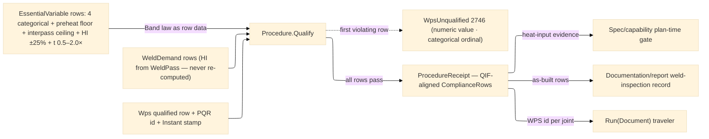

# [RASM_FABRICATION_WELD_PROCEDURE]

The qualification owner: `Procedure` the static surface whose ONE `Qualify` fold gates every demanded weld against a qualified WPS — the `EssentialVariable` axis MINTS HERE (the fault registry's `WpsUnqualified` 2746 payload vocabulary) as the closed row set of variables whose change voids qualification, each row carrying its RANGE LAW as constructor data: categorical rows (process, filler, shielding, position) demand an exact qualified match, band rows scale the qualified value by published factors — heat input ±25 % and thickness 0.5×–2.0× per the ISO 15614-1 qualification-range rules, preheat a one-sided floor, interpass a one-sided ceiling. A demanded weld outside ANY essential range routes `WpsUnqualified(variable, value)` typed with the first violating row; numeric failures carry the demanded value, categorical failures carry the row ordinal because `ComplianceRow.Categorical` carries the demanded and qualified string values; a qualified demand emits the QIF-aligned `ComplianceRow` receipt set — numeric demanded/band values or categorical demanded/qualified strings, verdict per variable — the characteristic-actual-nominal shape the measurement-results model downstream consumes.

Two seams leave this page as TYPE contracts: the heat-input compliance verdict feeds the `Spec/capability` plan-time gate, and the full receipt set feeds the `Documentation/report` as-built record (landing concurrently — the FAI/weld-inspection model composes these rows beside measured features; rendering stays the artifacts plane's). The demand rows project straight off the landed `Joining/weld` pass set (`WeldPass.HeatInputKjMm` is the realized heat input this gate checks — the HI law is weld.md's, this page never re-computes it) and the `Joining/sequence` interpass ceiling; the WPS/PQR identity rows stamp `NodaTime` `Instant` qualification dates.

Wire posture: HOST-LOCAL. `ComplianceRow` receipts cross only the in-process seam to the capability gate and the report model — never a browser or peer wire.

## [01]-[INDEX]

- [01]-[WELD_PROCEDURE]: owns the `EssentialVariable` range-law axis (the 2746 payload vocabulary), the `Wps` qualified-procedure row with its PQR reference, the `WeldDemand` projection, the `ComplianceRow`/`ProcedureReceipt` QIF-aligned receipts, and the ONE `Procedure.Qualify` fold — per-variable range evaluation, first-violation typed fail, compliance evidence emission.

## [02]-[WELD_PROCEDURE]

- Owner: `EssentialVariable` `[SmartEnum<string>]` the closed qualification axis — `process`/`filler-metal`/`shielding-gas`/`position` (categorical), `preheat` (floor), `interpass` (ceiling), `heat-input` (±25 % band), `thickness-range` (0.5×–2.0× band) — each row binding `Categorical`, `LowFactor`, `HighFactor` AND its `[UseDelegateFromConstructor]` `Read` extraction delegate, so both the range LAW and the evaluation BEHAVIOR are row data: a per-variable checker family, a central key switch, and a fallback lane are all unconstructable, and a new row without its delegate breaks the build; `EssentialReading` the two-lane demand/qualification reading union the delegates produce; `Wps` the qualified-procedure row (WPS/PQR ids, the Materials `WeldProcess` row, filler class, shielding, qualified positions, qualified thickness/preheat/interpass/heat-input values, the `Instant` qualification stamp); `WeldDemand` the per-joint demand projection (process, filler, shielding, position, thickness, preheat, interpass, realized heat input); `ComplianceRow` the QIF-aligned typed verdict union (`Numeric` demanded/qualified band or `Categorical` demanded/qualified strings, each with row ordinal and pass); `ProcedureReceipt` the receipt (WPS id, rows, qualified flag, stamp); `Procedure` the static surface owning `Qualify` — the `Band` law and the `Evaluate` judgment live on the row owner.
- Cases: `EssentialVariable` rows 8 — the four categorical rows evaluate key equality against the WPS row (a demanded `gmaw` under a `saw`-qualified WPS fails on `process`); `preheat` passes when `demanded ≥ qualified` (LowFactor 1, no ceiling — hotter preheat never voids); `interpass` passes when `demanded ≤ qualified` (a hotter interpass voids); `heat-input` passes inside `[0.75·q, 1.25·q]`; `thickness-range` inside `[0.5·q, 2.0·q]` — the published ISO 15614-1 factors as constructor data, never inline literals; the demand set absorbs single-joint and whole-plan shapes (`Seq<WeldDemand>`), the receipt carrying one row block per demand.
- Entry: `public static Fin<ProcedureReceipt> Qualify(Seq<WeldDemand> demands, Wps wps, Instant at)` — the ONE gate: every demand evaluates all eight rows; the FIRST failing row routes `FabricationFault.WpsUnqualified(variable, value)` 2746 typed (numeric failures carry the demanded value, categorical failures carry the row ordinal because the receipt row carries demanded/qualified string truth); a fully-passing set emits the receipt with all rows; an empty demand set routes the kernel `GeometryFault.DegenerateInput` (gating nothing is a caller defect, never a vacuous pass).
- Auto: `Qualify` folds `v.Evaluate(ordinal, demand, wps)` per row — the row's `Read` delegate extracts its `EssentialReading`, numeric readings lower through the row's `Band` law, categorical readings carry their equality verdict — under the same `ComplianceRow` union; the demand projection reads `WeldPass.HeatInputKjMm` (weld.md's realized HI — never re-computed) and the schedule's interpass ceiling; `Spec/capability` consumes the heat-input `ComplianceRow` as gate evidence when its plane lands (TYPE seam); `Documentation/report` composes the receipt rows into the as-built weld-inspection record beside its measured features; the traveler renders the WPS id per joint.
- Receipt: `ProcedureReceipt` IS the typed evidence — per-variable `ComplianceRow`s carrying numeric demanded/band values or categorical demanded/qualified strings (the QIF characteristic/nominal/actual shape), the qualified verdict, the `Instant` stamp; no generic compliance ledger, no string-formatted range text.
- Packages: `Joining/weld#WELD_PLAN` (`WeldPass.HeatInputKjMm` — the realized HI, composed), `Joining/sequence#WELD_SEQUENCE` (the interpass ceiling in the demand projection), `Rasm.Materials` `Component/joint#JOINT` (`WeldProcess` — the process axis, composed at the boundary), `Process/faults#FAULT_BAND` (`WpsUnqualified` 2746 — this page mints its `EssentialVariable` payload vocabulary), NodaTime (`Instant` qualification/receipt stamps), `Rasm.Numerics` (`GeometryFault`), Thinktecture.Runtime.Extensions, LanguageExt.Core, BCL inbox.
- Growth: a new essential variable (PWHT hold, electrode diameter, polarity) is one `EssentialVariable` row with its factors — the evaluation fold is closed over the row set and grows by data; a supplementary-essential regime (impact-tested work tightens heat-input latitude) is a factor OVERLAY row pair, never a second axis; a WPS library is `Seq<Wps>` at the caller — selection policy is derivation's routing concern, not this gate's; zero new entrypoints.
- Boundary: this page owns QUALIFICATION and a weld-geometry, HI-formula, or schedule computation here is the owning page's law re-rolled (demands arrive projected; the gate evaluates, never derives); `EssentialVariable` is the ONE variable axis and a parallel checker-class family or a per-variable `bool Check*()` method set is the deleted form — the range law is row data through one evaluation shape; the qualified factors are published constants bound at row construction and an inline `0.75`/`1.25` beside the fold is the named defect; the gate fails TYPED on the first violating variable and a boolean-soup receipt with no failing row named is the deleted form; the process axis is Materials' `WeldProcess` and a local process enum is the re-mint this folder forbids.

```csharp signature
// --- [RUNTIME_PRELUDE] ----------------------------------------------------------------------------------------------------------------------------
using LanguageExt;
using LanguageExt.Common;
using NodaTime;
using Rasm.Fabrication.Process;
using Rasm.Materials.Component;
using Rasm.Numerics;
using Thinktecture;
using static LanguageExt.Prelude;

namespace Rasm.Fabrication.Joining;

// --- [TYPES] --------------------------------------------------------------------------------------------------------------------------------------
// The per-row demand/qualification reading — what a row EXTRACTS from the demand and the WPS; the row's Band law
// then judges it. One union, two lanes; a reading never carries a verdict for numeric lanes.
[Union(ConversionFromValue = ConversionOperatorsGeneration.None)]
public abstract partial record EssentialReading {
    private EssentialReading() { }

    public sealed record Numeric(double Demanded, double Qualified) : EssentialReading;
    public sealed record Categorical(string Demanded, string Qualified, bool Pass) : EssentialReading;
}

// Each row OWNS its evaluation behavior: the Read delegate extracts the row's reading from (demand, WPS) and the
// Band columns judge it — a new essential variable is one row WITH its delegate, and the build breaks until the
// delegate lands. No central key switch, no fallback lane exists.
[SmartEnum<string>]
public sealed partial class EssentialVariable {
    public static readonly EssentialVariable Process = new("process", categorical: true, lowFactor: 1.0, highFactor: 1.0,
        static (d, wps) => new EssentialReading.Categorical(d.Process.ToString(), wps.Process.ToString(), d.Process == wps.Process));
    public static readonly EssentialVariable FillerMetal = new("filler-metal", categorical: true, lowFactor: 1.0, highFactor: 1.0,
        static (d, wps) => new EssentialReading.Categorical(d.FillerClass, wps.FillerClass, string.Equals(d.FillerClass, wps.FillerClass, StringComparison.Ordinal)));
    public static readonly EssentialVariable ShieldingGas = new("shielding-gas", categorical: true, lowFactor: 1.0, highFactor: 1.0,
        static (d, wps) => new EssentialReading.Categorical(d.ShieldingGas, wps.ShieldingGas, string.Equals(d.ShieldingGas, wps.ShieldingGas, StringComparison.Ordinal)));
    public static readonly EssentialVariable Position = new("position", categorical: true, lowFactor: 1.0, highFactor: 1.0,
        static (d, wps) => new EssentialReading.Categorical(d.Position, string.Join("|", wps.Positions), wps.Positions.Contains(d.Position)));
    public static readonly EssentialVariable Preheat = new("preheat", categorical: false, lowFactor: 1.0, highFactor: double.MaxValue,
        static (d, wps) => new EssentialReading.Numeric(d.PreheatC, wps.PreheatMinC));
    public static readonly EssentialVariable Interpass = new("interpass", categorical: false, lowFactor: 0.0, highFactor: 1.0,
        static (d, wps) => new EssentialReading.Numeric(d.InterpassC, wps.InterpassMaxC));
    public static readonly EssentialVariable HeatInput = new("heat-input", categorical: false, lowFactor: 0.75, highFactor: 1.25,
        static (d, wps) => new EssentialReading.Numeric(d.HeatInputKjMm, wps.HeatInputKjMm));
    public static readonly EssentialVariable ThicknessRange = new("thickness-range", categorical: false, lowFactor: 0.5, highFactor: 2.0,
        static (d, wps) => new EssentialReading.Numeric(d.ThicknessMm, wps.QualifiedThicknessMm));

    public bool Categorical { get; }
    public double LowFactor { get; }
    public double HighFactor { get; }

    [UseDelegateFromConstructor]
    public partial EssentialReading Read(WeldDemand demand, Wps wps);

    public (double Low, double High) Band(double qualified) =>
        Categorical ? (1.0, 1.0) : (LowFactor * qualified, HighFactor >= double.MaxValue ? double.MaxValue : HighFactor * qualified);

    // Row-owned judgment: the reading lowers through the row's own Band law into the compliance evidence.
    public ComplianceRow Evaluate(int ordinal, WeldDemand demand, Wps wps) =>
        Read(demand, wps).Switch(
            numeric: n => {
                (double low, double high) = Band(n.Qualified);
                return (ComplianceRow)new ComplianceRow.Numeric(ordinal, this, n.Demanded, low, high, Pass: n.Demanded >= low && n.Demanded <= high);
            },
            categorical: c => (ComplianceRow)new ComplianceRow.Categorical(ordinal, this, c.Demanded, c.Qualified, c.Pass));
}

// --- [MODELS] -------------------------------------------------------------------------------------------------------------------------------------
public sealed record Wps(
    string WpsId, string PqrId, WeldProcess Process, string FillerClass, string ShieldingGas, Set<string> Positions,
    double QualifiedThicknessMm, double PreheatMinC, double InterpassMaxC, double HeatInputKjMm, Instant QualifiedOn);

public sealed record WeldDemand(
    int Joint, WeldProcess Process, string FillerClass, string ShieldingGas, string Position,
    double ThicknessMm, double PreheatC, double InterpassC, double HeatInputKjMm);

[Union]
public abstract partial record ComplianceRow {
    private ComplianceRow() { }

    public sealed record Numeric(int Ordinal, EssentialVariable Variable, double Demanded, double QualifiedLow, double QualifiedHigh, bool Pass)
        : ComplianceRow;

    public sealed record Categorical(int Ordinal, EssentialVariable Variable, string Demanded, string Qualified, bool Pass)
        : ComplianceRow;

    public bool Passed =>
        this.Switch(numeric: static row => row.Pass, categorical: static row => row.Pass);

    public double FaultValue =>
        this.Switch(numeric: static row => row.Demanded, categorical: static row => row.Ordinal);
}

public sealed record ProcedureReceipt(string WpsId, Seq<ComplianceRow> Rows, bool Qualified, Instant At);

// --- [OPERATIONS] ---------------------------------------------------------------------------------------------------------------------------------
public static class Procedure {
    public static Fin<ProcedureReceipt> Qualify(Seq<WeldDemand> demands, Wps wps, Instant at) {
        if (demands.IsEmpty)
            return Fin.Fail<ProcedureReceipt>(GeometryFault.DegenerateInput("weld-procedure:empty-demand").ToError());
        Seq<ComplianceRow> rows = default;
        int ordinal = 0;
        foreach (WeldDemand d in demands)
            foreach (EssentialVariable v in EssentialVariable.Items) {
                ComplianceRow row = v.Evaluate(ordinal++, d, wps);
                if (!row.Passed)
                    return Fin.Fail<ProcedureReceipt>(FabricationFault.WpsUnqualified(v, row.FaultValue).ToError());
                rows = rows.Add(row);
            }
        return Fin.Succ(new ProcedureReceipt(wps.WpsId, rows, Qualified: true, at));
    }
}
```


