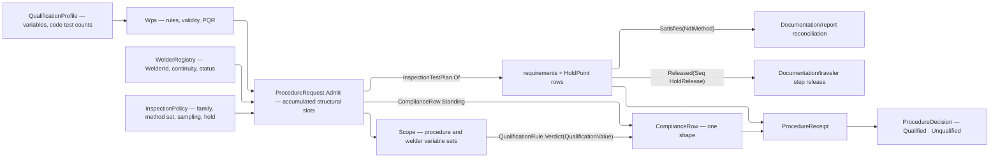

# [RASM_FABRICATION_WELD_PROCEDURE]

`Procedure.Assess` evaluates one admitted procedure request against code-profiled WPS/PQR rules, assigned-welder ranges, validity and continuity intervals, and inspection-scope policy. Essential variables are profile data over family, modality, and dimension parameters; `VariableKey` is the correspondence key every rule and demand map carries, so a variable resolves by identity rather than by whole-row structure.

Modality is ONE axis, not five parallel families. `VariableModality` names it, `QualificationValue` carries the demanded reading, `QualificationRule` carries the admitted range, and `ComplianceRow` is one record pairing them with its verdict — the intermediate `Qualification` union, the per-modality compliance case family, and the shadow sampling enum all delete, so a fifth modality is one row on each of three vocabularies rather than one case on each of five.

Qualification mismatch is a decision, never an admission failure: welder status, continuity, WPS validity, and every range comparison land as `ComplianceRow` evidence, while admission owns only structural well-formedness. Welder standing decomposes into ordinary rows — a temporal row against the continuity interval and a boolean row against the status admission — so no case exists for it.

`NdtMethod` seats HERE beside `InspectionFamily`, so the demand grain and the performed grain meet at one owner: an `InspectionRequirement` demands a FAMILY and admits the method set that discharges it, and radiographic examination satisfies a volumetric demand without a documentation-plane vocabulary reaching back into planning. `InspectionTestPlan` carries those requirements beside their `HoldPoint` rows, and `HoldPoint` release attestations are what a traveler step consumes — never rendered text.

## [01]-[INDEX]

- [02]-[QUALIFICATION_PROFILE]: the modality triple, variable generation, dimensional correspondence, WPS/PQR evidence, welder continuity, and the typed identities that carry personal classification.
- [03]-[INSPECTION_PLAN]: `InspectionFamily`, `NdtMethod`, the sampling axis, inspection rules, hold points, and the admitted test plan.
- [04]-[ASSESSMENT_FOLD]: accumulated pairing, total qualification evaluation, plan derivation, receipt diff, and decision projection.

## [02]-[QUALIFICATION_PROFILE]

- Owner: `QualificationProfile` owns procedure and personnel test sets with the governing-code variable registry; `EssentialVariable` carries key, family, modality, admitted quantity dimension, source scopes, essentiality, and parameterized applicability as one admitted value; `VariableRequirement` distinguishes evidence-bearing and nonessential variables; `ApplicabilityLaw` carries conditional essentiality; `PqrEvidence` owns specimen-specific procedure tests; `WelderRegistry` resolves assigned `WelderQualification` ranges, test evidence, status, and activity-derived continuity.
- Cases: `QualificationValue` distinguishes the four modal readings, context exclusion, and permitted nonessential omission; `QualificationRule` distinguishes the four modal ranges under one optional wrapper.
- Law: the modality triple is TOTAL by construction. `QualificationRule.Verdict(QualificationValue)` is the one pairing over both families — a value whose modality the rule does not carry answers `None`, and admission has already proved modality and dimension agreement, so assessment carries no rule-shape fallback arm and no intermediate union between the two dispatches.
- Law: `TestKind` carries what a test IS — whether it consumes the specimen — and the profile carries how many specimens the CODE demands, so a governing edition that raises the bend-specimen count is one profile row rather than a frozen column every other code then inherits.
- Law: personal identity travels TYPED. `WelderId` is the one carrier and every property holding it declares `[PersonalData]` from `Process/telemetry#CLASSIFICATION`, so a welder identity redacts at every log and export seam while WPS/PQR artifacts keep their attested content and no untyped copy escapes the classification.
- Law: a quantity variable carries its `QuantityInfo`, and admission proves demand, range low, and range high share it, so evaluation compares scalars that are already dimensionally paired.
- Entry: `Procedure.Assess` accepts only `ProcedureRequest`; `Wps`, `WeldDemand`, assignments, inspection context, and assessment time enter through that generated aggregate gate, whose clauses accumulate through `AdmissionSlots` so a malformed request reports every structural defect it holds.
- Packages: Thinktecture.Runtime.Extensions owns admitted values and closed dispatch; UnitsNet owns physical dimensions and registry identity; NodaTime owns validity; LanguageExt.Core owns accumulated assessment; Generator.Equals owns ordered receipt equality and member diffs.
- Growth: governing-code breadth is profile data, so one variable row or inspection rule extends a regime without a checker method, named field, or new public surface.
- Boundary: every qualification verdict — expired continuity, suspended status, out-of-range value — remains a domain decision; only missing, duplicate, dimensionally incompatible, or malformed evidence fails request admission.

```csharp signature
// --- [RUNTIME_PRELUDE] ----------------------------------------------------------------------------------------------------------------------------
using System.Globalization;
using System.Linq;
using System.Runtime.InteropServices;
using Generator.Equals;
using LanguageExt;
using LanguageExt.Common;
using LanguageExt.Traits;
using NodaTime;
using Rasm.Element.Projection;
using Rasm.Fabrication.Fixturing;
using Rasm.Fabrication.Process;
using Thinktecture;
using UnitsNet;
using static LanguageExt.Prelude;

namespace Rasm.Fabrication.Joining;

// --- [TYPES] --------------------------------------------------------------------------------------------------------------------------------------
[SmartEnum<string>]
public sealed partial class VariableFamily {
    public static readonly VariableFamily Validity = new("validity");
    public static readonly VariableFamily Process = new("process");
    public static readonly VariableFamily Joint = new("joint");
    public static readonly VariableFamily Consumable = new("consumable");
    public static readonly VariableFamily Position = new("position");
    public static readonly VariableFamily Electrical = new("electrical");
    public static readonly VariableFamily Material = new("material");
    public static readonly VariableFamily Dimension = new("dimension");
    public static readonly VariableFamily Thermal = new("thermal");
    public static readonly VariableFamily Technique = new("technique");
    public static readonly VariableFamily Inspection = new("inspection");
    public static readonly VariableFamily Personnel = new("personnel");
}

[SmartEnum<string>]
public sealed partial class VariableModality {
    public static readonly VariableModality Quantity = new("quantity");
    public static readonly VariableModality Categorical = new("categorical");
    public static readonly VariableModality Boolean = new("boolean");
    public static readonly VariableModality Temporal = new("temporal");
}

[ValueObject<string>(KeyMemberName = "Value", KeyMemberAccessModifier = AccessModifier.Public)]
[ValidationError<FabricationFault>]
public readonly partial struct VariableKey {
    [BoundaryAdapter]
    static partial void ValidateFactoryArguments(ref FabricationFault? validationError, ref string value) {
        value = value.Trim();
        if (!Witness.Keyed(value))
            validationError = new FabricationFault.PolicyInadmissible(FabConcern.Joining, "variable-key");
    }
}

// Welder identity is the package's one personal datum on this plane. Every property carrying it declares the
// classification, so redaction is structural rather than a habit each new carrier has to remember.
[ValueObject<string>(KeyMemberName = "Value", KeyMemberAccessModifier = AccessModifier.Public)]
[ValidationError<FabricationFault>]
public readonly partial struct WelderId {
    [BoundaryAdapter]
    static partial void ValidateFactoryArguments(ref FabricationFault? validationError, ref string value) {
        value = value.Trim();
        if (!Witness.Keyed(value))
            validationError = new FabricationFault.PolicyInadmissible(FabConcern.Joining, "welder-id");
    }
}

[ValueObject<string>(KeyMemberName = "Value", KeyMemberAccessModifier = AccessModifier.Public)]
[ValidationError<FabricationFault>]
public readonly partial struct WpsId {
    [BoundaryAdapter]
    static partial void ValidateFactoryArguments(ref FabricationFault? validationError, ref string value) {
        value = value.Trim();
        if (!Witness.Keyed(value))
            validationError = new FabricationFault.PolicyInadmissible(FabConcern.Joining, "wps-id");
    }
}

[ValueObject<string>(KeyMemberName = "Value", KeyMemberAccessModifier = AccessModifier.Public)]
[ValidationError<FabricationFault>]
public readonly partial struct PqrId {
    [BoundaryAdapter]
    static partial void ValidateFactoryArguments(ref FabricationFault? validationError, ref string value) {
        value = value.Trim();
        if (!Witness.Keyed(value))
            validationError = new FabricationFault.PolicyInadmissible(FabConcern.Joining, "pqr-id");
    }
}

[SmartEnum<string>]
public sealed partial class ApplicabilityMode {
    public static readonly ApplicabilityMode All = new("all", static (tokens, context) => tokens.ForAll(context.Contains));
    public static readonly ApplicabilityMode Any = new("any", static (tokens, context) => tokens.Exists(context.Contains));
    public static readonly ApplicabilityMode None = new("none", static (tokens, context) => !tokens.Exists(context.Contains));

    [UseDelegateFromConstructor]
    public partial bool Matches(Set<string> tokens, Set<string> context);
}

[SmartEnum<string>]
public sealed partial class VariableRequirement {
    public static readonly VariableRequirement Essential = new("essential", evidenceRequired: true);
    public static readonly VariableRequirement Nonessential = new("nonessential", evidenceRequired: false);

    public bool EvidenceRequired { get; }
}

// A test is DESTRUCTIVE or not; how many specimens a code demands is that code's own profile row, because two
// editions of one code disagree on the count while agreeing on the nature of the test.
[SmartEnum<string>]
public sealed partial class TestKind {
    public static readonly TestKind Tensile = new("tensile", destructive: true);
    public static readonly TestKind GuidedBend = new("guided-bend", destructive: true);
    public static readonly TestKind Impact = new("impact", destructive: true);
    public static readonly TestKind Macro = new("macro", destructive: true);
    public static readonly TestKind Hardness = new("hardness", destructive: false);
    public static readonly TestKind Nondestructive = new("nondestructive", destructive: false);

    public bool Destructive { get; }
}

[SmartEnum<string>]
public sealed partial class QualificationSource {
    public static readonly QualificationSource Procedure = new("procedure");
    public static readonly QualificationSource Welder = new("welder");
}

[SmartEnum<string>]
public sealed partial class QualificationStatus {
    public static readonly QualificationStatus Active = new("active", admits: true, recoverable: true);
    public static readonly QualificationStatus Suspended = new("suspended", admits: false, recoverable: true);
    public static readonly QualificationStatus Revoked = new("revoked", admits: false, recoverable: false);

    public bool Admits { get; }
    public bool Recoverable { get; }
}

// --- [MODELS] -------------------------------------------------------------------------------------------------------------------------------------
[ComplexValueObject]
[ValidationError<FabricationFault>]
public sealed partial class ApplicabilityLaw {
    public ApplicabilityMode Mode { get; }
    public Set<string> Tokens { get; }

    [BoundaryAdapter]
    static partial void ValidateFactoryArguments(
        ref FabricationFault? validationError,
        ref ApplicabilityMode mode,
        ref Set<string> tokens) {
        if (tokens.IsEmpty || tokens.Exists(token => !Witness.Keyed(token)))
            validationError = new FabricationFault.PolicyInadmissible(FabConcern.Joining, "applicability-law");
    }

    public bool Matches(Set<string> context) => Mode.Matches(Tokens, context);
}

[ComplexValueObject]
[ValidationError<FabricationFault>]
public sealed partial class EssentialVariable {
    public VariableKey Key { get; }
    public VariableFamily Family { get; }
    public VariableModality Modality { get; }
    public Option<QuantityInfo> Quantity { get; }
    public Set<QualificationSource> Sources { get; }
    public VariableRequirement Requirement { get; }
    public Option<ApplicabilityLaw> Applicability { get; }

    [BoundaryAdapter]
    static partial void ValidateFactoryArguments(
        ref FabricationFault? validationError,
        ref VariableKey key,
        ref VariableFamily family,
        ref VariableModality modality,
        ref Option<QuantityInfo> quantity,
        ref Set<QualificationSource> sources,
        ref VariableRequirement requirement,
        ref Option<ApplicabilityLaw> applicability) {
        if (sources.IsEmpty || quantity.IsSome != (modality == VariableModality.Quantity))
            validationError = new FabricationFault.PolicyInadmissible(FabConcern.Joining, "essential-variable");
    }

    public static Fin<EssentialVariable> Admit(
        VariableKey key,
        VariableFamily family,
        VariableModality modality,
        Option<QuantityInfo> quantity,
        Set<QualificationSource> sources,
        VariableRequirement requirement,
        Option<ApplicabilityLaw> applicability) =>
        Validate(key, family, modality, quantity, sources, requirement, applicability, out EssentialVariable variable)
            .Admitted(variable);
}

[Union(ConversionFromValue = ConversionOperatorsGeneration.None)]
public abstract partial record QualificationValue {
    private QualificationValue() { }

    public sealed record Quantity(IQuantity Value) : QualificationValue;
    public sealed record Categorical(string Value) : QualificationValue;
    public sealed record Boolean(bool Value) : QualificationValue;
    public sealed record Temporal(Instant Value) : QualificationValue;
    public sealed record ContextExcluded : QualificationValue;
    public sealed record EvidenceOmitted : QualificationValue;

    public Option<VariableModality> Modality => Switch(
        quantity: static _ => Some(VariableModality.Quantity),
        categorical: static _ => Some(VariableModality.Categorical),
        boolean: static _ => Some(VariableModality.Boolean),
        temporal: static _ => Some(VariableModality.Temporal),
        contextExcluded: static _ => Option<VariableModality>.None,
        evidenceOmitted: static _ => Option<VariableModality>.None);

    public bool Valid => Switch(
        quantity: static value => value.Value is not null,
        categorical: static value => Witness.Keyed(value.Value),
        boolean: static _ => true,
        temporal: static _ => true,
        contextExcluded: static _ => true,
        evidenceOmitted: static _ => true);

    // The scalar and the text the compliance row carries as its fault evidence. Every modality answers both, so the
    // row shape holds no per-case column and a fault reads one pair regardless of which reading produced it.
    public (double Scalar, string Evidence) Witnessed => Switch(
        quantity: static value => ((double)value.Value.Value, value.Value.ToString(CultureInfo.InvariantCulture)),
        categorical: static value => (0.0, value.Value),
        boolean: static value => (value.Value ? 1.0 : 0.0, value.Value.ToString(CultureInfo.InvariantCulture)),
        temporal: static value => (value.Value.ToUnixTimeTicks(), value.Value.ToString()),
        contextExcluded: static _ => (0.0, nameof(ContextExcluded)),
        evidenceOmitted: static _ => (0.0, nameof(EvidenceOmitted)));
}

[Union(ConversionFromValue = ConversionOperatorsGeneration.None)]
public abstract partial record QualificationRule {
    private QualificationRule() { }

    public sealed record QuantityRange(IQuantity Low, IQuantity High) : QualificationRule;
    public sealed record CategoricalSet(Set<string> Admitted) : QualificationRule;
    public sealed record Boolean(bool Required) : QualificationRule;
    public sealed record ActiveInterval(Interval Interval) : QualificationRule;
    public sealed record Optional(QualificationRule Present) : QualificationRule;

    public VariableModality Modality => Switch(
        quantityRange: static _ => VariableModality.Quantity,
        categoricalSet: static _ => VariableModality.Categorical,
        boolean: static _ => VariableModality.Boolean,
        activeInterval: static _ => VariableModality.Temporal,
        optional: static value => value.Present.Modality);

    public QualificationRule Required => this is Optional optional ? optional.Present : this;

    // THE pairing. One total dispatch over the rule family, each arm reading the value shape its own modality
    // admits: a value the rule cannot describe answers None, which is exactly the modality mismatch admission
    // already excluded, so no intermediate carrier exists between deciding and recording the verdict.
    public Option<bool> Verdict(QualificationValue demanded) => demanded is QualificationValue.ContextExcluded
            or QualificationValue.EvidenceOmitted
        ? Some(true)
        : Required.Switch(
            state: demanded,
            quantityRange: static (value, rule) => value is QualificationValue.Quantity held
                ? Some(held.Value.As(rule.Low.Unit) >= (double)rule.Low.Value
                    && held.Value.As(rule.High.Unit) <= (double)rule.High.Value)
                : Option<bool>.None,
            categoricalSet: static (value, rule) => value is QualificationValue.Categorical held
                ? Some(rule.Admitted.Contains(held.Value))
                : Option<bool>.None,
            boolean: static (value, rule) => value is QualificationValue.Boolean held
                ? Some(held.Value == rule.Required)
                : Option<bool>.None,
            activeInterval: static (value, rule) => value is QualificationValue.Temporal held
                ? Some(rule.Interval.Contains(held.Value))
                : Option<bool>.None,
            optional: static (_, _) => Option<bool>.None);

    public bool Accepts(EssentialVariable variable) =>
        variable.Modality == Modality && Switch(
            state: variable,
            quantityRange: static (row, value) => row.Quantity.Exists(info =>
                info == value.Low.QuantityInfo && info == value.High.QuantityInfo),
            categoricalSet: static (_, _) => true,
            boolean: static (_, _) => true,
            activeInterval: static (_, _) => true,
            optional: static (row, value) => value.Present.Accepts(row));

    public bool Valid => Switch(
        quantityRange: static value => value.Low is not null && value.High is not null
            && value.Low.QuantityInfo == value.High.QuantityInfo
            && value.Low.As(value.High.Unit) <= (double)value.High.Value,
        categoricalSet: static value => !value.Admitted.IsEmpty && value.Admitted.ForAll(Witness.Keyed),
        boolean: static _ => true,
        activeInterval: static value => value.Interval.HasStart && value.Interval.HasEnd
            && value.Interval.Start < value.Interval.End,
        optional: static value => value.Present is not Optional && value.Present.Valid);
}

// ONE compliance row. Verdict, variable identity, fault subject, scalar, and invariant evidence live on the single
// declaration, and the demanded reading beside the admitted range is the whole payload — a per-modality case family
// restated those six columns five times and grew a seventh case for welder standing that decomposes into two rows.
public sealed record ComplianceRow(
    int Joint,
    QualificationSource Source,
    Option<VariableKey> Subject,
    QualificationValue Demanded,
    QualificationRule Required,
    bool Passed,
    FaultSubject.Qualification Fault) {
    public double FaultScalar => Demanded.Witnessed.Scalar;

    public string FaultEvidence => Demanded.Witnessed.Evidence;

    public static Option<ComplianceRow> Of(
        int joint,
        QualificationSource source,
        EssentialVariable variable,
        QualificationValue demanded,
        QualificationRule required) =>
        required.Verdict(demanded).Map(passed => new ComplianceRow(
            joint, source, Some(variable.Key), demanded, required, passed,
            new FaultSubject.Qualification(variable.Key.Value)));

    // Welder standing is TWO ordinary rows against the same shape every variable answers to: the continuity window
    // is a temporal range and the status admission a boolean one, so no case, no shadow column, no seventh arm.
    public static Seq<ComplianceRow> Standing(int joint, WelderQualification welder, Instant at) {
        QualificationRule window = new QualificationRule.ActiveInterval(welder.Continuity);
        QualificationRule admits = new QualificationRule.Boolean(true);
        FaultSubject.Qualification subject = new(welder.Welder.Value);
        return Seq(
            new ComplianceRow(joint, QualificationSource.Welder, Option<VariableKey>.None,
                new QualificationValue.Temporal(at), window,
                window.Verdict(new QualificationValue.Temporal(at)).IfNone(false), subject),
            new ComplianceRow(joint, QualificationSource.Welder, Option<VariableKey>.None,
                new QualificationValue.Boolean(welder.Status.Admits), admits,
                welder.Status.Admits, subject));
    }
}

[Union(ConversionFromValue = ConversionOperatorsGeneration.None)]
public abstract partial record QualificationTest {
    private QualificationTest() { }

    public sealed record Quantity(
        TestKind Test,
        string Specimen,
        IQuantity Result,
        Option<IQuantity> Minimum,
        Option<IQuantity> Maximum) : QualificationTest;
    public sealed record Bend(string Specimen, Length Discontinuity, Length Limit) : QualificationTest;
    public sealed record Examination(TestKind Test, string Specimen, NdtMethod Method, string Acceptance, bool Passed) : QualificationTest;

    public TestKind Kind => Switch(
        quantity: static value => value.Test,
        bend: static _ => TestKind.GuidedBend,
        examination: static value => value.Test);

    public string Specimen => Switch(
        quantity: static value => value.Specimen,
        bend: static value => value.Specimen,
        examination: static value => value.Specimen);

    public bool Passed => Switch(
        quantity: static value => value.Minimum.ForAll(minimum => value.Result.As(minimum.Unit) >= (double)minimum.Value)
            && value.Maximum.ForAll(maximum => value.Result.As(maximum.Unit) <= (double)maximum.Value),
        bend: static value => value.Discontinuity <= value.Limit,
        examination: static value => value.Passed);

    public bool Valid => Switch(
        quantity: static value => Witness.Keyed(value.Specimen) && value.Result is not null
            && (value.Minimum.IsSome || value.Maximum.IsSome)
            && value.Minimum.ForAll(minimum => minimum.QuantityInfo == value.Result.QuantityInfo)
            && value.Maximum.ForAll(maximum => maximum.QuantityInfo == value.Result.QuantityInfo)
            && value.Minimum.ForAll(minimum => value.Maximum.ForAll(maximum =>
                minimum.As(maximum.Unit) <= (double)maximum.Value)),
        bend: static value => Witness.Keyed(value.Specimen)
            && value.Discontinuity >= Length.Zero && value.Limit >= Length.Zero,
        examination: static value => Witness.Keyed(value.Specimen) && Witness.Keyed(value.Acceptance));
}

[ComplexValueObject]
[ValidationError<FabricationFault>]
public sealed partial class QualificationProfile {
    public string Code { get; }
    public string Edition { get; }
    public ProcessKind Process { get; }
    public Seq<EssentialVariable> Variables { get; }

    // Specimen counts are CODE data: the row names the test and the count that edition demands of it.
    public Map<TestKind, int> RequiredProcedureTests { get; }
    public Map<TestKind, int> RequiredPersonnelTests { get; }

    [BoundaryAdapter]
    static partial void ValidateFactoryArguments(
        ref FabricationFault? validationError,
        ref string code,
        ref string edition,
        ref ProcessKind process,
        ref Seq<EssentialVariable> variables,
        ref Map<TestKind, int> requiredProcedureTests,
        ref Map<TestKind, int> requiredPersonnelTests) {
        Seq<EssentialVariable> validity = variables.Filter(static variable => variable.Family == VariableFamily.Validity);
        if (!Witness.Keyed(code) || !Witness.Keyed(edition)
            || process.Modality.Class != ModalityClass.Joined
            || variables.IsEmpty
            || variables.Map(static variable => variable.Key).Distinct().Count != variables.Count
            || validity.Count != 1
            || validity.Exists(static variable => variable.Modality != VariableModality.Temporal
                || !variable.Requirement.EvidenceRequired
                || !variable.Sources.Contains(QualificationSource.Procedure)
                || !variable.Sources.Contains(QualificationSource.Welder))
            || requiredProcedureTests.IsEmpty || requiredPersonnelTests.IsEmpty
            || requiredProcedureTests.Values.Exists(static count => count < 1)
            || requiredPersonnelTests.Values.Exists(static count => count < 1))
            validationError = new FabricationFault.PolicyInadmissible(FabConcern.Joining, "qualification-profile");
    }

    public static Fin<QualificationProfile> Admit(
        string code,
        string edition,
        ProcessKind process,
        Seq<EssentialVariable> variables,
        Map<TestKind, int> requiredProcedureTests,
        Map<TestKind, int> requiredPersonnelTests) =>
        Validate(code, edition, process, variables, requiredProcedureTests, requiredPersonnelTests,
            out QualificationProfile profile).Admitted(profile);

    public static bool Covers(Map<TestKind, int> demanded, Seq<QualificationTest> tests) =>
        demanded.ForAll(row => tests.Count(test => test.Kind == row.Key) >= row.Value);
}

[ComplexValueObject]
[ValidationError<FabricationFault>]
public sealed partial class PqrEvidence {
    public PqrId Id { get; }
    public string Coupon { get; }
    public Instant QualifiedAt { get; }
    public Seq<QualificationTest> Tests { get; }

    [BoundaryAdapter]
    static partial void ValidateFactoryArguments(
        ref FabricationFault? validationError,
        ref PqrId id,
        ref string coupon,
        ref Instant qualifiedAt,
        ref Seq<QualificationTest> tests) {
        if (!Witness.Keyed(coupon) || tests.IsEmpty
            || tests.Exists(static test => !test.Valid || !test.Passed)
            || tests.Map(static test => (test.Kind, test.Specimen)).Distinct().Count != tests.Count)
            validationError = new FabricationFault.PolicyInadmissible(FabConcern.Joining, "pqr-evidence");
    }

    public static Fin<PqrEvidence> Admit(PqrId id, string coupon, Instant qualifiedAt, Seq<QualificationTest> tests) =>
        Validate(id, coupon, qualifiedAt, tests, out PqrEvidence evidence).Admitted(evidence);
}

[ComplexValueObject]
[ValidationError<FabricationFault>]
public sealed partial class Wps {
    public WpsId Id { get; }
    public int Revision { get; }
    public Interval Validity { get; }
    public QualificationProfile Profile { get; }
    public PqrEvidence Pqr { get; }
    public Map<VariableKey, QualificationRule> Rules { get; }

    [BoundaryAdapter]
    static partial void ValidateFactoryArguments(
        ref FabricationFault? validationError,
        ref WpsId id,
        ref int revision,
        ref Interval validity,
        ref QualificationProfile profile,
        ref PqrEvidence pqr,
        ref Map<VariableKey, QualificationRule> rules) {
        if (revision <= 0 || !validity.HasStart || !validity.HasEnd || validity.Start >= validity.End
            || pqr.QualifiedAt > validity.Start
            || !QualificationProfile.Covers(profile.RequiredProcedureTests, pqr.Tests)
            || profile.Variables.Exists(variable => Scoped(variable, QualificationSource.Procedure)
                && !rules.Find(variable.Key).Exists(rule => rule.Valid && rule.Accepts(variable)))
            || rules.Keys.Exists(key => !profile.Variables.Exists(variable =>
                variable.Key == key && Scoped(variable, QualificationSource.Procedure))))
            validationError = new FabricationFault.PolicyInadmissible(FabConcern.Joining, "wps");
    }

    public static Fin<Wps> Admit(
        WpsId id,
        int revision,
        Interval validity,
        QualificationProfile profile,
        PqrEvidence pqr,
        Map<VariableKey, QualificationRule> rules) =>
        Validate(id, revision, validity, profile, pqr, rules, out Wps wps).Admitted(wps);

    // Validity is the profile's own variable and rides the WPS interval, never a rule map row, so a rule-map census
    // reads one scope predicate rather than a per-site family exclusion.
    internal static bool Scoped(EssentialVariable variable, QualificationSource source) =>
        variable.Family != VariableFamily.Validity && variable.Sources.Contains(source);
}

[ComplexValueObject]
[ValidationError<FabricationFault>]
public sealed partial class WelderQualification {
    [PersonalData]
    public WelderId Welder { get; }

    public string Record { get; }
    public Instant QualifiedAt { get; }
    public Instant LastActivity { get; }
    public NodaTime.Duration ContinuityPeriod { get; }
    public QualificationStatus Status { get; }
    public Map<VariableKey, QualificationRule> Rules { get; }
    public Seq<QualificationTest> Tests { get; }

    [BoundaryAdapter]
    static partial void ValidateFactoryArguments(
        ref FabricationFault? validationError,
        ref WelderId welder,
        ref string record,
        ref Instant qualifiedAt,
        ref Instant lastActivity,
        ref NodaTime.Duration continuityPeriod,
        ref QualificationStatus status,
        ref Map<VariableKey, QualificationRule> rules,
        ref Seq<QualificationTest> tests) {
        if (!Witness.Keyed(record) || lastActivity < qualifiedAt || continuityPeriod <= NodaTime.Duration.Zero
            || rules.IsEmpty || rules.Values.Exists(static rule => !rule.Valid)
            || tests.IsEmpty || tests.Exists(static test => !test.Valid || !test.Passed)
            || tests.Map(static test => (test.Kind, test.Specimen)).Distinct().Count != tests.Count)
            validationError = new FabricationFault.PolicyInadmissible(FabConcern.Joining, "welder-qualification");
    }

    public static Fin<WelderQualification> Admit(
        WelderId welder,
        string record,
        Instant qualifiedAt,
        Instant lastActivity,
        NodaTime.Duration continuityPeriod,
        QualificationStatus status,
        Map<VariableKey, QualificationRule> rules,
        Seq<QualificationTest> tests) =>
        Validate(welder, record, qualifiedAt, lastActivity, continuityPeriod, status, rules, tests,
            out WelderQualification qualification).Admitted(qualification);

    public Interval Continuity => new(QualifiedAt, LastActivity + ContinuityPeriod);
}

[ComplexValueObject]
[ValidationError<FabricationFault>]
public sealed partial class WelderRegistry {
    public Map<WelderId, WelderQualification> Qualifications { get; }

    [BoundaryAdapter]
    static partial void ValidateFactoryArguments(
        ref FabricationFault? validationError,
        ref Map<WelderId, WelderQualification> qualifications) {
        if (qualifications.IsEmpty
            || qualifications.Exists(static row => row.Value.Welder != row.Key))
            validationError = new FabricationFault.PolicyInadmissible(FabConcern.Joining, "welder-registry");
    }

    public static Fin<WelderRegistry> Admit(Map<WelderId, WelderQualification> qualifications) =>
        Validate(qualifications, out WelderRegistry registry).Admitted(registry);

    public Option<WelderQualification> Find(WelderId welder) => Qualifications.Find(welder);
}
```

## [03]-[INSPECTION_PLAN]

- Owner: `InspectionFamily` owns the demand grain and its hydrogen-delay law; `NdtMethod` owns the performed grain and its own family correspondence; `SamplingKind` owns the one sampling axis both the extent and the rule key on; `InspectionExtent` owns the dimensional population; `InspectionRule` and `InspectionPolicy` own coverage derivation; `HoldKind`, `WitnessParty`, `HoldPoint`, and `HoldRelease` own the hold-point family; `InspectionTestPlan` owns the admitted plan a traveler step releases against.
- Law: family and method are ONE grain seam owned here. A requirement demands a FAMILY and admits the method set that discharges it — absent meaning any method of that family — so radiographic examination satisfies a volumetric demand and a documentation-plane reconciliation reads `InspectionRequirement.Satisfies(NdtMethod)` rather than re-deriving the correspondence from a second vocabulary at a higher stratum.
- Law: hydrogen delay is a DURATION, not a flag. EN 1011-2 delays surface and volumetric examination of hardenable material by a measured interval after the last deposit, and a boolean cannot state it, so the family row carries the interval and a zero interval is the honest reading for a family that imposes none.
- Law: sampling has ONE vocabulary. `SamplingKind` keys the population map and each `InspectionExtent` case declares the row it belongs to, so admission proves key and payload agree and no shadow enum restates the extent family under a second set of names.
- Law: a hold point BLOCKS or WITNESSES by its kind row — a hold stops advance until released, a witness point demands attendance without stopping it, a review point stops advance on a record alone, and surveillance neither stops nor attends. `InspectionTestPlan.Unreleased` is the ONE satisfaction law and it publishes the open hold ROSTER, so `Released` is that roster's verdict and `Documentation/traveler` gates its document on the same read it reports its open-hold count from — one law, never a second predicate on the higher plane.
- Entry: `InspectionTestPlan.Of(policy, demands)` derives requirements and hold points together, so a plan cannot carry a hold point for a requirement it does not hold.
- Growth: a new examination method is one `NdtMethod` row against an existing family; a new demand grain is one `InspectionFamily` row; a new hold modality is one `HoldKind` row.
- Boundary: the plan states WHAT must be examined and WHO must release it; the performed examination, its result, and its attestation are `Documentation/report` evidence composing these rows downward.

```csharp signature
// --- [TYPES] --------------------------------------------------------------------------------------------------------------------------------------
[SmartEnum<string>]
public sealed partial class InspectionFamily {
    public static readonly InspectionFamily Visual = new(
        "visual", subsurface: false, consumesPart: false, hydrogenDelayHours: 0.0);
    public static readonly InspectionFamily Surface = new(
        "surface", subsurface: false, consumesPart: false, hydrogenDelayHours: 16.0);
    public static readonly InspectionFamily Volumetric = new(
        "volumetric", subsurface: true, consumesPart: false, hydrogenDelayHours: 48.0);
    public static readonly InspectionFamily Destructive = new(
        "destructive", subsurface: true, consumesPart: true, hydrogenDelayHours: 0.0);

    private InspectionFamily(string key, bool subsurface, bool consumesPart, double hydrogenDelayHours) : this(key) =>
        (Subsurface, ConsumesPart, HydrogenDelay) =
        (subsurface, consumesPart, NodaTime.Duration.FromHours(hydrogenDelayHours));

    public bool Subsurface { get; }
    public bool ConsumesPart { get; }

    // EN 1011-2 delay between the last deposit and examination of hardenable material. A family imposing none reads
    // zero, which is a measured interval rather than the absent third state a boolean column would have to fake.
    public NodaTime.Duration HydrogenDelay { get; }
}

// The performed grain, seated beside the demand grain it discharges. A documentation-plane reconciliation reads the
// correspondence off THIS row rather than declaring a second vocabulary at a higher stratum.
[SmartEnum<string>]
public sealed partial class NdtMethod {
    public static readonly NdtMethod Visual = new("visual", InspectionFamily.Visual, radiationControls: false);
    public static readonly NdtMethod LiquidPenetrant = new("liquid-penetrant", InspectionFamily.Surface, radiationControls: false);
    public static readonly NdtMethod MagneticParticle = new("magnetic-particle", InspectionFamily.Surface, radiationControls: false);
    public static readonly NdtMethod EddyCurrent = new("eddy-current", InspectionFamily.Surface, radiationControls: false);
    public static readonly NdtMethod Thermography = new("thermography", InspectionFamily.Surface, radiationControls: false);
    public static readonly NdtMethod Ultrasonic = new("ultrasonic", InspectionFamily.Volumetric, radiationControls: false);
    public static readonly NdtMethod PhasedArray = new("phased-array", InspectionFamily.Volumetric, radiationControls: false);
    public static readonly NdtMethod TimeOfFlightDiffraction = new("time-of-flight-diffraction", InspectionFamily.Volumetric, radiationControls: false);
    public static readonly NdtMethod Radiographic = new("radiographic", InspectionFamily.Volumetric, radiationControls: true);
    public static readonly NdtMethod Leak = new("leak", InspectionFamily.Volumetric, radiationControls: false);
    public static readonly NdtMethod AcousticEmission = new("acoustic-emission", InspectionFamily.Volumetric, radiationControls: false);
    public static readonly NdtMethod Macrosection = new("macrosection", InspectionFamily.Destructive, radiationControls: false);
    public static readonly NdtMethod Hardness = new("hardness", InspectionFamily.Destructive, radiationControls: false);
    public static readonly NdtMethod BendTest = new("bend-test", InspectionFamily.Destructive, radiationControls: false);

    private NdtMethod(string key, InspectionFamily family, bool radiationControls) : this(key) =>
        (Family, RadiationControls) = (family, radiationControls);

    public InspectionFamily Family { get; }
    public bool RadiationControls { get; }
    public bool Volumetric => Family.Subsurface;
    public bool SurfaceBreaking => Family == InspectionFamily.Surface;
    public bool Destructive => Family.ConsumesPart;
}

// ONE sampling axis. The extent case declares the row it belongs to, so the population map's key and payload prove
// each other and no second enum restates the family under parallel names.
[SmartEnum<string>]
public sealed partial class SamplingKind {
    public static readonly SamplingKind JointCount = new("joint-count");
    public static readonly SamplingKind WeldLength = new("weld-length");
    public static readonly SamplingKind SurfaceArea = new("surface-area");
    public static readonly SamplingKind Volume = new("volume");
}

[SmartEnum<string>]
public sealed partial class HoldKind {
    public static readonly HoldKind Hold = new("hold", blocksAdvance: true, requiresAttendance: true);
    public static readonly HoldKind Witness = new("witness", blocksAdvance: false, requiresAttendance: true);
    public static readonly HoldKind Review = new("review", blocksAdvance: true, requiresAttendance: false);
    public static readonly HoldKind Surveillance = new("surveillance", blocksAdvance: false, requiresAttendance: false);

    public bool BlocksAdvance { get; }
    public bool RequiresAttendance { get; }
}

[SmartEnum<string>]
public sealed partial class WitnessParty {
    public static readonly WitnessParty Manufacturer = new("manufacturer");
    public static readonly WitnessParty Purchaser = new("purchaser");
    public static readonly WitnessParty ThirdParty = new("third-party");
    public static readonly WitnessParty Regulator = new("regulator");
}

// The identity a hold point ALREADY has: the joint it gates, the family it examines, and the population it samples.
// A composed string key would need an admission that can refuse a value these three discriminants make unforgeable.
public readonly record struct HoldPointKey(int Joint, InspectionFamily Family, SamplingKind Sampling);

// --- [MODELS] -------------------------------------------------------------------------------------------------------------------------------------
[Union(ConversionFromValue = ConversionOperatorsGeneration.None)]
public abstract partial record InspectionExtent(SamplingKind Kind) {
    public sealed record Joints(int Count) : InspectionExtent(SamplingKind.JointCount);
    public sealed record Linear(Length Value) : InspectionExtent(SamplingKind.WeldLength);
    public sealed record Areal(Area Value) : InspectionExtent(SamplingKind.SurfaceArea);
    public sealed record Volumetric(UnitsNet.Volume Value) : InspectionExtent(SamplingKind.Volume);

    public bool Valid => Switch(
        joints: static value => value.Count > 0,
        linear: static value => Witness.Positive(value.Value.Millimeters),
        areal: static value => Witness.Positive(value.Value.SquareMillimeters),
        volumetric: static value => Witness.Positive(value.Value.CubicMillimeters));

    public InspectionExtent Sample(Ratio coverage) => Switch(
        state: coverage.DecimalFractions,
        joints: static (fraction, value) => new Joints(Math.Max(1, (int)Math.Ceiling(value.Count * fraction))),
        linear: static (fraction, value) => new Linear(value.Value * fraction),
        areal: static (fraction, value) => new Areal(value.Value * fraction),
        volumetric: static (fraction, value) => new Volumetric(value.Value * fraction));
}

[ComplexValueObject]
[ValidationError<FabricationFault>]
[StructLayout(LayoutKind.Auto)]
public readonly partial struct InspectionBasis {
    public JoinClass JointClass { get; }
    public string ExecutionClass { get; }
    public string StressCategory { get; }
    public bool FatigueCritical { get; }
    public Length Thickness { get; }
    public Map<SamplingKind, InspectionExtent> Populations { get; }

    [BoundaryAdapter]
    static partial void ValidateFactoryArguments(
        ref FabricationFault? validationError,
        ref JoinClass jointClass,
        ref string executionClass,
        ref string stressCategory,
        ref bool fatigueCritical,
        ref Length thickness,
        ref Map<SamplingKind, InspectionExtent> populations) {
        if (!Witness.Keyed(executionClass) || !Witness.Keyed(stressCategory)
            || !Witness.Positive(thickness.Millimeters)
            || populations.IsEmpty
            || populations.Exists(static row => row.Value.Kind != row.Key || !row.Value.Valid))
            validationError = new FabricationFault.PolicyInadmissible(FabConcern.Joining, "inspection-basis");
    }

    public static Fin<InspectionBasis> Admit(
        JoinClass jointClass,
        string executionClass,
        string stressCategory,
        bool fatigueCritical,
        Length thickness,
        Map<SamplingKind, InspectionExtent> populations) =>
        Validate(jointClass, executionClass, stressCategory, fatigueCritical, thickness, populations,
            out InspectionBasis basis).Admitted(basis);
}

[ComplexValueObject]
[ValidationError<FabricationFault>]
[StructLayout(LayoutKind.Auto)]
public readonly partial struct InspectionRule {
    public string ExecutionClass { get; }
    public Option<JoinClass> JointClass { get; }
    public Option<string> StressCategory { get; }
    public InspectionFamily Family { get; }

    // An absent method set admits every method of the family; a present one narrows the discharge to the listed
    // rows, which is how a code that demands radiography specifically states it without minting a second family.
    public Option<Set<NdtMethod>> Methods { get; }

    public SamplingKind Sampling { get; }
    public Ratio Coverage { get; }
    public string Acceptance { get; }
    public bool FatigueOnly { get; }
    public Length MinimumThickness { get; }
    public Option<HoldKind> Hold { get; }
    public Option<WitnessParty> Party { get; }

    [BoundaryAdapter]
    static partial void ValidateFactoryArguments(
        ref FabricationFault? validationError,
        ref string executionClass,
        ref Option<JoinClass> jointClass,
        ref Option<string> stressCategory,
        ref InspectionFamily family,
        ref Option<Set<NdtMethod>> methods,
        ref SamplingKind sampling,
        ref Ratio coverage,
        ref string acceptance,
        ref bool fatigueOnly,
        ref Length minimumThickness,
        ref Option<HoldKind> hold,
        ref Option<WitnessParty> party) {
        if (!Witness.Keyed(executionClass) || !Witness.Keyed(acceptance)
            || stressCategory.Exists(category => !Witness.Keyed(category))
            || !Witness.Positive(coverage.DecimalFractions) || coverage > Ratio.FromPercent(100)
            || !double.IsFinite(minimumThickness.Millimeters) || minimumThickness < Length.Zero
            || methods.Exists(rows => rows.IsEmpty || rows.Exists(method => method.Family != family))
            || hold.IsSome != party.IsSome)
            validationError = new FabricationFault.PolicyInadmissible(FabConcern.Joining, "inspection-rule");
    }

    public bool Applies(InspectionBasis basis) =>
        ExecutionClass == basis.ExecutionClass
        && JointClass.ForAll(jointClass => jointClass == basis.JointClass)
        && StressCategory.ForAll(category => category == basis.StressCategory)
        && (!FatigueOnly || basis.FatigueCritical)
        && basis.Thickness >= MinimumThickness
        && basis.Populations.ContainsKey(Sampling);

    public Option<InspectionRequirement> Require(int joint, InspectionBasis basis) => Applies(basis)
        ? basis.Populations.Find(Sampling).Map(population => new InspectionRequirement(
            joint, Family, Methods, Sampling, Coverage, population, population.Sample(Coverage), Acceptance, basis))
        : Option<InspectionRequirement>.None;
}

public sealed record InspectionRequirement(
    int Joint,
    InspectionFamily Family,
    Option<Set<NdtMethod>> Methods,
    SamplingKind Sampling,
    Ratio Coverage,
    InspectionExtent Population,
    InspectionExtent Sample,
    string Acceptance,
    InspectionBasis Basis) {
    // THE grain seam. A performed examination discharges this demand when its family matches and the rule admits
    // its method, so a documentation-plane reconciliation reads one predicate rather than a second correspondence.
    public bool Satisfies(NdtMethod performed) =>
        performed.Family == Family && Methods.ForAll(rows => rows.Contains(performed));

    public NodaTime.Duration EarliestAfterDeposit => Family.HydrogenDelay;
}

public sealed record HoldPoint(HoldPointKey Key, HoldKind Kind, WitnessParty Party, string Acceptance) {
    public int Joint => Key.Joint;
}

// The release a traveler step consumes. Attendance and party are what the hold row demanded, so a step reads
// SATISFIED EVIDENCE and never a rendered instruction it would have to interpret.
public sealed record HoldRelease(
    HoldPointKey Point,
    WitnessParty By,
    Instant At,
    bool Attended,
    Option<NdtMethod> Method);

public sealed record InspectionTestPlan(Seq<InspectionRequirement> Requirements, Seq<HoldPoint> Holds) {
    public static InspectionTestPlan Of(InspectionPolicy policy, Seq<WeldDemand> demands) {
        Seq<(InspectionRequirement Requirement, Option<HoldKind> Hold, Option<WitnessParty> Party)> rows =
            demands.Bind(demand => policy.Derive(demand.Joint, demand.Inspection));
        return new InspectionTestPlan(
            rows.Map(static row => row.Requirement),
            rows.Bind(static row =>
                (from kind in row.Hold
                 from party in row.Party
                 select new HoldPoint(
                     new HoldPointKey(row.Requirement.Joint, row.Requirement.Family, row.Requirement.Sampling),
                     kind,
                     party,
                     row.Requirement.Acceptance)).ToSeq()));
    }

    // The ONE satisfaction law, published as the unreleased ROSTER rather than a bare verdict: a documentation-plane
    // consumer needs both the gate and the count of holds still open, and deriving the second from a re-spelled
    // predicate is what puts two readings of one law on two planes.
    // A witness or surveillance point records evidence without gating, so it never appears here.
    public Seq<HoldPoint> Unreleased(Seq<HoldRelease> releases) => Holds
        .Filter(static hold => hold.Kind.BlocksAdvance)
        .Filter(hold => !releases.Exists(release => release.Point == hold.Key
            && release.By == hold.Party
            && (!hold.Kind.RequiresAttendance || release.Attended)));

    public Fin<Unit> Released(Seq<HoldRelease> releases) => Unreleased(releases)
        .Map(static hold => AdmissionSlots.Gate(
            false,
            new FabricationFault.PolicyInadmissible(
                FabConcern.Joining, $"hold-point:{hold.Key.Joint}:{hold.Key.Family.Key}")))
        .Traverse(identity)
        .As()
        .ToFin()
        .Map(static _ => unit);
}

[ComplexValueObject]
[ValidationError<FabricationFault>]
public sealed partial class InspectionPolicy {
    public Seq<InspectionRule> Rules { get; }

    [BoundaryAdapter]
    static partial void ValidateFactoryArguments(
        ref FabricationFault? validationError,
        ref Seq<InspectionRule> rules) {
        if (rules.IsEmpty)
            validationError = new FabricationFault.PolicyInadmissible(FabConcern.Joining, "inspection-policy");
    }

    public static Fin<InspectionPolicy> Admit(Seq<InspectionRule> rules) =>
        Validate(rules, out InspectionPolicy policy).Admitted(policy);

    public bool Covers(InspectionBasis basis) => Rules.Exists(rule => rule.Applies(basis));

    // Overlapping rules collapse only when family, sampling, and acceptance semantics agree, and the widest
    // coverage wins — a narrower duplicate of one demand never shrinks the sample the wider rule already claimed.
    public Seq<(InspectionRequirement Requirement, Option<HoldKind> Hold, Option<WitnessParty> Party)> Derive(
        int joint,
        InspectionBasis basis) =>
        toSeq(Rules
            .Map(rule => (Rule: rule, Row: rule.Require(joint, basis)))
            .Bind(row => row.Row.Map(requirement => (Rule: row.Rule, Requirement: requirement)).ToSeq())
            .Fold(
                Map<(InspectionFamily, SamplingKind, string), (InspectionRule Rule, InspectionRequirement Requirement)>(),
                static (held, row) => held.AddOrUpdate(
                    (row.Requirement.Family, row.Requirement.Sampling, row.Requirement.Acceptance),
                    existing => existing.Requirement.Coverage >= row.Requirement.Coverage ? existing : row,
                    row))
            .Values
            .OrderBy(static row => row.Requirement.Family.Key)
            .ThenBy(static row => row.Requirement.Sampling.Key)
            .ThenBy(static row => row.Requirement.Acceptance, StringComparer.Ordinal))
        .Map(static row => (row.Requirement, row.Rule.Hold, row.Rule.Party));
}
```

## [04]-[ASSESSMENT_FOLD]

- Owner: `WeldDemand` owns the per-joint value map a plan emits; `ProcedureRequest` owns the admitted aggregate; `ProcedureReceipt` owns the settled evidence and its diff surface; `ProcedureDecision` owns the qualified and unqualified projections; `Procedure` owns the fold.
- Law: admitted assignments close before assessment; independent value, rule, and applicability conflicts traverse on `Validation<Error, A>` before the result returns to `Fin`, and the aggregate gate accumulates through `AdmissionSlots` so one refusal names every structural defect rather than the first predicate that tripped.
- Law: WPS/PQR tests, procedure ranges, welder ranges, WPS validity, continuity, and welder standing all contribute `ComplianceRow` evidence; mismatch remains in `ProcedureDecision.Unqualified` with every row preserved.
- Output: the receipt carries the ordered comparison rows, the admitted `InspectionTestPlan` with its hold points, PQR tests, per-joint personnel records, status, continuity, and welder identity under its classification.
- Receipt: `EqualityComparer.Default.Inequalities` supplies revision and audit diffs under declared ordered collection semantics.
- Exemption: `Procedure.Receipt` is the measured evidence-projection fold.
- Boundary: `Require` aggregates every mismatch for aborting consumers, while receipt-first consumers retain the domain decision and complete evidence.

```csharp signature
// --- [MODELS] -------------------------------------------------------------------------------------------------------------------------------------
[ComplexValueObject]
[ValidationError<FabricationFault>]
public sealed partial class WeldDemand {
    public int Joint { get; }
    public Map<VariableKey, QualificationValue> Values { get; }
    public Set<string> Context { get; }
    public InspectionBasis Inspection { get; }

    [BoundaryAdapter]
    static partial void ValidateFactoryArguments(
        ref FabricationFault? validationError,
        ref int joint,
        ref Map<VariableKey, QualificationValue> values,
        ref Set<string> context,
        ref InspectionBasis inspection) {
        if (joint < 0 || values.IsEmpty
            || context.Exists(token => !Witness.Keyed(token))
            || values.Values.Exists(static value => !value.Valid)
            || values.Values.Exists(static value =>
                value is QualificationValue.ContextExcluded or QualificationValue.EvidenceOmitted))
            validationError = new FabricationFault.PolicyInadmissible(FabConcern.Joining, "weld-demand");
    }

    public static Fin<WeldDemand> Admit(
        int joint,
        Map<VariableKey, QualificationValue> values,
        Set<string> context,
        InspectionBasis inspection) =>
        Validate(joint, values, context, inspection, out WeldDemand demand).Admitted(demand);

    // Modality and dimension bind to the profile, which the demand alone does not carry; ProcedureRequest owns that gate.
    public bool Corresponds(EssentialVariable variable) =>
        Values.Find(variable.Key).ForAll(value => value.Modality.Exists(modality => modality == variable.Modality)
            && (value is not QualificationValue.Quantity demanded
                || variable.Quantity.Exists(info => info == demanded.Value.QuantityInfo)));
}

[ComplexValueObject]
[ValidationError<FabricationFault>]
public sealed partial class ProcedureRequest {
    public Seq<WeldDemand> Demands { get; }
    public Wps Wps { get; }
    public Map<int, WelderId> Assignments { get; }
    public WelderRegistry Welders { get; }
    public InspectionPolicy Inspections { get; }
    public Instant At { get; }

    [BoundaryAdapter]
    static partial void ValidateFactoryArguments(
        ref FabricationFault? validationError,
        ref Seq<WeldDemand> demands,
        ref Wps wps,
        ref Map<int, WelderId> assignments,
        ref WelderRegistry welders,
        ref InspectionPolicy inspections,
        ref Instant at) {
        if (demands.IsEmpty || demands.Map(static demand => demand.Joint).Distinct().Count != demands.Count)
            validationError = new FabricationFault.PolicyInadmissible(FabConcern.Joining, "procedure-request:census");
    }

    // Each structural clause is its OWN slot, so a request missing an assignment AND carrying an unmapped variable
    // key reports both — the fifteen-predicate monolith reported one opaque refusal for either.
    public static Fin<ProcedureRequest> Admit(
        Seq<WeldDemand> demands,
        Wps wps,
        Map<int, WelderId> assignments,
        WelderRegistry welders,
        InspectionPolicy inspections,
        Instant at) =>
        (Gate(demands.ForAll(demand => assignments.ContainsKey(demand.Joint)), "assignment-missing"),
         Gate(assignments.Keys.ForAll(joint => demands.Exists(demand => demand.Joint == joint)), "assignment-orphan"),
         Gate(assignments.Values.ForAll(welder => welders.Find(welder).IsSome), "assignment-unregistered"),
         Gate(demands.ForAll(demand => inspections.Covers(demand.Inspection)), "inspection-uncovered"),
         Gate(demands.ForAll(demand => wps.Profile.Variables.ForAll(variable =>
             !variable.Requirement.EvidenceRequired
             || variable.Family == VariableFamily.Validity
             || variable.Applicability.Exists(law => !law.Matches(demand.Context))
             || demand.Values.ContainsKey(variable.Key))), "evidence-missing"),
         Gate(demands.ForAll(demand => demand.Values.Keys.ForAll(key =>
             wps.Profile.Variables.Exists(variable => variable.Key == key))), "variable-unknown"),
         Gate(demands.ForAll(demand => wps.Profile.Variables.ForAll(variable => demand.Corresponds(variable)
             && !(variable.Applicability.Exists(law => !law.Matches(demand.Context))
                 && demand.Values.ContainsKey(variable.Key)))), "variable-correspondence"),
         Gate(assignments.Values.ForAll(welder => welders.Find(welder).Exists(assignment =>
             QualificationProfile.Covers(wps.Profile.RequiredPersonnelTests, assignment.Tests)
             && wps.Profile.Variables.ForAll(variable => !Wps.Scoped(variable, QualificationSource.Welder)
                 || assignment.Rules.Find(variable.Key).Exists(rule => rule.Valid && rule.Accepts(variable)))
             && assignment.Rules.Keys.ForAll(key => wps.Profile.Variables.Exists(variable =>
                 variable.Key == key && Wps.Scoped(variable, QualificationSource.Welder))))), "welder-scope"))
            .Apply(static (_, _, _, _, _, _, _, _) => unit)
            .As()
            .ToFin()
            .Bind(_ => Validate(demands, wps, assignments, welders, inspections, at, out ProcedureRequest request)
                .Admitted(request));

    private static K<Validation<Error>, Unit> Gate(bool holds, string locus) =>
        AdmissionSlots.Gate(holds, new FabricationFault.PolicyInadmissible(FabConcern.Joining, $"procedure-request:{locus}"));
}

public sealed record QualificationRecord(
    QualificationSource Source,
    Option<int> Joint,
    [property: PersonalData] string Subject,
    string Record,
    Interval Validity,
    Option<QualificationStatus> Status,
    Seq<QualificationTest> Tests);

[Equatable]
public sealed partial record ProcedureReceipt(
    WpsId WpsId,
    int Revision,
    PqrId PqrId,
    ProcessKind Process,
    [property: OrderedEquality] Seq<ComplianceRow> Rows,
    InspectionTestPlan Plan,
    [property: OrderedEquality] Seq<QualificationRecord> Qualifications,
    bool Qualified,
    Instant At) {
    [IgnoreEquality]
    public Seq<InspectionRequirement> Inspections => Plan.Requirements;

    [IgnoreEquality]
    [PersonalData]
    public Seq<string> Welders => Qualifications
        .Filter(static record => record.Source == QualificationSource.Welder)
        .Map(static record => record.Subject)
        .Distinct()
        .ToSeq();

    public Seq<Inequality> Diff(ProcedureReceipt prior) =>
        toSeq(EqualityComparer.Default.Inequalities(prior, this));
}

[Union(ConversionFromValue = ConversionOperatorsGeneration.None)]
public abstract partial record ProcedureDecision {
    private ProcedureDecision() { }

    public sealed record Qualified(ProcedureReceipt Receipt) : ProcedureDecision;
    public sealed record Unqualified(ProcedureReceipt Receipt, Seq<ComplianceRow> Failures) : ProcedureDecision;

    public Fin<ProcedureReceipt> Require() => Switch(
        qualified: static decision => Fin.Succ(decision.Receipt),
        unqualified: static decision => decision.Failures.Head
            .ToFin(new FabricationFault.PolicyInadmissible(FabConcern.Joining, "weld-procedure:empty-failure-set"))
            .Bind(first => Fin.Fail<ProcedureReceipt>(decision.Failures.Tail.Fold(
                Failure(first),
                static (combined, row) => combined + Failure(row)))));

    private static Error Failure(ComplianceRow row) =>
        new FabricationFault.WpsUnqualified(row.Fault, row.FaultScalar)
        + Error.New($"weld-procedure:evidence:{row.FaultEvidence}");
}

// --- [OPERATIONS] ---------------------------------------------------------------------------------------------------------------------------------
public static class Procedure {
    public static Fin<ProcedureDecision> Assess(ProcedureRequest request) => AssessAll(request).Map(Decide);

    private static Fin<ProcedureReceipt> AssessAll(ProcedureRequest request) =>
        request.Demands
            .Map(demand => AssessDemand(request, demand).ToValidation())
            .Traverse(identity)
            .As()
            .ToFin()
            .Map(rows => Receipt(request, rows.Bind(identity)));

    // Welder standing is evidence, not admission: a suspended or lapsed welder yields an unqualified receipt.
    private static Fin<Seq<ComplianceRow>> AssessDemand(ProcedureRequest request, WeldDemand demand) =>
        from welderId in request.Assignments.Find(demand.Joint)
            .ToFin(new FabricationFault.PolicyInadmissible(FabConcern.Joining, $"weld-procedure:welder:{demand.Joint}"))
        from welder in request.Welders.Find(welderId)
            .ToFin(new FabricationFault.PolicyInadmissible(FabConcern.Joining, $"weld-procedure:qualification:{welderId.Value}"))
        from rows in (
                Scope(demand, request.Wps, request.Wps.Rules, request.Wps.Validity, request.At, QualificationSource.Procedure)
                    .ToValidation(),
                Scope(demand, request.Wps, welder.Rules, welder.Continuity, request.At, QualificationSource.Welder)
                    .ToValidation())
            .Apply(static (procedure, person) => procedure + person)
            .As()
            .ToFin()
        select rows + ComplianceRow.Standing(demand.Joint, welder, request.At);

    private static Fin<Seq<ComplianceRow>> Scope(
        WeldDemand demand,
        Wps wps,
        Map<VariableKey, QualificationRule> rules,
        Interval validity,
        Instant at,
        QualificationSource source) =>
        wps.Profile.Variables
            .Filter(variable => variable.Sources.Contains(source))
            .Map(variable => Admit(
                    demand.Joint,
                    variable,
                    DemandValue(demand, variable, at),
                    variable.Family == VariableFamily.Validity
                        ? Some<QualificationRule>(new QualificationRule.ActiveInterval(validity))
                        : rules.Find(variable.Key),
                    source)
                .ToValidation())
            .Traverse(identity)
            .As()
            .ToFin();

    private static Option<QualificationValue> DemandValue(WeldDemand demand, EssentialVariable variable, Instant at) =>
        variable.Family == VariableFamily.Validity
            ? Some<QualificationValue>(new QualificationValue.Temporal(at))
            : variable.Applicability.Exists(law => !law.Matches(demand.Context))
                ? Some<QualificationValue>(new QualificationValue.ContextExcluded())
                : demand.Values.Find(variable.Key).Match(
                    Some: static value => Some(value),
                    None: () => variable.Requirement.EvidenceRequired
                        ? None
                        : Some<QualificationValue>(new QualificationValue.EvidenceOmitted()));

    private static Fin<ComplianceRow> Admit(
        int joint,
        EssentialVariable variable,
        Option<QualificationValue> value,
        Option<QualificationRule> rule,
        QualificationSource source) =>
        from valueRow in value.ToFin(
            new FabricationFault.PolicyInadmissible(FabConcern.Joining, $"weld-procedure:value:{variable.Key.Value}"))
        from ruleRow in rule.ToFin(
            new FabricationFault.PolicyInadmissible(FabConcern.Joining, $"weld-procedure:rule:{variable.Key.Value}"))
        from row in ComplianceRow.Of(joint, source, variable, valueRow, ruleRow).ToFin(
            new FabricationFault.PolicyInadmissible(FabConcern.Joining, $"weld-procedure:modality:{variable.Key.Value}"))
        select row;

    private static ProcedureReceipt Receipt(ProcedureRequest request, Seq<ComplianceRow> rows) {
        Seq<QualificationRecord> qualifications = Seq(
                new QualificationRecord(
                    QualificationSource.Procedure,
                    Option<int>.None,
                    request.Wps.Id.Value,
                    request.Wps.Pqr.Id.Value,
                    request.Wps.Validity,
                    Option<QualificationStatus>.None,
                    request.Wps.Pqr.Tests))
            + request.Assignments.Keys.Choose(joint => request.Assignments.Find(joint)
                .Bind(request.Welders.Find)
                .Map(qualification => new QualificationRecord(
                    QualificationSource.Welder,
                    Some(joint),
                    qualification.Welder.Value,
                    qualification.Record,
                    qualification.Continuity,
                    Some(qualification.Status),
                    qualification.Tests)));
        return new ProcedureReceipt(
            request.Wps.Id,
            request.Wps.Revision,
            request.Wps.Pqr.Id,
            request.Wps.Profile.Process,
            rows,
            InspectionTestPlan.Of(request.Inspections, request.Demands),
            qualifications,
            rows.ForAll(static row => row.Passed),
            request.At);
    }

    private static ProcedureDecision Decide(ProcedureReceipt receipt) =>
        receipt.Rows.Filter(static row => !row.Passed) switch {
            { IsEmpty: true } => new ProcedureDecision.Qualified(receipt),
            { } failures => new ProcedureDecision.Unqualified(receipt, failures),
        };
}
```


```mermaid
---
config:
  layout: elk
  flowchart:
    curve: linear
    padding: 25
---
flowchart LR
    accTitle: Weld procedure assessment fold
    accDescr: One admitted procedure request pairs each joint demand against WPS and welder rules through a single modality triple, decomposes welder standing into ordinary rows, derives the inspection test plan with its hold points, and settles one decision receipt.
    Profile["QualificationProfile — variables, code test counts"] --> Wps["Wps — rules, validity, PQR"]
    Wps --> Request["ProcedureRequest.Admit — accumulated structural slots"]
    Registry["WelderRegistry — WelderId, continuity, status"] --> Request
    Policy["InspectionPolicy — family, method set, sampling, hold"] --> Request
    Request --> Scope["Scope — procedure and welder variable sets"]
    Scope -->|"QualificationRule.Verdict(QualificationValue)"| Rows["ComplianceRow — one shape"]
    Request -->|"ComplianceRow.Standing"| Rows
    Request -->|"InspectionTestPlan.Of"| Plan["requirements + HoldPoint rows"]
    Plan -->|"Satisfies(NdtMethod)"| Report["Documentation/report reconciliation"]
    Plan -->|"Released(Seq HoldRelease)"| Traveler["Documentation/traveler step release"]
    Rows --> Receipt["ProcedureReceipt"]
    Plan --> Receipt
    Receipt --> Decision["ProcedureDecision — Qualified · Unqualified"]
```

## [05]-[RESEARCH]

<!-- source-only: research row template:
[TOKEN]-[OPEN|BLOCKED]: <exact question>; <verification route>.
[SPLIT_MEMBER]-[OPEN]: does `shape-core` expose `split_all`; verify against the member rail.
-->

(none)
