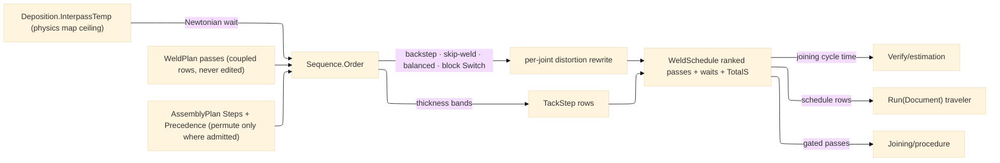

# [RASM_FABRICATION_WELD_SEQUENCE]

The distortion-control scheduler: `Sequence` the static surface whose ONE `Order` fold turns the weld plan's pass set into the executed schedule — joint order admitted by the `Fixturing/assembly` `AssemblyPlan.Precedence` partial order (this page permutes ONLY where precedence admits; what-before-what is assembly's law, how heat walks the seam is this page's), pass order within a joint rewritten by the `DistortionOrder` row (backstep, skip-weld, balanced, block — each row a real ordering fold over the pass segment indices, never a comment), tacks planned from the joint length bands, and the interpass wait computed per pass from the Newtonian cooling law against the `Deposition.InterpassTemp` ceiling — the physics map's `joined`-keyed row read straight off the budget (stainless 150 °C, mild steel 250 °C live on `Process/physics` `Material` rows; a re-encoded ceiling here is the split-brain defect).

The schedule is TIME truth, not plan truth: `Weld.Plan` owns bead geometry and heat input, `Sequence.Order` owns WHEN — tack steps first (count `max(2, ⌈L/pitch⌉+1)` off the thickness band rows), then the precedence-admitted joint walk with the distortion rewrite, each same-joint successor pass carrying its cooling wait `t = τ·ln((T_peak − T_amb)/(T_ip − T_amb))` with `τ = TauPerMmS · t_part` (thicker sections cool slower; the ceiling `T_ip` is the budget's). The thermal discriminant is the assembly census's `JoinClass.Thermal` — non-thermal joints (bolts, connectors) schedule without waits and without distortion rewriting. `Verify/estimation` reads the schedule's total seconds as the joining cycle-time input; the traveler composes the schedule rows; `Joining/procedure` gates the same passes the schedule orders.

Wire posture: HOST-LOCAL. `WeldSchedule` rows cross only the in-process seam to the estimation, procedure, and traveler folds — never a browser or peer wire.

## [01]-[INDEX]

- [01]-[WELD_SEQUENCE]: owns the `DistortionOrder` ordering axis with its four real ordering folds, the `TackRow` thickness-band table, the `SequencePolicy` carrier with the cooling constants, the `TackStep`/`ScheduledPass`/`WeldSchedule` receipts, and the ONE `Sequence.Order` fold — precedence-admitted joint walk, per-row distortion rewrite, tack planning, interpass cooling waits.

## [02]-[WELD_SEQUENCE]

- Owner: `DistortionOrder` `[SmartEnum<string>]` (`backstep`/`skip-weld`/`balanced`/`block`) binding `SegmentMm` (backstep increment), `Stride` (skip-weld hop), and `BlockSize` (block chunk) — one row set, each law reading its own column; `TackRow` the thickness-band table rows (`MaxThicknessMm`, `PitchMm`, `LengthFactor`, `MinLengthMm`); `SequencePolicy` the ONE carrier (the order row, ambient/peak temperatures, the per-mm cooling constant, the tack toggle); `TackStep` the tack row (joint, index, position, length); `ScheduledPass` the ordered execution row (rank, the `Weld.WeldPass`, the wait-before seconds); `WeldSchedule` the receipt (tacks, ordered passes, total seconds, the interpass ceiling echoed for the traveler); `Sequence` the static surface owning `Order` and the `Wait` cooling law.
- Cases: `DistortionOrder` rows 4 with their ordering LAWS — `backstep` splits each pass path into `SegmentMm` increments executed in reverse-of-progression order (weld toward the completed segment); `skip-weld` reorders segment indices by stride residue (`0,2,4,…` then `1,3,5,…`); `balanced` alternates passes symmetric about the seam midpoint (`+i, −i` pairing about the neutral axis); `block` chunks passes into `BlockSize` groups completing each block's layers before advancing; `TackRow` bands 3 — `≤3 mm` {pitch 100, length 3·t, min 15} · `≤10 mm` {pitch 200, length 3·t, min 20} · `>10 mm` {pitch 300, length 4·t, min 30}; a non-thermal joint (`JoinClass.Thermal == false` on the assembly census) bypasses rewrite and waits — the discriminant is READ, never re-derived.
- Entry: `public static Fin<WeldSchedule> Order(WeldPlan plan, AssemblyPlan assembly, RemovalBudget.Deposition budget, SequencePolicy policy)` — the ONE fold: joints walk in `assembly.Steps` order (already Kahn-ordered; a permutation is admitted only where `assembly.Precedence` carries no pair), each joint's passes rewrite under the `DistortionOrder` row, tacks front-load per joint, waits compute per same-joint successor; a plan/assembly joint-set mismatch routes the kernel `GeometryFault.DegenerateInput` (the schedule never invents or drops a pass); no new fault arm — an unfillable wait is impossible by construction and precedence violations cannot be expressed.
- Auto: `Order` groups `plan.Passes` by joint, walks `assembly.Steps` (`Final` phase rows drive welding; `Tack` phase rows consume the tack plan), rewrites each thermal joint's pass order through the generated `Switch` over the `DistortionOrder` row, and threads the cooling clock: `Wait(t_part) = τ·ln((PeakC − AmbientC)/(InterpassC − AmbientC))` with `InterpassC = budget.InterpassTemp` — the `Deposition.InterpassTemp` consumer; the first pass on a joint waits zero, every same-joint successor waits the computed seconds, cross-joint moves reset the clock (the torch travels while the prior joint cools — the skip-weld row exploits exactly this overlap); `Verify/estimation` sums `TotalS`, the traveler renders the schedule, `Spec/capability` reads the interpass compliance evidence through the procedure gate.
- Receipt: `WeldSchedule` IS the typed evidence — tack steps, rank-ordered `ScheduledPass` rows each carrying its wait, the total seconds, and the echoed ceiling; no generic schedule ledger, no timestamps (wall-clock stamping is the traveler's NodaTime concern at document time).
- Packages: `Joining/weld#WELD_PLAN` (`WeldPlan`/`WeldPass` — composed), `Fixturing/assembly#ASSEMBLY` (`AssemblyPlan.Steps`/`Precedence` + the census `JoinClass.Thermal` discriminant — composed, the partial order never re-derived), `Process/physics#CUT_PARAMETER` (`RemovalBudget.Deposition.InterpassTemp` — the ceiling, never re-encoded), `Rasm.Numerics` (`GeometryFault`), Thinktecture.Runtime.Extensions (`[SmartEnum<string>]` + generated `Switch`), LanguageExt.Core, Rhino.Geometry, BCL inbox.
- Growth: a new distortion discipline (cascade, wandering) is one `DistortionOrder` row + one `Switch` arm — the generated dispatch breaks the build until the arm lands; a per-position cooling model (vertical radiates differently) is one policy column on the `Wait` law; a pyrometer-fed live interpass hold is the AppHost decoded-telemetry seam consuming the SAME ceiling, never a second schedule; zero new entrypoints.
- Boundary: this page owns WHEN and a bead-geometry or heat-input computation here is `Weld.Plan`'s law re-rolled (passes arrive coupled; the schedule never edits a pass row); precedence is assembly's and an ordering that crosses a `Precedence` pair is unconstructable, not checked-then-ignored; the interpass ceiling is the physics map's row read off the budget and a page-local 150/250 table is the split-brain defect; the cooling law is ONE formula with row constants and a per-material wait table is the deleted form; tacks are schedule rows and a tack-geometry mint (tack size/shape) is `Weld.Plan`'s fillet arm at tack scale.

```csharp signature
// --- [RUNTIME_PRELUDE] ----------------------------------------------------------------------------------------------------------------------------
using LanguageExt;
using LanguageExt.Common;
using Rasm.Fabrication.Fixturing;    // AssemblyPlan · JoinStep · JoinPhase — the precedence contract, composed
using Rasm.Fabrication.Process;
using Rasm.Numerics;
using Rhino.Geometry;
using Thinktecture;
using static LanguageExt.Prelude;

namespace Rasm.Fabrication.Joining;

// --- [TYPES] --------------------------------------------------------------------------------------------------------------------------------------
// Four ordering LAWS, one row set: each law reads its own column; the generated Switch is the dispatch.
[SmartEnum<string>]
public sealed partial class DistortionOrder {
    public static readonly DistortionOrder Backstep = new("backstep", segmentMm: 300.0, stride: 1, blockSize: 1);
    public static readonly DistortionOrder SkipWeld = new("skip-weld", segmentMm: 300.0, stride: 2, blockSize: 1);
    public static readonly DistortionOrder Balanced = new("balanced", segmentMm: 0.0, stride: 1, blockSize: 1);
    public static readonly DistortionOrder Block = new("block", segmentMm: 0.0, stride: 1, blockSize: 3);

    public double SegmentMm { get; }
    public int Stride { get; }
    public int BlockSize { get; }
}

// --- [MODELS] -------------------------------------------------------------------------------------------------------------------------------------
public readonly record struct TackRow(double MaxThicknessMm, double PitchMm, double LengthFactor, double MinLengthMm) {
    public static readonly Arr<TackRow> Bands = Array(
        new TackRow(MaxThicknessMm: 3.0, PitchMm: 100.0, LengthFactor: 3.0, MinLengthMm: 15.0),
        new TackRow(MaxThicknessMm: 10.0, PitchMm: 200.0, LengthFactor: 3.0, MinLengthMm: 20.0),
        new TackRow(MaxThicknessMm: double.MaxValue, PitchMm: 300.0, LengthFactor: 4.0, MinLengthMm: 30.0));

    public static TackRow For(double thicknessMm) => Bands.Find(b => thicknessMm <= b.MaxThicknessMm).IfNone(Bands[2]);
}

public sealed record SequencePolicy(DistortionOrder Order, double AmbientC, double PeakC, double TauPerMmS, bool Tack) {
    public static readonly SequencePolicy Canonical = new(DistortionOrder.Balanced, AmbientC: 20.0, PeakC: 400.0, TauPerMmS: 12.0, Tack: true);
}

public readonly record struct TackStep(int Joint, int Index, Point3d At, double LengthMm);

public readonly record struct ScheduledPass(int Rank, WeldPass Pass, double WaitBeforeS);

public sealed record WeldSchedule(Seq<TackStep> Tacks, Seq<ScheduledPass> Passes, double TotalS, double InterpassCeilingC);

// --- [OPERATIONS] ---------------------------------------------------------------------------------------------------------------------------------
public static class Sequence {
    // The ONE schedule fold: assembly-ordered joint walk, per-row distortion rewrite on thermal joints,
    // tack front-load, Newtonian interpass waits against the budget ceiling. Passes are never edited.
    public static Fin<WeldSchedule> Order(WeldPlan plan, AssemblyPlan assembly, RemovalBudget.Deposition budget, SequencePolicy policy) {
        Map<int, Seq<WeldPass>> byJoint = plan.Passes.GroupBy(p => p.Joint).ToDictionary(g => g.Key, g => toSeq(g)).ToMap();
        Seq<int> weldOrder = assembly.Steps.Filter(s => s.Phase == JoinPhase.Final).Map(s => s.Joint).Filter(byJoint.ContainsKey);
        if (weldOrder.Distinct().Count != byJoint.Count)
            return Fin.Fail<WeldSchedule>(GeometryFault.DegenerateInput($"weld-sequence:joint-mismatch:{byJoint.Count}").ToError());

        Seq<TackStep> tacks = policy.Tack
            ? weldOrder.Bind(j => TacksFor(j, byJoint[j]))
            : Seq<TackStep>();

        Seq<ScheduledPass> scheduled = default;
        int rank = 0;
        double total = tacks.Count * 5.0;
        foreach (int joint in weldOrder) {
            Seq<WeldPass> ordered = Rewrite(byJoint[joint], policy.Order);
            bool first = true;
            foreach (WeldPass p in ordered) {
                double wait = first ? 0.0 : Wait(p.ThicknessMm, budget.InterpassTemp, policy);
                double runS = p.Path.Filter(m => !m.Rapid).Count * 60.0 / Math.Max(1.0, p.TravelMmMin);
                scheduled = scheduled.Add(new ScheduledPass(rank++, p, wait));
                total += wait + runS;
                first = false;
            }
        }
        return Fin.Succ(new WeldSchedule(tacks, scheduled, total, budget.InterpassTemp));
    }

    // t_wait = tau * ln((T_peak - T_amb)/(T_ip - T_amb)), tau = TauPerMmS * t_part; T_ip is the budget's
    // InterpassTemp — the Deposition ceiling's consumer, never a re-encoded per-material table.
    public static double Wait(double thicknessMm, double interpassC, SequencePolicy policy) =>
        interpassC <= policy.AmbientC
            ? 0.0
            : policy.TauPerMmS * thicknessMm * Math.Log((policy.PeakC - policy.AmbientC) / (interpassC - policy.AmbientC));

    // The four ordering laws over the pass list: index rewrites only — a pass row is never modified.
    static Seq<WeldPass> Rewrite(Seq<WeldPass> passes, DistortionOrder order) =>
        order.Switch(
            backstep: () => passes.Rev(),
            skipWeld: () => toSeq(passes.Map((i, p) => (Index: i, Pass: p)).OrderBy(x => x.Index % order.Stride).ThenBy(x => x.Index)).Map(x => x.Pass),
            balanced: () => Interleave(passes),
            block:    () => toSeq(passes.AsEnumerable().Chunk(order.BlockSize)).Bind(toSeq));

    static Seq<WeldPass> Interleave(Seq<WeldPass> passes) {
        int n = passes.Count;
        Seq<WeldPass> outSeq = default;
        for (int i = 0; i < (n + 1) / 2; i++) {
            outSeq = outSeq.Add(passes[i]);
            if (n - 1 - i > i) outSeq = outSeq.Add(passes[n - 1 - i]);
        }
        return outSeq;
    }

    static Seq<TackStep> TacksFor(int joint, Seq<WeldPass> passes) {
        Seq<Move> seam = passes.Head.Match(Some: p => p.Path.Filter(m => !m.Rapid), None: () => Seq<Move>());
        if (seam.Count < 2) return Seq<TackStep>();
        double length = seam.Zip(seam.Tail).Map(ab => ab.Item1.To.DistanceTo(ab.Item2.To)).Sum();
        TackRow row = TackRow.For(3.0);
        int count = Math.Max(2, (int)Math.Ceiling(length / row.PitchMm) + 1);
        return toSeq(Enumerable.Range(0, count)).Map(i => new TackStep(
            joint, i, seam[(int)Math.Round((double)i * (seam.Count - 1) / Math.Max(1, count - 1))].To,
            Math.Max(row.MinLengthMm, row.LengthFactor * 3.0)));
    }
}
```


