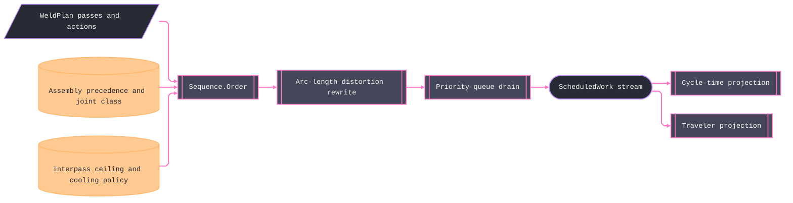

# [RASM_FABRICATION_WELD_SEQUENCE]

The distortion-control scheduler, `Sequence.Order`, composes assembly precedence, weld-plan deposits and preparation actions, tack rows, distortion ordering, and the joined-physics interpass ceiling into one timed `ScheduledWork` stream. `ScheduledWork` is the execution identity: tack, preparation, and deposit variants share rank and clock while retaining distinct payloads. Backstep reverses travel inside each frame-aligned source segment and re-mints every retained pose for the reversed tangent; skip-weld permutes stride residues; balanced alternates about the seam center; block groups the same seam block across the pass stack inside each root-treatment side barrier.

The drain maintains a BCL `PriorityQueue` over admitted `JoinNode` work, fails typed when precedence admits no open node, and reads each `JoinClass` from `AssemblyPlan.Joints`. `AssemblyPlan.Steps` alone admits tack work; a parallel tack knob cannot contradict the assembly receipt. Other joints, preparation actions, and tacks credit elapsed time against thermal clocks. Reheat compares the next arc start against the preceding arc end, not merely the idle charged on that row, and a triggered re-preheat charges its `RepreheatLaw.DurationS` on the clock before the arc and lands that charge on the deposit row itself. Deposit segments and tack windows preserve one-to-one move/frame station pairs and prepend their own rapid positioning move. The selected distortion row rejects a source span above `SegmentMm`; tack admission rejects a source span above the demanded tack length. Every preparation action resolves duration through the generated `ActionDurations.Resolve` dispatch; no string key or action disappears between planning and execution.

Wire posture: HOST-LOCAL. `WeldSchedule` rows cross only the in-process seam to the estimation, procedure, and traveler folds — never a browser or peer wire.

## [01]-[INDEX]

- [01]-[WELD_SEQUENCE]: owns `DistortionOrder`, tack bands, generated action-duration policy, sequence policy, executable tack and segment rows, the `ScheduledWork` union, `WeldSchedule`, and one precedence-admitted priority-queue fold.

## [02]-[WELD_SEQUENCE]

- Owner: `DistortionOrder` owns segment ordering parameters; `TackRow` owns tack admission data; `ActionDurations` owns total generated dispatch from every `JointAction` case to policy time; `SequencePolicy` owns cooling, reheat, and the composed duration value; `AssemblyPlan.Joints` owns the joint-class projection, while its `Steps` own tack admission; `TackStep` and `WeldSegment` own executable fragments; `ScheduledWork` owns timed variants; `WeldSchedule` owns the receipt; `Sequence` owns ordering and cooling.
- Cases: `DistortionOrder` rows 4 with their ordering laws — `backstep` admits source move/frame spans no longer than `SegmentMm` and executes each frame-aligned segment in reverse-of-progression order with every pose re-oriented to the reversed tangent; `skip-weld` reorders segment indices by stride residue (`0,2,4,…` then `1,3,5,…`); `balanced` alternates segment pairs symmetric about the seam midpoint; `block` groups segments by seam-block index across the joint's passes — block 1 through every layer, then block 2 — while exhausting one side before the next side's backgouge gate; `TackRow` bands 3 — `≤3 mm` {pitch 100, length 3·t, min 15} · `≤10 mm` {pitch 200, length 3·t, min 20} · `>10 mm` {pitch 300, length 4·t, min 30}; a non-thermal joint bypasses rewrite and interpass wait — the discriminant is read, never re-derived.
- Entry: `public static Fin<WeldSchedule> Order(WeldPlan plan, AssemblyPlan assembly, ProcessBudget.Deposition budget, SequencePolicy policy)` is the one fold. Joint mismatch, missing class, missing action duration, or precedence cycle fails typed.
- Auto: `Order` groups `plan.Passes` by joint, resolves `JoinClass` and node-phase admission from `AssemblyPlan`, validates source station spacing, seeds the per-joint segment queues (rewritten for thermal joints, natural for others), and drains the ready set: a tack or final node is admitted when every in-census `JoinNode` predecessor completed; preparation and tack work consume cooling time, idle is charged only when no admitted work can run, and each same-joint successor's wait is `t = τ·ln((T_peak − T_amb)/(T_ip − T_amb))·CoolingScale` with `τ = TauPerMmS · t_part` and `T_ip = budget.InterpassTemp` — the `Deposition.InterpassTemp` consumer, position-scaled off the pass row; `Verify/estimation` sums `TotalS` and reads per-row `AtS`, the traveler renders the schedule with the charged re-preheat durations, `Joining/procedure` gates the same plan's demand rows.
- Receipt: `WeldSchedule.Work` is the rank-ordered execution algebra. Every variant carries its start and duration; deposits add charged wait and re-preheat seconds, so per-row arc boundaries and `TotalS` reconcile from the receipt alone, and the receipt carries total seconds and interpass ceiling.
- Packages: `WeldPlan`, `WeldPass`, `WeldPosition.CoolingScale`, `AssemblyPlan`, `JoinClass.Thermal`, `ProcessBudget.Deposition.InterpassTemp`, `Rasm.Numerics`, Thinktecture.Runtime.Extensions, LanguageExt.Core, Rhino.Geometry, and BCL inbox surfaces compose directly.
- Growth: a new distortion discipline (cascade, wandering) is one `DistortionOrder` row + one `Switch` arm — the generated dispatch breaks the build until the arm lands; a per-position cooling refinement beyond the `CoolingScale` column is one policy column on the `Wait` law; a pyrometer-fed live interpass hold is the AppHost decoded-telemetry seam consuming the SAME ceiling, never a second schedule; zero new entrypoints.
- Boundary: this page owns execution order and time. Deposit geometry and heat input remain `Weld.Plan` facts; tack paths are arc-length windows over an existing admitted pass. Assembly owns precedence, and the physics budget owns the interpass ceiling.

```csharp signature
// --- [RUNTIME_PRELUDE] ----------------------------------------------------------------------------------------------------------------------------
using System.Linq;
using LanguageExt;
using LanguageExt.Common;
using Rasm.Fabrication.Fixturing;
using Rasm.Fabrication.Process;
using Rasm.Numerics;
using Rhino.Geometry;
using Thinktecture;
using static LanguageExt.Prelude;

namespace Rasm.Fabrication.Joining;

// --- [TYPES] --------------------------------------------------------------------------------------------------------------------------------------
[SmartEnum<string>]
public sealed partial class DistortionOrder {
    public static readonly DistortionOrder Backstep = new("backstep", segmentMm: 300.0, stride: 1, blockSize: 1);
    public static readonly DistortionOrder SkipWeld = new("skip-weld", segmentMm: 300.0, stride: 2, blockSize: 1);
    public static readonly DistortionOrder Balanced = new("balanced", segmentMm: 0.0, stride: 1, blockSize: 1);
    public static readonly DistortionOrder Block = new("block", segmentMm: 300.0, stride: 1, blockSize: 3);

    public double SegmentMm { get; }
    public int Stride { get; }
    public int BlockSize { get; }
}

// --- [MODELS] -------------------------------------------------------------------------------------------------------------------------------------
public readonly record struct TackRow(double MaxThicknessMm, double PitchMm, double LengthFactor, double MinLengthMm) {
    public static readonly Arr<TackRow> Bands = Array(
        new TackRow(MaxThicknessMm: 3.0, PitchMm: 100.0, LengthFactor: 3.0, MinLengthMm: 15.0),
        new TackRow(MaxThicknessMm: 10.0, PitchMm: 200.0, LengthFactor: 3.0, MinLengthMm: 20.0),
        new TackRow(MaxThicknessMm: double.MaxValue, PitchMm: 300.0, LengthFactor: 4.0, MinLengthMm: 30.0));

    public static TackRow For(double thicknessMm) => Bands.Find(b => thicknessMm <= b.MaxThicknessMm).IfNone(Bands[2]);
}

public readonly record struct ActionDurations(
    double PrepareGrooveS, double InstallBackingS, double BackgougeS, double RemoveBackingS) {
    public (string Key, double Seconds) Resolve(JointAction action) => action.Switch(
        state: this,
        prepareGroove: static (durations, _) => ("prepare-groove", durations.PrepareGrooveS),
        installBacking: static (durations, _) => ("install-backing", durations.InstallBackingS),
        backgouge: static (durations, _) => ("backgouge", durations.BackgougeS),
        removeBacking: static (durations, _) => ("remove-backing", durations.RemoveBackingS));
}

// Repreheat is ONE coupled law: AfterS the cold-gap trigger, DurationS the torch-on-part re-preheat time the
// drain charges before the arc — a trigger without a charged duration mints free heat and understates every
// downstream AtS and TotalS, so admission requires both values finite and strictly positive.
public readonly record struct RepreheatLaw(double AfterS, double DurationS);

public sealed record SequencePolicy(
    DistortionOrder Order, double AmbientC, double PeakC, double TauPerMmS,
    Option<RepreheatLaw> Repreheat, ActionDurations Durations) {
    public static readonly SequencePolicy Canonical = new(
        DistortionOrder.Balanced, AmbientC: 20.0, PeakC: 400.0, TauPerMmS: 12.0,
        Repreheat: Some(new RepreheatLaw(AfterS: 600.0, DurationS: 120.0)),
        Durations: new ActionDurations(PrepareGrooveS: 180.0, InstallBackingS: 45.0, BackgougeS: 120.0, RemoveBackingS: 30.0));
}

public readonly record struct TackStep(
    int Joint, int Index, Seq<Move> Path, Seq<TorchFrame> Frames,
    double LengthMm, double TravelMmMin, double HeatInputKjMm);

public readonly record struct WeldSegment(WeldPass Pass, int Segment, int Count, Seq<Move> Path, Seq<TorchFrame> Frames);

[Union(ConversionFromValue = ConversionOperatorsGeneration.None)]
public abstract partial record ScheduledWork {
    private ScheduledWork() { }

    public sealed record Tack(int Rank, TackStep Step, double AtS, double DurationS) : ScheduledWork;
    public sealed record Preparation(int Rank, JointAction Action, double AtS, double DurationS) : ScheduledWork;

    // Deposit temporal boundaries: wait spans [AtS − WaitBeforeS, AtS), re-preheat [AtS, AtS + RepreheatS), the
    // arc [AtS + RepreheatS, AtS + RepreheatS + DurationS) — ordered rows reconcile with TotalS, zero policy reads.
    public sealed record Deposit(
        int Rank, WeldPass Pass, int Segment, Seq<Move> Path, Seq<TorchFrame> Frames,
        double AtS, double WaitBeforeS, double RepreheatS, double DurationS) : ScheduledWork;
}

public sealed record WeldSchedule(Seq<ScheduledWork> Work, double TotalS, double InterpassCeilingC);

// --- [OPERATIONS] ---------------------------------------------------------------------------------------------------------------------------------
public static class Sequence {
    public static Fin<WeldSchedule> Order(WeldPlan plan, AssemblyPlan assembly, ProcessBudget.Deposition budget, SequencePolicy policy) {
        if (plan is null || assembly is null || budget is null || policy is null)
            return Fin.Fail<WeldSchedule>(GeometryFault.DegenerateInput("weld-sequence:input").ToError());
        Map<int, Seq<WeldPass>> byJoint = toMap(plan.Passes.GroupBy(static p => p.Joint).Select(g => (g.Key, toSeq(g))));
        Seq<JoinNode> nodes = assembly.Steps
            .Filter(step => byJoint.ContainsKey(step.Joint))
            .Map(static step => new JoinNode(step.Joint, step.Phase));
        Seq<int> weldOrder = nodes.Filter(static node => node.Phase == JoinPhase.Final).Map(static node => node.Joint);
        Map<int, JoinClass> jointClasses = toMap(assembly.Joints.Map(static joint => (joint.Index, joint.Specification.Class)));
        if (plan.Passes.IsEmpty || plan.Passes.Exists(Invalid)
            || plan.Actions.Distinct().Count != plan.Actions.Count
            || plan.Actions.Exists(action => action is null || !byJoint.ContainsKey(ActionJoint(action))))
            return Fin.Fail<WeldSchedule>(GeometryFault.DegenerateInput("weld-sequence:plan").ToError());
        if (nodes.Distinct().Count != nodes.Count || weldOrder.Distinct().Count != byJoint.Count)
            return Fin.Fail<WeldSchedule>(GeometryFault.DegenerateInput($"weld-sequence:joint-mismatch:{byJoint.Count}").ToError());
        if (weldOrder.Exists(j => jointClasses.Find(j).IsNone))
            return Fin.Fail<WeldSchedule>(GeometryFault.DegenerateInput("weld-sequence:missing-joint-class").ToError());
        if (!Valid(policy, budget))
            return Fin.Fail<WeldSchedule>(GeometryFault.DegenerateInput("weld-sequence:policy").ToError());
        if (policy.Order.SegmentMm > 0.0 && plan.Passes.Exists(pass => MaxSpan(pass.Path.Filter(static move => move is Move.Linear)) > policy.Order.SegmentMm))
            return Fin.Fail<WeldSchedule>(GeometryFault.DegenerateInput($"weld-sequence:path-sampling:{policy.Order.SegmentMm:0.###}").ToError());
        if (nodes.Filter(static node => node.Phase == JoinPhase.Tack).Exists(node => {
            WeldPass seed = byJoint[node.Joint][0];
            return MaxSpan(seed.Path.Filter(static move => move is Move.Linear)) > TackLength(seed);
        }))
            return Fin.Fail<WeldSchedule>(GeometryFault.DegenerateInput("weld-sequence:tack-sampling").ToError());

        Map<int, Seq<TackStep>> tacks = toMap(nodes
            .Filter(static node => node.Phase == JoinPhase.Tack)
            .Map(node => (node.Joint, TacksFor(node.Joint, byJoint[node.Joint]))));
        Map<int, Seq<WeldSegment>> queues = toMap(weldOrder.Map(j =>
            (j, Thermal(jointClasses, j) ? Rewrite(byJoint[j], policy.Order) : Natural(byJoint[j]))));
        return Drain(plan.Actions, nodes, queues, assembly.Precedence, budget, policy, jointClasses, tacks);
    }

    // Newtonian cooling from PeakC to the interpass gate, scaled by the pass position's CoolingScale — the log
    // domain is admitted once by Order, so the projection is total and no invalid bound can silently mint zero wait.
    static double Wait(WeldPass pass, double interpassC, SequencePolicy policy) =>
        policy.TauPerMmS * pass.ThicknessMm * pass.Position.CoolingScale
        * Math.Log((policy.PeakC - policy.AmbientC) / (interpassC - policy.AmbientC));

    // The ready-queue walk — the overlap mechanism: a thermal joint's cooling clock runs while OTHER admitted
    // joints weld, idle is charged only when nothing is ready, and each row records its start clock plus the
    // charged wait, re-preheat, and run seconds. Exemption: the drain is the scheduling kernel; domain flow
    // reads the receipt.
    static Fin<WeldSchedule> Drain(Seq<JointAction> actions, Seq<JoinNode> nodes, Map<int, Seq<WeldSegment>> queues, Seq<PrecedenceEdge> precedence, ProcessBudget.Deposition budget, SequencePolicy policy, Map<int, JoinClass> jointClasses, Map<int, Seq<TackStep>> tacks) {
        Seq<int> joints = nodes.Filter(static node => node.Phase == JoinPhase.Final).Map(static node => node.Joint);
        Map<int, int> next = toMap(joints.Map(static joint => (joint, 0)));
        Map<int, double> readyAt = toMap(joints.Map(static joint => (joint, 0.0)));
        Map<int, double> lastArcEnd = toMap(joints.Map(static joint => (joint, 0.0)));
        Set<JointAction> completedActions = Set<JointAction>();
        Set<JoinNode> completedNodes = Set<JoinNode>();
        Set<int> heated = Set<int>();
        Seq<ScheduledWork> work = Seq<ScheduledWork>();
        double clock = 0.0;
        int rank = 0;
        while (completedNodes.Count < nodes.Count) {
            Seq<JoinNode> admitted = nodes
                .Filter(node => !completedNodes.Contains(node))
                .Filter(node => Predecessors(node, precedence, nodes).ForAll(completedNodes.Contains));
            if (admitted.IsEmpty)
                return Fin.Fail<WeldSchedule>(GeometryFault.DegenerateInput("weld-sequence:precedence-cycle").ToError());
            Map<JoinNode, int> rankOf = toMap(nodes.Map((node, index) => (node, index)));
            PriorityQueue<JoinNode, (double ReadyAt, int Rank)> ready = new();
            admitted.Iter(node => {
                Option<JointAction> action = node.Phase == JoinPhase.Final
                    ? NextAction(node.Joint, actions, completedActions, queues[node.Joint], next[node.Joint])
                    : None;
                ready.Enqueue(node, (node.Phase == JoinPhase.Tack || action.IsSome ? clock : readyAt[node.Joint], rankOf[node]));
            });
            JoinNode node = ready.Dequeue();
            if (node.Phase == JoinPhase.Tack) {
                tacks[node.Joint].Iter(tack => {
                    double duration = 60.0 * Length(tack.Path) / tack.TravelMmMin;
                    work = work.Add(new ScheduledWork.Tack(rank++, tack, clock, duration));
                    clock += duration;
                    lastArcEnd = lastArcEnd.SetItem(tack.Joint, clock);
                    heated = heated.Add(tack.Joint);
                });
                WeldPass seed = queues[node.Joint][0].Pass;
                readyAt = readyAt.SetItem(node.Joint, Thermal(jointClasses, node.Joint) ? clock + Wait(seed, budget.InterpassTemp, policy) : clock);
                completedNodes = completedNodes.Add(node);
                continue;
            }
            int joint = node.Joint;
            Option<JointAction> pending = NextAction(joint, actions, completedActions, queues[joint], next[joint]);
            if (pending is { IsSome: true, Case: JointAction action }) {
                (string key, double duration) = policy.Durations.Resolve(action);
                if (duration < 0.0 || !double.IsFinite(duration))
                    return Fin.Fail<WeldSchedule>(GeometryFault.DegenerateInput($"weld-sequence:action-duration:{key}").ToError());
                work = work.Add(new ScheduledWork.Preparation(rank++, action, clock, duration));
                clock += duration;
                completedActions = completedActions.Add(action);
                continue;
            }
            if (next[joint] >= queues[joint].Count) {
                completedNodes = completedNodes.Add(node);
                continue;
            }
            double wait = Math.Max(0.0, readyAt[joint] - clock);
            WeldSegment s = queues[joint][next[joint]];
            double runS = 60.0 * Length(s.Path) / s.Pass.TravelMmMin;
            double startAt = clock + wait;
            double elapsed = Math.Max(0.0, startAt - lastArcEnd[joint]);
            bool repreheat = heated.Contains(joint) && policy.Repreheat.Map(law => elapsed > law.AfterS).IfNone(false);
            double reheatS = repreheat ? policy.Repreheat.Map(static law => law.DurationS).IfNone(0.0) : 0.0;
            work = work.Add(new ScheduledWork.Deposit(rank++, s.Pass, s.Segment, s.Path, s.Frames, startAt, wait, reheatS, runS));
            clock = startAt + reheatS + runS;
            lastArcEnd = lastArcEnd.SetItem(joint, clock);
            heated = heated.Add(joint);
            next = next.SetItem(joint, next[joint] + 1);
            readyAt = readyAt.SetItem(joint, Thermal(jointClasses, joint) ? clock + Wait(s.Pass, budget.InterpassTemp, policy) : clock);
        }
        return double.IsFinite(clock)
            ? Fin.Succ(new WeldSchedule(work, clock, budget.InterpassTemp))
            : Fin.Fail<WeldSchedule>(GeometryFault.DegenerateInput("weld-sequence:clock-overflow").ToError());
    }

    static Option<JointAction> NextAction(int joint, Seq<JointAction> actions, Set<JointAction> completed, Seq<WeldSegment> queue, int next) =>
        actions.Filter(action => ActionJoint(action) == joint && !completed.Contains(action) && ActionReady(action, queue, next)).HeadOrNone();

    static int ActionJoint(JointAction action) => action.Switch(
        prepareGroove: static a => a.Joint,
        installBacking: static a => a.Joint,
        backgouge: static a => a.Joint,
        removeBacking: static a => a.Joint);

    static bool ActionReady(JointAction action, Seq<WeldSegment> queue, int next) => action.Switch(
        state: (Queue: queue, Next: next),
        prepareGroove: static (state, _) => state.Next == 0,
        installBacking: static (state, _) => state.Next == 0,
        backgouge: static (state, a) => state.Next < state.Queue.Count && state.Queue[state.Next].Pass.Side >= a.BeforeSide,
        removeBacking: static (state, _) => state.Next >= state.Queue.Count);

    static Seq<JoinNode> Predecessors(JoinNode node, Seq<PrecedenceEdge> precedence, Seq<JoinNode> executed) =>
        precedence.Filter(edge => edge.After == node && executed.Contains(edge.Before)).Map(static edge => edge.Before);

    // State-threaded generated Switch (static arms, captures ride the state tuple). Block is CROSS-PASS: seam
    // blocks group across each side's stack — block b through every layer, then b+1; the side barrier prevents
    // a distortion rewrite from crossing the backgouge action, while a per-pass chunk remains the deleted form.
    static Seq<WeldSegment> Rewrite(Seq<WeldPass> passes, DistortionOrder order) =>
        order.Switch(
            state: (Passes: passes, Order: order),
            backstep: static s => s.Passes.Bind(p => Segments(p).Map(segment => segment with {
                Path = ReverseSegment(segment.Path),
                Frames = toSeq(segment.Frames.Reverse()).Map(static frame => frame.Reversed()),
            })),
            skipWeld: static s => s.Passes.Bind(p => toSeq(Segments(p).AsEnumerable().OrderBy(x => x.Segment % s.Order.Stride).ThenBy(static x => x.Segment))),
            balanced: static s => s.Passes.Bind(p => Balanced(Segments(p))),
            block: static s => toSeq(s.Passes.AsEnumerable().GroupBy(static pass => pass.Side).OrderBy(static side => side.Key)).Bind(side => {
                Seq<Seq<WeldSegment>> perPass = toSeq(side).Map(Segments);
                int blocks = (int)Math.Ceiling(perPass.Map(static segments => segments.Count).Fold(0, Math.Max) / (double)s.Order.BlockSize);
                return toSeq(Enumerable.Range(0, blocks)).Bind(block =>
                    perPass.Bind(segments => segments.Filter(segment => segment.Segment / s.Order.BlockSize == block)));
            }));

    static Seq<WeldSegment> Natural(Seq<WeldPass> passes) =>
        passes.Bind(Segments);

    static Seq<WeldSegment> Balanced(Seq<WeldSegment> segments) {
        double center = 0.5 * (segments.Count - 1);
        return toSeq(Enumerable.Range(0, segments.Count)
            .Select(i => (Index: i, Distance: Math.Abs(i - center), Side: i < center ? 0 : 1))
            .OrderBy(static x => x.Distance)
            .ThenBy(static x => x.Side)
            .Select(x => segments[x.Index]));
    }

    static Seq<WeldSegment> Segments(WeldPass pass) {
        Seq<Move> weld = pass.Path.Filter(static move => move is Move.Linear);
        if (weld.IsEmpty)
            return Seq<WeldSegment>();
        int count = weld.Count - 1;
        return toSeq(Enumerable.Range(0, count)).Map(i => {
            Seq<Move> path = SegmentPath(weld[i], weld[i + 1]);
            Seq<TorchFrame> frames = pass.Frames.Skip(i).Take(2);
            return new WeldSegment(pass, i, count, path, frames);
        });
    }

    static Seq<TackStep> TacksFor(int joint, Seq<WeldPass> passes) {
        Seq<Move> seam = passes.Head.Match(Some: static pass => pass.Path.Filter(static move => move is Move.Linear), None: static () => Seq<Move>());
        if (seam.Count < 2)
            return Seq<TackStep>();
        double length = Length(seam);
        double thickness = passes[0].ThicknessMm;
        TackRow row = TackRow.For(thickness);
        double tackLength = TackLength(passes[0]);
        int count = Math.Max(1, (int)Math.Ceiling((length - tackLength) / row.PitchMm) + 1);
        WeldPass seed = passes[0];
        return toSeq(Enumerable.Range(0, count)).Map(i => {
            double center = count == 1 ? length / 2.0 : (tackLength / 2.0) + ((length - tackLength) * i / (count - 1));
            (Seq<Move> path, Seq<TorchFrame> frames) = TackWindow(
                seed, Math.Max(0.0, center - (tackLength / 2.0)), Math.Min(length, center + (tackLength / 2.0)));
            return new TackStep(joint, i, path, frames, Length(path), seed.TravelMmMin, seed.HeatInputKjMm);
        });
    }

    static double TackLength(WeldPass pass) {
        double length = Length(pass.Path.Filter(static move => move is Move.Linear));
        TackRow row = TackRow.For(pass.ThicknessMm);
        return Math.Min(length, Math.Max(row.MinLengthMm, row.LengthFactor * pass.ThicknessMm));
    }

    static double Length(Seq<Move> moves) =>
        moves.Count < 2 ? 0.0 : moves.Zip(moves.Tail).Map(static pair => Target(pair.Item1).DistanceTo(Target(pair.Item2))).Sum();

    static double MaxSpan(Seq<Move> moves) =>
        moves.Count < 2 ? 0.0 : moves.Zip(moves.Tail).Map(static pair => Target(pair.Item1).DistanceTo(Target(pair.Item2))).Fold(0.0, Math.Max);

    static (Seq<Move> Path, Seq<TorchFrame> Frames) TackWindow(WeldPass pass, double low, double high) {
        Seq<Move> moves = pass.Path.Filter(static move => move is Move.Linear);
        Seq<double> stations = moves.Fold(
            (Rows: Seq<double>(), Prior: Option<Point3d>.None, At: 0.0),
            static (state, move) => {
                Point3d point = Target(move);
                double at = state.At + state.Prior.Map(prior => prior.DistanceTo(point)).IfNone(0.0);
                return (state.Rows.Add(at), Some(point), at);
            }).Rows;
        int start = stations.Map((at, index) => (At: at, Index: index)).Filter(row => row.At >= low)
            .HeadOrNone().Map(static row => Math.Max(0, row.Index - 1)).IfNone(0);
        int end = stations.Map((at, index) => (At: at, Index: index)).Filter(row => row.At >= high)
            .HeadOrNone().Map(static row => row.Index).IfNone(stations.Count - 1);
        Seq<Move> selected = moves.Skip(start).Take(Math.Max(2, end - start + 1));
        return (Executable(selected), pass.Frames.Skip(start).Take(selected.Count));
    }

    static Seq<Move> SegmentPath(Move start, Move end) =>
        Seq<Move>(new Move.Rapid(Target(start)), end);

    static Seq<Move> ReverseSegment(Seq<Move> path) => path[1] is Move.Linear end && path[0] is Move.Rapid start
        ? Seq<Move>(new Move.Rapid(end.Target), new Move.Linear(start.Target, end.Feed))
        : path;

    static Seq<Move> Executable(Seq<Move> linear) =>
        Seq1<Move>(new Move.Rapid(Target(linear[0]))) + linear.Tail;

    static Point3d Target(Move move) => move.Switch(
        rapid: static value => value.Target,
        linear: static value => value.Target,
        circular: static value => value.Target);

    static bool Thermal(Map<int, JoinClass> jointClasses, int joint) =>
        jointClasses[joint].Thermal;

    static bool Valid(SequencePolicy policy, ProcessBudget.Deposition budget) =>
        policy.Order is not null && double.IsFinite(policy.AmbientC) && double.IsFinite(policy.PeakC) && double.IsFinite(policy.TauPerMmS)
        && double.IsFinite(budget.InterpassTemp) && policy.AmbientC < budget.InterpassTemp
        && budget.InterpassTemp < policy.PeakC && policy.TauPerMmS > 0.0
        && policy.Repreheat.ForAll(static law => law.AfterS > 0.0 && double.IsFinite(law.AfterS)
            && law.DurationS > 0.0 && double.IsFinite(law.DurationS))
        && Seq(
            policy.Durations.PrepareGrooveS, policy.Durations.InstallBackingS, policy.Durations.BackgougeS,
            policy.Durations.RemoveBackingS)
            .ForAll(static seconds => seconds >= 0.0 && double.IsFinite(seconds));

    static bool Invalid(WeldPass pass) {
        Seq<Move> weld = pass.Path.Filter(static move => move is Move.Linear);
        return pass.Position is null || pass.Role is null || pass.Weave is null
            || pass.ThicknessMm <= 0.0 || !double.IsFinite(pass.ThicknessMm)
            || pass.TravelMmMin <= 0.0 || !double.IsFinite(pass.TravelMmMin)
            || pass.HeatInputKjMm <= 0.0 || !double.IsFinite(pass.HeatInputKjMm)
            || weld.Count < 2 || pass.Frames.Count != weld.Count || pass.Path.Count != weld.Count + 1
            || pass.Path.Exists(static move => move is null or Move.Circular)
            || pass.Path[0] is not Move.Rapid rapid || !rapid.Target.IsValid
            || rapid.Target.DistanceTo(Target(weld[0])) > 0.0
            || weld.Exists(static move => move is not Move.Linear linear || !linear.Target.IsValid || linear.Feed <= 0.0 || !double.IsFinite(linear.Feed))
            || weld.Zip(weld.Tail).Exists(static pair => Target(pair.Item1).DistanceTo(Target(pair.Item2)) is var length && (length <= 1e-9 || !double.IsFinite(length)))
            || !double.IsFinite(Length(weld))
            || pass.Frames.Exists(static frame => !frame.Pose.IsValid);
    }

}
```


