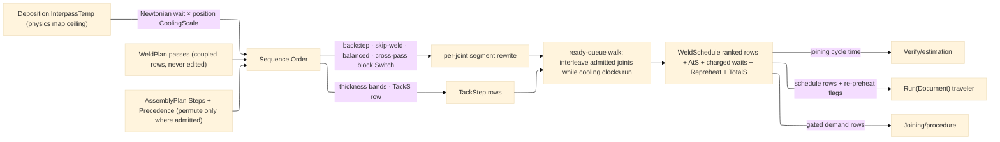

# [RASM_FABRICATION_WELD_SEQUENCE]

The distortion-control scheduler: `Sequence` the static surface whose ONE `Order` fold turns the weld plan's pass set into the executed schedule — joint order admitted by the `Fixturing/assembly` `AssemblyPlan.Precedence` partial order (this page permutes ONLY where precedence admits; what-before-what is assembly's law, how heat walks the seam is this page's), segment order within each joint rewritten by the `DistortionOrder` row (backstep, skip-weld, balanced, block — each row a REAL ordering fold: block groups seam blocks ACROSS the joint's pass stack, completing each block through all layers before advancing, which the per-pass identity chunking can never express), tacks planned from the joint length bands, and the interpass wait computed per same-joint successor from the Newtonian cooling law against the `Deposition.InterpassTemp` ceiling — the physics map's `joined`-keyed row read straight off the budget, scaled per joint by the pass rows' `WeldPosition.CoolingScale` column (an overhead joint sheds heat slower; a re-encoded ceiling here is the split-brain defect).

The schedule is TIME truth AND the cooling overlap is REAL: the fold is a ready-queue walk over per-joint segment queues, not a joint-sequential enumeration — when a thermal joint's next segment is still cooling, the walk schedules an admissible OTHER joint's ready segment (precedence-complete predecessors only) and the elapsed weld time credits against every cooling clock, so the torch travels while the prior joint cools and the skip-weld row exploits exactly this overlap; idle time is charged ONLY when no segment anywhere is ready, and each `ScheduledPass` row carries its start clock `AtS` beside the actually-charged `WaitBeforeS` (estimation and the traveler read per-row timing, not only the total). A wait beyond the policy's `RepreheatAfterS` marks the row `Repreheat` — the joint cooled past its preheat window and the shop re-strikes before the arc (the traveler renders the flag). Tack steps front-load first (count `max(2, ⌈L/pitch⌉+1)` off the thickness band rows, priced at the policy's `TackS` row, never an inline seconds literal), then the ready-queue walk runs to drain. The thermal discriminant is the assembly census's `JoinClass.Thermal` PROJECTED into `SequencePolicy.JointClasses` by the caller — the received `AssemblyPlan` does not carry the per-joint class, so the projection is policy data by construction; non-thermal joints (bolts, connectors) schedule without waits and without distortion rewriting. The precedence gate is explicit vacuity semantics: a `(Before, After)` pair with BOTH endpoints in the executed set must hold rank order; a pair with an absent endpoint constrains nothing over the executed set (the absent joint is not welded in this plan) — the law is stated, never an accidental `Match` default.

Wire posture: HOST-LOCAL. `WeldSchedule` rows cross only the in-process seam to the estimation, procedure, and traveler folds — never a browser or peer wire.

## [01]-[INDEX]

- [01]-[WELD_SEQUENCE]: owns the `DistortionOrder` ordering axis with its four real ordering folds, the `TackRow` thickness-band table, the `SequencePolicy` carrier with the cooling and tack-time rows, the `TackStep`/`WeldSegment`/`ScheduledPass`/`WeldSchedule` receipts, and the ONE `Sequence.Order` ready-queue fold — precedence-admitted interleaving walk, per-joint distortion rewrite, tack planning, position-scaled interpass cooling with overlap credit.

## [02]-[WELD_SEQUENCE]

- Owner: `DistortionOrder` `[SmartEnum<string>]` (`backstep`/`skip-weld`/`balanced`/`block`) binding `SegmentMm` (backstep increment), `Stride` (skip-weld hop), and `BlockSize` (block chunk) — one row set, each law reading its own column; `TackRow` the thickness-band table rows (`MaxThicknessMm`, `PitchMm`, `LengthFactor`, `MinLengthMm`); `SequencePolicy` the ONE carrier (the order row, ambient/peak temperatures, the per-mm cooling constant, tack toggle + `TackS` seconds row, the `RepreheatAfterS` window, the assembly-census `JoinClass` projection); `TackStep` the tack row (joint, index, position, length); `WeldSegment` the pass-local seam segment row; `ScheduledPass` the ordered execution row (rank, the `Weld.WeldPass`, segment index, segment path, start clock `AtS`, charged `WaitBeforeS`, `Repreheat`); `WeldSchedule` the receipt (tacks, ordered segment rows, total seconds, the interpass ceiling echoed for the traveler); `Sequence` the static surface owning `Order` and the `Wait` cooling law.
- Cases: `DistortionOrder` rows 4 with their ordering LAWS — `backstep` splits each pass path into `SegmentMm` increments executed in reverse-of-progression order (weld toward the completed segment); `skip-weld` reorders segment indices by stride residue (`0,2,4,…` then `1,3,5,…`); `balanced` alternates segment pairs symmetric about the seam midpoint; `block` groups segments by seam-block index ACROSS the joint's passes — block 1 through every layer, then block 2 — the cross-pass grouping that is the block discipline (a per-pass chunk re-emitting the same order is the deleted identity form); `TackRow` bands 3 — `≤3 mm` {pitch 100, length 3·t, min 15} · `≤10 mm` {pitch 200, length 3·t, min 20} · `>10 mm` {pitch 300, length 4·t, min 30}; a non-thermal joint bypasses rewrite and waits — the discriminant is READ, never re-derived.
- Entry: `public static Fin<WeldSchedule> Order(WeldPlan plan, AssemblyPlan assembly, RemovalBudget.Deposition budget, SequencePolicy policy)` — the ONE fold: joints seed from `assembly.Steps` order, the executed interleaving re-admits every `assembly.Precedence` both-endpoint pair before any `ScheduledPass` mints, each thermal joint's segments rewrite under the `DistortionOrder` row, tacks front-load per joint, the ready-queue walk interleaves under the cooling clocks; a plan/assembly joint-set mismatch and a precedence-crossing order both route the kernel `GeometryFault.DegenerateInput` (the schedule never invents, drops, or reorders a pass past the partial order); no new fault arm — an unfillable wait is impossible by construction.
- Auto: `Order` groups `plan.Passes` by joint, seeds the per-joint segment queues (rewritten for thermal joints, natural for others), and drains the ready set: a joint is ADMITTED when every both-endpoint predecessor completed; among admitted joints the walk takes the segment whose cooling clock is most elapsed (zero-wait segments first, then assembly-step order), charges idle only when nothing is ready, credits elapsed weld time to every cooling clock, and computes each same-joint successor's wait `t = τ·ln((T_peak − T_amb)/(T_ip − T_amb))·CoolingScale` with `τ = TauPerMmS · t_part` and `T_ip = budget.InterpassTemp` — the `Deposition.InterpassTemp` consumer, position-scaled off the pass row; `Verify/estimation` sums `TotalS` and reads per-row `AtS`, the traveler renders the schedule with the `Repreheat` flags, `Joining/procedure` gates the same plan's demand rows.
- Receipt: `WeldSchedule` IS the typed evidence — tack steps, rank-ordered `ScheduledPass` rows each carrying the pass, segment index, segment path, start clock, charged wait, and re-preheat flag, the total seconds, and the echoed ceiling; no generic schedule ledger, no timestamps (wall-clock stamping is the traveler's NodaTime concern at document time).
- Packages: `Joining/weld#WELD_PLAN` (`WeldPlan`/`WeldPass` + `WeldPosition.CoolingScale` — composed), `Fixturing/assembly#ASSEMBLY` (`AssemblyPlan.Steps`/`Precedence` + the census `JoinClass.Thermal` discriminant projection — composed, the partial order never re-derived; the joint id shares the `AssemblyJoint.Index` identity space), `Process/physics#CUT_PARAMETER` (`RemovalBudget.Deposition.InterpassTemp` — the ceiling, never re-encoded), `Rasm.Numerics` (`GeometryFault`), Thinktecture.Runtime.Extensions (`[SmartEnum<string>]` + generated `Switch`), LanguageExt.Core, Rhino.Geometry, BCL inbox.
- Growth: a new distortion discipline (cascade, wandering) is one `DistortionOrder` row + one `Switch` arm — the generated dispatch breaks the build until the arm lands; a per-position cooling refinement beyond the `CoolingScale` column is one policy column on the `Wait` law; a pyrometer-fed live interpass hold is the AppHost decoded-telemetry seam consuming the SAME ceiling, never a second schedule; the `AssemblyPlan` gaining its per-joint `JoinClass` column retires the policy projection — the assembly-side counterpart; zero new entrypoints.
- Boundary: this page owns WHEN and a bead-geometry or heat-input computation here is `Weld.Plan`'s law re-rolled (passes arrive coupled; the schedule never edits a pass row); precedence is assembly's and an ordering that crosses a both-endpoint `Precedence` pair is unconstructable, not checked-then-ignored — the vacuity of one-endpoint pairs is a STATED law; the interpass ceiling is the physics map's row read off the budget and a page-local 150/250 table is the split-brain defect; the cooling law is ONE formula with row constants and a per-material wait table is the deleted form; a joint-sequential fold that charges every wait while claiming overlap is the named fiction — the ready-queue walk IS the overlap; tacks are schedule rows and a tack-geometry mint is `Weld.Plan`'s fillet arm at tack scale.

```csharp signature
// --- [RUNTIME_PRELUDE] ----------------------------------------------------------------------------------------------------------------------------
using System.Linq;
using LanguageExt;
using LanguageExt.Common;
using Rasm.Fabrication.Fixturing;
using Rasm.Fabrication.Process;
using Rasm.Numerics;
using Rhino.Geometry;
using Thinktecture;
using static LanguageExt.Prelude;

namespace Rasm.Fabrication.Joining;

// --- [TYPES] --------------------------------------------------------------------------------------------------------------------------------------
[SmartEnum<string>]
public sealed partial class DistortionOrder {
    public static readonly DistortionOrder Backstep = new("backstep", segmentMm: 300.0, stride: 1, blockSize: 1);
    public static readonly DistortionOrder SkipWeld = new("skip-weld", segmentMm: 300.0, stride: 2, blockSize: 1);
    public static readonly DistortionOrder Balanced = new("balanced", segmentMm: 0.0, stride: 1, blockSize: 1);
    public static readonly DistortionOrder Block = new("block", segmentMm: 300.0, stride: 1, blockSize: 3);

    public double SegmentMm { get; }
    public int Stride { get; }
    public int BlockSize { get; }
}

// --- [MODELS] -------------------------------------------------------------------------------------------------------------------------------------
public readonly record struct TackRow(double MaxThicknessMm, double PitchMm, double LengthFactor, double MinLengthMm) {
    public static readonly Arr<TackRow> Bands = Array(
        new TackRow(MaxThicknessMm: 3.0, PitchMm: 100.0, LengthFactor: 3.0, MinLengthMm: 15.0),
        new TackRow(MaxThicknessMm: 10.0, PitchMm: 200.0, LengthFactor: 3.0, MinLengthMm: 20.0),
        new TackRow(MaxThicknessMm: double.MaxValue, PitchMm: 300.0, LengthFactor: 4.0, MinLengthMm: 30.0));

    public static TackRow For(double thicknessMm) => Bands.Find(b => thicknessMm <= b.MaxThicknessMm).IfNone(Bands[2]);
}

// JointClasses is the assembly-census projection the caller supplies (AssemblyPlan carries no per-joint class);
// TackS prices a tack, RepreheatAfterS marks the preheat re-strike window — all row data, no inline seconds.
public sealed record SequencePolicy(
    DistortionOrder Order, double AmbientC, double PeakC, double TauPerMmS,
    bool Tack, double TackS, Option<double> RepreheatAfterS, Map<int, JoinClass> JointClasses) {
    public static readonly SequencePolicy Canonical = new(
        DistortionOrder.Balanced, AmbientC: 20.0, PeakC: 400.0, TauPerMmS: 12.0,
        Tack: true, TackS: 5.0, RepreheatAfterS: Some(600.0), JointClasses: Map<int, JoinClass>());
}

public readonly record struct TackStep(int Joint, int Index, Point3d At, double LengthMm);

public readonly record struct WeldSegment(WeldPass Pass, int Segment, int Count, Seq<Move> Path);

public readonly record struct ScheduledPass(int Rank, WeldPass Pass, int Segment, Seq<Move> Path, double AtS, double WaitBeforeS, bool Repreheat);

public sealed record WeldSchedule(Seq<TackStep> Tacks, Seq<ScheduledPass> Passes, double TotalS, double InterpassCeilingC);

// --- [OPERATIONS] ---------------------------------------------------------------------------------------------------------------------------------
public static class Sequence {
    public static Fin<WeldSchedule> Order(WeldPlan plan, AssemblyPlan assembly, RemovalBudget.Deposition budget, SequencePolicy policy) {
        Map<int, Seq<WeldPass>> byJoint = toMap(plan.Passes.GroupBy(static p => p.Joint).Select(g => (g.Key, toSeq(g))));
        Seq<int> weldOrder = assembly.Steps.Filter(static s => s.Phase == JoinPhase.Final).Map(static s => s.Joint).Filter(byJoint.ContainsKey);
        if (weldOrder.Distinct().Count != byJoint.Count)
            return Fin.Fail<WeldSchedule>(GeometryFault.DegenerateInput($"weld-sequence:joint-mismatch:{byJoint.Count}").ToError());
        if (!Admits(weldOrder, assembly.Precedence))
            return Fin.Fail<WeldSchedule>(GeometryFault.DegenerateInput($"weld-sequence:precedence-crossed:{weldOrder.Count}").ToError());

        Seq<TackStep> tacks = policy.Tack ? weldOrder.Bind(j => TacksFor(j, byJoint[j])) : Seq<TackStep>();
        Map<int, Seq<WeldSegment>> queues = toMap(weldOrder.Map(j =>
            (j, Thermal(policy, j) ? Rewrite(byJoint[j], policy.Order) : Natural(byJoint[j], policy.Order))));
        return Fin.Succ(Drain(weldOrder, queues, assembly.Precedence, budget, policy, tacks));
    }

    // Newtonian cooling from PeakC to the interpass gate, scaled by the pass position's CoolingScale — the log
    // domain is AmbientC < interpassC < PeakC, so every out-of-domain bound folds to zero wait: total, never NaN.
    public static double Wait(WeldPass pass, double interpassC, SequencePolicy policy) =>
        interpassC <= policy.AmbientC || policy.PeakC <= policy.AmbientC || interpassC >= policy.PeakC
            ? 0.0
            : policy.TauPerMmS * pass.ThicknessMm * pass.Position.CoolingScale
                * Math.Log((policy.PeakC - policy.AmbientC) / (interpassC - policy.AmbientC));

    // The ready-queue walk — the overlap mechanism: a thermal joint's cooling clock runs while OTHER admitted
    // joints weld, idle is charged only when nothing is ready, and each row records its start clock and the
    // actually-charged wait. Exemption: the drain loop is the scheduling kernel; domain flow reads the receipt.
    static WeldSchedule Drain(Seq<int> weldOrder, Map<int, Seq<WeldSegment>> queues, Seq<(int Before, int After)> precedence, RemovalBudget.Deposition budget, SequencePolicy policy, Seq<TackStep> tacks) {
        Map<int, int> next = toMap(weldOrder.Map(static j => (j, 0)));
        Map<int, double> readyAt = toMap(weldOrder.Map(static j => (j, 0.0)));
        Seq<ScheduledPass> scheduled = default;
        double clock = tacks.Count * policy.TackS;
        int rank = 0;
        while (true) {
            Seq<int> open = weldOrder.Filter(j => next[j] < queues[j].Count);
            if (open.IsEmpty)
                break;
            Seq<int> admitted = open.Filter(j => Predecessors(j, precedence, weldOrder).ForAll(p => next.Find(p).Map(n => n >= queues[p].Count).IfNone(true)));
            int joint = admitted.OrderBy(j => Math.Max(0.0, readyAt[j] - clock)).ThenBy(j => weldOrder.FindIndex(o => o == j)).First();
            double wait = Math.Max(0.0, readyAt[joint] - clock);
            WeldSegment s = queues[joint][next[joint]];
            double runS = 60.0 * Length(s.Path) / Math.Max(1.0, s.Pass.TravelMmMin);
            bool repreheat = policy.RepreheatAfterS.Map(cap => wait > cap).IfNone(false);
            scheduled = scheduled.Add(new ScheduledPass(rank++, s.Pass, s.Segment, s.Path, AtS: clock + wait, WaitBeforeS: wait, Repreheat: repreheat));
            clock += wait + runS;
            next = next.SetItem(joint, next[joint] + 1);
            readyAt = readyAt.SetItem(joint, Thermal(policy, joint) ? clock + Wait(s.Pass, budget.InterpassTemp, policy) : clock);
        }
        return new WeldSchedule(tacks, scheduled, clock, budget.InterpassTemp);
    }

    static Seq<int> Predecessors(int joint, Seq<(int Before, int After)> precedence, Seq<int> executed) =>
        precedence.Filter(pair => pair.After == joint && executed.Contains(pair.Before)).Map(static pair => pair.Before);

    // State-threaded generated Switch (static arms, captures ride the state tuple). Block is CROSS-PASS: seam
    // blocks group across the whole stack — block b through every layer, then b+1; a per-pass chunk re-emits
    // the identity order and is the deleted form.
    static Seq<WeldSegment> Rewrite(Seq<WeldPass> passes, DistortionOrder order) =>
        order.Switch(
            state: (Passes: passes, Order: order),
            backstep: static s => s.Passes.Bind(p => toSeq(Segments(p, s.Order).AsEnumerable().OrderByDescending(static x => x.Segment))),
            skipWeld: static s => s.Passes.Bind(p => toSeq(Segments(p, s.Order).AsEnumerable().OrderBy(x => x.Segment % s.Order.Stride).ThenBy(static x => x.Segment))),
            balanced: static s => s.Passes.Bind(p => Balanced(Segments(p, s.Order))),
            block: static s => {
                Seq<Seq<WeldSegment>> perPass = s.Passes.Map(p => Segments(p, s.Order));
                int blocks = (int)Math.Ceiling(perPass.Map(static x => x.Count).Fold(0, Math.Max) / (double)s.Order.BlockSize);
                return toSeq(Enumerable.Range(0, blocks)).Bind(b =>
                    perPass.Bind(segs => segs.Filter(x => x.Segment / s.Order.BlockSize == b)));
            });

    static Seq<WeldSegment> Natural(Seq<WeldPass> passes, DistortionOrder order) =>
        passes.Bind(p => Segments(p, order));

    static Seq<WeldSegment> Balanced(Seq<WeldSegment> segments) {
        double center = 0.5 * (segments.Count - 1);
        return toSeq(Enumerable.Range(0, segments.Count)
            .Select(i => (Index: i, Distance: Math.Abs(i - center), Side: i < center ? 0 : 1))
            .OrderBy(static x => x.Distance)
            .ThenBy(static x => x.Side)
            .Select(x => segments[x.Index]));
    }

    static Seq<WeldSegment> Segments(WeldPass pass, DistortionOrder order) {
        Seq<Move> weld = pass.Path.Filter(static m => !m.Rapid);
        if (weld.IsEmpty)
            return Seq<WeldSegment>();
        double length = Length(weld);
        double pitch = order.SegmentMm > 0.0 ? order.SegmentMm : Math.Max(1.0, length / Math.Max(1, weld.Count - 1));
        int count = Math.Max(1, (int)Math.Ceiling(length / pitch));
        return toSeq(Enumerable.Range(0, count)).Map(i => new WeldSegment(pass, i, count, Slice(weld, i, count)));
    }

    static Seq<Move> Slice(Seq<Move> moves, int segment, int count) {
        int start = (int)Math.Floor((double)segment * moves.Count / count);
        int end = Math.Max(start + 1, (int)Math.Ceiling((double)(segment + 1) * moves.Count / count));
        return toSeq(moves.AsEnumerable().Skip(start).Take(end - start));
    }

    static Seq<TackStep> TacksFor(int joint, Seq<WeldPass> passes) {
        Seq<Move> seam = passes.Head.Match(Some: static p => p.Path.Filter(static m => !m.Rapid), None: static () => Seq<Move>());
        if (seam.Count < 2)
            return Seq<TackStep>();
        double length = Length(seam);
        double thickness = passes.Head.Match(Some: static p => p.ThicknessMm, None: static () => 0.0);
        TackRow row = TackRow.For(thickness);
        int count = Math.Max(2, (int)Math.Ceiling(length / row.PitchMm) + 1);
        return toSeq(Enumerable.Range(0, count)).Map(i => new TackStep(
            joint, i, seam[(int)Math.Round((double)i * (seam.Count - 1) / Math.Max(1, count - 1))].To,
            Math.Max(row.MinLengthMm, row.LengthFactor * thickness)));
    }

    static double Length(Seq<Move> moves) =>
        moves.Count < 2 ? 0.0 : moves.Zip(moves.Tail).Map(static ab => ab.Item1.To.DistanceTo(ab.Item2.To)).Sum();

    static bool Thermal(SequencePolicy policy, int joint) =>
        policy.JointClasses.Find(joint).Map(static c => c.Thermal).IfNone(true);

    // The precedence gate with STATED vacuity: a pair with both endpoints in the executed set must hold rank
    // order; a pair with an absent endpoint constrains nothing over the executed set — that joint is not welded
    // in this plan, so the relation is vacuous, never an accidental default arm.
    static bool Admits(Seq<int> order, Seq<(int Before, int After)> precedence) {
        Map<int, int> rank = toMap(order.Map((j, i) => (j, i)));
        return precedence.ForAll(pair =>
            (rank.Find(pair.Before), rank.Find(pair.After)) switch {
                ({ IsSome: true, Case: int before }, { IsSome: true, Case: int after }) => before < after,
                _ => true,
            });
    }
}
```


