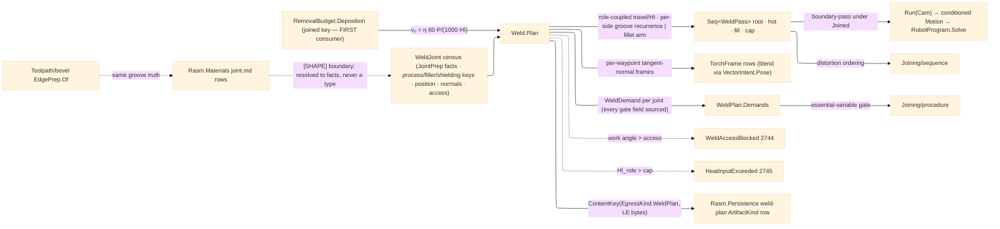

# [RASM_FABRICATION_WELD]

The weld-plan owner: `Weld` the static surface whose ONE `Plan` fold turns a joint census into the multi-pass bead-stack a torch executes — groove joints filled root → hot-pass → fill layers → cap over the boundary-resolved groove facts, fillet joints sized from the boundary-resolved AISC J2.4 leg floor, every pass carrying its coupled role, weave, side, dwell, travel, and heat-input row. The joining VOCABULARY is `Rasm.Materials` `Component/joint`'s and resolves to FACTS at the census boundary, never a type in-folder: the package references no AEC peer (`Rasm.Fabrication.csproj` carries no `Rasm.Materials` row — the `[SHAPE]: GroovePrep` seam crosses the shape as raw scalars and keys, exactly as `Fixturing/assembly` and `Process/physics` resolve the same rows), so `JointPrep` is the boundary-resolved fact union — `Groove(wallAngle, rootOpening, rootFace, depth, effectiveThroat, doubleSided, backed, backgouge)` lowered from `GrooveGeometry`/`GroovePrep`/`Penetration`/`BackingType`/`RootTreatment` (the PJP `EffectiveThroatMm` and `WeldProcess.PjpDeductionMm` deduction resolve INTO `DepthMm`/`EffectiveThroatMm` at the boundary, so the fill height is the prep's, never a raw `t−f` guess), and `Fillet(legMm, minLegMm)` lowered from the demanded leg and `WeldRow.MinimumFilletLegMm` — the Materials `WeldType` discriminant selects the case at the boundary, never an `Option`-presence re-derivation. This page adds the ARC-physics columns Materials does not carry: the EN 1011-1 thermal-efficiency map keyed by process KEY (`saw` 1.0, the shielded arcs 0.8 — a process with NO efficiency row fails typed, never a silent `0.8` literal), and the `WeldPosition` axis (`flat`/`horizontal`/`vertical`/`overhead`) whose `TravelDerate` column derates travel per position and whose `CoolingScale` column the sequence's interpass law reads.

Heat input is the ONE law `HI = η·60·V·I/(1000·v)` kJ/mm with `V·I` read as the landed `RemovalBudget.Deposition.PowerW` — the `joined`-keyed physics map entry's FIRST consumer; travel is DERIVED, never a free knob, and it is ROLE-COUPLED: the nominal travel `v₀ = η·60·P/(1000·HI_target)` fixes the nominal bead area `A₀ = (π·d²/4)·(WFR·1000)/v₀`, each `PassRole.AreaFactor` scales its bead to `AreaFactor·A₀` so `v_role = v₀·position.TravelDerate/AreaFactor`, and the REALIZED per-pass `HI_role = HI_target·AreaFactor/TravelDerate` varies by role and position — the cap gate `HI_role ≤ HeatInputCapKjMm` is therefore a real per-pass verdict (an overhead fill can breach the cap a flat root clears), routing `HeatInputExceeded` 2745 typed. The groove stack fills the prep's `DepthMm` per SIDE — a `DoubleSided` prep stacks each side over half the fill with its own root, the second side's root preceded by the backgouge condition when the boundary resolved `Backgouge` (the gouge-then-reweld root), and a `Backed` root runs against backing; the layer recurrence is `w(h) = g + 2h·tan αw`, passes per layer `⌈w(h)/w_bead⌉` with `w_bead = BeadWidthWireDia·d·WidthFactor` — the bead-width base and the fillet step factor are POLICY rows, never inline literals. `Plan` also EMITS the qualification demand chain: one `WeldDemand` per joint (process/filler/shielding keys, position, thickness, preheat, the interpass ceiling off the budget, the realized max HI) rides `WeldPlan.Demands`, so `Joining/procedure`'s gate projects straight off the landed plan — the demand vector has a producer for every field.

The egress is the EXISTING rail, no eleventh owner case: each planned bead is one conditioned `boundary-pass` under the `ProcessModality.Joined` admission — the torch `Motion` egresses through `Run(Cam)` exactly as a cut pass does (the Cam fold conditions per feed move; the `Kinematics/cell` `RobotProgram.Solve` posts the arc rows for the `weld` process's articulated-arm machines), the pass-path ingress onto the Cam fold being the designed-ahead counterpart the `Seq<Move>` rows are already shaped for; the plan record itself keys `EgressKind.WeldPlan` through the ONE `ContentKey.Of` fold over an LE-double canonical preimage (a string-formatted float preimage is the named BYTE_IDENTITY defect), with its Persistence `ArtifactKind` enrollment riding this page. Groove-prep CUTTING rides the landed `Toolpath/bevel` boundary — `EdgePrep.Of` maps the same Materials row this page fills, so the prep program and the fill plan read ONE groove truth. Torch orientation is frame data on the pass rows seated on the per-joint seam NORMALS (the census carries a normal per seam waypoint — a world-Z lateral offset collapses on a vertical seam, so the frame is joint data, never a global axis); keyframe pose BLENDING between seam corners rides the kernel one-slerp owner through `VectorIntent.Pose(Plane, Plane, UnitInterval, MotionInterpolation)` — a local slerp beside it is the deleted form. Access is a plan-time gate: a demanded work angle outside the joint's access half-angle (the `Fixturing/assembly` census column; `WeldJoint.Joint` shares the `AssemblyJoint.Index` integer identity space — the ONE joint-id contract all three Joining pages and the assembly census bind) routes `WeldAccessBlocked` 2744 before any motion is planned.

Wire posture: HOST-LOCAL. `WeldPass` rows, the demand rows, and the plan key cross only the in-process seam to the Cam egress, the sequence scheduler, and the procedure gate — never a browser or peer wire.

## [01]-[INDEX]

- [01]-[WELD_PLAN]: owns the `PassRole`/`WeavePattern`/`WeldPosition` vocabularies, the `JointPrep` boundary-fact union, the `WeldJoint` census row, the `WeldPolicy` carrier with the process-keyed efficiency map and bead-geometry rows, the `WeldPass`/`TorchFrame`/`WeldPlan` receipts, and the ONE `Weld.Plan` fold — role-coupled travel/HI derivation, per-side bead-stack recurrence, fillet leg arm, access gate, demand emission, `weld-plan` content key.

## [02]-[WELD_PLAN]

- Owner: `PassRole` `[SmartEnum<string>]` (`root`/`hot-pass`/`fill`/`cap`) binding `AreaFactor` (bead cross-section relative to nominal — READ by the travel derivation, so the column is load-bearing) and `WeaveAdmitted` (root and hot-pass run stringers only); `WeavePattern` `[SmartEnum<string>]` (`stringer`/`zigzag`/`crescent`/`triangle`) binding `WidthFactor` and `EdgeDwellMs` (the sidewall fusion hold — carried onto every pass row for the robot egress); `WeldPosition` `[SmartEnum<string>]` (`flat`/`horizontal`/`vertical`/`overhead`) binding `TravelDerate` and `CoolingScale`; `JointPrep` `[Union]` the boundary-resolved prep facts (`Groove` · `Fillet`); `WeldJoint` the census row — seam polyline WITH per-waypoint normals, the prep facts, process/filler/shielding KEYS, position, thickness, preheat, access half-angle; `WeldPolicy` the ONE carrier (wire diameter, target/cap heat input, work/travel angles, fill weave, bead-width base, fillet step factor, the process-keyed EN 1011-1 efficiency map); `TorchFrame` the per-waypoint pose row; `WeldPass` the coupled pass row (role, layer, side, ordinal, weave, dwell, position, lateral offset, travel, heat input, thickness, path); `WeldPlan` the receipt (passes + frames + DEMANDS + max heat input + bead count + `ContentKey`); `Weld` the static surface owning `Plan` and `HeatInput`.
- Cases: `PassRole` rows 4 — `root` {0.7, stringer-only} · `hot-pass` {0.9, stringer-only} · `fill` {1.0, weave} · `cap` {0.85, weave}; `WeavePattern` rows 4 — `stringer` {1.0, 0} · `zigzag` {2.5, 150} · `crescent` {3.0, 200} · `triangle` {3.5, 250}; `WeldPosition` rows 4 — `flat` {1.0, 1.0} · `horizontal` {0.9, 1.0} · `vertical` {0.6, 1.3} · `overhead` {0.7, 1.15}; `JointPrep` cases 2 — the boundary WeldType discriminant selects, the groove case carrying the prep-true fill depth and PJP effective throat, the fillet case its demanded leg over the resolved J2.4 floor.
- Entry: `public static Fin<WeldPlan> Plan(Seq<WeldJoint> joints, WeldPolicy policy, RemovalBudget.Deposition budget)` — the ONE fold absorbing single joint and batch by the `Seq` shape: per joint it gates the seam (≥ 2 points, positive thickness, normals aligned to waypoints), gates access (`WorkAngleDeg > AccessHalfAngleDeg` → 2744), resolves η from the process key (missing row → typed fail), derives the role-coupled travel/HI rows, stacks the passes per prep case and side, verifies every realized `HI_role ≤ HeatInputCapKjMm` (2745 on overrun), emits the joint's `WeldDemand`, and mints the plan key over the LE-double preimage.
- Auto: each pass's path is the seam polyline laterally shifted along the per-waypoint `tangent × normal` frame by its groove `OffsetMm` with a rapid link in — the shifted VALUE is computed here, the conditioned motion is the Cam fold's (`Guard`/`Workholding`/`Magazine` execute there; the pass never bypasses conditioning); `TorchFrame` rows seat the work/travel angles on the seam tangent-normal frame per waypoint, corner-to-corner orientation blending stated onto the kernel pose dispatch; `Joining/sequence` re-orders the emitted passes for distortion under the assembly `Precedence` and reads each pass's `Position.CoolingScale`; `Joining/procedure` gates `plan.Demands` against the qualified WPS band; `Verify/estimation` prices arc-on time from the pass travel rows; the bevel prep program reads the SAME groove truth through `EdgePrep.Of`.
- Receipt: `WeldPlan` IS the typed evidence — the ordered coupled `WeldPass` rows, the torch frames, the per-joint demand rows, the realized max heat input, the bead count, and the `ContentKey(EgressKind.WeldPlan, digest)`; no generic weld ledger and no plane-internal type on a result case (the plan crosses on its content key; the torch `Motion` is the Cam egress's).
- Packages: `Rasm.Materials` `Component/joint#JOINT` (`GrooveGeometry`/`GroovePrep`/`Penetration`/`RootTreatment`/`BackingType`/`WeldProcess`/`WeldRow` — resolved to `JointPrep` facts and keys at the census boundary, never a type import), `Process/physics#CUT_PARAMETER` (`RemovalBudget.Deposition` — the `joined`-keyed heat-input budget, FIRST consumer), `Process/family#PROCESS_FAMILY` (`ProcessModality.Joined` `boundary-pass` admission, `ProcessKind.Weld`), `Process/owner#FABRICATION_OWNER` (`Move`/`EgressKind.WeldPlan`/`ContentKey.Of`), `Toolpath/bevel#BEVEL` (`EdgePrep.Of` — the prep-cut counterpart), `Fixturing/assembly#ASSEMBLY` (the access half-angle census + the shared joint-index identity), kernel `Processing/intent` (`VectorIntent.Pose` + `MotionInterpolation` — the one slerp), Thinktecture.Runtime.Extensions, LanguageExt.Core, Rhino.Geometry, BCL inbox.
- Growth: a new weave is one `WeavePattern` row; a new pass discipline (temper-bead, buttering) is one `PassRole` row + its stacking arm; a new arc process is one Materials row + one efficiency map entry — zero local rows; a new position is one `WeldPosition` row (both columns); narrow-gap grooves are Materials `GrooveGeometry` rows the boundary already resolves; the preheat DERIVATION (carbon-equivalent per AWS D1.1/EN 1011-2) lands as a census-boundary law when the material chemistry seam lands — the census carries the resolved `PreheatC` until then; the Cam pass-path ingress is the designed-ahead owner counterpart; zero new entrypoints.
- Boundary: the groove/process/fillet vocabulary is Materials-owned and resolves to FACTS at the boundary — a Materials type import contradicts the package's no-AEC-peer law, and a local `GrooveGeometry`/`WeldProcess` re-mint is equally dead: `JointPrep` carries resolved scalars and the process rides its KEY; the heat-input law lives HERE and a sequence- or procedure-side HI formula is the second-law defect (they read the rows); travel derives role-coupled from the heat-input target and an independent travel knob — or a role table whose `AreaFactor` no derivation reads — is the deleted form; the egress is the existing `Run(Cam)` case under `Joined`/`boundary-pass` and an eleventh owner case, a weld-local motion conditioner, or a plan-side G-code emitter is the deleted form; pose blending rides the kernel dispatch and a local slerp is the deleted form; the content preimage is canonical LE bytes and a formatted-string float preimage is the named defect; a plan bypassing the access gate ships a torch crash — the gate precedes motion, always.

```csharp signature
// --- [RUNTIME_PRELUDE] ----------------------------------------------------------------------------------------------------------------------------
using LanguageExt;
using LanguageExt.Common;
using Rasm.Fabrication.Process;
using Rasm.Numerics;
using Rhino.Geometry;
using Thinktecture;
using static LanguageExt.Prelude;

namespace Rasm.Fabrication.Joining;

// --- [TYPES] --------------------------------------------------------------------------------------------------------------------------------------
[SmartEnum<string>]
public sealed partial class PassRole {
    public static readonly PassRole Root = new("root", areaFactor: 0.7, weaveAdmitted: false);
    public static readonly PassRole HotPass = new("hot-pass", areaFactor: 0.9, weaveAdmitted: false);
    public static readonly PassRole Fill = new("fill", areaFactor: 1.0, weaveAdmitted: true);
    public static readonly PassRole Cap = new("cap", areaFactor: 0.85, weaveAdmitted: true);

    public double AreaFactor { get; }
    public bool WeaveAdmitted { get; }
}

[SmartEnum<string>]
public sealed partial class WeavePattern {
    public static readonly WeavePattern Stringer = new("stringer", widthFactor: 1.0, edgeDwellMs: 0);
    public static readonly WeavePattern Zigzag = new("zigzag", widthFactor: 2.5, edgeDwellMs: 150);
    public static readonly WeavePattern Crescent = new("crescent", widthFactor: 3.0, edgeDwellMs: 200);
    public static readonly WeavePattern Triangle = new("triangle", widthFactor: 3.5, edgeDwellMs: 250);

    public double WidthFactor { get; }
    public int EdgeDwellMs { get; }
}

// The position axis Materials does not carry: TravelDerate derates the role-coupled travel (vertical-up runs
// slow), CoolingScale scales the sequence's interpass wait (an overhead joint sheds heat slower).
[SmartEnum<string>]
public sealed partial class WeldPosition {
    public static readonly WeldPosition Flat = new("flat", travelDerate: 1.0, coolingScale: 1.0);
    public static readonly WeldPosition Horizontal = new("horizontal", travelDerate: 0.9, coolingScale: 1.0);
    public static readonly WeldPosition Vertical = new("vertical", travelDerate: 0.6, coolingScale: 1.3);
    public static readonly WeldPosition Overhead = new("overhead", travelDerate: 0.7, coolingScale: 1.15);

    public double TravelDerate { get; }
    public double CoolingScale { get; }
}

// --- [MODELS] -------------------------------------------------------------------------------------------------------------------------------------
// Boundary-resolved prep FACTS ([SHAPE]: GroovePrep seam — no Materials type crosses): the WeldType row selects
// the case at the census boundary; Groove.DepthMm is the prep-true fill height (PJP depth, CJP t−f) and
// EffectiveThroatMm the deduction-resolved qualification throat; Backed/Backgouge are the root-condition facts.
[Union(ConversionFromValue = ConversionOperatorsGeneration.None)]
public abstract partial record JointPrep {
    private JointPrep() { }

    public sealed record Groove(
        double WallAngleDeg, double RootOpeningMm, double RootFaceMm, double DepthMm,
        double EffectiveThroatMm, bool DoubleSided, bool Backed, bool Backgouge) : JointPrep;

    public sealed record Fillet(double LegMm, double MinLegMm) : JointPrep;
}

// The census row: seam waypoints WITH per-waypoint normals (a world-Z lateral offset collapses on a vertical
// seam), boundary-resolved prep facts and process/filler/shielding KEYS, position, thickness, preheat, access.
public sealed record WeldJoint(
    int Joint, Arr<Point3d> Seam, Arr<Vector3d> Normals, JointPrep Prep,
    string ProcessKey, string FillerKey, string ShieldingKey, WeldPosition Position,
    double ThicknessMm, double PreheatC, double AccessHalfAngleDeg);

// EfficiencyK: the EN 1011-1 thermal-efficiency column keyed by the Materials process KEY — arc physics is
// Fabrication's column, the process AXIS stays Materials-owned; BeadWidthWireDia and FilletStepFactor are the
// bead-geometry rows (inline 2.5/0.35 literals are the named defect).
public sealed record WeldPolicy(
    double WireDiameterMm, double TargetHeatInputKjMm, double HeatInputCapKjMm,
    double WorkAngleDeg, double TravelAngleDeg, WeavePattern FillWeave,
    double BeadWidthWireDia, double FilletStepFactor, Map<string, double> EfficiencyK) {
    public static readonly WeldPolicy Canonical = new(
        WireDiameterMm: 1.2, TargetHeatInputKjMm: 1.0, HeatInputCapKjMm: 2.5,
        WorkAngleDeg: 45.0, TravelAngleDeg: 10.0, WeavePattern.Zigzag,
        BeadWidthWireDia: 2.5, FilletStepFactor: 0.35,
        Map(("smaw", 0.8), ("gmaw", 0.8), ("fcaw", 0.8), ("saw", 1.0)));
}

public readonly record struct TorchFrame(int Joint, Point3d At, Vector3d Travel, Vector3d Normal, double WorkAngleDeg, double TravelAngleDeg);

// The coupled pass row: role, side, groove position, weave dwell, position, travel, and heat input travel
// TOGETHER — changing one without re-deriving the others ships a cold lap or a burn-through.
public sealed record WeldPass(
    int Joint, PassRole Role, int Layer, int Side, int Ordinal, WeavePattern Weave, int EdgeDwellMs,
    WeldPosition Position, double OffsetMm, double TravelMmMin, double HeatInputKjMm, double ThicknessMm, Seq<Move> Path);

public sealed record WeldPlan(Seq<WeldPass> Passes, Seq<TorchFrame> Frames, Seq<WeldDemand> Demands, double MaxHeatInputKjMm, int Beads, ContentKey Key);

// --- [OPERATIONS] ---------------------------------------------------------------------------------------------------------------------------------
public static class Weld {
    // The ONE fold: per joint — seam/access gates -> role-coupled travel/HI rows -> bead stack (groove per-side
    // recurrence | fillet leg arm) -> HI cap verify -> demand emission; then the plan key. Seq absorbs batch.
    public static Fin<WeldPlan> Plan(Seq<WeldJoint> joints, WeldPolicy policy, RemovalBudget.Deposition budget) =>
        joints.TraverseM(j => PlanJoint(j, policy, budget)).As().Map(rows => {
            Seq<WeldPass> passes = rows.Bind(static r => r.Passes);
            return new WeldPlan(
                passes,
                rows.Bind(static r => r.Frames),
                rows.Map(static r => r.Demand),
                rows.Map(static r => r.MaxHi).Fold(0.0, Math.Max),
                passes.Count,
                ContentKey.Of(EgressKind.WeldPlan, CanonicalBytes(passes)));
        });

    // HI = η·60·V·I/(1000·v) with V·I = Deposition.PowerW — the joined-keyed budget's first consumer.
    public static double HeatInput(double eta, double powerW, double travelMmMin) => eta * 60.0 * powerW / (1000.0 * travelMmMin);

    sealed record JointRows(Seq<WeldPass> Passes, Seq<TorchFrame> Frames, WeldDemand Demand, double MaxHi);

    static Fin<JointRows> PlanJoint(WeldJoint j, WeldPolicy policy, RemovalBudget.Deposition budget) =>
        j.Seam.Count < 2 || j.ThicknessMm <= 0.0 || j.Normals.Count != j.Seam.Count
            ? Fin.Fail<JointRows>(GeometryFault.DegenerateInput($"weld:seam:{j.Joint}").ToError())
            : policy.WorkAngleDeg > j.AccessHalfAngleDeg
                ? Fin.Fail<JointRows>(FabricationFault.WeldAccessBlocked(j.Joint, policy.WorkAngleDeg).ToError())
                : policy.EfficiencyK.Find(j.ProcessKey)
                    .ToFin(GeometryFault.DegenerateInput($"weld:efficiency:{j.ProcessKey}").ToError())
                    .Bind(eta => {
                        double v0 = eta * 60.0 * budget.PowerW / (1000.0 * policy.TargetHeatInputKjMm);
                        Seq<WeldPass> stack = j.Prep switch {
                            JointPrep.Fillet f => FilletStack(j, Math.Max(f.LegMm, f.MinLegMm), policy, budget, eta, v0),
                            JointPrep.Groove g => GrooveStack(j, g, policy, budget, eta, v0),
                            _ => Seq<WeldPass>(),
                        };
                        double maxHi = stack.Map(static p => p.HeatInputKjMm).Fold(0.0, Math.Max);
                        return stack.Filter(p => p.HeatInputKjMm > policy.HeatInputCapKjMm).HeadOrNone().Match(
                            Some: p => Fin.Fail<JointRows>(FabricationFault.HeatInputExceeded(j.Joint, p.HeatInputKjMm, policy.HeatInputCapKjMm).ToError()),
                            None: () => Fin.Succ(new JointRows(stack, Frames(j, policy), Demand(j, budget, maxHi), maxHi)));
                    });

    // Role-coupled derivation: v_role = v0·derate/AreaFactor keeps the role's bead area at AreaFactor·A0, so
    // HI_role = HI_target·AreaFactor/derate — the cap gate is a real per-pass verdict, never target==realized.
    static (double Travel, double Hi) RoleRow(PassRole role, WeldPosition position, double eta, double powerW, double v0) {
        double travel = v0 * position.TravelDerate / role.AreaFactor;
        return (travel, HeatInput(eta, powerW, travel));
    }

    // Groove recurrence per SIDE over the prep-true depth: layers stack at layerHeight = A_bead/w_bead, passes
    // per layer ceil(w(h)/w_bead) with w(h) = g + 2h·tan(αw); a double-sided prep halves the depth per side and
    // the second side opens with the backgouge root when the boundary resolved Backgouge.
    static Seq<WeldPass> GrooveStack(WeldJoint j, JointPrep.Groove g, WeldPolicy policy, RemovalBudget.Deposition budget, double eta, double v0) {
        double aw = g.WallAngleDeg * Math.PI / 180.0;
        double beadWidth = policy.FillWeave.WidthFactor * policy.BeadWidthWireDia * policy.WireDiameterMm;
        (double vFill, _) = RoleRow(PassRole.Fill, j.Position, eta, budget.PowerW, v0);
        double beadArea = 0.25 * Math.PI * policy.WireDiameterMm * policy.WireDiameterMm * (budget.WireFeedRate * 1000.0) / vFill;
        double layerHeight = beadArea / beadWidth;
        int sides = g.DoubleSided ? 2 : 1;
        double sideDepth = g.DepthMm / sides;
        return toSeq(Enumerable.Range(0, sides)).Bind(side => SideStack(j, g, policy, budget, eta, v0, side, sideDepth, layerHeight, beadWidth, aw));
    }

    static Seq<WeldPass> SideStack(WeldJoint j, JointPrep.Groove g, WeldPolicy policy, RemovalBudget.Deposition budget, double eta, double v0, int side, double depth, double layerHeight, double beadWidth, double aw) {
        int layers = Math.Max(1, (int)Math.Ceiling(depth / layerHeight));
        Seq<(PassRole Role, int Layer, int PerLayer)> plan =
            Seq1((PassRole.Root, 0, 1))
            + toSeq(Enumerable.Range(1, Math.Max(0, layers - 1))).Map(layer =>
                (layer == 1 ? PassRole.HotPass : PassRole.Fill, layer,
                 Math.Max(1, (int)Math.Ceiling((g.RootOpeningMm + (2.0 * layer * layerHeight * Math.Tan(aw))) / beadWidth))))
            + Seq1((PassRole.Cap, layers, Math.Max(1, (int)Math.Ceiling((g.RootOpeningMm + (2.0 * depth * Math.Tan(aw))) / beadWidth))));
        return plan
            .Bind(row => toSeq(Enumerable.Range(0, row.PerLayer)).Map(p => (row.Role, row.Layer, P: p, row.PerLayer)))
            .Map((slot, ordinal) => {
                (double travel, double hi) = RoleRow(slot.Role, j.Position, eta, budget.PowerW, v0);
                WeavePattern weave = slot.Role.WeaveAdmitted ? policy.FillWeave : WeavePattern.Stringer;
                double offset = (slot.P - (0.5 * (slot.PerLayer - 1))) * beadWidth;
                return Pass(j, slot.Role, slot.Layer, side, ordinal, weave, offset, travel, hi);
            });
    }

    // Fillet arm: leg floored by the boundary-resolved J2.4 minimum; pass count from the triangular leg area;
    // the step offset walks FilletStepFactor·d per pass — a policy row, never an inline literal.
    static Seq<WeldPass> FilletStack(WeldJoint j, double legMm, WeldPolicy policy, RemovalBudget.Deposition budget, double eta, double v0) {
        (double vFill, _) = RoleRow(PassRole.Fill, j.Position, eta, budget.PowerW, v0);
        double beadArea = 0.25 * Math.PI * policy.WireDiameterMm * policy.WireDiameterMm * (budget.WireFeedRate * 1000.0) / vFill;
        int n = Math.Max(1, (int)Math.Ceiling(0.5 * legMm * legMm / beadArea));
        return toSeq(Enumerable.Range(0, n)).Map(p => {
            PassRole role = p == 0 ? PassRole.Root : p == n - 1 ? PassRole.Cap : PassRole.Fill;
            (double travel, double hi) = RoleRow(role, j.Position, eta, budget.PowerW, v0);
            return Pass(j, role, layer: p, side: 0, ordinal: p,
                p == 0 ? WeavePattern.Stringer : policy.FillWeave,
                offset: policy.FilletStepFactor * p * policy.WireDiameterMm, travel, hi);
        });
    }

    // The pass path: the seam shifted along the per-waypoint tangent×normal frame by the groove offset with a
    // rapid link in — the shift VALUE is this page's; conditioning executes in the Cam fold downstream.
    static WeldPass Pass(WeldJoint j, PassRole role, int layer, int side, int ordinal, WeavePattern weave, double offset, double travel, double hi) {
        Seq<Move> path = Seq1(new Move(Shift(j, 0, offset), Rapid: true, Feed: 0.0))
            + toSeq(Enumerable.Range(0, j.Seam.Count)).Map(i => new Move(Shift(j, i, offset), Rapid: false, Feed: travel));
        return new WeldPass(j.Joint, role, layer, side, ordinal, weave, weave.EdgeDwellMs, j.Position, offset, travel, hi, j.ThicknessMm, path);
    }

    static Seq<TorchFrame> Frames(WeldJoint j, WeldPolicy policy) =>
        toSeq(Enumerable.Range(0, j.Seam.Count)).Map(i =>
            new TorchFrame(j.Joint, j.Seam[i], TangentAt(j.Seam, i), j.Normals[i], policy.WorkAngleDeg, policy.TravelAngleDeg));

    // The demand chain producer: every procedure gate field has a source — keys and position off the census,
    // thickness/preheat off the joint, the interpass ceiling off the budget, the realized HI off the stack.
    static WeldDemand Demand(WeldJoint j, RemovalBudget.Deposition budget, double maxHi) =>
        new(j.Joint, j.ProcessKey, j.FillerKey, j.ShieldingKey, j.Position.Key, j.ThicknessMm, j.PreheatC, budget.InterpassTemp, maxHi);

    // Canonical LE preimage: pass count, then per pass its role/side ordinals and LE-double waypoint triples —
    // a formatted-string float preimage re-spells doubles and is the named BYTE_IDENTITY defect.
    static byte[] CanonicalBytes(Seq<WeldPass> passes) {
        System.Buffers.ArrayBufferWriter<byte> writer = new();
        WriteInt(writer, passes.Count);
        passes.Iter(p => {
            WriteInt(writer, p.Ordinal); WriteInt(writer, p.Side);
            WriteInt(writer, p.Path.Count);
            p.Path.Iter(m => { WriteDouble(writer, m.To.X); WriteDouble(writer, m.To.Y); WriteDouble(writer, m.To.Z); });
        });
        return writer.WrittenSpan.ToArray();
    }

    static void WriteInt(System.Buffers.ArrayBufferWriter<byte> writer, int value) {
        System.Buffers.Binary.BinaryPrimitives.WriteInt32LittleEndian(writer.GetSpan(4), value);
        writer.Advance(4);
    }

    static void WriteDouble(System.Buffers.ArrayBufferWriter<byte> writer, double value) {
        System.Buffers.Binary.BinaryPrimitives.WriteDoubleLittleEndian(writer.GetSpan(8), value);
        writer.Advance(8);
    }

    // Lateral shift in the seam's own frame: tangent × per-waypoint normal — a world-Z cross collapses on a
    // vertical seam, so the frame is joint data.
    static Point3d Shift(WeldJoint j, int i, double offset) {
        Vector3d lateral = Vector3d.CrossProduct(TangentAt(j.Seam, i), j.Normals[i]);
        return lateral.Unitize() ? j.Seam[i] + (offset * lateral) : j.Seam[i];
    }

    static Vector3d TangentAt(Arr<Point3d> seam, int i) {
        Vector3d t = seam[Math.Min(i + 1, seam.Count - 1)] - seam[Math.Max(i - 1, 0)];
        return t.Unitize() ? t : Vector3d.XAxis;
    }
}
```


