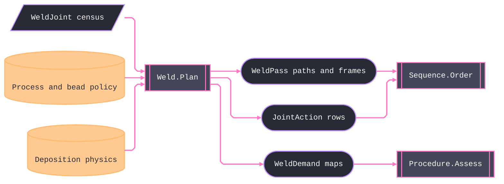

# [RASM_FABRICATION_WELD]

The weld-plan owner, `Weld.Plan`, turns a joint census into executable multi-pass deposits, root-treatment actions, procedure demands, and one content-keyed receipt. `JointPrep` carries boundary-resolved `Rasm.Materials` facts without importing the peer package: groove, fillet, plug/slot, and flare cases retain the dimensions and treatment keys their planning arms consume. `WeldPosition` models groove and fillet qualification positions, including vertical progression and fixed-pipe positions, through travel and cooling columns.

Heat input remains `HI = η·60·P/(1000·v)`. `WeldProcessLaw` couples efficiency, deposition source, travel envelope, and heat-input envelope by process key. `DepositionSource.Wire` derives volume rate from wire diameter and `WireFeedRate`; `DepositionSource.Volumetric` carries calibrated volume rate and characteristic bead width without pretending it consumes a wire-feed axis or manufacturing an equivalent diameter. Groove volume reads root face, effective throat, radius, angle, opening, side count, backing, and root treatment. Each role's actual deposition area and weave width derive its layer height before the groove stack closes; the fill weave cannot price a stringer root. Plug/slot demand is cavity volume over its fill traversal, while flare remains seam cross-section; both use the same deposition law without crossing units. Every pass owns its shifted moves and actual `Plane` frames, while `JointAction` carries groove preparation, backing, backgouge, and backing-removal operations; a `seal-pass` root treatment realizes solely as the terminal `PassRole.Seal` deposit, never a parallel action row.

Each bead remains a `boundary-pass` under `ProcessModality.Joined`; Cam and robot ingress are counterpart owners. The plan key covers complete pass, move, frame, action, and demand atoms in normalized length-prefixed bytes. Per-waypoint normals create side-correct frames, and double-sided work reverses the normal and lateral offset on the second side. Access gates precede path construction.

Wire posture: HOST-LOCAL. `WeldPass` rows, the demand rows, and the plan key cross only the in-process seam to the Cam egress, the sequence scheduler, and the procedure gate — never a browser or peer wire.

## [01]-[INDEX]

- [01]-[WELD_PLAN]: owns pass, weave, position, prep, deposition, process-law, joint-action, torch-frame, demand-production, and plan-receipt surfaces under one `Weld.Plan` fold.

## [02]-[WELD_PLAN]

- Owner: `PassRole`, `WeavePattern`, and `WeldPosition` own closed behavioral axes; `JointPrep` owns boundary facts; `DepositionSource` and `WeldProcessLaw` own process physics; `WeldJoint` and `WeldPolicy` own demand and policy; `JointAction`, `TorchFrame`, `WeldPass`, and `WeldPlan` own execution and evidence; `Weld` owns planning and heat-input projection.
- Cases: pass and weave rows parameterize bead behavior; position rows cover `1G` through `6G` progression variants and `1F` through `4F`; prep cases cover groove, fillet, plug/slot, and flare; deposition cases cover wire-derived and volumetric rates; joint actions cover groove preparation, backing, backgouge, and backing removal — seal-pass root treatment is the `PassRole.Seal` deposit, never an action row.
- Entry: `public static Fin<WeldPlan> Plan(Seq<WeldJoint> joints, WeldPolicy policy, ProcessBudget.Deposition budget)` — the ONE fold absorbing single joint and batch by the `Seq` shape: per joint it gates the seam (≥ 2 points, positive thickness, normals aligned to waypoints), gates access (`WorkAngleDeg > AccessHalfAngleDeg` → 2744), resolves η from the process key (missing row → typed fail), derives the role-coupled travel/HI rows, stacks the passes per prep case and side, verifies every realized `HI_role ≤ HeatInputCapKjMm` (2745 on overrun), emits the joint's `WeldDemand`, and mints the plan key over the LE-double preimage.
- Auto: each pass shifts the seam through its side-correct tangent-normal frame, constructs rotated `Plane` poses, derives travel and realized heat input from the process law, and preserves dwell. Groove, fillet, plug/slot, and flare arms share the same deposition and cap gates. `Joining/sequence` orders passes and joint actions; `Joining/procedure` assesses `WeldPlan.Demands`; Cam and robot owners consume moves and frames once their counterpart ingress lands.
- Receipt: `WeldPlan` carries passes with frames, joint actions, qualification demands, realized maximum heat input, bead count, and a complete `ContentKey(EgressKind.WeldPlan, digest)`.
- Packages: boundary-resolved Materials joint facts, `ProcessBudget.Deposition`, `ProcessModality.Joined`, `Move`, `ContentKey.Of`, assembly joint identity and access, Thinktecture.Runtime.Extensions, LanguageExt.Core, Rhino `Plane`, and BCL inbox surfaces compose directly.
- Growth: a new weave is one `WeavePattern` row; a new pass discipline (temper-bead, buttering) is one `PassRole` row + its stacking arm; a new arc process is one Materials row + one efficiency map entry — zero local rows; a new position is one `WeldPosition` row (both columns); narrow-gap grooves are Materials `GrooveGeometry` rows the boundary already resolves; the preheat DERIVATION (carbon-equivalent per AWS D1.1/EN 1011-2) lands as a census-boundary law when the material chemistry seam lands — the census carries the resolved `PreheatC` until then; the Cam pass-path ingress is the designed-ahead owner counterpart; zero new entrypoints.
- Boundary: the groove/process/fillet vocabulary is Materials-owned and resolves to FACTS at the boundary — a Materials type import contradicts the package's no-AEC-peer law, and a local `GrooveGeometry`/`WeldProcess` re-mint is equally dead: `JointPrep` carries resolved scalars and the process rides its KEY; the heat-input law lives HERE and a sequence- or procedure-side HI formula is the second-law defect (they read the rows); travel derives role-coupled from the heat-input target and an independent travel knob — or a role table whose `AreaFactor` no derivation reads — is the deleted form; the egress is the existing `Run(Cam)` case under `Joined`/`boundary-pass` and an eleventh owner case, a weld-local motion conditioner, or a plan-side G-code emitter is the deleted form; pose blending rides the kernel dispatch and a local slerp is the deleted form; the content preimage is canonical LE bytes and a formatted-string float preimage is the named defect; a plan bypassing the access gate ships a torch crash — the gate precedes motion, always.

```csharp signature
// --- [RUNTIME_PRELUDE] ----------------------------------------------------------------------------------------------------------------------------
using LanguageExt;
using LanguageExt.Common;
using Rasm.Fabrication.Process;
using Rasm.Numerics;
using Rhino.Geometry;
using Thinktecture;
using static LanguageExt.Prelude;

namespace Rasm.Fabrication.Joining;

// --- [TYPES] --------------------------------------------------------------------------------------------------------------------------------------
[SmartEnum<string>]
public sealed partial class PassRole {
    public static readonly PassRole Root = new("root", areaFactor: 0.7, weaveAdmitted: false);
    public static readonly PassRole HotPass = new("hot-pass", areaFactor: 0.9, weaveAdmitted: false);
    public static readonly PassRole Fill = new("fill", areaFactor: 1.0, weaveAdmitted: true);
    public static readonly PassRole Cap = new("cap", areaFactor: 0.85, weaveAdmitted: true);
    public static readonly PassRole Seal = new("seal", areaFactor: 0.6, weaveAdmitted: false);

    public double AreaFactor { get; }
    public bool WeaveAdmitted { get; }
}

[SmartEnum<string>]
public sealed partial class WeavePattern {
    public static readonly WeavePattern Stringer = new("stringer", widthFactor: 1.0, edgeDwellMs: 0);
    public static readonly WeavePattern Zigzag = new("zigzag", widthFactor: 2.5, edgeDwellMs: 150);
    public static readonly WeavePattern Crescent = new("crescent", widthFactor: 3.0, edgeDwellMs: 200);
    public static readonly WeavePattern Triangle = new("triangle", widthFactor: 3.5, edgeDwellMs: 250);

    public double WidthFactor { get; }
    public int EdgeDwellMs { get; }
}

// The position axis Materials does not carry: TravelDerate derates the role-coupled travel (vertical-up runs
// slow), CoolingScale scales the sequence's interpass wait (an overhead joint sheds heat slower).
[SmartEnum<string>]
public sealed partial class WeldPosition {
    public static readonly WeldPosition G1 = new("1g", travelDerate: 1.0, coolingScale: 1.0);
    public static readonly WeldPosition G2 = new("2g", travelDerate: 0.9, coolingScale: 1.0);
    public static readonly WeldPosition G3Up = new("3g-up", travelDerate: 0.6, coolingScale: 1.3);
    public static readonly WeldPosition G3Down = new("3g-down", travelDerate: 1.05, coolingScale: 0.9);
    public static readonly WeldPosition G4 = new("4g", travelDerate: 0.7, coolingScale: 1.15);
    public static readonly WeldPosition G5Up = new("5g-up", travelDerate: 0.55, coolingScale: 1.35);
    public static readonly WeldPosition G5Down = new("5g-down", travelDerate: 0.95, coolingScale: 1.0);
    public static readonly WeldPosition G6 = new("6g", travelDerate: 0.5, coolingScale: 1.4);
    public static readonly WeldPosition F1 = new("1f", travelDerate: 1.0, coolingScale: 1.0);
    public static readonly WeldPosition F2 = new("2f", travelDerate: 0.9, coolingScale: 1.0);
    public static readonly WeldPosition F3 = new("3f", travelDerate: 0.65, coolingScale: 1.25);
    public static readonly WeldPosition F4 = new("4f", travelDerate: 0.7, coolingScale: 1.15);

    public double TravelDerate { get; }
    public double CoolingScale { get; }
}

// --- [MODELS] -------------------------------------------------------------------------------------------------------------------------------------
// Boundary-resolved prep FACTS ([SHAPE]: GroovePrep seam — no Materials type crosses): the WeldType row selects
// the case at the census boundary; Groove.DepthMm is the prep-true fill height (PJP depth, CJP t−f) and
// EffectiveThroatMm the deduction-resolved qualification throat; Backed/Backgouge are the root-condition facts.
[Union(ConversionFromValue = ConversionOperatorsGeneration.None)]
public abstract partial record JointPrep {
    private JointPrep() { }

    public sealed record Groove(
        string GeometryKey, double WallAngleDeg, double RootOpeningMm, double RootFaceMm, double GrooveRadiusMm,
        double DepthMm, double EffectiveThroatMm, bool DoubleSided, string BackingKey, string RootTreatmentKey) : JointPrep;

    public sealed record Fillet(double LegMm, double MinLegMm) : JointPrep;
    public sealed record PlugSlot(double HoleDiameterMm, double DepthMm, double SlotLengthMm, bool Filled) : JointPrep;
    public sealed record Flare(string TypeKey, double RadiusMm, double EffectiveThroatMm) : JointPrep;
}

// The census row: seam waypoints WITH per-waypoint normals (a world-Z lateral offset collapses on a vertical
// seam); for plug/slot the same carrier is the cavity-fill traversal, so volume divides by its admitted length.
// Joint IS the assembly AssemblyJoint.Index ordinal — one identity space; the scheduler's join fails typed on
// any mismatch.
public sealed record WeldJoint(
    int Joint, Arr<Point3d> Seam, Arr<Vector3d> Normals, JointPrep Prep,
    string ProcessKey, string FillerKey, string ShieldingKey, WeldPosition Position,
    string FillerClassificationKey, string FluxKey, string ProgressionKey,
    string CurrentTypeKey, string PolarityKey, string TransferModeKey, string PassTechniqueKey,
    double ElectrodeDiameterMm, double ThicknessMm, double DiameterMm, string MaterialGroupKey,
    double PreheatC, Option<double> PwhtC, Option<double> PwhtMinutes,
    double AccessHalfAngleDeg, bool ImpactDemanded);

[Union(ConversionFromValue = ConversionOperatorsGeneration.None)]
public abstract partial record DepositionSource {
    private DepositionSource() { }

    public sealed record Wire(double DiameterMm) : DepositionSource;
    public sealed record Volumetric(double Mm3Min, double CharacteristicWidthMm) : DepositionSource;
}

public sealed record WeldProcessLaw(
    double Efficiency, DepositionSource Deposition, double TravelLowMmMin, double TravelHighMmMin,
    double HeatInputLowKjMm, double HeatInputHighKjMm);

// Efficiency: the EN 1011-1 thermal-efficiency column keyed by the Materials process KEY — arc physics is
// Fabrication's column, the process AXIS stays Materials-owned; BeadWidthWireDia and FilletStepFactor are the
// bead-geometry rows (inline 2.5/0.35 literals are the named defect).
public sealed record WeldPolicy(
    double TargetHeatInputKjMm, double HeatInputCapKjMm,
    double WorkAngleDeg, double TravelAngleDeg, WeavePattern FillWeave,
    double BeadWidthWireDia, double FilletStepFactor, int PassCap, Map<string, WeldProcessLaw> Processes) {
    public static readonly WeldPolicy Canonical = new(
        TargetHeatInputKjMm: 1.0, HeatInputCapKjMm: 2.5,
        WorkAngleDeg: 45.0, TravelAngleDeg: 10.0, WeavePattern.Zigzag,
        BeadWidthWireDia: 2.5, FilletStepFactor: 0.35, PassCap: 512,
        Map(
            ("smaw", new WeldProcessLaw(0.8, new DepositionSource.Volumetric(650.0, 4.0), 75.0, 350.0, 0.4, 2.5)),
            ("gmaw", new WeldProcessLaw(0.8, new DepositionSource.Wire(1.2), 150.0, 900.0, 0.3, 2.0)),
            ("fcaw", new WeldProcessLaw(0.8, new DepositionSource.Wire(1.2), 120.0, 700.0, 0.4, 2.5)),
            ("saw", new WeldProcessLaw(1.0, new DepositionSource.Wire(3.2), 200.0, 1200.0, 0.5, 3.5))));
}

public readonly record struct TorchFrame(int Joint, int Waypoint, Plane Pose, double WorkAngleDeg, double TravelAngleDeg) {
    // Reversed-travel pose: unwind the travel/work tilts about the pose's own axes, flip the base frame 180°
    // about its torch axis, re-apply the tilts — X tracks the reversed tangent, push/drag character preserved.
    public TorchFrame Reversed() {
        Plane pose = Pose;
        pose.Rotate(-TravelAngleDeg * Math.PI / 180.0, pose.YAxis, pose.Origin);
        pose.Rotate(-WorkAngleDeg * Math.PI / 180.0, pose.XAxis, pose.Origin);
        pose.Rotate(Math.PI, pose.ZAxis, pose.Origin);
        pose.Rotate(WorkAngleDeg * Math.PI / 180.0, pose.XAxis, pose.Origin);
        pose.Rotate(TravelAngleDeg * Math.PI / 180.0, pose.YAxis, pose.Origin);
        return this with { Pose = pose };
    }
}

[Union(ConversionFromValue = ConversionOperatorsGeneration.None)]
public abstract partial record JointAction {
    private JointAction() { }

    public sealed record PrepareGroove(
        int Joint, string GeometryKey, double WallAngleDeg, double RootOpeningMm,
        double RootFaceMm, double GrooveRadiusMm, double DepthMm, bool DoubleSided) : JointAction;
    public sealed record InstallBacking(int Joint, string BackingKey) : JointAction;
    public sealed record Backgouge(int Joint, int BeforeSide, double DepthMm) : JointAction;
    public sealed record RemoveBacking(int Joint, string BackingKey) : JointAction;
}

// The coupled pass row: role, side, groove position, weave dwell, position, travel, and heat input travel
// TOGETHER — changing one without re-deriving the others ships a cold lap or a burn-through.
public sealed record WeldPass(
    int Joint, PassRole Role, int Layer, int Side, int Ordinal, WeavePattern Weave, int EdgeDwellMs,
    WeldPosition Position, double OffsetMm, double TravelMmMin, double HeatInputKjMm, double ThicknessMm,
    Seq<Move> Path, Seq<TorchFrame> Frames);

public sealed record WeldPlan(Seq<WeldPass> Passes, Seq<JointAction> Actions, Seq<WeldDemand> Demands, double MaxHeatInputKjMm, int Beads, ContentKey Key);

// --- [OPERATIONS] ---------------------------------------------------------------------------------------------------------------------------------
public static class Weld {
    // The ONE fold: per joint — seam/access gates -> role-coupled travel/HI rows -> bead stack (groove per-side
    // recurrence | fillet leg arm) -> HI cap verify -> demand emission; then the plan key. Seq absorbs batch.
    public static Fin<WeldPlan> Plan(Seq<WeldJoint> joints, WeldPolicy policy, ProcessBudget.Deposition budget) =>
        policy is null || budget is null || joints.IsEmpty || joints.Exists(static joint => joint is null)
            || joints.Map(static joint => joint.Joint).Distinct().Count != joints.Count
            || joints.Exists(static joint => !Valid(joint))
            || policy.FillWeave is null || policy.TargetHeatInputKjMm <= 0.0 || !double.IsFinite(policy.TargetHeatInputKjMm)
            || policy.HeatInputCapKjMm <= 0.0 || !double.IsFinite(policy.HeatInputCapKjMm)
            || policy.WorkAngleDeg is < 0.0 or > 180.0 || !double.IsFinite(policy.WorkAngleDeg)
            || Math.Abs(policy.TravelAngleDeg) > 90.0 || !double.IsFinite(policy.TravelAngleDeg)
            || policy.BeadWidthWireDia <= 0.0 || !double.IsFinite(policy.BeadWidthWireDia)
            || policy.FilletStepFactor <= 0.0 || !double.IsFinite(policy.FilletStepFactor)
            || policy.PassCap is <= 0 or >= int.MaxValue
            || budget.PowerW <= 0.0 || !double.IsFinite(budget.PowerW)
            || budget.WireFeedRate <= 0.0 || !double.IsFinite(budget.WireFeedRate)
            || budget.Standoff <= 0.0 || !double.IsFinite(budget.Standoff)
            || budget.InterpassTemp <= 0.0 || !double.IsFinite(budget.InterpassTemp) || policy.Processes.IsEmpty
            || policy.Processes.Keys.Exists(string.IsNullOrWhiteSpace)
            || policy.Processes.Values.Exists(law => law is null || !Valid(law, budget))
        ? Fin.Fail<WeldPlan>(GeometryFault.DegenerateInput("weld:policy").ToError())
        : joints.TraverseM(j => PlanJoint(j, policy, budget)).As().Map(rows => {
            Seq<WeldPass> passes = rows.Bind(static r => r.Passes);
            Seq<JointAction> actions = rows.Bind(static r => r.Actions);
            Seq<WeldDemand> demands = rows.Map(static r => r.Demand);
            return new WeldPlan(
                passes,
                actions,
                demands,
                rows.Map(static r => r.MaxHi).Fold(0.0, Math.Max),
                passes.Count,
                ContentKey.Of(EgressKind.WeldPlan, CanonicalBytes(passes, actions, demands)));
        });

    // HI = η·60·V·I/(1000·v) with V·I = Deposition.PowerW — the joined-keyed budget's first consumer.
    public static double HeatInput(double eta, double powerW, double travelMmMin) => eta * 60.0 * powerW / (1000.0 * travelMmMin);

    sealed record JointRows(Seq<WeldPass> Passes, Seq<JointAction> Actions, WeldDemand Demand, double MaxHi);

    static Fin<JointRows> PlanJoint(WeldJoint j, WeldPolicy policy, ProcessBudget.Deposition budget) =>
        j.Seam.Count < 2 || j.ThicknessMm <= 0.0 || j.Normals.Count != j.Seam.Count || !PrepValid(j.Prep, j.ThicknessMm)
            || j.Seam.Zip(j.Seam.Skip(1)).Map(static pair => pair.Item1.DistanceTo(pair.Item2)).Exists(static d => d <= 1e-9 || !double.IsFinite(d))
            || toSeq(Enumerable.Range(0, j.Seam.Count)).Exists(i => !AdmitsFrame(j, i))
            ? Fin.Fail<JointRows>(GeometryFault.DegenerateInput($"weld:seam:{j.Joint}").ToError())
            : policy.WorkAngleDeg > j.AccessHalfAngleDeg
                ? Fin.Fail<JointRows>(FabricationFault.WeldAccessBlocked(j.Joint, policy.WorkAngleDeg).ToError())
                : policy.Processes.Find(j.ProcessKey)
                    .ToFin(GeometryFault.DegenerateInput($"weld:process:{j.ProcessKey}").ToError())
                    .Bind(law => {
                        double v0 = law.Efficiency * 60.0 * budget.PowerW / (1000.0 * policy.TargetHeatInputKjMm);
                        Seq<WeldPass> stack = j.Prep.Switch(
                            state: (Joint: j, Policy: policy, Budget: budget, Law: law, V0: v0),
                            groove: static (s, prep) => GrooveStack(s.Joint, prep, s.Policy, s.Budget, s.Law, s.V0),
                            fillet: static (s, prep) => FilletStack(s.Joint, Math.Max(prep.LegMm, prep.MinLegMm), s.Policy, s.Budget, s.Law, s.V0),
                            plugSlot: static (s, prep) => prep.Filled
                                ? FillVolumeStack(s.Joint, PlugSlotArea(prep) * prep.DepthMm, s.Policy, s.Budget, s.Law, s.V0)
                                : Seq<WeldPass>(),
                            flare: static (s, prep) => AreaStack(s.Joint, 0.5 * prep.EffectiveThroatMm * prep.EffectiveThroatMm, s.Policy, s.Budget, s.Law, s.V0))
                            .Take(policy.PassCap + 1);
                        double maxHi = stack.Map(static p => p.HeatInputKjMm).Fold(0.0, Math.Max);
                        return stack.IsEmpty
                            ? Fin.Fail<JointRows>(GeometryFault.DegenerateInput($"weld:prep:{j.Joint}").ToError())
                            : stack.Count > policy.PassCap
                                ? Fin.Fail<JointRows>(GeometryFault.DegenerateInput($"weld:pass-cap:{j.Joint}:{policy.PassCap}").ToError())
                            : stack.Exists(static pass => !Valid(pass))
                                ? Fin.Fail<JointRows>(GeometryFault.DegenerateInput($"weld:pass:{j.Joint}").ToError())
                            : stack.Filter(p => p.HeatInputKjMm > Math.Min(policy.HeatInputCapKjMm, law.HeatInputHighKjMm)).HeadOrNone().Match(
                                Some: p => Fin.Fail<JointRows>(FabricationFault.HeatInputExceeded(
                                    j.Joint, p.HeatInputKjMm, Math.Min(policy.HeatInputCapKjMm, law.HeatInputHighKjMm)).ToError()),
                                None: () => stack.Filter(p => p.HeatInputKjMm < law.HeatInputLowKjMm
                                        || p.TravelMmMin < law.TravelLowMmMin || p.TravelMmMin > law.TravelHighMmMin)
                                    .HeadOrNone()
                                    .Match(
                                        Some: p => Fin.Fail<JointRows>(GeometryFault.DegenerateInput(
                                            $"weld:process-envelope:{j.Joint}:{p.Ordinal}:{p.TravelMmMin:0.###}:{p.HeatInputKjMm:0.###}").ToError()),
                                        None: () => Fin.Succ(new JointRows(stack, Actions(j), Demand(j, budget, maxHi), maxHi))));
                    });

    // Role-coupled derivation: v_role = v0·derate/AreaFactor keeps the role's bead area at AreaFactor·A0, so
    // HI_role = HI_target·AreaFactor/derate — the cap gate is a real per-pass verdict, never target==realized.
    static (double Travel, double Hi) RoleRow(PassRole role, WeldPosition position, WeldProcessLaw law, double powerW, double v0) {
        double travel = v0 * position.TravelDerate / role.AreaFactor;
        return (travel, HeatInput(law.Efficiency, powerW, travel));
    }

    // Groove recurrence per SIDE over the prep-true depth: layers stack at layerHeight = A_bead/w_bead, passes
    // per layer ceil(w(h)/w_bead) with w(h) = g + 2h·tan(αw); a double-sided prep halves the depth per side and
    // the second side opens with the backgouge root when the boundary resolved Backgouge.
    static Seq<WeldPass> GrooveStack(WeldJoint j, JointPrep.Groove g, WeldPolicy policy, ProcessBudget.Deposition budget, WeldProcessLaw law, double v0) {
        double aw = g.WallAngleDeg * Math.PI / 180.0;
        int sides = g.DoubleSided ? 2 : 1;
        double sideDepth = Math.Max(g.EffectiveThroatMm, g.DepthMm - g.RootFaceMm) / sides;
        Seq<WeldPass> stack = toSeq(Enumerable.Range(0, sides))
            .Bind(side => SideStack(j, g, policy, budget, law, v0, side, sideDepth, aw))
            .Take(policy.PassCap + 1)
            .Map(static (pass, ordinal) => pass with { Ordinal = ordinal });
        if (g.RootTreatmentKey != "seal-pass")
            return stack;
        // Seal-pass root treatment has ONE execution identity: this terminal Seal deposit with its own geometry,
        // travel, and heat input — a parallel JointAction row double-charges the schedule and is the deleted form.
        (double travel, double hi) = RoleRow(PassRole.Seal, j.Position, law, budget.PowerW, v0);
        return stack.Add(Pass(
            j, policy, PassRole.Seal, layer: stack.Count, side: sides - 1, ordinal: stack.Count,
            WeavePattern.Stringer, offset: 0.0, travel, hi));
    }

    static Seq<WeldPass> SideStack(WeldJoint j, JointPrep.Groove g, WeldPolicy policy, ProcessBudget.Deposition budget, WeldProcessLaw law, double v0, int side, double depth, double aw) {
        double rootHeight = LayerHeight(PassRole.Root, WeavePattern.Stringer, j, policy, budget, law, v0);
        double hotHeight = LayerHeight(PassRole.HotPass, WeavePattern.Stringer, j, policy, budget, law, v0);
        double fillHeight = LayerHeight(PassRole.Fill, policy.FillWeave, j, policy, budget, law, v0);
        double capHeight = LayerHeight(PassRole.Cap, policy.FillWeave, j, policy, budget, law, v0);
        bool hot = depth > rootHeight + capHeight;
        int fills = CountOf(Math.Max(0.0, depth - rootHeight - capHeight - (hot ? hotHeight : 0.0)), fillHeight, policy.PassCap);
        int capLayer = 1 + (hot ? 1 : 0) + fills;
        Seq<(PassRole Role, int Layer, double Height)> plan =
            Seq1((Role: PassRole.Root, Layer: 0, Height: Math.Min(depth, rootHeight)))
            + (hot ? Seq1((Role: PassRole.HotPass, Layer: 1, Height: Math.Min(depth, rootHeight + hotHeight))) : Seq<(PassRole Role, int Layer, double Height)>())
            + toSeq(Enumerable.Range(0, fills)).Map(i =>
                (Role: PassRole.Fill, Layer: 1 + (hot ? 1 : 0) + i, Height: Math.Min(depth, rootHeight + (hot ? hotHeight : 0.0) + ((i + 1) * fillHeight))))
            + Seq1((Role: PassRole.Cap, Layer: capLayer, Height: depth));
        return plan
            .Bind(row => {
                WeavePattern weave = row.Role.WeaveAdmitted ? policy.FillWeave : WeavePattern.Stringer;
                double beadWidth = BeadWidth(weave, policy, law);
                int perLayer = row.Role == PassRole.Root ? 1 : Math.Max(1, CountOf(GrooveWidth(g, row.Height, aw), beadWidth, policy.PassCap));
                return toSeq(Enumerable.Range(0, perLayer)).Map(p => (row.Role, row.Layer, P: p, PerLayer: perLayer, Weave: weave, BeadWidth: beadWidth));
            })
            .Map((slot, ordinal) => {
                (double travel, double hi) = RoleRow(slot.Role, j.Position, law, budget.PowerW, v0);
                double offset = (slot.P - (0.5 * (slot.PerLayer - 1))) * slot.BeadWidth;
                return Pass(j, policy, slot.Role, slot.Layer, side, ordinal, slot.Weave, offset, travel, hi);
            });
    }

    static double LayerHeight(PassRole role, WeavePattern weave, WeldJoint joint, WeldPolicy policy, ProcessBudget.Deposition budget, WeldProcessLaw law, double v0) =>
        DepositionRate(law.Deposition, budget) / RoleRow(role, joint.Position, law, budget.PowerW, v0).Travel / BeadWidth(weave, policy, law);

    static double BeadWidth(WeavePattern weave, WeldPolicy policy, WeldProcessLaw law) =>
        weave.WidthFactor * law.Deposition.Switch(
            state: policy.BeadWidthWireDia,
            wire: static (factor, source) => factor * source.DiameterMm,
            volumetric: static (_, source) => source.CharacteristicWidthMm);

    static int CountOf(double demand, double capacity, int cap) {
        double count = Math.Ceiling(demand / capacity);
        return demand <= 0.0 ? 0 : !double.IsFinite(count) || count > cap ? cap + 1 : (int)count;
    }

    // Fillet arm: leg floored by the boundary-resolved J2.4 minimum; pass count from the triangular leg area;
    // the step offset walks FilletStepFactor·d per pass — a policy row, never an inline literal.
    static Seq<WeldPass> FilletStack(WeldJoint j, double legMm, WeldPolicy policy, ProcessBudget.Deposition budget, WeldProcessLaw law, double v0) {
        (double vFill, _) = RoleRow(PassRole.Fill, j.Position, law, budget.PowerW, v0);
        double beadArea = DepositionRate(law.Deposition, budget) / vFill;
        int n = Math.Max(1, CountOf(0.5 * legMm * legMm, beadArea, policy.PassCap));
        return toSeq(Enumerable.Range(0, n)).Map(p => {
            PassRole role = p == 0 ? PassRole.Root : p == n - 1 ? PassRole.Cap : PassRole.Fill;
            (double travel, double hi) = RoleRow(role, j.Position, law, budget.PowerW, v0);
            return Pass(j, policy, role, layer: p, side: 0, ordinal: p,
                p == 0 ? WeavePattern.Stringer : policy.FillWeave,
                offset: policy.FilletStepFactor * p * CharacteristicWidth(law.Deposition), travel, hi);
        });
    }

    static Seq<WeldPass> AreaStack(WeldJoint j, double requiredAreaMm2, WeldPolicy policy, ProcessBudget.Deposition budget, WeldProcessLaw law, double v0) {
        (double vFill, _) = RoleRow(PassRole.Fill, j.Position, law, budget.PowerW, v0);
        double beadArea = DepositionRate(law.Deposition, budget) / vFill;
        int count = Math.Max(1, CountOf(requiredAreaMm2, beadArea, policy.PassCap));
        return toSeq(Enumerable.Range(0, count)).Map(i => {
            PassRole role = i == 0 ? PassRole.Root : i == count - 1 ? PassRole.Cap : PassRole.Fill;
            (double travel, double hi) = RoleRow(role, j.Position, law, budget.PowerW, v0);
            return Pass(j, policy, role, i, side: 0, ordinal: i, role.WeaveAdmitted ? policy.FillWeave : WeavePattern.Stringer,
                policy.FilletStepFactor * i * CharacteristicWidth(law.Deposition), travel, hi);
        });
    }

    // Plug and slot demand is VOLUME, not groove cross-section. The boundary supplies the cavity-filling
    // traversal as Seam; each repeated layer deposits bead-area × traversal-length until the volume closes.
    static Seq<WeldPass> FillVolumeStack(WeldJoint j, double requiredVolumeMm3, WeldPolicy policy, ProcessBudget.Deposition budget, WeldProcessLaw law, double v0) {
        (double vFill, _) = RoleRow(PassRole.Fill, j.Position, law, budget.PowerW, v0);
        double beadArea = DepositionRate(law.Deposition, budget) / vFill;
        double traversal = j.Seam.Zip(j.Seam.Skip(1)).Map(static pair => pair.Item1.DistanceTo(pair.Item2)).Sum();
        int count = Math.Max(1, CountOf(requiredVolumeMm3, beadArea * traversal, policy.PassCap));
        return toSeq(Enumerable.Range(0, count)).Map(i => {
            PassRole role = i == 0 ? PassRole.Root : i == count - 1 ? PassRole.Cap : PassRole.Fill;
            (double travel, double hi) = RoleRow(role, j.Position, law, budget.PowerW, v0);
            return Pass(j, policy, role, layer: i, side: 0, ordinal: i,
                role.WeaveAdmitted ? policy.FillWeave : WeavePattern.Stringer, offset: 0.0, travel, hi);
        });
    }

    // The pass path: the seam shifted along the per-waypoint tangent×normal frame by the groove offset with a
    // rapid link in — the shift VALUE is this page's; conditioning executes in the Cam fold downstream.
    static WeldPass Pass(WeldJoint j, WeldPolicy policy, PassRole role, int layer, int side, int ordinal, WeavePattern weave, double offset, double travel, double hi) {
        double signedOffset = side == 0 ? offset : -offset;
        Seq<Move> path = Seq1<Move>(new Move.Rapid(Shift(j, 0, offset, side)))
            + toSeq(Enumerable.Range(0, j.Seam.Count)).Map(i => (Move)new Move.Linear(Shift(j, i, offset, side), travel));
        Seq<TorchFrame> frames = toSeq(Enumerable.Range(0, j.Seam.Count)).Map(i => Frame(j, i, offset, side, policy));
        return new WeldPass(j.Joint, role, layer, side, ordinal, weave, weave.EdgeDwellMs, j.Position, signedOffset, travel, hi, j.ThicknessMm, path, frames);
    }

    static TorchFrame Frame(WeldJoint j, int i, double offset, int side, WeldPolicy policy) {
        (Vector3d travel, Vector3d lateral, Vector3d normal) = RequiredAxes(j, i, side);
        Point3d at = j.Seam[i] + (offset * lateral);
        Plane pose = new(at, travel, Vector3d.CrossProduct(normal, travel));
        pose.Rotate(policy.WorkAngleDeg * Math.PI / 180.0, pose.XAxis, pose.Origin);
        pose.Rotate(policy.TravelAngleDeg * Math.PI / 180.0, pose.YAxis, pose.Origin);
        return new TorchFrame(j.Joint, i, pose, policy.WorkAngleDeg, policy.TravelAngleDeg);
    }

    // The demand chain producer: every procedure gate field has a source — keys and position off the census,
    // thickness/preheat off the joint, the interpass ceiling off the budget, the realized HI off the stack.
    static WeldDemand Demand(WeldJoint j, ProcessBudget.Deposition budget, double maxHi) =>
        new(j.Joint, Map<EssentialVariable, QualificationValue>(
            (EssentialVariable.Process, new QualificationValue.Categorical(j.ProcessKey)),
            (EssentialVariable.WeldType, new QualificationValue.Categorical(PrepType(j.Prep))),
            (EssentialVariable.GrooveGeometry, GrooveValue(j.Prep)),
            (EssentialVariable.FillerMetal, new QualificationValue.Categorical(j.FillerKey)),
            (EssentialVariable.FillerClassification, new QualificationValue.Categorical(j.FillerClassificationKey)),
            (EssentialVariable.ShieldingGas, OptionalText(j.ShieldingKey)),
            (EssentialVariable.Flux, OptionalText(j.FluxKey)),
            (EssentialVariable.Position, new QualificationValue.Categorical(j.Position.Key)),
            (EssentialVariable.Progression, new QualificationValue.Categorical(j.ProgressionKey)),
            (EssentialVariable.CurrentType, new QualificationValue.Categorical(j.CurrentTypeKey)),
            (EssentialVariable.Polarity, new QualificationValue.Categorical(j.PolarityKey)),
            (EssentialVariable.TransferMode, new QualificationValue.Categorical(j.TransferModeKey)),
            (EssentialVariable.ElectrodeDiameter, new QualificationValue.Numeric(j.ElectrodeDiameterMm)),
            (EssentialVariable.BaseMaterialGroup, new QualificationValue.Categorical(j.MaterialGroupKey)),
            (EssentialVariable.ThicknessRange, new QualificationValue.Numeric(j.ThicknessMm)),
            (EssentialVariable.DiameterRange, OptionalNumber(j.DiameterMm > 0.0 ? Some(j.DiameterMm) : None)),
            (EssentialVariable.Preheat, new QualificationValue.Numeric(j.PreheatC)),
            (EssentialVariable.Interpass, new QualificationValue.Numeric(budget.InterpassTemp)),
            (EssentialVariable.HeatInput, new QualificationValue.Numeric(maxHi)),
            (EssentialVariable.PwhtTemperature, OptionalNumber(j.PwhtC)),
            (EssentialVariable.PwhtDuration, OptionalNumber(j.PwhtMinutes)),
            (EssentialVariable.ImpactQualification, new QualificationValue.Boolean(j.ImpactDemanded)),
            (EssentialVariable.Backing, BackingValue(j.Prep)),
            (EssentialVariable.RootTreatment, RootTreatmentValue(j.Prep)),
            (EssentialVariable.PassTechnique, new QualificationValue.Categorical(j.PassTechniqueKey))));

    // Canonical LE preimage: pass count, then per pass its role/side ordinals and LE-double waypoint triples —
    // a formatted-string float preimage re-spells doubles and is the named BYTE_IDENTITY defect.
    static byte[] CanonicalBytes(Seq<WeldPass> passes, Seq<JointAction> actions, Seq<WeldDemand> demands) {
        System.Buffers.ArrayBufferWriter<byte> writer = new();
        WriteInt(writer, passes.Count);
        passes.Iter(p => {
            WriteInt(writer, p.Joint); WriteString(writer, p.Role.Key); WriteInt(writer, p.Layer); WriteInt(writer, p.Side); WriteInt(writer, p.Ordinal);
            WriteString(writer, p.Weave.Key); WriteInt(writer, p.EdgeDwellMs); WriteString(writer, p.Position.Key);
            WriteDouble(writer, p.OffsetMm); WriteDouble(writer, p.TravelMmMin); WriteDouble(writer, p.HeatInputKjMm); WriteDouble(writer, p.ThicknessMm);
            WriteInt(writer, p.Path.Count);
            p.Path.Iter(move => move.Switch(
                state: writer,
                rapid: static (sink, value) => { WriteString(sink, "rapid"); WritePoint(sink, value.Target); return unit; },
                linear: static (sink, value) => { WriteString(sink, "linear"); WritePoint(sink, value.Target); WriteDouble(sink, value.Feed); return unit; },
                circular: static (sink, value) => {
                    WriteString(sink, "circular"); WritePoint(sink, value.Target); WriteDouble(sink, value.Feed);
                    WritePoint(sink, value.Arc.Center); WriteString(sink, value.Arc.Sense.Key); return unit;
                }));
            WriteInt(writer, p.Frames.Count);
            p.Frames.Iter(frame => {
                WriteInt(writer, frame.Waypoint); WritePlane(writer, frame.Pose);
                WriteDouble(writer, frame.WorkAngleDeg); WriteDouble(writer, frame.TravelAngleDeg);
            });
        });
        WriteInt(writer, actions.Count);
        actions.Iter(action => {
            action.Switch(
                state: writer,
                prepareGroove: static (sink, value) => {
                    WriteString(sink, "prepare-groove"); WriteInt(sink, value.Joint); WriteString(sink, value.GeometryKey);
                    WriteDouble(sink, value.WallAngleDeg); WriteDouble(sink, value.RootOpeningMm); WriteDouble(sink, value.RootFaceMm);
                    WriteDouble(sink, value.GrooveRadiusMm); WriteDouble(sink, value.DepthMm); WriteInt(sink, value.DoubleSided ? 1 : 0); return unit;
                },
                installBacking: static (sink, value) => { WriteString(sink, "install-backing"); WriteInt(sink, value.Joint); WriteString(sink, value.BackingKey); return unit; },
                backgouge: static (sink, value) => { WriteString(sink, "backgouge"); WriteInt(sink, value.Joint); WriteInt(sink, value.BeforeSide); WriteDouble(sink, value.DepthMm); return unit; },
                removeBacking: static (sink, value) => { WriteString(sink, "remove-backing"); WriteInt(sink, value.Joint); WriteString(sink, value.BackingKey); return unit; });
        });
        WriteInt(writer, demands.Count);
        demands.Iter(d => {
            WriteInt(writer, d.Joint);
            toSeq(EssentialVariable.Items).Filter(static variable => variable != EssentialVariable.ProcedureValidity).Iter(variable => {
                WriteString(writer, variable.Key);
                d.Values[variable].Switch(
                    numeric: value => { WriteString(writer, "number"); WriteDouble(writer, value.Value); return unit; },
                    categorical: value => { WriteString(writer, "text"); WriteString(writer, value.Value); return unit; },
                    boolean: value => { WriteString(writer, "boolean"); WriteInt(writer, value.Value ? 1 : 0); return unit; },
                    temporal: value => { WriteString(writer, "instant"); WriteLong(writer, value.Value.ToUnixTimeTicks()); return unit; },
                    notApplicable: _ => { WriteString(writer, "not-applicable"); return unit; });
            });
        });
        return writer.WrittenSpan.ToArray();
    }

    static void WriteInt(System.Buffers.ArrayBufferWriter<byte> writer, int value) {
        System.Buffers.Binary.BinaryPrimitives.WriteInt32LittleEndian(writer.GetSpan(4), value);
        writer.Advance(4);
    }

    static void WriteDouble(System.Buffers.ArrayBufferWriter<byte> writer, double value) {
        System.Buffers.Binary.BinaryPrimitives.WriteDoubleLittleEndian(writer.GetSpan(8), value);
        writer.Advance(8);
    }

    static void WriteLong(System.Buffers.ArrayBufferWriter<byte> writer, long value) {
        System.Buffers.Binary.BinaryPrimitives.WriteInt64LittleEndian(writer.GetSpan(8), value);
        writer.Advance(8);
    }

    static void WriteString(System.Buffers.ArrayBufferWriter<byte> writer, string value) {
        byte[] bytes = System.Text.Encoding.UTF8.GetBytes(value.Normalize(System.Text.NormalizationForm.FormC));
        WriteInt(writer, bytes.Length);
        bytes.AsSpan().CopyTo(writer.GetSpan(bytes.Length));
        writer.Advance(bytes.Length);
    }

    static void WritePlane(System.Buffers.ArrayBufferWriter<byte> writer, Plane plane) {
        WriteDouble(writer, plane.Origin.X); WriteDouble(writer, plane.Origin.Y); WriteDouble(writer, plane.Origin.Z);
        WriteDouble(writer, plane.XAxis.X); WriteDouble(writer, plane.XAxis.Y); WriteDouble(writer, plane.XAxis.Z);
        WriteDouble(writer, plane.YAxis.X); WriteDouble(writer, plane.YAxis.Y); WriteDouble(writer, plane.YAxis.Z);
    }

    static void WritePoint(System.Buffers.ArrayBufferWriter<byte> writer, Point3d point) {
        WriteDouble(writer, point.X); WriteDouble(writer, point.Y); WriteDouble(writer, point.Z);
    }

    // Lateral shift in the seam's own frame: tangent × per-waypoint normal — a world-Z cross collapses on a
    // vertical seam, so the frame is joint data.
    static Point3d Shift(WeldJoint j, int i, double offset, int side) =>
        j.Seam[i] + (offset * RequiredAxes(j, i, side).Lateral);

    static Vector3d TangentAt(Arr<Point3d> seam, int i) {
        Vector3d t = seam[Math.Min(i + 1, seam.Count - 1)] - seam[Math.Max(i - 1, 0)];
        t.Unitize();
        return t;
    }

    static bool AdmitsFrame(WeldJoint j, int i) {
        Vector3d travel = TangentAt(j.Seam, i);
        Vector3d normal = j.Normals[i];
        Vector3d lateral = Vector3d.CrossProduct(travel, normal);
        return !travel.IsTiny() && normal.Unitize() && lateral.Unitize();
    }

    static (Vector3d Travel, Vector3d Lateral, Vector3d Normal) RequiredAxes(WeldJoint j, int i, int side) {
        Vector3d travel = TangentAt(j.Seam, i);
        Vector3d normal = side == 0 ? j.Normals[i] : -j.Normals[i];
        normal.Unitize();
        Vector3d lateral = Vector3d.CrossProduct(travel, normal);
        lateral.Unitize();
        return (travel, lateral, normal);
    }

    static Seq<JointAction> Actions(WeldJoint joint) => joint.Prep.Switch(
        state: joint.Joint,
        groove: static (jointId, prep) =>
            (prep.GeometryKey == "square" ? Seq<JointAction>() : Seq1<JointAction>(new JointAction.PrepareGroove(
                jointId, prep.GeometryKey, prep.WallAngleDeg, prep.RootOpeningMm, prep.RootFaceMm,
                prep.GrooveRadiusMm, prep.DepthMm, prep.DoubleSided)))
            + (prep.BackingKey == "none" ? Seq<JointAction>() : Seq1<JointAction>(new JointAction.InstallBacking(jointId, prep.BackingKey)))
            + (prep.RootTreatmentKey == "backgouge" ? Seq1<JointAction>(new JointAction.Backgouge(
                jointId, BeforeSide: 1, Math.Max(prep.RootFaceMm, prep.DepthMm - prep.EffectiveThroatMm))) : Seq<JointAction>())
            + (prep.BackingKey is "copper" or "ceramic" ? Seq1<JointAction>(new JointAction.RemoveBacking(jointId, prep.BackingKey)) : Seq<JointAction>()),
        fillet: static (_, _) => Seq<JointAction>(),
        plugSlot: static (_, _) => Seq<JointAction>(),
        flare: static (_, _) => Seq<JointAction>());

    static double DepositionRate(DepositionSource source, ProcessBudget.Deposition budget) => source.Switch(
        state: budget.WireFeedRate,
        wire: static (wireFeed, source) => 0.25 * Math.PI * source.DiameterMm * source.DiameterMm * wireFeed * 1000.0,
        volumetric: static (_, source) => source.Mm3Min);

    static double CharacteristicWidth(DepositionSource source) => source.Switch(
        wire: static value => value.DiameterMm,
        volumetric: static value => value.CharacteristicWidthMm);

    static double GrooveWidth(JointPrep.Groove groove, double height, double wallAngle) =>
        groove.RootOpeningMm + (2.0 * height * Math.Tan(wallAngle))
        + (groove.GrooveRadiusMm > 0.0 ? 2.0 * Math.Sqrt(Math.Max(0.0, (2.0 * groove.GrooveRadiusMm * height) - (height * height))) : 0.0);

    static double PlugSlotArea(JointPrep.PlugSlot prep) =>
        prep.SlotLengthMm > prep.HoleDiameterMm
            ? (prep.HoleDiameterMm * (prep.SlotLengthMm - prep.HoleDiameterMm)) + (0.25 * Math.PI * prep.HoleDiameterMm * prep.HoleDiameterMm)
            : 0.25 * Math.PI * prep.HoleDiameterMm * prep.HoleDiameterMm;

    static bool Valid(WeldPass pass) =>
        pass is not null && pass.Role is not null && pass.Weave is not null && pass.Position is not null
        && pass.Layer >= 0 && pass.Side >= 0 && pass.Ordinal >= 0 && pass.EdgeDwellMs >= 0
        && double.IsFinite(pass.OffsetMm) && pass.TravelMmMin > 0.0 && double.IsFinite(pass.TravelMmMin)
        && pass.HeatInputKjMm > 0.0 && double.IsFinite(pass.HeatInputKjMm)
        && pass.ThicknessMm > 0.0 && double.IsFinite(pass.ThicknessMm)
        && pass.Path.Count == pass.Frames.Count + 1 && pass.Frames.Count >= 2
        && !pass.Path.Exists(static move => move is null or Move.Circular)
        && pass.Path.ForAll(static move => move.Switch(
            rapid: static value => value.Target.IsValid,
            linear: static value => value.Target.IsValid && value.Feed > 0.0 && double.IsFinite(value.Feed),
            circular: static _ => false))
        && pass.Frames.ForAll(static frame => frame.Pose.IsValid);

    static bool Valid(WeldProcessLaw law, ProcessBudget.Deposition budget) =>
        law is not null && law.Efficiency is > 0.0 and <= 1.0 && double.IsFinite(law.Efficiency)
        && law.TravelLowMmMin > 0.0 && law.TravelLowMmMin <= law.TravelHighMmMin
        && double.IsFinite(law.TravelLowMmMin) && double.IsFinite(law.TravelHighMmMin)
        && law.HeatInputLowKjMm > 0.0 && law.HeatInputLowKjMm <= law.HeatInputHighKjMm
        && double.IsFinite(law.HeatInputLowKjMm) && double.IsFinite(law.HeatInputHighKjMm)
        && Valid(law.Deposition)
        && DepositionRate(law.Deposition, budget) > 0.0 && double.IsFinite(DepositionRate(law.Deposition, budget));

    static bool Valid(DepositionSource source) => source is not null && source.Switch(
        wire: static value => value.DiameterMm > 0.0 && double.IsFinite(value.DiameterMm),
        volumetric: static value => value.Mm3Min > 0.0 && double.IsFinite(value.Mm3Min)
            && value.CharacteristicWidthMm > 0.0 && double.IsFinite(value.CharacteristicWidthMm));

    static bool Valid(WeldJoint joint) =>
        joint is not null && joint.Joint >= 0 && joint.Prep is not null && joint.Position is not null
        && !string.IsNullOrWhiteSpace(joint.ProcessKey) && !string.IsNullOrWhiteSpace(joint.FillerKey)
        && !string.IsNullOrWhiteSpace(joint.FillerClassificationKey)
        && !string.IsNullOrWhiteSpace(joint.ProgressionKey) && !string.IsNullOrWhiteSpace(joint.CurrentTypeKey)
        && !string.IsNullOrWhiteSpace(joint.PolarityKey) && !string.IsNullOrWhiteSpace(joint.TransferModeKey)
        && !string.IsNullOrWhiteSpace(joint.PassTechniqueKey) && !string.IsNullOrWhiteSpace(joint.MaterialGroupKey)
        && joint.ElectrodeDiameterMm > 0.0 && double.IsFinite(joint.ElectrodeDiameterMm)
        && joint.ThicknessMm > 0.0 && double.IsFinite(joint.ThicknessMm)
        && joint.DiameterMm >= 0.0 && double.IsFinite(joint.DiameterMm)
        && joint.PreheatC >= 0.0 && double.IsFinite(joint.PreheatC)
        && joint.AccessHalfAngleDeg is >= 0.0 and <= 180.0 && double.IsFinite(joint.AccessHalfAngleDeg)
        && joint.PwhtC.IsSome == joint.PwhtMinutes.IsSome
        && joint.PwhtC.ForAll(static value => value > 0.0 && double.IsFinite(value))
        && joint.PwhtMinutes.ForAll(static value => value > 0.0 && double.IsFinite(value));

    static bool PrepValid(JointPrep prep, double thicknessMm) => prep.Switch(
        state: thicknessMm,
        groove: static (t, value) => value.WallAngleDeg is >= 0.0 and < 90.0
            && double.IsFinite(value.WallAngleDeg) && double.IsFinite(value.RootOpeningMm)
            && double.IsFinite(value.RootFaceMm) && double.IsFinite(value.GrooveRadiusMm)
            && double.IsFinite(value.DepthMm) && double.IsFinite(value.EffectiveThroatMm)
            && !string.IsNullOrWhiteSpace(value.GeometryKey) && !string.IsNullOrWhiteSpace(value.BackingKey)
            && !string.IsNullOrWhiteSpace(value.RootTreatmentKey)
            && value.RootOpeningMm >= 0.0 && value.RootFaceMm >= 0.0 && value.GrooveRadiusMm >= 0.0
            && value.DepthMm > 0.0 && value.DepthMm <= t && value.EffectiveThroatMm > 0.0 && value.EffectiveThroatMm <= value.DepthMm
            && (!value.DoubleSided || value.RootTreatmentKey is "backgouge" or "seal-pass" or "as-welded"),
        fillet: static (_, value) => value.LegMm > 0.0 && value.MinLegMm > 0.0
            && double.IsFinite(value.LegMm) && double.IsFinite(value.MinLegMm),
        plugSlot: static (t, value) => value.HoleDiameterMm > 0.0 && value.DepthMm > 0.0 && value.DepthMm <= t
            && value.SlotLengthMm >= value.HoleDiameterMm && double.IsFinite(value.HoleDiameterMm)
            && double.IsFinite(value.DepthMm) && double.IsFinite(value.SlotLengthMm),
        flare: static (_, value) => value.RadiusMm > 0.0 && value.EffectiveThroatMm > 0.0
            && double.IsFinite(value.RadiusMm) && double.IsFinite(value.EffectiveThroatMm)
            && !string.IsNullOrWhiteSpace(value.TypeKey));

    static QualificationValue OptionalNumber(Option<double> value) => value.Match<QualificationValue>(
        Some: static number => new QualificationValue.Numeric(number),
        None: static () => new QualificationValue.NotApplicable());

    static QualificationValue OptionalText(string value) => string.IsNullOrWhiteSpace(value)
        ? new QualificationValue.NotApplicable()
        : new QualificationValue.Categorical(value);

    static string PrepType(JointPrep prep) => prep.Switch(
        groove: static _ => "groove",
        fillet: static _ => "fillet",
        plugSlot: static value => value.SlotLengthMm > value.HoleDiameterMm ? "slot" : "plug",
        flare: static value => value.TypeKey);

    static QualificationValue GrooveValue(JointPrep prep) => prep.Switch<QualificationValue>(
        groove: static value => new QualificationValue.Categorical(value.GeometryKey),
        fillet: static _ => new QualificationValue.NotApplicable(),
        plugSlot: static _ => new QualificationValue.NotApplicable(),
        flare: static _ => new QualificationValue.NotApplicable());

    static QualificationValue BackingValue(JointPrep prep) => prep.Switch<QualificationValue>(
        groove: static value => new QualificationValue.Categorical(value.BackingKey),
        fillet: static _ => new QualificationValue.NotApplicable(),
        plugSlot: static _ => new QualificationValue.NotApplicable(),
        flare: static _ => new QualificationValue.NotApplicable());

    static QualificationValue RootTreatmentValue(JointPrep prep) => prep.Switch<QualificationValue>(
        groove: static value => new QualificationValue.Categorical(value.RootTreatmentKey),
        fillet: static _ => new QualificationValue.NotApplicable(),
        plugSlot: static _ => new QualificationValue.NotApplicable(),
        flare: static _ => new QualificationValue.NotApplicable());
}
```


