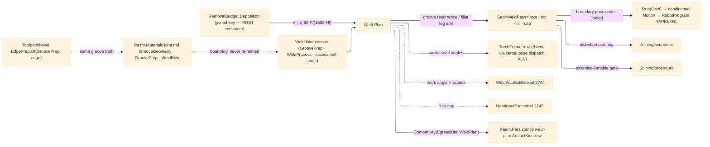

# [RASM_FABRICATION_WELD]

The weld-plan owner: `Weld` the static surface whose ONE `Plan` fold turns a joint census into the multi-pass bead-stack a torch executes — groove joints filled root → hot-pass → fill layers → cap over the Materials-OWNED groove vocabulary, fillet joints sized from the AISC J2.4 leg floor, every pass carrying its coupled weave, travel, and heat-input row. The joining vocabulary is `Rasm.Materials` `Component/joint`'s and is CONSUMED at the boundary, never re-minted: `GrooveGeometry` (the 9-row AWS A2.4 axis — included/bevel angle, root radius, double-sided flag), `GroovePrep` (geometry + penetration + backing + as-prepared root opening/face, the `EffectiveThroatMm` projection), `WeldProcess` (`smaw`/`gmaw`/`fcaw`/`saw`, the PJP deduction column), and the `WeldRow.MinimumFilletLegMm` published J2.4 bounds — this page adds the ARC-physics column Materials does not carry (the EN 1011-1 thermal-efficiency factor per process row) and the fill geometry. Heat input is the ONE law `HI = η·60·V·I/(1000·v)` kJ/mm with `V·I` read as the landed `RemovalBudget.Deposition.PowerW` — the `joined`-keyed physics map entry's FIRST consumer (`Process/physics#CUT_PARAMETER` mild-steel/stainless `joined → Deposition` rows); travel speed is DERIVED from the target heat input, never a free knob beside it, and a demanded fill that cannot hold the cap routes `HeatInputExceeded` 2745 typed.

The egress is the EXISTING rail, no eleventh owner case: each planned bead is one conditioned `boundary-pass` under the `ProcessModality.Joined` admission — the torch `Motion` egresses through `Run(Cam)` exactly as a cut pass does (the Cam fold conditions per feed move; the `Kinematics/cell` `RobotProgram.Solve` posts the RAPID/KRL arc rows for the `weld` process's articulated-arm machines), and the plan record itself keys `EgressKind.WeldPlan` through the ONE `ContentKey.Of` fold with its Persistence `ArtifactKind` enrollment riding this page. Groove-prep CUTTING rides the landed `Toolpath/bevel` boundary — `EdgePrep.Of(GroovePrep, edge)` maps the same Materials row this page fills, so the prep program and the fill plan read ONE groove truth. Torch orientation is frame data on the pass rows (work angle across the seam, travel angle push/drag along it); keyframe pose BLENDING between seam corners rides the kernel one-slerp owner through its public pose dispatch (`Processing/intent` `VectorIntent` pose case carrying the `MotionInterpolation` mode row) — a local slerp beside it is the deleted form. Access is a plan-time gate: a demanded work angle outside the joint's access half-angle (the `Fixturing/assembly` census column) routes `WeldAccessBlocked` 2744 before any motion is planned.

Wire posture: HOST-LOCAL. `WeldPass` rows and the plan key cross only the in-process seam to the Cam egress, the sequence scheduler, and the procedure gate — never a browser or peer wire.

## [01]-[INDEX]

- [01]-[WELD_PLAN]: owns the `PassRole`/`WeavePattern` vocabularies, the `WeldJoint` census row over the Materials boundary, the `WeldPolicy` carrier with the EN 1011-1 efficiency column, the `WeldPass`/`TorchFrame`/`WeldPlan` receipts, and the ONE `Weld.Plan` fold — groove-area recurrence, bead-stack layering, fillet leg-floor arm, heat-input law, access gate, `weld-plan` content key.

## [02]-[WELD_PLAN]

- Owner: `PassRole` `[SmartEnum<string>]` (`root`/`hot-pass`/`fill`/`cap`) binding `AreaFactor` (bead cross-section relative to nominal) and `WeaveAdmitted` (root and hot-pass run stringers only); `WeavePattern` `[SmartEnum<string>]` (`stringer`/`zigzag`/`crescent`/`triangle`) binding `WidthFactor` (bead width in wire diameters) and `EdgeDwellMs` (the sidewall fusion hold); `WeldJoint` the census row — seam polyline, the Materials `GroovePrep` + `WeldProcess` rows composed at the boundary, part thickness, the assembly access half-angle, and the `Option<double>` fillet leg discriminating the fillet arm; `WeldPolicy` the ONE carrier (wire diameter, target/cap heat input, work/travel angles, fill weave, the `Map<WeldProcess, double>` EN 1011-1 efficiency column); `TorchFrame` the per-waypoint pose row; `WeldPass` the coupled pass row (role, layer, ordinal, weave, lateral offset, travel speed, heat input, part thickness, path); `WeldPlan` the receipt (passes + frames + max heat input + bead count + `ContentKey`); `Weld` the static surface owning `Plan` and `HeatInput`.
- Cases: `PassRole` rows 4 — `root` {0.7, stringer-only} · `hot-pass` {0.9, stringer-only} · `fill` {1.0, weave} · `cap` {0.85, weave}; `WeavePattern` rows 4 — `stringer` {1.0, 0} · `zigzag` {2.5, 150} · `crescent` {3.0, 200} · `triangle` {3.5, 250}; the joint arm discriminates on input shape — `FilletLegMm.Some` sizes the leg from `max(demanded, WeldRow.MinimumFilletLegMm(t))` and stacks `⌈(leg²/2)/A_bead⌉` triangular passes, `None` runs the groove recurrence: wall angle `αw = Included > 0 ? Included/2 : BevelAngle`, groove area `A = g·t + (t−f)²·tan αw · (DoubleSided ? ½ : 1)`, bead area from deposition continuity `A_bead = (π·d²/4)·(WFR·1000)/v`, layer width `w(h) = g + 2h·tan αw`, passes per layer `⌈w(h)/w_bead⌉` — the pass COUNT is a recurrence over row data, never a hand-picked schedule.
- Entry: `public static Fin<WeldPlan> Plan(Seq<WeldJoint> joints, WeldPolicy policy, RemovalBudget.Deposition budget)` — the ONE fold absorbing single joint and batch by input shape: per joint it gates access (`WorkAngleDeg > AccessHalfAngleDeg` → `FabricationFault.WeldAccessBlocked(joint, angle)` 2744), derives travel from the target heat input `v = η·60·P/(1000·HI)`, stacks the bead passes, verifies the realized `HI ≤ HeatInputCapKjMm` (`HeatInputExceeded(joint, hi, cap)` 2745 on overrun), and mints the plan key; a degenerate seam (under 2 points, zero thickness) routes the kernel `GeometryFault.DegenerateInput`, never a silent skip.
- Auto: `Plan` reads `policy.EfficiencyK.Find(joint.Process)` for η (the EN 1011-1 k-factor — `saw` 1.0, the shielded arcs 0.8; the column lives HERE because the Materials `WeldProcess` row carries structural deductions, not arc physics); each pass's path is the seam polyline laterally shifted by its `OffsetMm` groove position with rapid links between beads — the shifted VALUE is computed here, the conditioned motion is the Cam fold's (`Guard`/`Workholding`/`Magazine` execute there, the pass never bypasses conditioning); `TorchFrame` rows seat the work/travel angles on the seam tangent per waypoint, corner-to-corner orientation blending stated onto the kernel pose dispatch; `Joining/sequence` re-orders the emitted passes for distortion under the assembly `Precedence`; `Joining/procedure` gates the realized heat input against the qualified WPS band; `Verify/estimation` prices arc-on time from the pass travel rows; the bevel prep program reads the SAME `GroovePrep` row through `EdgePrep.Of`.
- Receipt: `WeldPlan` IS the typed evidence — the ordered coupled `WeldPass` rows, the torch frames, the realized max heat input, the bead count, and the `ContentKey(EgressKind.WeldPlan, digest)`; no generic weld ledger and no plane-internal type on a result case (the plan crosses on its content key; the torch `Motion` is the Cam egress's).
- Packages: `Rasm.Materials` `Component/joint#JOINT` (`GrooveGeometry` rows `joint.md:97`, `GroovePrep` `:239`, `WeldProcess` `:82-87`, `WeldRow.MinimumFilletLegMm` `:313` — composed at the boundary, never re-minted), `Process/physics#CUT_PARAMETER` (`RemovalBudget.Deposition` — the `joined`-keyed heat-input budget, FIRST consumer), `Process/family#PROCESS_FAMILY` (`ProcessModality.Joined` `boundary-pass` admission, `ProcessKind.Weld`), `Process/owner#FABRICATION_OWNER` (`Move`/`EgressKind.WeldPlan`/`ContentKey.Of`), `Toolpath/bevel#BEVEL` (`EdgePrep.Of` — the prep-cut counterpart), `Fixturing/assembly#ASSEMBLY` (the access half-angle census), kernel `Parametric/projections#MOTION` via the `Processing/intent` pose dispatch (K19 — the one slerp), Thinktecture.Runtime.Extensions, LanguageExt.Core, Rhino.Geometry, BCL inbox.
- Growth: a new weave is one `WeavePattern` row; a new pass discipline (temper-bead, buttering) is one `PassRole` row + its stacking arm; a new arc process is one Materials `WeldProcess` row + one efficiency map entry — zero local rows; positional derating (vertical-up/overhead travel factors) is one policy column the travel derivation reads; narrow-gap grooves are Materials `GrooveGeometry` rows this fold already stacks; zero new entrypoints.
- Boundary: the groove/process/fillet vocabulary is Materials-owned and a local `GrooveGeometry`/`WeldProcess`/leg-table sibling is the deleted form — this page adds ONLY the arc-efficiency column and the fill geometry; the heat-input law lives HERE and a sequence- or procedure-side HI formula is the second-law defect (they read the pass rows); travel speed derives from the heat-input target and an independent travel knob beside the cap is the deleted form; the egress is the existing `Run(Cam)` case under `Joined`/`boundary-pass` and an eleventh owner case, a weld-local motion conditioner, or a plan-side G-code emitter is the deleted form (RAPID/KRL is the cell's, G-code the posting rail's); pose blending rides the kernel dispatch and a local slerp is the deleted form; a plan bypassing the access gate ships a torch crash — the gate precedes motion, always.

```csharp signature
// --- [RUNTIME_PRELUDE] ----------------------------------------------------------------------------------------------------------------------------
using LanguageExt;
using LanguageExt.Common;
using Rasm.Fabrication.Process;
using Rasm.Materials.Component;      // GrooveGeometry · GroovePrep · WeldProcess · WeldRow — the Materials-owned joining vocabulary, consumed
using Rasm.Numerics;
using Rhino.Geometry;
using Thinktecture;
using static LanguageExt.Prelude;

namespace Rasm.Fabrication.Joining;

// --- [TYPES] --------------------------------------------------------------------------------------------------------------------------------------
[SmartEnum<string>]
public sealed partial class PassRole {
    public static readonly PassRole Root = new("root", areaFactor: 0.7, weaveAdmitted: false);
    public static readonly PassRole HotPass = new("hot-pass", areaFactor: 0.9, weaveAdmitted: false);
    public static readonly PassRole Fill = new("fill", areaFactor: 1.0, weaveAdmitted: true);
    public static readonly PassRole Cap = new("cap", areaFactor: 0.85, weaveAdmitted: true);

    public double AreaFactor { get; }
    public bool WeaveAdmitted { get; }
}

[SmartEnum<string>]
public sealed partial class WeavePattern {
    public static readonly WeavePattern Stringer = new("stringer", widthFactor: 1.0, edgeDwellMs: 0);
    public static readonly WeavePattern Zigzag = new("zigzag", widthFactor: 2.5, edgeDwellMs: 150);
    public static readonly WeavePattern Crescent = new("crescent", widthFactor: 3.0, edgeDwellMs: 200);
    public static readonly WeavePattern Triangle = new("triangle", widthFactor: 3.5, edgeDwellMs: 250);

    public double WidthFactor { get; }
    public int EdgeDwellMs { get; }
}

// --- [MODELS] -------------------------------------------------------------------------------------------------------------------------------------
// The census row: Materials rows composed at the boundary (GroovePrep/WeldProcess), the access half-angle
// from the assembly census, FilletLegMm.Some discriminating the fillet arm off the groove recurrence.
public sealed record WeldJoint(
    int Joint, Arr<Point3d> Seam, GroovePrep Prep, WeldProcess Process,
    double ThicknessMm, double AccessHalfAngleDeg, Option<double> FilletLegMm);

// EfficiencyK: the EN 1011-1 thermal-efficiency column keyed by the Materials process row — arc physics is
// Fabrication's column, the process AXIS stays Materials-owned.
public sealed record WeldPolicy(
    double WireDiameterMm, double TargetHeatInputKjMm, double HeatInputCapKjMm,
    double WorkAngleDeg, double TravelAngleDeg, WeavePattern FillWeave, Map<WeldProcess, double> EfficiencyK) {
    public static readonly WeldPolicy Canonical = new(
        WireDiameterMm: 1.2, TargetHeatInputKjMm: 1.0, HeatInputCapKjMm: 2.5,
        WorkAngleDeg: 45.0, TravelAngleDeg: 10.0, WeavePattern.Zigzag,
        Map((WeldProcess.Smaw, 0.8), (WeldProcess.Gmaw, 0.8), (WeldProcess.Fcaw, 0.8), (WeldProcess.Saw, 1.0)));
}

public readonly record struct TorchFrame(int Joint, Point3d At, Vector3d Travel, double WorkAngleDeg, double TravelAngleDeg);

// The coupled pass row: role, groove position, travel, and heat input travel TOGETHER — changing one
// without re-deriving the others ships a cold lap or a burn-through.
public sealed record WeldPass(
    int Joint, PassRole Role, int Layer, int Ordinal, WeavePattern Weave,
    double OffsetMm, double TravelMmMin, double HeatInputKjMm, double ThicknessMm, Seq<Move> Path);

public sealed record WeldPlan(Seq<WeldPass> Passes, Seq<TorchFrame> Frames, double MaxHeatInputKjMm, int Beads, ContentKey Key);

// --- [OPERATIONS] ---------------------------------------------------------------------------------------------------------------------------------
public static class Weld {
    // The ONE fold: access gate -> travel from target HI -> bead stack (groove recurrence | fillet leg arm)
    // -> HI cap verify -> weld-plan content key. Seq absorbs single joint and batch.
    public static Fin<WeldPlan> Plan(Seq<WeldJoint> joints, WeldPolicy policy, RemovalBudget.Deposition budget) {
        Seq<WeldPass> passes = default;
        Seq<TorchFrame> frames = default;
        double maxHi = 0.0;
        foreach (WeldJoint j in joints) {
            if (j.Seam.Count < 2 || j.ThicknessMm <= 0.0)
                return Fin.Fail<WeldPlan>(GeometryFault.DegenerateInput($"weld:seam:{j.Joint}").ToError());
            if (policy.WorkAngleDeg > j.AccessHalfAngleDeg)
                return Fin.Fail<WeldPlan>(FabricationFault.WeldAccessBlocked(j.Joint, policy.WorkAngleDeg).ToError());

            double eta = policy.EfficiencyK.Find(j.Process).IfNone(0.8);
            double travel = eta * 60.0 * budget.PowerW / (1000.0 * policy.TargetHeatInputKjMm);      // v from HI target — never a free knob
            double hi = HeatInput(eta, budget.PowerW, travel);
            if (hi > policy.HeatInputCapKjMm)
                return Fin.Fail<WeldPlan>(FabricationFault.HeatInputExceeded(j.Joint, hi, policy.HeatInputCapKjMm).ToError());

            Seq<WeldPass> stack = j.FilletLegMm.Match(
                Some: leg => FilletStack(j, Math.Max(leg, WeldRow.MinimumFilletLegMm(j.ThicknessMm)), policy, budget, travel, hi),
                None: () => GrooveStack(j, policy, budget, travel, hi));
            passes += stack;
            frames += j.Seam.ToSeq().Map((i, p) => new TorchFrame(j.Joint, p, TangentAt(j.Seam, i), policy.WorkAngleDeg, policy.TravelAngleDeg)).ToSeq();
            maxHi = Math.Max(maxHi, hi);
        }
        byte[] canonical = passes.Bind(p => p.Path).Map(m => $"{m.To.X:0.###},{m.To.Y:0.###},{m.To.Z:0.###}").ToArray()
            is { } rows ? System.Text.Encoding.UTF8.GetBytes(string.Join(";", rows)) : [];
        return Fin.Succ(new WeldPlan(passes, frames, maxHi, passes.Count, ContentKey.Of(EgressKind.WeldPlan, canonical)));
    }

    // HI = eta*60*V*I/(1000*v) with V*I = Deposition.PowerW — the joined-keyed budget's first consumer.
    public static double HeatInput(double eta, double powerW, double travelMmMin) => eta * 60.0 * powerW / (1000.0 * travelMmMin);

    // Groove recurrence: A = g*t + (t-f)^2*tan(aw)*(double-sided ? 0.5 : 1); layers stack until depth t-f,
    // passes per layer ceil(w(h)/w_bead) with w(h) = g + 2h*tan(aw); root/hot/fill/cap roles off the row table.
    static Seq<WeldPass> GrooveStack(WeldJoint j, WeldPolicy policy, RemovalBudget.Deposition budget, double travel, double hi) {
        double aw = (j.Prep.IncludedAngleDeg > 0.0 ? 0.5 * j.Prep.IncludedAngleDeg : j.Prep.BevelAngleDeg) * Math.PI / 180.0;
        double g = j.Prep.RootOpeningMm, f = j.Prep.RootFaceMm, t = j.ThicknessMm;
        double beadArea = 0.25 * Math.PI * policy.WireDiameterMm * policy.WireDiameterMm * (budget.WireFeedRate * 1000.0) / travel;
        double beadWidth = policy.FillWeave.WidthFactor * 2.5 * policy.WireDiameterMm;
        double layerHeight = beadArea / beadWidth;
        Seq<WeldPass> stack = Seq1(Pass(j, PassRole.Root, layer: 0, ordinal: 0, WeavePattern.Stringer, offset: 0.0, travel, hi));
        int ordinal = 1, layer = 1;
        for (double h = f + layerHeight * PassRole.HotPass.AreaFactor; h < t - layerHeight; h += layerHeight, layer++) {
            double width = g + 2.0 * h * Math.Tan(aw);
            int perLayer = Math.Max(1, (int)Math.Ceiling(width / beadWidth));
            for (int p = 0; p < perLayer; p++)
                stack = stack.Add(Pass(j, layer == 1 ? PassRole.HotPass : PassRole.Fill, layer, ordinal++,
                    layer == 1 ? WeavePattern.Stringer : policy.FillWeave, offset: (p - 0.5 * (perLayer - 1)) * beadWidth, travel, hi));
        }
        int capBeads = Math.Max(1, (int)Math.Ceiling((g + 2.0 * (t - f) * Math.Tan(aw)) / beadWidth));
        for (int p = 0; p < capBeads; p++)
            stack = stack.Add(Pass(j, PassRole.Cap, layer, ordinal++, policy.FillWeave, offset: (p - 0.5 * (capBeads - 1)) * beadWidth, travel, hi));
        return stack;
    }

    // Fillet arm: leg floored by the AISC J2.4 published bounds; pass count from the triangular leg area.
    static Seq<WeldPass> FilletStack(WeldJoint j, double legMm, WeldPolicy policy, RemovalBudget.Deposition budget, double travel, double hi) {
        double beadArea = 0.25 * Math.PI * policy.WireDiameterMm * policy.WireDiameterMm * (budget.WireFeedRate * 1000.0) / travel;
        int n = Math.Max(1, (int)Math.Ceiling(0.5 * legMm * legMm / beadArea));
        return toSeq(Enumerable.Range(0, n)).Map(p => Pass(
            j, p == 0 ? PassRole.Root : p == n - 1 ? PassRole.Cap : PassRole.Fill, layer: p, ordinal: p,
            p == 0 ? WeavePattern.Stringer : policy.FillWeave, offset: 0.35 * p * policy.WireDiameterMm, travel, hi));
    }

    // The pass path: the seam shifted by the groove offset with a rapid link in — the shift VALUE is this
    // page's; conditioning (guard/workholding/magazine) executes in the Cam fold the pass egresses through.
    static WeldPass Pass(WeldJoint j, PassRole role, int layer, int ordinal, WeavePattern weave, double offset, double travel, double hi) {
        Seq<Move> path = Seq1(new Move(Shift(j.Seam, 0, offset), Rapid: true, Feed: 0.0))
            + j.Seam.ToSeq().Map((i, _) => new Move(Shift(j.Seam, i, offset), Rapid: false, Feed: travel)).ToSeq();
        return new WeldPass(j.Joint, role, layer, ordinal, weave, offset, travel, hi, j.ThicknessMm, path);
    }

    static Point3d Shift(Arr<Point3d> seam, int i, double offset) {
        Vector3d n = Vector3d.CrossProduct(TangentAt(seam, i), Vector3d.ZAxis);
        return n.Unitize() ? seam[i] + offset * n : seam[i];
    }

    static Vector3d TangentAt(Arr<Point3d> seam, int i) {
        Vector3d t = seam[Math.Min(i + 1, seam.Count - 1)] - seam[Math.Max(i - 1, 0)];
        return t.Unitize() ? t : Vector3d.XAxis;
    }
}
```


