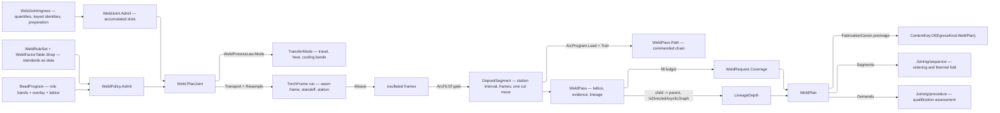

# [RASM_FABRICATION_WELD]

`Weld.Plan` consumes one admitted `WeldRequest` and derives fill-complete bead deposits, side-correct transported torch frames, station-indexed deposit segments, preparation actions, qualification demands, and one content-keyed `WeldPlan`. Boundary-resolved preparation profiles carry the full section and cavity demand; planning never recreates `Rasm.Materials` groove geometry from a key or a nominal leg.

A welding standard is a RULE SET, never a scalar row: `WeldRuleSet` carries the heat band, torch attitude, side-crossover fraction, pass ceiling, volume tolerances, and the factor table a caller supplies, and `WeldRuleSet.Shop` is the one named preset holding the landed defaults. `WeldFactorTable` seats the role, position, and prep-shape derates as data, so a code revision moves rows rather than re-spelling a smart-enum column or a union arm. `WeldProcessLaw` converts `ProcessBudget.Joining` into deposited volume through one `TransferMode` per transfer mode, and `BeadProgram` derives role and oscillation from fraction bands: fill roles close the groove while butter and temper overlays deposit outside it.

Bead placement is a two-dimensional lattice, not a vertical stack: `FillProfile` resolves the trapezoidal section at the current fill height through one held `IInterpolation` per section column, and `BeadProgram.Lattice` seats as many overlapped beads across that width as it admits. `ArcProgram` places run-in, backstep, run-out, and crater dwell on the emitted path and arc clock, while `ArcFitPolicy` gates a circular fit over the transported torch frames so an orbital seam emits `Move.Circular` carrying its rotation sense and a non-circular run keeps the linear chain.

`WeldPass.Segments` is the station-indexed seam wire every downstream plane reads: each `DepositSegment` owns its station interval, its own frames, and its own commanded move, and `DepositSegment.Window` is the ONE geometry that re-cuts a sub-interval — so `Joining/sequence` orders and subdivides deposits without index-joining a commanded path against a frame roster the arc program already lengthened. `WeldProjection` parameterizes execution, qualification, and receipt egress without moving scheduling, kinematics, posting, or procedure ownership into joining.

## [01]-[INDEX]

- [02]-[JOINT_ADMISSION]: the closed weld vocabularies, keyed identities, section and span geometry, `FillProfile`, `RootProgram`, `JointPrep`, and the `WeldJointIngress` gate.
- [03]-[DEPOSITION_LAW]: factor tables, `WeldRuleSet`, deposition sources, transfer modes, process law, oscillation, role bands, the arc program and its circular-fit gate, access constraints, demand bindings, and `WeldPolicy`.
- [04]-[PASS_GENERATION]: torch frames, station-indexed deposit segments, bead evidence, `WeldPass`, `JointAction`, and the transport, weave, and pass folds.
- [05]-[WELD_PLAN]: `WeldRequest`, the fill ledger, `WeldPlan`, its projections, the canonical preimage, and `Weld.Plan`.

## [02]-[JOINT_ADMISSION]

- Owner: `WeldCode` owns the governing-code identity and carries no number; `PassRole` and `WeldPosition` own role and position SEMANTICS alone; `WeldProgression`, `WeldCurrent`, `WeldPolarity`, and `PassTechnique` close the electrical and technique vocabularies a transfer mode gates on; `ConsumableKey`, `MaterialGroupKey`, `TransferModeKey`, `PreparationKey`, and `DefectKey` own the open catalogue identities; `SectionStation`, `DepositSpan`, and `FillProfile` own boundary-resolved fill geometry; `RootProgram` owns preparation behaviour and the side schedule; `JointPrep` owns preparation modality and `PrepShape` the heat-flow derate axis it projects; `WeldJoint` owns one admitted joint.
- Cases: `JointPrep.Groove`, `.Fillet`, `.Cavity`, and `.Flare` carry fill demand without local geometry formulae, the groove case preserving geometry and penetration identities independently. `RootProgram` covers no treatment, backing, backgouging, combined backing and backgouging, and seal deposition.
- Law: a numeric derate is TABLE data — `PassRole` carries only whether the role deposits into the groove, admits oscillation, and holds for inspection, `WeldPosition` only whether the position admits oscillation, and `JointPrep` only the `PrepShape` its case discriminates. Area, travel, current, cooling, deposition, and heat-flow factors resolve through `WeldFactorTable`, so a code revision that re-rates 3G uphill or a double-sided groove edits one row rather than an arm no shop can reach.
- Law: `FillProfile` holds ONE `IInterpolation` per section column, built once per profile from the admitted station array. Section area, width, root width, and height read that held view, and `VolumeMm3` is the exact integral of the area spline over each deposit span — the trapezoid fold over interleaved span-and-station breakpoints is the deleted form, because the linear spline integrates the same function in closed form.
- Law: `FillProfile.VolumeMm3` is the complete boundary-resolved deposit demand, including unequal fillet legs, contour, reinforcement, root opening and face, backing displacement, groove radii, variable section, plug or slot cavity, flare throat, side split, and repair excavation.
- Exemption: `FillProfile.Built` is the interpolant-assembly kernel; every other body on this cluster is expression-shaped.
- Boundary: a value owner whose arguments are already canonical scalars and generated owners carries NO hand `Admit` — the generated `Validate`/`TryCreate` is the branch-law boundary form, so only an owner performing a real unit conversion or built by this page's own fold declares one.
- Entry: `WeldJoint.Admit(WeldJointIngress)` is the ONE construction. The ingress carries `UnitsNet` length, angle, temperature, and duration quantities and one keyed identity per catalogue axis; admission converts once into canonical millimetre, degree, Celsius, and minute fields and accumulates every violated invariant through `AdmissionSlots`, so a malformed joint reports its whole defect set rather than the first clause that tripped.
- Packages: Thinktecture.Runtime.Extensions supplies `[Union]`, `[SmartEnum<string>]`, `[ValueObject<string>]`, `[ComplexValueObject]`, and `[ValidationError<FabricationFault>]`; LanguageExt.Core supplies `Fin`, `Validation`, `Option`, `Map`, `Set`, `Seq`, `Traverse`, `Apply`, and `Fold`; MathNet.Numerics supplies `Interpolate.Linear` and `IInterpolation`; UnitsNet supplies typed boundary quantities; RhinoCommon supplies `Point3d` and `Vector3d`; `Rasm.Element` supplies `AdmissionSlots`; `Rasm.Fabrication.Process` supplies `ProcessBudget.Joining`, `Admission`, `FabricationFault`, and `FabConcern.Joining`.
- Boundary: `Rasm.Materials` supplies material, penetration, and qualification identities; callers resolve preparation geometry into the local `FillProfile`. Containment, area, and interpolation are defined only over the admitted station range, so a station outside it clamps to the terminal section rather than extrapolating a spline past its data.

```csharp signature
// --- [RUNTIME_PRELUDE] ----------------------------------------------------------------------------------------------------------------------------
using System.Linq;
using System.Runtime.InteropServices;
using LanguageExt;
using LanguageExt.Common;
using LanguageExt.Traits;
using MathNet.Numerics;
using MathNet.Numerics.Interpolation;
using NodaTime;
using QuikGraph;
using QuikGraph.Algorithms;
using Rasm.Domain;
using Rasm.Element.Projection;
using Rasm.Fabrication.Process;
using Rhino.Geometry;
using Thinktecture;
using UnitsNet;
using UnitsNet.Units;
using static LanguageExt.Prelude;

namespace Rasm.Fabrication.Joining;

// --- [TYPES] --------------------------------------------------------------------------------------------------------------------------------------
// The code is an IDENTITY. Its numbers are shop data on `WeldRuleSet`, because two shops welding to one code hold
// different heat targets and a scalar column here would make the code name lie about one of them.
[SmartEnum<string>]
public sealed partial class WeldCode {
    public static readonly WeldCode AwsD11 = new("aws-d1.1");
    public static readonly WeldCode Iso15614 = new("iso-15614");
    public static readonly WeldCode AsmeIx = new("asme-ix");
    public static readonly WeldCode Iso3834 = new("iso-3834");
}

// Role SEMANTICS only: whether the deposit closes the groove, whether the role may oscillate, whether it holds for
// inspection. Every derate is a `WeldFactorTable` row.
[SmartEnum<string>]
public sealed partial class PassRole {
    public static readonly PassRole Tack = new("tack", deposits: true, oscillates: false, holds: false);
    public static readonly PassRole Root = new("root", deposits: true, oscillates: false, holds: true);
    public static readonly PassRole HotPass = new("hot-pass", deposits: true, oscillates: false, holds: false);
    public static readonly PassRole Fill = new("fill", deposits: true, oscillates: true, holds: false);
    public static readonly PassRole Cap = new("cap", deposits: true, oscillates: true, holds: true);
    public static readonly PassRole Seal = new("seal", deposits: true, oscillates: false, holds: true);
    public static readonly PassRole Butter = new("butter", deposits: false, oscillates: true, holds: false);
    public static readonly PassRole Temper = new("temper", deposits: false, oscillates: false, holds: false);
    public static readonly PassRole Buildup = new("buildup", deposits: true, oscillates: true, holds: false);
    public static readonly PassRole Repair = new("repair", deposits: true, oscillates: true, holds: true);

    // Butter and temper metal lands OUTSIDE the groove, so it never advances the fill ledger.
    public bool Deposits { get; }
    public bool OscillationAdmitted { get; }
    public bool HoldForInspection { get; }

    public double FillContribution => Deposits ? 1.0 : 0.0;
}

[SmartEnum<string>]
public sealed partial class WeldPosition {
    public static readonly WeldPosition G1 = new("1g", oscillates: true);
    public static readonly WeldPosition G2 = new("2g", oscillates: true);
    public static readonly WeldPosition G3Up = new("3g-up", oscillates: true);
    public static readonly WeldPosition G3Down = new("3g-down", oscillates: false);
    public static readonly WeldPosition G4 = new("4g", oscillates: false);
    public static readonly WeldPosition G5Up = new("5g-up", oscillates: true);
    public static readonly WeldPosition G5Down = new("5g-down", oscillates: false);
    public static readonly WeldPosition G6 = new("6g", oscillates: true);
    public static readonly WeldPosition F1 = new("1f", oscillates: true);
    public static readonly WeldPosition F2 = new("2f", oscillates: true);
    public static readonly WeldPosition F3 = new("3f", oscillates: true);
    public static readonly WeldPosition F4 = new("4f", oscillates: false);

    public bool OscillationAdmitted { get; }
}

[SmartEnum<string>]
public sealed partial class WeldProgression {
    public static readonly WeldProgression Flat = new("flat");
    public static readonly WeldProgression Uphill = new("uphill");
    public static readonly WeldProgression Downhill = new("downhill");
}

[SmartEnum<string>]
public sealed partial class WeldCurrent {
    public static readonly WeldCurrent Direct = new("direct");
    public static readonly WeldCurrent Alternating = new("alternating");
    public static readonly WeldCurrent Pulsed = new("pulsed");
}

[SmartEnum<string>]
public sealed partial class WeldPolarity {
    public static readonly WeldPolarity ElectrodePositive = new("electrode-positive");
    public static readonly WeldPolarity ElectrodeNegative = new("electrode-negative");
    public static readonly WeldPolarity Variable = new("variable");
}

[SmartEnum<string>]
public sealed partial class PassTechnique {
    public static readonly PassTechnique Stringer = new("stringer");
    public static readonly PassTechnique Weave = new("weave");
}

[SmartEnum<string>]
public sealed partial class CavityKind {
    public static readonly CavityKind Plug = new("plug");
    public static readonly CavityKind Slot = new("slot");
}

[SmartEnum<string>]
public sealed partial class FlareKind {
    public static readonly FlareKind Bevel = new("flare-bevel");
    public static readonly FlareKind V = new("flare-v");
}

// The heat-flow derate axis. `JointPrep` is a union carrying preparation PAYLOAD, so it can key no table; this is the
// discriminant it projects, and the single- and double-sided groove are two rows because the two conduct differently.
[SmartEnum<string>]
public sealed partial class PrepShape {
    public static readonly PrepShape SingleGroove = new("single-groove");
    public static readonly PrepShape DoubleGroove = new("double-groove");
    public static readonly PrepShape Fillet = new("fillet");
    public static readonly PrepShape Cavity = new("cavity");
    public static readonly PrepShape Flare = new("flare");
}

// Catalogue identities are OPEN vocabularies the shop owns, so each is a keyed owner rather than a bare string a
// consumer can transpose with its neighbour: a filler identity and a flux identity are two types, not two strings.
[ValueObject<string>(KeyMemberName = "Value", KeyMemberAccessModifier = AccessModifier.Public)]
[ValidationError<FabricationFault>]
public readonly partial struct ConsumableKey {
    [BoundaryAdapter]
    static partial void ValidateFactoryArguments(ref FabricationFault? validationError, ref string value) {
        value = value.Trim();
        if (!Witness.Keyed(value))
            validationError = new FabricationFault.PolicyInadmissible(FabConcern.Joining, "consumable-key");
    }

    public static Fin<ConsumableKey> Admit(string value) => Admission.OfValue<ConsumableKey, string>(value);
}

[ValueObject<string>(KeyMemberName = "Value", KeyMemberAccessModifier = AccessModifier.Public)]
[ValidationError<FabricationFault>]
public readonly partial struct MaterialGroupKey {
    [BoundaryAdapter]
    static partial void ValidateFactoryArguments(ref FabricationFault? validationError, ref string value) {
        value = value.Trim();
        if (!Witness.Keyed(value))
            validationError = new FabricationFault.PolicyInadmissible(FabConcern.Joining, "material-group-key");
    }

    public static Fin<MaterialGroupKey> Admit(string value) => Admission.OfValue<MaterialGroupKey, string>(value);
}

[ValueObject<string>(KeyMemberName = "Value", KeyMemberAccessModifier = AccessModifier.Public)]
[ValidationError<FabricationFault>]
public readonly partial struct TransferModeKey {
    [BoundaryAdapter]
    static partial void ValidateFactoryArguments(ref FabricationFault? validationError, ref string value) {
        value = value.Trim();
        if (!Witness.Keyed(value))
            validationError = new FabricationFault.PolicyInadmissible(FabConcern.Joining, "transfer-mode-key");
    }

    public static Fin<TransferModeKey> Admit(string value) => Admission.OfValue<TransferModeKey, string>(value);
}

// One identity covers every preparation catalogue reference — groove geometry, penetration class, fillet contour,
// backing product — because each is the same fact under a different axis and the JointPrep case names the axis.
[ValueObject<string>(KeyMemberName = "Value", KeyMemberAccessModifier = AccessModifier.Public)]
[ValidationError<FabricationFault>]
public readonly partial struct PreparationKey {
    [BoundaryAdapter]
    static partial void ValidateFactoryArguments(ref FabricationFault? validationError, ref string value) {
        value = value.Trim();
        if (!Witness.Keyed(value))
            validationError = new FabricationFault.PolicyInadmissible(FabConcern.Joining, "preparation-key");
    }

    public static Fin<PreparationKey> Admit(string value) => Admission.OfValue<PreparationKey, string>(value);
}

[ValueObject<string>(KeyMemberName = "Value", KeyMemberAccessModifier = AccessModifier.Public)]
[ValidationError<FabricationFault>]
public readonly partial struct DefectKey {
    [BoundaryAdapter]
    static partial void ValidateFactoryArguments(ref FabricationFault? validationError, ref string value) {
        value = value.Trim();
        if (!Witness.Keyed(value))
            validationError = new FabricationFault.PolicyInadmissible(FabConcern.Joining, "defect-key");
    }

    public static Fin<DefectKey> Admit(string value) => Admission.OfValue<DefectKey, string>(value);
}

// --- [MODELS] -------------------------------------------------------------------------------------------------------------------------------------
[ComplexValueObject]
[ValidationError<FabricationFault>]
[StructLayout(LayoutKind.Auto)]
public readonly partial struct SectionStation {
    public double StationMm { get; }
    public double WidthMm { get; }
    public double RootWidthMm { get; }
    public double HeightMm { get; }
    public double AreaMm2 => 0.5 * (WidthMm + RootWidthMm) * HeightMm;

    [BoundaryAdapter]
    static partial void ValidateFactoryArguments(
        ref FabricationFault? validationError,
        ref double stationMm,
        ref double widthMm,
        ref double rootWidthMm,
        ref double heightMm) {
        if (stationMm < 0.0 || !Witness.Positive(widthMm) || !Witness.Positive(heightMm)
            || !double.IsFinite(rootWidthMm) || rootWidthMm < 0.0 || rootWidthMm > widthMm)
            validationError = new FabricationFault.PolicyInadmissible(FabConcern.Joining, "section-station");
    }
}

[ComplexValueObject]
[ValidationError<FabricationFault>]
[StructLayout(LayoutKind.Auto)]
public readonly partial struct DepositSpan {
    public double StartMm { get; }
    public double EndMm { get; }

    public double LengthMm => EndMm - StartMm;

    [BoundaryAdapter]
    static partial void ValidateFactoryArguments(
        ref FabricationFault? validationError,
        ref double startMm,
        ref double endMm) {
        if (startMm < 0.0 || startMm >= endMm || !double.IsFinite(startMm) || !double.IsFinite(endMm))
            validationError = new FabricationFault.PolicyInadmissible(FabConcern.Joining, "deposit-span");
    }

    public bool Contains(double stationMm) => stationMm >= StartMm && stationMm <= EndMm;
}

public readonly record struct FillSection(double AreaMm2, double WidthMm, double RootWidthMm, double HeightMm);

// One linear spline per section column, built once per profile and HELD: section reads, the fill-height inverse, and
// the exact span integral all read this view, so a fill fold pays one build rather than one interpolation walk per
// query. The view derives from the admitted stations, so it is out of construction, equality, and every codec.
public sealed record ProfileCurves(
    IInterpolation Area,
    IInterpolation Width,
    IInterpolation RootWidth,
    IInterpolation Height,
    double FirstStationMm,
    double LastStationMm);

[ComplexValueObject]
[ValidationError<FabricationFault>]
public sealed partial class FillProfile {
    public Arr<SectionStation> Stations { get; }
    public Arr<DepositSpan> Spans { get; }
    public double EffectiveThroatMm { get; }
    public double ReinforcementMm { get; }
    public double ToeRadiusMm { get; }

    [IgnoreMember]
    private ProfileCurves? curves;

    private ProfileCurves Curves => curves ??= Built(Stations);

    private static ProfileCurves Built(Arr<SectionStation> stations) {
        double[] axis = [.. stations.Map(static row => row.StationMm)];
        return new ProfileCurves(
            Interpolate.Linear(axis, [.. stations.Map(static row => row.AreaMm2)]),
            Interpolate.Linear(axis, [.. stations.Map(static row => row.WidthMm)]),
            Interpolate.Linear(axis, [.. stations.Map(static row => row.RootWidthMm)]),
            Interpolate.Linear(axis, [.. stations.Map(static row => row.HeightMm)]),
            axis[0],
            axis[^1]);
    }

    [BoundaryAdapter]
    static partial void ValidateFactoryArguments(
        ref FabricationFault? validationError,
        ref Arr<SectionStation> stations,
        ref Arr<DepositSpan> spans,
        ref double effectiveThroatMm,
        ref double reinforcementMm,
        ref double toeRadiusMm) {
        if (!Witness.Positive(effectiveThroatMm)
            || !double.IsFinite(reinforcementMm) || reinforcementMm < 0.0
            || !double.IsFinite(toeRadiusMm) || toeRadiusMm < 0.0
            || stations.Count < 2 || spans.IsEmpty
            || stations[0].StationMm != 0.0
            || !toSeq(stations).Zip(toSeq(stations).Tail).ForAll(static pair => pair.Item1.StationMm < pair.Item2.StationMm)
            || !toSeq(spans).Zip(toSeq(spans).Tail).ForAll(static pair => pair.Item1.EndMm < pair.Item2.StartMm)
            || spans[^1].EndMm > stations[^1].StationMm)
            validationError = new FabricationFault.PolicyInadmissible(FabConcern.Joining, "fill-profile");
    }

    public static Fin<FillProfile> Admit(
        Arr<SectionStation> stations,
        Arr<DepositSpan> spans,
        UnitsNet.Length effectiveThroat,
        UnitsNet.Length reinforcement,
        UnitsNet.Length toeRadius) =>
        Validate(
            stations,
            spans,
            effectiveThroat.As(LengthUnit.Millimeter),
            reinforcement.As(LengthUnit.Millimeter),
            toeRadius.As(LengthUnit.Millimeter),
            out FillProfile profile).Admitted(profile);

    // The linear spline integrates in closed form, so the demand is the exact area integral over each deposit span
    // and no breakpoint interleave runs. Spans are disjoint by admission, so the sum double-counts nothing.
    public double VolumeMm3 => toSeq(Spans).Fold(0.0, (sum, span) => sum + Curves.Area.Integrate(span.StartMm, span.EndMm));

    public double EnvelopeWidthMm => Stations.Map(static row => row.WidthMm).Fold(0.0, Math.Max);
    public double EnvelopeRootWidthMm => Stations.Map(static row => row.RootWidthMm).Fold(double.MaxValue, Math.Min);
    public double EnvelopeHeightMm => Stations.Map(static row => row.HeightMm).Fold(0.0, Math.Max);
    public double DepositLengthMm => toSeq(Spans).Fold(0.0, static (sum, span) => sum + span.LengthMm);

    public FillSection Section(double stationMm) {
        double at = Math.Clamp(stationMm, Curves.FirstStationMm, Curves.LastStationMm);
        return new FillSection(
            Curves.Area.Interpolate(at),
            Curves.Width.Interpolate(at),
            Curves.RootWidth.Interpolate(at),
            Curves.Height.Interpolate(at));
    }

    // Envelope section is the trapezoid root -> face; a square groove degenerates to the constant-width arm.
    public double WidthAtHeight(double heightMm) => EnvelopeRootWidthMm
        + ((EnvelopeWidthMm - EnvelopeRootWidthMm) * Math.Clamp(heightMm / EnvelopeHeightMm, 0.0, 1.0));

    public double HeightAtFill(double fraction) {
        double taper = (EnvelopeWidthMm - EnvelopeRootWidthMm) / EnvelopeHeightMm;
        double area = 0.5 * (EnvelopeRootWidthMm + EnvelopeWidthMm) * EnvelopeHeightMm * Math.Clamp(fraction, 0.0, 1.0);
        return taper <= 0.0
            ? area / EnvelopeRootWidthMm
            : (Math.Sqrt((EnvelopeRootWidthMm * EnvelopeRootWidthMm) + (2.0 * taper * area)) - EnvelopeRootWidthMm) / taper;
    }

    public bool Fits(Arr<Point3d> seam) => Spans[^1].EndMm <= toSeq(seam).Zip(toSeq(seam).Tail)
        .Fold(0.0, static (sum, pair) => sum + pair.Item1.DistanceTo(pair.Item2));
}

[Union(ConversionFromValue = ConversionOperatorsGeneration.None)]
public abstract partial record RootProgram {
    private RootProgram() { }

    public sealed record None : RootProgram;
    public sealed record Backing(PreparationKey Product, bool RemoveAfterWeld) : RootProgram;
    public sealed record Backgouge(double DepthMm, int BeforeSide) : RootProgram;
    public sealed record BackingAndBackgouge(
        PreparationKey Product,
        bool RemoveAfterWeld,
        double DepthMm,
        int BeforeSide) : RootProgram;
    public sealed record Seal(int Side) : RootProgram;

    public bool Admitted => Switch(
        none: static _ => true,
        backing: static _ => true,
        backgouge: static value => Witness.Positive(value.DepthMm) && value.BeforeSide is 0 or 1,
        backingAndBackgouge: static value => Witness.Positive(value.DepthMm) && value.BeforeSide is 0 or 1,
        seal: static value => value.Side is 0 or 1);

    // Side the deposit opens on; a double-sided groove flips to its complement once the first side reaches half fill.
    public int FirstSide => Switch(
        none: static _ => 0,
        backing: static _ => 0,
        backgouge: static value => 1 - value.BeforeSide,
        backingAndBackgouge: static value => 1 - value.BeforeSide,
        seal: static value => 1 - value.Side);
}

[Union(ConversionFromValue = ConversionOperatorsGeneration.None)]
public abstract partial record JointPrep {
    private JointPrep() { }

    public sealed record Groove(
        PreparationKey Geometry,
        PreparationKey Penetration,
        FillProfile Fill,
        RootProgram Root,
        bool DoubleSided) : JointPrep;
    public sealed record Fillet(PreparationKey Contour, FillProfile Fill, double LegAMm, double LegBMm) : JointPrep;
    public sealed record Cavity(CavityKind Kind, FillProfile Fill) : JointPrep;
    public sealed record Flare(FlareKind Kind, FillProfile Fill, double RadiusMm) : JointPrep;

    public FillProfile Demand => Switch(
        groove: static value => value.Fill,
        fillet: static value => value.Fill,
        cavity: static value => value.Fill,
        flare: static value => value.Fill);

    public string QualificationType => Switch(
        groove: static _ => "groove",
        fillet: static _ => "fillet",
        cavity: static value => value.Kind.Key,
        flare: static value => value.Kind.Key);

    // The derate axis, never the derate: the shop's `WeldFactorTable` holds the numbers a code revision re-rates.
    public PrepShape Shape => Switch(
        groove: static value => value.DoubleSided ? PrepShape.DoubleGroove : PrepShape.SingleGroove,
        fillet: static _ => PrepShape.Fillet,
        cavity: static _ => PrepShape.Cavity,
        flare: static _ => PrepShape.Flare);

    public int FirstSide => Switch(
        groove: static value => value.Root.FirstSide,
        fillet: static _ => 0,
        cavity: static _ => 0,
        flare: static _ => 0);

    public bool DoubleSided => Switch(
        groove: static value => value.DoubleSided,
        fillet: static _ => false,
        cavity: static _ => false,
        flare: static _ => false);

    public bool Admitted(double thicknessMm) => Demand.VolumeMm3 > 0.0 && Switch(
        state: thicknessMm,
        groove: static (thickness, value) => value.Root.Admitted
            && value.Fill.EffectiveThroatMm <= thickness
            && (!value.DoubleSided || value.Root is not RootProgram.None),
        fillet: static (_, value) => Witness.Positive(value.LegAMm) && Witness.Positive(value.LegBMm),
        cavity: static (_, _) => true,
        flare: static (_, value) => Witness.Positive(value.RadiusMm));
}

// The 26-slot admission collapses onto one ingress shape: a caller builds the record, admission reads it once, and
// the argument order stops being the correctness surface a positional call site cannot verify.
public sealed record WeldJointIngress(
    int Joint,
    Arr<Point3d> Seam,
    Arr<Vector3d> Normals,
    Angle NormalTolerance,
    JointPrep Prep,
    ProcessKind Process,
    WeldPosition Position,
    WeldProgression Progression,
    WeldCurrent Current,
    WeldPolarity Polarity,
    PassTechnique Technique,
    MaterialGroupKey MaterialGroup,
    UnitsNet.Length ElectrodeDiameter,
    UnitsNet.Length Thickness,
    Temperature Preheat,
    InspectionBasis Inspection,
    Set<string> QualificationContext,
    Option<ConsumableKey> Filler = default,
    Option<ConsumableKey> FillerClassification = default,
    Option<ConsumableKey> Shielding = default,
    Option<ConsumableKey> Flux = default,
    Option<TransferModeKey> TransferMode = default,
    Option<UnitsNet.Length> Diameter = default,
    Option<Temperature> Pwht = default,
    Option<NodaTime.Duration> PwhtDuration = default,
    bool ImpactDemanded = false);

[ComplexValueObject]
[ValidationError<FabricationFault>]
public sealed partial class WeldJoint {
    public int Joint { get; }
    public Arr<Point3d> Seam { get; }
    public Arr<Vector3d> Normals { get; }
    public double NormalToleranceRad { get; }
    public JointPrep Prep { get; }
    public ProcessKind Process { get; }
    public WeldPosition Position { get; }
    public WeldProgression Progression { get; }
    public WeldCurrent Current { get; }
    public WeldPolarity Polarity { get; }
    public PassTechnique Technique { get; }
    public MaterialGroupKey MaterialGroup { get; }
    public double ElectrodeDiameterMm { get; }
    public double ThicknessMm { get; }
    public double PreheatC { get; }
    public InspectionBasis Inspection { get; }
    public Set<string> QualificationContext { get; }
    public Option<ConsumableKey> Filler { get; }
    public Option<ConsumableKey> FillerClassification { get; }
    public Option<ConsumableKey> Shielding { get; }
    public Option<ConsumableKey> Flux { get; }
    public Option<TransferModeKey> TransferMode { get; }
    public Option<double> DiameterMm { get; }
    public Option<double> PwhtC { get; }
    public Option<double> PwhtMinutes { get; }
    public bool ImpactDemanded { get; }

    [BoundaryAdapter]
    static partial void ValidateFactoryArguments(
        ref FabricationFault? validationError,
        ref int joint,
        ref Arr<Point3d> seam,
        ref Arr<Vector3d> normals,
        ref double normalToleranceRad,
        ref JointPrep prep,
        ref ProcessKind process,
        ref WeldPosition position,
        ref WeldProgression progression,
        ref WeldCurrent current,
        ref WeldPolarity polarity,
        ref PassTechnique technique,
        ref MaterialGroupKey materialGroup,
        ref double electrodeDiameterMm,
        ref double thicknessMm,
        ref double preheatC,
        ref InspectionBasis inspection,
        ref Set<string> qualificationContext,
        ref Option<ConsumableKey> filler,
        ref Option<ConsumableKey> fillerClassification,
        ref Option<ConsumableKey> shielding,
        ref Option<ConsumableKey> flux,
        ref Option<TransferModeKey> transferMode,
        ref Option<double> diameterMm,
        ref Option<double> pwhtC,
        ref Option<double> pwhtMinutes,
        ref bool impactDemanded) {
        if (joint < 0 || process.Modality.Class != ModalityClass.Joined)
            validationError = new FabricationFault.PolicyInadmissible(FabConcern.Joining, "weld-joint:subject");
    }

    // Every invariant reports: a seam whose normals are skew AND whose preheat is out of band names both, so a
    // caller repairs one ingress rather than re-submitting per refused clause.
    public static Fin<WeldJoint> Admit(WeldJointIngress ingress) {
        double toleranceRad = ingress.NormalTolerance.As(AngleUnit.Radian);
        double thicknessMm = ingress.Thickness.As(LengthUnit.Millimeter);
        return (Gate(ingress.Seam.Count >= 2 && ingress.Seam.Count == ingress.Normals.Count, "seam-census"),
                Gate(ingress.Seam.ForAll(static point => point.IsValid)
                    && toSeq(ingress.Seam).Zip(toSeq(ingress.Seam).Tail)
                        .ForAll(static pair => pair.Item1.DistanceTo(pair.Item2) > 0.0), "seam-geometry"),
                Gate(double.IsFinite(toleranceRad) && toleranceRad is > 0.0 and <= (0.5 * Math.PI), "normal-tolerance"),
                Gate(Perpendicular(ingress.Seam, ingress.Normals, toleranceRad), "seam-normals"),
                Gate(Witness.Positive(ingress.ElectrodeDiameter.As(LengthUnit.Millimeter))
                    && Witness.Positive(thicknessMm)
                    && ingress.Diameter.Map(static value => Witness.Positive(value.As(LengthUnit.Millimeter))).IfNone(true), "dimensions"),
                Gate(double.IsFinite(ingress.Preheat.DegreesCelsius) && ingress.Preheat.DegreesCelsius is >= 0.0 and < 500.0, "preheat"),
                Gate(ingress.Prep.Admitted(thicknessMm) && ingress.Prep.Demand.Fits(ingress.Seam), "preparation"),
                Gate(ingress.Pwht.IsSome == ingress.PwhtDuration.IsSome
                    && ingress.Pwht.Map(static value => value.DegreesCelsius > 0.0).IfNone(true)
                    && ingress.PwhtDuration.Map(static value => value > NodaTime.Duration.Zero).IfNone(true), "post-weld-heat-treat"))
            .Apply(static (_, _, _, _, _, _, _, _) => unit)
            .As()
            .ToFin()
            .Bind(_ => Validate(
                ingress.Joint,
                ingress.Seam,
                ingress.Normals,
                toleranceRad,
                ingress.Prep,
                ingress.Process,
                ingress.Position,
                ingress.Progression,
                ingress.Current,
                ingress.Polarity,
                ingress.Technique,
                ingress.MaterialGroup,
                ingress.ElectrodeDiameter.As(LengthUnit.Millimeter),
                thicknessMm,
                ingress.Preheat.DegreesCelsius,
                ingress.Inspection,
                ingress.QualificationContext,
                ingress.Filler,
                ingress.FillerClassification,
                ingress.Shielding,
                ingress.Flux,
                ingress.TransferMode,
                ingress.Diameter.Map(static value => value.As(LengthUnit.Millimeter)),
                ingress.Pwht.Map(static value => value.DegreesCelsius),
                ingress.PwhtDuration.Map(static value => value.TotalMinutes),
                ingress.ImpactDemanded,
                out WeldJoint admitted).Admitted(admitted));
    }

    internal static Vector3d Tangent(Arr<Point3d> seam, int index) => index switch {
        0 => seam[1] - seam[0],
        _ when index == seam.Count - 1 => seam[index] - seam[index - 1],
        _ => seam[index + 1] - seam[index - 1],
    };

    private static bool Perpendicular(Arr<Point3d> seam, Arr<Vector3d> normals, double toleranceRad) =>
        toSeq(normals).Map((normal, index) => (Tangent: Tangent(seam, index), Normal: normal))
            .ForAll(pair => pair.Normal.IsValid && !pair.Normal.IsZero && !pair.Tangent.IsZero
                && double.IsFinite(Vector3d.VectorAngle(pair.Tangent, pair.Normal))
                && Math.Abs(Vector3d.VectorAngle(pair.Tangent, pair.Normal) - (0.5 * Math.PI)) <= toleranceRad);

    private static K<Validation<Error>, Unit> Gate(bool holds, string locus) =>
        AdmissionSlots.Gate(holds, new FabricationFault.PolicyInadmissible(FabConcern.Joining, $"weld-joint:{locus}"));
}
```

## [03]-[DEPOSITION_LAW]

- Owner: `RoleFactor`, `PositionFactor`, and `ShapeFactor` own the derate columns; `WeldFactorTable` owns their three keyed maps and `WeldFactorTable.Shop` the one named preset; `WeldRuleSet` owns the heat band, torch attitude, pass ceiling, and volume tolerances; `DepositionSource`, `TransferMode`, and `WeldProcessLaw` own deposition and transfer physics; `Waveform`, `WeavePattern`, `RoleBand`, and `BeadProgram` own oscillation and the fill programme; `ArcProgram` owns the arc clock, `ArcFitPolicy` and `ArcFit` the circular-fit gate; `IWeldAccess` mints internal `WeldAccess` strategies; `WeldDemandBinding` generates profile-defined procedure values; `WeldPolicy` owns aggregate planning policy.
- Cases: `DepositionSource.SolidWire` and `.CoredWire` parameterize multi-electrode count and spacing, while `.Rod`, `.Strip`, `.Powder`, `.Volumetric`, and `.Autogenous` cover the remaining deposition carriers. `Waveform.Harmonic` carries a phase-shifted sine series and `Waveform.Piecewise` a knot spline, so between them any mean-zero periodic oscillation generates. `WeldDemandBinding.Quantity`, `.Categorical`, `.Boolean`, and `.Temporal` cover the procedure value modalities. `PassLineage.Planned`, `.Repair`, and `.Temper` preserve derivation evidence.
- Law: `WeldFactorTable` is TOTAL over all three vocabularies at admission — every `PassRole`, `WeldPosition`, and `PrepShape` row resolves, so a factor read is a map lookup with no default and a table missing a row refuses at admission rather than silently deriving unity at a burning pass. The double-sided crossover the fill fold turns on is the rule set's own `SideCrossoverFraction` band, so an unbalanced preparation states where its second side begins instead of inheriting a symmetric half.
- Law: the rule set's DEMANDED torch attitude and the transport's DELIVERED one meet inside a declared `AttitudeToleranceDeg` band, and a frame outside it answers `WeldAccessBlocked` carrying the joint and the offending work angle — the caller-supplied `IWeldAccess` constraints stay the open extension point, but blocked reach is the package's own refusal and never a locus string that drops both facts a repair needs.
- Law: `WeavePattern` carries ONE dwell fact at ONE precision. `EdgeDwellS` is the fact the preimage and every heat computation read; `EdgeDwellMs` is a derived egress projection the controller word spells, so a rounded millisecond value never enters a content key beside the seconds it was rounded from.
- Law: the circular-fit gate reads only transported torch-frame origins. A run of frames admits as an arc when the circumcircle of its endpoints and midpoint holds every interior origin within `ArcFitPolicy.ToleranceMm`, the run is coplanar in the seam frame within that same tolerance, and the accumulated sweep clears `MinimumSweepRad`; the sense is the sign of the fit normal against the run's own surface normal. A run failing any clause keeps the linear chain — an arc is never approximated, so a bead that is not circular is not posted as one.
- Auto: `BeadProgram.Resolve` generates role and oscillation from deposited fraction, and `BeadProgram.Lattice` seats each bead across the layer width `FillProfile.WidthAtHeight` resolves at `FillProfile.HeightAtFill`.
- Exemption: `ArcFit.Of` is the measured circumcircle-and-residual kernel — the early refusals are the gate, not control flow around it.
- Entry: `WeldPolicy.Admit` validates the arc-fit policy, a non-empty process roster, access-key uniqueness, and the procedure profile's `WeldDemandBinding` modality and field uniqueness once; role-band coverage, the factor tables, and the pass ceiling prove at their own owners' admissions, so no clause is checked twice. Interior operations consume only the admitted owner.
- Packages: MathNet.Numerics supplies `Interpolate.Linear` for the piecewise waveform; RhinoCommon supplies `Vector3d.CrossProduct` and `Vector3d.Multiply` for the circumcircle fit; the remaining packages are the cluster above's.
- Boundary: `WeldPolicy` holds no geometry and no clock — the rule set states limits, the process law states rates, and the pass fold at `[04]` is the only place either becomes a number.

```csharp signature
// --- [MODELS] -------------------------------------------------------------------------------------------------------------------------------------
public readonly record struct RoleFactor(double Area, double Travel, double Current);

public readonly record struct PositionFactor(double Travel, double Cooling, double Deposition);

// EN 1011-2 sheet-plane (F2) and volumetric (F3) heat-flow correction, keyed by preparation shape.
public readonly record struct ShapeFactor(double Planar, double Spatial);

// Standards-as-data: the derates a code publishes are ROWS a shop supplies, and `Shop` is the one named preset
// carrying the landed defaults. A code revision moves rows; a second shop supplies its own table.
[ComplexValueObject]
[ValidationError<FabricationFault>]
public sealed partial class WeldFactorTable {
    public Map<PassRole, RoleFactor> Roles { get; }
    public Map<WeldPosition, PositionFactor> Positions { get; }
    public Map<PrepShape, ShapeFactor> Shapes { get; }

    [BoundaryAdapter]
    static partial void ValidateFactoryArguments(
        ref FabricationFault? validationError,
        ref Map<PassRole, RoleFactor> roles,
        ref Map<WeldPosition, PositionFactor> positions,
        ref Map<PrepShape, ShapeFactor> shapes) {
        if (!toSeq(PassRole.Items).ForAll(roles.ContainsKey)
            || !toSeq(WeldPosition.Items).ForAll(positions.ContainsKey)
            || !toSeq(PrepShape.Items).ForAll(shapes.ContainsKey)
            || roles.Values.Exists(static row => !Witness.Positive(row.Area) || !Witness.Positive(row.Travel)
                || !double.IsFinite(row.Current) || row.Current is <= 0.0 or > 1.0)
            || positions.Values.Exists(static row => !Witness.Positive(row.Travel)
                || !Witness.Positive(row.Cooling) || !Witness.Positive(row.Deposition))
            // A heat-flow correction above unity would report a joint conducting less than the plate it is cut into.
            || shapes.Values.Exists(static row => !double.IsFinite(row.Planar) || row.Planar is <= 0.0 or > 1.0
                || !double.IsFinite(row.Spatial) || row.Spatial is <= 0.0 or > 1.0))
            validationError = new FabricationFault.PolicyInadmissible(FabConcern.Joining, "weld-factor-table");
    }

    public static Fin<WeldFactorTable> Admit(
        Map<PassRole, RoleFactor> roles,
        Map<WeldPosition, PositionFactor> positions,
        Map<PrepShape, ShapeFactor> shapes) =>
        Validate(roles, positions, shapes, out WeldFactorTable table).Admitted(table);

    public RoleFactor Of(PassRole role) => Roles[role];

    public PositionFactor Of(WeldPosition position) => Positions[position];

    public ShapeFactor Of(PrepShape shape) => Shapes[shape];

    // The landed preset: every row admitted, so the preset itself proves the totality clause the admission demands.
    public static readonly Fin<WeldFactorTable> Shop = Admit(
        Map((PassRole.Tack, new RoleFactor(0.35, 0.45, 0.80)),
            (PassRole.Root, new RoleFactor(0.55, 0.70, 0.75)),
            (PassRole.HotPass, new RoleFactor(0.70, 0.85, 0.90)),
            (PassRole.Fill, new RoleFactor(1.00, 1.00, 1.00)),
            (PassRole.Cap, new RoleFactor(0.80, 0.90, 0.95)),
            (PassRole.Seal, new RoleFactor(0.50, 0.65, 0.80)),
            (PassRole.Butter, new RoleFactor(0.75, 0.80, 0.90)),
            (PassRole.Temper, new RoleFactor(0.55, 0.65, 0.70)),
            (PassRole.Buildup, new RoleFactor(0.90, 0.90, 1.00)),
            (PassRole.Repair, new RoleFactor(0.65, 0.70, 0.85))),
        Map((WeldPosition.G1, new PositionFactor(1.00, 1.00, 1.00)),
            (WeldPosition.G2, new PositionFactor(0.90, 1.00, 0.95)),
            (WeldPosition.G3Up, new PositionFactor(0.60, 1.30, 0.65)),
            (WeldPosition.G3Down, new PositionFactor(1.05, 0.90, 0.85)),
            (WeldPosition.G4, new PositionFactor(0.70, 1.15, 0.55)),
            (WeldPosition.G5Up, new PositionFactor(0.55, 1.35, 0.60)),
            (WeldPosition.G5Down, new PositionFactor(0.95, 1.00, 0.85)),
            (WeldPosition.G6, new PositionFactor(0.50, 1.40, 0.50)),
            (WeldPosition.F1, new PositionFactor(1.00, 1.00, 1.00)),
            (WeldPosition.F2, new PositionFactor(0.90, 1.00, 0.95)),
            (WeldPosition.F3, new PositionFactor(0.65, 1.25, 0.65)),
            (WeldPosition.F4, new PositionFactor(0.70, 1.15, 0.55))),
        Map((PrepShape.SingleGroove, new ShapeFactor(1.00, 1.00)),
            (PrepShape.DoubleGroove, new ShapeFactor(0.90, 0.90)),
            (PrepShape.Fillet, new ShapeFactor(0.90, 0.67)),
            (PrepShape.Cavity, new ShapeFactor(0.67, 0.67)),
            (PrepShape.Flare, new ShapeFactor(0.90, 0.67))));
}

[ComplexValueObject]
[ValidationError<FabricationFault>]
public sealed partial class WeldRuleSet {
    public WeldCode Code { get; }
    public double TargetHeatInputKjMm { get; }
    public double HeatInputCapKjMm { get; }
    public double WorkAngleDeg { get; }
    public double TravelAngleDeg { get; }

    // The band a transported frame may depart the demanded attitude by. The rule set DEMANDS an attitude and the
    // transport hands the one the joint geometry allowed, so without a declared band the two facts never meet and a
    // torch that cannot reach its own groove reports nothing.
    public double AttitudeToleranceDeg { get; }

    // The deposited fraction at which a double-sided joint turns over to its second side. Symmetric preparations
    // cross at the half, an unbalanced one earlier or later, and a bare literal in the fill fold decided a burn no
    // shop could re-rate.
    public double SideCrossoverFraction { get; }
    public int PassCap { get; }
    public double AbsoluteVolumeToleranceMm3 { get; }
    public double RelativeVolumeTolerance { get; }
    public WeldFactorTable Factors { get; }

    [BoundaryAdapter]
    static partial void ValidateFactoryArguments(
        ref FabricationFault? validationError,
        ref WeldCode code,
        ref double targetHeatInputKjMm,
        ref double heatInputCapKjMm,
        ref double workAngleDeg,
        ref double travelAngleDeg,
        ref double attitudeToleranceDeg,
        ref double sideCrossoverFraction,
        ref int passCap,
        ref double absoluteVolumeToleranceMm3,
        ref double relativeVolumeTolerance,
        ref WeldFactorTable factors) {
        if (!Witness.Positive(targetHeatInputKjMm) || heatInputCapKjMm < targetHeatInputKjMm
            || !double.IsFinite(workAngleDeg) || workAngleDeg is < 0.0 or > 180.0
            || !double.IsFinite(travelAngleDeg) || Math.Abs(travelAngleDeg) > 90.0
            || !Witness.Positive(attitudeToleranceDeg) || attitudeToleranceDeg > 90.0
            || !double.IsFinite(sideCrossoverFraction) || sideCrossoverFraction is <= 0.0 or >= 1.0
            || passCap <= 0
            || !Witness.Positive(absoluteVolumeToleranceMm3) || !Witness.Positive(relativeVolumeTolerance))
            validationError = new FabricationFault.PolicyInadmissible(FabConcern.Joining, "weld-rule-set");
    }

    public static Fin<WeldRuleSet> Admit(
        WeldCode code,
        Energy targetHeatInputPerLength,
        Energy heatInputCapPerLength,
        Angle workAngle,
        Angle travelAngle,
        Angle attitudeTolerance,
        double sideCrossoverFraction,
        int passCap,
        UnitsNet.Volume absoluteVolumeTolerance,
        double relativeVolumeTolerance,
        WeldFactorTable factors) =>
        Validate(
            code,
            targetHeatInputPerLength.As(EnergyUnit.Kilojoule),
            heatInputCapPerLength.As(EnergyUnit.Kilojoule),
            workAngle.As(AngleUnit.Degree),
            travelAngle.As(AngleUnit.Degree),
            attitudeTolerance.As(AngleUnit.Degree),
            sideCrossoverFraction,
            passCap,
            absoluteVolumeTolerance.As(VolumeUnit.CubicMillimeter),
            relativeVolumeTolerance,
            factors,
            out WeldRuleSet rules).Admitted(rules);

    // The volume ledger closes on the wider of the two bands, so a short seam is not held to a relative tolerance its
    // absolute demand cannot resolve and a long one is not held to an absolute figure its own scale swamps.
    public double VolumeToleranceMm3(double requiredMm3) =>
        Math.Max(AbsoluteVolumeToleranceMm3, requiredMm3 * RelativeVolumeTolerance);

    public static Fin<WeldRuleSet> Shop(WeldCode code) => WeldFactorTable.Shop.Bind(factors => Admit(
        code,
        Energy.FromKilojoules(1.00),
        Energy.FromKilojoules(2.50),
        Angle.FromDegrees(45.0),
        Angle.FromDegrees(10.0),
        attitudeTolerance: Angle.FromDegrees(15.0),
        sideCrossoverFraction: 0.5,
        passCap: 512,
        UnitsNet.Volume.FromCubicMillimeters(1e-6),
        relativeVolumeTolerance: 1e-9,
        factors));
}

[Union(ConversionFromValue = ConversionOperatorsGeneration.None)]
public abstract partial record DepositionSource {
    private DepositionSource() { }

    public sealed record SolidWire(double DiameterMm, int Count, double SpacingMm, double Yield) : DepositionSource;
    public sealed record CoredWire(
        double OuterDiameterMm,
        double FillFraction,
        int Count,
        double SpacingMm,
        double Yield) : DepositionSource;
    public sealed record Rod(double AreaMm2, double FeedMmMin, double Yield) : DepositionSource;
    public sealed record Strip(double WidthMm, double ThicknessMm, double FeedMmMin, double Yield) : DepositionSource;
    public sealed record Powder(double Mm3Min, double Capture, double CharacteristicWidthMm) : DepositionSource;
    public sealed record Volumetric(double Mm3Min, double CharacteristicWidthMm) : DepositionSource;
    public sealed record Autogenous(double FusedAreaMm2) : DepositionSource;

    public double Rate(ProcessBudget.Joining budget) => Switch(
        state: budget,
        solidWire: static (joined, value) => 0.25 * Math.PI * value.DiameterMm * value.DiameterMm
            * value.Count * joined.WireFeedRate * value.Yield,
        coredWire: static (joined, value) => 0.25 * Math.PI * value.OuterDiameterMm * value.OuterDiameterMm
            * value.FillFraction * value.Count * joined.WireFeedRate * value.Yield,
        rod: static (_, value) => value.AreaMm2 * value.FeedMmMin * value.Yield,
        strip: static (_, value) => value.WidthMm * value.ThicknessMm * value.FeedMmMin * value.Yield,
        powder: static (_, value) => value.Mm3Min * value.Capture,
        volumetric: static (_, value) => value.Mm3Min,
        autogenous: static (joined, value) => value.FusedAreaMm2 * joined.TravelSpeed);

    public double Width => Switch(
        solidWire: static value => value.DiameterMm + ((value.Count - 1) * value.SpacingMm),
        coredWire: static value => value.OuterDiameterMm + ((value.Count - 1) * value.SpacingMm),
        rod: static value => Math.Sqrt(value.AreaMm2),
        strip: static value => value.WidthMm,
        powder: static value => value.CharacteristicWidthMm,
        volumetric: static value => value.CharacteristicWidthMm,
        autogenous: static value => Math.Sqrt(value.FusedAreaMm2));

    // Powder, volumetric, and autogenous carriers consume no discrete filler length, so the consumption ledger
    // reports absence rather than a zero a cost fold would read as a measured figure.
    public Option<double> FillerLength(double depositedMm3) => Switch(
        state: depositedMm3,
        solidWire: static (deposited, value) => Some(deposited
            / (0.25 * Math.PI * value.DiameterMm * value.DiameterMm * value.Count * value.Yield)),
        coredWire: static (deposited, value) => Some(deposited
            / (0.25 * Math.PI * value.OuterDiameterMm * value.OuterDiameterMm
                * value.FillFraction * value.Count * value.Yield)),
        rod: static (deposited, value) => Some(deposited / (value.AreaMm2 * value.Yield)),
        strip: static (deposited, value) => Some(deposited / (value.WidthMm * value.ThicknessMm * value.Yield)),
        powder: static (_, _) => Option<double>.None,
        volumetric: static (_, _) => Option<double>.None,
        autogenous: static (_, _) => Option<double>.None);

    public bool ConsumesFiller => Switch(
        solidWire: static _ => true,
        coredWire: static _ => true,
        rod: static _ => true,
        strip: static _ => true,
        powder: static _ => false,
        volumetric: static _ => false,
        autogenous: static _ => false);

    public bool Admitted => Switch(
        solidWire: static value => Witness.Positive(value.DiameterMm) && value.Count > 0
            && double.IsFinite(value.SpacingMm) && value.SpacingMm >= 0.0
            && (value.Count > 1 || value.SpacingMm == 0.0) && Fraction(value.Yield),
        coredWire: static value => Witness.Positive(value.OuterDiameterMm) && Fraction(value.FillFraction)
            && value.Count > 0 && double.IsFinite(value.SpacingMm) && value.SpacingMm >= 0.0
            && (value.Count > 1 || value.SpacingMm == 0.0) && Fraction(value.Yield),
        rod: static value => Witness.Positive(value.AreaMm2) && Witness.Positive(value.FeedMmMin) && Fraction(value.Yield),
        strip: static value => Witness.Positive(value.WidthMm) && Witness.Positive(value.ThicknessMm)
            && Witness.Positive(value.FeedMmMin) && Fraction(value.Yield),
        powder: static value => Witness.Positive(value.Mm3Min) && Fraction(value.Capture)
            && Witness.Positive(value.CharacteristicWidthMm),
        volumetric: static value => Witness.Positive(value.Mm3Min) && Witness.Positive(value.CharacteristicWidthMm),
        autogenous: static value => Witness.Positive(value.FusedAreaMm2));

    private static bool Fraction(double value) => double.IsFinite(value) && value is > 0.0 and <= 1.0;
}

[ComplexValueObject]
[ValidationError<FabricationFault>]
public sealed partial class TransferMode {
    public double Efficiency { get; }
    public double TravelLowMmMin { get; }
    public double TravelHighMmMin { get; }
    public double HeatInputLowKjMm { get; }
    public double HeatInputHighKjMm { get; }
    public double CoolingLowS { get; }
    public double CoolingHighS { get; }
    public double CurrentCapA { get; }
    public Set<WeldPolarity> Polarities { get; }
    public Set<WeldCurrent> Currents { get; }
    public Set<WeldProgression> Progressions { get; }
    public Set<PassTechnique> Techniques { get; }

    [BoundaryAdapter]
    static partial void ValidateFactoryArguments(
        ref FabricationFault? validationError,
        ref double efficiency,
        ref double travelLowMmMin,
        ref double travelHighMmMin,
        ref double heatInputLowKjMm,
        ref double heatInputHighKjMm,
        ref double coolingLowS,
        ref double coolingHighS,
        ref double currentCapA,
        ref Set<WeldPolarity> polarities,
        ref Set<WeldCurrent> currents,
        ref Set<WeldProgression> progressions,
        ref Set<PassTechnique> techniques) {
        if (!double.IsFinite(efficiency) || efficiency is <= 0.0 or > 1.0
            || !Band(travelLowMmMin, travelHighMmMin) || !Band(heatInputLowKjMm, heatInputHighKjMm)
            || !Band(coolingLowS, coolingHighS) || !Witness.Positive(currentCapA)
            || polarities.IsEmpty || currents.IsEmpty || progressions.IsEmpty || techniques.IsEmpty)
            validationError = new FabricationFault.PolicyInadmissible(FabConcern.Joining, "transfer-mode");
    }

    public static Fin<TransferMode> Admit(
        double efficiency,
        Speed travelLow,
        Speed travelHigh,
        Energy heatInputLowPerLength,
        Energy heatInputHighPerLength,
        NodaTime.Duration coolingLow,
        NodaTime.Duration coolingHigh,
        ElectricCurrent currentCap,
        Set<WeldPolarity> polarities,
        Set<WeldCurrent> currents,
        Set<WeldProgression> progressions,
        Set<PassTechnique> techniques) =>
        Validate(
            efficiency,
            travelLow.As(SpeedUnit.MillimeterPerMinute),
            travelHigh.As(SpeedUnit.MillimeterPerMinute),
            heatInputLowPerLength.As(EnergyUnit.Kilojoule),
            heatInputHighPerLength.As(EnergyUnit.Kilojoule),
            coolingLow.TotalSeconds,
            coolingHigh.TotalSeconds,
            currentCap.As(ElectricCurrentUnit.Ampere),
            polarities, currents, progressions, techniques,
            out TransferMode mode).Admitted(mode);

    public K<Validation<Error>, Unit> Admits(WeldJoint joint) => (
            Gate(Polarities.Contains(joint.Polarity), "polarity", joint.Joint),
            Gate(Currents.Contains(joint.Current), "current-type", joint.Joint),
            Gate(Progressions.Contains(joint.Progression), "progression", joint.Joint),
            Gate(Techniques.Contains(joint.Technique), "technique", joint.Joint))
        .Apply(static (_, _, _, _) => unit)
        .As();

    public Fin<double> Travel(double requestedMmMin, int joint) =>
        !double.IsFinite(requestedMmMin) || requestedMmMin < TravelLowMmMin
            ? Fin.Fail<double>(new FabricationFault.PolicyInadmissible(FabConcern.Joining, $"transfer-mode:travel-floor:{joint}"))
            : Fin.Succ(Math.Min(requestedMmMin, TravelHighMmMin));

    private static bool Band(double low, double high) => Witness.Positive(low) && double.IsFinite(high) && low <= high;

    private static K<Validation<Error>, Unit> Gate(bool holds, string axis, int joint) =>
        AdmissionSlots.Gate(holds, new FabricationFault.PolicyInadmissible(FabConcern.Joining, $"transfer-mode:{axis}:{joint}"));
}

[ComplexValueObject]
[ValidationError<FabricationFault>]
public sealed partial class WeldProcessLaw {
    public DepositionSource Deposition { get; }
    public TransferModeKey DefaultMode { get; }
    public Map<TransferModeKey, TransferMode> Modes { get; }

    [BoundaryAdapter]
    static partial void ValidateFactoryArguments(
        ref FabricationFault? validationError,
        ref DepositionSource deposition,
        ref TransferModeKey defaultMode,
        ref Map<TransferModeKey, TransferMode> modes) {
        if (!deposition.Admitted || modes.IsEmpty || !modes.ContainsKey(defaultMode))
            validationError = new FabricationFault.PolicyInadmissible(FabConcern.Joining, "weld-process-law");
    }

    public static Fin<WeldProcessLaw> Admit(
        DepositionSource deposition,
        TransferModeKey defaultMode,
        Map<TransferModeKey, TransferMode> modes) =>
        Validate(deposition, defaultMode, modes, out WeldProcessLaw law).Admitted(law);

    public Fin<TransferMode> Mode(WeldJoint joint) => Modes
        .Find(joint.TransferMode.IfNone(DefaultMode))
        .ToFin(new FabricationFault.PolicyInadmissible(FabConcern.Joining, $"weld-process-law:transfer-mode:{joint.Joint}"))
        .Bind(mode => mode.Admits(joint).ToFin().Map(_ => mode));
}

public readonly record struct HarmonicTerm(int Order, double Amplitude, double PhaseRad);

public readonly record struct WaveKnot(double Phase, double Offset);

[Union(ConversionFromValue = ConversionOperatorsGeneration.None)]
public abstract partial record Waveform {
    private Waveform() { }

    public sealed record Harmonic(Arr<HarmonicTerm> Terms) : Waveform;
    // The knot spline is the ONE piecewise evaluator: one linear interpolant per waveform, built once and held, so a
    // weave evaluated at every waypoint pays no per-sample knot scan.
    public sealed record Piecewise(Arr<WaveKnot> Knots) : Waveform {
        [IgnoreMember]
        private IInterpolation? spline;

        internal IInterpolation Spline => spline ??= Interpolate.Linear(
            [.. Knots.Map(static knot => knot.Phase)],
            [.. Knots.Map(static knot => knot.Offset)]);
    }

    public double Offset(double phase) => Switch(
        state: phase - Math.Floor(phase),
        harmonic: static (cycle, value) => value.Terms.Fold(0.0,
            (sum, term) => sum + (term.Amplitude * Math.Sin((2.0 * Math.PI * term.Order * cycle) + term.PhaseRad))),
        piecewise: static (cycle, value) => value.Spline.Interpolate(cycle));

    public bool Admitted => Switch(
        harmonic: static value => !value.Terms.IsEmpty
            && value.Terms.ForAll(static term => term.Order > 0
                && double.IsFinite(term.Amplitude) && double.IsFinite(term.PhaseRad))
            && value.Terms.Map(static term => term.Order).Distinct().Count == value.Terms.Count,
        piecewise: static value => value.Knots.Count >= 2
            && value.Knots.ForAll(static knot => double.IsFinite(knot.Phase) && double.IsFinite(knot.Offset))
            && value.Knots[0].Phase == 0.0 && value.Knots[^1].Phase == 1.0
            && value.Knots[0].Offset == value.Knots[^1].Offset
            && toSeq(value.Knots).Zip(toSeq(value.Knots).Tail).ForAll(static pair => pair.Item1.Phase < pair.Item2.Phase));
}

[ComplexValueObject]
[ValidationError<FabricationFault>]
[StructLayout(LayoutKind.Auto)]
public readonly partial struct WeavePattern {
    public Waveform Shape { get; }
    public double AmplitudeMm { get; }
    public double PitchMm { get; }
    public double EdgeDwellS { get; }
    public int TogglesPerCycle { get; }

    // ONE dwell fact at ONE precision. Seconds is what the preimage and the arc clock read; the millisecond word is
    // an EGRESS projection the dialect spells, so a rounded value never enters a content key beside its own source.
    public int EdgeDwellMs => (int)Math.Round(EdgeDwellS * 1000.0);

    [BoundaryAdapter]
    static partial void ValidateFactoryArguments(
        ref FabricationFault? validationError,
        ref Waveform shape,
        ref double amplitudeMm,
        ref double pitchMm,
        ref double edgeDwellS,
        ref int togglesPerCycle) {
        if (!shape.Admitted
            || !double.IsFinite(amplitudeMm) || amplitudeMm < 0.0
            || !Witness.Positive(pitchMm)
            || !double.IsFinite(edgeDwellS) || edgeDwellS < 0.0
            || togglesPerCycle < 0 || (edgeDwellS > 0.0) != (togglesPerCycle > 0)
            || (amplitudeMm == 0.0 && edgeDwellS > 0.0))
            validationError = new FabricationFault.PolicyInadmissible(FabConcern.Joining, "weave-pattern");
    }

    public static Fin<WeavePattern> Admit(
        Waveform shape,
        UnitsNet.Length amplitude,
        UnitsNet.Length pitch,
        NodaTime.Duration edgeDwell,
        int togglesPerCycle) =>
        Validate(
            shape,
            amplitude.As(LengthUnit.Millimeter),
            pitch.As(LengthUnit.Millimeter),
            edgeDwell.TotalSeconds,
            togglesPerCycle,
            out WeavePattern weave).Admitted(weave);

    public double Offset(double stationMm) => AmplitudeMm * Shape.Offset(stationMm / PitchMm);

    public double DwellSeconds(double lengthMm) => EdgeDwellS * TogglesPerCycle * (lengthMm / PitchMm);
}

public readonly record struct ArcFitPolicy(bool Admitted, double ToleranceMm, int MinimumFrames, double MinimumSweepRad) {
    // Absent policy refuses every fit, so a caller that never opted in emits linear chains with no extra branch.
    public static readonly ArcFitPolicy Linear = new(false, 0.0, 0, 0.0);

    public bool Valid => !Admitted
        || (Witness.Positive(ToleranceMm) && MinimumFrames >= 3
            && double.IsFinite(MinimumSweepRad) && MinimumSweepRad is > 0.0 and <= Math.Tau);
}

// A circular deposit run is a MEASURED fact over the transported frames, never a caller assertion: the circumcircle
// of first, middle, and last origin must hold every interior origin, the run must be planar in that circle's own
// normal, and the accumulated sweep must clear the floor. Anything short keeps the linear chain.
public readonly record struct ArcFit(Point3d Centre, double RadiusMm, RotationSense Sense, double SweepRadians) {
    public static Option<ArcFit> Of(Seq<TorchFrame> run, Vector3d surfaceNormal, ArcFitPolicy policy) {
        if (!policy.Admitted || run.Count < Math.Max(3, policy.MinimumFrames)) return None;

        Point3d first = run.Head.Map(static frame => frame.Pose.Origin).IfNone(Point3d.Origin);
        Point3d middle = run[run.Count / 2].Pose.Origin;
        Point3d last = run.Last.Map(static frame => frame.Pose.Origin).IfNone(Point3d.Origin);
        Vector3d spanA = middle - first;
        Vector3d spanB = last - first;
        Vector3d normal = Vector3d.CrossProduct(spanA, spanB);
        double normalSquare = Vector3d.Multiply(normal, normal);
        if (normalSquare <= 0.0) return None;

        Vector3d offset = ((Vector3d.Multiply(spanA, spanA) * Vector3d.CrossProduct(spanB, normal))
            + (Vector3d.Multiply(spanB, spanB) * Vector3d.CrossProduct(normal, spanA))) / (2.0 * normalSquare);
        Point3d centre = first + offset;
        double radius = centre.DistanceTo(first);
        if (!Witness.Positive(radius)) return None;

        bool held = run.ForAll(frame =>
            Math.Abs(centre.DistanceTo(frame.Pose.Origin) - radius) <= policy.ToleranceMm
            && Math.Abs(Vector3d.Multiply(frame.Pose.Origin - centre, normal) / Math.Sqrt(normalSquare)) <= policy.ToleranceMm);
        if (!held) return None;

        double sweep = run.Zip(run.Tail).Fold(0.0, (accumulated, pair) => accumulated + Vector3d.VectorAngle(
            pair.Item1.Pose.Origin - centre,
            pair.Item2.Pose.Origin - centre));
        RotationSense sense = Vector3d.Multiply(normal, surfaceNormal) >= 0.0
            ? RotationSense.Counterclockwise
            : RotationSense.Clockwise;
        return sweep >= policy.MinimumSweepRad && sweep <= Math.Tau
            ? Some(new ArcFit(centre, radius, sense, sense == RotationSense.Clockwise ? -sweep : sweep))
            : None;
    }

    public ArcCenter Arc => new(Centre, Sense);
}

[ComplexValueObject]
[ValidationError<FabricationFault>]
[StructLayout(LayoutKind.Auto)]
public readonly partial struct ArcProgram {
    public double RunInMm { get; }
    public double BackstepMm { get; }
    public double CraterFillS { get; }
    public double RunOutMm { get; }

    [BoundaryAdapter]
    static partial void ValidateFactoryArguments(
        ref FabricationFault? validationError,
        ref double runInMm,
        ref double backstepMm,
        ref double craterFillS,
        ref double runOutMm) {
        if (Seq(runInMm, backstepMm, craterFillS, runOutMm).Exists(static value => !double.IsFinite(value) || value < 0.0))
            validationError = new FabricationFault.PolicyInadmissible(FabConcern.Joining, "arc-program");
    }

    public static Fin<ArcProgram> Admit(
        UnitsNet.Length runIn,
        UnitsNet.Length backstep,
        NodaTime.Duration craterFill,
        UnitsNet.Length runOut) =>
        Validate(
            runIn.As(LengthUnit.Millimeter),
            backstep.As(LengthUnit.Millimeter),
            craterFill.TotalSeconds,
            runOut.As(LengthUnit.Millimeter),
            out ArcProgram program).Admitted(program);

    // Approach, run-in, and backstep ride the pass path AHEAD of the deposit segments and run-out behind them, so
    // the burning segments keep a station-monotone interval nothing prepends into.
    public Fin<Seq<Move>> Lead(TorchFrame first, double feedMmMin) =>
        (from approach in Move.Rapid.Of(first.Pose.Origin - (RunInMm * first.Pose.XAxis), first.Orientation)
         from lead in RunInMm > 0.0
             ? Move.Linear.Of(first.Pose.Origin, feedMmMin, first.Orientation).Map(Seq1)
             : Fin.Succ(Seq<Move>())
         from back in BackstepMm > 0.0
             ? from out_ in Move.Linear.Of(first.Pose.Origin + (BackstepMm * first.Pose.XAxis), feedMmMin, first.Orientation)
               from home in Move.Linear.Of(first.Pose.Origin, feedMmMin, first.Orientation)
               select Seq(out_, home)
             : Fin.Succ(Seq<Move>())
         select Seq1(approach) + lead + back);

    public Fin<Seq<Move>> Trail(TorchFrame last, double feedMmMin) => RunOutMm > 0.0
        ? Move.Linear.Of(last.Pose.Origin + (RunOutMm * last.Pose.XAxis), feedMmMin, last.Orientation).Map(Seq1)
        : Fin.Succ(Seq<Move>());

    // Crater fill is arc-on time with no travel, so it seeds the clock rather than riding a distance quotient.
    public double ArcTime(Seq<Move> path) => path.Zip(path.Tail).Fold(
        CraterFillS,
        static (seconds, pair) => pair.Item2.Switch(
            state: (Seconds: seconds, From: pair.Item1.Target),
            rapid: static (state, _) => state.Seconds,
            linear: static (state, move) => state.Seconds + (60.0 * state.From.DistanceTo(move.Target) / move.Feed),
            circular: static (state, move) => state.Seconds
                + (60.0 * Math.Abs(move.SweepRadians) * move.Radius / move.Feed)));
}

[Union(ConversionFromValue = ConversionOperatorsGeneration.None)]
public abstract partial record PassLineage {
    private PassLineage() { }

    public sealed record Planned : PassLineage;
    public sealed record Repair(int ReplacesOrdinal, DefectKey Defect, double ExcavatedMm3) : PassLineage;
    public sealed record Temper(int ConditionsOrdinal) : PassLineage;

    public bool Admitted => Switch(
        planned: static _ => true,
        repair: static value => value.ReplacesOrdinal >= 0 && Witness.Positive(value.ExcavatedMm3),
        temper: static value => value.ConditionsOrdinal >= 0);

    // Excavated metal re-opens fill demand, so the coverage ledger balances against required plus every excavation.
    public double ExcavatedMm3 => Switch(
        planned: static _ => 0.0,
        repair: static value => value.ExcavatedMm3,
        temper: static _ => 0.0);

    // A repair or temper pass names the ordinal it derives from, so the lineage graph edges child -> parent and a
    // pass whose parent is absent is a broken chain rather than a silently rooted one.
    public Option<int> Parent => Switch(
        planned: static _ => Option<int>.None,
        repair: static value => Some(value.ReplacesOrdinal),
        temper: static value => Some(value.ConditionsOrdinal));
}

[ComplexValueObject]
[ValidationError<FabricationFault>]
[StructLayout(LayoutKind.Auto)]
public readonly partial struct RoleBand {
    public double StartFraction { get; }
    public double EndFraction { get; }
    public PassRole Role { get; }
    public WeavePattern Weave { get; }
    public ArcProgram Arc { get; }
    public PassLineage Lineage { get; }

    [BoundaryAdapter]
    static partial void ValidateFactoryArguments(
        ref FabricationFault? validationError,
        ref double startFraction,
        ref double endFraction,
        ref PassRole role,
        ref WeavePattern weave,
        ref ArcProgram arc,
        ref PassLineage lineage) {
        if (!lineage.Admitted
            || !double.IsFinite(startFraction) || !double.IsFinite(endFraction)
            || startFraction < 0.0 || endFraction > 1.0 || startFraction >= endFraction
            || (!role.OscillationAdmitted && weave.AmplitudeMm > 0.0)
            || (role == PassRole.Repair) != (lineage is PassLineage.Repair)
            || (role == PassRole.Temper) != (lineage is PassLineage.Temper))
            validationError = new FabricationFault.PolicyInadmissible(FabConcern.Joining, "role-band");
    }
}

[ComplexValueObject]
[ValidationError<FabricationFault>]
public sealed partial class BeadProgram {
    public Seq<RoleBand> Bands { get; }
    public Seq<RoleBand> Overlay { get; }
    public double OverlapFraction { get; }
    public double WidthFactor { get; }
    public double HeightFactor { get; }

    // Fill bands must advance the groove ledger, so a zero-contribution role (butter, temper) rides the overlay
    // and deposits once after closure; interleaving it into Bands would stall the fill fold against the pass cap.
    [BoundaryAdapter]
    static partial void ValidateFactoryArguments(
        ref FabricationFault? validationError,
        ref Seq<RoleBand> bands,
        ref Seq<RoleBand> overlay,
        ref double overlapFraction,
        ref double widthFactor,
        ref double heightFactor) {
        if (bands.IsEmpty
            || bands[0].StartFraction != 0.0 || bands[^1].EndFraction != 1.0
            || bands.Zip(bands.Tail).Exists(static pair => pair.Item1.EndFraction != pair.Item2.StartFraction)
            || bands.Exists(static row => !row.Role.Deposits)
            || overlay.Exists(static row => row.Role.Deposits)
            || !double.IsFinite(overlapFraction) || overlapFraction is < 0.0 or >= 1.0
            || !Witness.Positive(widthFactor) || !Witness.Positive(heightFactor))
            validationError = new FabricationFault.PolicyInadmissible(FabConcern.Joining, "bead-program");
    }

    public static Fin<BeadProgram> Admit(
        Seq<RoleBand> bands,
        Seq<RoleBand> overlay,
        double overlapFraction,
        double widthFactor,
        double heightFactor) =>
        Validate(bands, overlay, overlapFraction, widthFactor, heightFactor, out BeadProgram program).Admitted(program);

    public RoleBand Resolve(double fraction) => Bands
        .Find(row => fraction >= row.StartFraction && fraction < row.EndFraction)
        .IfNone(() => Bands[^1]);

    // One layer carries as many overlapped beads as its section width admits; bead 0 sits at the left toe.
    public (int BeadsInLayer, double LateralOffsetMm) Lattice(double layerWidthMm, double beadWidthMm, int bead) {
        int count = Math.Max(1, (int)Math.Ceiling(layerWidthMm / (beadWidthMm * (1.0 - OverlapFraction))));
        return (count, (-0.5 * layerWidthMm) + ((Math.Min(bead, count - 1) + 0.5) * (layerWidthMm / count)));
    }
}

// --- [SERVICES] -----------------------------------------------------------------------------------------------------------------------------------
public interface IWeldAccess {
    string Key { get; }
    K<Validation<Error>, Unit> Check(WeldJoint joint, Seq<WeldPass> passes);

    public static Fin<IWeldAccess> Admit(
        string key,
        Func<WeldJoint, Seq<WeldPass>, K<Validation<Error>, Unit>> constraint) =>
        WeldAccess.Validate(key, constraint, out WeldAccess access).Admitted<IWeldAccess>(access);
}

[ComplexValueObject]
[ValidationError<FabricationFault>]
internal sealed partial class WeldAccess : IWeldAccess {
    public string Key { get; }
    public Func<WeldJoint, Seq<WeldPass>, K<Validation<Error>, Unit>> Constraint { get; }

    [BoundaryAdapter]
    static partial void ValidateFactoryArguments(
        ref FabricationFault? validationError,
        ref string key,
        ref Func<WeldJoint, Seq<WeldPass>, K<Validation<Error>, Unit>> constraint) {
        if (!Witness.Keyed(key))
            validationError = new FabricationFault.PolicyInadmissible(FabConcern.Joining, "weld-access");
    }

    // A caller-supplied constraint is untrusted code on the planning rail, so its throw lands as this constraint's
    // own refusal and the accumulation keeps every sibling verdict rather than losing the fold to an escape.
    public K<Validation<Error>, Unit> Check(WeldJoint joint, Seq<WeldPass> passes) =>
        Try.lift(() => Constraint(joint, passes)).Run().Match(
            Succ: static result => result,
            Fail: error => AdmissionSlots.Gate(false, new FabricationFault.PolicyInadmissible(
                FabConcern.Joining,
                $"weld-access:{Key}:{error.Message}")));
}

[Union(ConversionFromValue = ConversionOperatorsGeneration.None)]
public abstract partial record WeldDemandBinding {
    private WeldDemandBinding() { }

    public sealed record Facts(
        WeldJoint Joint,
        ProcessBudget.Joining Budget,
        Seq<WeldPass> Passes,
        double MaxHeatInputKjMm);

    public sealed record Quantity(EssentialVariable Variable, Func<Facts, Option<IQuantity>> Project) : WeldDemandBinding;
    public sealed record Categorical(EssentialVariable Variable, Func<Facts, Option<string>> Project) : WeldDemandBinding;
    public sealed record Boolean(EssentialVariable Variable, Func<Facts, Option<bool>> Project) : WeldDemandBinding;
    public sealed record Temporal(EssentialVariable Variable, Func<Facts, Option<Instant>> Project) : WeldDemandBinding;

    public EssentialVariable Field => Switch(
        quantity: static value => value.Variable,
        categorical: static value => value.Variable,
        boolean: static value => value.Variable,
        temporal: static value => value.Variable);

    public bool Admitted => Switch(
        quantity: static value => value.Variable.Modality == VariableModality.Quantity,
        categorical: static value => value.Variable.Modality == VariableModality.Categorical,
        boolean: static value => value.Variable.Modality == VariableModality.Boolean,
        temporal: static value => value.Variable.Modality == VariableModality.Temporal);

    public Fin<QualificationValue> Resolve(Facts facts) => Switch(
        state: facts,
        quantity: static (state, binding) => Resolved(
            state, binding.Variable, binding.Project(state), static value => new QualificationValue.Quantity(value)),
        categorical: static (state, binding) => Resolved(
            state, binding.Variable, binding.Project(state), static value => new QualificationValue.Categorical(value)),
        boolean: static (state, binding) => Resolved(
            state, binding.Variable, binding.Project(state), static value => new QualificationValue.Boolean(value)),
        temporal: static (state, binding) => Resolved(
            state, binding.Variable, binding.Project(state), static value => new QualificationValue.Temporal(value)));

    private static Fin<QualificationValue> Resolved<T>(
        Facts facts,
        EssentialVariable variable,
        Option<T> projected,
        Func<T, QualificationValue> wrap) =>
        variable.Applicability.Exists(law => !law.Matches(facts.Joint.QualificationContext))
            ? Fin.Succ<QualificationValue>(new QualificationValue.ContextExcluded())
            : projected.Match(
                Some: value => Fin.Succ(wrap(value)),
                None: () => variable.Requirement.EvidenceRequired
                    ? Fin.Fail<QualificationValue>(new FabricationFault.PolicyInadmissible(
                        FabConcern.Joining,
                        $"weld-demand:required:{variable.Key.Value}"))
                    : Fin.Succ<QualificationValue>(new QualificationValue.EvidenceOmitted()));
}

[ComplexValueObject]
[ValidationError<FabricationFault>]
public sealed partial class WeldPolicy {
    public WeldRuleSet Rules { get; }
    public BeadProgram Beads { get; }
    public ArcFitPolicy ArcFit { get; }
    public Map<ProcessKind, WeldProcessLaw> Processes { get; }
    public Seq<IWeldAccess> Access { get; }
    public Seq<WeldDemandBinding> DemandBindings { get; }

    [BoundaryAdapter]
    static partial void ValidateFactoryArguments(
        ref FabricationFault? validationError,
        ref WeldRuleSet rules,
        ref BeadProgram beads,
        ref ArcFitPolicy arcFit,
        ref Map<ProcessKind, WeldProcessLaw> processes,
        ref Seq<IWeldAccess> access,
        ref Seq<WeldDemandBinding> demandBindings) {
        if (!arcFit.Valid
            || processes.IsEmpty
            || access.Map(static value => value.Key).Distinct().Count != access.Count
            || demandBindings.IsEmpty
            || demandBindings.Exists(static value => !value.Admitted)
            || demandBindings.Map(static value => value.Field.Key).Distinct().Count != demandBindings.Count)
            validationError = new FabricationFault.PolicyInadmissible(FabConcern.Joining, "weld-policy");
    }

    public static Fin<WeldPolicy> Admit(
        WeldRuleSet rules,
        BeadProgram beads,
        ArcFitPolicy arcFit,
        Map<ProcessKind, WeldProcessLaw> processes,
        Seq<IWeldAccess> access,
        Seq<WeldDemandBinding> demandBindings) =>
        Validate(rules, beads, arcFit, processes, access, demandBindings, out WeldPolicy policy).Admitted(policy);
}
```

## [04]-[PASS_GENERATION]

- Owner: `TorchFrame` owns one admitted transported pose with its station, attitude, and standoff; `DepositSegment` owns one station-indexed burning interval and the ONE geometry that re-cuts it; `BeadEvidence` owns per-pass deposit measurement; `WeldPass` owns one emitted bead with its lattice placement, path, segments, and lineage; `JointAction` owns the shop actions a joint demands.
- Law: `WeldPass.Segments` is the seam wire and `WeldPass.Path` is the commanded chain. The two have different cardinality BY CONSTRUCTION — the arc program prepends approach, run-in, and backstep and appends run-out — so a consumer that needs seam position reads `Segments` and never index-joins `Path` against `Frames`. `DepositSegment.Window(from, to, feedMmMin)` is the one sub-interval geometry: a linear segment re-cuts to an interpolated linear pair, a circular one to a proportionally swept arc, so subdividing an orbital deposit never straightens it.
- Law: `Transport` carries the SEAM frame — X tangent, Y lateral, Z surface normal — offsets the origin by admitted standoff, and resamples every `DepositSpan` boundary; `Weave` places the bead before work and travel rotation, so oscillation never bleeds into travel. Every emitted move carries `MoveOrientation` naming the torch axis at both ends and the seam contact point, so a five-axis cell round-trips attitude instead of re-deriving it from the path.
- Law: the pass fold advances one immutable `BeadCursor` and stops on the FIRST of two conditions — the groove ledger closing or the rule set's pass ceiling — so a joint whose deposition rate cannot close it refuses on the ceiling rather than iterating to it.
- Auto: `BeadEvidence.CoolingTime` is the EN 1011-2 t8/5 form, the thicker arm governing above the transition thickness and the sheet arm below it, scaled by the position row's cooling factor.
- Exemption: `Weld.Resample` is the two-stream station merge and `Weld.Weave` the Rhino pose-mutation kernel; both are measured folds whose statement bodies are the algorithm.
- Receipt: `WeldPass` retains lattice placement, `CommandedFeedMmMin` scaled to hold seam progression through oscillation, `BeadEvidence`, `ArcProgram`, `PassLineage`, and its station-indexed `Segments`. `BeadEvidence` carries arc time, cooling time, deposit length, and an OPTIONAL filler length, absent where the carrier consumes no discrete filler.
- Boundary: `Joining/sequence` alone orders deposits and cooling, `Joining/procedure` alone assesses `WeldPlan.Demands`, kinematics alone turns segments into robot solutions, and Cam alone conditions execution motion.

```csharp signature
// --- [MODELS] -------------------------------------------------------------------------------------------------------------------------------------
[ComplexValueObject]
[ValidationError<FabricationFault>]
public sealed partial class TorchFrame {
    public int Joint { get; }
    public int Side { get; }
    public int Waypoint { get; }
    public double StationMm { get; }
    public Plane Pose { get; }
    public double WorkAngleDeg { get; }
    public double TravelAngleDeg { get; }
    public double Phase { get; }
    public double LateralOffsetMm { get; }
    public double StandoffMm { get; }

    // The torch axis points INTO the work along the negative pose normal, and the seam contact is the pose origin
    // dropped back down the standoff — so the orientation payload every emitted move carries is derived here once.
    public Vector3d ToolAxis => -Pose.ZAxis;

    public Point3d Contact => Pose.Origin - (StandoffMm * Pose.ZAxis);

    public Option<MoveOrientation> Orientation => Some(new MoveOrientation(ToolAxis, ToolAxis, Some(Contact)));

    [BoundaryAdapter]
    static partial void ValidateFactoryArguments(
        ref FabricationFault? validationError,
        ref int joint,
        ref int side,
        ref int waypoint,
        ref double stationMm,
        ref Plane pose,
        ref double workAngleDeg,
        ref double travelAngleDeg,
        ref double phase,
        ref double lateralOffsetMm,
        ref double standoffMm) {
        if (joint < 0 || side is < 0 or > 1 || waypoint < 0
            || !double.IsFinite(stationMm) || stationMm < 0.0
            || !pose.IsValid || !Witness.Positive(standoffMm)
            || Seq(workAngleDeg, travelAngleDeg, phase, lateralOffsetMm).Exists(static value => !double.IsFinite(value)))
            validationError = new FabricationFault.PolicyInadmissible(FabConcern.Joining, "torch-frame");
    }

    public static Fin<TorchFrame> Admit(
        int joint,
        int side,
        int waypoint,
        double stationMm,
        Plane pose,
        double workAngleDeg,
        double travelAngleDeg,
        double phase,
        double lateralOffsetMm,
        double standoffMm) =>
        Validate(joint, side, waypoint, stationMm, pose, workAngleDeg, travelAngleDeg, phase, lateralOffsetMm,
            standoffMm, out TorchFrame frame).Admitted(frame);

    public TorchFrame Opposed() => new(
        Joint, side: 1, Waypoint, StationMm, new Plane(Pose.Origin, Pose.XAxis, -Pose.YAxis),
        WorkAngleDeg, TravelAngleDeg, Phase, LateralOffsetMm, StandoffMm);

    // Station-parameterized frame blend for a resampled span boundary and for every sub-window a consumer re-cuts.
    public static TorchFrame Lerp(TorchFrame low, TorchFrame high, double stationMm) {
        double t = (stationMm - low.StationMm) / (high.StationMm - low.StationMm);
        return new TorchFrame(
            low.Joint,
            low.Side,
            low.Waypoint,
            stationMm,
            new Plane(
                low.Pose.Origin + ((high.Pose.Origin - low.Pose.Origin) * t),
                low.Pose.XAxis + ((high.Pose.XAxis - low.Pose.XAxis) * t),
                low.Pose.YAxis + ((high.Pose.YAxis - low.Pose.YAxis) * t)),
            low.WorkAngleDeg + ((high.WorkAngleDeg - low.WorkAngleDeg) * t),
            low.TravelAngleDeg + ((high.TravelAngleDeg - low.TravelAngleDeg) * t),
            low.Phase + ((high.Phase - low.Phase) * t),
            low.LateralOffsetMm + ((high.LateralOffsetMm - low.LateralOffsetMm) * t),
            low.StandoffMm + ((high.StandoffMm - low.StandoffMm) * t));
    }
}

// The station-indexed seam wire. A segment owns its interval, its own frames, and the ONE commanded move that burns
// it; `Fit` names the circular geometry where the arc gate admitted one, so `Window` re-cuts an orbital deposit as an
// arc and a linear one as a line without a consumer knowing which it holds.
public sealed record DepositSegment(
    int Joint,
    int Side,
    int Ordinal,
    int Span,
    double StartStationMm,
    double EndStationMm,
    Seq<TorchFrame> Frames,
    Move Cut,
    Option<ArcFit> Fit) {
    public double LengthMm => EndStationMm - StartStationMm;

    public TorchFrame From => Frames[0];

    public TorchFrame To => Frames[^1];

    public bool Admitted =>
        Frames.Count >= 2 && EndStationMm > StartStationMm
        && Frames[0].StationMm == StartStationMm && Frames[^1].StationMm == EndStationMm
        && Frames.Zip(Frames.Tail).ForAll(static pair => pair.Item2.StationMm > pair.Item1.StationMm)
        && Frames.ForAll(frame => frame.Joint == Joint && frame.Side == Side)
        && Cut is not Move.Rapid;

    public TorchFrame FrameAt(double fraction) {
        double station = StartStationMm + (LengthMm * Math.Clamp(fraction, 0.0, 1.0));
        return Frames.Zip(Frames.Tail)
            .Find(pair => station >= pair.Item1.StationMm && station <= pair.Item2.StationMm)
            .Map(pair => TorchFrame.Lerp(pair.Item1, pair.Item2, station))
            .IfNone(() => station <= StartStationMm ? From : To);
    }

    // The ONE sub-interval geometry. The owner decides line versus arc, so a scheduler subdividing a deposit for a
    // thermal band never straightens an orbital bead and never re-derives a sweep from chord endpoints.
    public Fin<Seq<Move>> Window(double from, double to, double feedMmMin) {
        TorchFrame start = FrameAt(from);
        TorchFrame end = FrameAt(to);
        return from approach in Move.Rapid.Of(start.Pose.Origin, start.Orientation)
               from cut in Fit.Match(
                   Some: arc => Move.Circular.Of(
                       end.Pose.Origin,
                       feedMmMin,
                       arc.Arc,
                       arc.SweepRadians * (to - from),
                       end.Orientation),
                   None: () => Move.Linear.Of(end.Pose.Origin, feedMmMin, end.Orientation))
               select Seq(approach, cut);
    }
}

[ComplexValueObject]
[ValidationError<FabricationFault>]
[StructLayout(LayoutKind.Auto)]
public readonly partial struct BeadEvidence {
    public double DepositedVolumeMm3 { get; }
    public double BeadAreaMm2 { get; }
    public double WidthMm { get; }
    public double HeightMm { get; }
    public double EnergyJ { get; }
    public Option<double> FillerLengthMm { get; }
    public double CoverageFraction { get; }
    public double ArcTimeS { get; }
    public double CoolingTimeS { get; }
    public double DepositLengthMm { get; }

    [BoundaryAdapter]
    static partial void ValidateFactoryArguments(
        ref FabricationFault? validationError,
        ref double depositedVolumeMm3,
        ref double beadAreaMm2,
        ref double widthMm,
        ref double heightMm,
        ref double energyJ,
        ref Option<double> fillerLengthMm,
        ref double coverageFraction,
        ref double arcTimeS,
        ref double coolingTimeS,
        ref double depositLengthMm) {
        if (!Seq(depositedVolumeMm3, beadAreaMm2, widthMm, heightMm, energyJ, arcTimeS, coolingTimeS, depositLengthMm)
                .ForAll(Witness.Positive)
            || !double.IsFinite(coverageFraction) || coverageFraction is <= 0.0 or > 1.0
            || !fillerLengthMm.Map(static value => double.IsFinite(value) && value >= 0.0).IfNone(true))
            validationError = new FabricationFault.PolicyInadmissible(FabConcern.Joining, "bead-evidence");
    }

    public static Fin<BeadEvidence> Admit(
        double depositedVolumeMm3,
        double beadAreaMm2,
        double widthMm,
        double heightMm,
        double energyJ,
        Option<double> fillerLengthMm,
        double coverageFraction,
        double arcTimeS,
        double coolingTimeS,
        double depositLengthMm) =>
        Validate(depositedVolumeMm3, beadAreaMm2, widthMm, heightMm, energyJ, fillerLengthMm, coverageFraction,
            arcTimeS, coolingTimeS, depositLengthMm, out BeadEvidence evidence).Admitted(evidence);

    // EN 1011-2 t8/5: the thicker arm governs above the transition thickness, the sheet arm below it.
    public static double CoolingTime(
        double heatInputKjMm,
        double preheatC,
        double thicknessMm,
        ShapeFactor shape,
        double positionScale) {
        double planar = (4300.0 - (4.3 * preheatC)) * 1e5 * Math.Pow(heatInputKjMm / thicknessMm, 2.0)
            * ((1.0 / Math.Pow(500.0 - preheatC, 2.0)) - (1.0 / Math.Pow(800.0 - preheatC, 2.0))) * shape.Planar;
        double spatial = (6700.0 - (5.0 * preheatC)) * heatInputKjMm
            * ((1.0 / (500.0 - preheatC)) - (1.0 / (800.0 - preheatC))) * shape.Spatial;
        return Math.Max(planar, spatial) * positionScale;
    }
}

[ComplexValueObject]
[ValidationError<FabricationFault>]
public sealed partial class WeldPass {
    public int Joint { get; }
    public PassRole Role { get; }
    public int Layer { get; }
    public int Bead { get; }
    public int BeadsInLayer { get; }
    public int Side { get; }
    public int Ordinal { get; }
    public WeavePattern Weave { get; }
    public WeldPosition Position { get; }
    public double LateralOffsetMm { get; }
    public double HeightOffsetMm { get; }
    public double TravelMmMin { get; }
    public double CommandedFeedMmMin { get; }
    public double HeatInputKjMm { get; }
    public double ThicknessMm { get; }
    public Seq<Move> Path { get; }
    public Seq<DepositSegment> Segments { get; }
    public BeadEvidence Deposit { get; }
    public ArcProgram Arc { get; }
    public PassLineage Lineage { get; }

    // Internal: the law routes every seam-position read through `Segments`, so a public flattening here is
    // the index-join against `Path` that law forbids, offered to consumers under a convenient name.
    internal Seq<TorchFrame> Frames => Segments.Bind(static segment => segment.Frames).Distinct().ToSeq();

    [BoundaryAdapter]
    static partial void ValidateFactoryArguments(
        ref FabricationFault? validationError,
        ref int joint,
        ref PassRole role,
        ref int layer,
        ref int bead,
        ref int beadsInLayer,
        ref int side,
        ref int ordinal,
        ref WeavePattern weave,
        ref WeldPosition position,
        ref double lateralOffsetMm,
        ref double heightOffsetMm,
        ref double travelMmMin,
        ref double commandedFeedMmMin,
        ref double heatInputKjMm,
        ref double thicknessMm,
        ref Seq<Move> path,
        ref Seq<DepositSegment> segments,
        ref BeadEvidence deposit,
        ref ArcProgram arc,
        ref PassLineage lineage) {
        if (joint < 0 || layer < 0 || side is < 0 or > 1 || ordinal < 0
            || bead < 0 || beadsInLayer <= 0 || bead >= beadsInLayer
            || !position.OscillationAdmitted && weave.AmplitudeMm > 0.0
            || Seq(lateralOffsetMm, heightOffsetMm).Exists(static value => !double.IsFinite(value))
            || !Witness.Positive(travelMmMin) || commandedFeedMmMin < travelMmMin
            || !Witness.Positive(heatInputKjMm) || !Witness.Positive(thicknessMm)
            || path.IsEmpty || segments.IsEmpty
            || !lineage.Admitted
            || segments.Exists(segment => !segment.Admitted || segment.Joint != joint || segment.Side != side)
            || segments.Zip(segments.Tail).Exists(static pair => pair.Item2.StartStationMm < pair.Item1.EndStationMm))
            validationError = new FabricationFault.PolicyInadmissible(FabConcern.Joining, "weld-pass");
    }

    public static Fin<WeldPass> Admit(
        int joint,
        PassRole role,
        int layer,
        int bead,
        int beadsInLayer,
        int side,
        int ordinal,
        WeavePattern weave,
        WeldPosition position,
        double lateralOffsetMm,
        double heightOffsetMm,
        double travelMmMin,
        double commandedFeedMmMin,
        double heatInputKjMm,
        double thicknessMm,
        Seq<Move> path,
        Seq<DepositSegment> segments,
        BeadEvidence deposit,
        ArcProgram arc,
        PassLineage lineage) =>
        Validate(joint, role, layer, bead, beadsInLayer, side, ordinal, weave, position, lateralOffsetMm,
            heightOffsetMm, travelMmMin, commandedFeedMmMin, heatInputKjMm, thicknessMm, path, segments, deposit,
            arc, lineage, out WeldPass pass).Admitted(pass);
}

[Union(ConversionFromValue = ConversionOperatorsGeneration.None)]
public abstract partial record JointAction {
    private JointAction() { }

    public sealed record PrepareGroove(
        int Joint,
        PreparationKey Geometry,
        PreparationKey Penetration,
        FillProfile Profile,
        bool DoubleSided) : JointAction;
    public sealed record InstallBacking(int Joint, PreparationKey Product) : JointAction;
    public sealed record Backgouge(int Joint, int BeforeSide, double DepthMm) : JointAction;
    public sealed record RemoveBacking(int Joint, PreparationKey Product) : JointAction;
    public sealed record Preheat(int Joint, double TargetC, double InterpassCapC) : JointAction;
    public sealed record PostWeldHeatTreat(int Joint, double SoakC, double SoakMinutes) : JointAction;

    public int Joint => Switch(
        prepareGroove: static value => value.Joint,
        installBacking: static value => value.Joint,
        backgouge: static value => value.Joint,
        removeBacking: static value => value.Joint,
        preheat: static value => value.Joint,
        postWeldHeatTreat: static value => value.Joint);

    // Opening actions precede the first deposit, gating actions stage against the side they gate, and closing
    // actions follow the last — the schedule reads this column rather than re-deriving intent from the case.
    public JointStage Stage => Switch(
        prepareGroove: static _ => JointStage.Opening,
        installBacking: static _ => JointStage.Opening,
        backgouge: static _ => JointStage.Gating,
        removeBacking: static _ => JointStage.Closing,
        preheat: static _ => JointStage.Opening,
        postWeldHeatTreat: static _ => JointStage.Closing);

    public bool Admitted => Joint >= 0 && Switch(
        prepareGroove: static _ => true,
        installBacking: static _ => true,
        backgouge: static value => value.BeforeSide is 0 or 1 && Witness.Positive(value.DepthMm),
        removeBacking: static _ => true,
        preheat: static value => double.IsFinite(value.TargetC) && value.TargetC >= 0.0
            && double.IsFinite(value.InterpassCapC) && value.InterpassCapC >= value.TargetC,
        postWeldHeatTreat: static value => Witness.Positive(value.SoakC) && Witness.Positive(value.SoakMinutes));
}

[SmartEnum<string>]
public sealed partial class JointStage {
    public static readonly JointStage Opening = new("opening");
    public static readonly JointStage Gating = new("gating");
    public static readonly JointStage Closing = new("closing");
}
```

## [05]-[WELD_PLAN]

- Owner: `WeldRequest` owns census correspondence and the fill ledger; `WeldPlan` owns the settled receipt and its lineage closure; `WeldProjection` and `WeldProjectionReceipt` own the egress family; `Weld` owns `Plan`, `HeatInput`, and the canonical preimage.
- Law: `Weld.Plan` normalizes the census by joint identity, accumulates every joint's planning failure before reporting, resolves each process law and its admitted `TransferMode`, derives pass count from required volume and realized deposition, generates every pass from the role bands and the bead lattice, verifies heat, cooling, and fill conservation, emits procedure demand maps, and mints `ContentKey.Of(EgressKind.WeldPlan, ...)`.
- Law: the pass-lineage closure is a GRAPH, not a prefix scan. Repair and temper passes edge child-to-parent, `IsDirectedAcyclicGraph` rails a forged chain before any traversal, and `SourceFirstTopologicalSort` yields the order whose in-edge fold publishes `WeldPlan.LineageDepth` — the depth a repair-of-a-repair reaches is receipt evidence, never a re-derivation at every consumer.
- Law: the preimage composes `FabricationCanon` over the one `Rasm.Element` `CanonicalWriter` and nothing else. `Rows` frames every collection, `Discriminant` frames every generated key, `Coords` frames every point and vector, and `Maybe` frames every optional column, so a plan keyed here and the same plan keyed through any sibling page address identically. The governing `WeldCode` frames the digest ahead of the passes, so a code revision re-keys every plan it re-rates; the digest reads `WeavePattern.EdgeDwellS` alone, and the millisecond word derives at egress.
- Exemption: `Weld.LineageDepth` and `Weld.Seeded` are the graph-population kernel; the container is transient and only its named outputs leave.
- Receipt: `WeldPlan` retains passes, actions, demands, maximum heat input, bead count, lineage depth, and key; `WeldPlan.Project` returns execution, qualification, or receipt evidence through one closed egress family.
- Packages: QuikGraph supplies `BidirectionalGraph`, `STaggedEdge`, `IsDirectedAcyclicGraph`, `SourceFirstTopologicalSort`, and `InEdges`; `Rasm.Element` supplies `CanonicalWriter` through `Process/owner#RUN_DISPATCH` `FabricationCanon`.
- Boundary: `FillProfile.VolumeMm3`, `Fits`, and `Pass` are numerical fold kernels; `Transport`, `Pose`, and `Weave` are Rhino mutation kernels. `Weld` never posts machine code.

```csharp signature
// --- [MODELS] -------------------------------------------------------------------------------------------------------------------------------------
[ComplexValueObject]
[ValidationError<FabricationFault>]
public sealed partial class WeldRequest {
    public Seq<WeldJoint> Joints { get; }
    public WeldPolicy Policy { get; }
    public ProcessBudget.Joining Budget { get; }

    [BoundaryAdapter]
    static partial void ValidateFactoryArguments(
        ref FabricationFault? validationError,
        ref Seq<WeldJoint> joints,
        ref WeldPolicy policy,
        ref ProcessBudget.Joining budget) {
        if (joints.IsEmpty
            || joints.Map(static joint => joint.Joint).Distinct().Count != joints.Count
            || !Seq(budget.CurrentA, budget.VoltageV, budget.WireFeedRate, budget.TravelSpeed,
                budget.Standoff, budget.InterpassTemp).ForAll(Witness.Positive))
            validationError = new FabricationFault.PolicyInadmissible(FabConcern.Joining, "weld-request");
    }

    public static Fin<WeldRequest> Admit(Seq<WeldJoint> joints, WeldPolicy policy, ProcessBudget.Joining budget) =>
        Validate(joints, policy, budget, out WeldRequest request).Admitted(request);

    // Only fill-contributing roles close the groove; buttering and temper metal lands outside it, and every
    // repair excavation re-opens demand, so the ledger balances contribution against required plus excavated.
    public Fin<Unit> Coverage(Seq<WeldPass> passes) => Joints
        .Map(joint => {
            Seq<WeldPass> own = passes.Filter(pass => pass.Joint == joint.Joint);
            double required = joint.Prep.Demand.VolumeMm3 + own.Fold(0.0, static (sum, pass) => sum + pass.Lineage.ExcavatedMm3);
            double deposited = own.Fold(0.0, static (sum, pass) =>
                sum + (pass.Deposit.DepositedVolumeMm3 * pass.Role.FillContribution));
            return AdmissionSlots.Gate(
                Math.Abs(required - deposited) <= Policy.Rules.VolumeToleranceMm3(required),
                new FabricationFault.PolicyInadmissible(FabConcern.Joining, $"weld-plan:coverage:{joint.Joint}"));
        })
        .Traverse(identity)
        .As()
        .ToFin()
        .Map(static _ => unit);
}

[Union(ConversionFromValue = ConversionOperatorsGeneration.None)]
public abstract partial record WeldProjection {
    private WeldProjection() { }

    public sealed record Execution(Option<Set<int>> Joints, Option<Set<PassRole>> Roles) : WeldProjection;
    public sealed record Qualification(Option<Set<int>> Joints) : WeldProjection;
    public sealed record Identity : WeldProjection;
}

[Union(ConversionFromValue = ConversionOperatorsGeneration.None)]
public abstract partial record WeldProjectionReceipt {
    private WeldProjectionReceipt() { }

    public sealed record Execution(Seq<WeldPass> Passes, Seq<JointAction> Actions) : WeldProjectionReceipt;
    public sealed record Qualification(Seq<WeldDemand> Demands) : WeldProjectionReceipt;
    public sealed record Identity(double MaxHeatInputKjMm, int Beads, int LineageDepth, ContentKey Key) : WeldProjectionReceipt;
}

[ComplexValueObject]
[ValidationError<FabricationFault>]
public sealed partial class WeldPlan {
    public Seq<WeldPass> Passes { get; }
    public Seq<JointAction> Actions { get; }
    public Seq<WeldDemand> Demands { get; }
    public double MaxHeatInputKjMm { get; }
    public int Beads { get; }

    // The lineage walk's own output, named: the deepest repair-of-repair chain the acyclic closure measured.
    public int LineageDepth { get; }

    public ContentKey Key { get; }

    [BoundaryAdapter]
    static partial void ValidateFactoryArguments(
        ref FabricationFault? validationError,
        ref Seq<WeldPass> passes,
        ref Seq<JointAction> actions,
        ref Seq<WeldDemand> demands,
        ref double maxHeatInputKjMm,
        ref int beads,
        ref int lineageDepth,
        ref ContentKey key) {
        Set<int> passJoints = toSet(passes.Map(static pass => pass.Joint));
        Set<int> demandJoints = toSet(demands.Map(static demand => demand.Joint));
        if (passes.IsEmpty || demands.IsEmpty
            || demands.Count != demandJoints.Count
            || passJoints != demandJoints
            || actions.Exists(action => !action.Admitted || !passJoints.Contains(action.Joint))
            || !Witness.Positive(maxHeatInputKjMm)
            || beads != passes.Count || lineageDepth < 0
            || key.Kind != EgressKind.WeldPlan)
            validationError = new FabricationFault.PolicyInadmissible(FabConcern.Joining, "weld-plan");
    }

    public static Fin<WeldPlan> Admit(
        Seq<WeldPass> passes,
        Seq<JointAction> actions,
        Seq<WeldDemand> demands,
        double maxHeatInputKjMm,
        int beads,
        int lineageDepth,
        ContentKey key) =>
        Validate(passes, actions, demands, maxHeatInputKjMm, beads, lineageDepth, key, out WeldPlan plan).Admitted(plan);

    public Fin<WeldProjectionReceipt> Project(WeldProjection projection) => Fin.Succ(projection.Switch(
        state: this,
        execution: static (plan, value) => (WeldProjectionReceipt)new WeldProjectionReceipt.Execution(
            plan.Passes.Filter(pass => value.Joints.ForAll(rows => rows.Contains(pass.Joint))
                && value.Roles.ForAll(rows => rows.Contains(pass.Role))),
            plan.Actions.Filter(action => value.Joints.ForAll(rows => rows.Contains(action.Joint)))),
        qualification: static (plan, value) => new WeldProjectionReceipt.Qualification(
            plan.Demands.Filter(demand => value.Joints.ForAll(rows => rows.Contains(demand.Joint)))),
        identity: static (plan, _) => new WeldProjectionReceipt.Identity(
            plan.MaxHeatInputKjMm, plan.Beads, plan.LineageDepth, plan.Key)));
}

// --- [OPERATIONS] ---------------------------------------------------------------------------------------------------------------------------------
public static class Weld {
    public static Fin<WeldPlan> Plan(WeldRequest request) =>
        from rows in toSeq(request.Joints.OrderBy(static joint => joint.Joint))
            .Map(joint => PlanJoint(joint, request.Policy, request.Budget).ToValidation())
            .Traverse(identity)
            .As()
            .ToFin()
        let passes = rows.Bind(static row => row.Passes)
        from _coverage in request.Coverage(passes)
        from depth in LineageDepth(passes)
        from plan in WeldPlan.Admit(
            passes,
            rows.Bind(static row => row.Actions),
            rows.Map(static row => row.Demand),
            rows.Map(static row => row.MaxHeatInputKjMm).Fold(0.0, Math.Max),
            passes.Count,
            depth,
            ContentKey.Of(EgressKind.WeldPlan, Preimage(passes, rows.Bind(static row => row.Actions),
                rows.Map(static row => row.Demand), request.Policy).ToBytes()))
        select plan;

    public static double HeatInput(double efficiency, double powerW, double arcTimeS, double weldLengthMm) =>
        efficiency * powerW * arcTimeS / (1000.0 * weldLengthMm);

    // Content-addressed lineage over the emitted passes: a repair naming a parent that does not exist, or a chain
    // that closes on itself, refuses HERE rather than at a downstream sort that would throw.
    private static Fin<int> LineageDepth(Seq<WeldPass> passes) {
        BidirectionalGraph<(int Joint, int Ordinal), STaggedEdge<(int Joint, int Ordinal), PassLineage>> lineage =
            new(allowParallelEdges: false);
        lineage.AddVertexRange(passes.Map(static pass => (pass.Joint, pass.Ordinal)));
        Seq<(int Joint, int Ordinal, int Parent, PassLineage Lineage)> edges = passes.Bind(pass => pass.Lineage.Parent
            .Map(parent => (pass.Joint, pass.Ordinal, Parent: parent, pass.Lineage))
            .ToSeq());
        return edges.Exists(row => !lineage.ContainsVertex((row.Joint, row.Parent)))
            ? Fin.Fail<int>(new FabricationFault.PolicyInadmissible(FabConcern.Joining, "weld-plan:lineage-parent"))
            : Seeded(lineage, edges) switch {
                var seeded when !seeded.IsDirectedAcyclicGraph() =>
                    Fin.Fail<int>(new FabricationFault.PolicyInadmissible(FabConcern.Joining, "weld-plan:lineage-cycle")),
                var seeded => Fin.Succ(toSeq(seeded.SourceFirstTopologicalSort())
                    .Fold(
                        Map<(int Joint, int Ordinal), int>(),
                        (depth, vertex) => depth.AddOrUpdate(
                            vertex,
                            toSeq(seeded.InEdges(vertex)).Fold(0, (deepest, edge) =>
                                Math.Max(deepest, 1 + depth.Find(edge.Source).IfNone(0)))))
                    .Values
                    .Fold(0, Math.Max)),
            };
    }

    private static BidirectionalGraph<(int Joint, int Ordinal), STaggedEdge<(int Joint, int Ordinal), PassLineage>> Seeded(
        BidirectionalGraph<(int Joint, int Ordinal), STaggedEdge<(int Joint, int Ordinal), PassLineage>> lineage,
        Seq<(int Joint, int Ordinal, int Parent, PassLineage Lineage)> edges) {
        edges.Iter(row => lineage.AddEdge(new STaggedEdge<(int, int), PassLineage>(
            (row.Joint, row.Parent), (row.Joint, row.Ordinal), row.Lineage)));
        return lineage;
    }

    private static Fin<(Seq<WeldPass> Passes, Seq<JointAction> Actions, WeldDemand Demand, double MaxHeatInputKjMm)> PlanJoint(
        WeldJoint joint,
        WeldPolicy policy,
        ProcessBudget.Joining budget) =>
        from law in policy.Processes.Find(joint.Process)
            .ToFin(new FabricationFault.PolicyInadmissible(FabConcern.Joining, $"weld-plan:process-law:{joint.Process.Key}"))
        from mode in law.Mode(joint)
        from _gates in (
                Gate(law.Deposition.ConsumesFiller
                    ? joint.Filler.IsSome && joint.FillerClassification.IsSome
                    : joint.Filler.IsNone && joint.FillerClassification.IsNone, "consumable", joint.Joint),
                Gate(budget.CurrentA <= mode.CurrentCapA, "current-cap", joint.Joint),
                Gate(budget.InterpassTemp >= joint.PreheatC, "interpass-floor", joint.Joint),
                Gate(joint.Prep is not JointPrep.Groove { Root: RootProgram.Seal }
                    || policy.Beads.Bands.Exists(static band => band.Role == PassRole.Seal && band.EndFraction == 1.0),
                    "seal-band", joint.Joint))
            .Apply(static (_, _, _, _) => unit)
            .As()
            .ToFin()
        from frames in Transport(joint, policy, budget.Standoff)
        // The rule set DEMANDS a torch attitude and the transport hands the one the joint geometry allowed; a frame
        // outside the declared band is blocked access, and the case naming the joint and the offending work angle
        // exists precisely because a caller repairs a torch that cannot reach — the generic policy arm carries a
        // locus string and loses both facts a repair needs.
        from _attitude in frames
            .Find(frame => Math.Abs(frame.WorkAngleDeg - policy.Rules.WorkAngleDeg) > policy.Rules.AttitudeToleranceDeg
                || Math.Abs(frame.TravelAngleDeg - policy.Rules.TravelAngleDeg) > policy.Rules.AttitudeToleranceDeg)
            .Match(
                Some: frame => Fin.Fail<Unit>(new FabricationFault.WeldAccessBlocked(joint.Joint, frame.WorkAngleDeg)),
                None: static () => Fin.Succ(unit))
        from passes in Generate(joint, policy, budget, law, mode, frames)
        from _access in policy.Access.Map(constraint => constraint.Check(joint, passes))
            .Traverse(identity)
            .As()
            .ToFin()
        let maximum = passes.Map(static pass => pass.HeatInputKjMm).Fold(0.0, Math.Max)
        let minimum = passes.Map(static pass => pass.HeatInputKjMm).Fold(double.MaxValue, Math.Min)
        from _ceiling in maximum <= policy.Rules.HeatInputCapKjMm && maximum <= mode.HeatInputHighKjMm
            ? Fin.Succ(unit)
            : Fin.Fail<Unit>(new FabricationFault.HeatInputExceeded(
                joint.Joint,
                maximum,
                Math.Min(policy.Rules.HeatInputCapKjMm, mode.HeatInputHighKjMm)))
        from _floor in Gate(minimum >= mode.HeatInputLowKjMm, "heat-input-floor", joint.Joint).As().ToFin()
        from _cooling in passes
            .Map(pass => Gate(
                pass.Deposit.CoolingTimeS >= mode.CoolingLowS && pass.Deposit.CoolingTimeS <= mode.CoolingHighS,
                "cooling-band", joint.Joint))
            .Traverse(identity)
            .As()
            .ToFin()
        from demand in Demand(joint, policy, budget, passes, maximum)
        select (passes, Actions(joint, budget), demand, maximum);

    private static K<Validation<Error>, Unit> Gate(bool holds, string locus, int joint) =>
        AdmissionSlots.Gate(holds, new FabricationFault.PolicyInadmissible(FabConcern.Joining, $"weld-plan:{locus}:{joint}"));

    // Fold cursor: fill metal closes the groove, deposit metal is every carrier, and the lattice indices place
    // each bead within its layer. Threading it keeps the pass generator a pure state advance.
    private readonly record struct BeadCursor(
        double FillMm3,
        double DepositMm3,
        int Layer,
        int Bead,
        int BeadsInLayer,
        Seq<WeldPass> Passes);

    private static Fin<Seq<WeldPass>> Generate(
        WeldJoint joint,
        WeldPolicy policy,
        ProcessBudget.Joining budget,
        WeldProcessLaw law,
        TransferMode mode,
        Seq<TorchFrame> baseFrames) {
        PositionFactor position = policy.Rules.Factors.Of(joint.Position);
        double requestedTravel = Math.Min(
            (mode.Efficiency * 60.0 * budget.CurrentA * budget.VoltageV) / (1000.0 * policy.Rules.TargetHeatInputKjMm),
            budget.TravelSpeed) * position.Travel;
        double pathLength = joint.Prep.Demand.DepositLengthMm;
        double rate = law.Deposition.Rate(budget) * position.Deposition;
        double required = joint.Prep.Demand.VolumeMm3;
        return mode.Travel(requestedTravel, joint.Joint).Bind(travel =>
            !Witness.Positive(rate) || !Witness.Positive(pathLength)
                ? Fin.Fail<Seq<WeldPass>>(new FabricationFault.PolicyInadmissible(FabConcern.Joining, "weld-plan:capacity"))
                // The fold STOPS at closure: once the ledger meets demand — or a pass refuses — the predicate falls
                // and no further ordinal evaluates, so the pass ceiling bounds a REFUSAL rather than the ordinary path.
                : toSeq(Range(0, policy.Rules.PassCap))
                    .FoldWhile(
                        Fin.Succ(new BeadCursor(0.0, 0.0, 0, 0, 1, Seq<WeldPass>())),
                        (held, ordinal) => held.Bind(cursor => Pass(
                            joint, policy, law, mode, budget, baseFrames,
                            policy.Beads.Resolve(Math.Min(double.BitDecrement(1.0), cursor.FillMm3 / required)),
                            cursor, ordinal, travel, rate, pathLength)),
                        state => state.Item1.Map(cursor => cursor.FillMm3 < required).IfFail(false))
                    .Bind(cursor => cursor.FillMm3 >= required
                        ? Fin.Succ(cursor)
                        : Fin.Fail<BeadCursor>(new FabricationFault.PolicyInadmissible(FabConcern.Joining, "weld-plan:pass-cap")))
                    .Bind(cursor => policy.Beads.Overlay.Fold(
                        Fin.Succ(cursor),
                        (held, band) => held.Bind(row => Pass(
                            joint, policy, law, mode, budget, baseFrames, band, row,
                            row.Passes.Count, travel, rate, pathLength))))
                    .Map(static cursor => cursor.Passes));
    }

    private static Fin<BeadCursor> Pass(
        WeldJoint joint,
        WeldPolicy policy,
        WeldProcessLaw law,
        TransferMode mode,
        ProcessBudget.Joining budget,
        Seq<TorchFrame> baseFrames,
        RoleBand band,
        BeadCursor cursor,
        int ordinal,
        double travel,
        double rate,
        double pathLength) {
        FillProfile profile = joint.Prep.Demand;
        RoleFactor role = policy.Rules.Factors.Of(band.Role);
        double required = profile.VolumeMm3;
        double fraction = Math.Min(double.BitDecrement(1.0), cursor.FillMm3 / required);
        return from roleTravel in mode.Travel(travel * role.Travel, joint.Joint)
               let powerW = budget.CurrentA * role.Current * budget.VoltageV
               let capacity = Math.Min(rate * pathLength / roleTravel, required * role.Area)
               let deposited = band.Role.Deposits
                   ? Math.Min(capacity, required - cursor.FillMm3)
                   : capacity
               let area = deposited / pathLength
               // Bead geometry resolves against the layer's section width, so a wide groove takes several beads
               // across one layer instead of a single full-width deposit stacked vertically.
               let fillHeight = profile.HeightAtFill(fraction)
               let layerWidth = profile.WidthAtHeight(fillHeight)
               // A bead never runs narrower than its deposition source, so a fillet root of zero layer width still
               // seats one bead instead of dividing height by a vanishing width.
               let width = Math.Max(law.Deposition.Width, Math.Min(layerWidth, Math.Max(law.Deposition.Width,
                   Math.Sqrt((area * role.Area) / policy.Beads.HeightFactor) * policy.Beads.WidthFactor)))
               let height = area / width
               let lattice = policy.Beads.Lattice(layerWidth, width, cursor.Bead)
               let bead = Math.Min(cursor.Bead, lattice.BeadsInLayer - 1)
               let side = joint.Prep.DoubleSided
                   ? fraction < policy.Rules.SideCrossoverFraction
                       ? joint.Prep.FirstSide
                       : 1 - joint.Prep.FirstSide
                   : 0
               let oriented = side == 0 ? baseFrames : baseFrames.Map(static frame => frame.Opposed())
               from woven in Weave(oriented, band.Weave, profile, policy, lattice.LateralOffsetMm, fillHeight)
               let inSpan = woven.Filter(frame => profile.Spans.Exists(span => span.Contains(frame.StationMm)))
               let wovenLength = inSpan.Zip(inSpan.Tail)
                   .Filter(pair => profile.Spans.Exists(span => span.Contains(pair.Item1.StationMm)
                       && span.Contains(pair.Item2.StationMm)))
                   .Fold(0.0, static (sum, pair) => sum + pair.Item1.Pose.Origin.DistanceTo(pair.Item2.Pose.Origin))
               // Oscillated frames lengthen the commanded path, so the feed scales to hold seam progression.
               let commandedFeed = roleTravel * Math.Max(1.0, wovenLength / pathLength)
               from segments in Segments(joint, policy, profile, inSpan, side, commandedFeed)
               from path in Path(band.Arc, segments, commandedFeed)
               // Arc time carries oscillation dwell and crater fill, so heat input and energy stop reading a bare
               // travel-speed quotient that under-reports every dwelling weave.
               let arcTime = band.Arc.ArcTime(path) + band.Weave.DwellSeconds(pathLength)
               let heatInput = HeatInput(mode.Efficiency, powerW, arcTime, pathLength)
               let cooling = BeadEvidence.CoolingTime(
                   heatInput, joint.PreheatC, joint.ThicknessMm,
                   policy.Rules.Factors.Of(joint.Prep.Shape),
                   policy.Rules.Factors.Of(joint.Position).Cooling)
               let fill = deposited * band.Role.FillContribution
               from evidence in BeadEvidence.Admit(
                   deposited, area, width, height, powerW * arcTime, law.Deposition.FillerLength(deposited),
                   Math.Min(1.0, (cursor.FillMm3 + fill) / required), arcTime, cooling, pathLength)
               from pass in WeldPass.Admit(
                   joint.Joint, band.Role, cursor.Layer, bead, lattice.BeadsInLayer, side, ordinal, band.Weave,
                   joint.Position, lattice.LateralOffsetMm, fillHeight, roleTravel, commandedFeed, heatInput,
                   joint.ThicknessMm, path, segments, evidence, band.Arc, band.Lineage)
               from _parent in band.Lineage.Parent
                   .Map(parent => cursor.Passes.Exists(prior => prior.Ordinal == parent))
                   .IfNone(true)
                       ? Fin.Succ(unit)
                       : Fin.Fail<Unit>(new FabricationFault.PolicyInadmissible(FabConcern.Joining, "weld-plan:lineage-parent"))
               select cursor with {
                   FillMm3 = cursor.FillMm3 + fill,
                   DepositMm3 = cursor.DepositMm3 + deposited,
                   Layer = bead + 1 >= lattice.BeadsInLayer ? cursor.Layer + 1 : cursor.Layer,
                   Bead = bead + 1 >= lattice.BeadsInLayer ? 0 : bead + 1,
                   BeadsInLayer = lattice.BeadsInLayer,
                   Passes = cursor.Passes.Add(pass),
               };
    }

    // Station-indexed segments are the seam wire. Each deposit span yields its own run of frames, the arc gate
    // decides whether that run burns as one circular move or as a linear chain, and the segment records the
    // interval it owns — so nothing downstream reconstructs seam position from a commanded move ordinal.
    private static Fin<Seq<DepositSegment>> Segments(
        WeldJoint joint,
        WeldPolicy policy,
        FillProfile profile,
        Seq<TorchFrame> frames,
        int side,
        double feedMmMin) =>
        toSeq(profile.Spans)
            .Map((span, index) => (Span: span, Index: index))
            .Filter(row => frames.Count(frame => row.Span.Contains(frame.StationMm)) >= 2)
            .Map(row => {
                Seq<TorchFrame> run = frames.Filter(frame => row.Span.Contains(frame.StationMm));
                Vector3d surface = run.Head.Map(static frame => frame.Pose.ZAxis).IfNone(Vector3d.ZAxis);
                return ArcFit.Of(run, surface, policy.ArcFit).Match(
                    Some: fit => Move.Circular
                        .Of(run.Last.Map(static frame => frame.Pose.Origin).IfNone(Point3d.Origin), feedMmMin,
                            fit.Arc, fit.SweepRadians, run.Last.Bind(static frame => frame.Orientation))
                        .Map(cut => Segment(joint, side, row.Index, run, cut, Some(fit))),
                    None: () => Fin.Succ(Chain(joint, side, row.Index, run, feedMmMin)).Bind(identity));
            })
            .Traverse(identity)
            .As()
            .Map(static rows => rows.Bind(identity))
            .Map(static rows => rows.Map(static (segment, index) => segment with { Ordinal = index }));

    private static Seq<DepositSegment> Segment(
        WeldJoint joint, int side, int span, Seq<TorchFrame> run, Move cut, Option<ArcFit> fit) =>
        Seq(new DepositSegment(
            joint.Joint, side, Ordinal: 0, span,
            run.Head.Map(static frame => frame.StationMm).IfNone(0.0),
            run.Last.Map(static frame => frame.StationMm).IfNone(0.0),
            run, cut, fit));

    // A non-circular run stays one segment per consecutive frame pair: the finest station-indexed granularity a
    // scheduler can subdivide without re-deriving geometry, and the linear chain the controller already commands.
    private static Fin<Seq<DepositSegment>> Chain(
        WeldJoint joint, int side, int span, Seq<TorchFrame> run, double feedMmMin) =>
        run.Zip(run.Tail)
            .Map(pair => Move.Linear
                .Of(pair.Item2.Pose.Origin, feedMmMin, pair.Item2.Orientation)
                .Map(cut => new DepositSegment(
                    joint.Joint, side, Ordinal: 0, span,
                    pair.Item1.StationMm, pair.Item2.StationMm,
                    Seq(pair.Item1, pair.Item2), cut, Option<ArcFit>.None)))
            .Traverse(identity)
            .As();

    // The commanded chain: approach, run-in, and backstep AHEAD of the burning segments, run-out behind them.
    private static Fin<Seq<Move>> Path(ArcProgram arc, Seq<DepositSegment> segments, double feedMmMin) =>
        from lead in arc.Lead(segments[0].From, feedMmMin)
        from trail in arc.Trail(segments[^1].To, feedMmMin)
        select lead + segments.Map(static segment => segment.Cut) + trail;

    private static Fin<Seq<TorchFrame>> Transport(WeldJoint joint, WeldPolicy policy, double standoffMm) {
        Seq<double> stations = toSeq(joint.Seam).Zip(toSeq(joint.Seam).Tail).Fold(
            Seq(0.0),
            static (held, pair) => held.Add(held[^1] + pair.Item1.DistanceTo(pair.Item2)));
        return toSeq(joint.Seam).Zip(toSeq(joint.Normals))
            .Map((pair, index) => (Point: pair.Item1, Normal: pair.Item2, Index: index))
            .Fold(
                Fin.Succ((Prior: Option<Vector3d>.None, Rows: Seq<TorchFrame>())),
                (held, row) => held.Bind(state => Frame(
                        joint, policy, standoffMm, state.Prior, row.Point, row.Normal, row.Index, stations[row.Index])
                    .Map(frame => (Some(frame.Normal), state.Rows.Add(frame.Frame)))))
            .Map(static state => state.Rows)
            .Map(rows => Resample(rows, toSeq(joint.Prep.Demand.Spans).Bind(static span => Seq(span.StartMm, span.EndMm))))
            .Map(static rows => rows.Map(static (frame, index) => frame with { Waypoint = index }));
    }

    // Span endpoints rarely coincide with seam vertices, so each boundary station gains an interpolated frame;
    // without it a span bracketed by two distant vertices yields fewer than two run frames and no deposit path.
    // The merge walks BOTH sorted station streams once — a per-station rescan and re-sort is the deleted form.
    private static Seq<TorchFrame> Resample(Seq<TorchFrame> rows, Seq<double> required) =>
        toSeq(required.Distinct().OrderBy(identity)).Fold(
            (Held: rows, Cursor: 0),
            static (state, station) => {
                int cursor = state.Cursor;
                while (cursor + 1 < state.Held.Count && state.Held[cursor + 1].StationMm < station) cursor++;
                return state.Held.Exists(row => row.StationMm == station)
                    || cursor + 1 >= state.Held.Count
                    || station <= state.Held[cursor].StationMm
                    || station >= state.Held[cursor + 1].StationMm
                        ? (state.Held, cursor)
                        : (state.Held.Insert(cursor + 1, TorchFrame.Lerp(state.Held[cursor], state.Held[cursor + 1], station)),
                            cursor + 1);
            }).Held;

    private static Fin<(TorchFrame Frame, Vector3d Normal)> Frame(
        WeldJoint joint,
        WeldPolicy policy,
        double standoffMm,
        Option<Vector3d> prior,
        Point3d point,
        Vector3d suppliedNormal,
        int index,
        double stationMm) {
        Vector3d tangent = WeldJoint.Tangent(joint.Seam, index);
        Vector3d normal = prior.Exists(value => Vector3d.Multiply(value, suppliedNormal) < 0.0)
            ? -suppliedNormal
            : suppliedNormal;
        if (!tangent.Unitize() || !normal.Unitize())
            return Fin.Fail<(TorchFrame, Vector3d)>(
                new GeometryFault.DegenerateInput(Kind.Curve, index, "weld-plan:frame").ToError());

        Plane pose = new(point + (standoffMm * normal), tangent, Vector3d.CrossProduct(normal, tangent));
        return TorchFrame
            .Admit(joint.Joint, side: 0, index, stationMm, pose,
                policy.Rules.WorkAngleDeg, policy.Rules.TravelAngleDeg, phase: 0.0, lateralOffsetMm: 0.0, standoffMm)
            .Map(frame => (frame, normal));
    }

    private static Fin<Seq<TorchFrame>> Weave(
        Seq<TorchFrame> frames,
        WeavePattern weave,
        FillProfile profile,
        WeldPolicy policy,
        double lateralOffset,
        double heightOffset) =>
        frames.Map(frame => {
            double station = frame.StationMm;
            double width = profile.Section(station).WidthMm;
            double lateral = Math.Clamp(lateralOffset + weave.Offset(station), -0.5 * width, 0.5 * width);
            Plane pose = frame.Pose;
            pose.Origin += (heightOffset * pose.ZAxis) + (lateral * pose.YAxis);
            _ = pose.Rotate(policy.Rules.WorkAngleDeg * Math.PI / 180.0, pose.XAxis);
            _ = pose.Rotate(policy.Rules.TravelAngleDeg * Math.PI / 180.0, pose.YAxis);
            return TorchFrame.Admit(
                frame.Joint, frame.Side, frame.Waypoint, station, pose,
                policy.Rules.WorkAngleDeg, policy.Rules.TravelAngleDeg,
                station / weave.PitchMm, lateral, frame.StandoffMm);
        })
        .Traverse(identity)
        .As();

    private static Seq<JointAction> Actions(WeldJoint joint, ProcessBudget.Joining budget) =>
        Seq<JointAction>(new JointAction.Preheat(joint.Joint, joint.PreheatC, budget.InterpassTemp))
        + Prep(joint)
        + joint.PwhtC
            .Bind(soak => joint.PwhtMinutes.Map(minutes =>
                (JointAction)new JointAction.PostWeldHeatTreat(joint.Joint, soak, minutes)))
            .ToSeq();

    private static Seq<JointAction> Prep(WeldJoint joint) => joint.Prep.Switch(
        state: joint.Joint,
        groove: static (jointId, prep) => Seq<JointAction>(new JointAction.PrepareGroove(
                jointId, prep.Geometry, prep.Penetration, prep.Fill, prep.DoubleSided))
            + prep.Root.Switch(
                state: jointId,
                none: static (_, _) => Seq<JointAction>(),
                backing: static (id, value) => Backing(id, value.Product, value.RemoveAfterWeld),
                backgouge: static (id, value) => Seq<JointAction>(new JointAction.Backgouge(id, value.BeforeSide, value.DepthMm)),
                backingAndBackgouge: static (id, value) =>
                    Seq<JointAction>(new JointAction.Backgouge(id, value.BeforeSide, value.DepthMm))
                    + Backing(id, value.Product, value.RemoveAfterWeld),
                seal: static (_, _) => Seq<JointAction>()),
        fillet: static (_, _) => Seq<JointAction>(),
        cavity: static (_, _) => Seq<JointAction>(),
        flare: static (_, _) => Seq<JointAction>());

    private static Seq<JointAction> Backing(int joint, PreparationKey product, bool removeAfterWeld) =>
        Seq<JointAction>(new JointAction.InstallBacking(joint, product))
        + (removeAfterWeld ? Seq<JointAction>(new JointAction.RemoveBacking(joint, product)) : Seq<JointAction>());

    private static Fin<WeldDemand> Demand(
        WeldJoint joint,
        WeldPolicy policy,
        ProcessBudget.Joining budget,
        Seq<WeldPass> passes,
        double maximum) =>
        policy.DemandBindings
            .Map(binding => Try
                .lift(() => binding.Resolve(new WeldDemandBinding.Facts(joint, budget, passes, maximum)))
                .Run()
                .MapFail(error => (Error)new FabricationFault.PolicyInadmissible(
                    FabConcern.Joining, $"weld-demand:{binding.Field.Key.Value}:{error.Message}"))
                .Bind(identity)
                .Map(value => (binding.Field.Key, value))
                .ToValidation())
            .Traverse(identity)
            .As()
            .ToFin()
            .Bind(rows => WeldDemand.Admit(joint.Joint, rows.ToMap(), joint.QualificationContext, joint.Inspection));

    // Every preimage column rides `FabricationCanon` over the one Element codec: `Rows` frames each collection,
    // `Discriminant` frames each generated key, `Coords` frames each point and vector, `Maybe` frames each optional.
    // The dwell fact enters ONCE, in seconds — the millisecond controller word is derived at egress and never keyed.
    private static CanonicalWriter Preimage(
        Seq<WeldPass> passes,
        Seq<JointAction> actions,
        Seq<WeldDemand> demands,
        WeldPolicy policy) =>
        new CanonicalWriter(policy.Rules.AbsoluteVolumeToleranceMm3)
            // The governing code frames the digest: a WPS is qualified UNDER a standard, so two geometrically
            // identical plans filed to different codes are different deliverables and must not address alike.
            .Discriminant(policy.Rules.Code)
            .Rows(passes, static (sink, pass) => sink
                .Ordinal(pass.Joint).Discriminant(pass.Role).Discriminant(pass.Position)
                .Ordinal(pass.Layer).Ordinal(pass.Bead).Ordinal(pass.BeadsInLayer)
                .Ordinal(pass.Side).Ordinal(pass.Ordinal)
                .Double(pass.LateralOffsetMm).Double(pass.HeightOffsetMm)
                .Double(pass.TravelMmMin).Double(pass.CommandedFeedMmMin)
                .Double(pass.HeatInputKjMm).Double(pass.ThicknessMm)
                .Weave(pass.Weave).Lineage(pass.Lineage).Deposit(pass.Deposit).Arc(pass.Arc)
                .Rows(pass.Segments, static (row, segment) => row.Segment(segment)))
            .Rows(actions, static (sink, action) => sink.Action(action))
            .Rows(demands, static (sink, demand) => sink.Demand(demand));

    // The page's OWN column writers over the shared codec — one per page-owned shape, each an ordinary extension on
    // the writer, so every preimage site chains and no site re-spells a column order.
    extension(CanonicalWriter sink) {
        internal CanonicalWriter Segment(DepositSegment segment) => sink
            .Ordinal(segment.Ordinal).Ordinal(segment.Span)
            .Double(segment.StartStationMm).Double(segment.EndStationMm)
            .Rows(segment.Frames, static (row, frame) => row.Frame(frame))
            .Maybe(segment.Fit, static (row, fit) => row
                .Coords(fit.Centre).Double(fit.RadiusMm).Discriminant(fit.Sense).Double(fit.SweepRadians));

        internal CanonicalWriter Frame(TorchFrame frame) => sink
            .Ordinal(frame.Joint).Ordinal(frame.Side).Ordinal(frame.Waypoint)
            .Double(frame.StationMm).Double(frame.WorkAngleDeg).Double(frame.TravelAngleDeg)
            .Double(frame.Phase).Double(frame.LateralOffsetMm).Double(frame.StandoffMm)
            .Coords(frame.Pose.Origin).Coords(frame.Pose.XAxis).Coords(frame.Pose.YAxis).Coords(frame.Pose.ZAxis);

        internal CanonicalWriter Deposit(BeadEvidence deposit) => sink
            .Double(deposit.DepositedVolumeMm3).Double(deposit.BeadAreaMm2)
            .Double(deposit.WidthMm).Double(deposit.HeightMm).Double(deposit.EnergyJ)
            .Maybe(deposit.FillerLengthMm, static (row, value) => row.Double(value))
            .Double(deposit.CoverageFraction).Double(deposit.ArcTimeS)
            .Double(deposit.CoolingTimeS).Double(deposit.DepositLengthMm);

        internal CanonicalWriter Arc(ArcProgram arc) => sink
            .Double(arc.RunInMm).Double(arc.BackstepMm).Double(arc.CraterFillS).Double(arc.RunOutMm);

        internal CanonicalWriter Weave(WeavePattern weave) => weave.Shape.Switch(
            state: sink
                .Double(weave.AmplitudeMm).Double(weave.PitchMm)
                .Double(weave.EdgeDwellS).Ordinal(weave.TogglesPerCycle),
            harmonic: static (row, value) => row.Ordinal(0)
                .Rows(toSeq(value.Terms), static (inner, term) => inner
                    .Ordinal(term.Order).Double(term.Amplitude).Double(term.PhaseRad)),
            piecewise: static (row, value) => row.Ordinal(1)
                .Rows(toSeq(value.Knots), static (inner, knot) => inner.Double(knot.Phase).Double(knot.Offset)));

        internal CanonicalWriter Lineage(PassLineage lineage) => lineage.Switch(
            state: sink,
            planned: static (row, _) => row.Ordinal(0),
            repair: static (row, value) => row.Ordinal(1).Ordinal(value.ReplacesOrdinal)
                .String(value.Defect.Value).Double(value.ExcavatedMm3),
            temper: static (row, value) => row.Ordinal(2).Ordinal(value.ConditionsOrdinal));

        internal CanonicalWriter Action(JointAction action) => action.Switch(
            state: sink,
            prepareGroove: static (row, value) => row.Ordinal(0).Ordinal(value.Joint)
                .String(value.Geometry.Value).String(value.Penetration.Value)
                .Profile(value.Profile).Bool(value.DoubleSided),
            installBacking: static (row, value) => row.Ordinal(1).Ordinal(value.Joint).String(value.Product.Value),
            backgouge: static (row, value) => row.Ordinal(2).Ordinal(value.Joint)
                .Ordinal(value.BeforeSide).Double(value.DepthMm),
            removeBacking: static (row, value) => row.Ordinal(3).Ordinal(value.Joint).String(value.Product.Value),
            preheat: static (row, value) => row.Ordinal(4).Ordinal(value.Joint)
                .Double(value.TargetC).Double(value.InterpassCapC),
            postWeldHeatTreat: static (row, value) => row.Ordinal(5).Ordinal(value.Joint)
                .Double(value.SoakC).Double(value.SoakMinutes));

        internal CanonicalWriter Profile(FillProfile profile) => sink
            .Double(profile.VolumeMm3).Double(profile.EffectiveThroatMm)
            .Double(profile.ReinforcementMm).Double(profile.ToeRadiusMm)
            .Rows(toSeq(profile.Stations), static (row, station) => row
                .Double(station.StationMm).Double(station.WidthMm)
                .Double(station.RootWidthMm).Double(station.HeightMm))
            .Rows(toSeq(profile.Spans), static (row, span) => row.Double(span.StartMm).Double(span.EndMm));

        internal CanonicalWriter Demand(WeldDemand demand) => sink
            .Ordinal(demand.Joint)
            .Rows(toSeq(demand.Context.OrderBy(identity, StringComparer.Ordinal)),
                static (row, token) => row.String(token))
            .Inspection(demand.Inspection)
            .Rows(toSeq(demand.Values.OrderBy(static row => row.Key.Value, StringComparer.Ordinal)),
                static (row, entry) => row.String(entry.Key.Value).Qualification(entry.Value));

        internal CanonicalWriter Inspection(InspectionBasis basis) => sink
            .Discriminant(basis.JointClass).String(basis.ExecutionClass).String(basis.StressCategory)
            .Bool(basis.FatigueCritical).Double(basis.Thickness.As(LengthUnit.Millimeter))
            .Rows(toSeq(basis.Populations.AsIterable().OrderBy(static row => row.Key.Key, StringComparer.Ordinal)),
                static (row, entry) => entry.Value.Switch(
                    state: row.Discriminant(entry.Key),
                    joints: static (inner, value) => inner.Ordinal(0).Ordinal(value.Count),
                    linear: static (inner, value) => inner.Ordinal(1).Double(value.Value.Millimeters),
                    areal: static (inner, value) => inner.Ordinal(2).Double(value.Value.SquareMillimeters),
                    volumetric: static (inner, value) => inner.Ordinal(3).Double(value.Value.CubicMillimeters)));

        // A quantity's family is its `QuantityInfo.Name` and its magnitude its base-unit reading, so the preimage
        // never depends on the unit a caller constructed with and a unit RENAME cannot re-key a signed plan.
        internal CanonicalWriter Qualification(QualificationValue value) => value.Switch(
            state: sink,
            quantity: static (row, held) => row.Ordinal(0)
                .String(held.Value.QuantityInfo.Name)
                .Double(held.Value.As(held.Value.QuantityInfo.BaseUnitInfo.Value)),
            categorical: static (row, held) => row.Ordinal(1).String(held.Value),
            boolean: static (row, held) => row.Ordinal(2).Bool(held.Value),
            temporal: static (row, held) => row.Ordinal(3).I64(held.Value.ToUnixTimeTicks()),
            contextExcluded: static (row, _) => row.Ordinal(4),
            evidenceOmitted: static (row, _) => row.Ordinal(5));
    }
}
```


```mermaid
---
config:
  layout: elk
  flowchart:
    curve: linear
    padding: 25
---
flowchart LR
    accTitle: Weld planning fold
    accDescr: One admitted weld request resolves its process law and transfer mode, transports torch frames along the seam, folds bead passes against the fill ledger, cuts station-indexed deposit segments through the arc-fit gate, and mints one content-keyed weld plan.
    Ingress["WeldJointIngress — quantities, keyed identities, preparation"] --> Joint["WeldJoint.Admit — accumulated slots"]
    Rules["WeldRuleSet + WeldFactorTable.Shop — standards as data"] --> Policy["WeldPolicy.Admit"]
    Beads["BeadProgram — role bands + overlay + lattice"] --> Policy
    Joint --> PlanJoint["Weld.PlanJoint"]
    Policy --> PlanJoint
    PlanJoint -->|"WeldProcessLaw.Mode"| Mode["TransferMode — travel, heat, cooling bands"]
    PlanJoint -->|Transport + Resample| Frames["TorchFrame run — seam frame, standoff, station"]
    Frames -->|Weave| Woven["oscillated frames"]
    Woven -->|"ArcFit.Of gate"| Segments["DepositSegment — station interval, frames, one cut move"]
    Segments -->|"ArcProgram.Lead + Trail"| Path["WeldPass.Path — commanded chain"]
    Segments --> Pass["WeldPass — lattice, evidence, lineage"]
    Pass -->|fill ledger| Coverage["WeldRequest.Coverage"]
    Pass -->|"child -> parent, IsDirectedAcyclicGraph"| Lineage["LineageDepth"]
    Coverage --> Plan["WeldPlan"]
    Lineage --> Plan
    Plan -->|"FabricationCanon preimage"| Key["ContentKey.Of(EgressKind.WeldPlan)"]
    Plan -->|Segments| Sequence["Joining/sequence — ordering and thermal fold"]
    Plan -->|Demands| Procedure["Joining/procedure — qualification assessment"]
```

## [06]-[RESEARCH]

<!-- source-only: research row template:
[TOKEN]-[OPEN|BLOCKED]: <exact question>; <verification route>.
[SPLIT_MEMBER]-[OPEN]: does `shape-core` expose `split_all`; verify against the member rail.
-->

(none)
