# [RASM_FABRICATION_ROBOT_CELL]

The articulated-robot-cell owner closes the serial-chain robot lane: `RobotProgram` loads the admitted `Robots` cell, maps the conditioned owner#atoms `Move` stream into Rhino3dm-backed `CartesianTarget` waypoints, compiles the path through the look-ahead-planned `Program`, folds reach diagnostics into the typed band-2700 `FabricationFault`, and returns the atom-safe `FabricationResult.Motion` receipt. `Robots` owns per-mechanism DH/Modified-DH FK, public batch IK/FK through the loaded `RobotSystem`, branch selection through `RobotConfigurations`, validation, the per-`Manufacturers` post processors, external-axis groups, remotes, and program timing; a hand-rolled DH product, Jacobian solver, solver-class selector, local dynamics law, or robot dialect emitter is the deleted form. The owner is reached only for `articulated-arm` motion with `FabricationInput.Cell`; gantry, spindle, rotary, and parallel machine classes stay on `Kinematics/machine#MACHINE_TOOL`.

Wire posture: HOST-LOCAL. Joint trajectories, planned duration, and posted robot dialect code cross only the in-process seam to `Toolpath/motion`, `Posting/program`, welding deposition, and controller upload; no `Robots` or Rhino3dm type sits on `FabricationInput` or `FabricationResult`.

Geometry boundary: `Robots` consumes Rhino3dm `Rhino.Geometry.*`, a binary-distinct assembly from the kernel RhinoCommon `Rhino.Geometry.*`. `extern alias R3` isolates that assembly; `RobotBoundary` is the single pose seam from kernel `Plane` into `R3::Rhino.Geometry.Plane` and back. Joint arrays carry no geometry and cross unchanged.

## [01]-[INDEX]

- [01]-[ROBOT_CELL]: owns `RobotCell`, `CellPolicy`, the internal `CellMotion` projection, `RobotBoundary`, and `RobotProgram.Solve(RobotCell, Seq<Move>, CellPolicy) -> Fin<FabricationResult.Motion>`; composes `Robots` `FileIO`, `CartesianTarget`, `Motions`, `RobotConfigurations`, `Program`, `SystemTarget`, per-manufacturer posts, `MotionDynamics`, Riok.Mapperly at the R3 boundary, and `FabricationFault.Unreachable` 2702.

## [02]-[ROBOT_CELL]

- Owner: `RobotCell` carries library `Name`, embedded `Xml`, `BaseFrame`, and TCP `ToolFrame`; `CellPolicy` carries shared `MotionDynamics`, `RobotConfigurations`, `Motions`, mesh-load posture, reach-strict faulting, and program name; `CellMotion` stays internal and projects verbatim into `FabricationResult.Motion(Moves, Joints, Duration, Reached, CellCode)`.
- Cases: cell ingress is one `RobotCell.Xml.Match` pair: embedded XML routes `FileIO.ParseRobotSystem(xml, basePlane)`, and named cells route `FileIO.LoadRobotSystem(name, basePlane, loadMeshes)`; waypoint interpolation is one `Move.Rapid` discriminant selecting `Motions.Joint` for rapid moves and `CellPolicy.Motion` for feed moves; `RobotConfigurations` is the only public branch lever, while solver class and external-axis selection stay internal to the loaded cell.
- Entry: `public static Fin<FabricationResult.Motion> Solve(RobotCell cell, Seq<Move> moves, CellPolicy policy)` - the one robot-cell solve the `Toolpath/motion#CAM_MOTION` articulated-arm dispatch and welding deposition arm call. `Fin<T>` routes `GeometryFault.DegenerateInput` for failed cell load and `FabricationFault.Unreachable(JointDiagnostic, target)` for reach-strict program diagnostics, each lowered with `.ToError()`.
- Auto: `Solve` binds `Load` then `Compile`; `Load` executes `FileIO` under `Try`, maps `BaseFrame` through `RobotBoundary.ToR3`, and lowers load failure once; `Targets` seats `ToolFrame` at each `Move.To`, maps `MotionDynamics` to `Speed`/`Zone` through the Mapperly R3 row, and emits `IReadOnlyList<IToolpath>`. `Compile` constructs `new Program(...)`, reads trajectory, duration, code, warnings, and errors, then fails reach-strict diagnostics or projects `CellMotion` to `FabricationResult.Motion`.
- Receipt: `FabricationResult.Motion` is the public evidence: original `Move` stream, per-target joint vectors, planned duration, reached flag, and posted robot cell code. `CellMotion` is plane-local only and carries flange poses plus warnings for visualization and internal diagnostics; it never crosses the result payload boundary. RAPID, KRL, URScript, VAL3, DRL, Fanuc, Igus, Jaka, and Franka code lines sit in `CellCode`, distinct from the CNC G-code `Posting/program#CUT_PROGRAM` owner.
- Packages: `Robots` (cell ingress, targets, planner, diagnostics, posts, remotes, external axes; internal solver classes stay unnamed), `Rhino3dm` (`extern alias R3` geometry substrate), `Riok.Mapperly` (`MotionDynamics` speed/blend map), `Process/owner#FABRICATION_OWNER`, `Kinematics/machine#MACHINE_TOOL`, `Process/faults#FAULT_BAND`, `Rhino.Geometry`, LanguageExt.Core, BCL inbox.
- Growth: a multi-mechanism cell is the loaded `MechanicalGroup`; external track or positioner values ride `Target.External`; a controller dialect override is the `IPostProcessor` passed at cell load/parse; online cell refresh reads `OnlineLibrary`; upload routes through `RobotSystem.Remote.Upload(IProgram)`; weld deposition is the same `Motion` receipt under `Cam(Deposition)`; scan and probing robot passes add `Move` rows plus policy, never a second robot solve.
- Boundary: `RobotProgram` is the sole robot-cell kinematics owner; a DH/Jacobian solver, solver-class instantiation, local `RobotDynamics`, local robot post emitter, `SolveIk`/`SolveProgram` family, RhinoCommon/Rhino3dm leakage, public `CellMotion`, or cell-level collision guard is the deleted form. Swept collision stays on `Toolpath/guard#GUARD`; CNC ASTs stay on `Posting/program`; robot code threads only as `FabricationResult.Motion.CellCode`.

```csharp signature
extern alias R3;

using LanguageExt;
using LanguageExt.Common;
using Rasm.Fabrication.Process;
using Rasm.Numerics;
using Rhino.Geometry;
using Robots;
using static LanguageExt.Prelude;

namespace Rasm.Fabrication.Kinematics;

// --- [MODELS] -------------------------------------------------------------------------------------------------------------------------------------
public readonly record struct RobotCell(string Name, Option<string> Xml, Plane BaseFrame, Plane ToolFrame);

public sealed record CellPolicy(
    MotionDynamics Dynamics,
    bool LoadMeshes,
    RobotConfigurations Configuration,
    Motions Motion,
    bool ReachStrict,
    string ProgramName) {
    public static readonly CellPolicy Canonical =
        new(MotionDynamics.Canonical, LoadMeshes: false, RobotConfigurations.None, Motions.Linear, ReachStrict: true, ProgramName: "rasm");
}

internal sealed record CellMotion(
    Seq<Move> Moves,
    Seq<double[]> Joints,
    Seq<Plane> Flanges,
    double Duration,
    bool Reached,
    Seq<string> CellCode,
    Seq<string> Warnings) {
    public FabricationResult.Motion ToResult() => new(Moves, Joints, Duration, Reached, CellCode);
}

// --- [OPERATIONS] ---------------------------------------------------------------------------------------------------------------------------------
public static class RobotProgram {
    public static Fin<FabricationResult.Motion> Solve(RobotCell cell, Seq<Move> moves, CellPolicy policy) =>
        Load(cell, policy).Bind(system => Compile(system, cell, moves, policy).Map(static motion => motion.ToResult()));

    static Fin<RobotSystem> Load(RobotCell cell, CellPolicy policy) =>
        Try(() => cell.Xml.Match(
                Some: xml => FileIO.ParseRobotSystem(xml, RobotBoundary.ToR3(cell.BaseFrame)),
                None: () => FileIO.LoadRobotSystem(cell.Name, RobotBoundary.ToR3(cell.BaseFrame), loadMeshes: policy.LoadMeshes)))
            .Match(
                Succ: Fin.Succ,
                Fail: error => Fin.Fail<RobotSystem>(GeometryFault.DegenerateInput($"robot-cell:load:{cell.Name}:{error.Message}").ToError()));

    static Fin<CellMotion> Compile(RobotSystem system, RobotCell cell, Seq<Move> moves, CellPolicy policy) {
        IReadOnlyList<IToolpath> targets = Targets(cell, moves, policy);
        Program program = new(policy.ProgramName, system, targets, stepSize: policy.Dynamics.ChordTolerance);
        Seq<string> errors = toSeq(program.Errors);

        return policy.ReachStrict && !errors.IsEmpty
            ? Fin.Fail<CellMotion>(FabricationFault.Unreachable(default, ErrorTarget(program)).ToError())
            : Fin.Succ(new CellMotion(
                Moves: moves,
                Joints: toSeq(program.Targets).Map(static target => target.Joints),
                Flanges: toSeq(program.Targets).Bind(static target => toSeq(target.Planes).Map(RobotBoundary.FromR3)),
                Duration: program.Duration,
                Reached: errors.IsEmpty,
                CellCode: Code(program),
                Warnings: toSeq(program.Warnings)));
    }

    static IReadOnlyList<IToolpath> Targets(RobotCell cell, Seq<Move> moves, CellPolicy policy) =>
        moves.Map(move => (IToolpath)new CartesianTarget(
            RobotBoundary.ToR3(new Plane(move.To, cell.ToolFrame.XAxis, cell.ToolFrame.YAxis)),
            policy.Configuration,
            move.Rapid ? Motions.Joint : policy.Motion,
            null,
            RobotBoundary.SpeedOf(policy.Dynamics, move),
            RobotBoundary.ZoneOf(policy.Dynamics),
            null,
            null,
            null,
            null)).ToArray();

    static Seq<string> Code(Program program) =>
        program.Code is null
            ? Seq<string>()
            : toSeq(program.Code).Bind(static group => toSeq(group).Bind(static file => toSeq(file)));

    static int ErrorTarget(Program program) =>
        toSeq(program.Targets).FindIndex(static target => target.Kinematics.Errors.Count > 0).IfNone(0);
}

public static partial class RobotBoundary {
    public static R3::Rhino.Geometry.Plane ToR3(Plane plane) =>
        new(
            new R3::Rhino.Geometry.Point3d(plane.Origin.X, plane.Origin.Y, plane.Origin.Z),
            new R3::Rhino.Geometry.Vector3d(plane.XAxis.X, plane.XAxis.Y, plane.XAxis.Z),
            new R3::Rhino.Geometry.Vector3d(plane.YAxis.X, plane.YAxis.Y, plane.YAxis.Z));

    public static Plane FromR3(R3::Rhino.Geometry.Plane plane) =>
        new(
            new Point3d(plane.Origin.X, plane.Origin.Y, plane.Origin.Z),
            new Vector3d(plane.XAxis.X, plane.XAxis.Y, plane.XAxis.Z),
            new Vector3d(plane.YAxis.X, plane.YAxis.Y, plane.YAxis.Z));

    public static Speed SpeedOf(MotionDynamics dynamics, Move move) =>
        Speed.Default with {
            TranslationSpeed = dynamics.FeedFor(move),
            TranslationAccel = dynamics.Acceleration,
            AxisAccel = dynamics.Jerk
        };

    public static Zone ZoneOf(MotionDynamics dynamics) =>
        Zone.Default with {
            Distance = dynamics.CornerTolerance,
            Rotation = dynamics.ChordTolerance,
            RotationExternal = dynamics.ChordTolerance
        };
}
```

```mermaid
---
config:
  layout: elk
  theme: base
  look: classic
  themeVariables:
    fontFamily: "Inter, Arial, sans"
    useGradient: false
    dropShadow: false
---
flowchart LR
    accTitle: Robot-cell kinematics owner
    accDescr: RobotProgram.Solve loads a Robots cell, maps owner moves through the Rhino3dm boundary, compiles the Program planner, folds reach diagnostics, and returns FabricationResult.Motion.
    Cell["RobotCell Name / Xml + BaseFrame"] -->|FileIO load or parse| System["Robots RobotSystem"]
    Moves["Move stream"] -->|ToolFrame seated at Move.To| Boundary["RobotBoundary ToR3"]
    Dynamics["MotionDynamics"] -->|Mapperly speed / zone row| Boundary
    Boundary --> Targets["CartesianTarget IToolpath[]"]
    System -->|new Program look-ahead planner| Program["Robots Program"]
    Targets --> Program
    Program -->|SystemTarget.Joints| Joints["Seq&lt;double[]&gt;"]
    Program -->|Duration + Code| CellMotion["CellMotion internal"]
    Program -.->|Errors + reach-strict| Fault["FabricationFault.Unreachable 2702"]
    Joints --> CellMotion
    CellMotion -->|ToResult| Motion["FabricationResult.Motion"]
    Motion -->|articulated-arm| Cam["Cam.Solve"]
    Motion -->|Deposition| Weld["weld torch Motion"]
    class Cell,Moves,Dynamics data
    class Boundary,System,Targets,Program primary
    class CellMotion,Motion success
    class Fault error
    class Cam,Weld boundary
    linkStyle 0,1,2,3,4,5,6,7,9,10,11,12 stroke:#6272A4,stroke-width:1.5px,color:#F8F8F2
    linkStyle 8 stroke:#FF5555,stroke-width:2px,color:#FF5555
    classDef primary fill:#BD93F933,stroke:#BD93F9,color:#F8F8F2
    classDef boundary fill:#8BE9FD26,stroke:#8BE9FD,color:#F8F8F2
    classDef success fill:#50FA7B26,stroke:#50FA7B,color:#F8F8F2
    classDef error fill:#FF555533,stroke:#FF5555,color:#F8F8F2
    classDef data fill:#FFB86C26,stroke:#FFB86C,color:#F8F8F2
```


