# [RASM_FABRICATION_ROBOT_CELL]

The articulated-robot-cell owner closes the serial-chain robot lane: `RobotProgram` loads the admitted `Robots` cell, maps the conditioned `Move` stream into Rhino3dm-backed `CartesianTarget` waypoints, compiles the path through the look-ahead-planned `Program`, folds reach diagnostics into the typed band-2700 `FabricationFault`, and returns the atom-safe `FabricationResult.Motion` receipt. `Robots` owns per-mechanism DH/Modified-DH FK, public batch IK/FK through the loaded `RobotSystem`, branch selection through `RobotConfigurations`, validation, manufacturer post processors, external-axis groups, remotes, and program timing. The owner is reached only for `articulated-arm` motion with `FabricationInput.Cell`; gantry, spindle, rotary, and parallel machine classes stay on `Kinematics/machine.md`.

The reach diagnostic is derived by re-probing the same waypoint set through `RobotSystem.Kinematics`. Only a failing `KinematicSolution` becomes `Unreachable`; a program-generation error without an IK witness remains a typed degenerate-program fault instead of being mislabeled as reach. Program errors always stay on the fault rail because `FabricationResult.Motion` has no diagnostic field capable of preserving a permissive failure. `CellPolicy.Frames`, `Configurations`, and `External` accept zero rows, one broadcast row, or one row per waypoint, so deposition posture, branch, and coordinated-axis intent can vary along a path without a second solve surface. An absent frame derives orientation from `RobotCell.ToolFrame` at the `Move` arrival target; a supplied frame is the complete target pose. The `Robots.Tool` passed to every target carries `RobotCell.ToolFrame` as its `Tcp`; target orientation cannot substitute for the flange-to-TCP transform.

Wire posture: HOST-LOCAL. Joint trajectories, planned duration, and posted robot dialect code cross only the in-process seam to `Toolpath/motion`, `Posting/program`, welding deposition, and controller upload; no `Robots` or Rhino3dm type sits on `FabricationInput` or `FabricationResult`.

Geometry boundary: `Robots` consumes Rhino3dm `Rhino.Geometry.*`, a binary-distinct assembly from the kernel RhinoCommon `Rhino.Geometry.*`. `extern alias R3` isolates that assembly; `RobotBoundary` is the single pose seam from kernel `Plane` into `R3::Rhino.Geometry.Plane` and back, and its `SpeedOf`/`ZoneOf` projections are hand-written by law — the `MotionDynamics` → `Speed`/`Zone` crossing computes `FeedFor(move)` per move, a value transform the boundary owns, never a rename a generated mapper carries. Joint arrays carry no geometry and cross unchanged.

## [01]-[INDEX]

- [01]-[ROBOT_CELL]: owns cell admission, waypoint policy, the Rhino3dm boundary, internal motion projection, `Robots` compilation, typed diagnostics, and the single `RobotProgram.Solve` entry.

## [02]-[ROBOT_CELL]

- Owner: `RobotCell` carries library identity or XML, base frame, and tool TCP; `CellPolicy` carries dynamics, mesh posture, per-waypoint-or-broadcast target frames, configurations, and external axes, feed motion, program name, and post override; `CellMotion` stays internal and projects into `FabricationResult.Motion`.
- Cases: cell ingress is one `RobotCell.Xml.Match` pair: embedded XML routes `FileIO.ParseRobotSystem(xml, basePlane, post)`, and named cells route `FileIO.LoadRobotSystem(name, basePlane, loadMeshes, post)` — the policy's post override rides both arms; waypoint interpolation is one `Move.Rapid` discriminant selecting `Motions.Joint` for rapid moves and `CellPolicy.Motion` for feed moves; `RobotConfigurations` is the only public branch lever, while solver class and external-axis solver selection stay internal to the loaded cell.
- Entry: `public static Fin<FabricationResult.Motion> Solve(RobotCell cell, Seq<Move> moves, CellPolicy policy)` is the one robot-cell solve the `Toolpath/motion.md` articulated-arm dispatch and welding deposition arm call. `Fin<T>` routes `GeometryFault.DegenerateInput` for failed cell load and `FabricationFault.Unreachable(JointDiagnostic, target)` for reach-strict program diagnostics.
- Auto: `Solve` validates cell identity, program identity, dynamics, and waypoint-policy census before loading. `Targets` passes a real `Tool` TCP, resolves configuration and external axes per waypoint, converts feed from millimetres/minute to millimetres/second, maps rotary velocity and acceleration to their matching fields, and maps angular zone tolerance from radians rather than chord millimetres.
- Receipt: `FabricationResult.Motion` is the public evidence: original `Move` stream, per-target joint vectors, planned duration, and posted robot cell code. `CellMotion` is plane-local only and carries flange poses plus warnings for visualization and internal diagnostics; it never crosses the result payload boundary. RAPID, KRL, URScript, VAL3, DRL, Fanuc, Igus, Jaka, and Franka code lines sit in `CellCode`, distinct from the CNC G-code `Posting/program.md` owner.
- Packages: `Robots` (cell ingress, targets, planner, batch solve, diagnostics, posts, remotes, external axes; internal solver classes stay unnamed), `Rhino3dm` (`extern alias R3` geometry substrate), `Process/owner.md`, `Kinematics/machine.md` (`MotionDynamics`), `Process/faults.md` (`Unreachable` 2702, `JointDiagnostic`, `JointFault.Reach`), `Rhino.Geometry`, LanguageExt.Core, BCL inbox.
- Growth: a multi-mechanism cell remains the loaded `MechanicalGroup`; coordinated positioner motion is already per waypoint through `CellPolicy.External`; online cell refresh reads `OnlineLibrary`; upload routes through `RobotSystem.Remote.Upload(IProgram)`; weld deposition is the same `Motion` receipt under `Cam(Deposition)`; scan and probing robot passes add `Move` rows plus policy, never a second robot solve.
- Boundary: `RobotProgram` is the sole robot-cell kinematics owner; a DH/Jacobian solver, solver-class instantiation, local `RobotDynamics`, local robot post emitter, `SolveIk`/`SolveProgram` family, RhinoCommon/Rhino3dm leakage, public `CellMotion`, a `default`-stamped `JointDiagnostic`, or a cell-level collision guard is the deleted form. Swept collision stays on `Toolpath/guard.md`; CNC ASTs stay on `Posting/program.md`; robot code threads only as `FabricationResult.Motion.CellCode`.

```csharp signature
extern alias R3;

using LanguageExt;
using LanguageExt.Common;
using Rasm.Fabrication.Process;
using Rasm.Numerics;
using Rhino.Geometry;
using Robots;
using static LanguageExt.Prelude;

namespace Rasm.Fabrication.Kinematics;

// --- [MODELS] -------------------------------------------------------------------------------------------------------------------------------------
public readonly record struct RobotCell(string Name, Option<string> Xml, Plane BaseFrame, Plane ToolFrame);

public sealed record CellPolicy(
    MotionDynamics Dynamics,
    bool LoadMeshes,
    Seq<Plane> Frames,
    Seq<RobotConfigurations> Configurations,
    Motions Motion,
    string ProgramName,
    Seq<Arr<double>> External,
    Option<IPostProcessor> Post) {
    public static readonly CellPolicy Canonical =
        new(Dynamics: MotionDynamics.Canonical, LoadMeshes: false, Frames: Seq<Plane>(),
            Configurations: Seq(RobotConfigurations.None), Motion: Motions.Linear,
            ProgramName: "rasm", External: Seq<Arr<double>>(), Post: Option<IPostProcessor>.None);
}

internal sealed record CellMotion(
    Seq<Move> Moves,
    Seq<Arr<double>> Joints,
    Seq<Plane> FlangePoses,
    double Duration,
    Seq<string> CellCode,
    Seq<string> Warnings) {
    public FabricationResult.Motion ToResult() => new(Moves, Joints, Duration, CellCode);
}

// --- [OPERATIONS] ---------------------------------------------------------------------------------------------------------------------------------
public static class RobotProgram {
    public static Fin<FabricationResult.Motion> Solve(RobotCell cell, Seq<Move> moves, CellPolicy policy) =>
        from admitted in Validate(cell, moves, policy)
        from system in Load(cell, policy)
        from motion in Compile(system, cell, moves, policy)
        select motion.ToResult();

    static Fin<Unit> Validate(RobotCell cell, Seq<Move> moves, CellPolicy policy) =>
        moves.IsEmpty || moves.Exists(static move => !ValidMove(move))
            || string.IsNullOrWhiteSpace(policy.ProgramName)
            || cell.Xml.IsNone && string.IsNullOrWhiteSpace(cell.Name)
            || policy.Dynamics is null || policy.Motion is null || !policy.Dynamics.Valid
            || !cell.BaseFrame.IsValid || !cell.ToolFrame.IsValid
            || policy.Frames.Count is not 0 and not 1 && policy.Frames.Count != moves.Count
            || policy.Frames.Exists(static frame => !frame.IsValid)
            || policy.Configurations.Count is not 0 and not 1 && policy.Configurations.Count != moves.Count
            || policy.External.Count is not 0 and not 1 && policy.External.Count != moves.Count
            || policy.External.Exists(static axes => axes.Exists(static value => !double.IsFinite(value)))
            ? Fin.Fail<Unit>(GeometryFault.DegenerateInput("robot-cell:invalid-policy").ToError())
            : Fin.Succ(unit);

    static Fin<RobotSystem> Load(RobotCell cell, CellPolicy policy) =>
        Try.lift(() => cell.Xml.Match(
                Some: xml => FileIO.ParseRobotSystem(xml, RobotBoundary.ToR3(cell.BaseFrame), policy.Post.IfNoneUnsafe((IPostProcessor?)null)),
                None: () => FileIO.LoadRobotSystem(cell.Name, RobotBoundary.ToR3(cell.BaseFrame), loadMeshes: policy.LoadMeshes, policy.Post.IfNoneUnsafe((IPostProcessor?)null))))
            .Run()
            .MapFail(error => GeometryFault.DegenerateInput($"robot-cell:load:{cell.Name}:{error.Message}").ToError());

    static Fin<CellMotion> Compile(RobotSystem system, RobotCell cell, Seq<Move> moves, CellPolicy policy) {
        Target[] targets = Targets(cell, moves, policy);
        Program program = new(policy.ProgramName, system, targets, stepSize: policy.Dynamics.ChordTolerance);
        Seq<string> errors = toSeq(program.Errors);

        return !errors.IsEmpty
            ? Diagnose(system, targets, errors)
            : Fin.Succ(new CellMotion(
                Moves: moves,
                Joints: toSeq(program.Targets).Map(static target => target.Joints.ToArr()),
                FlangePoses: toSeq(program.Targets).Bind(static target => target.Planes.Length < 2
                    ? Seq<Plane>() : Seq(RobotBoundary.FromR3(target.Planes[^2]))),
                Duration: program.Duration,
                CellCode: Code(program),
                Warnings: toSeq(program.Warnings)));
    }

    static Target[] Targets(RobotCell cell, Seq<Move> moves, CellPolicy policy) {
        Tool tool = Tool.Default with { Tcp = RobotBoundary.ToR3(cell.ToolFrame) };
        return moves.Map((move, index) => (Target)new CartesianTarget(
            plane: RobotBoundary.ToR3(At(policy.Frames, index, new Plane(MoveTarget(move), cell.ToolFrame.XAxis, cell.ToolFrame.YAxis))),
            configuration: At(policy.Configurations, index, RobotConfigurations.None),
            motion: move is Move.Rapid ? Motions.Joint : policy.Motion,
            tool: tool,
            speed: RobotBoundary.SpeedOf(policy.Dynamics, move),
            zone: RobotBoundary.ZoneOf(policy.Dynamics),
            command: null,
            frame: null,
            external: ExternalAt(policy.External, index),
            externalCustom: null)).ToArray();
    }

    static bool ValidMove(Move move) => move.Switch(
        rapid: static row => row.Target.IsValid,
        linear: static row => row.Target.IsValid && double.IsFinite(row.Feed) && row.Feed > 0.0,
        circular: static row => row.Target.IsValid && row.Arc.Center.IsValid && double.IsFinite(row.Feed) && row.Feed > 0.0);

    static Point3d MoveTarget(Move move) => move.Switch(
        rapid: static row => row.Target,
        linear: static row => row.Target,
        circular: static row => row.Target);

    static T At<T>(Seq<T> rows, int index, T fallback) =>
        rows.IsEmpty ? fallback : rows.Count == 1 ? rows.Head : rows[index];

    static double[]? ExternalAt(Seq<Arr<double>> rows, int index) {
        Arr<double> axes = At(rows, index, Arr<double>());
        return axes.IsEmpty ? null : axes.ToArray();
    }

    // The Robots fault channel is untyped strings, so the typed diagnostic re-derives from the catalogued batch
    // solve: the first KinematicSolution with non-empty Errors names the failing waypoint and its error census.
    static Fin<CellMotion> Diagnose(RobotSystem system, Target[] targets, Seq<string> programErrors) =>
        toSeq(system.Kinematics(targets))
            .Map(static (solution, index) => (Solution: solution, Index: index))
            .Find(static row => row.Solution.Errors.Count > 0)
            .Match(
                Some: row => Fin.Fail<CellMotion>(FabricationFault.Unreachable(
                    new JointDiagnostic(JointFault.Reach, 0, row.Solution.Errors.Count), row.Index).ToError()),
                None: () => Fin.Fail<CellMotion>(GeometryFault.DegenerateInput(
                    $"robot-cell:program:{programErrors.HeadOrNone().IfNone("unknown")}").ToError()));

    static Seq<string> Code(Program program) =>
        program.Code is null
            ? Seq<string>()
            : toSeq(program.Code).Bind(static group => toSeq(group).Bind(static file => toSeq(file)));
}

internal static class RobotBoundary {
    public static R3::Rhino.Geometry.Plane ToR3(Plane plane) =>
        new(
            new R3::Rhino.Geometry.Point3d(plane.Origin.X, plane.Origin.Y, plane.Origin.Z),
            new R3::Rhino.Geometry.Vector3d(plane.XAxis.X, plane.XAxis.Y, plane.XAxis.Z),
            new R3::Rhino.Geometry.Vector3d(plane.YAxis.X, plane.YAxis.Y, plane.YAxis.Z));

    public static Plane FromR3(R3::Rhino.Geometry.Plane plane) =>
        new(
            new Point3d(plane.Origin.X, plane.Origin.Y, plane.Origin.Z),
            new Vector3d(plane.XAxis.X, plane.XAxis.Y, plane.XAxis.Z),
            new Vector3d(plane.YAxis.X, plane.YAxis.Y, plane.YAxis.Z));

    // Value transforms at the boundary — FeedFor(move) computes per move, so the projection is hand-written by
    // the wire-contract law; a generated rename mapper cannot carry a computed crossing.
    public static Speed SpeedOf(MotionDynamics dynamics, Move move) =>
        Speed.Default with {
            TranslationSpeed = dynamics.FeedFor(move) / 60.0,
            RotationSpeed = dynamics.RotaryFeed * Math.PI / (180.0 * 60.0),
            TranslationAccel = dynamics.Acceleration,
            AxisAccel = dynamics.RotaryAcceleration
        };

    public static Zone ZoneOf(MotionDynamics dynamics) =>
        Zone.Default with {
            Distance = dynamics.CornerTolerance,
            Rotation = dynamics.OrientationToleranceRad,
            RotationExternal = dynamics.OrientationToleranceRad
        };
}
```

```mermaid
---
config:
  theme: base
  look: classic
  layout: elk
  flowchart:
    curve: linear
    padding: 25
  themeVariables:
    darkMode: true
    fontFamily: "SF Mono, Menlo, Cascadia Mono, Segoe UI Mono, Consolas, monospace"
    useGradient: false
    dropShadow: "none"
    background: "#282A36"
    primaryColor: "#44475A"
    primaryTextColor: "#F8F8F2"
    primaryBorderColor: "#BD93F9"
    lineColor: "#FF79C6"
    textColor: "#F8F8F2"
    edgeLabelBackground: "#21222C"
    labelBackgroundColor: "#21222C"
  themeCSS: ".nodeLabel{font-size:13px;font-weight:500}.edgeLabel{font-size:12px;font-weight:500}.cluster-label .nodeLabel{font-size:13.5px;font-weight:700;letter-spacing:.08em}.edge-thickness-normal{stroke-width:2px}.edge-thickness-thick{stroke-width:3px}.edge-pattern-dashed,.edge-pattern-dotted{stroke-width:1.5px;stroke-dasharray:4 6}.node rect,.node circle,.node polygon,.node path,.node .outer-path{stroke-width:1.5px;filter:none!important}.cluster rect{stroke-width:1px!important;stroke-dasharray:5 4!important;filter:none!important}.marker path{transform:scale(.8);transform-origin:5px 5px}.marker circle{transform:scale(.48);transform-origin:5px 5px}.edgeLabel rect{transform-box:fill-box;transform-origin:center;transform:scale(1.1,1.2)}"
---
flowchart LR
    accTitle: Robot-cell kinematics owner
    accDescr: RobotProgram.Solve loads a Robots cell with the policy post override, maps owner moves through the Rhino3dm boundary with external-axis posture, compiles the Program planner, derives typed reach diagnostics from the batch solve, and returns FabricationResult.Motion.
    Cell["RobotCell Name / Xml + BaseFrame"] -->|"FileIO load or parse + IPostProcessor override"| System["Robots RobotSystem"]
    Moves["Move stream"] -->|"broadcast/per-waypoint Frames · Configurations · External"| Boundary["RobotBoundary ToR3 · SpeedOf · ZoneOf"]
    Dynamics["MotionDynamics"] --> Boundary
    Boundary --> Targets["CartesianTarget Target[]"]
    System -->|new Program look-ahead planner| Program["Robots Program"]
    Targets --> Program
    Program -->|SystemTarget.Joints → Arr| Joints["Seq&lt;Arr&lt;double&gt;&gt;"]
    Program -->|Duration + Code| CellMotion["CellMotion internal"]
    Program -.->|"Errors + reach-strict → RobotSystem.Kinematics probe"| Fault["FabricationFault.Unreachable 2702 (JointFault.Reach)"]
    Joints --> CellMotion
    CellMotion -->|ToResult| Motion["FabricationResult.Motion"]
    Motion -->|articulated-arm| Cam["Cam.Solve"]
    Motion -->|Deposition| Weld["weld torch Motion"]
    class Cell,Moves,Dynamics data
    class Boundary,System,Targets,Program primary
    class CellMotion,Motion success
    class Fault error
    class Cam,Weld boundary
    classDef primary fill:#44475A,stroke:#FF79C6,color:#F8F8F2
    classDef success fill:#50FA7BBF,stroke:#50FA7B,color:#282A36
    classDef data fill:#FFB86CBF,stroke:#FFB86C,color:#282A36
    classDef boundary fill:#282A36,stroke:#BD93F9,color:#F8F8F2
    classDef error fill:#FF555580,stroke:#FF5555,color:#F8F8F2
    linkStyle 1 stroke:#8BE9FD,stroke-width:2px
    linkStyle 8 stroke:#FF5555,stroke-width:2px
```


