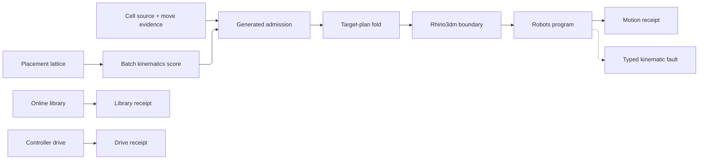

# [RASM_FABRICATION_ROBOT_CELL]

`RobotCell` owns serial-chain robot motion from admitted cell identity and canonical `Move` evidence through `Robots.Program` planning to the frozen `FabricationResult.Motion` wire. `CellTargetPlan` generates the waypoint space from one policy case or admits exact per-waypoint rows, so Cartesian and joint goals, posture, process interpolation, work frames, tools, commands, external mechanisms, custom external values, initialization groups, file partitions, and post overrides remain data under one `RobotProgram.Run` seam. Generated rows read their tool axis from the same `ToolAxisDemand` the machine inverse consumes, so a cell and a machine tool resolve one orientation law rather than two.

`RobotBoundary` is the only crossing between kernel RhinoCommon geometry and the binary-distinct Rhino3dm geometry that `Robots` consumes. `CellPlacementAxis` generates a six-axis base-pose lattice over one loaded `RobotSystem` whose `BasePlane` moves per candidate, and `CellPlacementMetric` scores each batch solve from provider feasibility, joint excursion, configuration continuity, step excursion, and peak-joint evidence. `CellLibrary.Run` brackets online-library ownership, `CellDrive.Run` resolves the controller channel from the loaded system, and no boundary leaks provider types into `FabricationInput` or `FabricationResult`.

## [01]-[INDEX]

- [01]-[ROBOT_CELL]: owns generated cell admission, target-plan and placement-space generation, the Rhino3dm boundary, `Robots` batch kinematics and compilation, typed diagnostics, online-library custody, controller drive, and the modality-polymorphic `RobotProgram.Run`.

## [02]-[ROBOT_CELL]

- Owner: `CellSource` closes library and embedded XML ingress; `RobotCell` admits source, base frame, and default TCP; `CellGoal` closes Cartesian and joint targets; generated `CellWaypoint` admits every per-occurrence target property; `CellTargetPlan` closes generated and explicit target series and derives both through one waypoint fold; `CellPolicy` admits compilation, dynamics, and inverse policy; `CellPlacementAxis` and `CellSampling` generate the search lattice; `CellPlacementMetric` and `CellPlacementPolicy` own scoring; `CellProgramRequest` and `CellProgramReceipt` collapse solve and placement modalities under one entry; `CellStation` and `CellMotion` retain per-waypoint provider evidence through frozen projection; `CellLibrary` and `CellDrive` own their effectful boundaries.
- Cases: `CellTargetPlan.Generated` derives one waypoint per admitted `Move` from a `CellInterpolation` row, a combinable `CellPosture` set, and a `ToolAxisDemand` resolved per waypoint index. `CellTargetPlan.Explicit` admits one `CellWaypoint` per move, and each waypoint selects `CellGoal.Cartesian` or `CellGoal.Joint` while carrying optional `Frame`, `Tool`, `Speed`, `Zone`, and `Command` values with coordinated external axes. Both cases converge on one waypoint series, so target projection, cardinality proof, and per-index fault detail are stated once.
- Entry: `RobotProgram.Run(RobotCell, Seq<Move>, CellProgramRequest)` dispatches `CellProgramRequest.Motion` and `CellProgramRequest.Placement` over one cell and move admission. `CellLibrary.Run` closes refresh, download, and removal through one bracketed `IO<CellLibraryReceipt>`, while `CellDrive.Run(RobotSystem)` closes upload, play, and pause through one `IO<CellDriveReceipt>` over the system's own `Remote` channel.
- Auto: aggregate admission accumulates independent `Move.Admit` failures, validates exact waypoint cardinality, enforces joint-vector and external-axis finiteness, and validates program partition indices before any provider constructor runs. `CellProgramRequest.Motion` loads once, projects targets once, compiles once, and reuses the same target set for diagnostics; `CellProgramRequest.Placement` loads once for the whole lattice and moves `RobotSystem.BasePlane` per candidate, because base placement is a frame assignment rather than a cell reload. `Program` owns look-ahead timing and manufacturer emission. Unclassified `KinematicSolution.Errors` remain provider diagnostics and never fabricate a `JointFault` witness, and an absent controller channel fails typed rather than dereferencing a null remote.
- Receipt: `CellProgramReceipt.Motion` carries the frozen `FabricationResult.Motion` move, joint, duration, and cell-code wire beside the `CellMotion` evidence that produced it, so per-station flange poses, realized configurations per `MechanicalGroup`, segment durations, and warnings reach the consumer instead of dying at the projection. `CellProgramReceipt.Placement` retains the selected cell with every ranked candidate and its keyed metrics, ranked by the same higher-is-better `Score` polarity `MachineMatch` carries. `CellLibraryReceipt` and `CellDriveReceipt` retain boundary facts without widening the motion wire; the upload arm preserves the posting-owned artifact key beside the exact `Robots.Program` handed to the controller, so `Posting/dialect` binds post-to-machine custody by digest equality with no second identity mint.
- Packages: `Robots` owns cell loading, Cartesian and joint targets, `RobotSystem.Kinematics`, `RobotSystem.BasePlane`, `PlaneToNumbers`/`NumbersToPlane`, program planning, posts, remotes, and online libraries; `Rhino3dm` stays behind `extern alias R3`; `MathNet.Numerics` owns lattice spacing and placement excursion; NodaTime owns `Duration`; RhinoCommon owns frames, intervals, and transforms; UnitsNet owns feed and angular-rate conversion at the provider boundary; `Thinktecture.Runtime.Extensions` owns generated admission and dispatch; `LanguageExt.Core` owns traversal, typed faults, immutable rows, `IO`, and bracketed lifetime; `Process/owner.md`, `Process/faults.md`, and `Kinematics/machine.md` supply frozen atoms.
- Growth: a robot motion posture is one `CellInterpolation` row, a target modality is one `CellGoal` case, a target-series policy is one `CellTargetPlan` case, an orientation modality is one `ToolAxisDemand` case on the machine owner, a base-search dimension is one `CellPlacementAxis` row, a placement objective is one `CellPlacementMetric` row, a controller verb is one `CellDrive` case, and an online-library verb is one `CellLibrary` case. Multi-mechanism programs remain one aligned target stream per `MechanicalGroup`, and external-axis values stay on each waypoint.
- Boundary: `RobotProgram` owns robot-cell kinematics and provider compilation; `MachineTool` owns non-robot topology and motion dynamics; swept cutter and holder collision stay on `Toolpath/guard.md`; CNC AST lowering stays on `Posting/program.md`. `CellWaypoint.Project`, `RobotProgram.PlaceCell`, and `RobotProgram.Rebase` are provider-boundary statement exemptions because provider target construction, RhinoCommon plane mutation, and the `ref`-returning `BasePlane` assignment are imperative seams. Provider strings never select a typed fault, provider geometry never crosses the alias boundary, and no verb family grows beside `RobotProgram.Run`.

```csharp signature
extern alias R3;

using LanguageExt;
using LanguageExt.Common;
using Rasm.Domain;
using MathNet.Numerics;
using NodaTime;
using Rasm.Fabrication.Process;
using Rhino.Geometry;
using Robots;
using Robots.Commands;
using Thinktecture;
using static LanguageExt.Prelude;

namespace Rasm.Fabrication.Kinematics;

// --- [TYPES] --------------------------------------------------------------------------------------------------------------------------------------
[SmartEnum<string>]
public sealed partial class CellMesh {
    public static readonly CellMesh Headless = new("headless", load: false);
    public static readonly CellMesh Visual = new("visual", load: true);

    public bool Load { get; }
}

[SmartEnum<string>]
public sealed partial class CellInterpolation {
    public static readonly CellInterpolation Joint = new("joint", Motions.Joint);
    public static readonly CellInterpolation Linear = new("linear", Motions.Linear);
    public static readonly CellInterpolation Process = new("process", Motions.Process);

    internal Motions Native { get; }
}

[SmartEnum<string>]
public sealed partial class CellPosture {
    public static readonly CellPosture Shoulder = new("shoulder", RobotConfigurations.Shoulder);
    public static readonly CellPosture Elbow = new("elbow", RobotConfigurations.Elbow);
    public static readonly CellPosture Wrist = new("wrist", RobotConfigurations.Wrist);

    internal RobotConfigurations Native { get; }

    internal static Option<RobotConfigurations> Project(Set<CellPosture> posture) =>
        posture.IsEmpty
            ? None
            : Some(posture.Fold(RobotConfigurations.None, static (combined, row) => combined | row.Native));
}

[SmartEnum<string>]
public sealed partial class CellDriveKind {
    public static readonly CellDriveKind Uploaded = new("uploaded");
    public static readonly CellDriveKind Playing = new("playing");
    public static readonly CellDriveKind Paused = new("paused");
}

[SmartEnum<string>]
public sealed partial class CellPlacementAxis {
    public static readonly CellPlacementAxis X = new(
        "x", order: 0, project: static (frame, value) => Transform.Translation(value * frame.XAxis));
    public static readonly CellPlacementAxis Y = new(
        "y", order: 1, project: static (frame, value) => Transform.Translation(value * frame.YAxis));
    public static readonly CellPlacementAxis Z = new(
        "z", order: 2, project: static (frame, value) => Transform.Translation(value * frame.ZAxis));
    public static readonly CellPlacementAxis Roll = new(
        "roll", order: 3, project: static (frame, value) => Transform.Rotation(value, frame.XAxis, frame.Origin));
    public static readonly CellPlacementAxis Pitch = new(
        "pitch", order: 4, project: static (frame, value) => Transform.Rotation(value, frame.YAxis, frame.Origin));
    public static readonly CellPlacementAxis Yaw = new(
        "yaw", order: 5, project: static (frame, value) => Transform.Rotation(value, frame.ZAxis, frame.Origin));

    public int Order { get; }
    internal Func<Plane, double, Transform> Project { get; }
}

[SmartEnum<string>]
public sealed partial class CellPlacementMetric {
    public static readonly CellPlacementMetric Feasibility = new(
        "feasibility",
        measure: static solutions => solutions.Sum(static solution => solution.Errors.Count));
    public static readonly CellPlacementMetric Travel = new(
        "travel",
        measure: static solutions => Steps(solutions).Sum());
    public static readonly CellPlacementMetric Posture = new(
        "posture",
        measure: static solutions => solutions.Zip(solutions.Skip(1))
            .Count(static pair => pair.Item1.Configuration != pair.Item2.Configuration));
    public static readonly CellPlacementMetric PeakStep = new(
        "peak-step",
        measure: static solutions => Steps(solutions).Fold(0.0, static (peak, step) => Math.Max(peak, step)));
    public static readonly CellPlacementMetric PeakJoint = new(
        "peak-joint",
        measure: static solutions => solutions
            .Bind(static solution => toSeq(solution.Joints))
            .Fold(0.0, static (peak, joint) => Math.Max(peak, Math.Abs(joint))));

    internal Func<Seq<KinematicSolution>, double> Measure { get; }

    private static Seq<double> Steps(Seq<KinematicSolution> solutions) =>
        solutions.Map(static solution => solution.Joints)
            .Zip(solutions.Skip(1).Map(static solution => solution.Joints))
            .Map(static pair => Distance.Manhattan(pair.Item1, pair.Item2));
}

[Union(ConversionFromValue = ConversionOperatorsGeneration.None)]
public abstract partial record CellSource {
    private CellSource() { }

    public sealed record Library(string Name, CellMesh Meshes) : CellSource;
    public sealed record Embedded(string Xml) : CellSource;
}

[Union(ConversionFromValue = ConversionOperatorsGeneration.None)]
public abstract partial record CellGoal {
    private CellGoal() { }

    public sealed record Cartesian(Option<Plane> Pose, Set<CellPosture> Posture, CellInterpolation Interpolation) : CellGoal;
    public sealed record Joint(Arr<double> Joints) : CellGoal;
}

[Union(ConversionFromValue = ConversionOperatorsGeneration.None)]
public abstract partial record CellTargetPlan {
    private CellTargetPlan() { }

    public sealed record Generated(CellInterpolation Feed, Set<CellPosture> Posture, ToolAxisDemand Orientation) : CellTargetPlan;
    public sealed record Explicit(Seq<CellWaypoint> Rows) : CellTargetPlan;

    internal bool IsValid => Switch(
        generated: static row => row.Feed is not null
            && row.Orientation is not null
            && row.Orientation.IsValid
            && row.Posture.ForAll(static posture => posture is not null),
        explicit: static row => !row.Rows.IsEmpty && row.Rows.ForAll(static waypoint => waypoint is not null));

    internal Fin<Seq<Target>> Resolve(RobotCell cell, Seq<Move> moves, MotionDynamics dynamics, InversePolicy inverse) =>
        Rows(cell, moves, inverse).Bind(rows => rows
            .Map((row, index) => (Row: row, Move: moves[index]))
            .TraverseM(pair => Capture(pair.Row, cell, pair.Move, dynamics))
            .As());

    private Fin<Seq<CellWaypoint>> Rows(RobotCell cell, Seq<Move> moves, InversePolicy inverse) => Switch(
        state: (Cell: cell, Moves: moves, Inverse: inverse),
        generated: static (state, plan) => state.Moves
            .Map((move, index) => (Move: move, Index: index))
            .Traverse(row => CellWaypoint.Generated(row.Move, row.Index, plan, state.Cell, state.Inverse).ToValidation())
            .As()
            .ToFin(),
        explicit: static (state, plan) => plan.Rows.Count == state.Moves.Count
            ? Fin.Succ(plan.Rows)
            : Fin.Fail<Seq<CellWaypoint>>(new GeometryFault.DegenerateInput(Kind.Curve, -1, "robot-cell:target-census").ToError()));

    private static Fin<Target> Capture(CellWaypoint waypoint, RobotCell cell, Move move, MotionDynamics dynamics) =>
        Try.lift(() => waypoint.Project(cell, move, dynamics)).Run()
            .MapFail(static error => new GeometryFault.DegenerateInput(Kind.Curve, -1, $"robot-cell:target:{error.Message}").ToError());
}

[Union(ConversionFromValue = ConversionOperatorsGeneration.None)]
public abstract partial record CellProgramRequest {
    private CellProgramRequest() { }

    public sealed record Motion(CellPolicy Policy) : CellProgramRequest;
    public sealed record Placement(CellPolicy Policy, CellPlacementPolicy Search) : CellProgramRequest;
}

[Union(ConversionFromValue = ConversionOperatorsGeneration.None)]
public abstract partial record CellProgramReceipt {
    private CellProgramReceipt() { }

    public sealed record Motion(FabricationResult.Motion Result, CellMotion Evidence) : CellProgramReceipt;
    public sealed record Placement(CellPlacementReceipt Result) : CellProgramReceipt;
}

[Union(ConversionFromValue = ConversionOperatorsGeneration.None)]
public abstract partial record CellLibrary {
    private CellLibrary() { }

    public sealed record Refresh : CellLibrary;
    public sealed record Download(LibraryItem Item) : CellLibrary;
    public sealed record Remove(LibraryItem Item) : CellLibrary;

    public IO<CellLibraryReceipt> Run() =>
        IO.lift(static () => new OnlineLibrary()).Bracket(
            Use: library => Switch(
                state: library,
                refresh: static (source, _) => IO.liftAsync(async () => {
                    await source.UpdateLibraryAsync().ConfigureAwait(false);
                    return new CellLibraryReceipt(toSeq(source.Libraries.Keys));
                }),
                download: static (source, action) => IO.liftAsync(async () => {
                    await source.DownloadLibraryAsync(action.Item).ConfigureAwait(false);
                    return new CellLibraryReceipt(toSeq(source.Libraries.Keys));
                }),
                remove: static (source, action) => IO.lift(() => {
                    source.RemoveDownloadedLibrary(action.Item);
                    return new CellLibraryReceipt(toSeq(source.Libraries.Keys));
                })),
            Fin: static library => IO.lift(library.Dispose));
}

[Union(ConversionFromValue = ConversionOperatorsGeneration.None)]
public abstract partial record CellDrive {
    private CellDrive() { }

    public sealed record Upload(
        Program Program,
        ContentKey Artifact,
        Func<Program, ReadOnlyMemory<byte>> Canonicalize) : CellDrive;
    public sealed record Play : CellDrive;
    public sealed record Pause : CellDrive;

    // Delivery custody preserves the posting-owned artifact key at the controller channel.
    public IO<CellDriveReceipt> Run(RobotSystem system) =>
        IO.lift(() => Optional(system).Bind(static host => Optional(host.Remote)))
            .Bind(channel => channel.Match(
                Some: remote => Switch(
                    state: remote,
                    upload: static (drive, action) => action.Program is not null
                        && action.Artifact is { Kind: var kind } && kind == EgressKind.CutProgram
                        && action.Canonicalize is not null
                            ? IO.lift(() => action.Canonicalize(action.Program))
                                .Bind(bytes => ContentKey.Of(EgressKind.CutProgram, bytes.Span) is var transferred
                                    && transferred.Digest == action.Artifact.Digest
                                        ? IO.lift(() => {
                                            drive.Upload(action.Program);
                                            return new CellDriveReceipt(
                                                CellDriveKind.Uploaded,
                                                toSeq(drive.Log),
                                                Some(transferred),
                                                Optional(drive.IP));
                                        })
                                        : IO.fail<CellDriveReceipt>(
                                            new GeometryFault.DegenerateInput(
                                                Kind.Curve,
                                                -1,
                                                "robot-cell:upload-digest").ToError()))
                            : IO.fail<CellDriveReceipt>(
                                new GeometryFault.DegenerateInput(Kind.Curve, -1, "robot-cell:upload-artifact").ToError()),
                    play: static (drive, _) => IO.lift(() => {
                        drive.Play();
                        return new CellDriveReceipt(CellDriveKind.Playing, toSeq(drive.Log), None, Optional(drive.IP));
                    }),
                    pause: static (drive, _) => IO.lift(() => {
                        drive.Pause();
                        return new CellDriveReceipt(CellDriveKind.Paused, toSeq(drive.Log), None, Optional(drive.IP));
                    })),
                None: () => IO.fail<CellDriveReceipt>(
                    new GeometryFault.DegenerateInput(Kind.Curve, -1, "robot-cell:remote-absent").ToError())));
}

// --- [MODELS] -------------------------------------------------------------------------------------------------------------------------------------
[ComplexValueObject]
public sealed partial class RobotCell {
    public CellSource Source { get; }
    public Plane BaseFrame { get; }
    public Plane ToolFrame { get; }

    [BoundaryAdapter]
    static partial void ValidateFactoryArguments(
        ref ValidationError? validationError,
        ref CellSource source,
        ref Plane baseFrame,
        ref Plane toolFrame) {
        bool sourceValid = source is not null && source.Switch(
            library: static row => row.Meshes is not null && !string.IsNullOrWhiteSpace(row.Name),
            embedded: static row => !string.IsNullOrWhiteSpace(row.Xml));
        if (!sourceValid || !baseFrame.IsValid || !toolFrame.IsValid)
            validationError = new ValidationError("robot cell source and frames must be valid");
    }

    internal Fin<RobotSystem> Load(Option<IPostProcessor> post) => Source.Switch(
        state: (Base: RobotBoundary.ToR3(BaseFrame), Post: post.IfNoneUnsafe((IPostProcessor?)null)),
        library: static (state, row) => Capture(() => FileIO.LoadRobotSystem(row.Name, state.Base, row.Meshes.Load, state.Post)),
        embedded: static (state, row) => Capture(() => FileIO.ParseRobotSystem(row.Xml, state.Base, state.Post)));

    private static Fin<RobotSystem> Capture(Func<RobotSystem> load) =>
        Try.lift(load).Run().MapFail(static error => new GeometryFault.DegenerateInput(Kind.Curve, -1, $"robot-cell:load:{error.Message}").ToError());
}

[ComplexValueObject]
public sealed partial class CellWaypoint {
    public CellGoal Goal { get; }
    public Option<Frame> Frame { get; }
    public Option<Tool> Tool { get; }
    public Option<Speed> Speed { get; }
    public Option<Zone> Zone { get; }
    public Option<Command> Command { get; }
    public Arr<double> External { get; }
    public Arr<string> ExternalCustom { get; }

    internal static Fin<CellWaypoint> Generated(Move move, int index, CellTargetPlan.Generated plan, RobotCell cell, InversePolicy inverse) =>
        plan.Orientation
            .AxisAt(index, cell.ToolFrame, inverse.ConeSamples)
            .Map(axis => new Plane(move.Target, axis))
            .Map(pose => Create(
                goal: new CellGoal.Cartesian(
                    Some(pose),
                    plan.Posture,
                    move is Move.Rapid ? CellInterpolation.Joint : plan.Feed),
                frame: None,
                tool: None,
                speed: None,
                zone: None,
                command: None,
                external: [],
                externalCustom: []));

    [BoundaryAdapter]
    static partial void ValidateFactoryArguments(
        ref ValidationError? validationError,
        ref CellGoal goal,
        ref Option<Frame> frame,
        ref Option<Tool> tool,
        ref Option<Speed> speed,
        ref Option<Zone> zone,
        ref Option<Command> command,
        ref Arr<double> external,
        ref Arr<string> externalCustom) {
        bool goalValid = goal is not null && goal.Switch(
            cartesian: static row => row.Interpolation is not null
                && row.Pose.ForAll(static pose => pose.IsValid)
                && row.Posture.ForAll(static posture => posture is not null),
            joint: static row => !row.Joints.IsEmpty && row.Joints.ForAll(double.IsFinite));
        bool optionPayloads = frame.ForAll(static value => value is not null)
            && tool.ForAll(static value => value is not null)
            && speed.ForAll(static value => value is not null)
            && zone.ForAll(static value => value is not null)
            && command.ForAll(static value => value is not null);
        if (!goalValid || !optionPayloads || external.Exists(static value => !double.IsFinite(value))
            || externalCustom.Exists(string.IsNullOrWhiteSpace))
            validationError = new ValidationError("robot cell waypoint must carry a valid goal, provider properties, and external axes");
    }

    internal Target Project(RobotCell cell, Move move, MotionDynamics dynamics) {
        Robots.Tool tool = Tool.IfNone(Robots.Tool.Default with { Tcp = RobotBoundary.ToR3(cell.ToolFrame) });
        Robots.Speed speed = Speed.IfNone(RobotBoundary.SpeedOf(dynamics, move));
        Robots.Zone zone = Zone.IfNone(RobotBoundary.ZoneOf(dynamics));
        Robots.Frame frame = Frame.IfNone(Robots.Frame.Default);
        Robots.Command command = Command.IfNone(Robots.Command.Default);
        double[]? external = External.IsEmpty ? null : External.ToArray();
        string[]? externalCustom = ExternalCustom.IsEmpty ? null : ExternalCustom.ToArray();
        return Goal.Switch(
            state: (Cell: cell, Move: move, Tool: tool, Speed: speed, Zone: zone, Frame: frame, Command: command, External: external, Custom: externalCustom),
            cartesian: static (state, goal) => new CartesianTarget(
                plane: RobotBoundary.ToR3(goal.Pose.IfNone(new Plane(state.Move.Target, state.Cell.ToolFrame.XAxis, state.Cell.ToolFrame.YAxis))),
                configuration: CellPosture.Project(goal.Posture).Map(static value => (RobotConfigurations?)value).IfNone((RobotConfigurations?)null),
                motion: goal.Interpolation.Native,
                tool: state.Tool,
                speed: state.Speed,
                zone: state.Zone,
                command: state.Command,
                frame: state.Frame,
                external: state.External,
                externalCustom: state.Custom),
            joint: static (state, goal) => new JointTarget(
                joints: goal.Joints.ToArray(),
                tool: state.Tool,
                speed: state.Speed,
                zone: state.Zone,
                command: state.Command,
                frame: state.Frame,
                external: state.External,
                externalCustom: state.Custom));
    }

}

[ComplexValueObject]
public sealed partial class CellPolicy {
    public MotionDynamics Dynamics { get; }
    public InversePolicy Inverse { get; }
    public CellTargetPlan Targets { get; }
    public string ProgramName { get; }
    public Option<Group> Init { get; }
    public Arr<int> MultiFileIndices { get; }
    public Option<IPostProcessor> Post { get; }

    public static CellPolicy Canonical { get; } = Create(
        dynamics: MotionDynamics.Canonical,
        inverse: InversePolicy.Canonical,
        targets: new CellTargetPlan.Generated(
            CellInterpolation.Linear,
            Set<CellPosture>(),
            new ToolAxisDemand.Fixed(-Vector3d.ZAxis)),
        programName: nameof(RobotProgram),
        init: None,
        multiFileIndices: [],
        post: None);

    [BoundaryAdapter]
    static partial void ValidateFactoryArguments(
        ref ValidationError? validationError,
        ref MotionDynamics dynamics,
        ref InversePolicy inverse,
        ref CellTargetPlan targets,
        ref string programName,
        ref Option<Group> init,
        ref Arr<int> multiFileIndices,
        ref Option<IPostProcessor> post) {
        programName = programName?.Trim() ?? string.Empty;
        bool partitions = multiFileIndices.IsEmpty || multiFileIndices[0] == 0
            && multiFileIndices.ForAll(static index => index >= 0)
            && multiFileIndices.Zip(multiFileIndices.Skip(1)).ForAll(static pair => pair.Item1 < pair.Item2);
        bool optionPayloads = init.ForAll(static group => group is not null) && post.ForAll(static processor => processor is not null);
        if (dynamics is null || inverse is null || targets is null || !targets.IsValid
            || !Program.IsValidIdentifier(programName, out _) || !partitions || !optionPayloads)
            validationError = new ValidationError("robot cell policy must carry valid dynamics, targets, program identity, and partitions");
    }
}

[ComplexValueObject]
public sealed partial class CellSampling {
    public Rhino.Geometry.Interval Domain { get; }
    public int Count { get; }

    internal Seq<double> Values => Count == 1
        ? Seq(0.5 * (Domain.Min + Domain.Max))
        : toSeq(Generate.LinearSpaced(Count, Domain.Min, Domain.Max));

    [BoundaryAdapter]
    static partial void ValidateFactoryArguments(
        ref ValidationError? validationError,
        ref Rhino.Geometry.Interval domain,
        ref int count) {
        if (!domain.IsValid || count <= 0)
            validationError = new ValidationError("cell sampling requires a valid domain and a positive count");
    }
}

[ComplexValueObject]
public sealed partial class CellPlacementPolicy {
    public HashMap<CellPlacementAxis, CellSampling> Space { get; }
    public Option<Arr<double>> SeedJoints { get; }
    public HashMap<CellPlacementMetric, double> Weights { get; }
    public int MaximumCandidates { get; }

    [BoundaryAdapter]
    static partial void ValidateFactoryArguments(
        ref ValidationError? validationError,
        ref HashMap<CellPlacementAxis, CellSampling> space,
        ref Option<Arr<double>> seedJoints,
        ref HashMap<CellPlacementMetric, double> weights,
        ref int maximumCandidates) {
        bool axes = CellPlacementAxis.Items.All(axis => space.Find(axis).Exists(static sample => sample is not null));
        bool metrics = CellPlacementMetric.Items.All(metric => weights.Find(metric)
            .Exists(static weight => double.IsFinite(weight) && weight >= 0.0));
        bool seed = seedJoints.ForAll(static joints => !joints.IsEmpty && joints.ForAll(double.IsFinite));
        bool bounded = maximumCandidates > 0 && toSeq(CellPlacementAxis.Items)
            .Fold(Some(1), (count, axis) =>
                from total in count
                from sample in space.Find(axis)
                where sample is not null && total <= maximumCandidates / sample.Count
                select total * sample.Count)
            .IsSome;
        if (!axes || !metrics || !seed || !bounded
            || CellPlacementMetric.Items.Sum(metric => weights.Find(metric).IfNone(0.0)) <= 0.0)
            validationError = new ValidationError("cell placement requires every pose axis, every metric weight, an optional finite continuity seed, and a bounded candidate lattice");
    }
}

public sealed record CellLibraryReceipt(Seq<string> Names);

public sealed record CellDriveReceipt(CellDriveKind Kind, Seq<string> Log, Option<ContentKey> Uploaded, Option<string> Controller);

public sealed record CellStation(
    int Index,
    Arr<double> Joints,
    Seq<Plane> FlangePoses,
    Seq<RobotConfigurations> Configurations,
    Duration Duration);

public sealed record CellMotion(
    Seq<Move> Moves,
    Seq<CellStation> Stations,
    Duration Cycle,
    Seq<string> CellCode,
    Seq<string> Warnings) {
    public Fin<FabricationResult.Motion> ToResult() => MotionEvidence
        .Admit(
            Stations.Map(static station => station.Joints),
            Stations.Map(static station => station.Duration),
            Cycle,
            CellCode,
            Warnings)
        .Map(evidence => new FabricationResult.Motion(Moves, Seq<MotionDirective>(), evidence, Seq<ContentKey>()));
}

public sealed record CellPlacementCandidate(
    RobotCell Cell,
    Plane NormalizedBaseFrame,
    Seq<Arr<double>> Joints,
    HashMap<CellPlacementMetric, double> Metrics,
    double Score);

public sealed record CellPlacementReceipt(CellPlacementCandidate Selected, Seq<CellPlacementCandidate> Ranked);

// --- [OPERATIONS] ---------------------------------------------------------------------------------------------------------------------------------
public static class RobotProgram {
    public static Fin<CellProgramReceipt> Run(RobotCell cell, Seq<Move> moves, CellProgramRequest request) =>
        from admitted in Admit(cell, moves)
        from job in Optional(request).ToFin(new GeometryFault.DegenerateInput(Kind.Curve, -1, "robot-cell:request").ToError())
        from receipt in job.Switch(
            state: admitted,
            motion: static (state, row) => Optional(row.Policy)
                .ToFin(new GeometryFault.DegenerateInput(Kind.Curve, -1, "robot-cell:motion-policy").ToError())
                .Bind(policy => Solve(state, policy)),
            placement: static (state, row) => (
                    Optional(row.Policy).ToValidation(new GeometryFault.DegenerateInput(Kind.Curve, -1, "robot-cell:motion-policy").ToError()),
                    Optional(row.Search).ToValidation(new GeometryFault.DegenerateInput(Kind.Curve, -1, "robot-cell:placement-policy").ToError()))
                .Apply(static (policy, search) => (Policy: policy, Search: search))
                .ToFin()
                .Bind(admittedPolicy => Place(state, admittedPolicy.Policy, admittedPolicy.Search)))
        select receipt;

    private static Fin<(RobotCell Cell, Seq<Move> Moves)> Admit(RobotCell cell, Seq<Move> moves) =>
        from admittedCell in Optional(cell).ToFin(new GeometryFault.DegenerateInput(Kind.Curve, -1, "robot-cell:cell").ToError())
        from admittedMoves in moves.Traverse(static move => Move.Admit(move).ToValidation()).As().ToFin()
        from _ in admittedMoves.IsEmpty
            ? Fin.Fail<Unit>(new GeometryFault.DegenerateInput(Kind.Curve, -1, "robot-cell:moves").ToError())
            : Fin.Succ(unit)
        select (Cell: admittedCell, Moves: admittedMoves);

    private static Fin<CellProgramReceipt> Solve((RobotCell Cell, Seq<Move> Moves) admitted, CellPolicy policy) =>
        from system in admitted.Cell.Load(policy.Post)
        from targets in policy.Targets.Resolve(admitted.Cell, admitted.Moves, policy.Dynamics, policy.Inverse)
        from program in Compile(system, targets, policy)
        from motion in Project(admitted.Moves, program)
        from result in motion.ToResult()
        select new CellProgramReceipt.Motion(result, motion);

    private static Fin<CellProgramReceipt> Place(
        (RobotCell Cell, Seq<Move> Moves) admitted,
        CellPolicy policy,
        CellPlacementPolicy placement) =>
        from system in admitted.Cell.Load(policy.Post)
        from cells in Samples(admitted.Cell, placement)
        from candidates in cells.TraverseM(candidate => Evaluate(system, candidate, admitted.Moves, policy, placement)).As()
        let ranked = candidates.OrderByDescending(static candidate => candidate.Score).ToSeq()
        from selected in SelectPlacement(ranked)
        select new CellProgramReceipt.Placement(new CellPlacementReceipt(selected, ranked));

    private static Fin<Program> Compile(RobotSystem system, Seq<Target> targets, CellPolicy policy) =>
        from _ in policy.MultiFileIndices.ForAll(index => index < targets.Count)
            ? Fin.Succ(unit)
            : Fin.Fail<Unit>(new GeometryFault.DegenerateInput(Kind.Curve, -1, "robot-cell:partition-range").ToError())
        from program in Try.lift(() => new Program(
                name: policy.ProgramName,
                robotSystem: system,
                toolpaths: targets.Map(static target => (IToolpath)target).ToArray(),
                initCommands: policy.Init.IfNoneUnsafe((Group?)null),
                multiFileIndices: policy.MultiFileIndices.IsEmpty ? null : policy.MultiFileIndices.ToArray(),
                stepSize: policy.Dynamics.ChordTolerance))
            .Run()
            .MapFail(static error => new GeometryFault.DegenerateInput(Kind.Curve, -1, $"robot-cell:program:{error.Message}").ToError())
        select program;

    private static Fin<Seq<RobotCell>> Samples(RobotCell cell, CellPlacementPolicy policy) =>
        from poses in toSeq(CellPlacementAxis.Items).OrderBy(static axis => axis.Order).Fold(
            Fin.Succ(Seq(HashMap<CellPlacementAxis, double>.Empty)),
            (generated, axis) =>
                from rows in generated
                from sampling in policy.Space.Find(axis)
                    .ToFin(new GeometryFault.DegenerateInput(Kind.Curve, -1, $"robot-cell:placement-axis:{axis.Key}").ToError())
                select rows.Bind(row => sampling.Values.Map(value => row.Add(axis, value))).ToSeq())
        from cells in poses.TraverseM(pose => PlaceCell(cell, pose)).As()
        select cells;

    private static Fin<RobotCell> PlaceCell(RobotCell cell, HashMap<CellPlacementAxis, double> pose) =>
        from transforms in toSeq(CellPlacementAxis.Items)
            .OrderBy(static axis => axis.Order)
            .TraverseM(axis => pose.Find(axis)
                .ToFin(new GeometryFault.DegenerateInput(Kind.Curve, -1, $"robot-cell:placement-axis:{axis.Key}").ToError())
                .Map(value => axis.Project(cell.BaseFrame, value)))
            .As()
        from placed in Try.lift(() => {
                Plane frame = cell.BaseFrame;
                frame.Transform(transforms.Fold(Transform.Identity, static (combined, transform) => combined * transform));
                return RobotCell.Create(cell.Source, frame, cell.ToolFrame);
            })
            .Run()
            .MapFail(static error => new GeometryFault.DegenerateInput(Kind.Curve, -1, $"robot-cell:placement-pose:{error.Message}").ToError())
        select placed;

    private static Fin<CellPlacementCandidate> Evaluate(
        RobotSystem system,
        RobotCell candidate,
        Seq<Move> moves,
        CellPolicy policy,
        CellPlacementPolicy placement) =>
        from targets in policy.Targets.Resolve(candidate, moves, policy.Dynamics, policy.Inverse)
        from normalized in Rebase(system, candidate.BaseFrame)
        from solutions in Try.lift(() => system.Kinematics(
                targets.ToArray(),
                placement.SeedJoints.Map(static seed => (IReadOnlyList<double[]?>)new double[]?[] { seed.ToArray() }).IfNoneUnsafe(null)))
            .Run()
            .Map(static rows => toSeq(rows))
            .MapFail(static error => new GeometryFault.DegenerateInput(Kind.Curve, -1, $"robot-cell:placement:{error.Message}").ToError())
        let joints = solutions.Map(static solution => solution.Joints.ToArr())
        let metrics = toSeq(CellPlacementMetric.Items).Fold(
            HashMap<CellPlacementMetric, double>.Empty,
            (measured, metric) => measured.Add(metric, metric.Measure(solutions)))
        let score = -CellPlacementMetric.Items.Sum(metric =>
            placement.Weights.Find(metric).IfNone(0.0) * metrics.Find(metric).IfNone(0.0))
        select new CellPlacementCandidate(candidate, normalized, joints, metrics, score);

    private static Fin<Plane> Rebase(RobotSystem system, Plane frame) =>
        Try.lift(() => {
                system.BasePlane = RobotBoundary.ToR3(frame);
                return RobotBoundary.FromR3(system.NumbersToPlane(system.PlaneToNumbers(system.BasePlane)));
            })
            .Run()
            .MapFail(static error => new GeometryFault.DegenerateInput(Kind.Curve, -1, $"robot-cell:placement-frame:{error.Message}").ToError());

    private static Fin<CellPlacementCandidate> SelectPlacement(Seq<CellPlacementCandidate> ranked) =>
        from first in ranked.Head.ToFin(new GeometryFault.DegenerateInput(Kind.Curve, -1, "robot-cell:placement-empty").ToError())
        from selected in ranked
            .Filter(static candidate => candidate.Metrics.Find(CellPlacementMetric.Feasibility).Exists(static value => value == 0.0))
            .Head
            .ToFin(new GeometryFault.DegenerateInput(Kind.Curve, -1,
                $"robot-cell:placement-infeasible:{first.Metrics.Find(CellPlacementMetric.Feasibility).IfNone(0.0)}").ToError())
        select selected;

    private static Fin<CellMotion> Project(Seq<Move> moves, Program program) {
        Seq<string> errors = toSeq(program.Errors);
        return errors.IsEmpty
            ? Fin.Succ(new CellMotion(
                Moves: moves,
                Stations: toSeq(program.Targets).Map(static target => new CellStation(
                    Index: target.Index,
                    Joints: target.Joints.ToArr(),
                    FlangePoses: toSeq(target.ProgramTargets).Choose(static row => row.Kinematics.Planes.Length < 2
                        ? Option<Plane>.None
                        : Some(RobotBoundary.FromR3(row.Kinematics.Planes[^2]))),
                    Configurations: toSeq(target.ProgramTargets).Map(static row => row.Kinematics.Configuration),
                    Duration: Duration.FromSeconds(target.DeltaTime))),
                Cycle: Duration.FromSeconds(program.Duration),
                CellCode: program.Code is null
                    ? Seq<string>()
                    : toSeq(program.Code).Bind(static group => toSeq(group).Bind(static file => toSeq(file))),
                Warnings: toSeq(program.Warnings)))
            : Diagnose(program, errors);
    }

    private static Fin<CellMotion> Diagnose(Program program, Seq<string> programErrors) =>
        Fin.Fail<CellMotion>(toSeq(program.Targets)
            .Bind(static target => toSeq(target.ProgramTargets).Map(row => (Target: target.Index, Solution: row.Kinematics)))
            .Find(static row => row.Solution.Errors.Count > 0)
            .Match(
                Some: row => new GeometryFault.DegenerateInput(Kind.Curve, -1,
                    $"robot-cell:kinematics:{row.Target}:{string.Join('|', row.Solution.Errors)}").ToError(),
                None: () => new GeometryFault.DegenerateInput(Kind.Curve, -1,
                    $"robot-cell:program:{programErrors.Head.IfNone("unknown")}").ToError()));
}

internal static class RobotBoundary {
    public static R3::Rhino.Geometry.Plane ToR3(Plane plane) =>
        new(
            new R3::Rhino.Geometry.Point3d(plane.Origin.X, plane.Origin.Y, plane.Origin.Z),
            new R3::Rhino.Geometry.Vector3d(plane.XAxis.X, plane.XAxis.Y, plane.XAxis.Z),
            new R3::Rhino.Geometry.Vector3d(plane.YAxis.X, plane.YAxis.Y, plane.YAxis.Z));

    public static Plane FromR3(R3::Rhino.Geometry.Plane plane) =>
        new(
            new Point3d(plane.Origin.X, plane.Origin.Y, plane.Origin.Z),
            new Vector3d(plane.XAxis.X, plane.XAxis.Y, plane.XAxis.Z),
            new Vector3d(plane.YAxis.X, plane.YAxis.Y, plane.YAxis.Z));

    public static Speed SpeedOf(MotionDynamics dynamics, Move move) =>
        Speed.Default with {
            TranslationSpeed = UnitsNet.Speed.FromMillimetersPerMinutes(dynamics.FeedFor(move)).MillimetersPerSecond,
            RotationSpeed = new UnitsNet.RotationalSpeed(
                dynamics.RotaryFeed,
                UnitsNet.Units.RotationalSpeedUnit.DegreePerMinute).RadiansPerSecond,
            TranslationAccel = dynamics.Acceleration,
            AxisAccel = dynamics.RotaryAcceleration,
        };

    public static Zone ZoneOf(MotionDynamics dynamics) =>
        Zone.Default with {
            Distance = dynamics.CornerTolerance,
            Rotation = dynamics.OrientationToleranceRad,
            RotationExternal = dynamics.OrientationToleranceRad,
        };
}
```



## [03]-[RESEARCH]

<!-- source-only: research row template:
[TOKEN]-[OPEN|BLOCKED]: <exact question>; <verification route>.
[SPLIT_MEMBER]-[OPEN]: does `shape-core` expose `split_all`; verify against the member rail.
-->

(none)
